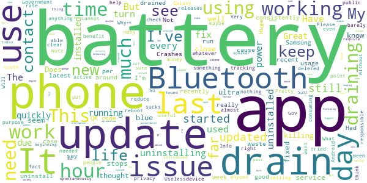

# COVIDSafe
App version ``2.3``

Analyzed with [covid-apps-observer](http://github.com/covid-apps-observer) project, version ``0.1``

## App overview
| | |
|-------------------------|-------------------------| 
| **Name**&nbsp;&nbsp;&nbsp;&nbsp;&nbsp;&nbsp;&nbsp;&nbsp;&nbsp;&nbsp;&nbsp;&nbsp;&nbsp;&nbsp;&nbsp;&nbsp;&nbsp;&nbsp;&nbsp;&nbsp;&nbsp;&nbsp;&nbsp;&nbsp;&nbsp;&nbsp;&nbsp;&nbsp;&nbsp;&nbsp;&nbsp;&nbsp;&nbsp;&nbsp;&nbsp;&nbsp;&nbsp;&nbsp;&nbsp;&nbsp;  | COVIDSafe |
| **Unique identifier** | au.gov.health.covidsafe |
| **Link to Google Play** | [https://play.google.com/store/apps/details?id=au.gov.health.covidsafe](https://play.google.com/store/apps/details?id=au.gov.health.covidsafe) |
| **Summary**  | COVIDSafe is a community-based way to stop the spread of COVID-19. |
| **Privacy policy** | [https://covidsafe.gov.au/privacy-policy.html](https://covidsafe.gov.au/privacy-policy.html) |
| **Latest version** | 2.3 |
| **Last update** | 2021-02-25 06:55:46 |
| **Recent changes** | This update includes a way to check the latest advice on current COVID-19 restrictions for every state and territory, including domestic travel, hotspots and COVID-19 case locations. |
| **Installs**  | 1,000,000+ |
| **Category** | Health & Fitness |
| **First release** | Apr 25, 2020 |
| **Size**  | 13M |
| **Supported Android version**  | 5.0 and up |

### Description
> COVIDSafe app has been developed by the Australian Government Department of Health to help keep the community safe from coronavirus (COVID-19). Together, let’s help stop the spread and keep ourselves and each other healthy.
 COVIDSafe uses the Bluetooth® technology on your mobile phone to look for other devices with COVIDSafe installed. Your device will take a note of contact you’ve had with other users by securely logging the other user’s reference code. If you or someone you’ve been in contact with is diagnosed with COVID-19, the close contact information securely stored in your phone can be uploaded and used—with your consent—by state and territory health officials to quickly inform people who’ve been exposed to the virus.
 How you can help stop the spread of COVID-19:
 • Download the COVIDSafe app
 • Register using your mobile phone number, name, age range and postcode
 • Turn on Bluetooth®
 • Check that COVIDSafe is running when you are out and about or are likely to come into contact with others
 • If you test positive for COVID-19, you can consent for your close contact information to be used by state and territory health officials to contact people who may have been exposed. If you’ve been exposed to the virus by someone you’ve been in close contact with, state and territory health officials will be able to contact you quickly so you can get the support you need
 COVIDSafe is an Australian Government Department of Health initiative. Visit https://www.health.gov.au/resources/apps-and-tools/covidsafe-app for more information.

### User interface
The developers of the app provide the following screenshots in the Google play store.
| | | |
|:-------------------------:|:-------------------------:|:-------------------------:|
 |   |   |   | 
 |   |  

## Development team
In the following we report the main information provided by the development team in the Google play store.

| | |
|-------------------------|-------------------------|
| **Developer**  | Australian Department of Health |
| **Website**  | [https://www.health.gov.au/resources/apps-and-tools/covidsafe-app#covidsafe-app-help](https://www.health.gov.au/resources/apps-and-tools/covidsafe-app#covidsafe-app-help) |
| **Email** | support@COVIDSafe.gov.au |
| **Physical address**  | - |
| **Other developed apps**  | [https://play.google.com/store/apps/developer?id=Australian+Department+of+Health](https://play.google.com/store/apps/developer?id=Australian+Department+of+Health) |

## Android support

| | |
|-------------------------|-------------------------|
| **Declared target Android version**  | Android10, version 10 (API level 29) |
| **Effective target Android version**  | Android10, version 10 (API level 29) |
| **Minimum supported Android version**  | Lollipop, version 5.0 (API level 21) |
| **Maximum target Android version**  | - |

The larger the difference between the minimum and maximum supported Android versions, the better. A larger difference means a wider audience. For example, old phones have a very low Android version, so a high minimum supported Android version means that the app cannot be used by users with old phones, thus leading to accessibility problems. 

## Requested permissions

In the following we report the complete list of the permissions requested by the app. 

| **Permission** | **Protection level** | **Description** | 
|-------------------------|-------------------------|-------------------------|
 **android.permission ACCESS_COARSE_LOCATION** | :warning:**Dangerous** | Allows an app to access approximate location. 
 **android.permission ACCESS_FINE_LOCATION** | :warning:**Dangerous** | Allows an app to access precise location. 
 **android.permission ACCESS_NETWORK_STATE** | Normal | Allows applications to access information about networks. 
 **android.permission BLUETOOTH** | Normal | Allows applications to connect to paired bluetooth devices. 
 **android.permission BLUETOOTH_ADMIN** | Normal | Allows applications to discover and pair bluetooth devices. 
 **android.permission FOREGROUND_SERVICE** | Normal | Allows a regular application to use Service.startForeground. 
 **android.permission INTERNET** | Normal | Allows applications to open network sockets. 
 **android.permission RECEIVE_BOOT_COMPLETED** | Normal | Allows an application to receive the Intent.ACTION_BOOT_COMPLETED that is broadcast after the system finishes booting. 
 **android.permission REQUEST_IGNORE_BATTERY_OPTIMIZATIONS** | Normal | Permission an application must hold in order to use Settings.ACTION_REQUEST_IGNORE_BATTERY_OPTIMIZATIONS. 
 **android.permission WAKE_LOCK** | Normal | Allows using PowerManager WakeLocks to keep processor from sleeping or screen from dimming. 
 **com.google.android.c2dm.permission RECEIVE** | - | - 

## Mentioned servers

| **Server** | **Registrant** | **Registrant country** | **Creation date** | 
|-------------------------|-------------------------|-------------------------|-------------------------|
 | google.com | Google LLC | :us: US | 1997-09-15 04:00:00 |
 | stackoverflow.com | Stack Exchange, Inc. | :us: US | 2003-12-26 19:18:07 |
 | googleapis.com | Google LLC | :us: US | 2005-01-25 17:52:26 |

## Security analysis 

Below we report the main security warnings raised by our execution of the [Androwarn](https://github.com/maaaaz/androwarn) security analysis tool.

**Connection interfaces exfiltration**
> - This application reads details about the currently active data network 
> - This application tries to find out if the currently active data network is metered 

**Suspicious connection establishment**
> - This application opens a Socket and connects it to the remote address ' returned no addresses for  ; port is out of range' on the 'N/A' port  
> - This application opens a Socket and connects it to the remote address '' on the 'N/A' port  
> - This application opens a Socket and connects it to the remote address 'Ljava/lang/StringBuilder;->toString()Ljava/lang/String;' on the 'N/A' port  
> - This application opens a Socket and connects it to the remote address 'Ljava/net/Proxy;->type()Ljava/net/Proxy$Type;' on the 'N/A' port  
> - This application opens a Socket and connects it to the remote address 'timeout' on the 'N/A' port  

## User ratings and reviews

Below we provide information about how end users are reacting to the app in terms of ratings and reviews in the Google Play store.

### Ratings

The COVIDSafe app has been installed by more than **1000000** times. At this time, **14764** rated the app and its average score is **2.481208**. Below we show the distribution of the ratings across the usual star-based rating of Google Play

:star::star::star::star::star:: 3736

:star::star::star::star:: 1020

:star::star::star:: 1129

:star::star:: 1605

:star:: 7274

### Reviews 

#### 5-star reviews

> Meets expectations.  :date: __2021-03-14 08:29:03__

> Good. Makes me feel safer. Easy to use.  :date: __2021-03-14 04:22:59__

> Check daily easy to use  :date: __2021-03-14 02:32:30__

> Informated  :date: __2021-03-14 02:25:08__

> De0er I Androidpar t,ey ,,vuuuu CD you xx xx  :date: __2021-03-13 23:30:30__

> Contract tracing working  :date: __2021-03-13 12:24:24__

> Makes me feel safe  :date: __2021-03-13 08:59:31__

> Easy to use!  :date: __2021-03-13 01:44:37__

> Ok  :date: __2021-03-12 19:09:21__

> Top  :date: __2021-03-12 12:44:55__

#### 4-star reviews

> Feeling safe where ever I go  :date: __2021-03-14 04:57:32__

> It's okay  :date: __2021-03-14 04:25:32__

> Helpful battery is use up  :date: __2021-03-14 01:45:15__

> Essential app for everyone. Bluetooth pairing conflicts is a known issue and still an incredible pain. So annoying! A good solution to this would be a simple ON / OFF toggle within the app. Or provide everyone with a pair of wired headphones whichever is cheaper.  :date: __2021-03-14 01:07:42__

> Very good  :date: __2021-03-12 08:00:46__

> Great  :date: __2021-03-12 05:19:25__

> Gives me a lot of confidence  :date: __2021-03-10 22:09:10__

> Works well most of the time.  :date: __2021-03-10 10:27:58__

> Good  :date: __2021-03-10 04:36:56__

> Good  :date: __2021-03-09 08:16:32__

#### 3-star reviews

> Anything to help reduce COVID19 impact is worth trying  :date: __2021-03-14 06:24:10__

> Sometimes can't find what I need to know.  :date: __2021-03-14 05:44:33__

> Does nothing I can see  :date: __2021-03-12 06:29:41__

> Battery drain  :date: __2021-03-12 04:47:08__

> Had to uninstall because the battery drain was significant.  :date: __2021-03-11 10:02:37__

> Keeps dropping out  :date: __2021-03-11 06:56:54__

> Keeps using up the battery  :date: __2021-03-10 04:22:44__

> App works fine but I'm yet to be convinced it talks via blue tooth to nearby devices as required  :date: __2021-03-09 08:13:07__

> Never hear anything back about this App. Is it still working? Is it doing the job it's supposed to be doing? Never get advice, or updates.  :date: __2021-03-09 03:41:17__

> T you have a great day  :date: __2021-03-08 07:19:20__

#### 2-star reviews

> Keeps killing blue tooth phone service  :date: __2021-03-14 08:27:19__

> Seems to be draining far too much battery. Just updated to 2.2 so will see if that is better.  :date: __2021-03-13 11:32:47__

> My app. stops working. Then when I try to get it started again I have to get a new passwordwhich I can't do as it is done on another phone which I can't get to..  :date: __2021-03-13 07:26:00__

> It says the app isn't working because battery optimization is on & it isn't & I updated it & put blue tooth on & it still says the app isn't working! Why? It let's me know when I have blue or off so it must be working to a certain degree.  :date: __2021-03-13 00:24:10__

> Government inforced app  :date: __2021-03-12 04:12:45__

> Useless  :date: __2021-03-11 11:47:26__

> Last update has the app using close to 30% battery a day on my Galaxy S20 Ultra. Uninstalling until this is fixed.  :date: __2021-03-11 07:37:40__

> This app is a battery pig. It is by far the biggest user of power on my phone. If it weren't for the fact that it is used in keeping society safe, I'd burn it at the stake and dance at its demise.  :date: __2021-03-10 16:16:27__

> May as well leave your phone plugged in to the charger because this app sucks the life out of your battery.  :date: __2021-03-09 09:15:45__

> Very slow  :date: __2021-03-09 07:24:47__

#### 1-star reviews

> Doesn't always work.  :date: __2021-03-14 12:40:32__

> What experience? It does nothing!  :date: __2021-03-14 04:32:19__

> This app is rubbish compared to NZ Covid App as many stores don't have the code to scan. And scanning code here takes to long to enter details. The NZ App just requires a quick scan of Code entering store and all done. Code in Stores compulsory. But here in Australia it's a long winded process to scan and enter details if the Store even has a App.  :date: __2021-03-14 01:24:26__

> Drains my mobile ph so much that I am considering deleting it. Only necessary when in town.  :date: __2021-03-14 01:10:06__

> I've happily had this on ever since the first day, bit since the latest updates (or maybe galaxy S10+ updates) it has been destroying my battery and leaving the phone unresponsive so I've needed to uninstall (14 Mar 21)  :date: __2021-03-14 00:49:55__

> great waste of money by LNP federal gov.  :date: __2021-03-14 00:15:23__

> Told me nothing  :date: __2021-03-13 13:22:14__

> Drains battery  :date: __2021-03-13 12:20:10__

> Says there is an update, but none to be found. Already have the latest. What gives? That is now fixed, but BIG battery drain. Uninstalled until next release.  :date: __2021-03-13 05:32:24__

> Just doesn't work and forever getting updates.  :date: __2021-03-12 12:44:07__

