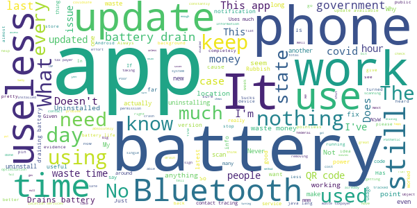

# COVIDSafe
App version ``2.4``

Analyzed with [covid-apps-observer](http://github.com/covid-apps-observer) project, version ``0.1``

## App overview
| | |
|-------------------------|-------------------------| 
| **Name**&nbsp;&nbsp;&nbsp;&nbsp;&nbsp;&nbsp;&nbsp;&nbsp;&nbsp;&nbsp;&nbsp;&nbsp;&nbsp;&nbsp;&nbsp;&nbsp;&nbsp;&nbsp;&nbsp;&nbsp;&nbsp;&nbsp;&nbsp;&nbsp;&nbsp;&nbsp;&nbsp;&nbsp;&nbsp;&nbsp;&nbsp;&nbsp;&nbsp;&nbsp;&nbsp;&nbsp;&nbsp;&nbsp;&nbsp;&nbsp;  | COVIDSafe |
| **Unique identifier** | au.gov.health.covidsafe |
| **Link to Google Play** | [https://play.google.com/store/apps/details?id=au.gov.health.covidsafe](https://play.google.com/store/apps/details?id=au.gov.health.covidsafe) |
| **Summary**  | COVIDSafe is a community-based way to stop the spread of COVID-19. |
| **Privacy policy** | [https://covidsafe.gov.au/privacy-policy.html](https://covidsafe.gov.au/privacy-policy.html) |
| **Latest version** | 2.4 |
| **Last update** | 2021-03-16 08:35:19 |
| **Recent changes** | Bug fixes. |
| **Installs**  | 1,000,000+ |
| **Category** | Health & Fitness |
| **First release** | Apr 25, 2020 |
| **Size**  | 13M |
| **Supported Android version**  | 5.0 and up |

### Description
> COVIDSafe app has been developed by the Australian Government Department of Health to help keep the community safe from coronavirus (COVID-19). Together, let’s help stop the spread and keep ourselves and each other healthy.
 COVIDSafe uses the Bluetooth® technology on your mobile phone to look for other devices with COVIDSafe installed. Your device will take a note of contact you’ve had with other users by securely logging the other user’s reference code. If you or someone you’ve been in contact with is diagnosed with COVID-19, the close contact information securely stored in your phone can be uploaded and used—with your consent—by state and territory health officials to quickly inform people who’ve been exposed to the virus.
 How you can help stop the spread of COVID-19:
 • Download the COVIDSafe app
 • Register using your mobile phone number, name, age range and postcode
 • Turn on Bluetooth®
 • Check that COVIDSafe is running when you are out and about or are likely to come into contact with others
 • If you test positive for COVID-19, you can consent for your close contact information to be used by state and territory health officials to contact people who may have been exposed. If you’ve been exposed to the virus by someone you’ve been in close contact with, state and territory health officials will be able to contact you quickly so you can get the support you need
 COVIDSafe is an Australian Government Department of Health initiative. Visit https://www.health.gov.au/resources/apps-and-tools/covidsafe-app for more information.

### User interface
The developers of the app provide the following screenshots in the Google play store.
| | | |
|:-------------------------:|:-------------------------:|:-------------------------:|
 |   |   |   | 
 |   |  

## Development team
In the following we report the main information provided by the development team in the Google play store.

| | |
|-------------------------|-------------------------|
| **Developer**  | Australian Department of Health |
| **Website**  | [https://www.health.gov.au/resources/apps-and-tools/covidsafe-app#covidsafe-app-help](https://www.health.gov.au/resources/apps-and-tools/covidsafe-app#covidsafe-app-help) |
| **Email** | support@COVIDSafe.gov.au |
| **Physical address**  | - |
| **Other developed apps**  | [https://play.google.com/store/apps/developer?id=Australian+Department+of+Health](https://play.google.com/store/apps/developer?id=Australian+Department+of+Health) |

## Android support

| | |
|-------------------------|-------------------------|
| **Declared target Android version**  | Android10, version 10 (API level 29) |
| **Effective target Android version**  | Android10, version 10 (API level 29) |
| **Minimum supported Android version**  | Lollipop, version 5.0 (API level 21) |
| **Maximum target Android version**  | - |

The larger the difference between the minimum and maximum supported Android versions, the better. A larger difference means a wider audience. For example, old phones have a very low Android version, so a high minimum supported Android version means that the app cannot be used by users with old phones, thus leading to accessibility problems. 

## Requested permissions

In the following we report the complete list of the permissions requested by the app. 

| **Permission** | **Protection level** | **Description** | 
|-------------------------|-------------------------|-------------------------|
 **android.permission ACCESS_COARSE_LOCATION** | :warning:**Dangerous** | Allows an app to access approximate location. 
 **android.permission ACCESS_FINE_LOCATION** | :warning:**Dangerous** | Allows an app to access precise location. 
 **android.permission ACCESS_NETWORK_STATE** | Normal | Allows applications to access information about networks. 
 **android.permission BLUETOOTH** | Normal | Allows applications to connect to paired bluetooth devices. 
 **android.permission BLUETOOTH_ADMIN** | Normal | Allows applications to discover and pair bluetooth devices. 
 **android.permission FOREGROUND_SERVICE** | Normal | Allows a regular application to use Service.startForeground. 
 **android.permission INTERNET** | Normal | Allows applications to open network sockets. 
 **android.permission RECEIVE_BOOT_COMPLETED** | Normal | Allows an application to receive the Intent.ACTION_BOOT_COMPLETED that is broadcast after the system finishes booting. 
 **android.permission REQUEST_IGNORE_BATTERY_OPTIMIZATIONS** | Normal | Permission an application must hold in order to use Settings.ACTION_REQUEST_IGNORE_BATTERY_OPTIMIZATIONS. 
 **android.permission WAKE_LOCK** | Normal | Allows using PowerManager WakeLocks to keep processor from sleeping or screen from dimming. 
 **com.google.android.c2dm.permission RECEIVE** | - | - 

## Mentioned servers

| **Server** | **Registrant** | **Registrant country** | **Creation date** | 
|-------------------------|-------------------------|-------------------------|-------------------------|
 | google.com | Google LLC | :us: US | 1997-09-15 04:00:00 |
 | stackoverflow.com | Stack Exchange, Inc. | :us: US | 2003-12-26 19:18:07 |
 | googleapis.com | Google LLC | :us: US | 2005-01-25 17:52:26 |

## Security analysis 

Below we report the main security warnings raised by our execution of the [Androwarn](https://github.com/maaaaz/androwarn) security analysis tool.

**Connection interfaces exfiltration**
> - This application reads details about the currently active data network 
> - This application tries to find out if the currently active data network is metered 

**Suspicious connection establishment**
> - This application opens a Socket and connects it to the remote address ' returned no addresses for  ; port is out of range' on the 'N/A' port  
> - This application opens a Socket and connects it to the remote address '' on the 'N/A' port  
> - This application opens a Socket and connects it to the remote address 'Ljava/lang/StringBuilder;->toString()Ljava/lang/String;' on the 'N/A' port  
> - This application opens a Socket and connects it to the remote address 'Ljava/net/Proxy;->type()Ljava/net/Proxy$Type;' on the 'N/A' port  
> - This application opens a Socket and connects it to the remote address 'timeout' on the 'N/A' port  

## User ratings and reviews

Below we provide information about how end users are reacting to the app in terms of ratings and reviews in the Google Play store.

### Ratings

The COVIDSafe app has been installed by more than **1000000** times. At this time, **16582** rated the app and its average score is **3.7772512**. Below we show the distribution of the ratings across the usual star-based rating of Google Play

:star::star::star::star::star:: 8724

:star::star::star::star:: 2453

:star::star::star:: 1397

:star::star:: 1004

:star:: 3004

### Reviews 

#### 5-star reviews

> Keeping WA safe.  :date: __2021-03-21 14:00:48__

> Good  :date: __2021-03-21 06:00:59__

> Great for families and Australians  :date: __2021-03-20 20:50:22__

> Big brother or not, this really helps the speed of the contact tracing if/when required.  :date: __2021-03-20 07:59:02__

> Great  :date: __2021-03-20 06:35:24__

> Easy to use  :date: __2021-03-19 23:35:20__

> Great to use  :date: __2021-03-19 07:31:38__

> May I say this as a typical Australian, "BLOODY BRILLIANT." Thank You.  :date: __2021-03-18 23:59:56__

> Very easy  :date: __2021-03-18 12:19:48__

> Great  :date: __2021-03-18 12:03:42__

#### 4-star reviews

> Works wel  :date: __2021-03-21 08:29:17__

> No problems accessing information  :date: __2021-03-18 23:07:11__

> Drops out often, otherwise very good.  :date: __2021-03-18 05:16:15__

> 7io  :date: __2021-03-18 03:06:41__

> Love to know where thecases are relative to me.  :date: __2021-03-17 11:06:36__

> Ok at the moment, thanks  :date: __2021-03-17 09:53:20__

> After few hiccups, the app download was done and I haven't had problems since!  :date: __2021-03-16 22:43:45__

> Previous 4 star rating reinstated. The extreme power use issue seems to have been resolved. App has functioned normally for a few weeks now.  :date: __2021-03-16 06:07:45__

> Feeling safe where ever I go  :date: __2021-03-14 04:57:32__

> It's okay  :date: __2021-03-14 04:25:32__

#### 3-star reviews

> Battery issues with new updates. I haven't had this problem before, but the latest versions are using lots of battery.  :date: __2021-03-21 11:32:49__

> Easy to use  :date: __2021-03-20 08:56:48__

> Crazy battery draining on my s10+  :date: __2021-03-15 21:35:53__

> Slows everything down and sucks the battery dry.  :date: __2021-03-15 03:31:04__

> Anything to help reduce COVID19 impact is worth trying  :date: __2021-03-14 06:24:10__

> Sometimes can't find what I need to know.  :date: __2021-03-14 05:44:33__

> Does nothing I can see  :date: __2021-03-12 06:29:41__

> Battery drain  :date: __2021-03-12 04:47:08__

> Had to uninstall because the battery drain was significant.  :date: __2021-03-11 10:02:37__

> Keeps dropping out  :date: __2021-03-11 06:56:54__

#### 2-star reviews

> 219-152 play Lord of the Rings I don't know what remember  :date: __2021-03-20 11:45:22__

> On my Note 10, I don't have any of the problems others mention about bluetooth drop outs to car or Senheisser headphones or Samsung Watch, the only problem I have is the app doesn't start up when I restart the phone, I rarely restart so not a big problem. Edit:The version of the app in March 2021 has been the highest battery drainer in my apps list, battery that used to last 14 hours is lucky to make 10 hours now. Hoping the version that was just pushed 19th March fixes the drain issue.  :date: __2021-03-19 05:21:52__

> tt  :date: __2021-03-18 23:02:41__

> Used the app for quite some time with no issues but recently started draining 40+% of my battery every day. Had to uninstall.  :date: __2021-03-18 11:58:03__

> I had to uninstall V2.0 in an attempt to install the updated version. My android smart phone registered the newer update as "pending" for weeks, sending my battery flat on a daily basis.  :date: __2021-03-18 03:43:11__

> Won't update. Still get information from 9th of December. Shows updated on 18th December to version 2.0 but still shows old data. Seems to be working fine now. It's fixed itself.  :date: __2021-03-17 06:20:58__

> Keeps killing blue tooth phone service  :date: __2021-03-14 08:27:19__

> Seems to be draining far too much battery. Just updated to 2.2 so will see if that is better.  :date: __2021-03-13 11:32:47__

> My app. stops working. Then when I try to get it started again I have to get a new passwordwhich I can't do as it is done on another phone which I can't get to..  :date: __2021-03-13 07:26:00__

> It says the app isn't working because battery optimization is on & it isn't & I updated it & put blue tooth on & it still says the app isn't working! Why? It let's me know when I have blue or off so it must be working to a certain degree.  :date: __2021-03-13 00:24:10__

#### 1-star reviews

> What is the point of this app if I still need a State Govt check-in app? Has this app helped with contact tracing at all?  :date: __2021-03-21 08:20:22__

> Uses more battery over a 24hr period than any other. My phone runs hot and slow and I believe COVIDsafe is why.  :date: __2021-03-21 05:53:07__

> Updated to version 2.4 which claimed to fix bugs, but now the "select state or territory" on 'home' page doesn't close when I select a state. 🙁 Looks like they don't test updates. Previous versions had battery usage issues and problems with statistics displayed. Hopefully the Bluetooth bit is working, hard for us to tell. Might be useful, but can't be sure. I've installed this app and so far haven't got Covid 19 (that I know of). Registration was easy, and can be done using a pseudonym.  :date: __2021-03-21 03:41:54__

> What a massive white elephant  :date: __2021-03-20 05:45:06__

> Galaxy S10+ on Android 10. Sucking battery. Tried latest 16 March update 2.4, and still using over 10% of battery. Rolled back to 1.14.0 as that one is fine.  :date: __2021-03-19 15:02:31__

> Asks for mobile number an dc then grinds to a halt witj message 'please try later'. Just frustrating.  :date: __2021-03-19 13:36:44__

> Never been contacted. First update since installing. Get info from news.  :date: __2021-03-19 08:36:17__

> Have to input personal ID on every occasion I scan.  :date: __2021-03-19 01:40:52__

> I don't trust it.  :date: __2021-03-18 09:32:30__

> I can catch the virus by being close to a carrier for ten seconds. This app won't register the event. I doubt that the app would have been any use or saved any lives. The government would have been more useful if it had told people how to fit masks tightly around the nose so aerosol with the virus would not be inhaled through gaps beside the nose of Ill fitting masks. If the health departments had heeded the advice I sent them, there would have been many fewer cases. Sincerely Dr John Wells,  :date: __2021-03-18 08:40:53__

