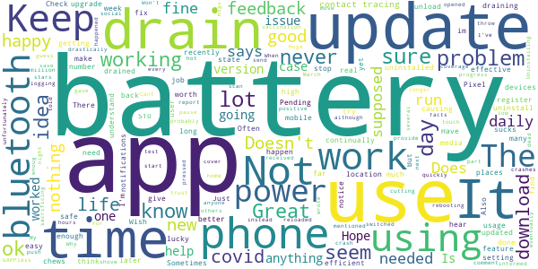
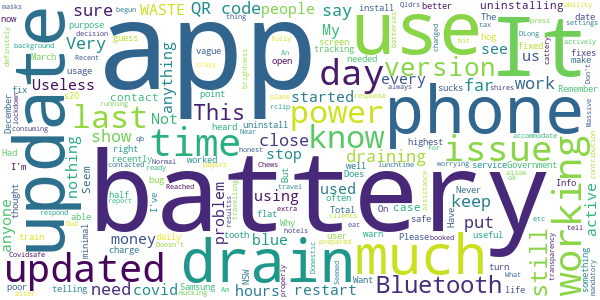

# COVIDSafe
App version ``2.4``

Analyzed with [covid-apps-observer](http://github.com/covid-apps-observer) project, version ``0.1``

## App overview
| | |
|-------------------------|-------------------------| 
| **Name**&nbsp;&nbsp;&nbsp;&nbsp;&nbsp;&nbsp;&nbsp;&nbsp;&nbsp;&nbsp;&nbsp;&nbsp;&nbsp;&nbsp;&nbsp;&nbsp;&nbsp;&nbsp;&nbsp;&nbsp;&nbsp;&nbsp;&nbsp;&nbsp;&nbsp;&nbsp;&nbsp;&nbsp;&nbsp;&nbsp;&nbsp;&nbsp;&nbsp;&nbsp;&nbsp;&nbsp;&nbsp;&nbsp;&nbsp;&nbsp;  | COVIDSafe |
| **Unique identifier** | au.gov.health.covidsafe |
| **Link to Google Play** | [https://play.google.com/store/apps/details?id=au.gov.health.covidsafe](https://play.google.com/store/apps/details?id=au.gov.health.covidsafe) |
| **Summary**  | COVIDSafe is a community-based way to stop the spread of COVID-19. |
| **Privacy policy** | [https://covidsafe.gov.au/privacy-policy.html](https://covidsafe.gov.au/privacy-policy.html) |
| **Latest version** | 2.4 |
| **Last update** | 2021-03-16 08:35:19 |
| **Recent changes** | Bug fixes. |
| **Installs**  | 1,000,000+ |
| **Category** | Health & Fitness |
| **First release** | Apr 25, 2020 |
| **Size**  | 13M |
| **Supported Android version**  | 5.0 and up |

### Description
> COVIDSafe app has been developed by the Australian Government Department of Health to help keep the community safe from coronavirus (COVID-19). Together, let’s help stop the spread and keep ourselves and each other healthy.
 COVIDSafe uses the Bluetooth® technology on your mobile phone to look for other devices with COVIDSafe installed. Your device will take a note of contact you’ve had with other users by securely logging the other user’s reference code. If you or someone you’ve been in contact with is diagnosed with COVID-19, the close contact information securely stored in your phone can be uploaded and used—with your consent—by state and territory health officials to quickly inform people who’ve been exposed to the virus.
 How you can help stop the spread of COVID-19:
 • Download the COVIDSafe app
 • Register using your mobile phone number, name, age range and postcode
 • Turn on Bluetooth®
 • Check that COVIDSafe is running when you are out and about or are likely to come into contact with others
 • If you test positive for COVID-19, you can consent for your close contact information to be used by state and territory health officials to contact people who may have been exposed. If you’ve been exposed to the virus by someone you’ve been in close contact with, state and territory health officials will be able to contact you quickly so you can get the support you need
 COVIDSafe is an Australian Government Department of Health initiative. Visit https://www.health.gov.au/resources/apps-and-tools/covidsafe-app for more information.

### User interface
The developers of the app provide the following screenshots in the Google play store.
| | | |
|:-------------------------:|:-------------------------:|:-------------------------:|
 |   |   |   | 
 |   |  

## Development team
In the following we report the main information provided by the development team in the Google play store.

| | |
|-------------------------|-------------------------|
| **Developer**  | Australian Department of Health |
| **Website**  | [https://www.health.gov.au/resources/apps-and-tools/covidsafe-app#covidsafe-app-help](https://www.health.gov.au/resources/apps-and-tools/covidsafe-app#covidsafe-app-help) |
| **Email** | support@COVIDSafe.gov.au |
| **Physical address**  | - |
| **Other developed apps**  | [https://play.google.com/store/apps/developer?id=Australian+Department+of+Health](https://play.google.com/store/apps/developer?id=Australian+Department+of+Health) |

## Android support

| | |
|-------------------------|-------------------------|
| **Declared target Android version**  | Android10, version 10 (API level 29) |
| **Effective target Android version**  | Android10, version 10 (API level 29) |
| **Minimum supported Android version**  | Lollipop, version 5.0 (API level 21) |
| **Maximum target Android version**  | - |

The larger the difference between the minimum and maximum supported Android versions, the better. A larger difference means a wider audience. For example, old phones have a very low Android version, so a high minimum supported Android version means that the app cannot be used by users with old phones, thus leading to accessibility problems. 

## Requested permissions

In the following we report the complete list of the permissions requested by the app. 

| **Permission** | **Protection level** | **Description** | 
|-------------------------|-------------------------|-------------------------|
 **android.permission ACCESS_COARSE_LOCATION** | :warning:**Dangerous** | Allows an app to access approximate location. 
 **android.permission ACCESS_FINE_LOCATION** | :warning:**Dangerous** | Allows an app to access precise location. 
 **android.permission ACCESS_NETWORK_STATE** | Normal | Allows applications to access information about networks. 
 **android.permission BLUETOOTH** | Normal | Allows applications to connect to paired bluetooth devices. 
 **android.permission BLUETOOTH_ADMIN** | Normal | Allows applications to discover and pair bluetooth devices. 
 **android.permission FOREGROUND_SERVICE** | Normal | Allows a regular application to use Service.startForeground. 
 **android.permission INTERNET** | Normal | Allows applications to open network sockets. 
 **android.permission RECEIVE_BOOT_COMPLETED** | Normal | Allows an application to receive the Intent.ACTION_BOOT_COMPLETED that is broadcast after the system finishes booting. 
 **android.permission REQUEST_IGNORE_BATTERY_OPTIMIZATIONS** | Normal | Permission an application must hold in order to use Settings.ACTION_REQUEST_IGNORE_BATTERY_OPTIMIZATIONS. 
 **android.permission WAKE_LOCK** | Normal | Allows using PowerManager WakeLocks to keep processor from sleeping or screen from dimming. 
 **com.google.android.c2dm.permission RECEIVE** | - | - 

## Mentioned servers

| **Server** | **Registrant** | **Registrant country** | **Creation date** | 
|-------------------------|-------------------------|-------------------------|-------------------------|
 | google.com | Google LLC | :us: US | 1997-09-15 04:00:00 |
 | stackoverflow.com | Stack Exchange, Inc. | :us: US | 2003-12-26 19:18:07 |
 | googleapis.com | Google LLC | :us: US | 2005-01-25 17:52:26 |

## Security analysis 

Below we report the main security warnings raised by our execution of the [Androwarn](https://github.com/maaaaz/androwarn) security analysis tool.

**Connection interfaces exfiltration**
> - This application reads details about the currently active data network 
> - This application tries to find out if the currently active data network is metered 

**Suspicious connection establishment**
> - This application opens a Socket and connects it to the remote address ' returned no addresses for  ; port is out of range' on the 'N/A' port  
> - This application opens a Socket and connects it to the remote address '' on the 'N/A' port  
> - This application opens a Socket and connects it to the remote address 'Ljava/lang/StringBuilder;->toString()Ljava/lang/String;' on the 'N/A' port  
> - This application opens a Socket and connects it to the remote address 'Ljava/net/Proxy;->type()Ljava/net/Proxy$Type;' on the 'N/A' port  
> - This application opens a Socket and connects it to the remote address 'timeout' on the 'N/A' port  

## User ratings and reviews

Below we provide information about how end users are reacting to the app in terms of ratings and reviews in the Google Play store.

### Ratings

The COVIDSafe app has been installed by more than **1000000** times. At this time, **16582** rated the app and its average score is **3.7772512**. Below we show the distribution of the ratings across the usual star-based rating of Google Play

:star::star::star::star::star:: 8724

:star::star::star::star:: 2453

:star::star::star:: 1397

:star::star:: 1004

:star:: 3004

### Reviews 

#### 5-star reviews

> Great  :date: __2021-04-04 04:00:42__

> Very nice.  :date: __2021-04-03 09:31:32__

> Reliable and easily laid out app.  :date: __2021-04-03 08:56:24__

> EXCELLENT  :date: __2021-04-03 08:08:52__

> Very informative  :date: __2021-04-03 03:18:32__

> Haven't had COVID-19 a single time since downloading this app. Amazing!  :date: __2021-04-02 04:33:57__

> Excellent  :date: __2021-04-02 02:31:46__

> Great to know  :date: __2021-04-01 08:49:59__

> Good, informative  :date: __2021-04-01 08:06:10__

> Awesome  :date: __2021-04-01 06:12:25__

#### 4-star reviews

> Good  :date: __2021-04-03 09:06:29__

> Good  :date: __2021-04-02 03:36:39__

> No icon  :date: __2021-04-02 03:32:11__

> Works OK  :date: __2021-03-31 02:49:59__

> I have now had this app for a year now it's not active and says I need to reregister I have tried for the last 3 days and it keeps saying try again later.  :date: __2021-03-30 08:17:53__

> A A  :date: __2021-03-30 07:34:41__

> Luke the fact it can alert me  :date: __2021-03-30 05:39:55__

> P Pi  :date: __2021-03-29 06:24:56__

> It's just there in the background.  :date: __2021-03-28 08:11:18__

> None  :date: __2021-03-27 06:23:44__

#### 3-star reviews

> I didn't like that the bluetooth had to be on.  :date: __2021-04-04 02:18:41__

> Drains battery.  :date: __2021-04-03 08:33:24__

> Check in and out works fine but the app chews up battery power drastically  :date: __2021-04-03 06:53:23__

> Since the start of March it had drained my battery so quickly I had to unload it. I reloaded it again 2 weeks later and it drained my battery down to 15% in 6 hours. My phone was hot to touch. I've had to unload it again unfortunately. The app is of no use to anyone when your phone is dead.  :date: __2021-04-01 02:47:24__

> Battery life is a problem  :date: __2021-03-31 23:49:47__

> I give 3 stars since the app will now run on my GAPPless phone however, as others have mentioned, bluetooth crashes out and can only be switched back on by rebooting the phone. I think the problem is there being too many other Bluetooth devices in the same location. The app was fine at home but at work it would crash. I can't comment about battery life since the app didn't run long enoug to find out... Uninstalling now since it's no longer of any use.  :date: __2021-03-30 12:04:44__

> There has been not a lot of positive coverage by the media  :date: __2021-03-30 07:58:19__

> Does not report daily covid cases in real time. Also did not cover vaccination progress at all.  :date: __2021-03-30 04:22:44__

> I guess it works not had any msgs  :date: __2021-03-30 00:54:57__

> Uses too much battery power  :date: __2021-03-29 23:25:03__

#### 2-star reviews

> Dud.  :date: __2021-04-04 08:41:50__

> This App always hogs up Battery usage. Please fix it.  :date: __2021-04-04 01:26:37__

> It should have worked but it had minimal resultss. Total WASTE of tax payers money.  :date: __2021-04-03 09:37:50__

> Recent update has begun draining battery. An app running in the background shouldn't be using over 40% of the battery daily - much more than active apps or the screen. Am having to charge my battery 2-3 times more than before the update. Reached out to Covidsafe to report the bug & their response was to alter my phone usage to accommodate the extra battery the app would drain - turn down screen brightness, be prepared to charge more often, close other apps, etc. I.e. allow the app to eat battery  :date: __2021-04-03 04:38:37__

> Never use it  :date: __2021-04-02 05:37:41__

> Bug fixes are both vague and worrying. Needs better transparency about what was updated.  :date: __2021-04-02 04:16:06__

> Seemed a bit vague. Normal covid has been working ok. What was the up date??  :date: __2021-04-01 08:14:29__

> Near useless, only have to show my clients that I am actively covid safe  :date: __2021-04-01 08:07:43__

> Very poor user ability  :date: __2021-04-01 01:26:56__

> Phone half flat by lunchtime. Want to do the right thing here but settings say the app is consuming 47% of my total power use for the day.  :date: __2021-03-31 04:33:01__

#### 1-star reviews

> used it for months. now it wants my password and username before working. Do you expect me to remember these ? keep it simple to use if you want people to cooperate.  :date: __2021-04-04 06:51:45__

> Uses too much battery. needs to have optimser to stop it guzzling power.  :date: __2021-04-04 01:52:55__

> Keeps logging me out..wont save my information  :date: __2021-04-04 01:29:32__

> what a waste of money this app is!! Not a single case was identified...  :date: __2021-04-03 15:47:02__

> A waste of time that chews up battery  :date: __2021-04-03 12:33:40__

> Since last update PlatformException(error, Attempt to invoke virtual method java.lang.String java.lang.Object.toString()' on a null object reference, null, java.lang.NullPointerAttempt to invoke virtual method 'java.lang. String java.lang.Object.toString()' on a null object reference at c.f.c.t.d.a(Unknown Source:50)  :date: __2021-04-03 09:51:50__

> Tells you nothing  :date: __2021-04-03 08:28:33__

> Total DUD  :date: __2021-04-03 07:14:26__

> Awful battery usage issues. Used 43% of my phone battery in less than 24 hours. Uninstalled til you get this thing right.  :date: __2021-04-03 06:03:09__

> Bad app waste of time  :date: __2021-04-03 05:06:09__

