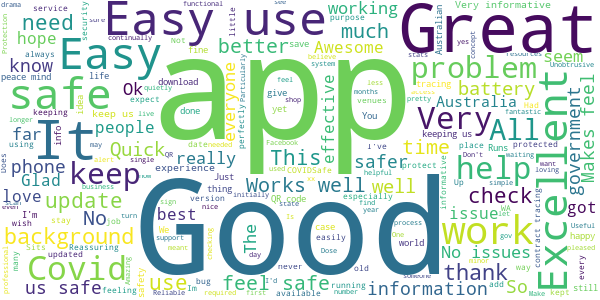
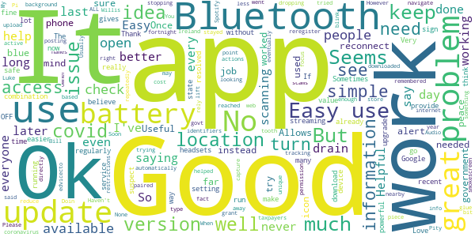

# COVIDSafe
App version ``2.4``

Analyzed with [covid-apps-observer](http://github.com/covid-apps-observer) project, version ``0.1``

## App overview
| | |
|-------------------------|-------------------------| 
| **Name**&nbsp;&nbsp;&nbsp;&nbsp;&nbsp;&nbsp;&nbsp;&nbsp;&nbsp;&nbsp;&nbsp;&nbsp;&nbsp;&nbsp;&nbsp;&nbsp;&nbsp;&nbsp;&nbsp;&nbsp;&nbsp;&nbsp;&nbsp;&nbsp;&nbsp;&nbsp;&nbsp;&nbsp;&nbsp;&nbsp;&nbsp;&nbsp;&nbsp;&nbsp;&nbsp;&nbsp;&nbsp;&nbsp;&nbsp;&nbsp;  | COVIDSafe |
| **Unique identifier** | au.gov.health.covidsafe |
| **Link to Google Play** | [https://play.google.com/store/apps/details?id=au.gov.health.covidsafe](https://play.google.com/store/apps/details?id=au.gov.health.covidsafe) |
| **Summary**  | COVIDSafe is a community-based way to stop the spread of COVID-19. |
| **Privacy policy** | [https://covidsafe.gov.au/privacy-policy.html](https://covidsafe.gov.au/privacy-policy.html) |
| **Latest version** | 2.4 |
| **Last update** | 2021-03-16 08:35:19 |
| **Recent changes** | Bug fixes. |
| **Installs**  | 1,000,000+ |
| **Category** | Health & Fitness |
| **First release** | Apr 25, 2020 |
| **Size**  | 13M |
| **Supported Android version**  | 5.0 and up |

### Description
> COVIDSafe app has been developed by the Australian Government Department of Health to help keep the community safe from coronavirus (COVID-19). Together, let’s help stop the spread and keep ourselves and each other healthy.
 COVIDSafe uses the Bluetooth® technology on your mobile phone to look for other devices with COVIDSafe installed. Your device will take a note of contact you’ve had with other users by securely logging the other user’s reference code. If you or someone you’ve been in contact with is diagnosed with COVID-19, the close contact information securely stored in your phone can be uploaded and used—with your consent—by state and territory health officials to quickly inform people who’ve been exposed to the virus.
 How you can help stop the spread of COVID-19:
 • Download the COVIDSafe app
 • Register using your mobile phone number, name, age range and postcode
 • Turn on Bluetooth®
 • Check that COVIDSafe is running when you are out and about or are likely to come into contact with others
 • If you test positive for COVID-19, you can consent for your close contact information to be used by state and territory health officials to contact people who may have been exposed. If you’ve been exposed to the virus by someone you’ve been in close contact with, state and territory health officials will be able to contact you quickly so you can get the support you need
 COVIDSafe is an Australian Government Department of Health initiative. Visit https://www.health.gov.au/resources/apps-and-tools/covidsafe-app for more information.

### User interface
The developers of the app provide the following screenshots in the Google play store.
| | | |
|:-------------------------:|:-------------------------:|:-------------------------:|
 |   |   |   | 
 |   |  

## Development team
In the following we report the main information provided by the development team in the Google play store.

| | |
|-------------------------|-------------------------|
| **Developer**  | Australian Department of Health |
| **Website**  | [https://www.health.gov.au/resources/apps-and-tools/covidsafe-app#covidsafe-app-help](https://www.health.gov.au/resources/apps-and-tools/covidsafe-app#covidsafe-app-help) |
| **Email** | support@COVIDSafe.gov.au |
| **Physical address**  | - |
| **Other developed apps**  | [https://play.google.com/store/apps/developer?id=Australian+Department+of+Health](https://play.google.com/store/apps/developer?id=Australian+Department+of+Health) |

## Android support

| | |
|-------------------------|-------------------------|
| **Declared target Android version**  | Android10, version 10 (API level 29) |
| **Effective target Android version**  | Android10, version 10 (API level 29) |
| **Minimum supported Android version**  | Lollipop, version 5.0 (API level 21) |
| **Maximum target Android version**  | - |

The larger the difference between the minimum and maximum supported Android versions, the better. A larger difference means a wider audience. For example, old phones have a very low Android version, so a high minimum supported Android version means that the app cannot be used by users with old phones, thus leading to accessibility problems. 

## Requested permissions

In the following we report the complete list of the permissions requested by the app. 

| **Permission** | **Protection level** | **Description** | 
|-------------------------|-------------------------|-------------------------|
 **android.permission ACCESS_COARSE_LOCATION** | :warning:**Dangerous** | Allows an app to access approximate location. 
 **android.permission ACCESS_FINE_LOCATION** | :warning:**Dangerous** | Allows an app to access precise location. 
 **android.permission ACCESS_NETWORK_STATE** | Normal | Allows applications to access information about networks. 
 **android.permission BLUETOOTH** | Normal | Allows applications to connect to paired bluetooth devices. 
 **android.permission BLUETOOTH_ADMIN** | Normal | Allows applications to discover and pair bluetooth devices. 
 **android.permission FOREGROUND_SERVICE** | Normal | Allows a regular application to use Service.startForeground. 
 **android.permission INTERNET** | Normal | Allows applications to open network sockets. 
 **android.permission RECEIVE_BOOT_COMPLETED** | Normal | Allows an application to receive the Intent.ACTION_BOOT_COMPLETED that is broadcast after the system finishes booting. 
 **android.permission REQUEST_IGNORE_BATTERY_OPTIMIZATIONS** | Normal | Permission an application must hold in order to use Settings.ACTION_REQUEST_IGNORE_BATTERY_OPTIMIZATIONS. 
 **android.permission WAKE_LOCK** | Normal | Allows using PowerManager WakeLocks to keep processor from sleeping or screen from dimming. 
 **com.google.android.c2dm.permission RECEIVE** | - | - 

## Mentioned servers

| **Server** | **Registrant** | **Registrant country** | **Creation date** | 
|-------------------------|-------------------------|-------------------------|-------------------------|
 | google.com | Google LLC | :us: US | 1997-09-15 04:00:00 |
 | stackoverflow.com | Stack Exchange, Inc. | :us: US | 2003-12-26 19:18:07 |
 | googleapis.com | Google LLC | :us: US | 2005-01-25 17:52:26 |

## Security analysis 

Below we report the main security warnings raised by our execution of the [Androwarn](https://github.com/maaaaz/androwarn) security analysis tool.

**Connection interfaces exfiltration**
> - This application reads details about the currently active data network 
> - This application tries to find out if the currently active data network is metered 

**Suspicious connection establishment**
> - This application opens a Socket and connects it to the remote address ' returned no addresses for  ; port is out of range' on the 'N/A' port  
> - This application opens a Socket and connects it to the remote address '' on the 'N/A' port  
> - This application opens a Socket and connects it to the remote address 'Ljava/lang/StringBuilder;->toString()Ljava/lang/String;' on the 'N/A' port  
> - This application opens a Socket and connects it to the remote address 'Ljava/net/Proxy;->type()Ljava/net/Proxy$Type;' on the 'N/A' port  
> - This application opens a Socket and connects it to the remote address 'timeout' on the 'N/A' port  

## User ratings and reviews

Below we provide information about how end users are reacting to the app in terms of ratings and reviews in the Google Play store.

### Ratings

The COVIDSafe app has been installed by more than **1000000** times. At this time, **16582** rated the app and its average score is **3.7772512**. Below we show the distribution of the ratings across the usual star-based rating of Google Play

:star::star::star::star::star:: 8724

:star::star::star::star:: 2453

:star::star::star:: 1397

:star::star:: 1004

:star:: 3004

### Reviews 

#### 5-star reviews

> All good  :date: __2021-03-28 15:35:25__

> Feel safer  :date: __2021-03-28 12:04:43__

> Wash hands after every thing you do and after 500 times a day, no colds or flue or co vid19  :date: __2021-03-28 12:03:08__

> Works great but why so many upgrades lately  :date: __2021-03-28 11:50:20__

> Really good  :date: __2021-03-28 09:06:08__

> Good  :date: __2021-03-28 07:06:48__

> Easy to use  :date: __2021-03-28 06:52:59__

> Much better than the first version. Better battery life  :date: __2021-03-28 06:14:52__

> Unobtrusive.  :date: __2021-03-28 06:11:45__

> I have not gotten sick yet  :date: __2021-03-27 14:08:26__

#### 4-star reviews

> It's just there in the background.  :date: __2021-03-28 08:11:18__

> None  :date: __2021-03-27 06:23:44__

> Works well. Useful info  :date: __2021-03-26 13:39:49__

> Good. But, the coronavirus app used in Ireland does the same job as this, but at far less cost to the taxpayers!  :date: __2021-03-26 06:55:04__

> When I turn off the internet on my phone it say I need to reconnect it and something about my battery. Once I reconnect it works great  :date: __2021-03-26 06:37:54__

> Much better after last update  :date: __2021-03-26 04:28:24__

> You have to lift away from icon you are trying to capture. It then does it automatically, once right focus point has been reached.  :date: __2021-03-24 22:52:44__

> Never needed to rely on it.  :date: __2021-03-24 11:03:21__

> Good  :date: __2021-03-24 08:10:00__

> Easy to navigate.  :date: __2021-03-24 07:18:08__

#### 3-star reviews

> Won't update. I keep getting notifications that there is an update. When I try it continually says Pending and won't download.  :date: __2021-03-26 04:48:39__

> It is ok but could have a pause setting for night time and low social times (to save battery)  :date: __2021-03-25 12:19:54__

> Huge battery usage. Cant keep sacrificing my battery for this app every day.  :date: __2021-03-25 10:22:51__

> It probably does what it says, although I wouldn't trust it further than I could throw it.  :date: __2021-03-24 14:14:33__

> Why didn't we all download this and use it to scan into places instead of logging in a million times!  :date: __2021-03-24 09:59:22__

> The real test for an app happens when you move from "push" to "shove". I recently needed to provide some feedback. I opened "Feedback", wrote my facts, and pressed "send". Nothing happened other than being told to "try later". I did this several times and eventually gave up. The next day I was informed it had been received. For an app that's supposed to be part of the cutting edge in the defeat of Covid-19, this was not a great outcome.  :date: __2021-03-24 08:17:32__

> gets the job done, but requires a lot of typing  :date: __2021-03-24 06:50:48__

> I have had zero experience other than reminders to download updates. I have noticed many suggestions in the media that this app plays very little role in contact tracing activity.  :date: __2021-03-24 06:11:46__

> Does it do anything ?  :date: __2021-03-24 05:28:11__

> Often I can't log out before I long in again  :date: __2021-03-24 04:54:49__

#### 2-star reviews

> I'm not sure what changed in the last updates but it's definitely started draining my battery (14% contribution which was the highest over 3 hours).  :date: __2021-03-28 15:45:35__

> This app should tell us more re travelling. For Domestic it just says masks are mandatory on plans. It should be telling us if they put Qldrs in lockdown, is it just the 2 shires or all of us. I have hotels & cattery booked ready to travel in 2 days. Have to make a decision now and put it on this app. Stop mucking people about, use the app fully.  :date: __2021-03-28 11:19:45__

> Minimal assistance to be honest  :date: __2021-03-28 09:20:51__

> Don't know if it works properly. I haven't heard anyone being contacted by this app.  :date: __2021-03-26 08:56:43__

> DLong-press a rclip to pin or delete it.75XV to n+W5r to fResearch, Victoria BC X  :date: __2021-03-26 06:00:13__

> Uses 15-25% of my battery every day (version 2.4).  :date: __2021-03-26 01:11:09__

> When in Sydney recently I found the QR code from NSW Govt. easy & it did everything! PT safer & not overcrowded like our V line to Geelong train often is. NSW trains have "red X's" on some of their seats & people do not sit in them. Thank you.  :date: __2021-03-25 04:14:39__

> Half don't work  :date: __2021-03-24 11:04:20__

> It dosnt do anything  :date: __2021-03-24 04:52:32__

> Battery drain  :date: __2021-03-23 09:27:01__

#### 1-star reviews

> Causes the Bluetooth on my phone to crash every 10-15 seconds when running. Android 10 on Note 3 (Bluetooth 4.0) - Bluetooth working fine for other applications. Newly flashed rom on a brand new phone (old stock new in box).  :date: __2021-03-28 14:46:05__

> It seems to be a waste of money and time.  :date: __2021-03-28 14:12:13__

> I have uninstalled as the app is draining battery doing nothing!  :date: __2021-03-28 10:47:53__

> hope u guys got rich developing this waste of storage.  :date: __2021-03-28 08:32:31__

> Updates are asking for too many personal permissions. Being able to access my network and GPS locations is getting a bit much. Recording if I was near an infected person is enough.  :date: __2021-03-28 08:08:20__

> Typical Liberal cock-up. Waste of taxpayers money.  :date: __2021-03-28 06:32:26__

> Poor  :date: __2021-03-28 06:25:35__

> It doesn't do anything...  :date: __2021-03-27 22:41:48__

> Seems to me unless you are a brainless politician, you wait, wait some more to be fed cow poop and grow like mushrooms. My GP was knocked back as one to immunise because his paper work was a Day Late. How about some real truth for the Elderly.  :date: __2021-03-27 14:20:34__

> The app doesn't remember my details, despite uninstalling and reinstalling  :date: __2021-03-27 05:22:08__

