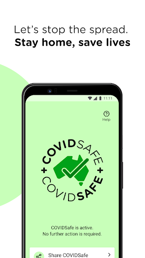

# COVIDSafe
App version ``2.5``

Analyzed with [covid-apps-observer](http://github.com/covid-apps-observer) project, version ``0.1``

## App overview
| | |
|-------------------------|-------------------------| 
| **Name**&nbsp;&nbsp;&nbsp;&nbsp;&nbsp;&nbsp;&nbsp;&nbsp;&nbsp;&nbsp;&nbsp;&nbsp;&nbsp;&nbsp;&nbsp;&nbsp;&nbsp;&nbsp;&nbsp;&nbsp;&nbsp;&nbsp;&nbsp;&nbsp;&nbsp;&nbsp;&nbsp;&nbsp;&nbsp;&nbsp;&nbsp;&nbsp;&nbsp;&nbsp;&nbsp;&nbsp;&nbsp;&nbsp;&nbsp;&nbsp;  | COVIDSafe |
| **Unique identifier** | au.gov.health.covidsafe |
| **Link to Google Play** | [https://play.google.com/store/apps/details?id=au.gov.health.covidsafe](https://play.google.com/store/apps/details?id=au.gov.health.covidsafe) |
| **Summary**  | COVIDSafe is a community-based way to stop the spread of COVID-19. |
| **Privacy policy** | [https://covidsafe.gov.au/privacy-policy.html](https://covidsafe.gov.au/privacy-policy.html) |
| **Latest version** | 2.5 |
| **Last update** | 2021-04-08 01:30:27 |
| **Recent changes** | Minor bug fixes and changes |
| **Installs**  | 1,000,000+ |
| **Category** | Health & Fitness |
| **First release** | Apr 25, 2020 |
| **Size**  | 13M |
| **Supported Android version**  | 5.0 and up |

### Description
> COVIDSafe app has been developed by the Australian Government Department of Health to help keep the community safe from coronavirus (COVID-19). Together, let’s help stop the spread and keep ourselves and each other healthy.
 COVIDSafe uses the Bluetooth® technology on your mobile phone to look for other devices with COVIDSafe installed. Your device will take a note of contact you’ve had with other users by securely logging the other user’s reference code. If you or someone you’ve been in contact with is diagnosed with COVID-19, the close contact information securely stored in your phone can be uploaded and used—with your consent—by state and territory health officials to quickly inform people who’ve been exposed to the virus.
 How you can help stop the spread of COVID-19:
 • Download the COVIDSafe app
 • Register using your mobile phone number, name, age range and postcode
 • Turn on Bluetooth®
 • Check that COVIDSafe is running when you are out and about or are likely to come into contact with others
 • If you test positive for COVID-19, you can consent for your close contact information to be used by state and territory health officials to contact people who may have been exposed. If you’ve been exposed to the virus by someone you’ve been in close contact with, state and territory health officials will be able to contact you quickly so you can get the support you need
 COVIDSafe is an Australian Government Department of Health initiative. Visit https://www.health.gov.au/resources/apps-and-tools/covidsafe-app for more information.

### User interface
The developers of the app provide the following screenshots in the Google play store.
| | | |
|:-------------------------:|:-------------------------:|:-------------------------:|
 |   |   |   | 
 |   |  

## Development team
In the following we report the main information provided by the development team in the Google play store.

| | |
|-------------------------|-------------------------|
| **Developer**  | Australian Department of Health |
| **Website**  | [https://www.health.gov.au/resources/apps-and-tools/covidsafe-app#covidsafe-app-help](https://www.health.gov.au/resources/apps-and-tools/covidsafe-app#covidsafe-app-help) |
| **Email** | support@COVIDSafe.gov.au |
| **Physical address**  | - |
| **Other developed apps**  | [https://play.google.com/store/apps/developer?id=Australian+Department+of+Health](https://play.google.com/store/apps/developer?id=Australian+Department+of+Health) |

## Android support

| | |
|-------------------------|-------------------------|
| **Declared target Android version**  | Android10, version 10 (API level 29) |
| **Effective target Android version**  | Android10, version 10 (API level 29) |
| **Minimum supported Android version**  | Lollipop, version 5.0 (API level 21) |
| **Maximum target Android version**  | - |

The larger the difference between the minimum and maximum supported Android versions, the better. A larger difference means a wider audience. For example, old phones have a very low Android version, so a high minimum supported Android version means that the app cannot be used by users with old phones, thus leading to accessibility problems. 

## Requested permissions

In the following we report the complete list of the permissions requested by the app. 

| **Permission** | **Protection level** | **Description** | 
|-------------------------|-------------------------|-------------------------|
 **android.permission ACCESS_COARSE_LOCATION** | :warning:**Dangerous** | Allows an app to access approximate location. 
 **android.permission ACCESS_FINE_LOCATION** | :warning:**Dangerous** | Allows an app to access precise location. 
 **android.permission ACCESS_NETWORK_STATE** | Normal | Allows applications to access information about networks. 
 **android.permission BLUETOOTH** | Normal | Allows applications to connect to paired bluetooth devices. 
 **android.permission BLUETOOTH_ADMIN** | Normal | Allows applications to discover and pair bluetooth devices. 
 **android.permission FOREGROUND_SERVICE** | Normal | Allows a regular application to use Service.startForeground. 
 **android.permission INTERNET** | Normal | Allows applications to open network sockets. 
 **android.permission RECEIVE_BOOT_COMPLETED** | Normal | Allows an application to receive the Intent.ACTION_BOOT_COMPLETED that is broadcast after the system finishes booting. 
 **android.permission REQUEST_IGNORE_BATTERY_OPTIMIZATIONS** | Normal | Permission an application must hold in order to use Settings.ACTION_REQUEST_IGNORE_BATTERY_OPTIMIZATIONS. 
 **android.permission WAKE_LOCK** | Normal | Allows using PowerManager WakeLocks to keep processor from sleeping or screen from dimming. 
 **com.google.android.c2dm.permission RECEIVE** | - | - 

## Mentioned servers

| **Server** | **Registrant** | **Registrant country** | **Creation date** | 
|-------------------------|-------------------------|-------------------------|-------------------------|
 | google.com | Google LLC | :us: US | 1997-09-15 04:00:00 |
 | stackoverflow.com | Stack Exchange, Inc. | :us: US | 2003-12-26 19:18:07 |
 | googleapis.com | Google LLC | :us: US | 2005-01-25 17:52:26 |

## Security analysis 

Below we report the main security warnings raised by our execution of the [Androwarn](https://github.com/maaaaz/androwarn) security analysis tool.

**Connection interfaces exfiltration**
> - This application reads details about the currently active data network 
> - This application tries to find out if the currently active data network is metered 

**Suspicious connection establishment**
> - This application opens a Socket and connects it to the remote address ' returned no addresses for  ; port is out of range' on the 'N/A' port  
> - This application opens a Socket and connects it to the remote address '' on the 'N/A' port  
> - This application opens a Socket and connects it to the remote address 'Ljava/lang/StringBuilder;->toString()Ljava/lang/String;' on the 'N/A' port  
> - This application opens a Socket and connects it to the remote address 'Ljava/net/Proxy;->type()Ljava/net/Proxy$Type;' on the 'N/A' port  
> - This application opens a Socket and connects it to the remote address 'timeout' on the 'N/A' port  

## User ratings and reviews

Below we provide information about how end users are reacting to the app in terms of ratings and reviews in the Google Play store.

### Ratings

The COVIDSafe app has been installed by more than **1000000** times. At this time, **17742** rated the app and its average score is **3.7339957**. Below we show the distribution of the ratings across the usual star-based rating of Google Play

:star::star::star::star::star:: 9254

:star::star::star::star:: 2379

:star::star::star:: 1664

:star::star:: 1028

:star:: 3417

### Reviews 

#### 5-star reviews

> Thanks from sodber  :date: __2021-04-12 14:33:52__

> good  :date: __2021-04-12 03:25:05__

> Life saving  :date: __2021-04-10 15:11:13__

> With thanks...Xxx  :date: __2021-04-09 09:12:40__

> Keeps saying my phone number is invalid  :date: __2021-04-09 07:26:55__

> Easy to use and so much information 👍  :date: __2021-04-09 01:55:36__

> Allows me piece peace of mind  :date: __2021-04-08 21:19:19__

> Important information.  :date: __2021-04-08 02:55:27__

> Very good.  :date: __2021-04-08 02:21:19__

> Excellent way of contact tracing  :date: __2021-04-07 08:54:02__

#### 4-star reviews

> Pretty straightforward app but drains battery  :date: __2021-04-11 11:14:39__

> Keeps telling me my phone number is not valid.  :date: __2021-04-09 14:33:16__

> Always on to help protect us.  :date: __2021-04-09 08:36:35__

> Good  :date: __2021-04-08 18:57:38__

> Good  :date: __2021-04-03 09:06:29__

> Good  :date: __2021-04-02 03:36:39__

> No icon  :date: __2021-04-02 03:32:11__

> Works OK  :date: __2021-03-31 02:49:59__

> I have now had this app for a year now it's not active and says I need to reregister I have tried for the last 3 days and it keeps saying try again later.  :date: __2021-03-30 08:17:53__

> A A  :date: __2021-03-30 07:34:41__

#### 3-star reviews

> Average  :date: __2021-04-12 11:19:20__

> I still keep on getting Aw, Snap when I open apps, very annoying.  :date: __2021-04-11 08:41:25__

> Sometimes works, sometimes not..the checkin that is  :date: __2021-04-11 01:39:04__

> Easy to use. I tjink it also drains power from phone  :date: __2021-04-07 12:01:09__

> Working but eats battery!!!!  :date: __2021-04-07 04:25:42__

> 3 Stars  :date: __2021-04-06 10:38:01__

> Important app, but be aware it can be a drain on your battery life  :date: __2021-04-06 01:42:23__

> Ataxia x z a a x  :date: __2021-04-05 02:37:43__

> I didn't like that the bluetooth had to be on.  :date: __2021-04-04 02:18:41__

> Drains battery.  :date: __2021-04-03 08:33:24__

#### 2-star reviews

> Read8  :date: __2021-04-09 03:15:29__

> D6b  :date: __2021-04-08 23:45:32__

> This version consumes way too much battery. Last night it used half my battery in 7 hours. If this is not fixed, I might have to uninstall it.  :date: __2021-04-07 23:20:52__

> Significant battery drain since the most recent update.  :date: __2021-04-06 16:23:42__

> Hit and miss  :date: __2021-04-06 02:43:15__

> Not sure if this app works?  :date: __2021-04-06 01:23:15__

> Trying to find out what message is on Covid App Notification ? Metre distance for person closest eg *m?  :date: __2021-04-05 04:10:40__

> Ds2 rdz😜😭🌹😜😭🙄😭😝😭🙏  :date: __2021-04-05 02:04:16__

> Takes forever to update. Android phone so far doesn't do anything when you scan code in shops.  :date: __2021-04-05 02:01:05__

> Dud.  :date: __2021-04-04 08:41:50__

#### 1-star reviews

> Keeps stopping the Bluetooth.  :date: __2021-04-11 08:32:24__

> If the Government can create this app practically overnight, why is it taking so long to get an online voting app up and running. Paper voting & the current system is the definition of waste! An electronic voting system would save time, money & trees. Bring the population to vote either federal or state elections, not to mention referendums and hung parliament the population could easily access the desired choice. Even weekly would be benifical! This system of Governance isnt democracy!  :date: __2021-04-11 06:16:01__

> It doesn't work. An expensive af project that was simply a waste of taxpayer funds.  :date: __2021-04-10 14:21:08__

> No use  :date: __2021-04-10 12:09:06__

> Still relying on sub-optimal homegrown solution rather than leverage Google/Apple platform. No data so prove that it actually delivers any benefit. And why do I need this *and* the Services Vic app (and others) to record check-ins for contact tracing... Why not out this functionality in one app?  :date: __2021-04-09 13:04:35__

> Why do we even need this app?  :date: __2021-04-09 10:22:28__

> Battery drain has only gotten worse. Still uses more battery than any other app, even with regular phone usage.  :date: __2021-04-09 09:13:19__

> Rubbish propaganda tool that never actually worked except to drain phone battery.  :date: __2021-04-09 08:52:04__

> Battery needs charging daily when active (only weekly when not)  :date: __2021-04-09 04:48:30__

> I can't down load this app what a wast of time  :date: __2021-04-08 19:52:25__

