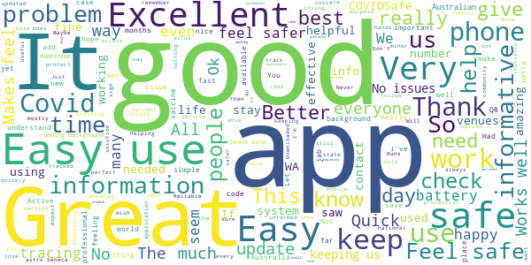

# COVIDSafe
App version ``2.5``

Analyzed with [covid-apps-observer](http://github.com/covid-apps-observer) project, version ``0.1``

## App overview
| | |
|-------------------------|-------------------------| 
| **Name**                                          | COVIDSafe |
| **Unique identifier** | au.gov.health.covidsafe |
| **Link to Google Play** | [https://play.google.com/store/apps/details?id=au.gov.health.covidsafe](https://play.google.com/store/apps/details?id=au.gov.health.covidsafe) |
| **Summary**  | COVIDSafe is a community-based way to stop the spread of COVID-19. |
| **Privacy policy** | [https://covidsafe.gov.au/privacy-policy.html](https://covidsafe.gov.au/privacy-policy.html) |
| **Latest version** | 2.5 |
| **Last update** | 2021-04-08 01:30:27 |
| **Recent changes** | Minor bug fixes and changes |
| **Installs**  | 1,000,000+ |
| **Category** | Health & Fitness |
| **First release** | Apr 25, 2020 |
| **Size**  | 13M |
| **Supported Android version**  | 5.0 and up |

### Description
> COVIDSafe app has been developed by the Australian Government Department of Health to help keep the community safe from coronavirus (COVID-19). Together, let’s help stop the spread and keep ourselves and each other healthy.
 COVIDSafe uses the Bluetooth® technology on your mobile phone to look for other devices with COVIDSafe installed. Your device will take a note of contact you’ve had with other users by securely logging the other user’s reference code. If you or someone you’ve been in contact with is diagnosed with COVID-19, the close contact information securely stored in your phone can be uploaded and used—with your consent—by state and territory health officials to quickly inform people who’ve been exposed to the virus.
 How you can help stop the spread of COVID-19:
 • Download the COVIDSafe app
 • Register using your mobile phone number, name, age range and postcode
 • Turn on Bluetooth®
 • Check that COVIDSafe is running when you are out and about or are likely to come into contact with others
 • If you test positive for COVID-19, you can consent for your close contact information to be used by state and territory health officials to contact people who may have been exposed. If you’ve been exposed to the virus by someone you’ve been in close contact with, state and territory health officials will be able to contact you quickly so you can get the support you need
 COVIDSafe is an Australian Government Department of Health initiative. Visit https://www.health.gov.au/resources/apps-and-tools/covidsafe-app for more information.

### User interface
The developers of the app provide the following screenshots in the Google play store.
| | | |
|:-------------------------:|:-------------------------:|:-------------------------:|
 |   |   |   | 
 |   |  

## Development team
In the following we report the main information provided by the development team in the Google play store.

| | |
|-------------------------|-------------------------|
| **Developer**  | Australian Department of Health |
| **Website**  | [https://www.health.gov.au/resources/apps-and-tools/covidsafe-app#covidsafe-app-help](https://www.health.gov.au/resources/apps-and-tools/covidsafe-app#covidsafe-app-help) |
| **Email** | support@COVIDSafe.gov.au |
| **Physical address**  | - |
| **Other developed apps**  | [https://play.google.com/store/apps/developer?id=Australian+Department+of+Health](https://play.google.com/store/apps/developer?id=Australian+Department+of+Health) |

## Android support

| | |
|-------------------------|-------------------------|
| **Declared target Android version**  | Android10, version 10 (API level 29) |
| **Effective target Android version**  | Android10, version 10 (API level 29) |
| **Minimum supported Android version**  | Lollipop, version 5.0 (API level 21) |
| **Maximum target Android version**  | - |

The larger the difference between the minimum and maximum supported Android versions, the better. A larger difference means a wider audience. For example, old phones have a very low Android version, so a high minimum supported Android version means that the app cannot be used by users with old phones, thus leading to accessibility problems. 

## Requested permissions

In the following we report the complete list of the permissions requested by the app. 

| **Permission** | **Protection level** | **Description** | 
|-------------------------|-------------------------|-------------------------|
 **android.permission ACCESS_COARSE_LOCATION** | :warning:**Dangerous** | Allows an app to access approximate location. 
 **android.permission ACCESS_FINE_LOCATION** | :warning:**Dangerous** | Allows an app to access precise location. 
 **android.permission ACCESS_NETWORK_STATE** | Normal | Allows applications to access information about networks. 
 **android.permission BLUETOOTH** | Normal | Allows applications to connect to paired bluetooth devices. 
 **android.permission BLUETOOTH_ADMIN** | Normal | Allows applications to discover and pair bluetooth devices. 
 **android.permission FOREGROUND_SERVICE** | Normal | Allows a regular application to use Service.startForeground. 
 **android.permission INTERNET** | Normal | Allows applications to open network sockets. 
 **android.permission RECEIVE_BOOT_COMPLETED** | Normal | Allows an application to receive the Intent.ACTION_BOOT_COMPLETED that is broadcast after the system finishes booting. 
 **android.permission REQUEST_IGNORE_BATTERY_OPTIMIZATIONS** | Normal | Permission an application must hold in order to use Settings.ACTION_REQUEST_IGNORE_BATTERY_OPTIMIZATIONS. 
 **android.permission WAKE_LOCK** | Normal | Allows using PowerManager WakeLocks to keep processor from sleeping or screen from dimming. 
 **com.google.android.c2dm.permission RECEIVE** | - | - 

## Mentioned servers

| **Server** | **Registrant** | **Registrant country** | **Creation date** | 
|-------------------------|-------------------------|-------------------------|-------------------------|
 | google.com | Google LLC | :us: US | 1997-09-15 04:00:00 |
 | stackoverflow.com | Stack Exchange, Inc. | :us: US | 2003-12-26 19:18:07 |
 | googleapis.com | Google LLC | :us: US | 2005-01-25 17:52:26 |

## Security analysis 

Below we report the main security warnings raised by our execution of the [Androwarn](https://github.com/maaaaz/androwarn) security analysis tool.

**Connection interfaces exfiltration**
> - This application reads details about the currently active data network 
> - This application tries to find out if the currently active data network is metered 

**Suspicious connection establishment**
> - This application opens a Socket and connects it to the remote address ' returned no addresses for  ; port is out of range' on the 'N/A' port  
> - This application opens a Socket and connects it to the remote address '' on the 'N/A' port  
> - This application opens a Socket and connects it to the remote address 'Ljava/lang/StringBuilder;->toString()Ljava/lang/String;' on the 'N/A' port  
> - This application opens a Socket and connects it to the remote address 'Ljava/net/Proxy;->type()Ljava/net/Proxy$Type;' on the 'N/A' port  
> - This application opens a Socket and connects it to the remote address 'timeout' on the 'N/A' port  

## User ratings and reviews

Below we provide information about how end users are reacting to the app in terms of ratings and reviews in the Google Play store.

### Ratings

The COVIDSafe app has been installed by more than **1000000** times. At this time, **17742** rated the app and its average score is **3.7339957**. Below we show the distribution of the ratings across the usual star-based rating of Google Play

:star::star::star::star::star:: 9254

:star::star::star::star:: 2379

:star::star::star:: 1664

:star::star:: 1028

:star:: 3417

### Reviews 

#### 5-star reviews

> Very easy to use and full of pertinent information.  :date: __2021-05-08 08:38:54__

> Helping community  :date: __2021-05-07 12:11:40__

> Good  :date: __2021-05-06 22:49:37__

> It helps you knoe more about covid. Really informative  :date: __2021-05-06 09:30:05__

> Keeps me informed.  :date: __2021-05-06 09:16:46__

> Very nice to see incremental improvements. I still remember people mocking it in the beginning days that it won't work. It is an awesome app that evolved so quickly & I 💚 it.  :date: __2021-05-06 06:34:09__

> No trouble. I have a Samsung phone  :date: __2021-05-06 06:22:34__

> Easy to install and access providing clear current updates  :date: __2021-05-05 21:32:21__

> Uu  :date: __2021-05-04 11:44:42__

> It is fast and efficient.  :date: __2021-05-04 07:01:44__

#### 4-star reviews

> I can easily access information about the covid-19.  :date: __2021-05-09 12:25:58__

> I like the way it stays active on my phone while I'm out shopping  :date: __2021-05-09 03:11:58__

> Missing a QR code scanning tool  :date: __2021-05-06 05:36:09__

> Never had an issue. Gives me peace of mind.  :date: __2021-05-04 05:26:40__

> Good  :date: __2021-05-03 10:57:05__

> Do yourself a favour, download the app. Better to be safe than uninformed and sorry. Stay well.  :date: __2021-05-02 14:26:03__

> b0  :date: __2021-04-28 09:37:29__

> Arexff  :date: __2021-04-28 02:08:56__

> Very good  :date: __2021-04-28 00:32:38__

> Satisfied  :date: __2021-04-26 01:21:15__

#### 3-star reviews

> too much power  :date: __2021-05-09 12:22:33__

> Was good until battery usage went through the roof.. uninstalled it....  :date: __2021-05-04 23:26:14__

> Good so far  :date: __2021-05-04 04:34:31__

> It has never reported anything.  :date: __2021-05-02 10:48:28__

> Not sure it is working  :date: __2021-05-01 11:48:40__

> Disappointing. I used this from the word go as I believe it to be a useful tool for its purpose. In the last ?week? or so it has been responsible for massive power drains to the point my phone switched off. The last episode was 70% power usage, yesterday, so unfortunately it is gone.  :date: __2021-04-30 01:29:57__

> Ok app, simple to use. Dont like that the camera keeps locking up, so need to close app and try again  :date: __2021-04-29 13:08:42__

> I found this App instructions to be reasonably ok to follow☺..And I hate using phone for anything..But it's for humanity?.😕  :date: __2021-04-27 21:55:50__

> Sometime difficulty scanning  :date: __2021-04-27 10:29:05__

> A failure, due to insufficient uptake! Hey, fools, THIS APP DOES NOT TRACK YOUR MOVEMENTS!! You can easily verify this with Settings/Location/Recent. What's your excuse for not using the app now, you idiots? Also, you can force stop the app when not in use to help prolong battery life...  :date: __2021-04-26 11:33:22__

#### 2-star reviews

> This version consumes way too much battery. Last night it used half my battery in 7 hours. If this is not fixed, I might have to uninstall it. Edit: the latest version is better on a phone restart, but slowly consumes more battery over time, until it drains most of my battery in a few hours.  :date: __2021-05-07 01:50:13__

> Had no issue with this being a background app until it started draining my battery after the last update. Great concept but given that nobody uses this app it's an absolute dud.  :date: __2021-05-04 00:33:59__

> Pop down selections for state don't work. You have to hit home go get out, which may of may not work. Don't use device back buttons or you could end up in trouble. Have had the app since in inception so was notified of availability of update, which I did only to get a big red warning flag that my registration had elapsed and I had to step through a bunch of steps to add personal data. Why wasn't I notified separately. Clunky awkward app.  :date: __2021-05-02 04:26:03__

> I iPhone to see the money in the bank not it's been 4 years stop dragging  :date: __2021-05-01 07:23:23__

> So so a pointless app when you have to use service N.S.W to check in everywhere  :date: __2021-04-28 23:02:58__

> The latest update has stuffed up battery usage. I work in a large organisation and 8 hours of background usage chews up 43% of battery of my Samsung Note 9. I literally have to keep my phone plugged all day at work. This needs to be fixed ASAP.  :date: __2021-04-28 08:14:42__

> Always when I want to use it....it needs to be updated  :date: __2021-04-28 07:00:21__

> Doesn't work on old phones  :date: __2021-04-28 01:45:55__

> What does it actually do? Does it even work?  :date: __2021-04-24 09:14:11__

> The new update drains my phone battery. I charged before I slept and it went from 100% to 46% overnight. I've removed the app  :date: __2021-04-24 07:41:57__

#### 1-star reviews

> I up dated this app as requested and it hasnt worked since.  :date: __2021-05-09 17:24:28__

> Massive battery drain. Only 8 hrs after taking it off charge, battery usage shows 59.8% to the COVIDSafe app, draining it down to 23%. Whatever changes the last update made has made this app useless. And it still disrupts streaming music via Bluetooth. 8/5/21 App still drains a huge amount of battery life. Sitting at home, app shows battery usage 65%, after 8 hours off charge and drained my battery to 1%. Absolutely shocking usage for just sitting on my desk doing nothing.  :date: __2021-05-08 12:23:19__

> Mmm  :date: __2021-05-08 10:10:29__

> Waste of money  :date: __2021-05-08 09:13:43__

> Waste of effort  :date: __2021-05-08 05:59:30__

> The battery drain is just too much. Just running in the background while I sleep it's used over 20%. There's been enough time to address the problem, not putting up with it any more and I don't really have the time to charge my phone several times a day! Also given that we're actually signing in everywhere in addition to this... seems a bit pointless. Uninstalling.  :date: __2021-05-08 01:48:45__

> Please resolve battery drainage issues - app now uses 28% of my battery in a day.  :date: __2021-05-08 01:40:52__

> The results speak for themselves how many cases has this app solved.  :date: __2021-05-08 00:15:18__

> Uninstalled due to high battery use, again.  :date: __2021-05-07 14:39:53__

> 24 hours behind  :date: __2021-05-07 10:41:56__

