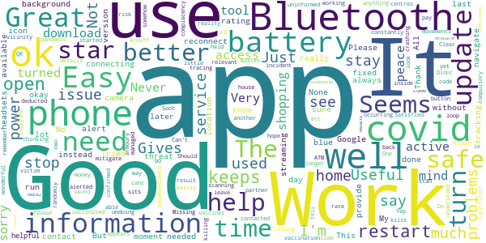
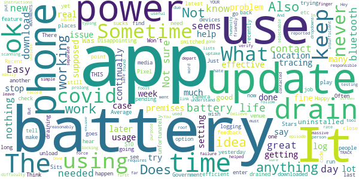
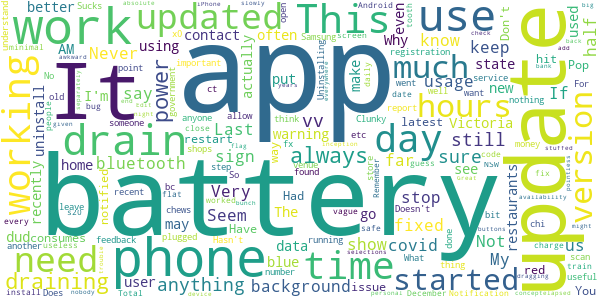

# COVIDSafe
App version ``2.5``

Analyzed with [covid-apps-observer](http://github.com/covid-apps-observer) project, version ``0.1``

## App overview
| | |
|-------------------------|-------------------------| 
| **Name**&nbsp;&nbsp;&nbsp;&nbsp;&nbsp;&nbsp;&nbsp;&nbsp;&nbsp;&nbsp;&nbsp;&nbsp;&nbsp;&nbsp;&nbsp;&nbsp;&nbsp;&nbsp;&nbsp;&nbsp;&nbsp;&nbsp;&nbsp;&nbsp;&nbsp;&nbsp;&nbsp;&nbsp;&nbsp;&nbsp;&nbsp;&nbsp;&nbsp;&nbsp;&nbsp;&nbsp;&nbsp;&nbsp;&nbsp;&nbsp;  | COVIDSafe |
| **Unique identifier** | au.gov.health.covidsafe |
| **Link to Google Play** | [https://play.google.com/store/apps/details?id=au.gov.health.covidsafe](https://play.google.com/store/apps/details?id=au.gov.health.covidsafe) |
| **Summary**  | COVIDSafe is a community-based way to stop the spread of COVID-19. |
| **Privacy policy** | [https://covidsafe.gov.au/privacy-policy.html](https://covidsafe.gov.au/privacy-policy.html) |
| **Latest version** | 2.5 |
| **Last update** | 2021-04-08 01:30:27 |
| **Recent changes** | Minor bug fixes and changes |
| **Installs**  | 1,000,000+ |
| **Category** | Health & Fitness |
| **First release** | Apr 25, 2020 |
| **Size**  | 13M |
| **Supported Android version**  | 5.0 and up |

### Description
> COVIDSafe app has been developed by the Australian Government Department of Health to help keep the community safe from coronavirus (COVID-19). Together, let’s help stop the spread and keep ourselves and each other healthy.
 COVIDSafe uses the Bluetooth® technology on your mobile phone to look for other devices with COVIDSafe installed. Your device will take a note of contact you’ve had with other users by securely logging the other user’s reference code. If you or someone you’ve been in contact with is diagnosed with COVID-19, the close contact information securely stored in your phone can be uploaded and used—with your consent—by state and territory health officials to quickly inform people who’ve been exposed to the virus.
 How you can help stop the spread of COVID-19:
 • Download the COVIDSafe app
 • Register using your mobile phone number, name, age range and postcode
 • Turn on Bluetooth®
 • Check that COVIDSafe is running when you are out and about or are likely to come into contact with others
 • If you test positive for COVID-19, you can consent for your close contact information to be used by state and territory health officials to contact people who may have been exposed. If you’ve been exposed to the virus by someone you’ve been in close contact with, state and territory health officials will be able to contact you quickly so you can get the support you need
 COVIDSafe is an Australian Government Department of Health initiative. Visit https://www.health.gov.au/resources/apps-and-tools/covidsafe-app for more information.

### User interface
The developers of the app provide the following screenshots in the Google play store.
| | | |
|:-------------------------:|:-------------------------:|:-------------------------:|
 |   |   |   | 
 |   |  

## Development team
In the following we report the main information provided by the development team in the Google play store.

| | |
|-------------------------|-------------------------|
| **Developer**  | Australian Department of Health |
| **Website**  | [https://www.health.gov.au/resources/apps-and-tools/covidsafe-app#covidsafe-app-help](https://www.health.gov.au/resources/apps-and-tools/covidsafe-app#covidsafe-app-help) |
| **Email** | support@COVIDSafe.gov.au |
| **Physical address**  | - |
| **Other developed apps**  | [https://play.google.com/store/apps/developer?id=Australian+Department+of+Health](https://play.google.com/store/apps/developer?id=Australian+Department+of+Health) |

## Android support

| | |
|-------------------------|-------------------------|
| **Declared target Android version**  | Android10, version 10 (API level 29) |
| **Effective target Android version**  | Android10, version 10 (API level 29) |
| **Minimum supported Android version**  | Lollipop, version 5.0 (API level 21) |
| **Maximum target Android version**  | - |

The larger the difference between the minimum and maximum supported Android versions, the better. A larger difference means a wider audience. For example, old phones have a very low Android version, so a high minimum supported Android version means that the app cannot be used by users with old phones, thus leading to accessibility problems. 

## Requested permissions

In the following we report the complete list of the permissions requested by the app. 

| **Permission** | **Protection level** | **Description** | 
|-------------------------|-------------------------|-------------------------|
 **android.permission ACCESS_COARSE_LOCATION** | :warning:**Dangerous** | Allows an app to access approximate location. 
 **android.permission ACCESS_FINE_LOCATION** | :warning:**Dangerous** | Allows an app to access precise location. 
 **android.permission ACCESS_NETWORK_STATE** | Normal | Allows applications to access information about networks. 
 **android.permission BLUETOOTH** | Normal | Allows applications to connect to paired bluetooth devices. 
 **android.permission BLUETOOTH_ADMIN** | Normal | Allows applications to discover and pair bluetooth devices. 
 **android.permission FOREGROUND_SERVICE** | Normal | Allows a regular application to use Service.startForeground. 
 **android.permission INTERNET** | Normal | Allows applications to open network sockets. 
 **android.permission RECEIVE_BOOT_COMPLETED** | Normal | Allows an application to receive the Intent.ACTION_BOOT_COMPLETED that is broadcast after the system finishes booting. 
 **android.permission REQUEST_IGNORE_BATTERY_OPTIMIZATIONS** | Normal | Permission an application must hold in order to use Settings.ACTION_REQUEST_IGNORE_BATTERY_OPTIMIZATIONS. 
 **android.permission WAKE_LOCK** | Normal | Allows using PowerManager WakeLocks to keep processor from sleeping or screen from dimming. 
 **com.google.android.c2dm.permission RECEIVE** | - | - 

## Mentioned servers

| **Server** | **Registrant** | **Registrant country** | **Creation date** | 
|-------------------------|-------------------------|-------------------------|-------------------------|
 | google.com | Google LLC | :us: US | 1997-09-15 04:00:00 |
 | stackoverflow.com | Stack Exchange, Inc. | :us: US | 2003-12-26 19:18:07 |
 | googleapis.com | Google LLC | :us: US | 2005-01-25 17:52:26 |

## Security analysis 

Below we report the main security warnings raised by our execution of the [Androwarn](https://github.com/maaaaz/androwarn) security analysis tool.

**Connection interfaces exfiltration**
> - This application reads details about the currently active data network 
> - This application tries to find out if the currently active data network is metered 

**Suspicious connection establishment**
> - This application opens a Socket and connects it to the remote address ' returned no addresses for  ; port is out of range' on the 'N/A' port  
> - This application opens a Socket and connects it to the remote address '' on the 'N/A' port  
> - This application opens a Socket and connects it to the remote address 'Ljava/lang/StringBuilder;->toString()Ljava/lang/String;' on the 'N/A' port  
> - This application opens a Socket and connects it to the remote address 'Ljava/net/Proxy;->type()Ljava/net/Proxy$Type;' on the 'N/A' port  
> - This application opens a Socket and connects it to the remote address 'timeout' on the 'N/A' port  

## User ratings and reviews

Below we provide information about how end users are reacting to the app in terms of ratings and reviews in the Google Play store.

### Ratings

The COVIDSafe app has been installed by more than **1000000** times. At this time, **17742** rated the app and its average score is **3.7339957**. Below we show the distribution of the ratings across the usual star-based rating of Google Play

:star::star::star::star::star:: 9254

:star::star::star::star:: 2379

:star::star::star:: 1664

:star::star:: 1028

:star:: 3417

### Reviews 

#### 5-star reviews

> Easy to use  :date: __2021-04-29 04:26:25__

> It's been there helpful in my travel plans  :date: __2021-04-29 00:55:51__

> Easy to use.  :date: __2021-04-28 12:23:20__

> Easy to use  :date: __2021-04-28 08:20:35__

> All good no problems.  :date: __2021-04-28 06:57:21__

> great  :date: __2021-04-28 05:47:50__

> Easy to use  :date: __2021-04-28 01:04:37__

> Will not give a pin number ⁸  :date: __2021-04-27 23:25:07__

> Good  :date: __2021-04-27 10:39:43__

> Easy to handle and follow  :date: __2021-04-27 09:37:26__

#### 4-star reviews

> b0  :date: __2021-04-28 09:37:29__

> Arexff  :date: __2021-04-28 02:08:56__

> Very good  :date: __2021-04-28 00:32:38__

> Satisfied  :date: __2021-04-26 01:21:15__

> Turn it on when I leave the house. Can't have it on at home because partner also has his turned on and it kills my battery constantly connecting the two of us. Turning it off means I cant use anything that needs bluetooth. Should be able to tell it when your home and to stop connecting with someone else in your home so you can have it turned on without killing your battery  :date: __2021-04-25 09:08:10__

> Useful information but would be better if had relevant vaccination details ie where you can get vaccinated how when etc.  :date: __2021-04-25 04:22:27__

> None yet  :date: __2021-04-24 08:04:39__

> Just runs in the background, great little app for tracking your movements to ensure you are alerted if a covid victim has been in your vicinity.  :date: __2021-04-23 16:22:37__

> Good  :date: __2021-04-22 02:36:19__

> Easy to use and appears to be ok.  :date: __2021-04-22 01:58:13__

#### 3-star reviews

> Ok app, simple to use. Dont like that the camera keeps locking up, so need to close app and try again  :date: __2021-04-29 13:08:42__

> I found this App instructions to be reasonably ok to follow☺..And I hate using phone for anything..But it's for humanity?.😕  :date: __2021-04-27 21:55:50__

> Sometime difficulty scanning  :date: __2021-04-27 10:29:05__

> A failure, due to insufficient uptake! Hey, fools, THIS APP DOES NOT TRACK YOUR MOVEMENTS!! You can easily verify this with Settings/Location/Recent. What's your excuse for not using the app now, you idiots? Also, you can force stop the app when not in use to help prolong battery life...  :date: __2021-04-26 11:33:22__

> Average  :date: __2021-04-26 09:51:55__

> I like how this keeps you safe from covid. I do wish it had covid testing where you put your finger on the screen and tells you if you have covid.  :date: __2021-04-24 16:05:28__

> What I don't understand is why are there separate check in Apps should they all link?  :date: __2021-04-23 14:33:35__

> Easy, must say... .  :date: __2021-04-23 09:01:43__

> gets the job done, but requires a lot of typing, more dropdowns and selectable lists would be friendly  :date: __2021-04-23 08:13:11__

> Not sure how effective the app is. Drains battery for sure.  :date: __2021-04-23 06:33:03__

#### 2-star reviews

> So so a pointless app when you have to use service N.S.W to check in everywhere  :date: __2021-04-28 23:02:58__

> The latest update has stuffed up battery usage. I work in a large organisation and 8 hours of background usage chews up 43% of battery of my Samsung Note 9. I literally have to keep my phone plugged all day at work. This needs to be fixed ASAP.  :date: __2021-04-28 08:14:42__

> Always when I want to use it....it needs to be updated  :date: __2021-04-28 07:00:21__

> Doesn't work on old phones  :date: __2021-04-28 01:45:55__

> What does it actually do? Does it even work?  :date: __2021-04-24 09:14:11__

> The new update drains my phone battery. I charged before I slept and it went from 100% to 46% overnight. I've removed the app  :date: __2021-04-24 07:41:57__

> A wasted opportunity. This app should have included a single consistent venue registration system and give feedback to tbe users about how many/new contacts they are accumulating, so that we can improve our social distancing.  :date: __2021-04-23 10:33:01__

> As much as I like the idea of this app, it started using a lot of battery recently. Uninstalling.  :date: __2021-04-23 08:17:27__

> I don't see the point. Only works if I activate it and sorry but that's not always the most important thing I think of when out and about. Would be useful if always activated!  :date: __2021-04-21 13:14:51__

> 10 million downloaded, 7 traces made. No sign in function: need a separate app for that  :date: __2021-04-21 11:05:51__

#### 1-star reviews

> Uses too much processor  :date: __2021-04-29 09:53:07__

> Dosent work  :date: __2021-04-29 09:24:07__

> Waste of space  :date: __2021-04-28 23:55:42__

> Uninstalling this app as it has done nothing for the Australian population and done nothing basically for contact tracing efforts  :date: __2021-04-28 08:06:38__

> Keeps draining my battery. With the Covid app my phone lasts 7 hours. After I uninstall the application my phone lasts 13 hours.  :date: __2021-04-27 09:55:15__

> Uses lots of battery. Has not seemed to be effective with contact tracing.  :date: __2021-04-27 09:19:48__

> What a waste of time and energy  :date: __2021-04-27 05:33:25__

> Useless  :date: __2021-04-27 05:19:37__

> So far it has taken 1 hour to update...shouldn't take this long!  :date: __2021-04-27 04:22:42__

> Useless waste of taxpayers money  :date: __2021-04-26 05:44:16__

