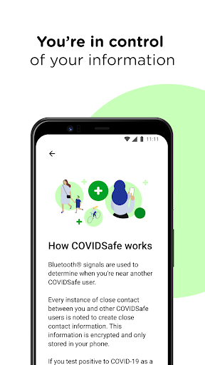
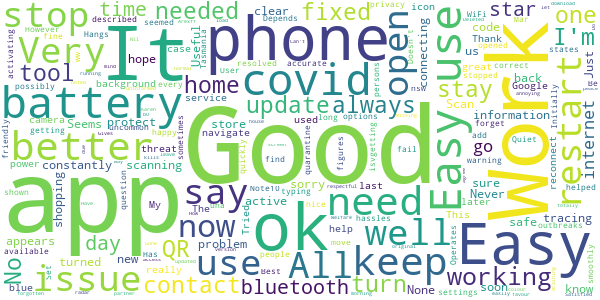
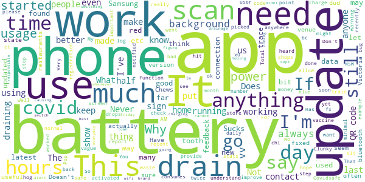
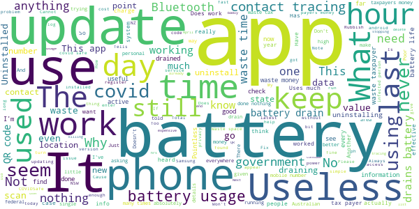

# COVIDSafe
App version ``2.6``

Analyzed with [covid-apps-observer](http://github.com/covid-apps-observer) project, version ``0.1``

## App overview
| | |
|-------------------------|-------------------------| 
| **Name**&nbsp;&nbsp;&nbsp;&nbsp;&nbsp;&nbsp;&nbsp;&nbsp;&nbsp;&nbsp;&nbsp;&nbsp;&nbsp;&nbsp;&nbsp;&nbsp;&nbsp;&nbsp;&nbsp;&nbsp;&nbsp;&nbsp;&nbsp;&nbsp;&nbsp;&nbsp;&nbsp;&nbsp;&nbsp;&nbsp;&nbsp;&nbsp;&nbsp;&nbsp;&nbsp;&nbsp;&nbsp;&nbsp;&nbsp;&nbsp;  | COVIDSafe |
| **Unique identifier** | au.gov.health.covidsafe |
| **Link to Google Play** | [https://play.google.com/store/apps/details?id=au.gov.health.covidsafe](https://play.google.com/store/apps/details?id=au.gov.health.covidsafe) |
| **Summary**  | COVIDSafe is a community-based way to stop the spread of COVID-19. |
| **Privacy policy** | [https://covidsafe.gov.au/privacy-policy.html](https://covidsafe.gov.au/privacy-policy.html) |
| **Latest version** | 2.6 |
| **Last update** | 2021-05-07 14:01:12 |
| **Recent changes** | Bug fixes and minor changes to enhance support for non-Australian mobile numbers. |
| **Installs**  | 1,000,000+ |
| **Category** | Health & Fitness |
| **First release** | Apr 25, 2020 |
| **Size**  | 13M |
| **Supported Android version**  | 5.0 and up |

### Description
> COVIDSafe app has been developed by the Australian Government Department of Health to help keep the community safe from coronavirus (COVID-19). Together, let’s help stop the spread and keep ourselves and each other healthy.
 COVIDSafe uses the Bluetooth® technology on your mobile phone to look for other devices with COVIDSafe installed. Your device will take a note of contact you’ve had with other users by securely logging the other user’s reference code. If you or someone you’ve been in contact with is diagnosed with COVID-19, the close contact information securely stored in your phone can be uploaded and used—with your consent—by state and territory health officials to quickly inform people who’ve been exposed to the virus.
 How you can help stop the spread of COVID-19:
 • Download the COVIDSafe app
 • Register using your mobile phone number, name, age range and postcode
 • Turn on Bluetooth®
 • Check that COVIDSafe is running when you are out and about or are likely to come into contact with others
 • If you test positive for COVID-19, you can consent for your close contact information to be used by state and territory health officials to contact people who may have been exposed. If you’ve been exposed to the virus by someone you’ve been in close contact with, state and territory health officials will be able to contact you quickly so you can get the support you need
 COVIDSafe is an Australian Government Department of Health initiative. Visit https://www.health.gov.au/resources/apps-and-tools/covidsafe-app for more information.

### User interface
The developers of the app provide the following screenshots in the Google play store.
| | | |
|:-------------------------:|:-------------------------:|:-------------------------:|
 |   |   |   | 
 |   |  

## Development team
In the following we report the main information provided by the development team in the Google play store.

| | |
|-------------------------|-------------------------|
| **Developer**  | Australian Department of Health |
| **Website**  | [https://www.health.gov.au/resources/apps-and-tools/covidsafe-app#covidsafe-app-help](https://www.health.gov.au/resources/apps-and-tools/covidsafe-app#covidsafe-app-help) |
| **Email** | support@COVIDSafe.gov.au |
| **Physical address**  | - |
| **Other developed apps**  | [https://play.google.com/store/apps/developer?id=Australian+Department+of+Health](https://play.google.com/store/apps/developer?id=Australian+Department+of+Health) |

## Android support

| | |
|-------------------------|-------------------------|
| **Declared target Android version**  | Android10, version 10 (API level 29) |
| **Effective target Android version**  | Android10, version 10 (API level 29) |
| **Minimum supported Android version**  | Lollipop, version 5.0 (API level 21) |
| **Maximum target Android version**  | - |

The larger the difference between the minimum and maximum supported Android versions, the better. A larger difference means a wider audience. For example, old phones have a very low Android version, so a high minimum supported Android version means that the app cannot be used by users with old phones, thus leading to accessibility problems. 

## Requested permissions

In the following we report the complete list of the permissions requested by the app. 

| **Permission** | **Protection level** | **Description** | 
|-------------------------|-------------------------|-------------------------|
 **android.permission ACCESS_COARSE_LOCATION** | :warning:**Dangerous** | Allows an app to access approximate location. 
 **android.permission ACCESS_FINE_LOCATION** | :warning:**Dangerous** | Allows an app to access precise location. 
 **android.permission ACCESS_NETWORK_STATE** | Normal | Allows applications to access information about networks. 
 **android.permission BLUETOOTH** | Normal | Allows applications to connect to paired bluetooth devices. 
 **android.permission BLUETOOTH_ADMIN** | Normal | Allows applications to discover and pair bluetooth devices. 
 **android.permission FOREGROUND_SERVICE** | Normal | Allows a regular application to use Service.startForeground. 
 **android.permission INTERNET** | Normal | Allows applications to open network sockets. 
 **android.permission RECEIVE_BOOT_COMPLETED** | Normal | Allows an application to receive the Intent.ACTION_BOOT_COMPLETED that is broadcast after the system finishes booting. 
 **android.permission REQUEST_IGNORE_BATTERY_OPTIMIZATIONS** | Normal | Permission an application must hold in order to use Settings.ACTION_REQUEST_IGNORE_BATTERY_OPTIMIZATIONS. 
 **android.permission WAKE_LOCK** | Normal | Allows using PowerManager WakeLocks to keep processor from sleeping or screen from dimming. 
 **com.google.android.c2dm.permission RECEIVE** | - | - 

## Mentioned servers

| **Server** | **Registrant** | **Registrant country** | **Creation date** | 
|-------------------------|-------------------------|-------------------------|-------------------------|
 | google.com | Google LLC | :us: US | 1997-09-15 04:00:00 |
 | stackoverflow.com | Stack Exchange, Inc. | :us: US | 2003-12-26 19:18:07 |
 | googleapis.com | Google LLC | :us: US | 2005-01-25 17:52:26 |

## Security analysis 

Below we report the main security warnings raised by our execution of the [Androwarn](https://github.com/maaaaz/androwarn) security analysis tool.

**Connection interfaces exfiltration**
> - This application reads details about the currently active data network 
> - This application tries to find out if the currently active data network is metered 

**Suspicious connection establishment**
> - This application opens a Socket and connects it to the remote address ' returned no addresses for  ; port is out of range' on the 'N/A' port  
> - This application opens a Socket and connects it to the remote address '' on the 'N/A' port  
> - This application opens a Socket and connects it to the remote address 'Ljava/lang/StringBuilder;->toString()Ljava/lang/String;' on the 'N/A' port  
> - This application opens a Socket and connects it to the remote address 'Ljava/net/Proxy;->type()Ljava/net/Proxy$Type;' on the 'N/A' port  
> - This application opens a Socket and connects it to the remote address 'timeout' on the 'N/A' port  

## User ratings and reviews

Below we provide information about how end users are reacting to the app in terms of ratings and reviews in the Google Play store.

### Ratings

The COVIDSafe app has been installed by more than **1000000** times. At this time, **18855** rated the app and its average score is **3.6971428**. Below we show the distribution of the ratings across the usual star-based rating of Google Play

:star::star::star::star::star:: 9404

:star::star::star::star:: 2938

:star::star::star:: 1596

:star::star:: 1234

:star:: 3683

### Reviews 

#### 5-star reviews

> Good  :date: __2021-05-22 10:53:34__

> No concerns  :date: __2021-05-22 07:50:50__

> Great  :date: __2021-05-22 06:58:35__

> Works very well with scanning the codes  :date: __2021-05-22 00:49:26__

> Very good  :date: __2021-05-22 00:15:19__

> Easy to install and update.  :date: __2021-05-21 23:35:37__

> Havnt got The VID19 yet so Its working!!  :date: __2021-05-21 05:05:39__

> Good to use  :date: __2021-05-21 02:47:23__

> Good to get updated, no cashes and is very light.  :date: __2021-05-20 06:17:19__

> Easy to follow and see updated numbers per state.  :date: __2021-05-20 00:28:17__

#### 4-star reviews

> Operates ok but not uncommon, to stop working. All settings correct on Note10+ but constantly getting warning that app has stopped working. Update Mar 2021- Issue appears fixed.  :date: __2021-05-22 17:15:15__

> Easy to use. Scan and go . No typing.  :date: __2021-05-22 10:39:14__

> Has been so long and seemed to be a good move to protect people's privacy. However, every states have their own QR scanning now, and I only have one question: has this app ever helped in contact tracing?  :date: __2021-05-21 12:37:12__

> Easy  :date: __2021-05-21 04:31:38__

> N.a. ww  :date: __2021-05-21 00:35:01__

> Its there but not sure what it would be like if needed in outbreaks.  :date: __2021-05-21 00:17:04__

> Easy to use and accurate figures.  :date: __2021-05-20 11:18:05__

> Good and easy  :date: __2021-05-20 10:01:42__

> All OK  :date: __2021-05-20 09:41:39__

> Very good.  :date: __2021-05-20 06:33:01__

#### 3-star reviews

> Why are there always 2 of them? Can I delete it now?  :date: __2021-05-20 05:55:03__

> Maybe it's just because it has been so long since I installed this app, but I'm not noticing as many issues with battery life. Still drains fast, but I'm lasting through the day, and that's all anyone can really ask for.  :date: __2021-05-20 05:12:32__

> 2020 Can't RESTRICT even though I've opened within a month it still shows Error in my notification panel. 2021 keeps logging me out?  :date: __2021-05-20 01:23:21__

> Who would know if it is working?  :date: __2021-05-19 10:54:28__

> when will it trace COVID?  :date: __2021-05-19 02:34:17__

> I have m o t a clue as to what I have achieved here seems to be a colmplete waste of esffort.  :date: __2021-05-18 13:56:10__

> Not as useful as QR Codes  :date: __2021-05-16 17:39:40__

> N/A  :date: __2021-05-16 09:50:04__

> I don't think it is as good as the Tasmanian app.  :date: __2021-05-16 08:05:02__

> Sometimes unreliable  :date: __2021-05-16 06:19:00__

#### 2-star reviews

> It says the app isn't working because battery optimization is on & it isn't & I updated it & put blue tooth on & it still says the app isn't working! Why? It let's me know when I have blue tooth on or off so it must be working to a certain degree.  :date: __2021-05-18 23:51:34__

> jjx  :date: __2021-05-18 08:33:48__

> Keeps shutting off my blu tooth  :date: __2021-05-18 04:51:42__

> SOME feedback might have made this a success. Eg from a daily count of connections, to a ping when a connection was made.  :date: __2021-05-18 01:58:39__

> Uses far too much battery power  :date: __2021-05-17 05:38:44__

> Clumsy, does not update efficiently even if the phone is re- started .  :date: __2021-05-16 08:17:20__

> Very ordinary  :date: __2021-05-16 07:35:25__

> I have not really seen it do anything other than sit in the background of my phone or request updates from time to time  :date: __2021-05-16 05:39:27__

> App doesn't include QR code scanning.  :date: __2021-05-16 05:37:33__

> Keeps turning itself off  :date: __2021-05-16 05:36:56__

#### 1-star reviews

> WA State app appears to have more relevance  :date: __2021-05-22 07:38:07__

> The latest version drains my battery faster than before.  :date: __2021-05-22 05:14:07__

> Just got in from NZ told to download the Aussie app, Did so and went to log in and get a message that my number is already registered to many times and I need to delete the app in order to re use it. I'm using the NZ tracer app and manually entering in the locations as I go  :date: __2021-05-22 04:59:01__

> The how to get to the scan option us a bloody mystery. There is no link for this Nore info on alternatives  :date: __2021-05-21 05:28:20__

> Govt propagander that does not work  :date: __2021-05-21 04:38:32__

> Can't use it to check in what's app can I use in South Australia  :date: __2021-05-21 03:55:51__

> This is the beginning of the end  :date: __2021-05-20 20:06:45__

> Won't work properly  :date: __2021-05-20 19:08:01__

> think this app is good to have but hear that should you be near a contact of covid 19 one is not being contacted by covid safe  :date: __2021-05-20 10:59:22__

> clunky  :date: __2021-05-20 10:24:37__

