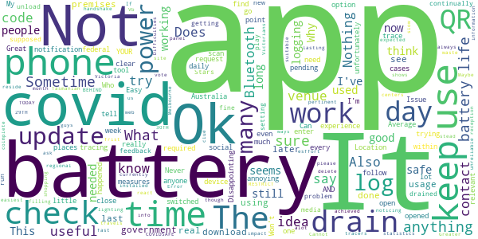

# COVIDSafe
App version ``2.6``

Analyzed with [covid-apps-observer](http://github.com/covid-apps-observer) project, version ``0.1``

## App overview
| | |
|-------------------------|-------------------------| 
| **Name**&nbsp;&nbsp;&nbsp;&nbsp;&nbsp;&nbsp;&nbsp;&nbsp;&nbsp;&nbsp;&nbsp;&nbsp;&nbsp;&nbsp;&nbsp;&nbsp;&nbsp;&nbsp;&nbsp;&nbsp;&nbsp;&nbsp;&nbsp;&nbsp;&nbsp;&nbsp;&nbsp;&nbsp;&nbsp;&nbsp;&nbsp;&nbsp;&nbsp;&nbsp;&nbsp;&nbsp;&nbsp;&nbsp;&nbsp;&nbsp;  | COVIDSafe |
| **Unique identifier** | au.gov.health.covidsafe |
| **Link to Google Play** | [https://play.google.com/store/apps/details?id=au.gov.health.covidsafe](https://play.google.com/store/apps/details?id=au.gov.health.covidsafe) |
| **Summary**  | COVIDSafe is a community-based way to stop the spread of COVID-19. |
| **Privacy policy** | [https://covidsafe.gov.au/privacy-policy.html](https://covidsafe.gov.au/privacy-policy.html) |
| **Latest version** | 2.6 |
| **Last update** | 2021-05-07 14:01:12 |
| **Recent changes** | Bug fixes and minor changes to enhance support for non-Australian mobile numbers. |
| **Installs**  | 1,000,000+ |
| **Category** | Health & Fitness |
| **First release** | Apr 25, 2020 |
| **Size**  | 13M |
| **Supported Android version**  | 5.0 and up |

### Description
> COVIDSafe app has been developed by the Australian Government Department of Health to help keep the community safe from coronavirus (COVID-19). Together, let’s help stop the spread and keep ourselves and each other healthy.
 COVIDSafe uses the Bluetooth® technology on your mobile phone to look for other devices with COVIDSafe installed. Your device will take a note of contact you’ve had with other users by securely logging the other user’s reference code. If you or someone you’ve been in contact with is diagnosed with COVID-19, the close contact information securely stored in your phone can be uploaded and used—with your consent—by state and territory health officials to quickly inform people who’ve been exposed to the virus.
 How you can help stop the spread of COVID-19:
 • Download the COVIDSafe app
 • Register using your mobile phone number, name, age range and postcode
 • Turn on Bluetooth®
 • Check that COVIDSafe is running when you are out and about or are likely to come into contact with others
 • If you test positive for COVID-19, you can consent for your close contact information to be used by state and territory health officials to contact people who may have been exposed. If you’ve been exposed to the virus by someone you’ve been in close contact with, state and territory health officials will be able to contact you quickly so you can get the support you need
 COVIDSafe is an Australian Government Department of Health initiative. Visit https://www.health.gov.au/resources/apps-and-tools/covidsafe-app for more information.

### User interface
The developers of the app provide the following screenshots in the Google play store.
| | | |
|:-------------------------:|:-------------------------:|:-------------------------:|
 |   |   |   | 
 |   |  

## Development team
In the following we report the main information provided by the development team in the Google play store.

| | |
|-------------------------|-------------------------|
| **Developer**  | Australian Department of Health |
| **Website**  | [https://www.health.gov.au/resources/apps-and-tools/covidsafe-app#covidsafe-app-help](https://www.health.gov.au/resources/apps-and-tools/covidsafe-app#covidsafe-app-help) |
| **Email** | support@COVIDSafe.gov.au |
| **Physical address**  | - |
| **Other developed apps**  | [https://play.google.com/store/apps/developer?id=Australian+Department+of+Health](https://play.google.com/store/apps/developer?id=Australian+Department+of+Health) |

## Android support

| | |
|-------------------------|-------------------------|
| **Declared target Android version**  | Android10, version 10 (API level 29) |
| **Effective target Android version**  | Android10, version 10 (API level 29) |
| **Minimum supported Android version**  | Lollipop, version 5.0 (API level 21) |
| **Maximum target Android version**  | - |

The larger the difference between the minimum and maximum supported Android versions, the better. A larger difference means a wider audience. For example, old phones have a very low Android version, so a high minimum supported Android version means that the app cannot be used by users with old phones, thus leading to accessibility problems. 

## Requested permissions

In the following we report the complete list of the permissions requested by the app. 

| **Permission** | **Protection level** | **Description** | 
|-------------------------|-------------------------|-------------------------|
 **android.permission ACCESS_COARSE_LOCATION** | :warning:**Dangerous** | Allows an app to access approximate location. 
 **android.permission ACCESS_FINE_LOCATION** | :warning:**Dangerous** | Allows an app to access precise location. 
 **android.permission ACCESS_NETWORK_STATE** | Normal | Allows applications to access information about networks. 
 **android.permission BLUETOOTH** | Normal | Allows applications to connect to paired bluetooth devices. 
 **android.permission BLUETOOTH_ADMIN** | Normal | Allows applications to discover and pair bluetooth devices. 
 **android.permission FOREGROUND_SERVICE** | Normal | Allows a regular application to use Service.startForeground. 
 **android.permission INTERNET** | Normal | Allows applications to open network sockets. 
 **android.permission RECEIVE_BOOT_COMPLETED** | Normal | Allows an application to receive the Intent.ACTION_BOOT_COMPLETED that is broadcast after the system finishes booting. 
 **android.permission REQUEST_IGNORE_BATTERY_OPTIMIZATIONS** | Normal | Permission an application must hold in order to use Settings.ACTION_REQUEST_IGNORE_BATTERY_OPTIMIZATIONS. 
 **android.permission WAKE_LOCK** | Normal | Allows using PowerManager WakeLocks to keep processor from sleeping or screen from dimming. 
 **com.google.android.c2dm.permission RECEIVE** | - | - 

## Mentioned servers

| **Server** | **Registrant** | **Registrant country** | **Creation date** | 
|-------------------------|-------------------------|-------------------------|-------------------------|
 | google.com | Google LLC | :us: US | 1997-09-15 04:00:00 |
 | stackoverflow.com | Stack Exchange, Inc. | :us: US | 2003-12-26 19:18:07 |
 | googleapis.com | Google LLC | :us: US | 2005-01-25 17:52:26 |

## Security analysis 

Below we report the main security warnings raised by our execution of the [Androwarn](https://github.com/maaaaz/androwarn) security analysis tool.

**Connection interfaces exfiltration**
> - This application reads details about the currently active data network 
> - This application tries to find out if the currently active data network is metered 

**Suspicious connection establishment**
> - This application opens a Socket and connects it to the remote address ' returned no addresses for  ; port is out of range' on the 'N/A' port  
> - This application opens a Socket and connects it to the remote address '' on the 'N/A' port  
> - This application opens a Socket and connects it to the remote address 'Ljava/lang/StringBuilder;->toString()Ljava/lang/String;' on the 'N/A' port  
> - This application opens a Socket and connects it to the remote address 'Ljava/net/Proxy;->type()Ljava/net/Proxy$Type;' on the 'N/A' port  
> - This application opens a Socket and connects it to the remote address 'timeout' on the 'N/A' port  

## User ratings and reviews

Below we provide information about how end users are reacting to the app in terms of ratings and reviews in the Google Play store.

### Ratings

The COVIDSafe app has been installed by more than **1000000** times. At this time, **18855** rated the app and its average score is **3.6971428**. Below we show the distribution of the ratings across the usual star-based rating of Google Play

:star::star::star::star::star:: 9404

:star::star::star::star:: 2938

:star::star::star:: 1596

:star::star:: 1234

:star:: 3683

### Reviews 

#### 5-star reviews

> Easy peace of mind is great  :date: __2021-05-30 11:04:21__

> It's not just good but it is essential to have in the fight to get this virus under control.  :date: __2021-05-30 09:43:46__

> Easy to use and add people. Done in seconds. Excellent app  :date: __2021-05-30 05:41:06__

> Good all good  :date: __2021-05-29 01:19:57__

> Easy to use  :date: __2021-05-28 13:11:30__

> IT'S EASY TO USE AND IT DOESN'T MUCK AROUND  :date: __2021-05-28 13:05:00__

> All good thankyou  :date: __2021-05-28 11:38:40__

> Image test 😷👍  :date: __2021-05-28 11:31:49__

> Easy to use. Very helpful  :date: __2021-05-28 09:59:24__

> Tells me my phone number is not correct !!  :date: __2021-05-28 09:43:48__

#### 4-star reviews

> Easy to use  :date: __2021-05-28 10:58:03__

> Best options  :date: __2021-05-26 06:59:52__

> Depends on WiFi where ever you go  :date: __2021-05-26 05:24:01__

> It does what it says with no hassles so happy days  :date: __2021-05-24 16:29:19__

> All good  :date: __2021-05-24 09:37:08__

> Hangs when no internet available, possibly resolved by now.  :date: __2021-05-24 06:44:11__

> una me to get this app to work  :date: __2021-05-23 03:24:04__

> Operates ok but not uncommon, to stop working. All settings correct on Note10+ but constantly getting warning that app has stopped working. Update Mar 2021- Issue appears fixed.  :date: __2021-05-22 17:15:15__

> Easy to use. Scan and go . No typing.  :date: __2021-05-22 10:39:14__

> Has been so long and seemed to be a good move to protect people's privacy. However, every states have their own QR scanning now, and I only have one question: has this app ever helped in contact tracing?  :date: __2021-05-21 12:37:12__

#### 3-star reviews

> YOUR A DAY BEHIND ITS 30TH TODAY AND COVIDSAFE SAYS 29TH  :date: __2021-05-30 03:50:15__

> Nothing has happened to experience. I would like to know if it has been useful to contact tracers?  :date: __2021-05-29 11:38:35__

> Cannot find clear statistics for regional Victoria. Like many Victorians I do not reside in Greater Melbourne. I had expected clear information pertinent to me. I do have a vote!  :date: __2021-05-29 05:58:20__

> Its a little slow to react but over all it does work.  :date: __2021-05-29 05:56:12__

> Why can't the Covid safe app "handshake" with a device at venues where currently a QR scan us required?  :date: __2021-05-26 22:25:19__

> Not the easiest to open when trying to check in all ways trys to go web site frist  :date: __2021-05-26 09:36:08__

> Why are there always 2 of them? Can I delete it now?  :date: __2021-05-20 05:55:03__

> Maybe it's just because it has been so long since I installed this app, but I'm not noticing as many issues with battery life. Still drains fast, but I'm lasting through the day, and that's all anyone can really ask for.  :date: __2021-05-20 05:12:32__

> 2020 Can't RESTRICT even though I've opened within a month it still shows Error in my notification panel. 2021 keeps logging me out?  :date: __2021-05-20 01:23:21__

> Who would know if it is working?  :date: __2021-05-19 10:54:28__

#### 2-star reviews

> What a waste  :date: __2021-05-30 09:27:22__

> If this app worked we wouldn't be doing QR code scans. Go figure.  :date: __2021-05-29 01:36:48__

> Ever since the update it drops out whenever I'm in town. Works best at home on my wifi, but as soon as I switch to data, it drops out at random times. Not very safe.  :date: __2021-05-28 04:12:29__

> Im hoping that this update is going to work, my covid app , wouldn't scan, kept coming up with the red alert,this started last friday, switching phone off didnt do a thing,.  :date: __2021-05-24 06:27:02__

> Latest update of May is causing phone battery drainage. It is responsible for 50% of battery usage and phone needs charging twice everyday. I have a brand new Samsung phone.  :date: __2021-05-24 02:34:47__

> It says the app isn't working because battery optimization is on & it isn't & I updated it & put blue tooth on & it still says the app isn't working! Why? It let's me know when I have blue tooth on or off so it must be working to a certain degree.  :date: __2021-05-18 23:51:34__

> jjx  :date: __2021-05-18 08:33:48__

> Keeps shutting off my blu tooth  :date: __2021-05-18 04:51:42__

> SOME feedback might have made this a success. Eg from a daily count of connections, to a ping when a connection was made.  :date: __2021-05-18 01:58:39__

> Uses far too much battery power  :date: __2021-05-17 05:38:44__

#### 1-star reviews

> Consume 50% of my phone's battery... and don't really get any updates if this really works. I may just keep doing social distancing and contact check in.  :date: __2021-05-30 13:39:54__

> This app is a heavy battery user.  :date: __2021-05-30 12:41:47__

> Running android 7. Won't run for more than a few hours before stopping. Rubbish.  :date: __2021-05-30 10:54:44__

> Just doesn't report what it's doing Little impact on tracing  :date: __2021-05-30 10:14:41__

> No experience.  :date: __2021-05-30 07:32:27__

> Seems like a recent update has significantly impacted battery usage. My battery drained in 4 hrs, not interacting with it at all, with battery usage stats claiming it was 64% the covid safe app. Next highest app was 4%.  :date: __2021-05-30 05:15:04__

> With the upgrade the app hasn't worked at all  :date: __2021-05-29 11:38:31__

> Hopeless and expensive  :date: __2021-05-29 00:20:02__

> Badly run  :date: __2021-05-28 13:39:38__

> On Note 10, I don't have any of the problems others mention about bluetooth drop outs to car or Senheisser headphones or Samsung Watch. Edit:The version of the app in March 2021 has been the highest battery drainer in my apps list, battery that used to last 14 hours is lucky to make 10 hours now. April 2021 even worse, phone doesn't appear to go into low use standby, it is linearly draining the battery with Covidsafe app #1 on drain list.This app is killing my and wife battery in May 2021 <7Hrs.  :date: __2021-05-28 13:30:37__

