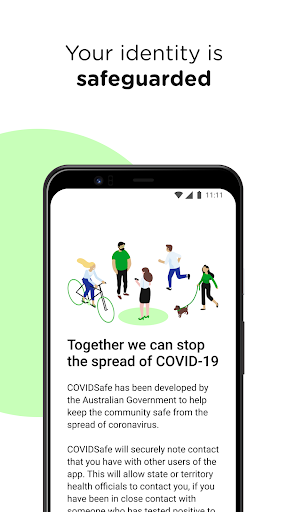
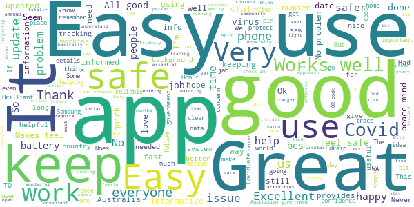
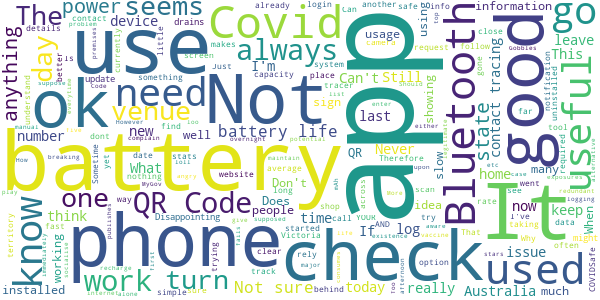

# COVIDSafe
App version ``2.7``

Analyzed with [covid-apps-observer](http://github.com/covid-apps-observer) project, version ``0.1``

## App overview
| | |
|-------------------------|-------------------------| 
| **Name**                                          | COVIDSafe |
| **Unique identifier** | au.gov.health.covidsafe |
| **Link to Google Play** | [https://play.google.com/store/apps/details?id=au.gov.health.covidsafe](https://play.google.com/store/apps/details?id=au.gov.health.covidsafe) |
| **Summary**  | COVIDSafe is a community-based way to stop the spread of COVID-19. |
| **Privacy policy** | [https://covidsafe.gov.au/privacy-policy.html](https://covidsafe.gov.au/privacy-policy.html) |
| **Latest version** | 2.7 |
| **Last update** | 2021-06-04 06:03:39 |
| **Recent changes** | Improved support for international visitors, minor content and bug fixes. |
| **Installs**  | 1,000,000+ |
| **Category** | Health & Fitness |
| **First release** | Apr 25, 2020 |
| **Size**  | 13M |
| **Supported Android version**  | 5.0 and up |

### Description
> COVIDSafe app has been developed by the Australian Government Department of Health to help keep the community safe from coronavirus (COVID-19). Together, let’s help stop the spread and keep ourselves and each other healthy.
 COVIDSafe uses the Bluetooth® technology on your mobile phone to look for other devices with COVIDSafe installed. Your device will take a note of contact you’ve had with other users by securely logging the other user’s reference code. If you or someone you’ve been in contact with is diagnosed with COVID-19, the close contact information securely stored in your phone can be uploaded and used—with your consent—by state and territory health officials to quickly inform people who’ve been exposed to the virus.
 How you can help stop the spread of COVID-19:
 • Download the COVIDSafe app
 • Register using your mobile phone number, name, age range and postcode
 • Turn on Bluetooth®
 • Check that COVIDSafe is running when you are out and about or are likely to come into contact with others
 • If you test positive for COVID-19, you can consent for your close contact information to be used by state and territory health officials to contact people who may have been exposed. If you’ve been exposed to the virus by someone you’ve been in close contact with, state and territory health officials will be able to contact you quickly so you can get the support you need
 COVIDSafe is an Australian Government Department of Health initiative. Visit https://www.health.gov.au/resources/apps-and-tools/covidsafe-app for more information.

### User interface
The developers of the app provide the following screenshots in the Google play store.
| | | |
|:-------------------------:|:-------------------------:|:-------------------------:|
 |   |   |   | 
 |   |  

## Development team
In the following we report the main information provided by the development team in the Google play store.

| | |
|-------------------------|-------------------------|
| **Developer**  | Australian Department of Health |
| **Website**  | [https://www.health.gov.au/resources/apps-and-tools/covidsafe-app#covidsafe-app-help](https://www.health.gov.au/resources/apps-and-tools/covidsafe-app#covidsafe-app-help) |
| **Email** | support@COVIDSafe.gov.au |
| **Physical address**  | - |
| **Other developed apps**  | [https://play.google.com/store/apps/developer?id=Australian+Department+of+Health](https://play.google.com/store/apps/developer?id=Australian+Department+of+Health) |

## Android support

| | |
|-------------------------|-------------------------|
| **Declared target Android version**  | Android10, version 10 (API level 29) |
| **Effective target Android version**  | Android10, version 10 (API level 29) |
| **Minimum supported Android version**  | Lollipop, version 5.0 (API level 21) |
| **Maximum target Android version**  | - |

The larger the difference between the minimum and maximum supported Android versions, the better. A larger difference means a wider audience. For example, old phones have a very low Android version, so a high minimum supported Android version means that the app cannot be used by users with old phones, thus leading to accessibility problems. 

## Requested permissions

In the following we report the complete list of the permissions requested by the app. 

| **Permission** | **Protection level** | **Description** | 
|-------------------------|-------------------------|-------------------------|
 **android.permission ACCESS_COARSE_LOCATION** | :warning:**Dangerous** | Allows an app to access approximate location. 
 **android.permission ACCESS_FINE_LOCATION** | :warning:**Dangerous** | Allows an app to access precise location. 
 **android.permission ACCESS_NETWORK_STATE** | Normal | Allows applications to access information about networks. 
 **android.permission BLUETOOTH** | Normal | Allows applications to connect to paired bluetooth devices. 
 **android.permission BLUETOOTH_ADMIN** | Normal | Allows applications to discover and pair bluetooth devices. 
 **android.permission FOREGROUND_SERVICE** | Normal | Allows a regular application to use Service.startForeground. 
 **android.permission INTERNET** | Normal | Allows applications to open network sockets. 
 **android.permission RECEIVE_BOOT_COMPLETED** | Normal | Allows an application to receive the Intent.ACTION_BOOT_COMPLETED that is broadcast after the system finishes booting. 
 **android.permission REQUEST_IGNORE_BATTERY_OPTIMIZATIONS** | Normal | Permission an application must hold in order to use Settings.ACTION_REQUEST_IGNORE_BATTERY_OPTIMIZATIONS. 
 **android.permission WAKE_LOCK** | Normal | Allows using PowerManager WakeLocks to keep processor from sleeping or screen from dimming. 
 **com.google.android.c2dm.permission RECEIVE** | - | - 

## Mentioned servers

| **Server** | **Registrant** | **Registrant country** | **Creation date** | 
|-------------------------|-------------------------|-------------------------|-------------------------|
 | google.com | Google LLC | :us: US | 1997-09-15 04:00:00 |
 | stackoverflow.com | Stack Exchange, Inc. | :us: US | 2003-12-26 19:18:07 |
 | googleapis.com | Google LLC | :us: US | 2005-01-25 17:52:26 |

## Security analysis 

Below we report the main security warnings raised by our execution of the [Androwarn](https://github.com/maaaaz/androwarn) security analysis tool.

**Connection interfaces exfiltration**
> - This application reads details about the currently active data network 
> - This application tries to find out if the currently active data network is metered 

**Suspicious connection establishment**
> - This application opens a Socket and connects it to the remote address ' returned no addresses for  ; port is out of range' on the 'N/A' port  
> - This application opens a Socket and connects it to the remote address '' on the 'N/A' port  
> - This application opens a Socket and connects it to the remote address 'Ljava/lang/StringBuilder;->toString()Ljava/lang/String;' on the 'N/A' port  
> - This application opens a Socket and connects it to the remote address 'Ljava/net/Proxy;->type()Ljava/net/Proxy$Type;' on the 'N/A' port  
> - This application opens a Socket and connects it to the remote address 'timeout' on the 'N/A' port  

## User ratings and reviews

Below we provide information about how end users are reacting to the app in terms of ratings and reviews in the Google Play store.

### Ratings

The COVIDSafe app has been installed by more than **1000000** times. At this time, **19864** rated the app and its average score is **3.7760296**. Below we show the distribution of the ratings across the usual star-based rating of Google Play

:star::star::star::star::star:: 10416

:star::star::star::star:: 3033

:star::star::star:: 1654

:star::star:: 1075

:star:: 3686

### Reviews 

#### 5-star reviews

> Very easy using this app  :date: __2021-06-21 09:48:08__

> Works silently in the background.  :date: __2021-06-21 08:36:53__

> Had no problem with my Samsung and it's great to know we're keeping WA safe  :date: __2021-06-21 08:22:45__

> All good. Easy to use app. Great job, thanks. Keep up the good work.  :date: __2021-06-21 03:53:17__

> Keeps me informed and safe.  :date: __2021-06-20 10:41:37__

> Hopefully protects me like the Australian government should have.  :date: __2021-06-20 04:54:33__

> Good info  :date: __2021-06-19 22:07:09__

> Very good  :date: __2021-06-19 08:30:04__

> Works well  :date: __2021-06-19 05:40:01__

> Keeping up to date with latest Covid hotspots.  :date: __2021-06-19 03:41:11__

#### 4-star reviews

> good  :date: __2021-06-19 16:01:11__

> I feel it is not 100% yet but necessary.  :date: __2021-06-18 07:58:16__

> App now gives up to date local COVID restrictions depending on which state or territory you're in. Really fantastic so you don't have to trawl through the web for the most up to date information. Would be even better if they can show a tally of close contacts your phone has detected in the past fortnight or month, so you can check if it's working with close contacts  :date: __2021-06-18 07:43:16__

> Very good  :date: __2021-06-17 06:45:41__

> Have to update details occasionally but better than the virus  :date: __2021-06-17 06:15:44__

> All good so far  :date: __2021-06-15 05:37:38__

> Good  :date: __2021-06-14 14:00:16__

> ezez  :date: __2021-06-13 06:47:34__

> Keeps dropping bluetooth  :date: __2021-06-13 04:01:22__

> This app is useful to find out up to date information on COVID restrictions. I am looking forward to the the display of my vaccination certificate. That will make it really useful assuming that those people who have done the right thing will be subject to reduced restrictions.  :date: __2021-06-11 11:29:16__

#### 3-star reviews

> Seems redundant  :date: __2021-06-21 12:07:40__

> How do you rate an app when no-one publishes data on how useful it is ???  :date: __2021-06-21 07:43:59__

> Not sure how well it works, yet it alone consumes more than 10% of my 4500 mAh battery overnight... Always the top-1 on the battery usage list.  :date: __2021-06-21 03:30:39__

> I would give this app five stars. However, no one seems to know about it. I went to get my first vaccine today, and it's either the MyGov app, or manual sign in, which is always the case. More people need to be aware of its existence, and that it's a legitimate alternative.  :date: __2021-06-20 06:01:24__

> The updates are always after the breaking news.  :date: __2021-06-19 22:57:32__

> Not sure  :date: __2021-06-19 07:17:26__

> Should have a log out option from this APP immediately after logging into new premises. Not request codes etc. What is that about. It makes me angry everytime I log into venues. I am there to socialise not play on my phone. What the hell is "real-time following".  :date: __2021-06-18 14:22:04__

> Recently started using ridiculous amounts of battery of my S8 which already doesn't have the greatest battery life. Not sure what's changed as I've had it installed for roughly a year.  :date: __2021-06-16 07:18:04__

> Don't use it much only when I go out 😜  :date: __2021-06-15 09:45:16__

> Good  :date: __2021-06-14 11:35:27__

#### 2-star reviews

> Not impressed with delays in updates. In a time of a potentially big outbreak in NSW from Eastern Sydney of the Delta strain, the app promoted as helping with information and tracing is 24hrs, or even more behind, on case numbers, locations and current restrictions.  :date: __2021-06-21 02:48:17__

> Finally gave up on this after 14 months use. Battery use is now very high & uninstalling it has given me back an extra 4 - 6 hours battery life per day. COVIDSafe battery usage in a busy cinema (where it should be most useful) was so high it drained my phone from 100% to 25% in just hours, barely leaving enough battery to hail an Uber home. I'm embarrassed to have recommended COVIDsafe to family & friends when this started, they were right to be skeptical.  :date: __2021-06-19 12:47:46__

> Badly run  :date: __2021-06-18 10:14:14__

> Not good  :date: __2021-06-17 12:30:46__

> I'm not sure that this app actually does anything. Has it actually been used for any contact tracing? I'll keep it on the phone for now, as it's fairly harmless (If you're worried about Big Brother tracking you on your phone, he's had that ability for more than 20 years now and with better technology than this app.).  :date: __2021-06-15 10:07:10__

> What does this app even do for the amount of battery it drains?  :date: __2021-06-15 07:39:14__

> Ineffective during ourbreaks  :date: __2021-06-15 01:10:49__

> We get no information about how the app is being used, hard to believe it is of any use - give us some facts  :date: __2021-06-14 11:31:42__

> In theory the app is a good idea, but completely pointless if you have to check in everywhere with a QR code, which is the primary data contact tracers use. The data from this app has barely been used for tracing purposes.  :date: __2021-06-14 09:05:07__

> Don't understand it's use or if it actually works.  :date: __2021-06-13 13:29:22__

#### 1-star reviews

> I hear the police now use this app for servalance just another big brother app. Uses to much battery.  :date: __2021-06-21 07:44:01__

> police are using as tracing app  :date: __2021-06-21 05:48:44__

> I have to use multiple state government QR code based apps to check in everywhere I go.  :date: __2021-06-21 00:59:34__

> Is this app still of any use? I'm asked to check in using a QR code almost everywhere I go & even when I explain I have the covidsafe app installed and chewing through my battery (Bluetooth always on) I'm still required to check in. Can you please clarify for me if there is any benefit to me checking in using those common QR codes while using the app or vice versa? I thought the app was a great idea I'm the beginning. I'll look to change my stars and review if I get a response Thankyou :)  :date: __2021-06-20 08:05:26__

> What is it good for?  :date: __2021-06-19 09:38:34__

> Don't know if this even works. Takes up a lot of battery, needs updates all the time, doesn't give real information. Could have been useful if real-time location based info was available rather than general out of date public data. Feel like the government missed an opportunity with this app.  :date: __2021-06-19 09:01:17__

> I turned off permission to access location info. Still waiting for promised access to source code before re-enabling.  :date: __2021-06-19 07:00:03__

> I b . M m. Im za N ambucca Bn ? . b Ok  :date: __2021-06-19 05:43:51__

> Never heard that they have ever traced a thing.  :date: __2021-06-18 14:43:24__

> If i could give this app 0 i would. Can't even click on a WA update as its not listed. For an app that states Australian Government its piss pore information that takes up valuable storage space🤔.  :date: __2021-06-18 13:03:33__

