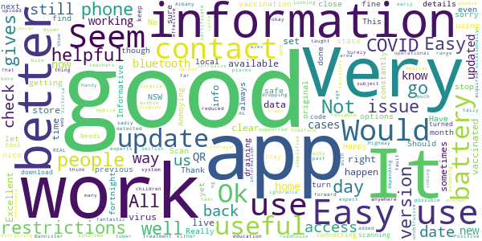

# COVIDSafe
App version ``2.7``

Analyzed with [covid-apps-observer](http://github.com/covid-apps-observer) project, version ``0.1``

## App overview
| | |
|-------------------------|-------------------------| 
| **Name**&nbsp;&nbsp;&nbsp;&nbsp;&nbsp;&nbsp;&nbsp;&nbsp;&nbsp;&nbsp;&nbsp;&nbsp;&nbsp;&nbsp;&nbsp;&nbsp;&nbsp;&nbsp;&nbsp;&nbsp;&nbsp;&nbsp;&nbsp;&nbsp;&nbsp;&nbsp;&nbsp;&nbsp;&nbsp;&nbsp;&nbsp;&nbsp;&nbsp;&nbsp;&nbsp;&nbsp;&nbsp;&nbsp;&nbsp;&nbsp;  | COVIDSafe |
| **Unique identifier** | au.gov.health.covidsafe |
| **Link to Google Play** | [https://play.google.com/store/apps/details?id=au.gov.health.covidsafe](https://play.google.com/store/apps/details?id=au.gov.health.covidsafe) |
| **Summary**  | COVIDSafe is a community-based way to stop the spread of COVID-19. |
| **Privacy policy** | [https://covidsafe.gov.au/privacy-policy.html](https://covidsafe.gov.au/privacy-policy.html) |
| **Latest version** | 2.7 |
| **Last update** | 2021-06-04 06:03:39 |
| **Recent changes** | Improved support for international visitors, minor content and bug fixes. |
| **Installs**  | 1,000,000+ |
| **Category** | Health & Fitness |
| **First release** | Apr 25, 2020 |
| **Size**  | 13M |
| **Supported Android version**  | 5.0 and up |

### Description
> COVIDSafe app has been developed by the Australian Government Department of Health to help keep the community safe from coronavirus (COVID-19). Together, let’s help stop the spread and keep ourselves and each other healthy.
 COVIDSafe uses the Bluetooth® technology on your mobile phone to look for other devices with COVIDSafe installed. Your device will take a note of contact you’ve had with other users by securely logging the other user’s reference code. If you or someone you’ve been in contact with is diagnosed with COVID-19, the close contact information securely stored in your phone can be uploaded and used—with your consent—by state and territory health officials to quickly inform people who’ve been exposed to the virus.
 How you can help stop the spread of COVID-19:
 • Download the COVIDSafe app
 • Register using your mobile phone number, name, age range and postcode
 • Turn on Bluetooth®
 • Check that COVIDSafe is running when you are out and about or are likely to come into contact with others
 • If you test positive for COVID-19, you can consent for your close contact information to be used by state and territory health officials to contact people who may have been exposed. If you’ve been exposed to the virus by someone you’ve been in close contact with, state and territory health officials will be able to contact you quickly so you can get the support you need
 COVIDSafe is an Australian Government Department of Health initiative. Visit https://www.health.gov.au/resources/apps-and-tools/covidsafe-app for more information.

### User interface
The developers of the app provide the following screenshots in the Google play store.
| | | |
|:-------------------------:|:-------------------------:|:-------------------------:|
 |   |   |   | 
 |   |  

## Development team
In the following we report the main information provided by the development team in the Google play store.

| | |
|-------------------------|-------------------------|
| **Developer**  | Australian Department of Health |
| **Website**  | [https://www.health.gov.au/resources/apps-and-tools/covidsafe-app#covidsafe-app-help](https://www.health.gov.au/resources/apps-and-tools/covidsafe-app#covidsafe-app-help) |
| **Email** | support@COVIDSafe.gov.au |
| **Physical address**  | - |
| **Other developed apps**  | [https://play.google.com/store/apps/developer?id=Australian+Department+of+Health](https://play.google.com/store/apps/developer?id=Australian+Department+of+Health) |

## Android support

| | |
|-------------------------|-------------------------|
| **Declared target Android version**  | Android10, version 10 (API level 29) |
| **Effective target Android version**  | Android10, version 10 (API level 29) |
| **Minimum supported Android version**  | Lollipop, version 5.0 (API level 21) |
| **Maximum target Android version**  | - |

The larger the difference between the minimum and maximum supported Android versions, the better. A larger difference means a wider audience. For example, old phones have a very low Android version, so a high minimum supported Android version means that the app cannot be used by users with old phones, thus leading to accessibility problems. 

## Requested permissions

In the following we report the complete list of the permissions requested by the app. 

| **Permission** | **Protection level** | **Description** | 
|-------------------------|-------------------------|-------------------------|
 **android.permission ACCESS_COARSE_LOCATION** | :warning:**Dangerous** | Allows an app to access approximate location. 
 **android.permission ACCESS_FINE_LOCATION** | :warning:**Dangerous** | Allows an app to access precise location. 
 **android.permission ACCESS_NETWORK_STATE** | Normal | Allows applications to access information about networks. 
 **android.permission BLUETOOTH** | Normal | Allows applications to connect to paired bluetooth devices. 
 **android.permission BLUETOOTH_ADMIN** | Normal | Allows applications to discover and pair bluetooth devices. 
 **android.permission FOREGROUND_SERVICE** | Normal | Allows a regular application to use Service.startForeground. 
 **android.permission INTERNET** | Normal | Allows applications to open network sockets. 
 **android.permission RECEIVE_BOOT_COMPLETED** | Normal | Allows an application to receive the Intent.ACTION_BOOT_COMPLETED that is broadcast after the system finishes booting. 
 **android.permission REQUEST_IGNORE_BATTERY_OPTIMIZATIONS** | Normal | Permission an application must hold in order to use Settings.ACTION_REQUEST_IGNORE_BATTERY_OPTIMIZATIONS. 
 **android.permission WAKE_LOCK** | Normal | Allows using PowerManager WakeLocks to keep processor from sleeping or screen from dimming. 
 **com.google.android.c2dm.permission RECEIVE** | - | - 

## Mentioned servers

| **Server** | **Registrant** | **Registrant country** | **Creation date** | 
|-------------------------|-------------------------|-------------------------|-------------------------|
 | google.com | Google LLC | :us: US | 1997-09-15 04:00:00 |
 | stackoverflow.com | Stack Exchange, Inc. | :us: US | 2003-12-26 19:18:07 |
 | googleapis.com | Google LLC | :us: US | 2005-01-25 17:52:26 |

## Security analysis 

Below we report the main security warnings raised by our execution of the [Androwarn](https://github.com/maaaaz/androwarn) security analysis tool.

**Connection interfaces exfiltration**
> - This application reads details about the currently active data network 
> - This application tries to find out if the currently active data network is metered 

**Suspicious connection establishment**
> - This application opens a Socket and connects it to the remote address ' returned no addresses for  ; port is out of range' on the 'N/A' port  
> - This application opens a Socket and connects it to the remote address '' on the 'N/A' port  
> - This application opens a Socket and connects it to the remote address 'Ljava/lang/StringBuilder;->toString()Ljava/lang/String;' on the 'N/A' port  
> - This application opens a Socket and connects it to the remote address 'Ljava/net/Proxy;->type()Ljava/net/Proxy$Type;' on the 'N/A' port  
> - This application opens a Socket and connects it to the remote address 'timeout' on the 'N/A' port  

## User ratings and reviews

Below we provide information about how end users are reacting to the app in terms of ratings and reviews in the Google Play store.

### Ratings

The COVIDSafe app has been installed by more than **1000000** times. At this time, **19864** rated the app and its average score is **3.7760296**. Below we show the distribution of the ratings across the usual star-based rating of Google Play

:star::star::star::star::star:: 10416

:star::star::star::star:: 3033

:star::star::star:: 1654

:star::star:: 1075

:star:: 3686

### Reviews 

#### 5-star reviews

> very good and simple  :date: __2021-06-11 15:00:11__

> Excellent  :date: __2021-06-11 14:43:20__

> Very good  :date: __2021-06-11 11:03:21__

> No issues  :date: __2021-06-11 10:52:34__

> No problems.  :date: __2021-06-11 10:27:48__

> Good. Makes me feel safer. Easy to use.  :date: __2021-06-11 10:25:37__

> All good  :date: __2021-06-11 08:34:34__

> It is quick to use, becomes a habit, wish everyone would use it.  :date: __2021-06-11 06:21:40__

> Easy to use  :date: __2021-06-11 06:15:11__

> As long as it warms great  :date: __2021-06-11 06:09:10__

#### 4-star reviews

> This app is useful to find out up to date information on COVID restrictions. I am looking forward to the the display of my vaccination certificate. That will make it really useful assuming that those people who have done the right thing will be subject to reduced restrictions.  :date: __2021-06-11 11:29:16__

> Ok  :date: __2021-06-11 06:59:48__

> REAL TIME UPDATES well done,  :date: __2021-06-11 06:02:24__

> Better safe than sorry  :date: __2021-06-11 05:29:11__

> Handy go-to now that it gives locally acquired cases news.  :date: __2021-06-11 04:15:13__

> 5 it 6  :date: __2021-06-11 01:10:12__

> Informative and helpful  :date: __2021-06-10 10:58:12__

> Helpful information  :date: __2021-06-10 04:24:16__

> Very effective and helpful  :date: __2021-06-10 00:48:26__

> Seems unobtrusive. Not sure it does as much as it could since Victoria's medical experts are now classing fleeting visits as high risk.  :date: __2021-06-09 10:21:14__

#### 3-star reviews

> It seems to be very power hungry, I turn it off when I'm at home. Don't know how well it works because I haven't had an alert.  :date: __2021-06-11 09:45:26__

> Signing in is ok. Having to sign out before the next olace is cumbersome.Still getting used to it.  :date: __2021-06-11 07:37:58__

> Not really used so no comment.  :date: __2021-06-11 04:57:04__

> Provides me with information that I don't hear about otherwise  :date: __2021-06-11 04:36:02__

> There was zero publicity showing how to use the QR Code app., which explains the slow takeup. COVIDSafe itself is OK.  :date: __2021-06-11 03:46:58__

> Fair  :date: __2021-06-10 10:57:30__

> Hmmm average  :date: __2021-06-10 07:25:48__

> The app won't accept my phone number. It keeps saying "invalid number"  :date: __2021-06-10 06:10:19__

> It's just there on the phone. I use service new app which is very helpful  :date: __2021-06-10 05:59:56__

> Public should be informed of the ongoing efficacy of this App. so as to encourage keeping it installed.  :date: __2021-06-10 01:32:54__

#### 2-star reviews

> Poor iformation feedback  :date: __2021-06-11 09:50:33__

> It drains my phone battery, and the Q code system is way more useful. What does this app even do? If only a few people have it, what's the point?  :date: __2021-06-11 09:32:20__

> Extremely high battery consumption. Kind of self defeating because the app can't be active if the battery is dead. Very good idea in theory though.  :date: __2021-06-11 05:17:40__

> Takes too much battery  :date: __2021-06-10 14:06:08__

> 2020 Can't RESTRICT even though I've opened within a month it still shows Error in my notification panel. 2021 keeps logging me out? App keeps turning off itself.  :date: __2021-06-10 04:24:46__

> Does this app actually do anything useful?  :date: __2021-06-10 00:13:55__

> Useless  :date: __2021-06-09 15:28:34__

> So hard to scan at venues. QLD app is excellent.  :date: __2021-06-09 09:40:57__

> Not made with aged people IN mind  :date: __2021-06-09 09:29:42__

> Seems to work but how do I know it is ?  :date: __2021-06-09 07:54:19__

#### 1-star reviews

> Useless  :date: __2021-06-11 14:10:39__

> useless. State baaed apps much better. another fed govt waste of money. admit failure and support transferable State apps.  :date: __2021-06-11 12:20:36__

> What is the point of this App when we still have to use QR Code registration for contact tracing??  :date: __2021-06-11 09:43:38__

> The battery usage is crazy...  :date: __2021-06-11 07:29:53__

> It's useless....just amateur....use the Google one....at least it's professional and quality  :date: __2021-06-11 06:50:57__

> I have not heard anyabout this appbeing used gor contact tracing. Appears to be complete wasye of government spending  :date: __2021-06-11 06:20:10__

> It appears this App has cost the ratepayers of Australia a fortune and is a complete failure. Lucky though that some cronies of the government were the developers of the software so at least they made a shitload of money out of it.  :date: __2021-06-11 06:16:53__

> I've had this app since the beginning and haven't caught Covid once, so something must be working - cheers Scomo  :date: __2021-06-11 06:05:05__

> Sucks battery so much  :date: __2021-06-11 05:59:12__

> It doesn't really work does it  :date: __2021-06-11 05:55:19__

