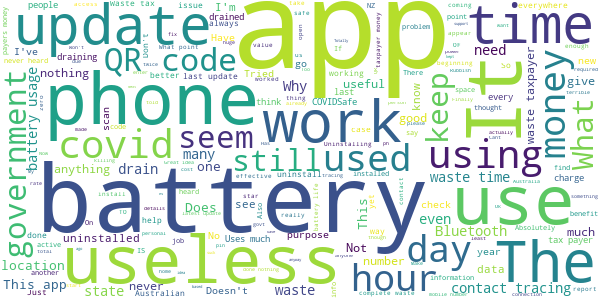

# COVIDSafe
App version ``2.7``

Analyzed with [covid-apps-observer](http://github.com/covid-apps-observer) project, version ``0.1``

## App overview
| | |
|-------------------------|-------------------------| 
| **Name**&nbsp;&nbsp;&nbsp;&nbsp;&nbsp;&nbsp;&nbsp;&nbsp;&nbsp;&nbsp;&nbsp;&nbsp;&nbsp;&nbsp;&nbsp;&nbsp;&nbsp;&nbsp;&nbsp;&nbsp;&nbsp;&nbsp;&nbsp;&nbsp;&nbsp;&nbsp;&nbsp;&nbsp;&nbsp;&nbsp;&nbsp;&nbsp;&nbsp;&nbsp;&nbsp;&nbsp;&nbsp;&nbsp;&nbsp;&nbsp;  | COVIDSafe |
| **Unique identifier** | au.gov.health.covidsafe |
| **Link to Google Play** | [https://play.google.com/store/apps/details?id=au.gov.health.covidsafe](https://play.google.com/store/apps/details?id=au.gov.health.covidsafe) |
| **Summary**  | COVIDSafe is a community-based way to stop the spread of COVID-19. |
| **Privacy policy** | [https://covidsafe.gov.au/privacy-policy.html](https://covidsafe.gov.au/privacy-policy.html) |
| **Latest version** | 2.7 |
| **Last update** | 2021-06-04 06:03:39 |
| **Recent changes** | Improved support for international visitors, minor content and bug fixes. |
| **Installs**  | 1,000,000+ |
| **Category** | Health & Fitness |
| **First release** | Apr 25, 2020 |
| **Size**  | 13M |
| **Supported Android version**  | 5.0 and up |

### Description
> COVIDSafe app has been developed by the Australian Government Department of Health to help keep the community safe from coronavirus (COVID-19). Together, let’s help stop the spread and keep ourselves and each other healthy.
 COVIDSafe uses the Bluetooth® technology on your mobile phone to look for other devices with COVIDSafe installed. Your device will take a note of contact you’ve had with other users by securely logging the other user’s reference code. If you or someone you’ve been in contact with is diagnosed with COVID-19, the close contact information securely stored in your phone can be uploaded and used—with your consent—by state and territory health officials to quickly inform people who’ve been exposed to the virus.
 How you can help stop the spread of COVID-19:
 • Download the COVIDSafe app
 • Register using your mobile phone number, name, age range and postcode
 • Turn on Bluetooth®
 • Check that COVIDSafe is running when you are out and about or are likely to come into contact with others
 • If you test positive for COVID-19, you can consent for your close contact information to be used by state and territory health officials to contact people who may have been exposed. If you’ve been exposed to the virus by someone you’ve been in close contact with, state and territory health officials will be able to contact you quickly so you can get the support you need
 COVIDSafe is an Australian Government Department of Health initiative. Visit https://www.health.gov.au/resources/apps-and-tools/covidsafe-app for more information.

### User interface
The developers of the app provide the following screenshots in the Google play store.
| | | |
|:-------------------------:|:-------------------------:|:-------------------------:|
 |   |   |   | 
 |   |  

## Development team
In the following we report the main information provided by the development team in the Google play store.

| | |
|-------------------------|-------------------------|
| **Developer**  | Australian Department of Health |
| **Website**  | [https://www.health.gov.au/resources/apps-and-tools/covidsafe-app#covidsafe-app-help](https://www.health.gov.au/resources/apps-and-tools/covidsafe-app#covidsafe-app-help) |
| **Email** | support@COVIDSafe.gov.au |
| **Physical address**  | - |
| **Other developed apps**  | [https://play.google.com/store/apps/developer?id=Australian+Department+of+Health](https://play.google.com/store/apps/developer?id=Australian+Department+of+Health) |

## Android support

| | |
|-------------------------|-------------------------|
| **Declared target Android version**  | Android10, version 10 (API level 29) |
| **Effective target Android version**  | Android10, version 10 (API level 29) |
| **Minimum supported Android version**  | Lollipop, version 5.0 (API level 21) |
| **Maximum target Android version**  | - |

The larger the difference between the minimum and maximum supported Android versions, the better. A larger difference means a wider audience. For example, old phones have a very low Android version, so a high minimum supported Android version means that the app cannot be used by users with old phones, thus leading to accessibility problems. 

## Requested permissions

In the following we report the complete list of the permissions requested by the app. 

| **Permission** | **Protection level** | **Description** | 
|-------------------------|-------------------------|-------------------------|
 **android.permission ACCESS_COARSE_LOCATION** | :warning:**Dangerous** | Allows an app to access approximate location. 
 **android.permission ACCESS_FINE_LOCATION** | :warning:**Dangerous** | Allows an app to access precise location. 
 **android.permission ACCESS_NETWORK_STATE** | Normal | Allows applications to access information about networks. 
 **android.permission BLUETOOTH** | Normal | Allows applications to connect to paired bluetooth devices. 
 **android.permission BLUETOOTH_ADMIN** | Normal | Allows applications to discover and pair bluetooth devices. 
 **android.permission FOREGROUND_SERVICE** | Normal | Allows a regular application to use Service.startForeground. 
 **android.permission INTERNET** | Normal | Allows applications to open network sockets. 
 **android.permission RECEIVE_BOOT_COMPLETED** | Normal | Allows an application to receive the Intent.ACTION_BOOT_COMPLETED that is broadcast after the system finishes booting. 
 **android.permission REQUEST_IGNORE_BATTERY_OPTIMIZATIONS** | Normal | Permission an application must hold in order to use Settings.ACTION_REQUEST_IGNORE_BATTERY_OPTIMIZATIONS. 
 **android.permission WAKE_LOCK** | Normal | Allows using PowerManager WakeLocks to keep processor from sleeping or screen from dimming. 
 **com.google.android.c2dm.permission RECEIVE** | - | - 

## Mentioned servers

| **Server** | **Registrant** | **Registrant country** | **Creation date** | 
|-------------------------|-------------------------|-------------------------|-------------------------|
 | google.com | Google LLC | :us: US | 1997-09-15 04:00:00 |
 | stackoverflow.com | Stack Exchange, Inc. | :us: US | 2003-12-26 19:18:07 |
 | googleapis.com | Google LLC | :us: US | 2005-01-25 17:52:26 |

## Security analysis 

Below we report the main security warnings raised by our execution of the [Androwarn](https://github.com/maaaaz/androwarn) security analysis tool.

**Connection interfaces exfiltration**
> - This application reads details about the currently active data network 
> - This application tries to find out if the currently active data network is metered 

**Suspicious connection establishment**
> - This application opens a Socket and connects it to the remote address ' returned no addresses for  ; port is out of range' on the 'N/A' port  
> - This application opens a Socket and connects it to the remote address '' on the 'N/A' port  
> - This application opens a Socket and connects it to the remote address 'Ljava/lang/StringBuilder;->toString()Ljava/lang/String;' on the 'N/A' port  
> - This application opens a Socket and connects it to the remote address 'Ljava/net/Proxy;->type()Ljava/net/Proxy$Type;' on the 'N/A' port  
> - This application opens a Socket and connects it to the remote address 'timeout' on the 'N/A' port  

## User ratings and reviews

Below we provide information about how end users are reacting to the app in terms of ratings and reviews in the Google Play store.

### Ratings

The COVIDSafe app has been installed by more than **1000000** times. At this time, **19864** rated the app and its average score is **3.7760296**. Below we show the distribution of the ratings across the usual star-based rating of Google Play

:star::star::star::star::star:: 10416

:star::star::star::star:: 3033

:star::star::star:: 1654

:star::star:: 1075

:star:: 3686

### Reviews 

#### 5-star reviews

> So easy to use.😁  :date: __2021-06-28 03:32:30__

> Handy to have updated info at my fingertips!  :date: __2021-06-27 13:43:49__

> Mesmerised how amazing this app is. Gushing as a matter of fact  :date: __2021-06-27 12:36:40__

> Easy to understand and reliable.  :date: __2021-06-27 08:31:01__

> My cat and I love the Covid app and would highly recommend it to everyone in Australia.  :date: __2021-06-26 09:23:06__

> Excellent  :date: __2021-06-26 05:11:37__

> It has been a non problem, easy going, and non envaceive to everyday activities  :date: __2021-06-26 00:22:59__

> Works good.  :date: __2021-06-25 11:45:30__

> Great what Australia government ,app to warn an help us all ...keep us all safe too.  :date: __2021-06-25 10:01:45__

> Good  :date: __2021-06-25 08:40:48__

#### 4-star reviews

> Would be good if it could cache its operational info if 4G data coverage is not available. With Vodafone this can happen anywhere, any time, it seems but also some places eg Bannister River roadhouse on the Albany Highway, do not have mobile access. Surely it should be possible to store the info and upload it when back within range of a tower?  :date: __2021-06-26 17:48:06__

> Seems to work okay for those that do use it .. sadly ignorance is still there so the virus will still spread because of the selfish people who will not use app and expect will not get vaccinated either .. its the way of the people and how we all live now with too many "don't have to do " syndrome which is being taught to our children from a very early age and supported in our education system . Not all the teachers fault they have to do what is set for them . coming right back to bite us now ..  :date: __2021-06-26 09:20:52__

> Excellent , sometimes doesn't clear previous contact so you are unable to do your next contact  :date: __2021-06-25 08:13:25__

> Excellent as my wife has treatment for cancer each fortnight and it has simplified everything for us.Thank you.  :date: __2021-06-25 00:47:32__

> It had good informatiom for the area I live in.  :date: __2021-06-23 11:27:56__

> Very helpful. Not intrusive and I think it gives an added avenue of reliable information.  :date: __2021-06-23 06:02:49__

> Positive  :date: __2021-06-22 09:42:54__

> good  :date: __2021-06-19 16:01:11__

> I feel it is not 100% yet but necessary.  :date: __2021-06-18 07:58:16__

> App now gives up to date local COVID restrictions depending on which state or territory you're in. Really fantastic so you don't have to trawl through the web for the most up to date information. Would be even better if they can show a tally of close contacts your phone has detected in the past fortnight or month, so you can check if it's working with close contacts  :date: __2021-06-18 07:43:16__

#### 3-star reviews

> dont think it works  :date: __2021-06-27 04:12:40__

> Can't complain about this App. Does what it's supposed to do ,I suppose. Check ins are simple.  :date: __2021-06-25 11:09:02__

> Too slow to enter shops  :date: __2021-06-25 06:09:26__

> The Covid App uses from 17% and often 20% of battery capacity. If I use internet and calls during the day, then my battery life fails - I need to recharge the phone in the afternoon to maintain any call capacity. Battery life is a major problem with the Covid App. I will turn the Covid App off from today - I will rely upon the QR Code scans to track potential exposures from today.  :date: __2021-06-23 22:46:11__

> Gobbles up the battery.  :date: __2021-06-22 23:14:31__

> O loo loll  :date: __2021-06-22 08:23:32__

> Uses too much battery  :date: __2021-06-21 23:34:51__

> Seems redundant  :date: __2021-06-21 12:07:40__

> How do you rate an app when no-one publishes data on how useful it is ???  :date: __2021-06-21 07:43:59__

> Not sure how well it works, yet it alone consumes more than 10% of my 4500 mAh battery overnight... Always the top-1 on the battery usage list.  :date: __2021-06-21 03:30:39__

#### 2-star reviews

> sucks battery life far too much  :date: __2021-06-27 13:13:48__

> Think designed to trigger after 15 mins close contact - should be changed to 15 seconds . 15 minutes in a shopping queue ? It's just wrong .  :date: __2021-06-27 08:51:51__

> Almost useless  :date: __2021-06-27 07:51:36__

> I still haven't got the Covid scan screen on my phone. It disappeared a few days ago!!!!! How do I get it back on again?  :date: __2021-06-27 06:33:09__

> But 88 ofLLn.n M  :date: __2021-06-27 03:02:48__

> Cant select state  :date: __2021-06-26 13:46:35__

> Doesn't work on old phones 26/6 still hit and miss!!!  :date: __2021-06-26 08:09:36__

> Burns through battery  :date: __2021-06-23 08:06:41__

> It's slow on updates..I check covid safe on a regular basis. I have a family gathering for a funeral today and tomorrow. I only just found out via the news which was released 630am this morning. But the updated information does not reflect on the covid safe app.  :date: __2021-06-23 05:28:09__

> Not enough uptake for it to be useful  :date: __2021-06-23 05:02:42__

#### 1-star reviews

> I wanted the virus 😭😭😭😭  :date: __2021-06-28 01:46:50__

> Worst app ever  :date: __2021-06-26 14:52:55__

> Dud from the start. Great idea very poorly (yet skilfully) implemented. Would have been better to give us all personal electronic trackers. THAT would have worked for everyone, even those who don't have smart phones! DUH!!!  :date: __2021-06-26 11:16:46__

> Not useful  :date: __2021-06-26 09:52:32__

> Following the latest update the battery issue is worse than ever. It accounts for more than 50% of my battery usage even when I spend limited time away from home. Operating on a Samsung s9+  :date: __2021-06-26 09:37:30__

> I had this app from its introduction until three days ago. I finally gave up because of its excess battery usage. On the last day my phone was 100% charged at midnight and 20% at 8.00am the next morning. I cannot support an app that uses that much.  :date: __2021-06-26 09:23:49__

> Useless  :date: __2021-06-26 07:29:27__

> Does it even work?  :date: __2021-06-26 00:27:52__

> Totally useless. Would be good if you could use it to scan into locations.  :date: __2021-06-25 08:39:20__

> Seems useless to me. QR?  :date: __2021-06-25 07:51:35__

