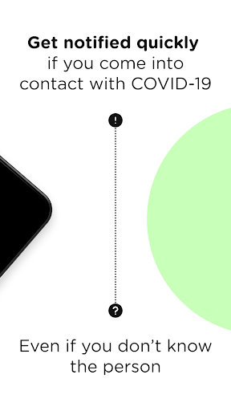
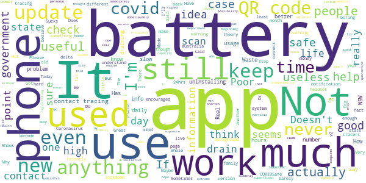

# COVIDSafe
App version ``2.8``

Analyzed with [covid-apps-observer](http://github.com/covid-apps-observer) project, version ``0.1``

## App overview
| | |
|-------------------------|-------------------------| 
| **Name**&nbsp;&nbsp;&nbsp;&nbsp;&nbsp;&nbsp;&nbsp;&nbsp;&nbsp;&nbsp;&nbsp;&nbsp;&nbsp;&nbsp;&nbsp;&nbsp;&nbsp;&nbsp;&nbsp;&nbsp;&nbsp;&nbsp;&nbsp;&nbsp;&nbsp;&nbsp;&nbsp;&nbsp;&nbsp;&nbsp;&nbsp;&nbsp;&nbsp;&nbsp;&nbsp;&nbsp;&nbsp;&nbsp;&nbsp;&nbsp;  | COVIDSafe |
| **Unique identifier** | au.gov.health.covidsafe |
| **Link to Google Play** | [https://play.google.com/store/apps/details?id=au.gov.health.covidsafe](https://play.google.com/store/apps/details?id=au.gov.health.covidsafe) |
| **Summary**  | COVIDSafe is a community-based way to stop the spread of COVID-19. |
| **Privacy policy** | [https://covidsafe.gov.au/privacy-policy.html](https://covidsafe.gov.au/privacy-policy.html) |
| **Latest version** | 2.8 |
| **Last update** | 2021-07-01 07:35:27 |
| **Recent changes** | Under investigation COVID-19 case numbers added to home screen to align to Department of Health website.  |
| **Installs**  | 1,000,000+ |
| **Category** | Health & Fitness |
| **First release** | Apr 25, 2020 |
| **Size**  | 28M |
| **Supported Android version**  | 5.0 and up |

### Description
> COVIDSafe app has been developed by the Australian Government Department of Health to help keep the community safe from coronavirus (COVID-19). Together, let’s help stop the spread and keep ourselves and each other healthy.
 COVIDSafe uses the Bluetooth® technology on your mobile phone to look for other devices with COVIDSafe installed. Your device will take a note of contact you’ve had with other users by securely logging the other user’s reference code. If you or someone you’ve been in contact with is diagnosed with COVID-19, the close contact information securely stored in your phone can be uploaded and used—with your consent—by state and territory health officials to quickly inform people who’ve been exposed to the virus.
 How you can help stop the spread of COVID-19:
 • Download the COVIDSafe app
 • Register using your mobile phone number, name, age range and postcode
 • Turn on Bluetooth®
 • Check that COVIDSafe is running when you are out and about or are likely to come into contact with others
 • If you test positive for COVID-19, you can consent for your close contact information to be used by state and territory health officials to contact people who may have been exposed. If you’ve been exposed to the virus by someone you’ve been in close contact with, state and territory health officials will be able to contact you quickly so you can get the support you need
 COVIDSafe is an Australian Government Department of Health initiative. Visit https://www.health.gov.au/resources/apps-and-tools/covidsafe-app for more information.

### User interface
The developers of the app provide the following screenshots in the Google play store.
| | | |
|:-------------------------:|:-------------------------:|:-------------------------:|
 |   |   |   | 
 |   |  

## Development team
In the following we report the main information provided by the development team in the Google play store.

| | |
|-------------------------|-------------------------|
| **Developer**  | Australian Department of Health |
| **Website**  | [https://www.health.gov.au/resources/apps-and-tools/covidsafe-app#covidsafe-app-help](https://www.health.gov.au/resources/apps-and-tools/covidsafe-app#covidsafe-app-help) |
| **Email** | support@COVIDSafe.gov.au |
| **Physical address**  | - |
| **Other developed apps**  | [https://play.google.com/store/apps/developer?id=Australian+Department+of+Health](https://play.google.com/store/apps/developer?id=Australian+Department+of+Health) |

## Android support

| | |
|-------------------------|-------------------------|
| **Declared target Android version**  | Android10, version 10 (API level 29) |
| **Effective target Android version**  | Android10, version 10 (API level 29) |
| **Minimum supported Android version**  | Lollipop, version 5.0 (API level 21) |
| **Maximum target Android version**  | - |

The larger the difference between the minimum and maximum supported Android versions, the better. A larger difference means a wider audience. For example, old phones have a very low Android version, so a high minimum supported Android version means that the app cannot be used by users with old phones, thus leading to accessibility problems. 

## Requested permissions

In the following we report the complete list of the permissions requested by the app. 

| **Permission** | **Protection level** | **Description** | 
|-------------------------|-------------------------|-------------------------|
 **android.permission ACCESS_COARSE_LOCATION** | :warning:**Dangerous** | Allows an app to access approximate location. 
 **android.permission ACCESS_FINE_LOCATION** | :warning:**Dangerous** | Allows an app to access precise location. 
 **android.permission ACCESS_NETWORK_STATE** | Normal | Allows applications to access information about networks. 
 **android.permission BLUETOOTH** | Normal | Allows applications to connect to paired bluetooth devices. 
 **android.permission BLUETOOTH_ADMIN** | Normal | Allows applications to discover and pair bluetooth devices. 
 **android.permission FOREGROUND_SERVICE** | Normal | Allows a regular application to use Service.startForeground. 
 **android.permission INTERNET** | Normal | Allows applications to open network sockets. 
 **android.permission RECEIVE_BOOT_COMPLETED** | Normal | Allows an application to receive the Intent.ACTION_BOOT_COMPLETED that is broadcast after the system finishes booting. 
 **android.permission REQUEST_IGNORE_BATTERY_OPTIMIZATIONS** | Normal | Permission an application must hold in order to use Settings.ACTION_REQUEST_IGNORE_BATTERY_OPTIMIZATIONS. 
 **android.permission WAKE_LOCK** | Normal | Allows using PowerManager WakeLocks to keep processor from sleeping or screen from dimming. 
 **com.google.android.c2dm.permission RECEIVE** | - | - 

## Mentioned servers

| **Server** | **Registrant** | **Registrant country** | **Creation date** | 
|-------------------------|-------------------------|-------------------------|-------------------------|
 | google.com | Google LLC | :us: US | 1997-09-15 04:00:00 |
 | stackoverflow.com | Stack Exchange, Inc. | :us: US | 2003-12-26 19:18:07 |
 | googleapis.com | Google LLC | :us: US | 2005-01-25 17:52:26 |

## Security analysis 

Below we report the main security warnings raised by our execution of the [Androwarn](https://github.com/maaaaz/androwarn) security analysis tool.

**Connection interfaces exfiltration**
> - This application reads details about the currently active data network 
> - This application tries to find out if the currently active data network is metered 

**Suspicious connection establishment**
> - This application opens a Socket and connects it to the remote address ' returned no addresses for  ; port is out of range' on the 'N/A' port  
> - This application opens a Socket and connects it to the remote address '' on the 'N/A' port  
> - This application opens a Socket and connects it to the remote address 'Ljava/lang/StringBuilder;->toString()Ljava/lang/String;' on the 'N/A' port  
> - This application opens a Socket and connects it to the remote address 'Ljava/net/Proxy;->type()Ljava/net/Proxy$Type;' on the 'N/A' port  
> - This application opens a Socket and connects it to the remote address 'timeout' on the 'N/A' port  

## User ratings and reviews

Below we provide information about how end users are reacting to the app in terms of ratings and reviews in the Google Play store.

### Ratings

The COVIDSafe app has been installed by more than **1000000** times. At this time, **21081** rated the app and its average score is **3.7387688**. Below we show the distribution of the ratings across the usual star-based rating of Google Play

:star::star::star::star::star:: 10971

:star::star::star::star:: 3025

:star::star::star:: 1806

:star::star:: 1166

:star:: 4113

### Reviews 

#### 5-star reviews

> Easy to use and quite quick, once its through and pings tho it would be great if it goes out automatically, not manually which is another step again.  :date: __2021-07-11 12:54:21__

> I don't know  :date: __2021-07-11 10:07:38__

> Updated covid app  :date: __2021-07-11 09:22:29__

> Seems to work well  :date: __2021-07-11 09:02:01__

> Great if every body did it.  :date: __2021-07-11 08:56:42__

> The app us working fine for me  :date: __2021-07-11 08:04:22__

> Everything is perfect  :date: __2021-07-11 07:43:59__

> Excellent  :date: __2021-07-11 07:26:37__

> Always good no threat to privacy  :date: __2021-07-11 07:20:05__

> Very simple to use, always have the app in standby mode, so it's quick to login to any store.  :date: __2021-07-11 07:00:18__

#### 4-star reviews

> Keeps you informed and aware of Covid up ticks.  :date: __2021-07-11 13:12:27__

> Does not always read QR codes frustrating  :date: __2021-07-11 08:59:33__

> We are all sacrificing our privacy and security and security for the sake of our society's survival. Hopefully there are no pervs in the agencys which has our data and misuses them.  :date: __2021-07-10 04:45:13__

> I get how important this app has become. I try to be diligent and have it running in the background. However, for some reason it keeps shutting down. I have to frequently check it's status and I'll often need to re-start it.  :date: __2021-07-10 01:51:24__

> Useful information but would be better if had relevant vaccination details ie where you can get vaccinated how when etc. Also updated for variant spreads and timespan.  :date: __2021-07-10 01:29:44__

> Good clear information.  :date: __2021-07-09 21:16:20__

> All good  :date: __2021-07-09 14:18:38__

> Good  :date: __2021-07-09 13:43:07__

> not sure if it has worked well or not. Has this done anything?Always have it on when I'm wondering around the shops aimlessly.Would be nice if it said "Ooh Darren your mask is on your Chin"  :date: __2021-07-09 13:23:48__

> It's very important for everyone.  :date: __2021-07-09 12:25:13__

#### 3-star reviews

> Not update hourly  :date: __2021-07-11 08:54:13__

> Mb  :date: __2021-07-11 07:58:07__

> The app needs to be capable of installation on a phone' s SD card, not just limited to internal storage.  :date: __2021-07-11 05:32:36__

> I have 2 issues with the app. To be effective, everyone around needs the app and to have Bluetooth enabled constantly. It relies on brutal honesty and battery life that supports having Bluetooth enabled for hours at a time. This is not always possible. Otherwise the app appears to work as intended.  :date: __2021-07-11 01:49:54__

> No alerts received since having this app., only updates on number of cases.  :date: __2021-07-10 23:47:58__

> I can't sign out. Sometimes I'm logged into places for days.  :date: __2021-07-09 23:49:38__

> Not sure if this app is just there to drain my battery or does it actually work? I sometimes question the efficiency of this app because if it was so effective in tracing, it wouldn't have been a nightmare for contact tracers to connect the dots and get over this COVID outbreak.  :date: __2021-07-09 05:58:13__

> Could be much better.  :date: __2021-07-09 05:38:30__

> Nothing to see here. This app seems to be as useful as a hip pocket on a singlet.  :date: __2021-07-09 05:30:35__

> Pretty ordinary. And drains battery severely  :date: __2021-07-09 05:05:21__

#### 2-star reviews

> I never use the app and I am not encouraged to research the app  :date: __2021-07-11 12:59:51__

> I cannot believe that the number of daily new cases for NSW shown in the app is different from the NSW government media release on TV news. We should use the UTC Time as the cut off time to report the daily new cases in the nation to avoid the different time zones.  :date: __2021-07-11 11:30:47__

> Please stop bring peoples from overseas to Australia delta coronavirus government faults, government never think Australians, because thier get money from government and getting rich, I feel sorry for poors peoples. I don't think get my vote in this year..  :date: __2021-07-10 04:39:49__

> I was reluctant to install the app but it seems to have become a fizzer.  :date: __2021-07-10 02:14:17__

> Sometimes it works and sometimes it doesn't.  :date: __2021-07-09 14:34:05__

> Have never had my details saved for next access.  :date: __2021-07-09 06:19:40__

> News article said it is inafective  :date: __2021-07-09 05:57:14__

> Not really sure what this app does any more, but I keep it on just in case. Has it actually helped in contact tracing ever?  :date: __2021-07-09 05:50:45__

> Unreliable  :date: __2021-07-09 05:26:55__

> Not that easy to use or understand  :date: __2021-07-09 05:19:41__

#### 1-star reviews

> Does this app actually do anything?  :date: __2021-07-11 12:15:15__

> Doesn't seem to do anything  :date: __2021-07-11 10:39:18__

> Usually has me waiting up to 10 minutes from starting the app until finally scanning a code. No difference for the last two updates at least. I don't understand why there is no option to just manually type in the location. And no, writing your phone number on a publicly accessible piece of paper is no option, as it opens the door for scammers.  :date: __2021-07-11 08:19:15__

> Uses up battery ridiculously fast, haven't heard of a single occassion it has been useful to contact tracers.  :date: __2021-07-11 06:51:58__

> Hasn't been done or rolled out effectively.  :date: __2021-07-11 06:43:13__

> The State apps are far more useful and user friendly  :date: __2021-07-11 06:34:35__

> Useless  :date: __2021-07-11 06:28:33__

> Hopeless  :date: __2021-07-11 06:13:05__

> Chews up phone battery. Does it really provide any useful info to contact tracers  :date: __2021-07-11 05:22:14__

> Why do I even have this app? It's always running in the background. The only notifications I get is to update it. Does it even work? Is it of use? I'm debating whether I should uninstall it but I want to do the right thing.  :date: __2021-07-11 04:57:01__

