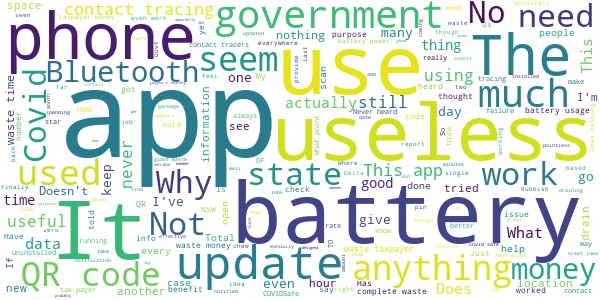

# COVIDSafe
App version ``2.8``

Analyzed with [covid-apps-observer](http://github.com/covid-apps-observer) project, version ``0.1``

## App overview
| | |
|-------------------------|-------------------------| 
| **Name**                                          | COVIDSafe |
| **Unique identifier** | au.gov.health.covidsafe |
| **Link to Google Play** | [https://play.google.com/store/apps/details?id=au.gov.health.covidsafe](https://play.google.com/store/apps/details?id=au.gov.health.covidsafe) |
| **Summary**  | COVIDSafe is a community-based way to stop the spread of COVID-19. |
| **Privacy policy** | [https://covidsafe.gov.au/privacy-policy.html](https://covidsafe.gov.au/privacy-policy.html) |
| **Latest version** | 2.8 |
| **Last update** | 2021-07-01 07:35:27 |
| **Recent changes** | Under investigation COVID-19 case numbers added to home screen to align to Department of Health website.  |
| **Installs**  | 1,000,000+ |
| **Category** | Health & Fitness |
| **First release** | Apr 25, 2020 |
| **Size**  | 28M |
| **Supported Android version**  | 5.0 and up |

### Description
> COVIDSafe app has been developed by the Australian Government Department of Health to help keep the community safe from coronavirus (COVID-19). Together, let’s help stop the spread and keep ourselves and each other healthy.
 COVIDSafe uses the Bluetooth® technology on your mobile phone to look for other devices with COVIDSafe installed. Your device will take a note of contact you’ve had with other users by securely logging the other user’s reference code. If you or someone you’ve been in contact with is diagnosed with COVID-19, the close contact information securely stored in your phone can be uploaded and used—with your consent—by state and territory health officials to quickly inform people who’ve been exposed to the virus.
 How you can help stop the spread of COVID-19:
 • Download the COVIDSafe app
 • Register using your mobile phone number, name, age range and postcode
 • Turn on Bluetooth®
 • Check that COVIDSafe is running when you are out and about or are likely to come into contact with others
 • If you test positive for COVID-19, you can consent for your close contact information to be used by state and territory health officials to contact people who may have been exposed. If you’ve been exposed to the virus by someone you’ve been in close contact with, state and territory health officials will be able to contact you quickly so you can get the support you need
 COVIDSafe is an Australian Government Department of Health initiative. Visit https://www.health.gov.au/resources/apps-and-tools/covidsafe-app for more information.

### User interface
The developers of the app provide the following screenshots in the Google play store.
| | | |
|:-------------------------:|:-------------------------:|:-------------------------:|
 |   |   |   | 
 |   |  

## Development team
In the following we report the main information provided by the development team in the Google play store.

| | |
|-------------------------|-------------------------|
| **Developer**  | Australian Department of Health |
| **Website**  | [https://www.health.gov.au/resources/apps-and-tools/covidsafe-app#covidsafe-app-help](https://www.health.gov.au/resources/apps-and-tools/covidsafe-app#covidsafe-app-help) |
| **Email** | support@COVIDSafe.gov.au |
| **Physical address**  | - |
| **Other developed apps**  | [https://play.google.com/store/apps/developer?id=Australian+Department+of+Health](https://play.google.com/store/apps/developer?id=Australian+Department+of+Health) |

## Android support

| | |
|-------------------------|-------------------------|
| **Declared target Android version**  | Android10, version 10 (API level 29) |
| **Effective target Android version**  | Android10, version 10 (API level 29) |
| **Minimum supported Android version**  | Lollipop, version 5.0 (API level 21) |
| **Maximum target Android version**  | - |

The larger the difference between the minimum and maximum supported Android versions, the better. A larger difference means a wider audience. For example, old phones have a very low Android version, so a high minimum supported Android version means that the app cannot be used by users with old phones, thus leading to accessibility problems. 

## Requested permissions

In the following we report the complete list of the permissions requested by the app. 

| **Permission** | **Protection level** | **Description** | 
|-------------------------|-------------------------|-------------------------|
 **android.permission ACCESS_COARSE_LOCATION** | :warning:**Dangerous** | Allows an app to access approximate location. 
 **android.permission ACCESS_FINE_LOCATION** | :warning:**Dangerous** | Allows an app to access precise location. 
 **android.permission ACCESS_NETWORK_STATE** | Normal | Allows applications to access information about networks. 
 **android.permission BLUETOOTH** | Normal | Allows applications to connect to paired bluetooth devices. 
 **android.permission BLUETOOTH_ADMIN** | Normal | Allows applications to discover and pair bluetooth devices. 
 **android.permission FOREGROUND_SERVICE** | Normal | Allows a regular application to use Service.startForeground. 
 **android.permission INTERNET** | Normal | Allows applications to open network sockets. 
 **android.permission RECEIVE_BOOT_COMPLETED** | Normal | Allows an application to receive the Intent.ACTION_BOOT_COMPLETED that is broadcast after the system finishes booting. 
 **android.permission REQUEST_IGNORE_BATTERY_OPTIMIZATIONS** | Normal | Permission an application must hold in order to use Settings.ACTION_REQUEST_IGNORE_BATTERY_OPTIMIZATIONS. 
 **android.permission WAKE_LOCK** | Normal | Allows using PowerManager WakeLocks to keep processor from sleeping or screen from dimming. 
 **com.google.android.c2dm.permission RECEIVE** | - | - 

## Mentioned servers

| **Server** | **Registrant** | **Registrant country** | **Creation date** | 
|-------------------------|-------------------------|-------------------------|-------------------------|
 | google.com | Google LLC | :us: US | 1997-09-15 04:00:00 |
 | stackoverflow.com | Stack Exchange, Inc. | :us: US | 2003-12-26 19:18:07 |
 | googleapis.com | Google LLC | :us: US | 2005-01-25 17:52:26 |

## Security analysis 

Below we report the main security warnings raised by our execution of the [Androwarn](https://github.com/maaaaz/androwarn) security analysis tool.

**Connection interfaces exfiltration**
> - This application reads details about the currently active data network 
> - This application tries to find out if the currently active data network is metered 

**Suspicious connection establishment**
> - This application opens a Socket and connects it to the remote address ' returned no addresses for  ; port is out of range' on the 'N/A' port  
> - This application opens a Socket and connects it to the remote address '' on the 'N/A' port  
> - This application opens a Socket and connects it to the remote address 'Ljava/lang/StringBuilder;->toString()Ljava/lang/String;' on the 'N/A' port  
> - This application opens a Socket and connects it to the remote address 'Ljava/net/Proxy;->type()Ljava/net/Proxy$Type;' on the 'N/A' port  
> - This application opens a Socket and connects it to the remote address 'timeout' on the 'N/A' port  

## User ratings and reviews

Below we provide information about how end users are reacting to the app in terms of ratings and reviews in the Google Play store.

### Ratings

The COVIDSafe app has been installed by more than **1000000** times. At this time, **21081** rated the app and its average score is **3.7387688**. Below we show the distribution of the ratings across the usual star-based rating of Google Play

:star::star::star::star::star:: 10971

:star::star::star::star:: 3025

:star::star::star:: 1806

:star::star:: 1166

:star:: 4113

### Reviews 

#### 5-star reviews

> Great  :date: __2021-07-29 10:53:34__

> Runs with no issues  :date: __2021-07-28 22:14:19__

> Havnt had to use it yet other than check ins. Comforting to have it  :date: __2021-07-28 09:59:07__

> Good  :date: __2021-07-27 12:19:31__

> I am relying on this app every time I step outside my door.  :date: __2021-07-27 07:40:01__

> Easy to see what's happening  :date: __2021-07-25 07:14:33__

> Excellent app  :date: __2021-07-25 07:01:10__

> Great  :date: __2021-07-24 03:04:29__

> it is a good idea to have covid-19 on our mobile phones .i haven.t been anywhere only to see the Dr in town n do shopping n keep away from people .n i have a bottle of hand sanitizer in my bag .to wash my hands after handling a shopping trolley .n i have gloves n masks in my car for protection .  :date: __2021-07-23 13:28:47__

> Good job  :date: __2021-07-23 12:51:50__

#### 4-star reviews

> Informative  :date: __2021-07-30 12:04:28__

> I'm impressed with COVIDSafe's specific and tight language that delivers its vital messages clearly and cleanly. As a communications clone, good messages are golden!  :date: __2021-07-30 05:44:08__

> 7u  :date: __2021-07-26 06:13:44__

> It's good  :date: __2021-07-25 00:42:27__

> This app helps me feel safer and less concerned about tracing this virus.  :date: __2021-07-24 04:30:50__

> This app needs to include your vaccination status  :date: __2021-07-23 11:47:29__

> Battery usage is much better now.  :date: __2021-07-23 08:30:55__

> This application appears to be mostly ignored in day to day use.  :date: __2021-07-21 14:59:56__

> Be good if it was used. We never hear anything about it. Only hear about QR codes. Is it still used or should I uninstall it and save battery?  :date: __2021-07-21 09:54:05__

> Thx  :date: __2021-07-21 01:55:10__

#### 3-star reviews

> Doesn't meaning to be serious and no clue if anyone got Coronovirus areas where we lived and nothing updates everyday or nothing updates download  :date: __2021-07-30 04:26:43__

> I had to purchase a new phone because the app won't install on older android versions. I would have expected the aussie govt would have at least provided a version of the app that runs on android 4.0 ..... the app works though.  :date: __2021-07-29 08:45:12__

> I wouldn't have a clue, wouldn't have the foggiest, I don't wanna nue !  :date: __2021-07-29 06:17:34__

> obviously there is something wrong with the checkout function, sometimes it works & obviously sometimes it doesn't.  :date: __2021-07-28 05:24:03__

> When I try to scan the code it doesn't work  :date: __2021-07-27 02:53:04__

> It might be more useful if we could record our vaccination status onto it?  :date: __2021-07-25 07:05:13__

> Poor  :date: __2021-07-24 16:57:12__

> Would be good to have cases within the area we are in.  :date: __2021-07-21 07:38:36__

> Works well with useful information when working but often states no internet connection when everything else has picked up Wi-Fi perfectly. Sorts itself out when device restarted but that's a bit annoying  :date: __2021-07-20 11:42:56__

> Good  :date: __2021-07-19 06:09:15__

#### 2-star reviews

> 9th ii9 8  :date: __2021-07-30 08:47:58__

> The app is suddenly draining my battery to extreme levels and I don't know how to fix it. Never had this problem before recently.  :date: __2021-07-29 08:25:30__

> Waste of time  :date: __2021-07-26 13:09:05__

> Has become superfluous at least in states that mandate their own "check-in" apps.  :date: __2021-07-25 19:09:24__

> Real safe  :date: __2021-07-25 09:09:20__

> Poor - This app should enable QR registration across AUS  :date: __2021-07-23 14:37:59__

> Last 2 versions really drain the battery 🔋  :date: __2021-07-23 13:00:13__

> Ok app  :date: __2021-07-23 09:35:07__

> Sucks battery unbelievably high  :date: __2021-07-23 08:27:15__

> I had this app since the beginning. Recently I couldn't connect to my car and headset. I thought it was a problem with the phone. Today after uninstalling this app, I could connect to my headset without any problem.  :date: __2021-07-22 09:37:27__

#### 1-star reviews

> I am trying to locate a testing centre near Bulimba Qld. The map repeatedly shows NSW centres.  :date: __2021-07-30 08:05:48__

> Consumes a lot of battery power, and from media reports its not actually used by contact tracers. I have no way to verify if this app is doing anything at all besides wasting electricity.  :date: __2021-07-29 09:42:53__

> Usless  :date: __2021-07-29 08:45:18__

> Has it ever worked?  :date: __2021-07-28 12:10:11__

> Out of date  :date: __2021-07-28 10:40:46__

> Bad. Did not work  :date: __2021-07-28 07:11:03__

> What on earth does this app do? Useless for news. Useless for QR coding... is it worth taking up memory and network bandwidth SPACE!  :date: __2021-07-27 06:36:48__

> Total waste of time. No sign of usefulness. Downloaded because was told to. Can't see any benefits  :date: __2021-07-26 12:38:23__

> This application uses 1 to 2% of the battery per hour. So this could end up using 48% of the phone battery in a single day.  :date: __2021-07-26 06:39:34__

> 9299997Ali l m8k 995mk pool  :date: __2021-07-26 05:20:45__

