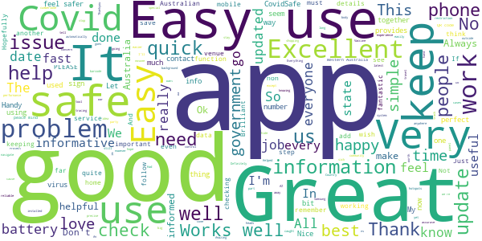
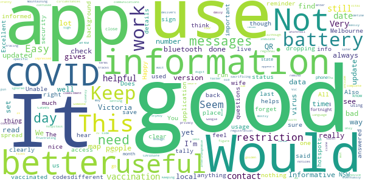
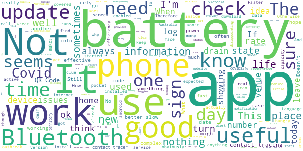

# COVIDSafe
App version ``2.8``

Analyzed with [covid-apps-observer](http://github.com/covid-apps-observer) project, version ``0.1``

## App overview
| | |
|-------------------------|-------------------------| 
| **Name**                                          | COVIDSafe |
| **Unique identifier** | au.gov.health.covidsafe |
| **Link to Google Play** | [https://play.google.com/store/apps/details?id=au.gov.health.covidsafe](https://play.google.com/store/apps/details?id=au.gov.health.covidsafe) |
| **Summary**  | COVIDSafe is a community-based way to stop the spread of COVID-19. |
| **Privacy policy** | [https://covidsafe.gov.au/privacy-policy.html](https://covidsafe.gov.au/privacy-policy.html) |
| **Latest version** | 2.8 |
| **Last update** | 2021-07-01 07:35:27 |
| **Recent changes** | Under investigation COVID-19 case numbers added to home screen to align to Department of Health website.  |
| **Installs**  | 1,000,000+ |
| **Category** | Health & Fitness |
| **First release** | Apr 25, 2020 |
| **Size**  | 28M |
| **Supported Android version**  | 5.0 and up |

### Description
> COVIDSafe app has been developed by the Australian Government Department of Health to help keep the community safe from coronavirus (COVID-19). Together, let’s help stop the spread and keep ourselves and each other healthy.
 COVIDSafe uses the Bluetooth® technology on your mobile phone to look for other devices with COVIDSafe installed. Your device will take a note of contact you’ve had with other users by securely logging the other user’s reference code. If you or someone you’ve been in contact with is diagnosed with COVID-19, the close contact information securely stored in your phone can be uploaded and used—with your consent—by state and territory health officials to quickly inform people who’ve been exposed to the virus.
 How you can help stop the spread of COVID-19:
 • Download the COVIDSafe app
 • Register using your mobile phone number, name, age range and postcode
 • Turn on Bluetooth®
 • Check that COVIDSafe is running when you are out and about or are likely to come into contact with others
 • If you test positive for COVID-19, you can consent for your close contact information to be used by state and territory health officials to contact people who may have been exposed. If you’ve been exposed to the virus by someone you’ve been in close contact with, state and territory health officials will be able to contact you quickly so you can get the support you need
 COVIDSafe is an Australian Government Department of Health initiative. Visit https://www.health.gov.au/resources/apps-and-tools/covidsafe-app for more information.

### User interface
The developers of the app provide the following screenshots in the Google play store.
| | | |
|:-------------------------:|:-------------------------:|:-------------------------:|
 |   |   |   | 
 |   |  

## Development team
In the following we report the main information provided by the development team in the Google play store.

| | |
|-------------------------|-------------------------|
| **Developer**  | Australian Department of Health |
| **Website**  | [https://www.health.gov.au/resources/apps-and-tools/covidsafe-app#covidsafe-app-help](https://www.health.gov.au/resources/apps-and-tools/covidsafe-app#covidsafe-app-help) |
| **Email** | support@COVIDSafe.gov.au |
| **Physical address**  | - |
| **Other developed apps**  | [https://play.google.com/store/apps/developer?id=Australian+Department+of+Health](https://play.google.com/store/apps/developer?id=Australian+Department+of+Health) |

## Android support

| | |
|-------------------------|-------------------------|
| **Declared target Android version**  | Android10, version 10 (API level 29) |
| **Effective target Android version**  | Android10, version 10 (API level 29) |
| **Minimum supported Android version**  | Lollipop, version 5.0 (API level 21) |
| **Maximum target Android version**  | - |

The larger the difference between the minimum and maximum supported Android versions, the better. A larger difference means a wider audience. For example, old phones have a very low Android version, so a high minimum supported Android version means that the app cannot be used by users with old phones, thus leading to accessibility problems. 

## Requested permissions

In the following we report the complete list of the permissions requested by the app. 

| **Permission** | **Protection level** | **Description** | 
|-------------------------|-------------------------|-------------------------|
 **android.permission ACCESS_COARSE_LOCATION** | :warning:**Dangerous** | Allows an app to access approximate location. 
 **android.permission ACCESS_FINE_LOCATION** | :warning:**Dangerous** | Allows an app to access precise location. 
 **android.permission ACCESS_NETWORK_STATE** | Normal | Allows applications to access information about networks. 
 **android.permission BLUETOOTH** | Normal | Allows applications to connect to paired bluetooth devices. 
 **android.permission BLUETOOTH_ADMIN** | Normal | Allows applications to discover and pair bluetooth devices. 
 **android.permission FOREGROUND_SERVICE** | Normal | Allows a regular application to use Service.startForeground. 
 **android.permission INTERNET** | Normal | Allows applications to open network sockets. 
 **android.permission RECEIVE_BOOT_COMPLETED** | Normal | Allows an application to receive the Intent.ACTION_BOOT_COMPLETED that is broadcast after the system finishes booting. 
 **android.permission REQUEST_IGNORE_BATTERY_OPTIMIZATIONS** | Normal | Permission an application must hold in order to use Settings.ACTION_REQUEST_IGNORE_BATTERY_OPTIMIZATIONS. 
 **android.permission WAKE_LOCK** | Normal | Allows using PowerManager WakeLocks to keep processor from sleeping or screen from dimming. 
 **com.google.android.c2dm.permission RECEIVE** | - | - 

## Mentioned servers

| **Server** | **Registrant** | **Registrant country** | **Creation date** | 
|-------------------------|-------------------------|-------------------------|-------------------------|
 | google.com | Google LLC | :us: US | 1997-09-15 04:00:00 |
 | stackoverflow.com | Stack Exchange, Inc. | :us: US | 2003-12-26 19:18:07 |
 | googleapis.com | Google LLC | :us: US | 2005-01-25 17:52:26 |

## Security analysis 

Below we report the main security warnings raised by our execution of the [Androwarn](https://github.com/maaaaz/androwarn) security analysis tool.

**Connection interfaces exfiltration**
> - This application reads details about the currently active data network 
> - This application tries to find out if the currently active data network is metered 

**Suspicious connection establishment**
> - This application opens a Socket and connects it to the remote address ' returned no addresses for  ; port is out of range' on the 'N/A' port  
> - This application opens a Socket and connects it to the remote address '' on the 'N/A' port  
> - This application opens a Socket and connects it to the remote address 'Ljava/lang/StringBuilder;->toString()Ljava/lang/String;' on the 'N/A' port  
> - This application opens a Socket and connects it to the remote address 'Ljava/net/Proxy;->type()Ljava/net/Proxy$Type;' on the 'N/A' port  
> - This application opens a Socket and connects it to the remote address 'timeout' on the 'N/A' port  

## User ratings and reviews

Below we provide information about how end users are reacting to the app in terms of ratings and reviews in the Google Play store.

### Ratings

The COVIDSafe app has been installed by more than **1000000** times. At this time, **21081** rated the app and its average score is **3.7387688**. Below we show the distribution of the ratings across the usual star-based rating of Google Play

:star::star::star::star::star:: 10971

:star::star::star::star:: 3025

:star::star::star:: 1806

:star::star:: 1166

:star:: 4113

### Reviews 

#### 5-star reviews

> it is a good idea to have covid-19 on our mobile phones .i haven.t been anywhere only to see the Dr in town n do shopping n keep away from people .n i have a bottle of hand sanitizer in my bag .to wash my hands after handling a shopping trolley .n i have gloves n masks in my car for protection .  :date: __2021-07-23 13:28:47__

> Good job  :date: __2021-07-23 12:51:50__

> Great job to you all, for co  :date: __2021-07-23 11:40:34__

> Great app  :date: __2021-07-23 07:53:23__

> Don't know how to use app  :date: __2021-07-22 23:57:01__

> Great  :date: __2021-07-22 23:56:41__

> Good.  :date: __2021-07-22 21:00:06__

> Great  :date: __2021-07-22 11:06:54__

> I haven't check this app very often because I watch the news on TV  :date: __2021-07-22 09:34:28__

> Good, easy to use. Really fast barcode scanning!  :date: __2021-07-21 14:04:44__

#### 4-star reviews

> This app needs to include your vaccination status  :date: __2021-07-23 11:47:29__

> Battery usage is much better now.  :date: __2021-07-23 08:30:55__

> This application appears to be mostly ignored in day to day use.  :date: __2021-07-21 14:59:56__

> Be good if it was used. We never hear anything about it. Only hear about QR codes. Is it still used or should I uninstall it and save battery?  :date: __2021-07-21 09:54:05__

> Thx  :date: __2021-07-21 01:55:10__

> Keeping the numbers up to date  :date: __2021-07-20 21:46:17__

> Blue tooth keeps dropping out  :date: __2021-07-19 06:55:32__

> Use to check daily  :date: __2021-07-19 05:52:33__

> It's set and forget...although Google maps tracks me better from my side.....  :date: __2021-07-18 04:41:24__

> Unable to figure out how to indicate messages are read.  :date: __2021-07-17 11:40:43__

#### 3-star reviews

> Would be good to have cases within the area we are in.  :date: __2021-07-21 07:38:36__

> Works well with useful information when working but often states no internet connection when everything else has picked up Wi-Fi perfectly. Sorts itself out when device restarted but that's a bit annoying  :date: __2021-07-20 11:42:56__

> Good  :date: __2021-07-19 06:09:15__

> One thing seems to be missing and that's some idea of how it effects the deaf community! I sign AUSLAN the Australian Deaf Language we rely on facial expressions and body language. How can I express emotion while my face is covered? How can my lips be read if my face is covered? Also it needs to allow more than one place at a time or when in a shopping complex one sign in, into the complex as I'm mixing with all inside. If I clock into the complex I have to log out and into another store.  :date: __2021-07-18 00:48:19__

> No issues.  :date: __2021-07-18 00:01:47__

> Power hungry, reliably uses 60% of my battery a day.  :date: __2021-07-16 14:38:56__

> Doesn't tell me hotspots or dates  :date: __2021-07-16 00:10:52__

> Seems to use up battery quickly.  :date: __2021-07-14 02:32:47__

> Unsure really of what benefit this app has.  :date: __2021-07-13 14:17:32__

> Chews up battery time  :date: __2021-07-12 09:23:31__

#### 2-star reviews

> Poor - This app should enable QR registration across AUS  :date: __2021-07-23 14:37:59__

> Last 2 versions really drain the battery 🔋  :date: __2021-07-23 13:00:13__

> Ok app  :date: __2021-07-23 09:35:07__

> Sucks battery unbelievably high  :date: __2021-07-23 08:27:15__

> I had this app since the beginning. Recently I couldn't connect to my car and headset. I thought it was a problem with the phone. Today after uninstalling this app, I could connect to my headset without any problem.  :date: __2021-07-22 09:37:27__

> A little piece of mind to help shorten the lockdown. Priceless. That was the hope. It seems it's useless for contact tracing. A waste of battery capacity  :date: __2021-07-21 07:18:05__

> Got a phone call from a horrible woman from the Health Department warning me to complete a 13 day covid test when they never told me I was in an exposure site or that I needed to get tested/quarantine. I stayed home totally independently from their warning. Good app to have for daily numbers but whats the point if ir doesn't alert you immediately if you're possibility infected?? Why put in so much personal information?  :date: __2021-07-21 06:55:09__

> Great initiative to help contact tracing during the Coronavirus pandemic however battery life depleted due to excessive Bluetooth scanning.  :date: __2021-07-20 12:57:58__

> I'm not sure that this app actually does anything. Has it actually been used for any contact tracing? I'll keep it on the phone for now, as it's fairly harmless (If you're worried about Big Brother tracking you on your phone, he's had that ability for more than 20 years now and with better technology than this app.). Just applied another update (19/7/21). Still think it's useless.  :date: __2021-07-19 06:14:45__

> Guys I hate this app real bad  :date: __2021-07-18 10:01:53__

#### 1-star reviews

> Useless  :date: __2021-07-23 10:54:55__

> Honestly don't know what this app does, as it's never 'pinged' or notified me of anything.  :date: __2021-07-23 05:03:45__

> No-one uses this app. I use the SA QR location app.  :date: __2021-07-22 08:09:53__

> You open the app and it should go to camera straight away but no you've got to stuff around with the phone  :date: __2021-07-22 04:58:16__

> What does this do? How is it used to contractvtrace?  :date: __2021-07-22 04:07:53__

> Why the hell do we need TWO COVID tracking apps ? Why can't this one be used to scan the QR codes ?? This is total incompetence ! The layout and design of this app is ridiculous, it's all wasted space and fluff, just give me the local information as the priority, it shouldn't look like a big font Primary School spelling app ! Where's the dark mode ? The colours are hideous !  :date: __2021-07-22 02:03:10__

> apears useless  :date: __2021-07-21 16:03:50__

> Does it even work?  :date: __2021-07-21 11:28:47__

> No feed back on whats been collected and whether its useful. Possibly a great bonus for the development company but not exactly a game changer...  :date: __2021-07-21 07:31:22__

> Whay purpose does it serve  :date: __2021-07-21 06:32:10__

