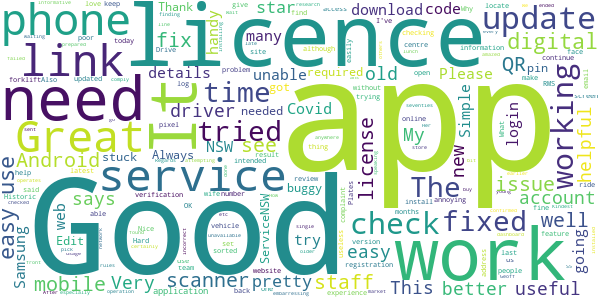
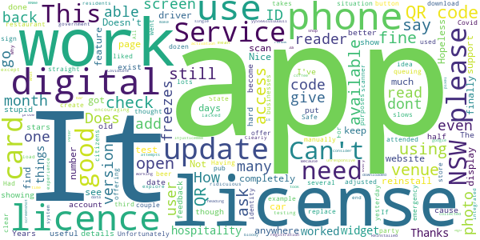

# Service NSW
App version ``4.30.0 (165381)``

Analyzed with [covid-apps-observer](http://github.com/covid-apps-observer) project, version ``0.1``

## App overview
| | |
|-------------------------|-------------------------| 
| **Name**&nbsp;&nbsp;&nbsp;&nbsp;&nbsp;&nbsp;&nbsp;&nbsp;&nbsp;&nbsp;&nbsp;&nbsp;&nbsp;&nbsp;&nbsp;&nbsp;&nbsp;&nbsp;&nbsp;&nbsp;&nbsp;&nbsp;&nbsp;&nbsp;&nbsp;&nbsp;&nbsp;&nbsp;&nbsp;&nbsp;&nbsp;&nbsp;&nbsp;&nbsp;&nbsp;&nbsp;&nbsp;&nbsp;&nbsp;&nbsp;  | Service NSW |
| **Unique identifier** | au.gov.nsw.service |
| **Link to Google Play** | [https://play.google.com/store/apps/details?id=au.gov.nsw.service](https://play.google.com/store/apps/details?id=au.gov.nsw.service) |
| **Summary**  | Digital licences, registrations, fines and more |
| **Privacy policy** | [http://www.service.nsw.gov.au/privacy](http://www.service.nsw.gov.au/privacy) |
| **Latest version** | 4.30.0 (165381) |
| **Last update** | 2020-11-25 07:10:38 |
| **Recent changes** | Thanks for using the Service NSW app! • Forgot to check out of a COVID Safe venue? Now you can choose your check out time for better contact tracing. • Fixed some COVID Safe Check-in bugs. • Change address on your boat and fishing licences.  • Made it easier to give feedback about Working with Children Check. • See a red dot on the menu when it’s time to renew your boat, fishing and RSA/RCG licences.  • Show venue staff you signed in with Digital Driver Licence under the Active Sign-in tab.  |
| **Installs**  | 1,000,000+ |
| **Category** | Tools |
| **First release** | Dec 7, 2014 |
| **Size**  | 26M |
| **Supported Android version**  | 6.0 and up |

### Description
> The official Service NSW app, making it easier to access government services. 
 <b>Digital licences and credentials</b>
 Access the following digital licences and credentials, with more to come: 
 • Driver Licence 
 • RSA/RCG Competency Card 
 • Working with Children Check 
 • Recreational Fishing Licence 
 • Boat Driver Licence.
 <b>COVID Safe Check-in</b> 
 • Quick, contactless check in at COVID Safe venues 
 • Point your device camera at the COVID Safe QR Code to get started 
 • Save your details for a faster check in next time. 
 <b>Useful tools and services</b>
 • Verify a Digital Driver Licence via our licence checker 
 • Check or renew a registration 
 • Sign into licensed venues.
 <b>Fines and demerits</b>
 • View and pay your fines 
 • View your demerits.
 <b>COVID-19 resources</b>
 • Access COVID-19 statistics by postcode 
 • Access our COVID-19 Assistance Finder with benefits, rebates and concessions. 
 <b>Tell us what you think</b>
 • Help us help you! We’re always working on a better, stronger, faster app. 
 • Share what you’d like to see in the app: we use your feedback to continuously improve the app experience.

### User interface
The developers of the app provide the following screenshots in the Google play store.
| | | |
|:-------------------------:|:-------------------------:|:-------------------------:|
 |   |   |   | 
 |   |  

## Development team
In the following we report the main information provided by the development team in the Google play store.

| | |
|-------------------------|-------------------------|
| **Developer**  | Service NSW |
| **Website**  | [https://www.service.nsw.gov.au/mobile-app      ](https://www.service.nsw.gov.au/mobile-app      ) |
| **Email** | mobileapp@service.nsw.gov.au |
| **Physical address**  | - |
| **Other developed apps**  | [https://play.google.com/store/apps/developer?id=Service+NSW](https://play.google.com/store/apps/developer?id=Service+NSW) |

## Android support

| | |
|-------------------------|-------------------------|
| **Declared target Android version**  | Android10, version 10 (API level 29) |
| **Effective target Android version**  | Android10, version 10 (API level 29) |
| **Minimum supported Android version**  | Marshmallow, version 6.0 (API level 23) |
| **Maximum target Android version**  | - |

The larger the difference between the minimum and maximum supported Android versions, the better. A larger difference means a wider audience. For example, old phones have a very low Android version, so a high minimum supported Android version means that the app cannot be used by users with old phones, thus leading to accessibility problems. 

## Requested permissions

In the following we report the complete list of the permissions requested by the app. 

| **Permission** | **Protection level** | **Description** | 
|-------------------------|-------------------------|-------------------------|
 **android.permission ACCESS_NETWORK_STATE** | Normal | Allows applications to access information about networks. 
 **android.permission ACCESS_WIFI_STATE** | Normal | Allows applications to access information about Wi-Fi networks. 
 **android.permission CAMERA** | :warning:**Dangerous** | Required to be able to access the camera device. 
 **android.permission INTERNET** | Normal | Allows applications to open network sockets. 
 **android.permission READ_APP_BADGE** | - | - 
 **android.permission READ_EXTERNAL_STORAGE** | :warning:**Dangerous** | Allows an application to read from external storage. 
 **android.permission USE_FINGERPRINT** | Normal | This constant was deprecated in API level 28. Applications should request USE_BIOMETRIC instead 
 **android.permission VIBRATE** | Normal | Allows access to the vibrator. 
 **android.permission WAKE_LOCK** | Normal | Allows using PowerManager WakeLocks to keep processor from sleeping or screen from dimming. 
 **android.permission WRITE_EXTERNAL_STORAGE** | :warning:**Dangerous** | Allows an application to write to external storage. 
 **com.anddoes.launcher.permission UPDATE_COUNT** | - | - 
 **com.android.vending CHECK_LICENSE** | - | - 
 **com.google.android.c2dm.permission RECEIVE** | - | - 
 **com.google.android.finsky.permission BIND_GET_INSTALL_REFERRER_SERVICE** | - | - 
 **com.htc.launcher.permission READ_SETTINGS** | - | - 
 **com.htc.launcher.permission UPDATE_SHORTCUT** | - | - 
 **com.huawei.android.launcher.permission CHANGE_BADGE** | - | - 
 **com.huawei.android.launcher.permission READ_SETTINGS** | - | - 
 **com.huawei.android.launcher.permission WRITE_SETTINGS** | - | - 
 **com.majeur.launcher.permission UPDATE_BADGE** | - | - 
 **com.oppo.launcher.permission READ_SETTINGS** | - | - 
 **com.oppo.launcher.permission WRITE_SETTINGS** | - | - 
 **com.sec.android.provider.badge.permission READ** | - | - 
 **com.sec.android.provider.badge.permission WRITE** | - | - 
 **com.sonyericsson.home.permission BROADCAST_BADGE** | - | - 
 **com.sonymobile.home.permission PROVIDER_INSERT_BADGE** | - | - 
 **me.everything.badger.permission BADGE_COUNT_READ** | - | - 
 **me.everything.badger.permission BADGE_COUNT_WRITE** | - | - 

## Mentioned servers

| **Server** | **Registrant** | **Registrant country** | **Creation date** | 
|-------------------------|-------------------------|-------------------------|-------------------------|
 | apache.org | The Apache Software Foundation | :us: US | 1995-04-11 04:00:00 |
 | xml.org | OASIS Open | :us: US | 1997-02-03 05:00:00 |
 | w3.org | W3C | :us: US | 1994-07-06 04:00:00 |
 | purl.org | Internet Archive | :us: US | 1996-01-01 05:00:00 |
 | adobe.com | Adobe Inc. | :us: US | 1986-11-17 05:00:00 |
 | android.com | Google LLC | :us: US | 1997-06-23 04:00:00 |
 | googlesyndication.com | Google LLC | :us: US | 2003-01-21 06:17:24 |
 | google.com | Google LLC | :us: US | 1997-09-15 04:00:00 |
 | app-measurement.com | Google LLC | :us: US | 2015-06-19 20:13:31 |
 | googleapis.com | Google LLC | :us: US | 2005-01-25 17:52:26 |
 | googleapis.com | Google LLC | :us: US | 2005-01-25 17:52:26 |
 | iptc.org | Whois Privacy Service | :us: US | 1995-12-27 05:00:00 |
 | useplus.org | PLUS COALITION | :us: US | 2003-11-18 19:31:25 |
 | npes.org | NPES | :us: US | 1996-01-30 05:00:00 |
 | aiim.org | Association for Information and Image Management International | :us: US | 1995-10-18 04:00:00 |
 | googleapis.com | Google LLC | :us: US | 2005-01-25 17:52:26 |
 | googleapis.com | Google LLC | :us: US | 2005-01-25 17:52:26 |
 | googleadservices.com | Google LLC | :us: US | 2003-06-19 16:34:53 |

## Security analysis 

Below we report the main security warnings raised by our execution of the [Androwarn](https://github.com/maaaaz/androwarn) security analysis tool.

**Telephony identifiers leakage**
> - This application reads the numeric name (MCC+MNC) of current registered operator 
> - This application reads the operator name 
> - This application reads the phone number string for line 1, for example, the MSISDN for a GSM phone 
> - This application reads the unique device ID, i.e the IMEI for GSM and the MEID or ESN for CDMA phones 

**Location lookup**
> - This application reads location information from all available providers (WiFi, GPS etc.) 

**Connection interfaces exfiltration**
> - This application reads details about the currently active data network 
> - This application tries to find out if the currently active data network is metered 

**Audio video eavesdropping**
> - This application records audio from the 'CAMCORDER' source  
> - This application records audio from the 'MIC' source  
> - This application captures video from the 'CAMERA' source 
> - This application captures video from the 'SURFACE' source 

**Suspicious connection establishment**
> - This application opens a Socket and connects it to the remote address '' on the 'N/A' port  
> - This application opens a Socket and connects it to the remote address 'Ljava/lang/StringBuilder;->toString()Ljava/lang/String;' on the ': connect, resolve' port  
> - This application opens a Socket and connects it to the remote address 'Ljava/lang/StringBuilder;->toString()Ljava/lang/String;' on the 'N/A' port  
> - This application opens a Socket and connects it to the remote address 'Ljava/net/Proxy;->type()Ljava/net/Proxy$Type;' on the 'N/A' port  
> - This application opens a Socket and connects it to the remote address 'Network subsystem is unavailable' on the 'N/A' port  
> - This application opens a Socket and connects it to the remote address 'timeout' on the 'N/A' port  

**Pim data leakage**
> - This application accesses data stored in the clipboard 

**Code execution**
> - This application loads a native library 
> - This application loads a native library: 'Ljava/util/Iterator;->next()Ljava/lang/Object;' 
> - This application loads a native library: 'log' 
> - This application loads a native library: 'sentry' 
> - This application loads a native library: 'sentry-android' 
> - This application loads a native library: 'tool-checker' 
> - This application executes a UNIX command 

## User ratings and reviews

Below we provide information about how end users are reacting to the app in terms of ratings and reviews in the Google Play store.

### Ratings

The Service NSW app has been installed by more than **1000000** times. At this time, **3527** rated the app and its average score is **3.5549295**. Below we show the distribution of the ratings across the usual star-based rating of Google Play

:star::star::star::star::star:: 1829

:star::star::star::star:: 377

:star::star::star:: 218

:star::star:: 129

:star:: 974

### Reviews 

#### 5-star reviews

> Have been waiting for online licence since samsung pay so when I leave the house I only need phone. #LIVINGWITHOUTCARDS. All services available for licensing and rego. Everything available on web page is available or links on this app. One of my favourite apps‼️  :date: __2020-11-27 01:04:28__

> Excellent app  :date: __2020-11-26 07:49:13__

> 🌟🌟🌟🌟🌟Great App ,easy and simple,now with the Digital Drivers Licence it is a great addition to the app, keep up with the great work devs and thanks for a great App, you are most welcome  :date: __2020-11-26 01:38:32__

> Easy to use. I suggest not showing the pin as it is entered.  :date: __2020-11-26 01:26:28__

> Great app, particularly for COVID sign in. Would it be possible to add firearms licence to the list as well?  :date: __2020-11-26 00:40:17__

> Great  :date: __2020-11-25 07:34:21__

> Reliable n efficient  :date: __2020-11-24 13:50:28__

> I LOVE IT. So convenient and honestly my favourite app.  :date: __2020-11-20 05:31:20__

> Well designed and easy to use...  :date: __2020-11-20 03:48:44__

> Irate service New South Wales great  :date: __2020-11-20 01:49:48__

#### 4-star reviews

> older people (in our seventies) have a problem 1 finding the NSW services APP. as going to the store to download it there is so many scanners to pick from. 2 we ended installing the incorrect scanner. 3 when we did locate the scanner, it said that it has been installed, 4 we have checked the phone we couldn't locate the scanner anywhere. when we go to have lunch etc the young staff are amazed, that we can't install it, This is very embarressing in front of others waiting. can you help us? Kindest Regards Geoff  :date: __2020-11-28 00:46:27__

> Good..but can be better with dashboard.o  :date: __2020-11-26 08:31:39__

> Great, easy to use, informative and helpful app.  :date: __2020-11-23 19:08:58__

> My wife has tried to download the NSW Service App to comply with Covid 19 check-in ans check-out new rules. Her mobile phone is a Samsung S5, not too old bit certainly not the latest mobile phone on the market. Download failed after attempting many times. After some research I have found that Mobiles need to be operation on Android 6. My wife's phone operates on Android 4.4.4 and cannot be updated, this confirmed by speaking to a Samsung help line earlier today. We are both in out late 60's and are not prepared to buy new phones. What can be done?  :date: __2020-11-22 07:39:19__

> Hard to link services  :date: __2020-11-19 00:58:25__

> It is useful having this information handy, especially the driver's licence.  :date: __2020-11-16 09:45:52__

> Great app only 1 complaint, every single qr check in I try to do does not work?  :date: __2020-11-14 02:42:54__

> Wait until you get on your own network if it won't work for you  :date: __2020-11-12 09:52:04__

> My QR code usage has been working well until today. How do I get it working again?  :date: __2020-10-29 05:48:08__

> Simple and easy to use.  :date: __2020-10-24 15:12:54__

#### 3-star reviews

> Could you please create a widget that takes the user straight to the Service NSW QR code scanner? Having to open the app, then go to the Covid-Safe check in button slows things down when queuing in a store or restaurant. Thanks  :date: __2020-11-29 05:05:52__

> Went to the pub for a beer yesterday and it wouldn't work with QR code. P my Had to sign in manually. It is not clear if the app has worked.  :date: __2020-11-27 05:14:12__

> I have been using digital license since it is available. It has worked for couple of emergency situation but it cannot replace the card completely. For an example- when we use license for identity purposes, some websites ask for the number on the back of the card which is not available in digital version!!!  :date: __2020-11-24 08:19:27__

> I thought Service NSW was offering a QR reader download. I can find lots of support for businesses, but do you offer a QR reader for citizens like me?? If so, how do I find it?  :date: __2020-11-23 04:42:31__

> State government is encouraging residents to use the Services NSW app to scan in, but the QR reader doesn't work anywhere, and I mean anywhere. How ridiculous not to have a integrated system. Clearly lacked end user experience testing.  :date: __2020-11-20 07:35:37__

> Not much to explore 🙄  :date: __2020-11-18 17:35:13__

> Why can't I down load the app and keep it on my screen  :date: __2020-11-17 02:45:30__

> All good except the driver license page freezes and the app becomes unresponsive on my phone  :date: __2020-11-16 10:47:16__

> App freezes on my pixel 3a at license display. Can't check in to a venue or prove the license isn't a screenshot as app freezes there every single time even after a reinstall.  :date: __2020-10-06 01:27:03__

> Injusticemmm, mNwe,yy5566iuiuuuuii. Because k  :date: __2020-09-20 00:32:33__

#### 2-star reviews

> Can't understand TAFE NSW codes, have to sign in manually every time. Very annoying  :date: __2020-11-27 13:41:38__

> Hi. I have a Samsung S30. Yesterday I loaded the app , and was subsequently advised it would be loaded, after 24 hours, the icon has yet to appear on my phone. At the App page I am advised it is installed and is compatible with my phone. What are the next steps to activate the app.  :date: __2020-11-24 21:59:01__

> Keeps freezing when digital licence is loaded  :date: __2020-11-21 00:33:15__

> 3 hours to try and down load the app and it times out. Have tried over 4 days and it still wont download.  :date: __2020-11-08 01:59:06__

> The app freezes when I access my driver's licence. This is a new development over the last week or so. Running Pixel 3a with latest operating system and app is up to date.  :date: __2020-11-02 00:02:56__

> This app doesn't recognise my email address. I have an account with RMS. It wouldn't recognise my password. It all started trying to get a mobile app for sighning in for covid with my camera  :date: __2020-10-20 03:35:39__

> Unable to scan my fingerprint. Doesn't appear to be working?  :date: __2020-10-19 02:20:04__

> Very good 😊  :date: __2020-10-10 05:17:55__

> No way in if you forgot your password. It sends you a one time code but that opens and logs you in on the web. When you switch back to the app you're still logged out. Frustrating  :date: __2020-09-11 13:06:28__

> Memory hog, big time.  :date: __2020-08-30 01:24:23__

#### 1-star reviews

> Abysmal  :date: __2020-11-30 02:49:47__

> Hopeless time out Disappears too fast BEFORE i can write in numb er s  :date: __2020-11-29 03:20:45__

> The QR scanner didn't work at two Sydney pubs I tried to register. I use Oppo A5. Is there anything you can do to make it work.  :date: __2020-11-29 00:53:38__

> Absolute rubbish. Had to download this pathetic attempt at an app for covid check in... After wasting my time downloading the app for it to not read the QR code that directed me to the app in the first place I left my name and number manually with the restaurant. App deleted.  :date: __2020-11-28 07:48:51__

> Has anyone seen how dense the QR code is for covid checkin to a restaurant. Make sure the restaurant has used a decent printer. Make sure you have a high resolution camera. Make make sure the restaurant hasn't laminated the paper the QR code is on. Hey service NSW, here's a tip. Before you work with a technology, make sure you understand it.  :date: __2020-11-28 03:06:13__

> So far, none of the venues I visited accept the scanner  :date: __2020-11-27 23:13:50__

> Tried for 2 days now to add my digital license and all it says is 'something went wrong please try again later'. I cant start work without this! I need to be able to add my rsa and rcg also because i wont get my hardcopy for another 2 weeks. Please tell me why im having this problem  :date: __2020-11-27 07:00:37__

> I use a BlackBerry, the app says that it is installed but it doesn't show on my screen. Why go to this complex system when a pen and paper is so easy?  :date: __2020-11-27 04:45:27__

> I have downloaded the app yet it does not appear on my phone. When I tried to download it again it said it was already installed so would not work.  :date: __2020-11-25 22:56:58__

> Can't install  :date: __2020-11-25 11:49:18__

