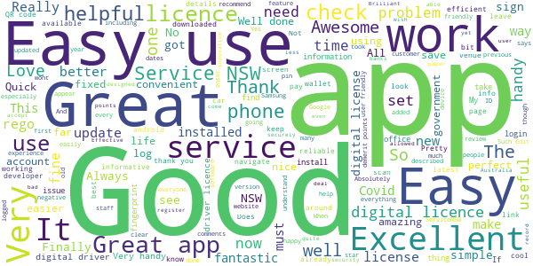
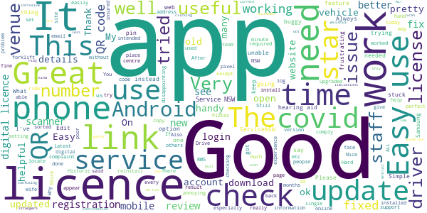
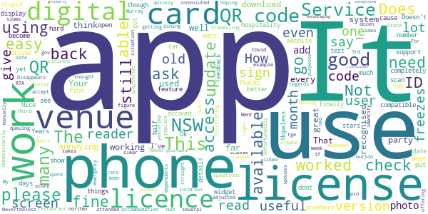
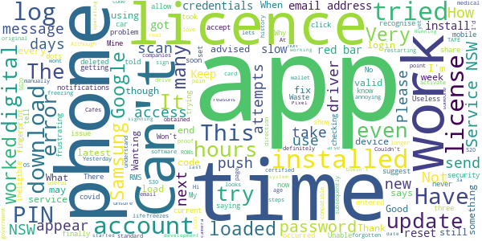
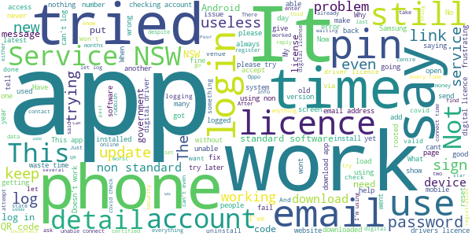

# Service NSW
App version ``4.31.0 (171374)``

Analyzed with [covid-apps-observer](http://github.com/covid-apps-observer) project, version ``0.1``

## App overview
| | |
|-------------------------|-------------------------| 
| **Name**&nbsp;&nbsp;&nbsp;&nbsp;&nbsp;&nbsp;&nbsp;&nbsp;&nbsp;&nbsp;&nbsp;&nbsp;&nbsp;&nbsp;&nbsp;&nbsp;&nbsp;&nbsp;&nbsp;&nbsp;&nbsp;&nbsp;&nbsp;&nbsp;&nbsp;&nbsp;&nbsp;&nbsp;&nbsp;&nbsp;&nbsp;&nbsp;&nbsp;&nbsp;&nbsp;&nbsp;&nbsp;&nbsp;&nbsp;&nbsp;  | Service NSW |
| **Unique identifier** | au.gov.nsw.service |
| **Link to Google Play** | [https://play.google.com/store/apps/details?id=au.gov.nsw.service](https://play.google.com/store/apps/details?id=au.gov.nsw.service) |
| **Summary**  | Digital licences, registrations, fines and more |
| **Privacy policy** | [http://www.service.nsw.gov.au/privacy](http://www.service.nsw.gov.au/privacy) |
| **Latest version** | 4.31.0 (171374) |
| **Last update** | 2020-12-07 05:18:23 |
| **Recent changes** | Thanks for using the Service NSW app! We used your feedback to make these improvements • The one you&#39;ve been waiting for - you can check-in dependants with COVID Safe Check-in! You can do this with or without an account. Thank you for your patience and we hope it makes your check-in process smoother. • No need to re-enter your username and password when getting your digital licences |
| **Installs**  | 1,000,000+ |
| **Category** | Tools |
| **First release** | Dec 7, 2014 |
| **Size**  | 26M |
| **Supported Android version**  | 6.0 and up |

### Description
> The official Service NSW app, making it easier to access government services. 
 <b>Digital licences and credentials</b>
 Access the following digital licences and credentials, with more to come: 
 • Driver Licence 
 • RSA/RCG Competency Card 
 • Working with Children Check 
 • Recreational Fishing Licence 
 • Boat Driver Licence.
 <b>COVID Safe Check-in</b> 
 • Quick, contactless check in at COVID Safe venues 
 • Point your device camera at the COVID Safe QR Code to get started 
 • Save your details for a faster check in next time. 
 <b>Useful tools and services</b>
 • Verify a Digital Driver Licence via our licence checker 
 • Check or renew a registration 
 • Sign into licensed venues.
 <b>Fines and demerits</b>
 • View and pay your fines 
 • View your demerits.
 <b>COVID-19 resources</b>
 • Access COVID-19 statistics by postcode 
 • Access our COVID-19 Assistance Finder with benefits, rebates and concessions. 
 <b>Tell us what you think</b>
 • Help us help you! We’re always working on a better, stronger, faster app. 
 • Share what you’d like to see in the app: we use your feedback to continuously improve the app experience.

### User interface
The developers of the app provide the following screenshots in the Google play store.
| | | |
|:-------------------------:|:-------------------------:|:-------------------------:|
 |   |   |   | 
 |   |  

## Development team
In the following we report the main information provided by the development team in the Google play store.

| | |
|-------------------------|-------------------------|
| **Developer**  | Service NSW |
| **Website**  | [https://www.service.nsw.gov.au/mobile-app      ](https://www.service.nsw.gov.au/mobile-app      ) |
| **Email** | mobileapp@service.nsw.gov.au |
| **Physical address**  | - |
| **Other developed apps**  | [https://play.google.com/store/apps/developer?id=Service+NSW](https://play.google.com/store/apps/developer?id=Service+NSW) |

## Android support

| | |
|-------------------------|-------------------------|
| **Declared target Android version**  | Android10, version 10 (API level 29) |
| **Effective target Android version**  | Android10, version 10 (API level 29) |
| **Minimum supported Android version**  | Marshmallow, version 6.0 (API level 23) |
| **Maximum target Android version**  | - |

The larger the difference between the minimum and maximum supported Android versions, the better. A larger difference means a wider audience. For example, old phones have a very low Android version, so a high minimum supported Android version means that the app cannot be used by users with old phones, thus leading to accessibility problems. 

## Requested permissions

In the following we report the complete list of the permissions requested by the app. 

| **Permission** | **Protection level** | **Description** | 
|-------------------------|-------------------------|-------------------------|
 **android.permission ACCESS_NETWORK_STATE** | Normal | Allows applications to access information about networks. 
 **android.permission ACCESS_WIFI_STATE** | Normal | Allows applications to access information about Wi-Fi networks. 
 **android.permission CAMERA** | :warning:**Dangerous** | Required to be able to access the camera device. 
 **android.permission INTERNET** | Normal | Allows applications to open network sockets. 
 **android.permission READ_APP_BADGE** | - | - 
 **android.permission READ_EXTERNAL_STORAGE** | :warning:**Dangerous** | Allows an application to read from external storage. 
 **android.permission USE_FINGERPRINT** | Normal | This constant was deprecated in API level 28. Applications should request USE_BIOMETRIC instead 
 **android.permission VIBRATE** | Normal | Allows access to the vibrator. 
 **android.permission WAKE_LOCK** | Normal | Allows using PowerManager WakeLocks to keep processor from sleeping or screen from dimming. 
 **android.permission WRITE_EXTERNAL_STORAGE** | :warning:**Dangerous** | Allows an application to write to external storage. 
 **com.anddoes.launcher.permission UPDATE_COUNT** | - | - 
 **com.android.vending CHECK_LICENSE** | - | - 
 **com.google.android.c2dm.permission RECEIVE** | - | - 
 **com.google.android.finsky.permission BIND_GET_INSTALL_REFERRER_SERVICE** | - | - 
 **com.htc.launcher.permission READ_SETTINGS** | - | - 
 **com.htc.launcher.permission UPDATE_SHORTCUT** | - | - 
 **com.huawei.android.launcher.permission CHANGE_BADGE** | - | - 
 **com.huawei.android.launcher.permission READ_SETTINGS** | - | - 
 **com.huawei.android.launcher.permission WRITE_SETTINGS** | - | - 
 **com.majeur.launcher.permission UPDATE_BADGE** | - | - 
 **com.oppo.launcher.permission READ_SETTINGS** | - | - 
 **com.oppo.launcher.permission WRITE_SETTINGS** | - | - 
 **com.sec.android.provider.badge.permission READ** | - | - 
 **com.sec.android.provider.badge.permission WRITE** | - | - 
 **com.sonyericsson.home.permission BROADCAST_BADGE** | - | - 
 **com.sonymobile.home.permission PROVIDER_INSERT_BADGE** | - | - 
 **me.everything.badger.permission BADGE_COUNT_READ** | - | - 
 **me.everything.badger.permission BADGE_COUNT_WRITE** | - | - 

## Mentioned servers

| **Server** | **Registrant** | **Registrant country** | **Creation date** | 
|-------------------------|-------------------------|-------------------------|-------------------------|
 | apache.org | The Apache Software Foundation | :us: US | 1995-04-11 04:00:00 |
 | xml.org | OASIS Open | :us: US | 1997-02-03 05:00:00 |
 | w3.org | W3C | :us: US | 1994-07-06 04:00:00 |
 | purl.org | Internet Archive | :us: US | 1996-01-01 05:00:00 |
 | adobe.com | Adobe Inc. | :us: US | 1986-11-17 05:00:00 |
 | android.com | Google LLC | :us: US | 1997-06-23 04:00:00 |
 | googlesyndication.com | Google LLC | :us: US | 2003-01-21 06:17:24 |
 | google.com | Google LLC | :us: US | 1997-09-15 04:00:00 |
 | app-measurement.com | Google LLC | :us: US | 2015-06-19 20:13:31 |
 | googleapis.com | Google LLC | :us: US | 2005-01-25 17:52:26 |
 | googleapis.com | Google LLC | :us: US | 2005-01-25 17:52:26 |
 | iptc.org | Whois Privacy Service | :us: US | 1995-12-27 05:00:00 |
 | useplus.org | PLUS COALITION | :us: US | 2003-11-18 19:31:25 |
 | npes.org | NPES | :us: US | 1996-01-30 05:00:00 |
 | aiim.org | Association for Information and Image Management International | :us: US | 1995-10-18 04:00:00 |
 | googleapis.com | Google LLC | :us: US | 2005-01-25 17:52:26 |
 | googleapis.com | Google LLC | :us: US | 2005-01-25 17:52:26 |
 | googleadservices.com | Google LLC | :us: US | 2003-06-19 16:34:53 |

## Security analysis 

Below we report the main security warnings raised by our execution of the [Androwarn](https://github.com/maaaaz/androwarn) security analysis tool.

**Telephony identifiers leakage**
> - This application reads the numeric name (MCC+MNC) of current registered operator 
> - This application reads the operator name 
> - This application reads the phone number string for line 1, for example, the MSISDN for a GSM phone 
> - This application reads the unique device ID, i.e the IMEI for GSM and the MEID or ESN for CDMA phones 

**Location lookup**
> - This application reads location information from all available providers (WiFi, GPS etc.) 

**Connection interfaces exfiltration**
> - This application reads details about the currently active data network 
> - This application tries to find out if the currently active data network is metered 

**Audio video eavesdropping**
> - This application records audio from the 'CAMCORDER' source  
> - This application records audio from the 'MIC' source  
> - This application captures video from the 'CAMERA' source 
> - This application captures video from the 'SURFACE' source 

**Suspicious connection establishment**
> - This application opens a Socket and connects it to the remote address '' on the 'N/A' port  
> - This application opens a Socket and connects it to the remote address 'Ljava/lang/StringBuilder;->toString()Ljava/lang/String;' on the ': connect, resolve' port  
> - This application opens a Socket and connects it to the remote address 'Ljava/lang/StringBuilder;->toString()Ljava/lang/String;' on the 'N/A' port  
> - This application opens a Socket and connects it to the remote address 'Ljava/net/Proxy;->type()Ljava/net/Proxy$Type;' on the 'N/A' port  
> - This application opens a Socket and connects it to the remote address 'Network subsystem is unavailable' on the 'N/A' port  
> - This application opens a Socket and connects it to the remote address 'timeout' on the 'N/A' port  

**Pim data leakage**
> - This application accesses data stored in the clipboard 

**Code execution**
> - This application loads a native library 
> - This application loads a native library: 'Ljava/util/Iterator;->next()Ljava/lang/Object;' 
> - This application loads a native library: 'log' 
> - This application loads a native library: 'sentry' 
> - This application loads a native library: 'sentry-android' 
> - This application loads a native library: 'tool-checker' 
> - This application executes a UNIX command 

## User ratings and reviews

Below we provide information about how end users are reacting to the app in terms of ratings and reviews in the Google Play store.

### Ratings

The Service NSW app has been installed by more than **1000000** times. At this time, **4130** rated the app and its average score is **4.5027523**. Below we show the distribution of the ratings across the usual star-based rating of Google Play

:star::star::star::star::star:: 2926

:star::star::star::star:: 773

:star::star::star:: 189

:star::star:: 68

:star:: 174

### Reviews 

#### 5-star reviews

> Convient and well designed app that really helps. Thanks innovative NSW government. Excellent!!  :date: __2020-12-13 07:19:27__

> So easy to use. Brilliant app.  :date: __2020-12-12 13:37:35__

> Great Centralised App  :date: __2020-12-12 10:32:40__

> Easy to use and simple to understand. Quick as well.  :date: __2020-12-12 10:09:35__

> So easy to use. We'll done Service NSW  :date: __2020-12-12 07:05:42__

> Great service  :date: __2020-12-12 06:59:52__

> I know that 9898i9i8776i666.× 2%=(#-  :date: __2020-12-12 05:27:12__

> Quick. Easy.  :date: __2020-12-11 23:53:34__

> I have had no problems with the app, it's user friendly (even for oldies like myself). My android mbl is 6yr old has all the latest OS updates & app updates & I run good security software. Very happy 10/10  :date: __2020-12-11 23:02:25__

> Easy to deal with.  :date: __2020-12-11 22:08:10__

#### 4-star reviews

> After the latest update clicking the app icon opens to the Play Store page instead of the app.  :date: __2020-12-12 10:06:44__

> There should be only one kind of QR Scan, it is too confusing and very frustrating  :date: __2020-12-12 04:56:32__

> Easy to use, but not all Riverina venues use it. What are its limitations?  :date: __2020-12-12 04:32:42__

> Only used it once.. it worked ok, but I had to copy and paste confirmation numbers. I don't like the way that some venues don't use the dot Gov website. You have to entrust your information with strangers. If this is law that we must comply with.. venues should use the same website. The app for ACT is less intrusive.  :date: __2020-12-12 04:23:05__

> Current HTC phone with updated Android OS. This app appears to auto update, ignoring the settings to not do so on the phone. This then crashes the badly written app for managing my hearing aids and needs a 40 minute process to remove and reinstall the hearing aid app and reset the hearing aids.  :date: __2020-12-11 23:05:42__

> It was ok  :date: __2020-12-11 22:53:12__

> Good  :date: __2020-12-11 22:34:44__

> Easy to use  :date: __2020-12-11 10:42:06__

> Some aspects are very useful, such as the digital licence. On the other hand, it is frustrating that not a single place I have visited is using the COVID QR registration option.  :date: __2020-12-11 10:40:23__

> Ease to use and handy for my id  :date: __2020-12-11 08:44:06__

#### 3-star reviews

> Not working right  :date: __2020-12-11 11:18:49__

> the old app was good and easy.but getting used to it.  :date: __2020-12-11 11:04:24__

> Unnecessarily convoluted but useful  :date: __2020-12-11 07:36:30__

> I think the app is great, however, many venues in norther NSW do not use it.  :date: __2020-12-11 07:05:10__

> The qr code does not work on this phone. The pin no. Disappears far too quickly.  :date: __2020-12-11 07:05:09__

> Easy to use  :date: __2020-12-11 06:35:38__

> I have just spent a week travelling from the Murray to the Tweed and back again. That's a lot of accommodation and dining. Your app only recognised 2 venue's QR codes. That was annoying, frustrating and begs a lot of questions in regards to your App and the QR system. My spouses 3rd party App worked at every location, go figure. Nevertheless the App worked well for the 2 venues that were recognised.  :date: __2020-12-11 06:27:02__

> Easy to download if you have a compatible phone. The update says you can sign in dependants but I can't see how to do this. Husband doesn't have a compatible phone so I was hoping to be able to sign him in.  :date: __2020-12-11 06:21:53__

> Not that many venues use the gov app.  :date: __2020-12-11 06:10:58__

> Does not accept tge okd RTA ID card  :date: __2020-12-11 06:09:51__

#### 2-star reviews

> This app was so useful, even just the times I had forgotten to take my wallet with me. Although, I'm unsure if it's an app update or something on my end but the app no longer works at all. When I try to log in I get a message that says " It looks like your device may be using non-standard software" I have the same SG20+ & it definitely has the original OS, doesn't have any ROMs, and has been certified by Google. I'd love for someone to point me in the direction of how to fix this, Thank you :)  :date: __2020-12-12 03:20:16__

> Couldn't login with latest update?!!🤬 New Samsung S20. Update to above...worked after restarting phone. Thanks.  :date: __2020-12-12 03:07:20__

> How come a proof of age card can't be on here even though it was obtained through service NSW? I don't drive for medical reasons.  :date: __2020-12-11 11:01:46__

> Not valid at many Cafés.  :date: __2020-12-11 08:47:23__

> Not many companies use the government code  :date: __2020-12-11 08:12:04__

> A real pain in the arse of an app. Wanting not just an email but my life history.  :date: __2020-12-11 06:50:13__

> Worked in about 1 in 5 attempts  :date: __2020-12-11 06:19:59__

> Nevers lets me in.  :date: __2020-12-11 06:12:08__

> Good  :date: __2020-12-05 07:43:26__

> Can't understand TAFE NSW codes, have to sign in manually every time. Very annoying  :date: __2020-11-27 13:41:38__

#### 1-star reviews

> The app never ever works. I get a message saying "this is not a genuine Services NSW QR code."  :date: __2020-12-12 05:30:57__

> 5 times tried to sign up screw this for a joke going uninstall and you can shove your covid check in too hope you all do the same waste of taxpayers money  :date: __2020-12-12 05:20:50__

> Waste of time.  :date: __2020-12-12 01:05:54__

> Forgot password doesn't work  :date: __2020-12-11 23:36:34__

> Could not sign in  :date: __2020-12-11 22:14:18__

> I am unable to log in or even sign up again. It will not accept my email address which I know is correct.  :date: __2020-12-11 21:29:08__

> Covid test results not available after registering  :date: __2020-12-11 09:37:33__

> I was told that with this app I don't need either WiFi or Mobile Data to log in at a venue. Totally incorrect as it has not worked at least 3 times so far.  :date: __2020-12-11 09:07:00__

> The QR code on it never works.  :date: __2020-12-11 07:13:16__

> When trying to log my attendance at locations via scanning the QR Codes to sign in I can't specify the time I left the location and am forced to wait until I leave to sign off, only problem is the app automatically signs out when waiting more than a few minutes (and doesn't save location) when going back into the app when leaving and trying again I can't change the time when I truely did arrive therefore the logged times are inaccurate.  :date: __2020-12-11 06:58:11__

