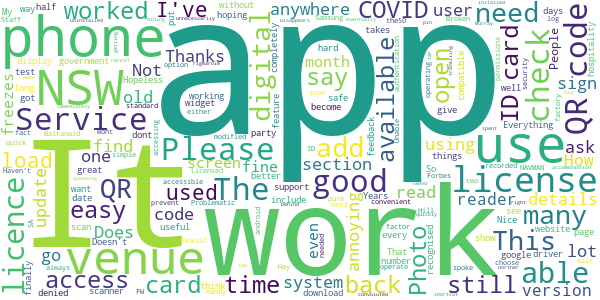

# Service NSW
App version ``4.32.0 (175915)``

Analyzed with [covid-apps-observer](http://github.com/covid-apps-observer) project, version ``0.1``

## App overview
| | |
|-------------------------|-------------------------| 
| **Name**&nbsp;&nbsp;&nbsp;&nbsp;&nbsp;&nbsp;&nbsp;&nbsp;&nbsp;&nbsp;&nbsp;&nbsp;&nbsp;&nbsp;&nbsp;&nbsp;&nbsp;&nbsp;&nbsp;&nbsp;&nbsp;&nbsp;&nbsp;&nbsp;&nbsp;&nbsp;&nbsp;&nbsp;&nbsp;&nbsp;&nbsp;&nbsp;&nbsp;&nbsp;&nbsp;&nbsp;&nbsp;&nbsp;&nbsp;&nbsp;  | Service NSW |
| **Unique identifier** | au.gov.nsw.service |
| **Link to Google Play** | [https://play.google.com/store/apps/details?id=au.gov.nsw.service](https://play.google.com/store/apps/details?id=au.gov.nsw.service) |
| **Summary**  | Digital licences, registrations, fines and more |
| **Privacy policy** | [http://www.service.nsw.gov.au/privacy](http://www.service.nsw.gov.au/privacy) |
| **Latest version** | 4.32.0 (175915) |
| **Last update** | 2020-12-16 08:18:33 |
| **Recent changes** | Thanks for using the Service NSW app! We used your feedback to make these improvements.  • Made the app faster to get your account details when using COVID Safe Check-in  • Better onscreen messaging for privacy information and when something goes wrong • Fixed a bug where larger font sizes weren&#39;t working properly on fingerprint log in screen |
| **Installs**  | 1,000,000+ |
| **Category** | Tools |
| **First release** | Dec 7, 2014 |
| **Size**  | 25M |
| **Supported Android version**  | 6.0 and up |

### Description
> The official Service NSW app, making it easier to access government services. 
 <b>Digital licences and credentials</b>
 Access the following digital licences and credentials, with more to come: 
 • Driver Licence 
 • RSA/RCG Competency Card 
 • Working with Children Check 
 • Recreational Fishing Licence 
 • Boat Driver Licence.
 <b>COVID Safe Check-in</b> 
 • Quick, contactless check in at COVID Safe venues 
 • Point your device camera at the COVID Safe QR Code to get started 
 • Save your details for a faster check in next time. 
 <b>Useful tools and services</b>
 • Verify a Digital Driver Licence via our licence checker 
 • Check or renew a registration 
 • Sign into licensed venues.
 <b>Fines and demerits</b>
 • View and pay your fines 
 • View your demerits.
 <b>COVID-19 resources</b>
 • Access COVID-19 statistics by postcode 
 • Access our COVID-19 Assistance Finder with benefits, rebates and concessions. 
 <b>Tell us what you think</b>
 • Help us help you! We’re always working on a better, stronger, faster app. 
 • Share what you’d like to see in the app: we use your feedback to continuously improve the app experience.

### User interface
The developers of the app provide the following screenshots in the Google play store.
| | | |
|:-------------------------:|:-------------------------:|:-------------------------:|
 |   |   |   | 
 |   |  

## Development team
In the following we report the main information provided by the development team in the Google play store.

| | |
|-------------------------|-------------------------|
| **Developer**  | Service NSW |
| **Website**  | [https://www.service.nsw.gov.au/mobile-app      ](https://www.service.nsw.gov.au/mobile-app      ) |
| **Email** | mobileapp@service.nsw.gov.au |
| **Physical address**  | - |
| **Other developed apps**  | [https://play.google.com/store/apps/developer?id=Service+NSW](https://play.google.com/store/apps/developer?id=Service+NSW) |

## Android support

| | |
|-------------------------|-------------------------|
| **Declared target Android version**  | Android10, version 10 (API level 29) |
| **Effective target Android version**  | Android10, version 10 (API level 29) |
| **Minimum supported Android version**  | Marshmallow, version 6.0 (API level 23) |
| **Maximum target Android version**  | - |

The larger the difference between the minimum and maximum supported Android versions, the better. A larger difference means a wider audience. For example, old phones have a very low Android version, so a high minimum supported Android version means that the app cannot be used by users with old phones, thus leading to accessibility problems. 

## Requested permissions

In the following we report the complete list of the permissions requested by the app. 

| **Permission** | **Protection level** | **Description** | 
|-------------------------|-------------------------|-------------------------|
 **android.permission ACCESS_NETWORK_STATE** | Normal | Allows applications to access information about networks. 
 **android.permission ACCESS_WIFI_STATE** | Normal | Allows applications to access information about Wi-Fi networks. 
 **android.permission CAMERA** | :warning:**Dangerous** | Required to be able to access the camera device. 
 **android.permission INTERNET** | Normal | Allows applications to open network sockets. 
 **android.permission READ_APP_BADGE** | - | - 
 **android.permission READ_EXTERNAL_STORAGE** | :warning:**Dangerous** | Allows an application to read from external storage. 
 **android.permission USE_FINGERPRINT** | Normal | This constant was deprecated in API level 28. Applications should request USE_BIOMETRIC instead 
 **android.permission VIBRATE** | Normal | Allows access to the vibrator. 
 **android.permission WAKE_LOCK** | Normal | Allows using PowerManager WakeLocks to keep processor from sleeping or screen from dimming. 
 **android.permission WRITE_EXTERNAL_STORAGE** | :warning:**Dangerous** | Allows an application to write to external storage. 
 **com.anddoes.launcher.permission UPDATE_COUNT** | - | - 
 **com.android.vending CHECK_LICENSE** | - | - 
 **com.google.android.c2dm.permission RECEIVE** | - | - 
 **com.google.android.finsky.permission BIND_GET_INSTALL_REFERRER_SERVICE** | - | - 
 **com.htc.launcher.permission READ_SETTINGS** | - | - 
 **com.htc.launcher.permission UPDATE_SHORTCUT** | - | - 
 **com.huawei.android.launcher.permission CHANGE_BADGE** | - | - 
 **com.huawei.android.launcher.permission READ_SETTINGS** | - | - 
 **com.huawei.android.launcher.permission WRITE_SETTINGS** | - | - 
 **com.majeur.launcher.permission UPDATE_BADGE** | - | - 
 **com.oppo.launcher.permission READ_SETTINGS** | - | - 
 **com.oppo.launcher.permission WRITE_SETTINGS** | - | - 
 **com.sec.android.provider.badge.permission READ** | - | - 
 **com.sec.android.provider.badge.permission WRITE** | - | - 
 **com.sonyericsson.home.permission BROADCAST_BADGE** | - | - 
 **com.sonymobile.home.permission PROVIDER_INSERT_BADGE** | - | - 
 **me.everything.badger.permission BADGE_COUNT_READ** | - | - 
 **me.everything.badger.permission BADGE_COUNT_WRITE** | - | - 

## Mentioned servers

| **Server** | **Registrant** | **Registrant country** | **Creation date** | 
|-------------------------|-------------------------|-------------------------|-------------------------|
 | apache.org | The Apache Software Foundation | :us: US | 1995-04-11 04:00:00 |
 | xml.org | OASIS Open | :us: US | 1997-02-03 05:00:00 |
 | w3.org | W3C | :us: US | 1994-07-06 04:00:00 |
 | purl.org | Internet Archive | :us: US | 1996-01-01 05:00:00 |
 | adobe.com | Adobe Inc. | :us: US | 1986-11-17 05:00:00 |
 | android.com | Google LLC | :us: US | 1997-06-23 04:00:00 |
 | googlesyndication.com | Google LLC | :us: US | 2003-01-21 06:17:24 |
 | google.com | Google LLC | :us: US | 1997-09-15 04:00:00 |
 | app-measurement.com | Google LLC | :us: US | 2015-06-19 20:13:31 |
 | googleapis.com | Google LLC | :us: US | 2005-01-25 17:52:26 |
 | googleapis.com | Google LLC | :us: US | 2005-01-25 17:52:26 |
 | iptc.org | Whois Privacy Service | :us: US | 1995-12-27 05:00:00 |
 | useplus.org | PLUS COALITION | :us: US | 2003-11-18 19:31:25 |
 | npes.org | NPES | :us: US | 1996-01-30 05:00:00 |
 | aiim.org | Association for Information and Image Management International | :us: US | 1995-10-18 04:00:00 |
 | googleapis.com | Google LLC | :us: US | 2005-01-25 17:52:26 |
 | googleapis.com | Google LLC | :us: US | 2005-01-25 17:52:26 |
 | googleadservices.com | Google LLC | :us: US | 2003-06-19 16:34:53 |

## Security analysis 

Below we report the main security warnings raised by our execution of the [Androwarn](https://github.com/maaaaz/androwarn) security analysis tool.

**Telephony identifiers leakage**
> - This application reads the numeric name (MCC+MNC) of current registered operator 
> - This application reads the operator name 
> - This application reads the phone number string for line 1, for example, the MSISDN for a GSM phone 
> - This application reads the unique device ID, i.e the IMEI for GSM and the MEID or ESN for CDMA phones 

**Location lookup**
> - This application reads location information from all available providers (WiFi, GPS etc.) 

**Connection interfaces exfiltration**
> - This application reads details about the currently active data network 
> - This application tries to find out if the currently active data network is metered 

**Audio video eavesdropping**
> - This application records audio from the 'CAMCORDER' source  
> - This application records audio from the 'MIC' source  
> - This application captures video from the 'CAMERA' source 
> - This application captures video from the 'SURFACE' source 

**Suspicious connection establishment**
> - This application opens a Socket and connects it to the remote address '' on the 'N/A' port  
> - This application opens a Socket and connects it to the remote address 'Ljava/lang/StringBuilder;->toString()Ljava/lang/String;' on the ': connect, resolve' port  
> - This application opens a Socket and connects it to the remote address 'Ljava/lang/StringBuilder;->toString()Ljava/lang/String;' on the 'N/A' port  
> - This application opens a Socket and connects it to the remote address 'Ljava/net/Proxy;->type()Ljava/net/Proxy$Type;' on the 'N/A' port  
> - This application opens a Socket and connects it to the remote address 'Network subsystem is unavailable' on the 'N/A' port  
> - This application opens a Socket and connects it to the remote address 'timeout' on the 'N/A' port  

**Pim data leakage**
> - This application accesses data stored in the clipboard 

**Code execution**
> - This application loads a native library 
> - This application loads a native library: 'Ljava/util/Iterator;->next()Ljava/lang/Object;' 
> - This application loads a native library: 'log' 
> - This application loads a native library: 'sentry' 
> - This application loads a native library: 'sentry-android' 
> - This application loads a native library: 'tool-checker' 
> - This application executes a UNIX command 

## User ratings and reviews

Below we provide information about how end users are reacting to the app in terms of ratings and reviews in the Google Play store.

### Ratings

The Service NSW app has been installed by more than **1000000** times. At this time, **4196** rated the app and its average score is **4.424144**. Below we show the distribution of the ratings across the usual star-based rating of Google Play

:star::star::star::star::star:: 2862

:star::star::star::star:: 794

:star::star::star:: 219

:star::star:: 102

:star:: 219

### Reviews 

#### 5-star reviews

> This app works really well. With respect to the COVID registration - when asking for dependents, is it possible to add a drop down list to store names and phone numbers? It needs to be editable.  :date: __2021-01-03 04:46:37__

> Excellent Services NSW Thanks  :date: __2021-01-01 10:37:38__

> love it so much  :date: __2020-12-31 03:37:19__

> 3rd  :date: __2020-12-31 01:27:46__

> Even though this is a Government app it has been kept relatively simple. Older folk will have trouble due to fomu.  :date: __2020-12-30 01:33:36__

> Good  :date: __2020-12-26 07:24:32__

> Is no working the QR. now it's working fine. Thanks  :date: __2020-12-26 00:42:27__

> Thank you  :date: __2020-12-24 07:06:23__

> Excellent  :date: __2020-12-23 01:11:08__

> Excellent service.  :date: __2020-12-21 08:20:27__

#### 4-star reviews

> Can't wait to use this app  :date: __2021-01-02 01:49:03__

> Excellent  :date: __2020-12-30 07:06:36__

> With Service NSW QR codes about to become mandatory, I'd like to see the following things to come up to five stars: - a widget to create a shortcut on your home screen directly to the QR check-in function - a persistent notification while you're checked in somewhere with a shortcut to check out - ability to save details of frequent companions so that you can quickly and easily check them in with you.  :date: __2020-12-28 05:40:57__

> A pain to set up but easy to use once it is going  :date: __2020-12-17 12:46:54__

> Issue resolved by reinstalling app :) TY! Check-in option is great feature. Would suggest adding optional location based notification for when you leave a venue so you can checkout right away. Keep up the good work folks!  :date: __2020-12-17 01:18:45__

> Vulnerable  :date: __2020-12-14 23:11:56__

> There should be only one kind of QR Scan, it is too confusing and very frustrating  :date: __2020-12-12 04:56:32__

> Easy to use, but not all Riverina venues use it. What are its limitations?  :date: __2020-12-12 04:32:42__

> Only used it once.. it worked ok, but I had to copy and paste confirmation numbers. I don't like the way that some venues don't use the dot Gov website. You have to entrust your information with strangers. If this is law that we must comply with.. venues should use the same website. The app for ACT is less intrusive.  :date: __2020-12-12 04:23:05__

> Current HTC phone with updated Android OS. This app appears to auto update, ignoring the settings to not do so on the phone. This then crashes the badly written app for managing my hearing aids and needs a 40 minute process to remove and reinstall the hearing aid app and reset the hearing aids.  :date: __2020-12-11 23:05:42__

#### 3-star reviews

> Like a NAVMAN,People spoke of this service in the50,s  :date: __2021-01-02 22:08:23__

> Unable to load it in either Forbes Hay Balranald  :date: __2021-01-02 09:14:10__

> icon  :date: __2021-01-02 03:02:28__

> ,,,,,,. ,,,,,,,,,,,,. ,,,,,,,  :date: __2021-01-01 00:11:07__

> Please add an option to add the NSW Photo ID card in the app so that it is more convenient.  :date: __2020-12-31 04:10:06__

> Problematic in use  :date: __2020-12-24 05:51:22__

> Licensed needs to be more accessible for quick access  :date: __2020-12-22 22:14:27__

> Haven't been able to get the COVID check in to work at any venues. Staff always say it never works on Samsung phones. Everything else is good that I've used in the app, but not being able to check in anywhere is annoying.  :date: __2020-12-22 10:54:51__

> The App wont work on my pure android Nokia7+ because i choose to have all permissions that can be denied...denied and still have the phone operate as a phone. My phone is factory standard and hasn't had the operating system modified in any way. The fact that I don't log in to google shouldn't prevent me from accessing my details held by the government....simple two factor authentication is all that is needed for security. So now it works.....and when it works it is handy.  :date: __2020-12-22 02:06:53__

> Service NSW covid safe app uses NSW time but Broken Hill in FW NSW is on SA time so the times recorded are 1/2 out.  :date: __2020-12-20 01:15:25__

#### 2-star reviews

> Poor  :date: __2021-01-02 16:30:22__

> Doesn't auto checkout when you scan the next code... just rechecks in to the first place you scanned. So I went through a whole day checking in to the same restaurant 10 times!  :date: __2021-01-02 08:01:50__

> The app is difficult to access I have an Android phone and the email address and my usual password don't work I will have to yes a laptop computer to allow a password change.  :date: __2021-01-02 06:20:13__

> Use to be able to all sort of thing on this app, even do a notice of disposal. Now every transaction is gone, replace with checking demerit point and pay fine. Totally useless. Bring back notice of disposal, rego check, easy services like that will be tremendously useful  :date: __2021-01-02 05:03:40__

> Try as I might I could not change back from my sisters account to mine. Thus no dig DL or QR code camera FOR ME.  :date: __2021-01-02 00:33:20__

> Not good  :date: __2020-12-31 09:57:58__

> While the app is easy to use the check in and check out function for covid does not allow you to use any other phone features. If you make a call or search something online then switch back to the app it has automatically reset itself to welcome screen. This means for covid you need to keep a record of when you leave places.  :date: __2020-12-31 01:54:51__

> Tried to use this app today in Tarago NSW. Was able to download using wifi, but hit a roadblock because I had no mobile signal so couldn't receive the code sent via sms.  :date: __2020-12-30 07:50:44__

> The covid checkin will not on Oppo A57 it is definitely service Nsw QR Code. It works fine on my Samsung Galaxy note 7. Can you update for Oppo??  :date: __2020-12-27 09:40:51__

> Scanned the icon successfully the other day. Since then,am asked for a pin # and doesn't accept any I input  :date: __2020-12-22 06:14:34__

#### 1-star reviews

> Covid check wont work for me either (despite several people trying to make it work for me), same issue as described by previous comments, it is looking for more info e.g. mobile phone number but there is no where to enter those details.  :date: __2021-01-03 11:15:55__

> Awful. I can find it on the phones  :date: __2021-01-03 11:07:43__

> Why can't I install this nsw app?  :date: __2021-01-03 09:40:03__

> All I wanted was to install QRcode  :date: __2021-01-03 05:44:03__

> Tried many times to download the app. Got as far as Nsw app will download soon but it never does. Why do we have to go through a third. Party to det the app. Why cannot we download from the nsw gov site?  :date: __2021-01-03 05:17:46__

> In cafe Can't scan code. It doesn't take me to another fill in form. Android Nokia  :date: __2021-01-03 04:45:55__

> Won't work asks for my mobile number 5o be entered which it is asks for my name which is there , even tells me I have account everything is linked but still Won't scan  :date: __2021-01-03 04:37:07__

> Can't find the Covid check in functionality  :date: __2021-01-03 04:12:31__

> I want to be able to access this from my homescreen  :date: __2021-01-03 02:30:23__

> This app is absolutely USELESS .Brand new android phone loaded QR app, scanned follow prompts and will not check in at all .. Reloaded App, tried everthing still not working ..Very frustrating ..POOR EFFORT Services NSW ..Make sure your system works on all plat forms before forcing it on everyone .  :date: __2021-01-03 02:28:01__

