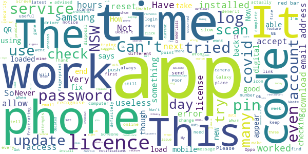
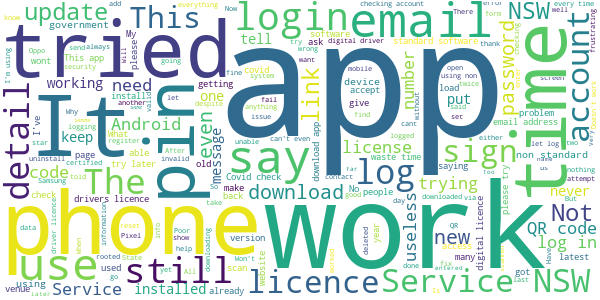

# Service NSW
App version ``4.32.0 (175915)``

Analyzed with [covid-apps-observer](http://github.com/covid-apps-observer) project, version ``0.1``

## App overview
| | |
|-------------------------|-------------------------| 
| **Name**                                          | Service NSW |
| **Unique identifier** | au.gov.nsw.service |
| **Link to Google Play** | [https://play.google.com/store/apps/details?id=au.gov.nsw.service](https://play.google.com/store/apps/details?id=au.gov.nsw.service) |
| **Summary**  | Digital licences, registrations, fines and more |
| **Privacy policy** | [http://www.service.nsw.gov.au/privacy](http://www.service.nsw.gov.au/privacy) |
| **Latest version** | 4.32.0 (175915) |
| **Last update** | 2020-12-16 08:18:33 |
| **Recent changes** | Thanks for using the Service NSW app! We used your feedback to make these improvements.  • Made the app faster to get your account details when using COVID Safe Check-in  • Better onscreen messaging for privacy information and when something goes wrong • Fixed a bug where larger font sizes weren&#39;t working properly on fingerprint log in screen |
| **Installs**  | 1,000,000+ |
| **Category** | Tools |
| **First release** | Dec 7, 2014 |
| **Size**  | 25M |
| **Supported Android version**  | 6.0 and up |

### Description
> The official Service NSW app, making it easier to access government services. 
 <b>Digital licences and credentials</b>
 Access the following digital licences and credentials, with more to come: 
 • Driver Licence 
 • RSA/RCG Competency Card 
 • Working with Children Check 
 • Recreational Fishing Licence 
 • Boat Driver Licence.
 <b>COVID Safe Check-in</b> 
 • Quick, contactless check in at COVID Safe venues 
 • Point your device camera at the COVID Safe QR Code to get started 
 • Save your details for a faster check in next time. 
 <b>Useful tools and services</b>
 • Verify a Digital Driver Licence via our licence checker 
 • Check or renew a registration 
 • Sign into licensed venues.
 <b>Fines and demerits</b>
 • View and pay your fines 
 • View your demerits.
 <b>COVID-19 resources</b>
 • Access COVID-19 statistics by postcode 
 • Access our COVID-19 Assistance Finder with benefits, rebates and concessions. 
 <b>Tell us what you think</b>
 • Help us help you! We’re always working on a better, stronger, faster app. 
 • Share what you’d like to see in the app: we use your feedback to continuously improve the app experience.

### User interface
The developers of the app provide the following screenshots in the Google play store.
| | | |
|:-------------------------:|:-------------------------:|:-------------------------:|
 |   |   |   | 
 |   |  

## Development team
In the following we report the main information provided by the development team in the Google play store.

| | |
|-------------------------|-------------------------|
| **Developer**  | Service NSW |
| **Website**  | [https://www.service.nsw.gov.au/mobile-app      ](https://www.service.nsw.gov.au/mobile-app      ) |
| **Email** | mobileapp@service.nsw.gov.au |
| **Physical address**  | - |
| **Other developed apps**  | [https://play.google.com/store/apps/developer?id=Service+NSW](https://play.google.com/store/apps/developer?id=Service+NSW) |

## Android support

| | |
|-------------------------|-------------------------|
| **Declared target Android version**  | Android10, version 10 (API level 29) |
| **Effective target Android version**  | Android10, version 10 (API level 29) |
| **Minimum supported Android version**  | Marshmallow, version 6.0 (API level 23) |
| **Maximum target Android version**  | - |

The larger the difference between the minimum and maximum supported Android versions, the better. A larger difference means a wider audience. For example, old phones have a very low Android version, so a high minimum supported Android version means that the app cannot be used by users with old phones, thus leading to accessibility problems. 

## Requested permissions

In the following we report the complete list of the permissions requested by the app. 

| **Permission** | **Protection level** | **Description** | 
|-------------------------|-------------------------|-------------------------|
 **android.permission ACCESS_NETWORK_STATE** | Normal | Allows applications to access information about networks. 
 **android.permission ACCESS_WIFI_STATE** | Normal | Allows applications to access information about Wi-Fi networks. 
 **android.permission CAMERA** | :warning:**Dangerous** | Required to be able to access the camera device. 
 **android.permission INTERNET** | Normal | Allows applications to open network sockets. 
 **android.permission READ_APP_BADGE** | - | - 
 **android.permission READ_EXTERNAL_STORAGE** | :warning:**Dangerous** | Allows an application to read from external storage. 
 **android.permission USE_FINGERPRINT** | Normal | This constant was deprecated in API level 28. Applications should request USE_BIOMETRIC instead 
 **android.permission VIBRATE** | Normal | Allows access to the vibrator. 
 **android.permission WAKE_LOCK** | Normal | Allows using PowerManager WakeLocks to keep processor from sleeping or screen from dimming. 
 **android.permission WRITE_EXTERNAL_STORAGE** | :warning:**Dangerous** | Allows an application to write to external storage. 
 **com.anddoes.launcher.permission UPDATE_COUNT** | - | - 
 **com.android.vending CHECK_LICENSE** | - | - 
 **com.google.android.c2dm.permission RECEIVE** | - | - 
 **com.google.android.finsky.permission BIND_GET_INSTALL_REFERRER_SERVICE** | - | - 
 **com.htc.launcher.permission READ_SETTINGS** | - | - 
 **com.htc.launcher.permission UPDATE_SHORTCUT** | - | - 
 **com.huawei.android.launcher.permission CHANGE_BADGE** | - | - 
 **com.huawei.android.launcher.permission READ_SETTINGS** | - | - 
 **com.huawei.android.launcher.permission WRITE_SETTINGS** | - | - 
 **com.majeur.launcher.permission UPDATE_BADGE** | - | - 
 **com.oppo.launcher.permission READ_SETTINGS** | - | - 
 **com.oppo.launcher.permission WRITE_SETTINGS** | - | - 
 **com.sec.android.provider.badge.permission READ** | - | - 
 **com.sec.android.provider.badge.permission WRITE** | - | - 
 **com.sonyericsson.home.permission BROADCAST_BADGE** | - | - 
 **com.sonymobile.home.permission PROVIDER_INSERT_BADGE** | - | - 
 **me.everything.badger.permission BADGE_COUNT_READ** | - | - 
 **me.everything.badger.permission BADGE_COUNT_WRITE** | - | - 

## Mentioned servers

| **Server** | **Registrant** | **Registrant country** | **Creation date** | 
|-------------------------|-------------------------|-------------------------|-------------------------|
 | apache.org | The Apache Software Foundation | :us: US | 1995-04-11 04:00:00 |
 | xml.org | OASIS Open | :us: US | 1997-02-03 05:00:00 |
 | w3.org | W3C | :us: US | 1994-07-06 04:00:00 |
 | purl.org | Internet Archive | :us: US | 1996-01-01 05:00:00 |
 | adobe.com | Adobe Inc. | :us: US | 1986-11-17 05:00:00 |
 | android.com | Google LLC | :us: US | 1997-06-23 04:00:00 |
 | googlesyndication.com | Google LLC | :us: US | 2003-01-21 06:17:24 |
 | google.com | Google LLC | :us: US | 1997-09-15 04:00:00 |
 | app-measurement.com | Google LLC | :us: US | 2015-06-19 20:13:31 |
 | googleapis.com | Google LLC | :us: US | 2005-01-25 17:52:26 |
 | googleapis.com | Google LLC | :us: US | 2005-01-25 17:52:26 |
 | iptc.org | Whois Privacy Service | :us: US | 1995-12-27 05:00:00 |
 | useplus.org | PLUS COALITION | :us: US | 2003-11-18 19:31:25 |
 | npes.org | NPES | :us: US | 1996-01-30 05:00:00 |
 | aiim.org | Association for Information and Image Management International | :us: US | 1995-10-18 04:00:00 |
 | googleapis.com | Google LLC | :us: US | 2005-01-25 17:52:26 |
 | googleapis.com | Google LLC | :us: US | 2005-01-25 17:52:26 |
 | googleadservices.com | Google LLC | :us: US | 2003-06-19 16:34:53 |

## Security analysis 

Below we report the main security warnings raised by our execution of the [Androwarn](https://github.com/maaaaz/androwarn) security analysis tool.

**Telephony identifiers leakage**
> - This application reads the numeric name (MCC+MNC) of current registered operator 
> - This application reads the operator name 
> - This application reads the phone number string for line 1, for example, the MSISDN for a GSM phone 
> - This application reads the unique device ID, i.e the IMEI for GSM and the MEID or ESN for CDMA phones 

**Location lookup**
> - This application reads location information from all available providers (WiFi, GPS etc.) 

**Connection interfaces exfiltration**
> - This application reads details about the currently active data network 
> - This application tries to find out if the currently active data network is metered 

**Audio video eavesdropping**
> - This application records audio from the 'CAMCORDER' source  
> - This application records audio from the 'MIC' source  
> - This application captures video from the 'CAMERA' source 
> - This application captures video from the 'SURFACE' source 

**Suspicious connection establishment**
> - This application opens a Socket and connects it to the remote address '' on the 'N/A' port  
> - This application opens a Socket and connects it to the remote address 'Ljava/lang/StringBuilder;->toString()Ljava/lang/String;' on the ': connect, resolve' port  
> - This application opens a Socket and connects it to the remote address 'Ljava/lang/StringBuilder;->toString()Ljava/lang/String;' on the 'N/A' port  
> - This application opens a Socket and connects it to the remote address 'Ljava/net/Proxy;->type()Ljava/net/Proxy$Type;' on the 'N/A' port  
> - This application opens a Socket and connects it to the remote address 'Network subsystem is unavailable' on the 'N/A' port  
> - This application opens a Socket and connects it to the remote address 'timeout' on the 'N/A' port  

**Pim data leakage**
> - This application accesses data stored in the clipboard 

**Code execution**
> - This application loads a native library 
> - This application loads a native library: 'Ljava/util/Iterator;->next()Ljava/lang/Object;' 
> - This application loads a native library: 'log' 
> - This application loads a native library: 'sentry' 
> - This application loads a native library: 'sentry-android' 
> - This application loads a native library: 'tool-checker' 
> - This application executes a UNIX command 

## User ratings and reviews

Below we provide information about how end users are reacting to the app in terms of ratings and reviews in the Google Play store.

### Ratings

The Service NSW app has been installed by more than **1000000** times. At this time, **4196** rated the app and its average score is **4.424144**. Below we show the distribution of the ratings across the usual star-based rating of Google Play

:star::star::star::star::star:: 2862

:star::star::star::star:: 794

:star::star::star:: 219

:star::star:: 102

:star:: 219

### Reviews 

#### 5-star reviews

> Good  :date: __2020-12-20 10:31:15__

> Satisfactory  :date: __2020-12-17 23:43:55__

> Simple to use, it's very helpful  :date: __2020-12-17 11:04:49__

> Good App that lets me check licence and registration  :date: __2020-12-17 10:51:55__

> A Good app  :date: __2020-12-17 08:59:46__

> Very good app and useful as well .cheers I love it  :date: __2020-12-17 07:03:27__

> Simple and minimal  :date: __2020-12-17 06:00:52__

> I like it. Really efficient and easy to use. Only if I can do a pink slip mechanical online check with it would then be 👌 perfect.  :date: __2020-12-16 06:41:43__

> Excellent  :date: __2020-12-15 00:25:15__

> Easy and fast don't have to stand in a que  :date: __2020-12-14 20:47:19__

#### 4-star reviews

> A pain to set up but easy to use once it is going  :date: __2020-12-17 12:46:54__

> Issue resolved by reinstalling app :) TY! Check-in option is great feature. Would suggest adding optional location based notification for when you leave a venue so you can checkout right away. Keep up the good work folks!  :date: __2020-12-17 01:18:45__

> Vulnerable  :date: __2020-12-14 23:11:56__

> There should be only one kind of QR Scan, it is too confusing and very frustrating  :date: __2020-12-12 04:56:32__

> Easy to use, but not all Riverina venues use it. What are its limitations?  :date: __2020-12-12 04:32:42__

> Only used it once.. it worked ok, but I had to copy and paste confirmation numbers. I don't like the way that some venues don't use the dot Gov website. You have to entrust your information with strangers. If this is law that we must comply with.. venues should use the same website. The app for ACT is less intrusive.  :date: __2020-12-12 04:23:05__

> Current HTC phone with updated Android OS. This app appears to auto update, ignoring the settings to not do so on the phone. This then crashes the badly written app for managing my hearing aids and needs a 40 minute process to remove and reinstall the hearing aid app and reset the hearing aids.  :date: __2020-12-11 23:05:42__

> It was ok  :date: __2020-12-11 22:53:12__

> Good  :date: __2020-12-11 22:34:44__

> Easy to use  :date: __2020-12-11 10:42:06__

#### 3-star reviews

> Service NSW covid safe app uses NSW time but Broken Hill in FW NSW is on SA time so the times recorded are 1/2 out.  :date: __2020-12-20 01:15:25__

> It takes too long to open the app, wait for it to load, then eventually find the COVID check-in section, all while people are queueing behind you! Please include a long-tap shortcut that immediately opens the scanner section without all this rigmarole.  :date: __2020-12-18 21:54:57__

> I have uninstalled & installed again hoping it will work now Thanks  :date: __2020-12-18 03:12:53__

> Not working right  :date: __2020-12-11 11:18:49__

> the old app was good and easy.but getting used to it.  :date: __2020-12-11 11:04:24__

> Unnecessarily convoluted but useful  :date: __2020-12-11 07:36:30__

> I think the app is great, however, many venues in norther NSW do not use it.  :date: __2020-12-11 07:05:10__

> The qr code does not work on this phone. The pin no. Disappears far too quickly.  :date: __2020-12-11 07:05:09__

> Easy to use  :date: __2020-12-11 06:35:38__

> I have just spent a week travelling from the Murray to the Tweed and back again. That's a lot of accommodation and dining. Your app only recognised 2 venue's QR codes. That was annoying, frustrating and begs a lot of questions in regards to your App and the QR system. My spouses 3rd party App worked at every location, go figure. Nevertheless the App worked well for the 2 venues that were recognised.  :date: __2020-12-11 06:27:02__

#### 2-star reviews

> Buggy - won't link my licence.  :date: __2020-12-20 10:30:38__

> Nothing works. Never recognises my email or password. Can't find my licence or where to add it  :date: __2020-12-20 07:20:28__

> It will not read QR codes says they are not gov codes when the are. So useless for that  :date: __2020-12-20 05:22:46__

> Ok have tried to down load the covid app now for many weeks. It always tells me that something went wrong at their end and will not complete. IF YOU WANT US TO USE IT , FIX IT.  :date: __2020-12-19 02:00:27__

> I have poor internet service by the time i get the code the app wont accept it even though its about 10 to 20mins . I give up. Will see if i can actually speak to someone.  :date: __2020-12-18 11:17:18__

> The number of businesses that have a different scan are too many. This one doesn't register.  :date: __2020-12-18 03:07:54__

> This app was so useful, even just the times I had forgotten to take my wallet with me. Although, I'm unsure if it's an app update or something on my end but the app no longer works at all. When I try to log in I get a message that says " It looks like your device may be using non-standard software" I have the same SG20+ & it definitely has the original OS, doesn't have any ROMs, and has been certified by Google. I'd love for someone to point me in the direction of how to fix this, Thank you :)  :date: __2020-12-12 03:20:16__

> Couldn't login with latest update?!!🤬 New Samsung S20. Update to above...worked after restarting phone. Thanks.  :date: __2020-12-12 03:07:20__

> How come a proof of age card can't be on here even though it was obtained through service NSW? I don't drive for medical reasons.  :date: __2020-12-11 11:01:46__

> Not valid at many Cafés.  :date: __2020-12-11 08:47:23__

#### 1-star reviews

> The check in scanner doesn't even work. So annoying because everytime it doesn't work , have to check in manually  :date: __2020-12-20 01:37:11__

> The App wont work on my pure android Nokia7+ because i choose to have all permissions that can be denied...denied and still have the phone operate as a phone. My phone is factory standard and hasn't had the operating system modified in any way. The fact that I don't log in to google shouldn't prevent me from accessing my details held by the government....simple two factor authentication is all that is needed for security.  :date: __2020-12-18 01:31:37__

> Installation on my Android 6 phone has been pending for up to a couple of hours on each attempt. I've deleted cookies, tried again. Turned my phone off and on then tried again. I even disabled the pre-installation scan on my security guard and tried again. The installation is still pending. Is there a problem with the app or am I not able to install on my Oppo A57?  :date: __2020-12-17 12:00:17__

> 10 months later and still won't link. Im gathering possibly because its a heavy vehicle license?  :date: __2020-12-17 09:41:53__

> I can't even sign up with this app  :date: __2020-12-17 05:25:47__

> App will not download Samsung S10  :date: __2020-12-16 21:52:50__

> Unwieldy and bureaucratic. A Covid check in should be fast. Not a verification code receipt and entry. Other QR code is implemented than this one. Turns people off.  :date: __2020-12-16 00:32:56__

> Gave out my name, ddress, my phone number, bank account details, superannuation details and more - along with 180,000 other residents. Well done Service NSW.  :date: __2020-12-14 04:45:52__

> Difficult to navigate.  :date: __2020-12-14 01:48:08__

> The app never ever works. I get a message saying "this is not a genuine Services NSW QR code."  :date: __2020-12-12 05:30:57__

