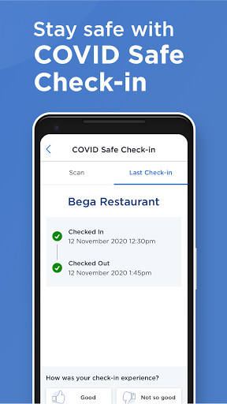
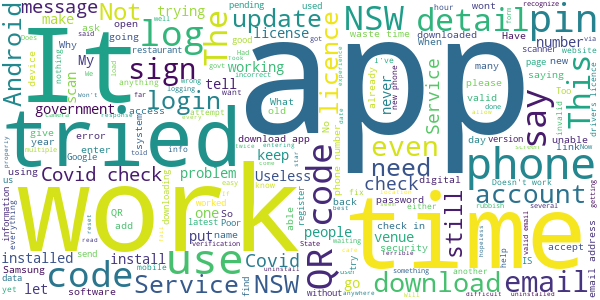

# Service NSW
App version ``4.32.1 (181861)``

Analyzed with [covid-apps-observer](http://github.com/covid-apps-observer) project, version ``0.1``

## App overview
| | |
|-------------------------|-------------------------| 
| **Name**&nbsp;&nbsp;&nbsp;&nbsp;&nbsp;&nbsp;&nbsp;&nbsp;&nbsp;&nbsp;&nbsp;&nbsp;&nbsp;&nbsp;&nbsp;&nbsp;&nbsp;&nbsp;&nbsp;&nbsp;&nbsp;&nbsp;&nbsp;&nbsp;&nbsp;&nbsp;&nbsp;&nbsp;&nbsp;&nbsp;&nbsp;&nbsp;&nbsp;&nbsp;&nbsp;&nbsp;&nbsp;&nbsp;&nbsp;&nbsp;  | Service NSW |
| **Unique identifier** | au.gov.nsw.service |
| **Link to Google Play** | [https://play.google.com/store/apps/details?id=au.gov.nsw.service](https://play.google.com/store/apps/details?id=au.gov.nsw.service) |
| **Summary**  | Digital licences, registrations, fines and more |
| **Privacy policy** | [http://www.service.nsw.gov.au/privacy](http://www.service.nsw.gov.au/privacy) |
| **Latest version** | 4.32.1 (181861) |
| **Last update** | 2021-01-06 06:40:18 |
| **Recent changes** | Sorry about the bugs! Thanks for reporting them. We&#39;ve made this fix and are working on the rest:  • Fixed a bug where the check-in venue was sometimes showing as a previous venue |
| **Installs**  | 1,000,000+ |
| **Category** | Tools |
| **First release** | Dec 7, 2014 |
| **Size**  | 25M |
| **Supported Android version**  | 6.0 and up |

### Description
> The official Service NSW app, making it easier to access government services. 
 <b>Digital licences and credentials</b>
 Access the following digital licences and credentials, with more to come: 
 • Driver Licence 
 • RSA/RCG Competency Card 
 • Working with Children Check 
 • Recreational Fishing Licence 
 • Boat Driver Licence.
 <b>COVID Safe Check-in</b> 
 • Quick, contactless check in at COVID Safe venues 
 • Point your device camera at the COVID Safe QR Code to get started 
 • Save your details for a faster check in next time. 
 <b>Useful tools and services</b>
 • Verify a Digital Driver Licence via our licence checker 
 • Check or renew a registration 
 • Sign into licensed venues.
 <b>Fines and demerits</b>
 • View and pay your fines 
 • View your demerits.
 <b>COVID-19 resources</b>
 • Access COVID-19 statistics by postcode 
 • Access our COVID-19 Assistance Finder with benefits, rebates and concessions. 
 <b>Tell us what you think</b>
 • Help us help you! We’re always working on a better, stronger, faster app. 
 • Share what you’d like to see in the app: we use your feedback to continuously improve the app experience.

### User interface
The developers of the app provide the following screenshots in the Google play store.
| | | |
|:-------------------------:|:-------------------------:|:-------------------------:|
 |   |   |   | 
 |   |  

## Development team
In the following we report the main information provided by the development team in the Google play store.

| | |
|-------------------------|-------------------------|
| **Developer**  | Service NSW |
| **Website**  | [https://www.service.nsw.gov.au/mobile-app      ](https://www.service.nsw.gov.au/mobile-app      ) |
| **Email** | mobileapp@service.nsw.gov.au |
| **Physical address**  | - |
| **Other developed apps**  | [https://play.google.com/store/apps/developer?id=Service+NSW](https://play.google.com/store/apps/developer?id=Service+NSW) |

## Android support

| | |
|-------------------------|-------------------------|
| **Declared target Android version**  | Android10, version 10 (API level 29) |
| **Effective target Android version**  | Android10, version 10 (API level 29) |
| **Minimum supported Android version**  | Marshmallow, version 6.0 (API level 23) |
| **Maximum target Android version**  | - |

The larger the difference between the minimum and maximum supported Android versions, the better. A larger difference means a wider audience. For example, old phones have a very low Android version, so a high minimum supported Android version means that the app cannot be used by users with old phones, thus leading to accessibility problems. 

## Requested permissions

In the following we report the complete list of the permissions requested by the app. 

| **Permission** | **Protection level** | **Description** | 
|-------------------------|-------------------------|-------------------------|
 **android.permission ACCESS_NETWORK_STATE** | Normal | Allows applications to access information about networks. 
 **android.permission ACCESS_WIFI_STATE** | Normal | Allows applications to access information about Wi-Fi networks. 
 **android.permission CAMERA** | :warning:**Dangerous** | Required to be able to access the camera device. 
 **android.permission INTERNET** | Normal | Allows applications to open network sockets. 
 **android.permission READ_APP_BADGE** | - | - 
 **android.permission READ_EXTERNAL_STORAGE** | :warning:**Dangerous** | Allows an application to read from external storage. 
 **android.permission USE_FINGERPRINT** | Normal | This constant was deprecated in API level 28. Applications should request USE_BIOMETRIC instead 
 **android.permission VIBRATE** | Normal | Allows access to the vibrator. 
 **android.permission WAKE_LOCK** | Normal | Allows using PowerManager WakeLocks to keep processor from sleeping or screen from dimming. 
 **android.permission WRITE_EXTERNAL_STORAGE** | :warning:**Dangerous** | Allows an application to write to external storage. 
 **com.anddoes.launcher.permission UPDATE_COUNT** | - | - 
 **com.android.vending CHECK_LICENSE** | - | - 
 **com.google.android.c2dm.permission RECEIVE** | - | - 
 **com.google.android.finsky.permission BIND_GET_INSTALL_REFERRER_SERVICE** | - | - 
 **com.htc.launcher.permission READ_SETTINGS** | - | - 
 **com.htc.launcher.permission UPDATE_SHORTCUT** | - | - 
 **com.huawei.android.launcher.permission CHANGE_BADGE** | - | - 
 **com.huawei.android.launcher.permission READ_SETTINGS** | - | - 
 **com.huawei.android.launcher.permission WRITE_SETTINGS** | - | - 
 **com.majeur.launcher.permission UPDATE_BADGE** | - | - 
 **com.oppo.launcher.permission READ_SETTINGS** | - | - 
 **com.oppo.launcher.permission WRITE_SETTINGS** | - | - 
 **com.sec.android.provider.badge.permission READ** | - | - 
 **com.sec.android.provider.badge.permission WRITE** | - | - 
 **com.sonyericsson.home.permission BROADCAST_BADGE** | - | - 
 **com.sonymobile.home.permission PROVIDER_INSERT_BADGE** | - | - 
 **me.everything.badger.permission BADGE_COUNT_READ** | - | - 
 **me.everything.badger.permission BADGE_COUNT_WRITE** | - | - 

## Mentioned servers

| **Server** | **Registrant** | **Registrant country** | **Creation date** | 
|-------------------------|-------------------------|-------------------------|-------------------------|
 | apache.org | The Apache Software Foundation | :us: US | 1995-04-11 04:00:00 |
 | xml.org | OASIS Open | :us: US | 1997-02-03 05:00:00 |
 | w3.org | W3C | :us: US | 1994-07-06 04:00:00 |
 | purl.org | Internet Archive | :us: US | 1996-01-01 05:00:00 |
 | adobe.com | Adobe Inc. | :us: US | 1986-11-17 05:00:00 |
 | android.com | Google LLC | :us: US | 1997-06-23 04:00:00 |
 | googlesyndication.com | Google LLC | :us: US | 2003-01-21 06:17:24 |
 | google.com | Google LLC | :us: US | 1997-09-15 04:00:00 |
 | app-measurement.com | Google LLC | :us: US | 2015-06-19 20:13:31 |
 | googleapis.com | Google LLC | :us: US | 2005-01-25 17:52:26 |
 | googleapis.com | Google LLC | :us: US | 2005-01-25 17:52:26 |
 | iptc.org | Whois Privacy Service | :us: US | 1995-12-27 05:00:00 |
 | useplus.org | PLUS COALITION | :us: US | 2003-11-18 19:31:25 |
 | npes.org | NPES | :us: US | 1996-01-30 05:00:00 |
 | aiim.org | Association for Information and Image Management International | :us: US | 1995-10-18 04:00:00 |
 | googleapis.com | Google LLC | :us: US | 2005-01-25 17:52:26 |
 | googleapis.com | Google LLC | :us: US | 2005-01-25 17:52:26 |
 | googleadservices.com | Google LLC | :us: US | 2003-06-19 16:34:53 |

## Security analysis 

Below we report the main security warnings raised by our execution of the [Androwarn](https://github.com/maaaaz/androwarn) security analysis tool.

**Telephony identifiers leakage**
> - This application reads the numeric name (MCC+MNC) of current registered operator 
> - This application reads the operator name 
> - This application reads the phone number string for line 1, for example, the MSISDN for a GSM phone 
> - This application reads the unique device ID, i.e the IMEI for GSM and the MEID or ESN for CDMA phones 

**Location lookup**
> - This application reads location information from all available providers (WiFi, GPS etc.) 

**Connection interfaces exfiltration**
> - This application reads details about the currently active data network 
> - This application tries to find out if the currently active data network is metered 

**Audio video eavesdropping**
> - This application records audio from the 'CAMCORDER' source  
> - This application records audio from the 'MIC' source  
> - This application captures video from the 'CAMERA' source 
> - This application captures video from the 'SURFACE' source 

**Suspicious connection establishment**
> - This application opens a Socket and connects it to the remote address '' on the 'N/A' port  
> - This application opens a Socket and connects it to the remote address 'Ljava/lang/StringBuilder;->toString()Ljava/lang/String;' on the ': connect, resolve' port  
> - This application opens a Socket and connects it to the remote address 'Ljava/lang/StringBuilder;->toString()Ljava/lang/String;' on the 'N/A' port  
> - This application opens a Socket and connects it to the remote address 'Ljava/net/Proxy;->type()Ljava/net/Proxy$Type;' on the 'N/A' port  
> - This application opens a Socket and connects it to the remote address 'Network subsystem is unavailable' on the 'N/A' port  
> - This application opens a Socket and connects it to the remote address 'timeout' on the 'N/A' port  

**Pim data leakage**
> - This application accesses data stored in the clipboard 

**Code execution**
> - This application loads a native library 
> - This application loads a native library: 'Ljava/util/Iterator;->next()Ljava/lang/Object;' 
> - This application loads a native library: 'log' 
> - This application loads a native library: 'sentry' 
> - This application loads a native library: 'sentry-android' 
> - This application loads a native library: 'tool-checker' 
> - This application executes a UNIX command 

## User ratings and reviews

Below we provide information about how end users are reacting to the app in terms of ratings and reviews in the Google Play store.

### Ratings

The Service NSW app has been installed by more than **1000000** times. At this time, **4453** rated the app and its average score is **3.9433107**. Below we show the distribution of the ratings across the usual star-based rating of Google Play

:star::star::star::star::star:: 2535

:star::star::star::star:: 702

:star::star::star:: 328

:star::star:: 207

:star:: 681

### Reviews 

#### 5-star reviews

> 5 stars for the app, easy, convenient, etc, great app. One critisism though...I have two Service nsw logins, personal and my company, there is no way to switch users! I hsave resorted to uninstalling & reinstalling every time I have to use the other. Please fix or tell me I am a duffa & doing something wrong?  :date: __2021-01-09 04:40:12__

> Reliable  :date: __2021-01-08 20:49:47__

> Very good  :date: __2021-01-08 05:47:30__

> Works well. But put Covid logon at top of screen since this is what I use most. Common sense.  :date: __2021-01-07 23:46:28__

> Successfully logged in! Got few text message verification code now. Thanks developer team, good on you.  :date: __2021-01-07 23:19:25__

> Working fine for me! S10 Android 10  :date: __2021-01-07 21:33:37__

> Good when it works  :date: __2021-01-07 05:55:51__

> Because We Have No Choice  :date: __2021-01-06 12:02:59__

> App works seamlessly.. Including ease of COVID check-in/out.  :date: __2021-01-06 00:10:46__

> I agree with the masks rule & wear a mask at church, in supermarkets, shopping malls etc. I visited 2 nearby malls today. At Southgate Sylvania, all adults & most children were wearing masks. I later visited Westfield Miranda & numerous older people, male and female had masks slung under their noses, some with both mouth & nose uncovered. NO idea what good they thought the masks were worn in this way! Please publicise & warn people that this is NOT correct wearing of masks.  :date: __2021-01-04 09:29:56__

#### 4-star reviews

> Good  :date: __2021-01-08 05:31:18__

> It works, just a suggestion can you trigger a push notification to remind us to check out from the last place we visit for the government to perform a better and more accurate contact tracing?  :date: __2021-01-08 00:55:24__

> Good  :date: __2021-01-06 22:15:18__

> Nice app, if you can add a covid check-in widget/shortcut, that would be great.  :date: __2021-01-06 06:36:47__

> Not real easy to use  :date: __2021-01-05 23:51:57__

> Good  :date: __2021-01-05 00:01:14__

> For covid check-ins, can the app please remember the details of my dependents? I'm always checking in myself and my child and usually my wife, and it remembers / supplies my details, but not those of my family, so I'm always re-entering their details. Ideally it would have a check list of previously added dependents, where I could just tick their names to add when checking in. Ideally this information would be stored locally on the device, not on the server, for privacy.  :date: __2021-01-04 07:17:27__

> Good app. I suggest for the covid check in an option to save your dependants. If I'm shopping and have my kids with me, everytime I enter a store I have to add them individually, an option to click on their saved names would make it so much faster and I could get in and out faster.  :date: __2021-01-04 04:52:33__

> Can't wait to use this app  :date: __2021-01-02 01:49:03__

> Excellent  :date: __2020-12-30 07:06:36__

#### 3-star reviews

> Bug that kept meaning alway checking in to a previous venue was very dangerous. GLAD IT WAS FIXED on 5 January, however should advise users urgently to update their version  :date: __2021-01-09 01:39:17__

> when i check in to any place it wont let me add a dependant  :date: __2021-01-08 07:45:55__

> Most of the time it works fine and is simple to use, but sometimes it refuses to log in and other times refuses to register the QR code (and I am talking about the specific service NSW codes)  :date: __2021-01-07 22:59:59__

> When it works, it works well. I wish the Covid Checkin function had store and forward when there is no mobile connectivity. Connectivity in places like Woodenbong non-existent, and couldn't use it  :date: __2021-01-07 11:27:39__

> Covid check in not working this arvo. 2 places unable to check in since 12pm  :date: __2021-01-07 05:09:25__

> I'm doing my best to check in and out every time I go somewhere but the app just stopped working (again) today. All I get is a message saying "an error has occurred. Please try again." No way to recover my PIN or password, just in case I typed them incorrectly. Tried to uninstall and reinstall with no results...  :date: __2021-01-07 04:06:43__

> A problem has occurred please try again later. I've just used the app to check-in when I went to a restaurant for lunch and no problem. And now I'm trying to log in again to check out but it keeps saying "A problem has occurred please try again later." My colleague tried his and he managed to log in with the app. Is there anyone experienced the same thing?  :date: __2021-01-07 03:19:34__

> Foursome reson it's now not letting me sign in with my pin  :date: __2021-01-07 03:02:03__

> I like the app, but lately it is checking me into the previous place when I scan in.  :date: __2021-01-07 01:14:36__

> It's too much information  :date: __2021-01-06 11:29:53__

#### 2-star reviews

> I've downloaded the app but it does not show on the page on my mobile. So I've got to go to App Store all the time to log in.  :date: __2021-01-09 06:02:13__

> Needs more enhancement  :date: __2021-01-09 03:44:16__

> App won't let me log in after last update. suggests there is an issue with my app or device, and refers me to service nsw gov au slash non-standard-software Decided is play certified, and there are no detected issued when scanning with the play protect in the play store. Can only check in as a guest. Kogan Agora xs, running android 8.1.0  :date: __2021-01-09 01:23:19__

> I have tried to use the app several times at the supermarket and coffee shops and it say not working at the moment try again later  :date: __2021-01-08 13:07:22__

> Couldn't use CovidSafe check in on multiple attempts, as verification code/s to mobile took ~1 hour to arrive (after shop closed) - signal wasn't an issue. Not sure if this is an app problem or somewhere else in Service NSW's system, but its most important function needs to properly work.  :date: __2021-01-07 08:02:03__

> Went to a Cafe in Yass today. Tried at least 10 times to log in and use the app. It failed every time. Wouldn't even accept my 4 digit pin. Not very happy. Had to do the old way...grrr!!!!  :date: __2021-01-07 07:35:24__

> I cant even download the app it just keeps saying pending have been trying all day.was using it before then it didnt work so I uninstalled and tried to re install no luck what shoild I do  :date: __2021-01-07 06:40:01__

> I cant long in to my account  :date: __2021-01-07 05:02:17__

> Loads to slow after loging in with the pin  :date: __2021-01-07 04:50:23__

> Generally good, but won't save one of my checkouts, so it looks like I have signed into a Lithgow venue every day, so must checkout again before I can check in elsewhere. Went once for lunch when passing through town. Pretty bothersome.  :date: __2021-01-07 04:32:18__

#### 1-star reviews

> Have tried for 3 days to download app - ANY BLOODY APP. Will NOT operate!!  :date: __2021-01-09 08:48:40__

> App is garbage, does not work properly on anything other than Apple or Samsung.  :date: __2021-01-09 06:21:11__

> I went to open my app to show my licence and found a new page look. I put my 4 digit passcode and didn't work.  :date: __2021-01-09 05:38:58__

> Been trying to download this app on my phone for day but just keeps saying pending. Did it in few minutes on my Ipad. So annoying.  :date: __2021-01-08 08:12:43__

> Poor wont except my Gmail account  :date: __2021-01-08 07:58:06__

> I have an older Samsung phone which will not support the service nsw app. So to go for a swim in my local pool i have to buy a new phone! !!!  :date: __2021-01-08 05:23:45__

> Can't get it to work. Insists upon my registering for other services and won't simply allow me to use the QR  :date: __2021-01-08 03:40:39__

> This app was clearly written by s 12 year old child. It is rubbish. UPDATE: The app's update does not appear to keep account pin details. You cannot access the app without the pin. I had to delete the app and reinstall it just to be able to log in.  :date: __2021-01-08 02:56:51__

> The covid check in just doesn't work. It won't retrieve my saved details but it also wont let me re-enter them, so I've had to uninstall it and use something else.  :date: __2021-01-08 02:25:32__

> My husband and I both downloaded the app to use, but everywhere we tried to use it kept refusing to accept our details. We went to Service NSW at Tweed Heads South today and spent the best part of an hour trying to get this rectified with absolutely no success. We kept getting a message that a code would be sent, but nothing came through for either of us. When you're in your 70s and attempting to do the right thing and the technology doesn't allow it what is one supposed to do. The suggestion that we get another phone was not at all helpful. If we can't get this fixed at the source what is the alternative?  :date: __2021-01-08 01:28:53__

