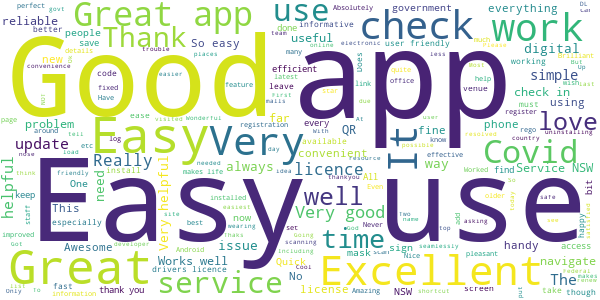
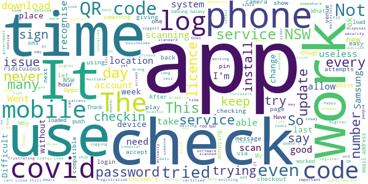

# Service NSW
App version ``4.32.1 (181861)``

Analyzed with [covid-apps-observer](http://github.com/covid-apps-observer) project, version ``0.1``

## App overview
| | |
|-------------------------|-------------------------| 
| **Name**                                          | Service NSW |
| **Unique identifier** | au.gov.nsw.service |
| **Link to Google Play** | [https://play.google.com/store/apps/details?id=au.gov.nsw.service](https://play.google.com/store/apps/details?id=au.gov.nsw.service) |
| **Summary**  | Digital licences, registrations, fines and more |
| **Privacy policy** | [http://www.service.nsw.gov.au/privacy](http://www.service.nsw.gov.au/privacy) |
| **Latest version** | 4.32.1 (181861) |
| **Last update** | 2021-01-06 06:40:18 |
| **Recent changes** | Sorry about the bugs! Thanks for reporting them. We&#39;ve made this fix and are working on the rest:  • Fixed a bug where the check-in venue was sometimes showing as a previous venue |
| **Installs**  | 1,000,000+ |
| **Category** | Tools |
| **First release** | Dec 7, 2014 |
| **Size**  | 25M |
| **Supported Android version**  | 6.0 and up |

### Description
> The official Service NSW app, making it easier to access government services. 
 <b>Digital licences and credentials</b>
 Access the following digital licences and credentials, with more to come: 
 • Driver Licence 
 • RSA/RCG Competency Card 
 • Working with Children Check 
 • Recreational Fishing Licence 
 • Boat Driver Licence.
 <b>COVID Safe Check-in</b> 
 • Quick, contactless check in at COVID Safe venues 
 • Point your device camera at the COVID Safe QR Code to get started 
 • Save your details for a faster check in next time. 
 <b>Useful tools and services</b>
 • Verify a Digital Driver Licence via our licence checker 
 • Check or renew a registration 
 • Sign into licensed venues.
 <b>Fines and demerits</b>
 • View and pay your fines 
 • View your demerits.
 <b>COVID-19 resources</b>
 • Access COVID-19 statistics by postcode 
 • Access our COVID-19 Assistance Finder with benefits, rebates and concessions. 
 <b>Tell us what you think</b>
 • Help us help you! We’re always working on a better, stronger, faster app. 
 • Share what you’d like to see in the app: we use your feedback to continuously improve the app experience.

### User interface
The developers of the app provide the following screenshots in the Google play store.
| | | |
|:-------------------------:|:-------------------------:|:-------------------------:|
 |   |   |   | 
 |   |  

## Development team
In the following we report the main information provided by the development team in the Google play store.

| | |
|-------------------------|-------------------------|
| **Developer**  | Service NSW |
| **Website**  | [https://www.service.nsw.gov.au/mobile-app      ](https://www.service.nsw.gov.au/mobile-app      ) |
| **Email** | mobileapp@service.nsw.gov.au |
| **Physical address**  | - |
| **Other developed apps**  | [https://play.google.com/store/apps/developer?id=Service+NSW](https://play.google.com/store/apps/developer?id=Service+NSW) |

## Android support

| | |
|-------------------------|-------------------------|
| **Declared target Android version**  | Android10, version 10 (API level 29) |
| **Effective target Android version**  | Android10, version 10 (API level 29) |
| **Minimum supported Android version**  | Marshmallow, version 6.0 (API level 23) |
| **Maximum target Android version**  | - |

The larger the difference between the minimum and maximum supported Android versions, the better. A larger difference means a wider audience. For example, old phones have a very low Android version, so a high minimum supported Android version means that the app cannot be used by users with old phones, thus leading to accessibility problems. 

## Requested permissions

In the following we report the complete list of the permissions requested by the app. 

| **Permission** | **Protection level** | **Description** | 
|-------------------------|-------------------------|-------------------------|
 **android.permission ACCESS_NETWORK_STATE** | Normal | Allows applications to access information about networks. 
 **android.permission ACCESS_WIFI_STATE** | Normal | Allows applications to access information about Wi-Fi networks. 
 **android.permission CAMERA** | :warning:**Dangerous** | Required to be able to access the camera device. 
 **android.permission INTERNET** | Normal | Allows applications to open network sockets. 
 **android.permission READ_APP_BADGE** | - | - 
 **android.permission READ_EXTERNAL_STORAGE** | :warning:**Dangerous** | Allows an application to read from external storage. 
 **android.permission USE_FINGERPRINT** | Normal | This constant was deprecated in API level 28. Applications should request USE_BIOMETRIC instead 
 **android.permission VIBRATE** | Normal | Allows access to the vibrator. 
 **android.permission WAKE_LOCK** | Normal | Allows using PowerManager WakeLocks to keep processor from sleeping or screen from dimming. 
 **android.permission WRITE_EXTERNAL_STORAGE** | :warning:**Dangerous** | Allows an application to write to external storage. 
 **com.anddoes.launcher.permission UPDATE_COUNT** | - | - 
 **com.android.vending CHECK_LICENSE** | - | - 
 **com.google.android.c2dm.permission RECEIVE** | - | - 
 **com.google.android.finsky.permission BIND_GET_INSTALL_REFERRER_SERVICE** | - | - 
 **com.htc.launcher.permission READ_SETTINGS** | - | - 
 **com.htc.launcher.permission UPDATE_SHORTCUT** | - | - 
 **com.huawei.android.launcher.permission CHANGE_BADGE** | - | - 
 **com.huawei.android.launcher.permission READ_SETTINGS** | - | - 
 **com.huawei.android.launcher.permission WRITE_SETTINGS** | - | - 
 **com.majeur.launcher.permission UPDATE_BADGE** | - | - 
 **com.oppo.launcher.permission READ_SETTINGS** | - | - 
 **com.oppo.launcher.permission WRITE_SETTINGS** | - | - 
 **com.sec.android.provider.badge.permission READ** | - | - 
 **com.sec.android.provider.badge.permission WRITE** | - | - 
 **com.sonyericsson.home.permission BROADCAST_BADGE** | - | - 
 **com.sonymobile.home.permission PROVIDER_INSERT_BADGE** | - | - 
 **me.everything.badger.permission BADGE_COUNT_READ** | - | - 
 **me.everything.badger.permission BADGE_COUNT_WRITE** | - | - 

## Mentioned servers

| **Server** | **Registrant** | **Registrant country** | **Creation date** | 
|-------------------------|-------------------------|-------------------------|-------------------------|
 | apache.org | The Apache Software Foundation | :us: US | 1995-04-11 04:00:00 |
 | xml.org | OASIS Open | :us: US | 1997-02-03 05:00:00 |
 | w3.org | W3C | :us: US | 1994-07-06 04:00:00 |
 | purl.org | Internet Archive | :us: US | 1996-01-01 05:00:00 |
 | adobe.com | Adobe Inc. | :us: US | 1986-11-17 05:00:00 |
 | android.com | Google LLC | :us: US | 1997-06-23 04:00:00 |
 | googlesyndication.com | Google LLC | :us: US | 2003-01-21 06:17:24 |
 | google.com | Google LLC | :us: US | 1997-09-15 04:00:00 |
 | app-measurement.com | Google LLC | :us: US | 2015-06-19 20:13:31 |
 | googleapis.com | Google LLC | :us: US | 2005-01-25 17:52:26 |
 | googleapis.com | Google LLC | :us: US | 2005-01-25 17:52:26 |
 | iptc.org | Whois Privacy Service | :us: US | 1995-12-27 05:00:00 |
 | useplus.org | PLUS COALITION | :us: US | 2003-11-18 19:31:25 |
 | npes.org | NPES | :us: US | 1996-01-30 05:00:00 |
 | aiim.org | Association for Information and Image Management International | :us: US | 1995-10-18 04:00:00 |
 | googleapis.com | Google LLC | :us: US | 2005-01-25 17:52:26 |
 | googleapis.com | Google LLC | :us: US | 2005-01-25 17:52:26 |
 | googleadservices.com | Google LLC | :us: US | 2003-06-19 16:34:53 |

## Security analysis 

Below we report the main security warnings raised by our execution of the [Androwarn](https://github.com/maaaaz/androwarn) security analysis tool.

**Telephony identifiers leakage**
> - This application reads the numeric name (MCC+MNC) of current registered operator 
> - This application reads the operator name 
> - This application reads the phone number string for line 1, for example, the MSISDN for a GSM phone 
> - This application reads the unique device ID, i.e the IMEI for GSM and the MEID or ESN for CDMA phones 

**Location lookup**
> - This application reads location information from all available providers (WiFi, GPS etc.) 

**Connection interfaces exfiltration**
> - This application reads details about the currently active data network 
> - This application tries to find out if the currently active data network is metered 

**Audio video eavesdropping**
> - This application records audio from the 'CAMCORDER' source  
> - This application records audio from the 'MIC' source  
> - This application captures video from the 'CAMERA' source 
> - This application captures video from the 'SURFACE' source 

**Suspicious connection establishment**
> - This application opens a Socket and connects it to the remote address '' on the 'N/A' port  
> - This application opens a Socket and connects it to the remote address 'Ljava/lang/StringBuilder;->toString()Ljava/lang/String;' on the ': connect, resolve' port  
> - This application opens a Socket and connects it to the remote address 'Ljava/lang/StringBuilder;->toString()Ljava/lang/String;' on the 'N/A' port  
> - This application opens a Socket and connects it to the remote address 'Ljava/net/Proxy;->type()Ljava/net/Proxy$Type;' on the 'N/A' port  
> - This application opens a Socket and connects it to the remote address 'Network subsystem is unavailable' on the 'N/A' port  
> - This application opens a Socket and connects it to the remote address 'timeout' on the 'N/A' port  

**Pim data leakage**
> - This application accesses data stored in the clipboard 

**Code execution**
> - This application loads a native library 
> - This application loads a native library: 'Ljava/util/Iterator;->next()Ljava/lang/Object;' 
> - This application loads a native library: 'log' 
> - This application loads a native library: 'sentry' 
> - This application loads a native library: 'sentry-android' 
> - This application loads a native library: 'tool-checker' 
> - This application executes a UNIX command 

## User ratings and reviews

Below we provide information about how end users are reacting to the app in terms of ratings and reviews in the Google Play store.

### Ratings

The Service NSW app has been installed by more than **1000000** times. At this time, **4453** rated the app and its average score is **3.9433107**. Below we show the distribution of the ratings across the usual star-based rating of Google Play

:star::star::star::star::star:: 2535

:star::star::star::star:: 702

:star::star::star:: 328

:star::star:: 207

:star:: 681

### Reviews 

#### 5-star reviews

> Ok  :date: __2021-01-15 20:59:01__

> Really good design. Easy to use and easy to navigate. I would love to see a QR check-in and license shortcut widget and long-press on app icon shortcuts implementated to save time since we are using it multiple times per day now days.  :date: __2021-01-15 07:25:37__

> Works great since the last update. It's very simple to check into places using the QR code, and is very convenient as a digital licence  :date: __2021-01-15 04:36:49__

> easy  :date: __2021-01-14 12:56:02__

> App is good.  :date: __2021-01-14 11:21:12__

> No issues.  :date: __2021-01-14 11:12:41__

> Wonderful  :date: __2021-01-14 09:02:48__

> Great app. Easy to use.  :date: __2021-01-14 07:18:02__

> I reported bud/ issues which are fixed by the developer. Service NSW app for Covid tracing is, as it should be, mandatory. Infinitely more reliable than the $-wasting Federal Govts LNP Covid App.  :date: __2021-01-14 01:55:28__

> Good  :date: __2021-01-13 09:40:42__

#### 4-star reviews

> App would be even better if the COVID section would let us save our dependents on it.  :date: __2021-01-16 08:59:56__

> I mean good app does what it's suppose to But since last update instead of opening app it takes me to the play store page Also suddenly it doesn't unlock with fingerprint Thought you fixed all the bugs 🤣  :date: __2021-01-15 10:10:24__

> Working now after the 3rd time installing.  :date: __2021-01-14 02:55:45__

> Sometimes drops facility to log in using fingerprint. Otherwise better experience than the private services  :date: __2021-01-14 01:30:30__

> Good  :date: __2021-01-12 22:09:54__

> I find the app very easy to use.  :date: __2021-01-12 21:20:10__

> Good  :date: __2021-01-12 21:04:44__

> Great app  :date: __2021-01-12 21:03:59__

> Works most of the time  :date: __2021-01-12 10:11:44__

> Works most of the time. Take screen shots x 2 of your licence in case of no service.  :date: __2021-01-12 08:56:58__

#### 3-star reviews

> Okay on my work phone but please make a version for older 32bit phones so I can use it on my own phone. What is so amazing about this app that it needs 64bit anyway?  :date: __2021-01-16 01:01:27__

> I think everything is more complicated than it really needs to be  :date: __2021-01-14 01:25:53__

> Re COVID: no idea if it works or not. How do ordinary people tell??  :date: __2021-01-13 21:06:29__

> App is fine for rego, licence etc but does not work for covid sign ins. Apparently a common problem for most. If you have this problem, uninstall the app and use the webform, it works the majority of the time  :date: __2021-01-12 21:55:35__

> Checking in/out of a location is ok. Suggestions: - Last checked in place was front an centre when you re-enter the app so you can click to check out. Time consuming and difficult to find the last check-in when you are in a rush. - Pre-set dependants during the checking in process. Very annoying to have to "add dependant" over and over again esp when you have kids with you. - Check in location/time/date history. To be able to go back and see if you have been in hotspot locations.  :date: __2021-01-12 11:12:37__

> Lost  :date: __2021-01-12 00:05:15__

> Covid option check in gone from app !  :date: __2021-01-11 23:48:19__

> We checked into a caravan park on Friday using the app over the weekend. Went to the club next-door for lunch on Saturday and checked in and out when we left. When we left the park on Sunday morning we had apparently been checked out on the app on Saturday 1.37pm. Same time we left the club. So app doesn't allow for a long term visit.  :date: __2021-01-11 22:13:38__

> Wonderful having this forced on us. Shame we can no longer go to the toilet without the government knowing. How about people who don't have or want internet on the phone? No longer allowed to go shopping?  :date: __2021-01-11 20:26:37__

> I think the app is great, however, many venues in northern rivers either do not use it or have a different system, which should not be the case!  :date: __2021-01-11 10:09:12__

#### 2-star reviews

> Pop-ups too small to read.  :date: __2021-01-16 00:47:09__

> Still has a bug with covid checkin. 3 times this week it has checked me in to my last check in place when I scan somewhere new. Not very accurate as a result.  :date: __2021-01-14 11:50:30__

> Mostly, the app works ok, BUT it doesn't remember your Covid-19 check-in if you minimise & then restore the app, Meaning that you have to check in again to be able to check out.  :date: __2021-01-14 03:23:16__

> Keep logging me to the wrong location  :date: __2021-01-14 02:50:23__

> Difficult to change password on a single mobile device without being able to close security code window  :date: __2021-01-14 01:10:40__

> QR codes at Coles and Kmart never work for me, even at multiple locations. Some bus QR codes don't work either. It gets frustrating and I wish there was a way to manually check in to a location on the app without requiring recognition of the QR code.  :date: __2021-01-13 01:28:02__

> Covid checking work about 60% if the time. With businesses thst use other qrs it's 100%. Also the government lied about giving millions in stimulus as it's only available on this app and less than half of the residents have the app and less can make it work.  :date: __2021-01-12 08:26:04__

> I can't log in, can't do anything as the app keeps telling me to add correct email address 👎  :date: __2021-01-12 07:23:30__

> Painful to use  :date: __2021-01-12 04:10:53__

> The app does let you log out sometimes  :date: __2021-01-12 01:17:41__

#### 1-star reviews

> I'm a Qld security guard. I shouldn't need a NSW licence to use your app to verify a NSW digital id when working in qld  :date: __2021-01-16 08:43:01__

> Cs is w  :date: __2021-01-16 04:29:11__

> Really frustrating getting this to work  :date: __2021-01-15 23:41:58__

> I can't log into venues with out a code. I done a code but still doesn't work. What is going going on. Ok  :date: __2021-01-15 23:05:34__

> Terrible! Where is covid reporting section?  :date: __2021-01-15 08:39:44__

> Useless for downloading the COVID check in QR code app  :date: __2021-01-15 06:25:04__

> Would not load. Tried multiple times  :date: __2021-01-15 05:45:21__

> Could be easier to use  :date: __2021-01-15 01:12:07__

> Was unable to downloud  :date: __2021-01-14 22:36:21__

> I installed the app but it won't open.  :date: __2021-01-14 19:58:52__

