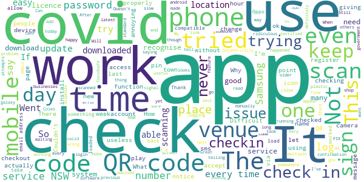

# Service NSW
App version ``4.34.0 (188984)``

Analyzed with [covid-apps-observer](http://github.com/covid-apps-observer) project, version ``0.1``

## App overview
| | |
|-------------------------|-------------------------| 
| **Name**                                          | Service NSW |
| **Unique identifier** | au.gov.nsw.service |
| **Link to Google Play** | [https://play.google.com/store/apps/details?id=au.gov.nsw.service](https://play.google.com/store/apps/details?id=au.gov.nsw.service) |
| **Summary**  | Digital licences, registrations, fines and more |
| **Privacy policy** | [http://www.service.nsw.gov.au/privacy](http://www.service.nsw.gov.au/privacy) |
| **Latest version** | 4.34.0 (188984) |
| **Last update** | 2021-01-22 03:46:14 |
| **Recent changes** | Thanks for using the Service NSW app! We used your feedback to make these improvements: • Save dependant details for a later check-in. Thank you for all your feedback, we have been working hard to deliver this improvement. Being able to edit and delete dependants will be coming soon. • Fixed a bug where the location was being trimmed on COVID Safe Check-in. • Improved messaging when something goes wrong. |
| **Installs**  | 1,000,000+ |
| **Category** | Tools |
| **First release** | Dec 7, 2014 |
| **Size**  | 27M |
| **Supported Android version**  | 6.0 and up |

### Description
> The official Service NSW app, making it easier to access government services. 
 <b>Digital licences and credentials</b>
 Access the following digital licences and credentials, with more to come: 
 • Driver Licence 
 • RSA/RCG Competency Card 
 • Working with Children Check 
 • Recreational Fishing Licence 
 • Boat Driver Licence.
 <b>COVID Safe Check-in</b> 
 • Quick, contactless check in at COVID Safe venues 
 • Point your device camera at the COVID Safe QR Code to get started 
 • Save your details for a faster check in next time. 
 <b>Useful tools and services</b>
 • Verify a Digital Driver Licence via our licence checker 
 • Check or renew a registration 
 • Sign into licensed venues.
 <b>Fines and demerits</b>
 • View and pay your fines 
 • View your demerits.
 <b>COVID-19 resources</b>
 • Access COVID-19 statistics by postcode 
 • Access our COVID-19 Assistance Finder with benefits, rebates and concessions. 
 <b>Tell us what you think</b>
 • Help us help you! We’re always working on a better, stronger, faster app. 
 • Share what you’d like to see in the app: we use your feedback to continuously improve the app experience.

### User interface
The developers of the app provide the following screenshots in the Google play store.
| | | |
|:-------------------------:|:-------------------------:|:-------------------------:|
 |   |   |   | 
 |   |  

## Development team
In the following we report the main information provided by the development team in the Google play store.

| | |
|-------------------------|-------------------------|
| **Developer**  | Service NSW |
| **Website**  | [https://www.service.nsw.gov.au/mobile-app      ](https://www.service.nsw.gov.au/mobile-app      ) |
| **Email** | mobileapp@service.nsw.gov.au |
| **Physical address**  | - |
| **Other developed apps**  | [https://play.google.com/store/apps/developer?id=Service+NSW](https://play.google.com/store/apps/developer?id=Service+NSW) |

## Android support

| | |
|-------------------------|-------------------------|
| **Declared target Android version**  | Android10, version 10 (API level 29) |
| **Effective target Android version**  | Android10, version 10 (API level 29) |
| **Minimum supported Android version**  | Marshmallow, version 6.0 (API level 23) |
| **Maximum target Android version**  | - |

The larger the difference between the minimum and maximum supported Android versions, the better. A larger difference means a wider audience. For example, old phones have a very low Android version, so a high minimum supported Android version means that the app cannot be used by users with old phones, thus leading to accessibility problems. 

## Requested permissions

In the following we report the complete list of the permissions requested by the app. 

| **Permission** | **Protection level** | **Description** | 
|-------------------------|-------------------------|-------------------------|
 **android.permission ACCESS_NETWORK_STATE** | Normal | Allows applications to access information about networks. 
 **android.permission ACCESS_WIFI_STATE** | Normal | Allows applications to access information about Wi-Fi networks. 
 **android.permission CAMERA** | :warning:**Dangerous** | Required to be able to access the camera device. 
 **android.permission INTERNET** | Normal | Allows applications to open network sockets. 
 **android.permission READ_APP_BADGE** | - | - 
 **android.permission READ_EXTERNAL_STORAGE** | :warning:**Dangerous** | Allows an application to read from external storage. 
 **android.permission USE_FINGERPRINT** | Normal | This constant was deprecated in API level 28. Applications should request USE_BIOMETRIC instead 
 **android.permission VIBRATE** | Normal | Allows access to the vibrator. 
 **android.permission WAKE_LOCK** | Normal | Allows using PowerManager WakeLocks to keep processor from sleeping or screen from dimming. 
 **android.permission WRITE_EXTERNAL_STORAGE** | :warning:**Dangerous** | Allows an application to write to external storage. 
 **com.anddoes.launcher.permission UPDATE_COUNT** | - | - 
 **com.android.vending CHECK_LICENSE** | - | - 
 **com.google.android.c2dm.permission RECEIVE** | - | - 
 **com.google.android.finsky.permission BIND_GET_INSTALL_REFERRER_SERVICE** | - | - 
 **com.htc.launcher.permission READ_SETTINGS** | - | - 
 **com.htc.launcher.permission UPDATE_SHORTCUT** | - | - 
 **com.huawei.android.launcher.permission CHANGE_BADGE** | - | - 
 **com.huawei.android.launcher.permission READ_SETTINGS** | - | - 
 **com.huawei.android.launcher.permission WRITE_SETTINGS** | - | - 
 **com.majeur.launcher.permission UPDATE_BADGE** | - | - 
 **com.oppo.launcher.permission READ_SETTINGS** | - | - 
 **com.oppo.launcher.permission WRITE_SETTINGS** | - | - 
 **com.sec.android.provider.badge.permission READ** | - | - 
 **com.sec.android.provider.badge.permission WRITE** | - | - 
 **com.sonyericsson.home.permission BROADCAST_BADGE** | - | - 
 **com.sonymobile.home.permission PROVIDER_INSERT_BADGE** | - | - 
 **me.everything.badger.permission BADGE_COUNT_READ** | - | - 
 **me.everything.badger.permission BADGE_COUNT_WRITE** | - | - 

## Mentioned servers

| **Server** | **Registrant** | **Registrant country** | **Creation date** | 
|-------------------------|-------------------------|-------------------------|-------------------------|
 | apache.org | The Apache Software Foundation | :us: US | 1995-04-11 04:00:00 |
 | xml.org | OASIS Open | :us: US | 1997-02-03 05:00:00 |
 | w3.org | W3C | :us: US | 1994-07-06 04:00:00 |
 | purl.org | Internet Archive | :us: US | 1996-01-01 05:00:00 |
 | adobe.com | Adobe Inc. | :us: US | 1986-11-17 05:00:00 |
 | android.com | Google LLC | :us: US | 1997-06-23 04:00:00 |
 | googlesyndication.com | Google LLC | :us: US | 2003-01-21 06:17:24 |
 | google.com | Google LLC | :us: US | 1997-09-15 04:00:00 |
 | app-measurement.com | Google LLC | :us: US | 2015-06-19 20:13:31 |
 | googleapis.com | Google LLC | :us: US | 2005-01-25 17:52:26 |
 | googleapis.com | Google LLC | :us: US | 2005-01-25 17:52:26 |
 | iptc.org | Whois Privacy Service | :us: US | 1995-12-27 05:00:00 |
 | useplus.org | PLUS COALITION | :us: US | 2003-11-18 19:31:25 |
 | npes.org | NPES | :us: US | 1996-01-30 05:00:00 |
 | aiim.org | Association for Information and Image Management International | :us: US | 1995-10-18 04:00:00 |
 | googleapis.com | Google LLC | :us: US | 2005-01-25 17:52:26 |
 | googleapis.com | Google LLC | :us: US | 2005-01-25 17:52:26 |
 | googleadservices.com | Google LLC | :us: US | 2003-06-19 16:34:53 |

## Security analysis 

Below we report the main security warnings raised by our execution of the [Androwarn](https://github.com/maaaaz/androwarn) security analysis tool.

**Telephony identifiers leakage**
> - This application reads the numeric name (MCC+MNC) of current registered operator 
> - This application reads the operator name 
> - This application reads the phone number string for line 1, for example, the MSISDN for a GSM phone 
> - This application reads the unique device ID, i.e the IMEI for GSM and the MEID or ESN for CDMA phones 

**Location lookup**
> - This application reads location information from all available providers (WiFi, GPS etc.) 

**Connection interfaces exfiltration**
> - This application reads details about the currently active data network 
> - This application tries to find out if the currently active data network is metered 

**Audio video eavesdropping**
> - This application records audio from the 'CAMCORDER' source  
> - This application records audio from the 'MIC' source  
> - This application captures video from the 'CAMERA' source 
> - This application captures video from the 'SURFACE' source 

**Suspicious connection establishment**
> - This application opens a Socket and connects it to the remote address '' on the 'N/A' port  
> - This application opens a Socket and connects it to the remote address 'Ljava/lang/StringBuilder;->toString()Ljava/lang/String;' on the ': connect, resolve' port  
> - This application opens a Socket and connects it to the remote address 'Ljava/lang/StringBuilder;->toString()Ljava/lang/String;' on the 'N/A' port  
> - This application opens a Socket and connects it to the remote address 'Ljava/net/Proxy;->type()Ljava/net/Proxy$Type;' on the 'N/A' port  
> - This application opens a Socket and connects it to the remote address 'Network subsystem is unavailable' on the 'N/A' port  
> - This application opens a Socket and connects it to the remote address 'timeout' on the 'N/A' port  

**Pim data leakage**
> - This application accesses data stored in the clipboard 

**Code execution**
> - This application loads a native library 
> - This application loads a native library: 'Ljava/util/Iterator;->next()Ljava/lang/Object;' 
> - This application loads a native library: 'log' 
> - This application loads a native library: 'sentry' 
> - This application loads a native library: 'sentry-android' 
> - This application loads a native library: 'tool-checker' 
> - This application executes a UNIX command 

## User ratings and reviews

Below we provide information about how end users are reacting to the app in terms of ratings and reviews in the Google Play store.

### Ratings

The Service NSW app has been installed by more than **1000000** times. At this time, **5318** rated the app and its average score is **4.0707765**. Below we show the distribution of the ratings across the usual star-based rating of Google Play

:star::star::star::star::star:: 3121

:star::star::star::star:: 941

:star::star::star:: 370

:star::star:: 285

:star:: 601

### Reviews 

#### 5-star reviews

> Very friendly and helpful staff quick service  :date: __2021-01-29 22:20:31__

> Fantastic App  :date: __2021-01-29 12:06:23__

> Good to see can save dependent information now. Also agree to put check in to the top of the screen or have an option to put it on the top.  :date: __2021-01-28 08:06:21__

> Love it keep it going no need for a licence in it wallet, we all in the future 2021 digital licence is of the future  :date: __2021-01-27 13:40:22__

> Love the dependant update, saves allot of time. I like how it was made mandatory on 1-jan as it is easier to use than than the web pages.  :date: __2021-01-27 06:20:31__

> Very useful and easy to use! Keep the cool features coming.  :date: __2021-01-27 04:50:42__

> Great app and use it very often with the covid19 as you need to sign in to most places that I go to. It holds my information so I needed to put it in once.  :date: __2021-01-26 02:39:37__

> Wonderful  :date: __2021-01-25 15:58:23__

> Good  :date: __2021-01-25 04:36:35__

> Great App. Love the digital license. Covid check in very easy.  :date: __2021-01-25 01:09:32__

#### 4-star reviews

> Overall not too bad, but given the number one use these days wiuld be covid checkin, surely this should be the easiest thing to access. Ability to customise a home screen like many other apps might be useful - or even a setting for users to define a default button to auto open. As a minimum it should be the top option on the existing layout.  :date: __2021-01-28 22:32:42__

> VERY EASY TO USE  :date: __2021-01-28 11:22:19__

> Pretty good. Once I'd set it up with my details on first use it's relatively painless. Just wish I could opt not to show "add dependent" cos I'm not gonna be having anyone with me that can't check in by themselves and it's irritating to have to remember to scroll past that to tap Check In.  :date: __2021-01-26 09:26:25__

> I was pleased with the app, however I have changed my mind. Going to the local supermarket thought I was smart and logged in. Ok it tells me you have logged in. well my ego was high looking at the app I didn't have my mobile number to easy soon change that Edit button phone entered. mmm that didn't happen. Sort it out at home on the BIG computer no worries all done properly. Went back to shop checking the mobile no mobile number. There is another way round this delete Service NSW app and reload to easy. Yeh right waiting waiting for the app to download not happening at 76 almost tired of this. So if you have suggestions be pleased to hear them.  :date: __2021-01-25 05:41:12__

> Fairly good all round. Minus one point for the COVID check out procedure. Checking in is super easy. 2/3 people forget to check out, this points to a major UX issue. Maybe a notification feature, that asks after X amount of time if you need to check out (similar to parking apps, which notifies when time is running out).  :date: __2021-01-24 13:34:45__

> I'm j. My kny  :date: __2021-01-24 02:29:39__

> Check in is easy  :date: __2021-01-23 11:42:33__

> Good  :date: __2021-01-23 05:24:25__

> Generally works well. However, some more improvements would be great: 1: face unlock for devices with this functionality to save typing in PIN for check-in and check-out. 2: move the COVID Safe Check-in higher up the screen for all OSs (surely these days the COVID check-in is more important and used far more often than checking your registration details!). 3: Status bar on top of other apps to remind you to checkout. Also, my Pixel 4XL camera doesn't open the app - time consuming and tedious!  :date: __2021-01-22 23:20:03__

> Tops  :date: __2021-01-22 21:58:40__

#### 3-star reviews

> Hello how can I install the app if it is not reconized by Google we can not see the point of buying new phones  :date: __2021-01-28 02:26:41__

> Pretty good  :date: __2021-01-18 23:04:43__

> Ok......but there should be a button for people with you without phones. That are not dependants!!!!  :date: __2021-01-18 23:01:26__

> Difficult where limited connectivity. Would be much more usable if you could save dependants, rather than having to type them in every single time.  :date: __2021-01-18 03:24:32__

> On Android, when attempting to enter the PIN, the text 'Forgot PIN' cannot be selected if font size is large. Have to change font size, login with email, set PIN, logout, reset font, then login with new PIN.  :date: __2021-01-17 22:28:06__

> Okay on my work phone but please make a version for older 32bit phones so I can use it on my own phone. What is so amazing about this app that it needs 64bit anyway?  :date: __2021-01-16 01:01:27__

> I think everything is more complicated than it really needs to be  :date: __2021-01-14 01:25:53__

> Re COVID: no idea if it works or not. How do ordinary people tell??  :date: __2021-01-13 21:06:29__

> App is fine for rego, licence etc but does not work for covid sign ins. Apparently a common problem for most. If you have this problem, uninstall the app and use the webform, it works the majority of the time  :date: __2021-01-12 21:55:35__

> Checking in/out of a location is ok. Suggestions: - Last checked in place was front an centre when you re-enter the app so you can click to check out. Time consuming and difficult to find the last check-in when you are in a rush. - Pre-set dependants during the checking in process. Very annoying to have to "add dependant" over and over again esp when you have kids with you. - Check in location/time/date history. To be able to go back and see if you have been in hotspot locations.  :date: __2021-01-12 11:12:37__

#### 2-star reviews

> Great  :date: __2021-01-28 23:00:25__

> Shocking experience trying to scan into most places. The thing keeps coming up saying there's an error. I'd expect that if the govt have made their qr code mandatory then it would work!!!  :date: __2021-01-22 05:33:09__

> Went out of town and tried signing in to places through their covid check in. Unfortunately, wherever I tried, it told me I was at one of the places I visited from my home town. Every. Time.  :date: __2021-01-21 23:22:43__

> There is a major issue with the COVID check-in feature for this app. When I scan a code at one venue, it automatically tries to check me in to the previous venue that I checked into, even if that was a few days ago. There is no screen telling you the venue the app assumes you're at until you actually check in. If I notice this has happened I immediatlely check out and scan again - but it's easy for this to slip past, particularly for venues which have unusual names such as a company name that does not match the business. If this problem occurs for others, it's likely that this app is registering thousands of incorrect checkins for people which will substantially impact contact tracing.  :date: __2021-01-18 22:54:04__

> How can I get it to work . Everything downloaded but will never scan .no one can tell me why  :date: __2021-01-18 07:36:37__

> How can I BBC uninstall the app as it hasn't downloaded properly. The app icon has not downloaded and I cannot access the Covid QR app  :date: __2021-01-17 23:25:11__

> Why do we have to sign in with the app and sign in with our club that is twice👎  :date: __2021-01-17 06:11:15__

> Covid check-in function keeps showing previous checked in venue rather than the current one at scan.  :date: __2021-01-16 02:14:35__

> Will not check in covid register  :date: __2021-01-16 01:55:49__

> Pop-ups too small to read.  :date: __2021-01-16 00:47:09__

#### 1-star reviews

> Complicated  :date: __2021-01-29 11:20:54__

> I can't get any further than "continue"  :date: __2021-01-29 10:25:28__

> Covid scan was a poor experience. 2 factor authentication and then you have to remember to check out after you leave the location. I'd like to see how that goes. Totally un-user friendly. Also I am fairly sure my credit card details popped up during set up. Need to check why that was the case.  :date: __2021-01-29 01:23:52__

> Nice if you could have it on your laptop. The never ending loop I have is a result of the fact that I have it placed on my mobile phone. I am informed that I can have it on this device. I beg to differ. An exercise in frustration.  :date: __2021-01-27 08:06:24__

> My wife is unable to install app as it's not compatible with her phone Please make it more accessible to those who don't have the latest technology She has not been able to access some shops as she cannot sign in  :date: __2021-01-26 11:28:41__

> Not working  :date: __2021-01-26 09:40:42__

> Anything run by corrupt, criminally conspiring, New World Order 'Government' Puppets!  :date: __2021-01-25 07:24:11__

> Absolutely atrocious. Can't login via password or pin, attempting to reset them produces an endless loop of the same screens or the buttons are entirely nonfunctional. Don't receive a link to reset my password or a one time code. Maybe it's for the best since this agency is obviously too incompetent to be trusted with tracking people.  :date: __2021-01-23 23:15:16__

> Rubbish. I already have a MyServiceNSW account, and it won't allow me to log in, but keeps coming up with a "check your connection" , but my connection is working to uninstall and reinstall the app several times to try and fix it. Should allow me to give rating of Zero. All permissions are enabled (camera & SD card access)  :date: __2021-01-23 04:35:23__

> Been trying to link my driver's licence for 8 months and every time the system is ''temporarily'' unavailable. The contact us button is a broken link and other methods of linking just lead to waiting for 3mins then a crash page.  :date: __2021-01-22 10:05:24__

