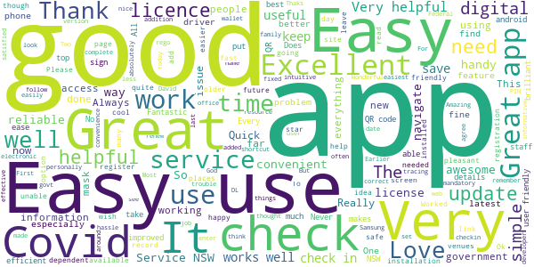
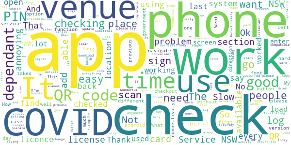
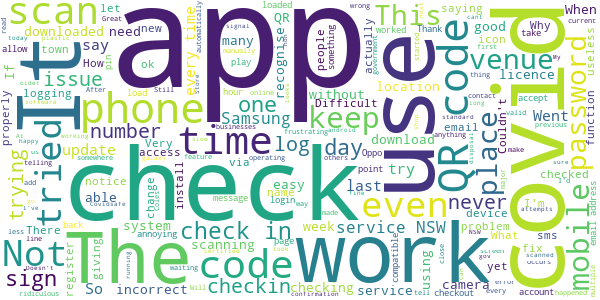
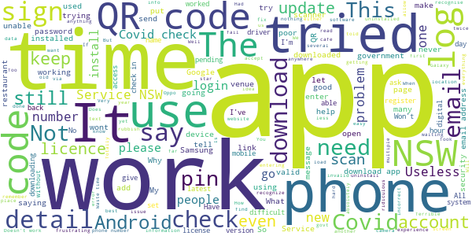

# Service NSW
App version ``4.36.0 (194097)``

Analyzed with [covid-apps-observer](http://github.com/covid-apps-observer) project, version ``0.1``

## App overview
| | |
|-------------------------|-------------------------| 
| **Name**&nbsp;&nbsp;&nbsp;&nbsp;&nbsp;&nbsp;&nbsp;&nbsp;&nbsp;&nbsp;&nbsp;&nbsp;&nbsp;&nbsp;&nbsp;&nbsp;&nbsp;&nbsp;&nbsp;&nbsp;&nbsp;&nbsp;&nbsp;&nbsp;&nbsp;&nbsp;&nbsp;&nbsp;&nbsp;&nbsp;&nbsp;&nbsp;&nbsp;&nbsp;&nbsp;&nbsp;&nbsp;&nbsp;&nbsp;&nbsp;  | Service NSW |
| **Unique identifier** | au.gov.nsw.service |
| **Link to Google Play** | [https://play.google.com/store/apps/details?id=au.gov.nsw.service](https://play.google.com/store/apps/details?id=au.gov.nsw.service) |
| **Summary**  | Digital licences, registrations, fines and more |
| **Privacy policy** | [http://www.service.nsw.gov.au/privacy](http://www.service.nsw.gov.au/privacy) |
| **Latest version** | 4.36.0 (194097) |
| **Last update** | 2021-02-02 07:53:29 |
| **Recent changes** | Thanks for using the Service NSW mobile app! We used your feedback to make these improvements: • Delete dependants you’ve saved for COVID Safe Check-in. • Added swipe gesture as a way to switch between tabs. • Enhancements to the security and performance of digital licences. |
| **Installs**  | 1,000,000+ |
| **Category** | Tools |
| **First release** | Dec 7, 2014 |
| **Size**  | 27M |
| **Supported Android version**  | 6.0 and up |

### Description
> The official Service NSW app, making it easier to access government services. 
 <b>Digital licences and credentials</b>
 Access the following digital licences and credentials, with more to come: 
 • Driver Licence 
 • RSA/RCG Competency Card 
 • Working with Children Check 
 • Recreational Fishing Licence 
 • Boat Driver Licence.
 <b>COVID Safe Check-in</b> 
 • Quick, contactless check in at COVID Safe venues 
 • Point your device camera at the COVID Safe QR Code to get started 
 • Save your details for a faster check in next time. 
 <b>Useful tools and services</b>
 • Verify a Digital Driver Licence via our licence checker 
 • Check or renew a registration 
 • Sign into licensed venues.
 <b>Fines and demerits</b>
 • View and pay your fines 
 • View your demerits.
 <b>COVID-19 resources</b>
 • Access COVID-19 statistics by postcode 
 • Access our COVID-19 Assistance Finder with benefits, rebates and concessions. 
 <b>Tell us what you think</b>
 • Help us help you! We’re always working on a better, stronger, faster app. 
 • Share what you’d like to see in the app: we use your feedback to continuously improve the app experience.

### User interface
The developers of the app provide the following screenshots in the Google play store.
| | | |
|:-------------------------:|:-------------------------:|:-------------------------:|
 |   |   |   | 
 |   |  

## Development team
In the following we report the main information provided by the development team in the Google play store.

| | |
|-------------------------|-------------------------|
| **Developer**  | Service NSW |
| **Website**  | [https://www.service.nsw.gov.au/mobile-app      ](https://www.service.nsw.gov.au/mobile-app      ) |
| **Email** | mobileapp@service.nsw.gov.au |
| **Physical address**  | - |
| **Other developed apps**  | [https://play.google.com/store/apps/developer?id=Service+NSW](https://play.google.com/store/apps/developer?id=Service+NSW) |

## Android support

| | |
|-------------------------|-------------------------|
| **Declared target Android version**  | Android10, version 10 (API level 29) |
| **Effective target Android version**  | Android10, version 10 (API level 29) |
| **Minimum supported Android version**  | Marshmallow, version 6.0 (API level 23) |
| **Maximum target Android version**  | - |

The larger the difference between the minimum and maximum supported Android versions, the better. A larger difference means a wider audience. For example, old phones have a very low Android version, so a high minimum supported Android version means that the app cannot be used by users with old phones, thus leading to accessibility problems. 

## Requested permissions

In the following we report the complete list of the permissions requested by the app. 

| **Permission** | **Protection level** | **Description** | 
|-------------------------|-------------------------|-------------------------|
 **android.permission ACCESS_NETWORK_STATE** | Normal | Allows applications to access information about networks. 
 **android.permission ACCESS_WIFI_STATE** | Normal | Allows applications to access information about Wi-Fi networks. 
 **android.permission CAMERA** | :warning:**Dangerous** | Required to be able to access the camera device. 
 **android.permission INTERNET** | Normal | Allows applications to open network sockets. 
 **android.permission READ_APP_BADGE** | - | - 
 **android.permission READ_EXTERNAL_STORAGE** | :warning:**Dangerous** | Allows an application to read from external storage. 
 **android.permission USE_FINGERPRINT** | Normal | This constant was deprecated in API level 28. Applications should request USE_BIOMETRIC instead 
 **android.permission VIBRATE** | Normal | Allows access to the vibrator. 
 **android.permission WAKE_LOCK** | Normal | Allows using PowerManager WakeLocks to keep processor from sleeping or screen from dimming. 
 **android.permission WRITE_EXTERNAL_STORAGE** | :warning:**Dangerous** | Allows an application to write to external storage. 
 **com.anddoes.launcher.permission UPDATE_COUNT** | - | - 
 **com.android.vending CHECK_LICENSE** | - | - 
 **com.google.android.c2dm.permission RECEIVE** | - | - 
 **com.google.android.finsky.permission BIND_GET_INSTALL_REFERRER_SERVICE** | - | - 
 **com.htc.launcher.permission READ_SETTINGS** | - | - 
 **com.htc.launcher.permission UPDATE_SHORTCUT** | - | - 
 **com.huawei.android.launcher.permission CHANGE_BADGE** | - | - 
 **com.huawei.android.launcher.permission READ_SETTINGS** | - | - 
 **com.huawei.android.launcher.permission WRITE_SETTINGS** | - | - 
 **com.majeur.launcher.permission UPDATE_BADGE** | - | - 
 **com.oppo.launcher.permission READ_SETTINGS** | - | - 
 **com.oppo.launcher.permission WRITE_SETTINGS** | - | - 
 **com.sec.android.provider.badge.permission READ** | - | - 
 **com.sec.android.provider.badge.permission WRITE** | - | - 
 **com.sonyericsson.home.permission BROADCAST_BADGE** | - | - 
 **com.sonymobile.home.permission PROVIDER_INSERT_BADGE** | - | - 
 **me.everything.badger.permission BADGE_COUNT_READ** | - | - 
 **me.everything.badger.permission BADGE_COUNT_WRITE** | - | - 

## Mentioned servers

| **Server** | **Registrant** | **Registrant country** | **Creation date** | 
|-------------------------|-------------------------|-------------------------|-------------------------|
 | apache.org | The Apache Software Foundation | :us: US | 1995-04-11 04:00:00 |
 | xml.org | OASIS Open | :us: US | 1997-02-03 05:00:00 |
 | w3.org | W3C | :us: US | 1994-07-06 04:00:00 |
 | purl.org | Internet Archive | :us: US | 1996-01-01 05:00:00 |
 | adobe.com | Adobe Inc. | :us: US | 1986-11-17 05:00:00 |
 | android.com | Google LLC | :us: US | 1997-06-23 04:00:00 |
 | googlesyndication.com | Google LLC | :us: US | 2003-01-21 06:17:24 |
 | google.com | Google LLC | :us: US | 1997-09-15 04:00:00 |
 | app-measurement.com | Google LLC | :us: US | 2015-06-19 20:13:31 |
 | googleapis.com | Google LLC | :us: US | 2005-01-25 17:52:26 |
 | googleapis.com | Google LLC | :us: US | 2005-01-25 17:52:26 |
 | iptc.org | Whois Privacy Service | :us: US | 1995-12-27 05:00:00 |
 | useplus.org | PLUS COALITION | :us: US | 2003-11-18 19:31:25 |
 | npes.org | NPES | :us: US | 1996-01-30 05:00:00 |
 | aiim.org | Association for Information and Image Management International | :us: US | 1995-10-18 04:00:00 |
 | googleapis.com | Google LLC | :us: US | 2005-01-25 17:52:26 |
 | googleapis.com | Google LLC | :us: US | 2005-01-25 17:52:26 |
 | googleadservices.com | Google LLC | :us: US | 2003-06-19 16:34:53 |

## Security analysis 

Below we report the main security warnings raised by our execution of the [Androwarn](https://github.com/maaaaz/androwarn) security analysis tool.

**Telephony identifiers leakage**
> - This application reads the numeric name (MCC+MNC) of current registered operator 
> - This application reads the operator name 
> - This application reads the phone number string for line 1, for example, the MSISDN for a GSM phone 
> - This application reads the unique device ID, i.e the IMEI for GSM and the MEID or ESN for CDMA phones 

**Location lookup**
> - This application reads location information from all available providers (WiFi, GPS etc.) 

**Connection interfaces exfiltration**
> - This application reads details about the currently active data network 
> - This application tries to find out if the currently active data network is metered 

**Audio video eavesdropping**
> - This application records audio from the 'CAMCORDER' source  
> - This application records audio from the 'MIC' source  
> - This application captures video from the 'CAMERA' source 
> - This application captures video from the 'SURFACE' source 

**Suspicious connection establishment**
> - This application opens a Socket and connects it to the remote address '' on the 'N/A' port  
> - This application opens a Socket and connects it to the remote address 'Ljava/lang/StringBuilder;->toString()Ljava/lang/String;' on the ': connect, resolve' port  
> - This application opens a Socket and connects it to the remote address 'Ljava/lang/StringBuilder;->toString()Ljava/lang/String;' on the 'N/A' port  
> - This application opens a Socket and connects it to the remote address 'Ljava/net/Proxy;->type()Ljava/net/Proxy$Type;' on the 'N/A' port  
> - This application opens a Socket and connects it to the remote address 'Network subsystem is unavailable' on the 'N/A' port  
> - This application opens a Socket and connects it to the remote address 'timeout' on the 'N/A' port  

**Pim data leakage**
> - This application accesses data stored in the clipboard 

**Code execution**
> - This application loads a native library 
> - This application loads a native library: 'Ljava/util/Iterator;->next()Ljava/lang/Object;' 
> - This application loads a native library: 'log' 
> - This application loads a native library: 'sentry' 
> - This application loads a native library: 'sentry-android' 
> - This application loads a native library: 'tool-checker' 
> - This application executes a UNIX command 

## User ratings and reviews

Below we provide information about how end users are reacting to the app in terms of ratings and reviews in the Google Play store.

### Ratings

The Service NSW app has been installed by more than **1000000** times. At this time, **5462** rated the app and its average score is **4.0515065**. Below we show the distribution of the ratings across the usual star-based rating of Google Play

:star::star::star::star::star:: 3196

:star::star::star::star:: 945

:star::star::star:: 387

:star::star:: 276

:star:: 658

### Reviews 

#### 5-star reviews

> Very glad they included the capability to save dependents for future COVID checkins. It used to be such a hassle to have to keep reentering the same information over and over again.  :date: __2021-02-06 11:07:17__

> Good app. Noissues  :date: __2021-02-06 01:42:06__

> It's super handy and easy to use.  :date: __2021-02-05 01:19:09__

> Handy and convenient access to Service NSW services.  :date: __2021-02-05 00:37:14__

> Fantastic, easy to use, great idea having covid sign in and digital license , fantstic !well done !  :date: __2021-02-04 14:29:53__

> Qick and easy to use  :date: __2021-02-04 04:33:54__

> The QR Code check in and out feature works fine when its correct use is explained. I personally would prefer that it be intuitive and remember, and show, the last check in when you choose that feature.  :date: __2021-02-04 02:59:21__

> Great app to have. Saves you carrying your driver's licence and makes it so easy to check in  :date: __2021-02-04 02:45:59__

> Love it  :date: __2021-02-03 22:50:42__

> Excellent  :date: __2021-02-03 09:39:33__

#### 4-star reviews

> When checking in with covid safe repeatedly instructed to try again later???  :date: __2021-02-06 05:47:19__

> It's a great app slot better than the Canberra check-in app  :date: __2021-02-05 19:16:05__

> Good most of the time, except when it signs itself out. Also hard to work in council library.  :date: __2021-02-05 06:27:42__

> Good  :date: __2021-02-04 03:09:15__

> I could give 5/5 stars if I could press and hold the COVID icon to move it to the top of the screen so I wouldn't have to scroll down everytime I have to use this most frequenty used app.  :date: __2021-02-02 09:30:37__

> Good, but should be combined with another so automatically generated in and out time, wasted too long to scan especially when phone get hit up.  :date: __2021-02-01 18:44:09__

> Pretty easy to work out. Wish the covid check in was higher on the toolbar.. app seems to be using a lot of battery life. On my Samsung s9.  :date: __2021-01-31 09:59:46__

> Overall not too bad, but given the number one use these days wiuld be covid checkin, surely this should be the easiest thing to access. Ability to customise a home screen like many other apps might be useful - or even a setting for users to define a default button to auto open. As a minimum it should be the top option on the existing layout.  :date: __2021-01-28 22:32:42__

> VERY EASY TO USE  :date: __2021-01-28 11:22:19__

> Pretty good. Once I'd set it up with my details on first use it's relatively painless. Just wish I could opt not to show "add dependent" cos I'm not gonna be having anyone with me that can't check in by themselves and it's irritating to have to remember to scroll past that to tap Check In.  :date: __2021-01-26 09:26:25__

#### 3-star reviews

> Cooks my s10e  :date: __2021-02-06 02:41:31__

> It would be good if you could put the app into "COVID mode" where as soon as it loads and you enter your PIN it's onto the QR code scanning screen instead of having to navigate to the scan QR code screen.  :date: __2021-02-04 12:02:26__

> Good, however low stars because some licences not included including Shooters Licence. What's the point if its not complete?  :date: __2021-02-03 09:47:39__

> Would have given it a higher rating but does not have support for Duck Duck Go browser for payments. Not all of us want to be spied on by big tech  :date: __2021-02-03 02:20:11__

> I agree with previous reviews. Should have the ability to say what function is immediate (covid in my case). Also the check out function is a dog's breakfast. Other covid apps, there's the checkout button when opening phone. This one it's PIN (why not offer checkout instead or first), navigate, no I don't want scan I want to checkout. Could I confirm that? Oh, I did all that navigating by mistake? Takes 8 keystrokes/navigates when one should do. What's the stat's on people checking out - 1%?  :date: __2021-02-01 01:34:06__

> Digital licence and other services work well. The Covid check in and out process should be smooth but on my phone it keeps checking into places I have been to weeks before rather than the venue I am checking into. It is so frustrating  :date: __2021-01-31 03:40:02__

> Only got this because the service NSW QR code became compulsory for all venues. Will sometimes check me in to a venue I was at 3 days ago when I scan the QR code for a very different venue. And I cannot manually change the venue  :date: __2021-01-30 20:55:35__

> Pretty good  :date: __2021-01-18 23:04:43__

> Ok......but there should be a button for people with you without phones. That are not dependants!!!!  :date: __2021-01-18 23:01:26__

> Difficult where limited connectivity. Would be much more usable if you could save dependants, rather than having to type them in every single time.  :date: __2021-01-18 03:24:32__

#### 2-star reviews

> Logged me out. The app keeps saying incorrect password yet logging in online it works. It's since the app has started using qr for covid logins. When I press forgot password it's not sending anything to my email to fix it. Very frustrating  :date: __2021-02-05 04:36:48__

> When I use my camera to scan the covid check in QR code and check in without first opening the app, it keeps re-checking me into the last place I was at and not the current place. Once this occurs I can't undo the incorrect check in. This is a major problem in how the app is operating for the last few weeks and will produce incorrect data for contact tracers so is quite concerning.  :date: __2021-02-04 21:12:32__

> Great  :date: __2021-01-28 23:00:25__

> Shocking experience trying to scan into most places. The thing keeps coming up saying there's an error. I'd expect that if the govt have made their qr code mandatory then it would work!!!  :date: __2021-01-22 05:33:09__

> Went out of town and tried signing in to places through their covid check in. Unfortunately, wherever I tried, it told me I was at one of the places I visited from my home town. Every. Time.  :date: __2021-01-21 23:22:43__

> There is a major issue with the COVID check-in feature for this app. When I scan a code at one venue, it automatically tries to check me in to the previous venue that I checked into, even if that was a few days ago. There is no screen telling you the venue the app assumes you're at until you actually check in. If I notice this has happened I immediatlely check out and scan again - but it's easy for this to slip past, particularly for venues which have unusual names such as a company name that does not match the business. If this problem occurs for others, it's likely that this app is registering thousands of incorrect checkins for people which will substantially impact contact tracing.  :date: __2021-01-18 22:54:04__

> How can I get it to work . Everything downloaded but will never scan .no one can tell me why  :date: __2021-01-18 07:36:37__

> How can I BBC uninstall the app as it hasn't downloaded properly. The app icon has not downloaded and I cannot access the Covid QR app  :date: __2021-01-17 23:25:11__

> Why do we have to sign in with the app and sign in with our club that is twice👎  :date: __2021-01-17 06:11:15__

> Covid check-in function keeps showing previous checked in venue rather than the current one at scan.  :date: __2021-01-16 02:14:35__

#### 1-star reviews

> Can't login to the app but can online? Reset my password 4 tims thinking it was me but confirmed new password online but app it won't recognise! Waste of time really.  :date: __2021-02-06 13:33:42__

> The app jams my phone, messaging. mucks up my keyboard, and my phone won't charge properly. After I uninstall app my phone works without any hitches. Conceot of the app is good, but functionality is bad.  :date: __2021-02-06 03:41:40__

> Will not register me  :date: __2021-02-05 02:28:48__

> Latest update does not work with Android 11. QR log in no longer works - useless  :date: __2021-02-04 21:43:31__

> This app is disgraceful. Absolutely frustrating I downloaded it and worked fine the first time I used it now it won't allow me to sign in saying please enter a valid email address ffs it's the same email i first logged in with and the only email I've ever had. You try and do the right thing and have to deal with this absolute rubbish. How the hell are the elderly expected to use the app?  :date: __2021-02-04 11:56:06__

> It doesn't work  :date: __2021-02-04 09:24:24__

> Can't login to app. Everytime I type in my correct login details, an error message keeps popping up saying "It looks like your device may be using non-standard software". It use to work fine but then one day it stopped working. I have tried certifying my device via Google but still won't certify. I need to use the app when I check into places.  :date: __2021-02-03 08:22:03__

> Cannot sign up. Scan code, add details. App sends a text code. Go to split screen to copy the code. Return to the app and all my details are wiped. Rubbish.  :date: __2021-02-02 04:25:55__

> Forced control  :date: __2021-02-02 02:40:18__

> Ever since I updated the app on my Samsung Galaxy Note 9. I can no longer log on. It constantly informs me that my phone is not supported and will not log me in Terrible app.  :date: __2021-02-01 11:03:56__

