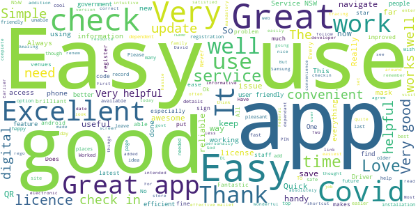
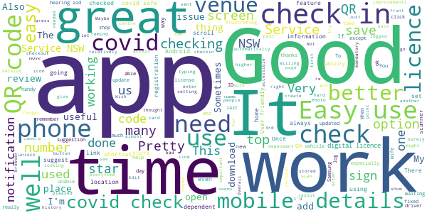
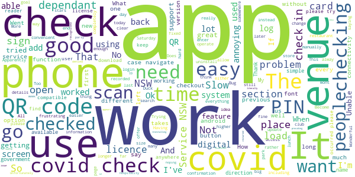
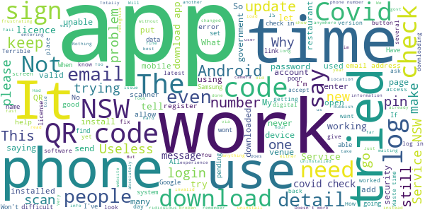

# Service NSW
App version ``4.37.0 (196398)``

Analyzed with [covid-apps-observer](http://github.com/covid-apps-observer) project, version ``0.1``

## App overview
| | |
|-------------------------|-------------------------| 
| **Name**&nbsp;&nbsp;&nbsp;&nbsp;&nbsp;&nbsp;&nbsp;&nbsp;&nbsp;&nbsp;&nbsp;&nbsp;&nbsp;&nbsp;&nbsp;&nbsp;&nbsp;&nbsp;&nbsp;&nbsp;&nbsp;&nbsp;&nbsp;&nbsp;&nbsp;&nbsp;&nbsp;&nbsp;&nbsp;&nbsp;&nbsp;&nbsp;&nbsp;&nbsp;&nbsp;&nbsp;&nbsp;&nbsp;&nbsp;&nbsp;  | Service NSW |
| **Unique identifier** | au.gov.nsw.service |
| **Link to Google Play** | [https://play.google.com/store/apps/details?id=au.gov.nsw.service](https://play.google.com/store/apps/details?id=au.gov.nsw.service) |
| **Summary**  | Digital licences, registrations, fines and more |
| **Privacy policy** | [http://www.service.nsw.gov.au/privacy](http://www.service.nsw.gov.au/privacy) |
| **Latest version** | 4.37.0 (196398) |
| **Last update** | 2021-02-12 05:03:30 |
| **Recent changes** | Introducing Dine &amp; Discover NSW vouchers, being trialled in The Rocks and Broken Hill areas. If you live near The Rocks and Broken Hill, you&#39;ll soon be able to apply for Dine &amp; Discover NSW vouchers on the website, display the vouchers in the app and redeem them at participating venues across NSW. |
| **Installs**  | 1,000,000+ |
| **Category** | Tools |
| **First release** | Dec 7, 2014 |
| **Size**  | 27M |
| **Supported Android version**  | 6.0 and up |

### Description
> The official Service NSW app, making it easier to access government services. 
 <b>Digital licences and credentials</b>
 Access the following digital licences and credentials, with more to come: 
 • Driver Licence 
 • RSA/RCG Competency Card 
 • Working with Children Check 
 • Recreational Fishing Licence 
 • Boat Driver Licence.
 <b>COVID Safe Check-in</b> 
 • Quick, contactless check in at COVID Safe venues 
 • Point your device camera at the COVID Safe QR Code to get started 
 • Save your details for a faster check in next time. 
 <b>Useful tools and services</b>
 • Verify a Digital Driver Licence via our licence checker 
 • Check or renew a registration 
 • Sign into licensed venues.
 <b>Fines and demerits</b>
 • View and pay your fines 
 • View your demerits.
 <b>COVID-19 resources</b>
 • Access COVID-19 statistics by postcode 
 • Access our COVID-19 Assistance Finder with benefits, rebates and concessions. 
 <b>Tell us what you think</b>
 • Help us help you! We’re always working on a better, stronger, faster app. 
 • Share what you’d like to see in the app: we use your feedback to continuously improve the app experience.

### User interface
The developers of the app provide the following screenshots in the Google play store.
| | | |
|:-------------------------:|:-------------------------:|:-------------------------:|
 |   |   |   | 
 |   |  

## Development team
In the following we report the main information provided by the development team in the Google play store.

| | |
|-------------------------|-------------------------|
| **Developer**  | Service NSW |
| **Website**  | [https://www.service.nsw.gov.au/mobile-app      ](https://www.service.nsw.gov.au/mobile-app      ) |
| **Email** | mobileapp@service.nsw.gov.au |
| **Physical address**  | - |
| **Other developed apps**  | [https://play.google.com/store/apps/developer?id=Service+NSW](https://play.google.com/store/apps/developer?id=Service+NSW) |

## Android support

| | |
|-------------------------|-------------------------|
| **Declared target Android version**  | Android10, version 10 (API level 29) |
| **Effective target Android version**  | Android10, version 10 (API level 29) |
| **Minimum supported Android version**  | Marshmallow, version 6.0 (API level 23) |
| **Maximum target Android version**  | - |

The larger the difference between the minimum and maximum supported Android versions, the better. A larger difference means a wider audience. For example, old phones have a very low Android version, so a high minimum supported Android version means that the app cannot be used by users with old phones, thus leading to accessibility problems. 

## Requested permissions

In the following we report the complete list of the permissions requested by the app. 

| **Permission** | **Protection level** | **Description** | 
|-------------------------|-------------------------|-------------------------|
 **android.permission ACCESS_NETWORK_STATE** | Normal | Allows applications to access information about networks. 
 **android.permission ACCESS_WIFI_STATE** | Normal | Allows applications to access information about Wi-Fi networks. 
 **android.permission CAMERA** | :warning:**Dangerous** | Required to be able to access the camera device. 
 **android.permission INTERNET** | Normal | Allows applications to open network sockets. 
 **android.permission READ_APP_BADGE** | - | - 
 **android.permission READ_EXTERNAL_STORAGE** | :warning:**Dangerous** | Allows an application to read from external storage. 
 **android.permission USE_FINGERPRINT** | Normal | This constant was deprecated in API level 28. Applications should request USE_BIOMETRIC instead 
 **android.permission VIBRATE** | Normal | Allows access to the vibrator. 
 **android.permission WAKE_LOCK** | Normal | Allows using PowerManager WakeLocks to keep processor from sleeping or screen from dimming. 
 **android.permission WRITE_EXTERNAL_STORAGE** | :warning:**Dangerous** | Allows an application to write to external storage. 
 **com.anddoes.launcher.permission UPDATE_COUNT** | - | - 
 **com.android.vending CHECK_LICENSE** | - | - 
 **com.google.android.c2dm.permission RECEIVE** | - | - 
 **com.google.android.finsky.permission BIND_GET_INSTALL_REFERRER_SERVICE** | - | - 
 **com.htc.launcher.permission READ_SETTINGS** | - | - 
 **com.htc.launcher.permission UPDATE_SHORTCUT** | - | - 
 **com.huawei.android.launcher.permission CHANGE_BADGE** | - | - 
 **com.huawei.android.launcher.permission READ_SETTINGS** | - | - 
 **com.huawei.android.launcher.permission WRITE_SETTINGS** | - | - 
 **com.majeur.launcher.permission UPDATE_BADGE** | - | - 
 **com.oppo.launcher.permission READ_SETTINGS** | - | - 
 **com.oppo.launcher.permission WRITE_SETTINGS** | - | - 
 **com.sec.android.provider.badge.permission READ** | - | - 
 **com.sec.android.provider.badge.permission WRITE** | - | - 
 **com.sonyericsson.home.permission BROADCAST_BADGE** | - | - 
 **com.sonymobile.home.permission PROVIDER_INSERT_BADGE** | - | - 
 **me.everything.badger.permission BADGE_COUNT_READ** | - | - 
 **me.everything.badger.permission BADGE_COUNT_WRITE** | - | - 

## Mentioned servers

| **Server** | **Registrant** | **Registrant country** | **Creation date** | 
|-------------------------|-------------------------|-------------------------|-------------------------|
 | apache.org | The Apache Software Foundation | :us: US | 1995-04-11 04:00:00 |
 | xml.org | OASIS Open | :us: US | 1997-02-03 05:00:00 |
 | w3.org | W3C | :us: US | 1994-07-06 04:00:00 |
 | purl.org | Internet Archive | :us: US | 1996-01-01 05:00:00 |
 | adobe.com | Adobe Inc. | :us: US | 1986-11-17 05:00:00 |
 | android.com | Google LLC | :us: US | 1997-06-23 04:00:00 |
 | googlesyndication.com | Google LLC | :us: US | 2003-01-21 06:17:24 |
 | google.com | Google LLC | :us: US | 1997-09-15 04:00:00 |
 | app-measurement.com | Google LLC | :us: US | 2015-06-19 20:13:31 |
 | googleapis.com | Google LLC | :us: US | 2005-01-25 17:52:26 |
 | googleapis.com | Google LLC | :us: US | 2005-01-25 17:52:26 |
 | iptc.org | Whois Privacy Service | :us: US | 1995-12-27 05:00:00 |
 | useplus.org | PLUS COALITION | :us: US | 2003-11-18 19:31:25 |
 | npes.org | NPES | :us: US | 1996-01-30 05:00:00 |
 | aiim.org | Association for Information and Image Management International | :us: US | 1995-10-18 04:00:00 |
 | googleapis.com | Google LLC | :us: US | 2005-01-25 17:52:26 |
 | googleapis.com | Google LLC | :us: US | 2005-01-25 17:52:26 |
 | googleadservices.com | Google LLC | :us: US | 2003-06-19 16:34:53 |

## Security analysis 

Below we report the main security warnings raised by our execution of the [Androwarn](https://github.com/maaaaz/androwarn) security analysis tool.

**Telephony identifiers leakage**
> - This application reads the numeric name (MCC+MNC) of current registered operator 
> - This application reads the operator name 
> - This application reads the phone number string for line 1, for example, the MSISDN for a GSM phone 
> - This application reads the unique device ID, i.e the IMEI for GSM and the MEID or ESN for CDMA phones 

**Location lookup**
> - This application reads location information from all available providers (WiFi, GPS etc.) 

**Connection interfaces exfiltration**
> - This application reads details about the currently active data network 
> - This application tries to find out if the currently active data network is metered 

**Audio video eavesdropping**
> - This application records audio from the 'CAMCORDER' source  
> - This application records audio from the 'MIC' source  
> - This application captures video from the 'CAMERA' source 
> - This application captures video from the 'SURFACE' source 

**Suspicious connection establishment**
> - This application opens a Socket and connects it to the remote address '' on the 'N/A' port  
> - This application opens a Socket and connects it to the remote address 'Ljava/lang/StringBuilder;->toString()Ljava/lang/String;' on the ': connect, resolve' port  
> - This application opens a Socket and connects it to the remote address 'Ljava/lang/StringBuilder;->toString()Ljava/lang/String;' on the 'N/A' port  
> - This application opens a Socket and connects it to the remote address 'Ljava/net/Proxy;->type()Ljava/net/Proxy$Type;' on the 'N/A' port  
> - This application opens a Socket and connects it to the remote address 'Network subsystem is unavailable' on the 'N/A' port  
> - This application opens a Socket and connects it to the remote address 'timeout' on the 'N/A' port  

**Pim data leakage**
> - This application accesses data stored in the clipboard 

**Code execution**
> - This application loads a native library 
> - This application loads a native library: 'Ljava/util/Iterator;->next()Ljava/lang/Object;' 
> - This application loads a native library: 'log' 
> - This application loads a native library: 'sentry' 
> - This application loads a native library: 'sentry-android' 
> - This application loads a native library: 'tool-checker' 
> - This application executes a UNIX command 

## User ratings and reviews

Below we provide information about how end users are reacting to the app in terms of ratings and reviews in the Google Play store.

### Ratings

The Service NSW app has been installed by more than **1000000** times. At this time, **5538** rated the app and its average score is **4.0333033**. Below we show the distribution of the ratings across the usual star-based rating of Google Play

:star::star::star::star::star:: 3211

:star::star::star::star:: 942

:star::star::star:: 418

:star::star:: 294

:star:: 673

### Reviews 

#### 5-star reviews

> Very good  :date: __2021-02-13 16:55:33__

> Drivers licence Covid check-in and soon to have trade cards. Works extremely well.  :date: __2021-02-13 11:00:25__

> The app is excellent and works very well. Simple, easy to use and works as intended.  :date: __2021-02-12 12:35:08__

> Easy to use and efficient app!  :date: __2021-02-12 07:20:08__

> A good app to have  :date: __2021-02-11 07:15:52__

> Great app works well  :date: __2021-02-09 15:13:18__

> Register your name at venues you visit? Easy to use.  :date: __2021-02-09 04:26:20__

> User friendly and Convenient  :date: __2021-02-09 00:00:59__

> Covid Check Ins... Will bump to 5 stars if you release an update to store/autofill First/Last/Phone for all dependants. I have a big family ;) Update... You did it. Thanks! Rating up to 5  :date: __2021-02-08 23:15:22__

> Greet  :date: __2021-02-08 02:33:04__

#### 4-star reviews

> Easy to use and convenient.  :date: __2021-02-12 10:46:28__

> 2 improvements needed - icon in notification area to show you are signed in, and ability to review history for comparison against alerts  :date: __2021-02-11 17:00:08__

> Many of us forget to sign out when leaving shop etc. Sometimes the app won't let us sign out of we have been awhile. Could I suggest constant GPS tracking for those willing to participate?  :date: __2021-02-09 07:35:27__

> Works well now, once you can do renewals without redirect to a browser it will be a great app.  :date: __2021-02-09 01:39:22__

> Easy to use  :date: __2021-02-08 08:36:42__

> If the QR reader in the App does not work with Android 11, you need to clear the cache and restart your phone. Once you get past this frustration, this is a great app.  :date: __2021-02-08 00:25:28__

> Good  :date: __2021-02-07 00:29:37__

> Thanks for updating the "add dependant" section. Suggestions: - Last checked in place was front an centre when you re-enter the app so you can click to check out. - Check in location/time/date history. To be able to go back and see if you have been in hotspot locations.  :date: __2021-02-06 23:45:04__

> When checking in with covid safe repeatedly instructed to try again later???  :date: __2021-02-06 05:47:19__

> It's a great app slot better than the Canberra check-in app  :date: __2021-02-05 19:16:05__

#### 3-star reviews

> Checking in appears to work just fine including providing a confirmation that I'm checked in, but... When I go to check out, the check in feature has restarted and no check in was recorded. I've tried reinstalling the app and still have this issue, the rest of the app is great. The covid check in feature literally does not work. The UX could use some work also, if i've recently checked in somewhere and then I open the app, it should open up to the check out page.  :date: __2021-02-13 03:26:43__

> Mostly good at what it should do. The Covid check-in dad been moved to the app allowing you to scan a business' barcode. However, when the app is sent to the background, upon resumption the app's forgotten you've just checked in and brings up the confirmation of details screen again. If you proceed here, the app then checks you in again to the place you had just checked in at. Trying to check out is just as painful as once the app resumes, it again wants to check you in. It all works backwards  :date: __2021-02-12 02:47:57__

> Unable to load digital copy of recreational fishing licence  :date: __2021-02-11 21:23:01__

> Having trouble getting some basic information  :date: __2021-02-10 02:10:39__

> Does what it needs to. With all the covid check-in I do, would be faster & easier if the covid check in feature was an app on its own.  :date: __2021-02-09 11:15:27__

> Can you please support face unlock?  :date: __2021-02-08 08:34:21__

> Checking in is easy enough but when you go to check out, it's back to the check-in part of the app.  :date: __2021-02-07 07:25:48__

> Cooks my s10e  :date: __2021-02-06 02:41:31__

> It would be good if you could put the app into "COVID mode" where as soon as it loads and you enter your PIN it's onto the QR code scanning screen instead of having to navigate to the scan QR code screen.  :date: __2021-02-04 12:02:26__

> Good, however low stars because some licences not included including Shooters Licence. What's the point if its not complete?  :date: __2021-02-03 09:47:39__

#### 2-star reviews

> Says "cannot verify phone number" and then does nothing. However, I am somewhat relieved that this terribly-programmed app fails at its task of facilitating gross government overreach and invasion of privacy so for that it gets an extra star.  :date: __2021-02-13 02:24:57__

> Where is facial recognition login?!!  :date: __2021-02-12 11:02:11__

> You know, the covid check-in option should be at the top of the page, front and centre! I shouldn't have to scroll down past fishing licence applications to get there. Academic right now because I keep being told that I can't check in right now. Edit: not sure I understand the advice - when I use the app to scan the barcode, am I not already using the in-app device? Thanks for the additonal feedback. I can confirm the problem I am having (for the last couple of check-ins) is within the device - I have only tried the external option as an alternative, which is also failing.  :date: __2021-02-10 23:40:47__

> Sometimes hard to log in and forgets your details. 15mins to log in for COVID is a bit excessive. Typical buggy app. Why do you have to authenticate for COVID check in, probably the requirement from a meeting of halfwitts. Thanks for your useless reply, you have obviously never used the app. Thanks for removing your useless reply. Has your development team heard of beta testing your app in a real world situation before releasing it.  :date: __2021-02-10 04:11:39__

> If this app and PayPal would just communicate, that would help...  :date: __2021-02-08 03:19:07__

> Cant scan covid scan first time ok now cant  :date: __2021-02-07 11:03:32__

> In-app feedback doesn't work. Of course not, who really wants pesky feedback from real users. So to the developers: this app could be much better but until you fix the feedback mechanism it will continue to be "meh" at best because we can't report all its annoying faults.  :date: __2021-02-06 23:10:07__

> Logged me out. The app keeps saying incorrect password yet logging in online it works. It's since the app has started using qr for covid logins. When I press forgot password it's not sending anything to my email to fix it. Very frustrating  :date: __2021-02-05 04:36:48__

> When I use my camera to scan the covid check in QR code and check in without first opening the app, it keeps re-checking me into the last place I was at and not the current place. Once this occurs I can't undo the incorrect check in. This is a major problem in how the app is operating for the last few weeks and will produce incorrect data for contact tracers so is quite concerning.  :date: __2021-02-04 21:12:32__

> Great  :date: __2021-01-28 23:00:25__

#### 1-star reviews

> Wow now I can't even login shows error ? Yet I can login to website no probs :(  :date: __2021-02-13 14:03:47__

> Samsung S9 I open and register with no problem. I open my shopping list (Google Keep) without closing the Services app and complete my shopping. I then try to switch to Services app and find it closed itself in the background. A number of times I was unaware of the need to check out due to that. With the app closing itself, check out requires I log in again, bring up the non-completed record and check out. That's inconvenient and, as I said already, a number of times I was unaware of the need to check out. Warn the user. Keep the app open until the user deliberately closes it. UPDATE: My Opinion hasn't changed. I want to use it because it gives me control but the Covid component is the source of much frustration. I like data off to preserve battery. If I forget to switch mobile data on before trying to register, I can't simply reverse out, switch on mobile data and start the app again. It remains unwilling to log me on. I failed to notice for a long time a link below the check out button would allow me to manually enter a time. Why not two buttons? Chats with other people indicate they are similarly frustrated by the app. If I watch, not a lot of people use it when entering places that have the QR code display. This includes people who have seen me log in. Overall. It takes too much time to achieve what should be fast log in and fast log out. I understand the need to have a drivers licence protected by other than phone security. It doesn't makes sense to frustrate people who would like to use the Covid component. Why not have components that require more security in a section that logs out quickly and the rest in a section that allows users to hold it open SO THE APP IS VISIBLE WHEN THEY LOOK AT THEIR SCREEN AND THEY DON'T FORGET TO LOG OUT. Sorry, getting frustrated here. If it is not improved soon I will join the hoards of people who don't bother  :date: __2021-02-13 01:21:09__

> Rubbish App, was Ok now No. Still trying to log me out of a doctors surgery from last Monday. Was at a pub Fri, 12 logged in ok could not log out.  :date: __2021-02-12 04:36:57__

> Very poor. Says I can't use app to log in.  :date: __2021-02-11 09:17:38__

> Just download this after reading about nsw dining vouchers to be sent to those with this app. Im trying this app out... Entered my rego number on "check rego" page.... Nothing. How can they send me vouchers where I can't find where to register... How do they know who. I am? It looks very amateurish  :date: __2021-02-10 23:19:16__

> What happened to fine and demerit point check like the buttons not even their anymore  :date: __2021-02-08 23:09:34__

> Covid checkin on Android often checks you into the previous place you checked in to. Serious flaw. Test this properly.  :date: __2021-02-08 10:13:03__

> terrible. .why bother? takes way too long to download. stay home instead..ruining business! ...there goes the economy  :date: __2021-02-08 04:48:31__

> So how many people live near The Rocks AND Broken Hill? Why not just contact the one politician who fits the description directly. Should you be programming if AND/OR confuses you?  :date: __2021-02-08 02:42:26__

> Doesnt work  :date: __2021-02-07 17:03:54__

