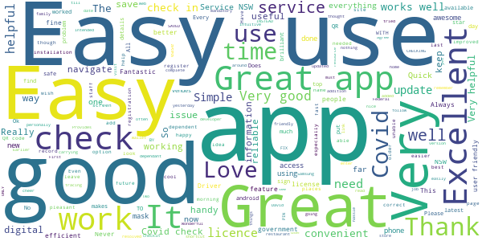
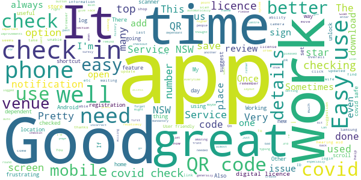
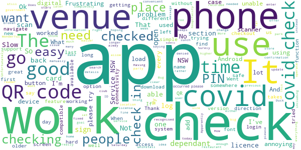

# Service NSW
App version ``6.0.0 (203758)``

Analyzed with [covid-apps-observer](http://github.com/covid-apps-observer) project, version ``0.1``

## App overview
| | |
|-------------------------|-------------------------| 
| **Name**&nbsp;&nbsp;&nbsp;&nbsp;&nbsp;&nbsp;&nbsp;&nbsp;&nbsp;&nbsp;&nbsp;&nbsp;&nbsp;&nbsp;&nbsp;&nbsp;&nbsp;&nbsp;&nbsp;&nbsp;&nbsp;&nbsp;&nbsp;&nbsp;&nbsp;&nbsp;&nbsp;&nbsp;&nbsp;&nbsp;&nbsp;&nbsp;&nbsp;&nbsp;&nbsp;&nbsp;&nbsp;&nbsp;&nbsp;&nbsp;  | Service NSW |
| **Unique identifier** | au.gov.nsw.service |
| **Link to Google Play** | [https://play.google.com/store/apps/details?id=au.gov.nsw.service](https://play.google.com/store/apps/details?id=au.gov.nsw.service) |
| **Summary**  | Digital licences, registrations, fines and more |
| **Privacy policy** | [http://www.service.nsw.gov.au/privacy](http://www.service.nsw.gov.au/privacy) |
| **Latest version** | 6.0.0 (203758) |
| **Last update** | 2021-02-18 08:06:43 |
| **Recent changes** | Thanks for using the Service NSW mobile app. We use your feedback to make these improvements:  • A new app homepage with our most popular features now easier to find • You can now manage your log in and out from the Settings screen • Fixed a bug where the check out page was not scrollable with larger text sizes |
| **Installs**  | 1,000,000+ |
| **Category** | Tools |
| **First release** | Dec 7, 2014 |
| **Size**  | 27M |
| **Supported Android version**  | 6.0 and up |

### Description
> The official Service NSW app, making it easier to access government services. 
 <b>Digital licences and credentials</b>
 Access the following digital licences and credentials, with more to come: 
 • Driver Licence 
 • RSA/RCG Competency Card 
 • Working with Children Check 
 • Recreational Fishing Licence 
 • Boat Driver Licence.
 <b>COVID Safe Check-in</b> 
 • Quick, contactless check in at COVID Safe venues 
 • Point your device camera at the COVID Safe QR Code to get started 
 • Save your details for a faster check in next time. 
 <b>Useful tools and services</b>
 • Verify a Digital Driver Licence via our licence checker 
 • Check or renew a registration 
 • Sign into licensed venues.
 <b>Fines and demerits</b>
 • View and pay your fines 
 • View your demerits.
 <b>COVID-19 resources</b>
 • Access COVID-19 statistics by postcode 
 • Access our COVID-19 Assistance Finder with benefits, rebates and concessions. 
 <b>Tell us what you think</b>
 • Help us help you! We’re always working on a better, stronger, faster app. 
 • Share what you’d like to see in the app: we use your feedback to continuously improve the app experience.

### User interface
The developers of the app provide the following screenshots in the Google play store.
| | | |
|:-------------------------:|:-------------------------:|:-------------------------:|
 |   |   |   | 
 |   |  

## Development team
In the following we report the main information provided by the development team in the Google play store.

| | |
|-------------------------|-------------------------|
| **Developer**  | Service NSW |
| **Website**  | [https://www.service.nsw.gov.au/mobile-app      ](https://www.service.nsw.gov.au/mobile-app      ) |
| **Email** | mobileapp@service.nsw.gov.au |
| **Physical address**  | - |
| **Other developed apps**  | [https://play.google.com/store/apps/developer?id=Service+NSW](https://play.google.com/store/apps/developer?id=Service+NSW) |

## Android support

| | |
|-------------------------|-------------------------|
| **Declared target Android version**  | Android10, version 10 (API level 29) |
| **Effective target Android version**  | Android10, version 10 (API level 29) |
| **Minimum supported Android version**  | Marshmallow, version 6.0 (API level 23) |
| **Maximum target Android version**  | - |

The larger the difference between the minimum and maximum supported Android versions, the better. A larger difference means a wider audience. For example, old phones have a very low Android version, so a high minimum supported Android version means that the app cannot be used by users with old phones, thus leading to accessibility problems. 

## Requested permissions

In the following we report the complete list of the permissions requested by the app. 

| **Permission** | **Protection level** | **Description** | 
|-------------------------|-------------------------|-------------------------|
 **android.permission ACCESS_NETWORK_STATE** | Normal | Allows applications to access information about networks. 
 **android.permission ACCESS_WIFI_STATE** | Normal | Allows applications to access information about Wi-Fi networks. 
 **android.permission CAMERA** | :warning:**Dangerous** | Required to be able to access the camera device. 
 **android.permission INTERNET** | Normal | Allows applications to open network sockets. 
 **android.permission READ_APP_BADGE** | - | - 
 **android.permission READ_EXTERNAL_STORAGE** | :warning:**Dangerous** | Allows an application to read from external storage. 
 **android.permission USE_FINGERPRINT** | Normal | This constant was deprecated in API level 28. Applications should request USE_BIOMETRIC instead 
 **android.permission VIBRATE** | Normal | Allows access to the vibrator. 
 **android.permission WAKE_LOCK** | Normal | Allows using PowerManager WakeLocks to keep processor from sleeping or screen from dimming. 
 **android.permission WRITE_EXTERNAL_STORAGE** | :warning:**Dangerous** | Allows an application to write to external storage. 
 **com.anddoes.launcher.permission UPDATE_COUNT** | - | - 
 **com.android.vending CHECK_LICENSE** | - | - 
 **com.google.android.c2dm.permission RECEIVE** | - | - 
 **com.google.android.finsky.permission BIND_GET_INSTALL_REFERRER_SERVICE** | - | - 
 **com.htc.launcher.permission READ_SETTINGS** | - | - 
 **com.htc.launcher.permission UPDATE_SHORTCUT** | - | - 
 **com.huawei.android.launcher.permission CHANGE_BADGE** | - | - 
 **com.huawei.android.launcher.permission READ_SETTINGS** | - | - 
 **com.huawei.android.launcher.permission WRITE_SETTINGS** | - | - 
 **com.majeur.launcher.permission UPDATE_BADGE** | - | - 
 **com.oppo.launcher.permission READ_SETTINGS** | - | - 
 **com.oppo.launcher.permission WRITE_SETTINGS** | - | - 
 **com.sec.android.provider.badge.permission READ** | - | - 
 **com.sec.android.provider.badge.permission WRITE** | - | - 
 **com.sonyericsson.home.permission BROADCAST_BADGE** | - | - 
 **com.sonymobile.home.permission PROVIDER_INSERT_BADGE** | - | - 
 **me.everything.badger.permission BADGE_COUNT_READ** | - | - 
 **me.everything.badger.permission BADGE_COUNT_WRITE** | - | - 

## Mentioned servers

| **Server** | **Registrant** | **Registrant country** | **Creation date** | 
|-------------------------|-------------------------|-------------------------|-------------------------|
 | apache.org | The Apache Software Foundation | :us: US | 1995-04-11 04:00:00 |
 | xml.org | OASIS Open | :us: US | 1997-02-03 05:00:00 |
 | w3.org | W3C | :us: US | 1994-07-06 04:00:00 |
 | purl.org | Internet Archive | :us: US | 1996-01-01 05:00:00 |
 | adobe.com | Adobe Inc. | :us: US | 1986-11-17 05:00:00 |
 | android.com | Google LLC | :us: US | 1997-06-23 04:00:00 |
 | googlesyndication.com | Google LLC | :us: US | 2003-01-21 06:17:24 |
 | google.com | Google LLC | :us: US | 1997-09-15 04:00:00 |
 | app-measurement.com | Google LLC | :us: US | 2015-06-19 20:13:31 |
 | googleapis.com | Google LLC | :us: US | 2005-01-25 17:52:26 |
 | googleapis.com | Google LLC | :us: US | 2005-01-25 17:52:26 |
 | iptc.org | Whois Privacy Service | :us: US | 1995-12-27 05:00:00 |
 | useplus.org | PLUS COALITION | :us: US | 2003-11-18 19:31:25 |
 | npes.org | NPES | :us: US | 1996-01-30 05:00:00 |
 | aiim.org | Association for Information and Image Management International | :us: US | 1995-10-18 04:00:00 |
 | googleapis.com | Google LLC | :us: US | 2005-01-25 17:52:26 |
 | googleapis.com | Google LLC | :us: US | 2005-01-25 17:52:26 |
 | googleadservices.com | Google LLC | :us: US | 2003-06-19 16:34:53 |

## Security analysis 

Below we report the main security warnings raised by our execution of the [Androwarn](https://github.com/maaaaz/androwarn) security analysis tool.

**Telephony identifiers leakage**
> - This application reads the numeric name (MCC+MNC) of current registered operator 
> - This application reads the operator name 
> - This application reads the phone number string for line 1, for example, the MSISDN for a GSM phone 
> - This application reads the unique device ID, i.e the IMEI for GSM and the MEID or ESN for CDMA phones 

**Location lookup**
> - This application reads location information from all available providers (WiFi, GPS etc.) 

**Connection interfaces exfiltration**
> - This application reads details about the currently active data network 
> - This application tries to find out if the currently active data network is metered 

**Audio video eavesdropping**
> - This application records audio from the 'CAMCORDER' source  
> - This application records audio from the 'MIC' source  
> - This application captures video from the 'CAMERA' source 
> - This application captures video from the 'SURFACE' source 

**Suspicious connection establishment**
> - This application opens a Socket and connects it to the remote address '' on the 'N/A' port  
> - This application opens a Socket and connects it to the remote address 'Ljava/lang/StringBuilder;->toString()Ljava/lang/String;' on the ': connect, resolve' port  
> - This application opens a Socket and connects it to the remote address 'Ljava/lang/StringBuilder;->toString()Ljava/lang/String;' on the 'N/A' port  
> - This application opens a Socket and connects it to the remote address 'Ljava/net/Proxy;->type()Ljava/net/Proxy$Type;' on the 'N/A' port  
> - This application opens a Socket and connects it to the remote address 'Network subsystem is unavailable' on the 'N/A' port  
> - This application opens a Socket and connects it to the remote address 'timeout' on the 'N/A' port  

**Pim data leakage**
> - This application accesses data stored in the clipboard 

**Code execution**
> - This application loads a native library 
> - This application loads a native library: 'Ljava/util/Iterator;->next()Ljava/lang/Object;' 
> - This application loads a native library: 'log' 
> - This application loads a native library: 'sentry' 
> - This application loads a native library: 'sentry-android' 
> - This application loads a native library: 'tool-checker' 
> - This application executes a UNIX command 

## User ratings and reviews

Below we provide information about how end users are reacting to the app in terms of ratings and reviews in the Google Play store.

### Ratings

The Service NSW app has been installed by more than **1000000** times. At this time, **5657** rated the app and its average score is **3.6951613**. Below we show the distribution of the ratings across the usual star-based rating of Google Play

:star::star::star::star::star:: 2820

:star::star::star::star:: 867

:star::star::star:: 474

:star::star:: 419

:star:: 1077

### Reviews 

#### 5-star reviews

> Great advice and Info  :date: __2021-02-25 05:44:57__

> I updated the app yesterday morning and tried to check in to a restaurant I opened the app tried to scan it and it done nothing was working fine till i updated it Saturday morning Edit thanks for your reply just seen it yes it's fine now it must of been the one time it never worked but was okay 2 days ago cheer's  :date: __2021-02-25 02:48:20__

> Very easy to use  :date: __2021-02-25 01:18:27__

> Convenient and safe  :date: __2021-02-24 04:45:46__

> Really good confidence  :date: __2021-02-22 23:43:06__

> Great app, very helpful  :date: __2021-02-22 10:34:21__

> Fantastic app. Provides information on services available to residents of NSW. Even information on rebates you may be eligible for. Check it out.  :date: __2021-02-21 23:26:30__

> Issue resolved, app and check in working great  :date: __2021-02-21 11:14:12__

> I like the new look, easy to get to where I need. 🌟🌟🌟🌟🌟Great App ,easy and simple,now with the Digital Drivers Licence it is a great addition to the app, keep up with the great work devs and thanks for a great App, you are most welcome  :date: __2021-02-21 06:44:30__

> The Covid check-in button is now the top!! 👌  :date: __2021-02-19 04:52:30__

#### 4-star reviews

> I find it easy to utilise the system, which is kinda amazing for me as I am quite useless when it comes to technology 🤫  :date: __2021-02-24 06:17:57__

> The app has definately improved and is very easy to use now! 👍🏻  :date: __2021-02-24 00:08:17__

> Glad every time i chat to my daughter .  :date: __2021-02-23 14:40:59__

> Lacking Biometric login, so it's always frustrating to unlock with a passcode rather than Face Unlock. Other than that, seems to work well.  :date: __2021-02-22 21:02:36__

> Good  :date: __2021-02-22 09:50:26__

> Satisfactory Once learned  :date: __2021-02-21 11:38:47__

> Can be a bit temperamental but generally works well.  :date: __2021-02-20 03:17:49__

> Great  :date: __2021-02-17 23:16:12__

> Overall an amazing app. Until a few days ago. It kicked me out and now is telling me my password and email is incorrect... even through its correct as I can log in on a Web browser. Please fix this asap!!!!  :date: __2021-02-14 22:03:45__

> Easy to use and convenient.  :date: __2021-02-12 10:46:28__

#### 3-star reviews

> Good app but the biometric login is broken.... So if your fingerprint scanner and home button are built into one (as is the case on most devices) I'll place my finger on the scanner and it'll go back home not actually log me in! Frustrating especially when you're trying to check-in for covid safe every 2mins.....  :date: __2021-02-19 21:48:36__

> Cannot access form  :date: __2021-02-19 00:52:11__

> Works ok on newer phones but plenty of older people have pre Android 6.0 devices and guess what? Not suitable for your device message is all you get. Surely you can make it work on older devices that can't be updated?  :date: __2021-02-17 05:01:46__

> Frustrating.... No issues checking in but for the last 2 days it won't let me check out. Comes up with "unable to check out please try again. Physically can not check out until I check in at another location. I have been checked into one place for 15hrs until I have needed to check in somewhere else. Covid tracing data hard to get right if I am not able to check out ☹  :date: __2021-02-16 00:32:07__

> After check in it often shuts down and I can't check out  :date: __2021-02-15 02:51:39__

> Checking in appears to work just fine including providing a confirmation that I'm checked in, but... When I go to check out, the check in feature has restarted and no check in was recorded. I've tried reinstalling the app and still have this issue, the rest of the app is great. The covid check in feature literally does not work. The UX could use some work also, if i've recently checked in somewhere and then I open the app, it should open up to the check out page.  :date: __2021-02-13 03:26:43__

> Mostly good at what it should do. The Covid check-in dad been moved to the app allowing you to scan a business' barcode. However, when the app is sent to the background, upon resumption the app's forgotten you've just checked in and brings up the confirmation of details screen again. If you proceed here, the app then checks you in again to the place you had just checked in at. Trying to check out is just as painful as once the app resumes, it again wants to check you in. It all works backwards  :date: __2021-02-12 02:47:57__

> Unable to load digital copy of recreational fishing licence  :date: __2021-02-11 21:23:01__

> Having trouble getting some basic information  :date: __2021-02-10 02:10:39__

> Does what it needs to. With all the covid check-in I do, would be faster & easier if the covid check in feature was an app on its own.  :date: __2021-02-09 11:15:27__

#### 2-star reviews

> Ease to install. Thanks.  :date: __2021-02-27 12:33:38__

> This app was working fine for me for almost a year then all of a sudden out of nowhere it will no longer let me in. It rejected my (correct) 4 digit code and after logging out to see if that aids the problem, it won't let me log back in. I've reset my password and I can access my account on the website, but the app still won't log me in. Despite ensuring correct log in information, I'm still being told it's incorrect. Very frustrating.  :date: __2021-02-26 12:40:27__

> Can't log out of location very easily. Have to book in again and then log out straight away.  :date: __2021-02-25 01:18:36__

> Does anyone know how to add this icon onto their home page for quicker access? Fed up having to access play store to open it every time I need to sign in at places.  :date: __2021-02-24 23:12:15__

> I have to continuously logon to checkin or checkout. It chews my battery. I should not have to rescan the qr code for places I visit regularly. The covid checkin should have its own widget . Designed by people with no app experience.  :date: __2021-02-24 00:41:10__

> I am so frustrated with this app. Initially it was working with no problems, then all of a sudden it stopped allowing me to check in saying to check the accuracy of the time on my phone? I have since been trying to log in and it continues to say incorrect password even though I know it is correct as I can sign in via the web. Dead set frustrating and I still have no reason why it happened to begin with. Uninstall, here I come.  :date: __2021-02-20 21:08:09__

> I'll DC  :date: __2021-02-19 17:42:15__

> As no data on my phone the QR code login will not work. Many places I have visited get annoyed . Some have said they will check us in, in a while but either forget or just don't. Some have said they will have no other choice but to refuse entry !. I looked this up and now know they can not do this. Again today another cafe did not sign us in !!  :date: __2021-02-19 11:54:27__

> Check in at a venue on a bus etc, check out. Next place I check in it loads previous location or the one before saying I haven't checked out or to check in there again. You need to sort out the bugs to make the contact tracing precise. Attention to detail is important here.  :date: __2021-02-17 07:26:52__

> Latest update has created check-in/out issues, unable to do either  :date: __2021-02-15 23:52:16__

#### 1-star reviews

> Continually poor experience now I can't even finish a review  :date: __2021-02-27 11:09:31__

> Incorrect password at login stage. It is super frustrating as I need to upload and provide certain information for my new employer however I can't because it won't let me login. I've attempted to reset my password for weeks now and same issue.  :date: __2021-02-26 22:26:36__

> App wouldn't update so i deleted it. Now tried to install new app and it won't download??  :date: __2021-02-25 07:10:25__

> App doesn't work and won't let me sign in. Reinstalled it and updated the password and still can't use app. Please fix it, businesses get annoyed  :date: __2021-02-24 20:59:26__

> Whatever changed with the app has caused my login attempts to keep failing. I can login to the service nsw webpage using the same credentials, but not the app anymore. Such a pity as this was a useful app. :(  :date: __2021-02-24 17:08:39__

> There's is a problem with this app it's stop working please fixed asap.  :date: __2021-02-24 09:14:55__

> Cannot download this app. Visitors to NSW. Not great.  :date: __2021-02-24 08:16:27__

> Too complex  :date: __2021-02-24 03:36:13__

> Suddenly my pin was incorrect won't log me in so I tried login in with email says incorrect password. I've changed nothing.  :date: __2021-02-23 20:08:34__

> When I try to add licence, it keeps telling me to add email to link Roads and Maritime records. When I click add, it says success but again gets back to that page to add link.  :date: __2021-02-23 02:16:46__

