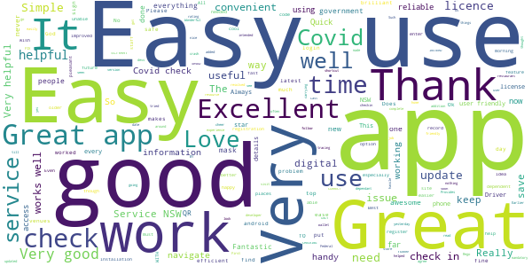
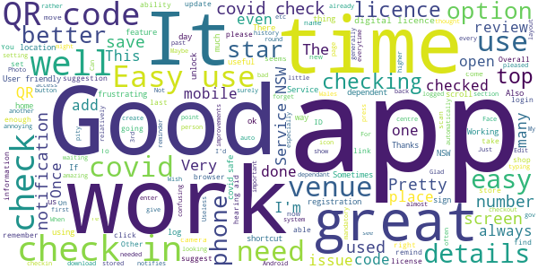
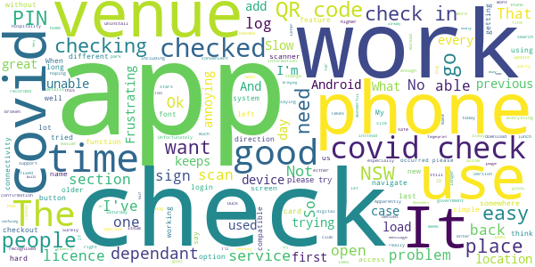
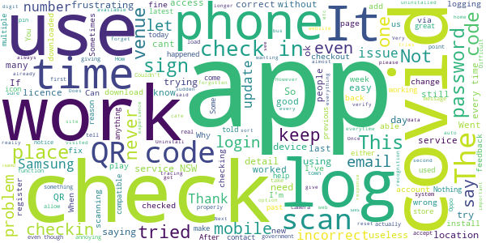
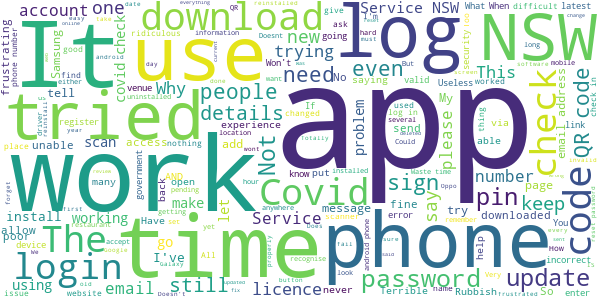

# Service NSW
App version ``6.1.0 (208544)``

Analyzed with [covid-apps-observer](http://github.com/covid-apps-observer) project, version ``0.1``

## App overview
| | |
|-------------------------|-------------------------| 
| **Name**&nbsp;&nbsp;&nbsp;&nbsp;&nbsp;&nbsp;&nbsp;&nbsp;&nbsp;&nbsp;&nbsp;&nbsp;&nbsp;&nbsp;&nbsp;&nbsp;&nbsp;&nbsp;&nbsp;&nbsp;&nbsp;&nbsp;&nbsp;&nbsp;&nbsp;&nbsp;&nbsp;&nbsp;&nbsp;&nbsp;&nbsp;&nbsp;&nbsp;&nbsp;&nbsp;&nbsp;&nbsp;&nbsp;&nbsp;&nbsp;  | Service NSW |
| **Unique identifier** | au.gov.nsw.service |
| **Link to Google Play** | [https://play.google.com/store/apps/details?id=au.gov.nsw.service](https://play.google.com/store/apps/details?id=au.gov.nsw.service) |
| **Summary**  | Digital licences, registrations, fines and more |
| **Privacy policy** | [http://www.service.nsw.gov.au/privacy](http://www.service.nsw.gov.au/privacy) |
| **Latest version** | 6.1.0 (208544) |
| **Last update** | 2021-02-26 07:44:01 |
| **Recent changes** | Thanks for using the Service NSW mobile app! We used your feedback to make these changes: • Never forget to check out of a COVID Safe venue again! Now you can choose to get reminder notifications. Manage notifications in Settings. Custom timings for reminders coming soon. • Fixed a bug where the am/pm didn&#39;t display on checkout details on some devices. |
| **Installs**  | 1,000,000+ |
| **Category** | Tools |
| **First release** | Dec 7, 2014 |
| **Size**  | 27M |
| **Supported Android version**  | 6.0 and up |

### Description
> The official Service NSW app, making it easier to access government services. 
 <b>Digital licences and credentials</b>
 Access the following digital licences and credentials, with more to come: 
 • Driver Licence 
 • RSA/RCG Competency Card 
 • Working with Children Check 
 • Recreational Fishing Licence 
 • Boat Driver Licence.
 <b>COVID Safe Check-in</b> 
 • Quick, contactless check in at COVID Safe venues 
 • Point your device camera at the COVID Safe QR Code to get started 
 • Save your details for a faster check in next time. 
 <b>Useful tools and services</b>
 • Verify a Digital Driver Licence via our licence checker 
 • Check or renew a registration 
 • Sign into licensed venues.
 <b>Fines and demerits</b>
 • View and pay your fines 
 • View your demerits.
 <b>COVID-19 resources</b>
 • Access COVID-19 statistics by postcode 
 • Access our COVID-19 Assistance Finder with benefits, rebates and concessions. 
 <b>Tell us what you think</b>
 • Help us help you! We’re always working on a better, stronger, faster app. 
 • Share what you’d like to see in the app: we use your feedback to continuously improve the app experience.

### User interface
The developers of the app provide the following screenshots in the Google play store.
| | | |
|:-------------------------:|:-------------------------:|:-------------------------:|
 |   |   |   | 
 |   |  

## Development team
In the following we report the main information provided by the development team in the Google play store.

| | |
|-------------------------|-------------------------|
| **Developer**  | Service NSW |
| **Website**  | [https://www.service.nsw.gov.au/mobile-app      ](https://www.service.nsw.gov.au/mobile-app      ) |
| **Email** | mobileapp@service.nsw.gov.au |
| **Physical address**  | - |
| **Other developed apps**  | [https://play.google.com/store/apps/developer?id=Service+NSW](https://play.google.com/store/apps/developer?id=Service+NSW) |

## Android support

| | |
|-------------------------|-------------------------|
| **Declared target Android version**  | Android10, version 10 (API level 29) |
| **Effective target Android version**  | Android10, version 10 (API level 29) |
| **Minimum supported Android version**  | Marshmallow, version 6.0 (API level 23) |
| **Maximum target Android version**  | - |

The larger the difference between the minimum and maximum supported Android versions, the better. A larger difference means a wider audience. For example, old phones have a very low Android version, so a high minimum supported Android version means that the app cannot be used by users with old phones, thus leading to accessibility problems. 

## Requested permissions

In the following we report the complete list of the permissions requested by the app. 

| **Permission** | **Protection level** | **Description** | 
|-------------------------|-------------------------|-------------------------|
 **android.permission ACCESS_NETWORK_STATE** | Normal | Allows applications to access information about networks. 
 **android.permission ACCESS_WIFI_STATE** | Normal | Allows applications to access information about Wi-Fi networks. 
 **android.permission CAMERA** | :warning:**Dangerous** | Required to be able to access the camera device. 
 **android.permission INTERNET** | Normal | Allows applications to open network sockets. 
 **android.permission READ_APP_BADGE** | - | - 
 **android.permission READ_EXTERNAL_STORAGE** | :warning:**Dangerous** | Allows an application to read from external storage. 
 **android.permission USE_FINGERPRINT** | Normal | This constant was deprecated in API level 28. Applications should request USE_BIOMETRIC instead 
 **android.permission VIBRATE** | Normal | Allows access to the vibrator. 
 **android.permission WAKE_LOCK** | Normal | Allows using PowerManager WakeLocks to keep processor from sleeping or screen from dimming. 
 **android.permission WRITE_EXTERNAL_STORAGE** | :warning:**Dangerous** | Allows an application to write to external storage. 
 **com.anddoes.launcher.permission UPDATE_COUNT** | - | - 
 **com.android.vending CHECK_LICENSE** | - | - 
 **com.google.android.c2dm.permission RECEIVE** | - | - 
 **com.google.android.finsky.permission BIND_GET_INSTALL_REFERRER_SERVICE** | - | - 
 **com.htc.launcher.permission READ_SETTINGS** | - | - 
 **com.htc.launcher.permission UPDATE_SHORTCUT** | - | - 
 **com.huawei.android.launcher.permission CHANGE_BADGE** | - | - 
 **com.huawei.android.launcher.permission READ_SETTINGS** | - | - 
 **com.huawei.android.launcher.permission WRITE_SETTINGS** | - | - 
 **com.majeur.launcher.permission UPDATE_BADGE** | - | - 
 **com.oppo.launcher.permission READ_SETTINGS** | - | - 
 **com.oppo.launcher.permission WRITE_SETTINGS** | - | - 
 **com.sec.android.provider.badge.permission READ** | - | - 
 **com.sec.android.provider.badge.permission WRITE** | - | - 
 **com.sonyericsson.home.permission BROADCAST_BADGE** | - | - 
 **com.sonymobile.home.permission PROVIDER_INSERT_BADGE** | - | - 
 **me.everything.badger.permission BADGE_COUNT_READ** | - | - 
 **me.everything.badger.permission BADGE_COUNT_WRITE** | - | - 

## Mentioned servers

| **Server** | **Registrant** | **Registrant country** | **Creation date** | 
|-------------------------|-------------------------|-------------------------|-------------------------|
 | apache.org | The Apache Software Foundation | :us: US | 1995-04-11 04:00:00 |
 | xml.org | OASIS Open | :us: US | 1997-02-03 05:00:00 |
 | w3.org | W3C | :us: US | 1994-07-06 04:00:00 |
 | purl.org | Internet Archive | :us: US | 1996-01-01 05:00:00 |
 | adobe.com | Adobe Inc. | :us: US | 1986-11-17 05:00:00 |
 | android.com | Google LLC | :us: US | 1997-06-23 04:00:00 |
 | googlesyndication.com | Google LLC | :us: US | 2003-01-21 06:17:24 |
 | google.com | Google LLC | :us: US | 1997-09-15 04:00:00 |
 | app-measurement.com | Google LLC | :us: US | 2015-06-19 20:13:31 |
 | googleapis.com | Google LLC | :us: US | 2005-01-25 17:52:26 |
 | googleapis.com | Google LLC | :us: US | 2005-01-25 17:52:26 |
 | iptc.org | Whois Privacy Service | :us: US | 1995-12-27 05:00:00 |
 | useplus.org | PLUS COALITION | :us: US | 2003-11-18 19:31:25 |
 | npes.org | NPES | :us: US | 1996-01-30 05:00:00 |
 | aiim.org | Association for Information and Image Management International | :us: US | 1995-10-18 04:00:00 |
 | googleapis.com | Google LLC | :us: US | 2005-01-25 17:52:26 |
 | googleapis.com | Google LLC | :us: US | 2005-01-25 17:52:26 |
 | googleadservices.com | Google LLC | :us: US | 2003-06-19 16:34:53 |

## Security analysis 

Below we report the main security warnings raised by our execution of the [Androwarn](https://github.com/maaaaz/androwarn) security analysis tool.

**Telephony identifiers leakage**
> - This application reads the numeric name (MCC+MNC) of current registered operator 
> - This application reads the operator name 
> - This application reads the phone number string for line 1, for example, the MSISDN for a GSM phone 
> - This application reads the unique device ID, i.e the IMEI for GSM and the MEID or ESN for CDMA phones 

**Location lookup**
> - This application reads location information from all available providers (WiFi, GPS etc.) 

**Connection interfaces exfiltration**
> - This application reads details about the currently active data network 
> - This application tries to find out if the currently active data network is metered 

**Audio video eavesdropping**
> - This application records audio from the 'CAMCORDER' source  
> - This application records audio from the 'MIC' source  
> - This application captures video from the 'CAMERA' source 
> - This application captures video from the 'SURFACE' source 

**Suspicious connection establishment**
> - This application opens a Socket and connects it to the remote address '' on the 'N/A' port  
> - This application opens a Socket and connects it to the remote address 'Ljava/lang/StringBuilder;->toString()Ljava/lang/String;' on the ': connect, resolve' port  
> - This application opens a Socket and connects it to the remote address 'Ljava/lang/StringBuilder;->toString()Ljava/lang/String;' on the 'N/A' port  
> - This application opens a Socket and connects it to the remote address 'Ljava/net/Proxy;->type()Ljava/net/Proxy$Type;' on the 'N/A' port  
> - This application opens a Socket and connects it to the remote address 'Network subsystem is unavailable' on the 'N/A' port  
> - This application opens a Socket and connects it to the remote address 'timeout' on the 'N/A' port  

**Pim data leakage**
> - This application accesses data stored in the clipboard 

**Code execution**
> - This application loads a native library 
> - This application loads a native library: 'Ljava/util/Iterator;->next()Ljava/lang/Object;' 
> - This application loads a native library: 'log' 
> - This application loads a native library: 'sentry' 
> - This application loads a native library: 'sentry-android' 
> - This application loads a native library: 'tool-checker' 
> - This application executes a UNIX command 

## User ratings and reviews

Below we provide information about how end users are reacting to the app in terms of ratings and reviews in the Google Play store.

### Ratings

The Service NSW app has been installed by more than **1000000** times. At this time, **5656** rated the app and its average score is **3.7147827**. Below we show the distribution of the ratings across the usual star-based rating of Google Play

:star::star::star::star::star:: 2903

:star::star::star::star:: 826

:star::star::star:: 442

:star::star:: 383

:star:: 1102

### Reviews 

#### 5-star reviews

> Easy use.  :date: __2021-03-06 13:45:02__

> Thank God for us people who forget to sign out! Thank god we can enter the time we approximately left thank you!!  :date: __2021-03-06 07:09:56__

> Easy to use,  :date: __2021-03-06 03:42:12__

> Very good I'm giving you five stars because I've never seen an app that doesn't crash so you're at must be made very good nearly every have on soon crashes some apps crash all the time  :date: __2021-03-06 03:10:27__

> Good work  :date: __2021-03-05 04:45:54__

> Very smooth experience v  :date: __2021-03-03 03:20:57__

> Its really fantastic service NSW  :date: __2021-03-02 12:59:41__

> Works surprisingly well for a government app. Easy access to licence and Rego details.  :date: __2021-03-02 05:15:04__

> Very good, useful.  :date: __2021-03-02 04:00:49__

> Best app  :date: __2021-03-01 22:40:23__

#### 4-star reviews

> OK  :date: __2021-03-04 21:50:20__

> Like the app, up/down scrolling much more usable than left/right. Check-out notifications when I have already checked out are a little annoying, please modify so that it only notifies if not checked out.  :date: __2021-03-04 05:48:28__

> It's a pity that the app reminds you to check out when you already have. Useless and annoying option in my opinion.  :date: __2021-03-04 04:32:49__

> Medical venues (Hospitals St George and Prince of Wales) use there own QR code not yours it is confusing for the older person.  :date: __2021-03-03 23:49:09__

> It's a great app slot better than the Canberra check-in app. I didn't rate this app 5 star because I haven't used it enough to know it well enough to grade it the highest star  :date: __2021-03-03 10:35:07__

> Many of us forget to sign out when leaving shop etc. Thanks for the new check out reminder.  :date: __2021-03-01 10:13:40__

> I find it easy to utilise the system, which is kinda amazing for me as I am quite useless when it comes to technology 🤫  :date: __2021-02-24 06:17:57__

> The app has definately improved and is very easy to use now! 👍🏻  :date: __2021-02-24 00:08:17__

> Glad every time i chat to my daughter .  :date: __2021-02-23 14:40:59__

> Lacking Biometric login, so it's always frustrating to unlock with a passcode rather than Face Unlock. Other than that, seems to work well.  :date: __2021-02-22 21:02:36__

#### 3-star reviews

> Very glitchy. Half the time when I try to do a covid check in it checks me into a previous location. Now it keeps reminding me to check out, but keeps trying to check me in again first.  :date: __2021-03-06 09:15:22__

> Reminders to check out are now bringing me back to 'check in' page for a location from previous day. It's confusing especially if I already think I've checked out.  :date: __2021-03-04 03:38:54__

> Great service  :date: __2021-03-01 04:39:27__

> Good app but the biometric login is broken.... So if your fingerprint scanner and home button are built into one (as is the case on most devices) I'll place my finger on the scanner and it'll go back home not actually log me in! Frustrating especially when you're trying to check-in for covid safe every 2mins.....  :date: __2021-02-19 21:48:36__

> Cannot access form  :date: __2021-02-19 00:52:11__

> Works ok on newer phones but plenty of older people have pre Android 6.0 devices and guess what? Not suitable for your device message is all you get. Surely you can make it work on older devices that can't be updated?  :date: __2021-02-17 05:01:46__

> Frustrating.... No issues checking in but for the last 2 days it won't let me check out. Comes up with "unable to check out please try again. Physically can not check out until I check in at another location. I have been checked into one place for 15hrs until I have needed to check in somewhere else. Covid tracing data hard to get right if I am not able to check out ☹  :date: __2021-02-16 00:32:07__

> After check in it often shuts down and I can't check out  :date: __2021-02-15 02:51:39__

> Checking in appears to work just fine including providing a confirmation that I'm checked in, but... When I go to check out, the check in feature has restarted and no check in was recorded. I've tried reinstalling the app and still have this issue, the rest of the app is great. The covid check in feature literally does not work. The UX could use some work also, if i've recently checked in somewhere and then I open the app, it should open up to the check out page.  :date: __2021-02-13 03:26:43__

> Mostly good at what it should do. The Covid check-in dad been moved to the app allowing you to scan a business' barcode. However, when the app is sent to the background, upon resumption the app's forgotten you've just checked in and brings up the confirmation of details screen again. If you proceed here, the app then checks you in again to the place you had just checked in at. Trying to check out is just as painful as once the app resumes, it again wants to check you in. It all works backwards  :date: __2021-02-12 02:47:57__

#### 2-star reviews

> Good in theory not in practice. Can log in through the website but not through the app. Can't create a new account as details already in use. Never mind wanting auto updates and to change my phone times. More effort than it's worth. After all that still couldn't log in, use QR log ins or licence details. Gave up and uninstalled for the second time.  :date: __2021-03-06 15:20:50__

> Frustrating it won't let me use covid sign in at venues and for some reason and everytime I try to sign in it tells me my details are wrong.  :date: __2021-03-05 06:57:28__

> The response on my phone when I tried to download the app is "this item isn't compatible with this device" . I've never had that problem before. Should I even rate this app.  :date: __2021-03-05 03:27:21__

> This won't be easy at all for the elderly or people who are not technical. They are always forgotten!  :date: __2021-03-01 01:05:02__

> I have had this app for a while and worked flawlessly. However in the past few weeks it won't let me login through the app it says my password and email is incorrect it has been really frustrating because i can't check my details and it's making it had for me to use the Covid safe check in.  :date: __2021-02-28 01:33:39__

> Ease to install. Thanks.  :date: __2021-02-27 12:33:38__

> This app was working fine for me for almost a year then all of a sudden out of nowhere it will no longer let me in. It rejected my (correct) 4 digit code and after logging out to see if that aids the problem, it won't let me log back in. I've reset my password and I can access my account on the website, but the app still won't log me in. Despite ensuring correct log in information, I'm still being told it's incorrect. Very frustrating.  :date: __2021-02-26 12:40:27__

> Can't log out of location very easily. Have to book in again and then log out straight away.  :date: __2021-02-25 01:18:36__

> Does anyone know how to add this icon onto their home page for quicker access? Fed up having to access play store to open it every time I need to sign in at places.  :date: __2021-02-24 23:12:15__

> I have to continuously logon to checkin or checkout. It chews my battery. I should not have to rescan the qr code for places I visit regularly. The covid checkin should have its own widget . Designed by people with no app experience.  :date: __2021-02-24 00:41:10__

#### 1-star reviews

> Keeps refusing email and password. I change and then refuses new password. Locks out. Change and does it again. Ridiculous app.  :date: __2021-03-06 12:31:21__

> The Service NSW app is extremely disappointing. I agree totally with the comments below. It was excellent the first couple of times that I used it. Since then I have experienced all of the comments below. It no longer recognises my pin, the long way wouldn't let me proceed past the dependants question etc. The guy where I was going said to forget it as lots of people had the same problems as me. I rang and was advised to update which I did. I am going to forget it.  :date: __2021-03-06 10:03:28__

> i am able to login via browser but not via app... tried uninstalling then installing but still the same  :date: __2021-03-06 07:39:57__

> If anyone can tell me how to download & use it, I would appreciate it. IT IS NOT, I REPEAT NOT AN EASY APP.  :date: __2021-03-06 02:37:35__

> Can't even login my account thru this App, even the web account login was all fine.  :date: __2021-03-05 08:32:51__

> It was fine until they updated the apps. Now i can't login via the apps and even on the website it seems not working properly too. So frustrated and scared since they got hacked a year ago. Terrible.  :date: __2021-03-05 05:32:07__

> Issues with login terrible experience using this app  :date: __2021-03-04 07:09:43__

> It has the wrong licence  :date: __2021-03-03 05:15:48__

> Won't allow me to log in to my account via the app. But i can log in online  :date: __2021-03-02 22:54:59__

> This app was working fine. Was there an update, because i can no longer Access the covid check in, and it is even harder to access driver licence with a picture.  :date: __2021-03-01 23:12:39__

