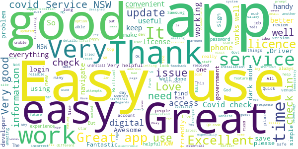
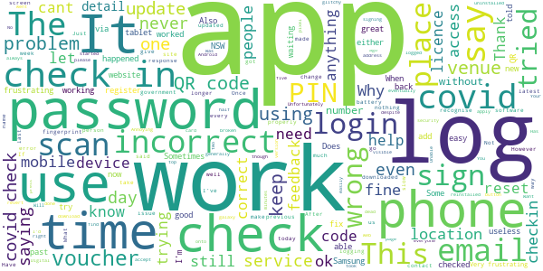
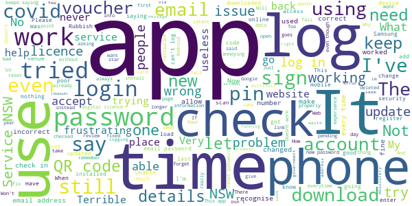

# Service NSW
App version ``6.10.0 (269419)``

Analyzed with [covid-apps-observer](http://github.com/covid-apps-observer) project, version ``0.1``

## App overview
| | |
|-------------------------|-------------------------| 
| **Name**&nbsp;&nbsp;&nbsp;&nbsp;&nbsp;&nbsp;&nbsp;&nbsp;&nbsp;&nbsp;&nbsp;&nbsp;&nbsp;&nbsp;&nbsp;&nbsp;&nbsp;&nbsp;&nbsp;&nbsp;&nbsp;&nbsp;&nbsp;&nbsp;&nbsp;&nbsp;&nbsp;&nbsp;&nbsp;&nbsp;&nbsp;&nbsp;&nbsp;&nbsp;&nbsp;&nbsp;&nbsp;&nbsp;&nbsp;&nbsp;  | Service NSW |
| **Unique identifier** | au.gov.nsw.service |
| **Link to Google Play** | [https://play.google.com/store/apps/details?id=au.gov.nsw.service](https://play.google.com/store/apps/details?id=au.gov.nsw.service) |
| **Summary**  | Digital licences, registrations, fines and more |
| **Privacy policy** | [http://www.service.nsw.gov.au/privacy](http://www.service.nsw.gov.au/privacy) |
| **Latest version** | 6.10.0 (269419) |
| **Last update** | 2021-05-19 14:10:32 |
| **Recent changes** | Thanks for using the Service NSW mobile app! We used your feedback to make these improvements: • Introducing School Check-in, we&#39;ll be trialling this feature across selected schools in NSW |
| **Installs**  | 1,000,000+ |
| **Category** | Tools |
| **First release** | Dec 7, 2014 |
| **Size**  | 29M |
| **Supported Android version**  | 6.0 and up |

### Description
> The official Service NSW app, making it easier to access government services. 
 <b>Digital licences and credentials</b>
 Access the following digital licences and credentials, with more to come: 
 • Driver Licence 
 • RSA/RCG Competency Card 
 • Working with Children Check 
 • Recreational Fishing Licence 
 • Boat Driver Licence.
 <b>COVID Safe Check-in</b> 
 • Quick, contactless check in at COVID Safe venues 
 • Point your device camera at the COVID Safe QR Code to get started 
 • Save your details for a faster check in next time. 
 • Read our Privacy Collection Statement: https://www.service.nsw.gov.au/covid-safe-check-privacy-collection-statement
 <b>Useful tools and services</b>
 • Verify a Digital Driver Licence via our licence checker 
 • Check or renew a registration 
 • Sign into licensed venues.
 <b>Fines and demerits</b>
 • View and pay your fines 
 • View your demerits.
 <b>COVID-19 resources</b>
 • Access COVID-19 statistics by postcode 
 • Access our COVID-19 Assistance Finder with benefits, rebates and concessions. 
 <b>Tell us what you think</b>
 • Help us help you! We’re always working on a better, stronger, faster app. 
 • Share what you’d like to see in the app: we use your feedback to continuously improve the app experience.

### User interface
The developers of the app provide the following screenshots in the Google play store.
| | | |
|:-------------------------:|:-------------------------:|:-------------------------:|
 |   |   |   | 
 |   |  

## Development team
In the following we report the main information provided by the development team in the Google play store.

| | |
|-------------------------|-------------------------|
| **Developer**  | Service NSW |
| **Website**  | [https://www.service.nsw.gov.au/mobile-app      ](https://www.service.nsw.gov.au/mobile-app      ) |
| **Email** | mobileapp@service.nsw.gov.au |
| **Physical address**  | - |
| **Other developed apps**  | [https://play.google.com/store/apps/developer?id=Service+NSW](https://play.google.com/store/apps/developer?id=Service+NSW) |

## Android support

| | |
|-------------------------|-------------------------|
| **Declared target Android version**  | Android10, version 10 (API level 29) |
| **Effective target Android version**  | Android10, version 10 (API level 29) |
| **Minimum supported Android version**  | Marshmallow, version 6.0 (API level 23) |
| **Maximum target Android version**  | - |

The larger the difference between the minimum and maximum supported Android versions, the better. A larger difference means a wider audience. For example, old phones have a very low Android version, so a high minimum supported Android version means that the app cannot be used by users with old phones, thus leading to accessibility problems. 

## Requested permissions

In the following we report the complete list of the permissions requested by the app. 

| **Permission** | **Protection level** | **Description** | 
|-------------------------|-------------------------|-------------------------|
 **android.permission ACCESS_NETWORK_STATE** | Normal | Allows applications to access information about networks. 
 **android.permission ACCESS_WIFI_STATE** | Normal | Allows applications to access information about Wi-Fi networks. 
 **android.permission CAMERA** | :warning:**Dangerous** | Required to be able to access the camera device. 
 **android.permission INTERNET** | Normal | Allows applications to open network sockets. 
 **android.permission READ_APP_BADGE** | - | - 
 **android.permission USE_FINGERPRINT** | Normal | This constant was deprecated in API level 28. Applications should request USE_BIOMETRIC instead 
 **android.permission VIBRATE** | Normal | Allows access to the vibrator. 
 **android.permission WAKE_LOCK** | Normal | Allows using PowerManager WakeLocks to keep processor from sleeping or screen from dimming. 
 **com.anddoes.launcher.permission UPDATE_COUNT** | - | - 
 **com.android.vending CHECK_LICENSE** | - | - 
 **com.google.android.c2dm.permission RECEIVE** | - | - 
 **com.google.android.finsky.permission BIND_GET_INSTALL_REFERRER_SERVICE** | - | - 
 **com.htc.launcher.permission READ_SETTINGS** | - | - 
 **com.htc.launcher.permission UPDATE_SHORTCUT** | - | - 
 **com.huawei.android.launcher.permission CHANGE_BADGE** | - | - 
 **com.huawei.android.launcher.permission READ_SETTINGS** | - | - 
 **com.huawei.android.launcher.permission WRITE_SETTINGS** | - | - 
 **com.majeur.launcher.permission UPDATE_BADGE** | - | - 
 **com.oppo.launcher.permission READ_SETTINGS** | - | - 
 **com.oppo.launcher.permission WRITE_SETTINGS** | - | - 
 **com.sec.android.provider.badge.permission READ** | - | - 
 **com.sec.android.provider.badge.permission WRITE** | - | - 
 **com.sonyericsson.home.permission BROADCAST_BADGE** | - | - 
 **com.sonymobile.home.permission PROVIDER_INSERT_BADGE** | - | - 
 **me.everything.badger.permission BADGE_COUNT_READ** | - | - 
 **me.everything.badger.permission BADGE_COUNT_WRITE** | - | - 

## Mentioned servers

| **Server** | **Registrant** | **Registrant country** | **Creation date** | 
|-------------------------|-------------------------|-------------------------|-------------------------|
 | apache.org | The Apache Software Foundation | :us: US | 1995-04-11 04:00:00 |
 | xml.org | OASIS Open | :us: US | 1997-02-03 05:00:00 |
 | w3.org | W3C | :us: US | 1994-07-06 04:00:00 |
 | purl.org | Internet Archive | :us: US | 1996-01-01 05:00:00 |
 | adobe.com | Adobe Inc. | :us: US | 1986-11-17 05:00:00 |
 | android.com | Google LLC | :us: US | 1997-06-23 04:00:00 |
 | googlesyndication.com | Google LLC | :us: US | 2003-01-21 06:17:24 |
 | google.com | Google LLC | :us: US | 1997-09-15 04:00:00 |
 | app-measurement.com | Google LLC | :us: US | 2015-06-19 20:13:31 |
 | googleapis.com | Google LLC | :us: US | 2005-01-25 17:52:26 |
 | googleapis.com | Google LLC | :us: US | 2005-01-25 17:52:26 |
 | iptc.org | Whois Privacy Service | :us: US | 1995-12-27 05:00:00 |
 | useplus.org | PLUS COALITION | :us: US | 2003-11-18 19:31:25 |
 | npes.org | NPES | :us: US | 1996-01-30 05:00:00 |
 | aiim.org | Association for Information and Image Management International | :us: US | 1995-10-18 04:00:00 |
 | googleapis.com | Google LLC | :us: US | 2005-01-25 17:52:26 |
 | googleapis.com | Google LLC | :us: US | 2005-01-25 17:52:26 |
 | googleadservices.com | Google LLC | :us: US | 2003-06-19 16:34:53 |

## Security analysis 

Below we report the main security warnings raised by our execution of the [Androwarn](https://github.com/maaaaz/androwarn) security analysis tool.

**Telephony identifiers leakage**
> - This application reads the numeric name (MCC+MNC) of current registered operator 
> - This application reads the operator name 
> - This application reads the phone number string for line 1, for example, the MSISDN for a GSM phone 
> - This application reads the unique device ID, i.e the IMEI for GSM and the MEID or ESN for CDMA phones 

**Location lookup**
> - This application reads location information from all available providers (WiFi, GPS etc.) 

**Connection interfaces exfiltration**
> - This application reads details about the currently active data network 
> - This application tries to find out if the currently active data network is metered 

**Audio video eavesdropping**
> - This application records audio from the 'CAMCORDER' source  
> - This application records audio from the 'MIC' source  
> - This application captures video from the 'CAMERA' source 
> - This application captures video from the 'SURFACE' source 

**Suspicious connection establishment**
> - This application opens a Socket and connects it to the remote address '' on the 'N/A' port  
> - This application opens a Socket and connects it to the remote address 'Ljava/lang/StringBuilder;->toString()Ljava/lang/String;' on the ': connect, resolve' port  
> - This application opens a Socket and connects it to the remote address 'Ljava/lang/StringBuilder;->toString()Ljava/lang/String;' on the 'N/A' port  
> - This application opens a Socket and connects it to the remote address 'Ljava/net/Proxy;->type()Ljava/net/Proxy$Type;' on the 'N/A' port  
> - This application opens a Socket and connects it to the remote address 'Network subsystem is unavailable' on the 'N/A' port  
> - This application opens a Socket and connects it to the remote address 'timeout' on the 'N/A' port  

**Pim data leakage**
> - This application accesses data stored in the clipboard 

**Code execution**
> - This application loads a native library 
> - This application loads a native library: 'Ljava/util/Iterator;->next()Ljava/lang/Object;' 
> - This application loads a native library: 'log' 
> - This application loads a native library: 'sentry' 
> - This application loads a native library: 'sentry-android' 
> - This application loads a native library: 'tool-checker' 
> - This application executes a UNIX command 

## User ratings and reviews

Below we provide information about how end users are reacting to the app in terms of ratings and reviews in the Google Play store.

### Ratings

The Service NSW app has been installed by more than **1000000** times. At this time, **6813** rated the app and its average score is **3.8721263**. Below we show the distribution of the ratings across the usual star-based rating of Google Play

:star::star::star::star::star:: 3838

:star::star::star::star:: 1047

:star::star::star:: 421

:star::star:: 235

:star:: 1272

### Reviews 

#### 5-star reviews

> Ugh love it  :date: __2021-05-22 11:32:38__

> I felt bad about all the unreasonable 1 star reviews  :date: __2021-05-20 13:49:30__

> Is really good only the I keep forgetting my password and I frustrated is a different pasword for everything and is very difficult to remember all of them when you are old.  :date: __2021-05-18 14:23:40__

> Good app  :date: __2021-05-18 10:05:52__

> Quick and easy to use.  :date: __2021-05-18 00:43:27__

> Love how easy Service NSW is to find information and the support available  :date: __2021-05-16 21:42:10__

> Services are occasionally unavailable, but this app is very easy to use and great to have these services in one central location  :date: __2021-05-16 20:10:37__

> I love having an electronic licence  :date: __2021-05-16 13:17:10__

> Championing artificial intelligence helps mankind to survive cure and explore further  :date: __2021-05-15 01:28:55__

> So many good features and so we'll designed  :date: __2021-05-12 03:42:07__

#### 4-star reviews

> It's a great app  :date: __2021-05-21 11:53:39__

> Good  :date: __2021-05-21 08:54:31__

> Stable app but why does it require login after you unlock your phone?  :date: __2021-05-19 03:44:34__

> I can login using a mobile browser but not the app. My email and password is correct and its not letting me log in. Any suggestions, its really frustrating  :date: __2021-05-17 23:21:53__

> Fails unexpected  :date: __2021-05-07 03:24:12__

> HI MY NAME IS EVELINE MACDONALD AND I'VE GOT THE SERVICE NSW APP ON MY PHONE, BUT I'VE HAD TO GO THROUGH THE GOOGLE PLAY APP TO UPDATE EVERYTHING..  :date: __2021-05-05 08:17:24__

> painful does not register gmail phone number password bloody disgrace 5/5/21 update appears to work as it should will maybe increase to 5 star wait and see.  :date: __2021-05-05 04:20:41__

> Reminded me up at busy RTA some 40 years ago. Howeverin all fairness it is a great idea to have all services for New South Wales Under One roof. Well done services New South.  :date: __2021-04-29 12:47:16__

> kimkinandandandandand  :date: __2021-04-29 01:42:35__

> Easy to use  :date: __2021-04-28 12:58:49__

#### 3-star reviews

> Very annoying that every time I want to use the covid check-in I have to keep adding the info for the same dependent every time. Why can't we have the option to add a dependent from a saved list.  :date: __2021-05-19 04:22:12__

> Hi Service NSW Development Team, Will be great if you can add the login details inside the app, so we can view our email and mobile number that we use. Thanks!  :date: __2021-05-16 16:06:32__

> It works great then after a month it won't focus on code, I have uninstall the install to get it to work again??  :date: __2021-05-12 11:43:49__

> Functional improvements needed * login: takes a lot longer than it should because keypad doesn't immediately pop up. Makes people in lines impatient, and I bet some people don't checkin because of this hassle * Manual edits for check-in Covid Safe function: occasionally I need to update my checkin/out times but I can't seem to. This would give more accuracy to Health contact tracers.  :date: __2021-05-11 04:08:27__

> Generally ok, constant issues with covid-19 check-ins as well as inconvenient de-linking of my driver's license.  :date: __2021-05-08 06:14:23__

> Gr8 app for checkin when rego due ,demerits an vouchers available etc an digital license if u forget ya wallet  :date: __2021-05-07 03:35:16__

> Very difficult to complete  :date: __2021-05-03 06:36:20__

> Have had some difficulty particularly singing out.  :date: __2021-05-03 03:04:07__

> Can't login with my correct credentials recently, including fingerprint. I can login to the Service NSW website though. Clearly the app is broken at the moment. Reinstall did not fix. EDIT: Make sure your time and date is set to automatic on your phone or the login won't work even if the time is correct.  :date: __2021-04-29 10:37:03__

> Nothing to tell  :date: __2021-04-27 22:18:21__

#### 2-star reviews

> Tried to log in and it keeps saying my code is wrong when it isn't. I have the latest version and still the same  :date: __2021-05-18 09:35:00__

> Won't recognize other cards like Medicare or photo I.d  :date: __2021-05-17 08:03:00__

> App is generally ok to use except the pin login is slow. Unfortunately it uses all my battery just for a few covid check ins so is unfunctional while on the move. I will have to delete amd revert to web browser  :date: __2021-05-15 18:36:44__

> The app has generally been good to use, however it is slow to recognise a fingerprint or pin & it also has an abnormally high battery usage, draining around 17% each day after just a check-in or two.  :date: __2021-05-12 13:47:35__

> Digital driving licence not appearing on Samsung's galaxy s21 ultra ... works fine on my pixel 3a ... plx fiz asap as I will have to carry my card for id  :date: __2021-05-07 04:53:37__

> never stays on my phone  :date: __2021-05-02 07:59:50__

> Unable to access to the app and apply the voucher  :date: __2021-04-30 07:00:55__

> Qcode reader for Covod 19 no working  :date: __2021-04-26 18:58:43__

> Red www  :date: __2021-04-26 04:26:26__

> DINE VOUCHERS i cant find it on the app.. i registered and the email said to go to the app to access the vouchers. I cant find them. Also tried to update the app and it just keeps sitting wth the spinning circle (common problem)  :date: __2021-04-25 01:54:08__

#### 1-star reviews

> Password randomly stopped working (I know it's right because I wrote it down), then when I try to reset it keeps going back to the login screen with "wrong password".  :date: __2021-05-22 10:03:15__

> Stops after 89%. Not happy jan  :date: __2021-05-22 08:49:33__

> Very bad  :date: __2021-05-22 02:22:27__

> Does not allow login on Android 12 Beta.  :date: __2021-05-21 15:51:22__

> Already given feedback. Hope you take notice.  :date: __2021-05-21 11:44:59__

> It was all working fine till yesterday, digital licence and other cards then it locked me out and my password was wrong(been using same one for months) tried to re set but didnt work. Trying to re load app now frustrating to say the least  :date: __2021-05-21 05:33:32__

> Not designed for tablets. Titles obscured on front page. Four months later and still no improvement. Update claiming to improve large screen readability made no difference.  :date: __2021-05-21 02:08:23__

> Latest update doesnt recognise my username or password, completely useless now for check ins. I have version 6.9.0  :date: __2021-05-19 13:16:11__

> Qr codes are designed to control. You can say no  :date: __2021-05-18 15:22:52__

> This app is unreliable.  :date: __2021-05-18 02:16:20__

