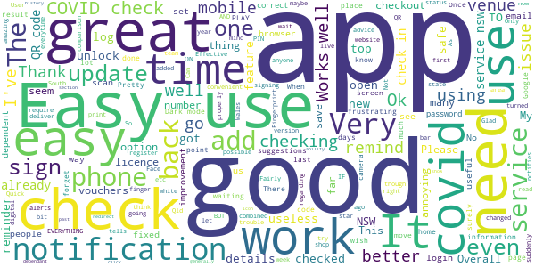
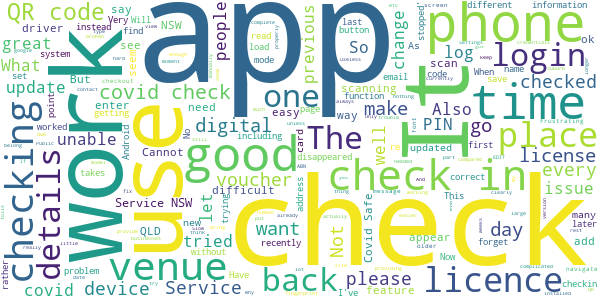
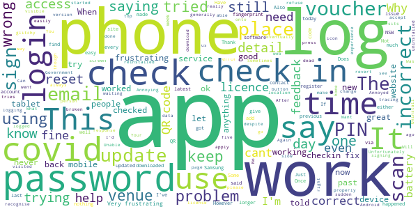
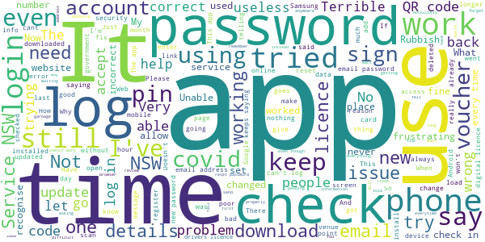

# Service NSW
App version ``6.11.0 (277204)``

Analyzed with [covid-apps-observer](http://github.com/covid-apps-observer) project, version ``0.1``

## App overview
| | |
|-------------------------|-------------------------| 
| **Name**&nbsp;&nbsp;&nbsp;&nbsp;&nbsp;&nbsp;&nbsp;&nbsp;&nbsp;&nbsp;&nbsp;&nbsp;&nbsp;&nbsp;&nbsp;&nbsp;&nbsp;&nbsp;&nbsp;&nbsp;&nbsp;&nbsp;&nbsp;&nbsp;&nbsp;&nbsp;&nbsp;&nbsp;&nbsp;&nbsp;&nbsp;&nbsp;&nbsp;&nbsp;&nbsp;&nbsp;&nbsp;&nbsp;&nbsp;&nbsp;  | Service NSW |
| **Unique identifier** | au.gov.nsw.service |
| **Link to Google Play** | [https://play.google.com/store/apps/details?id=au.gov.nsw.service](https://play.google.com/store/apps/details?id=au.gov.nsw.service) |
| **Summary**  | Digital licences, registrations, fines and more |
| **Privacy policy** | [http://www.service.nsw.gov.au/privacy](http://www.service.nsw.gov.au/privacy) |
| **Latest version** | 6.11.0 (277204) |
| **Last update** | 2021-05-28 08:33:20 |
| **Recent changes** | Thanks for using the Service NSW mobile app! We used your feedback to make these improvements: • You can now register your interest for the Covid Vaccination. Go to the COVID-19 Resources section. • Made it easier to remove your partner&#39;s licence from your account and add your own • Added a &#39;Refresh licence details&#39; feature to ensure you have the most up to date information • Automatically launch the keyboard when landing on the PIN screen • Enhanced the school check-in process |
| **Installs**  | 1,000,000+ |
| **Category** | Tools |
| **First release** | Dec 7, 2014 |
| **Size**  | 29M |
| **Supported Android version**  | 6.0 and up |

### Description
> The official Service NSW app, making it easier to access government services. 
 <b>Digital licences and credentials</b>
 Access the following digital licences and credentials, with more to come: 
 • Driver Licence 
 • RSA/RCG Competency Card 
 • Working with Children Check 
 • Recreational Fishing Licence 
 • Boat Driver Licence.
 <b>COVID Safe Check-in</b> 
 • Quick, contactless check in at COVID Safe venues 
 • Point your device camera at the COVID Safe QR Code to get started 
 • Save your details for a faster check in next time. 
 • Read our Privacy Collection Statement: https://www.service.nsw.gov.au/covid-safe-check-privacy-collection-statement
 <b>Useful tools and services</b>
 • Verify a Digital Driver Licence via our licence checker 
 • Check or renew a registration 
 • Sign into licensed venues.
 <b>Fines and demerits</b>
 • View and pay your fines 
 • View your demerits.
 <b>COVID-19 resources</b>
 • Access COVID-19 statistics by postcode 
 • Access our COVID-19 Assistance Finder with benefits, rebates and concessions. 
 <b>Tell us what you think</b>
 • Help us help you! We’re always working on a better, stronger, faster app. 
 • Share what you’d like to see in the app: we use your feedback to continuously improve the app experience.

### User interface
The developers of the app provide the following screenshots in the Google play store.
| | | |
|:-------------------------:|:-------------------------:|:-------------------------:|
 |   |   |   | 
 |   |  

## Development team
In the following we report the main information provided by the development team in the Google play store.

| | |
|-------------------------|-------------------------|
| **Developer**  | Service NSW |
| **Website**  | [https://www.service.nsw.gov.au/mobile-app      ](https://www.service.nsw.gov.au/mobile-app      ) |
| **Email** | mobileapp@service.nsw.gov.au |
| **Physical address**  | - |
| **Other developed apps**  | [https://play.google.com/store/apps/developer?id=Service+NSW](https://play.google.com/store/apps/developer?id=Service+NSW) |

## Android support

| | |
|-------------------------|-------------------------|
| **Declared target Android version**  | Android10, version 10 (API level 29) |
| **Effective target Android version**  | Android10, version 10 (API level 29) |
| **Minimum supported Android version**  | Marshmallow, version 6.0 (API level 23) |
| **Maximum target Android version**  | - |

The larger the difference between the minimum and maximum supported Android versions, the better. A larger difference means a wider audience. For example, old phones have a very low Android version, so a high minimum supported Android version means that the app cannot be used by users with old phones, thus leading to accessibility problems. 

## Requested permissions

In the following we report the complete list of the permissions requested by the app. 

| **Permission** | **Protection level** | **Description** | 
|-------------------------|-------------------------|-------------------------|
 **android.permission ACCESS_NETWORK_STATE** | Normal | Allows applications to access information about networks. 
 **android.permission ACCESS_WIFI_STATE** | Normal | Allows applications to access information about Wi-Fi networks. 
 **android.permission CAMERA** | :warning:**Dangerous** | Required to be able to access the camera device. 
 **android.permission INTERNET** | Normal | Allows applications to open network sockets. 
 **android.permission READ_APP_BADGE** | - | - 
 **android.permission USE_FINGERPRINT** | Normal | This constant was deprecated in API level 28. Applications should request USE_BIOMETRIC instead 
 **android.permission VIBRATE** | Normal | Allows access to the vibrator. 
 **android.permission WAKE_LOCK** | Normal | Allows using PowerManager WakeLocks to keep processor from sleeping or screen from dimming. 
 **com.anddoes.launcher.permission UPDATE_COUNT** | - | - 
 **com.android.vending CHECK_LICENSE** | - | - 
 **com.google.android.c2dm.permission RECEIVE** | - | - 
 **com.google.android.finsky.permission BIND_GET_INSTALL_REFERRER_SERVICE** | - | - 
 **com.htc.launcher.permission READ_SETTINGS** | - | - 
 **com.htc.launcher.permission UPDATE_SHORTCUT** | - | - 
 **com.huawei.android.launcher.permission CHANGE_BADGE** | - | - 
 **com.huawei.android.launcher.permission READ_SETTINGS** | - | - 
 **com.huawei.android.launcher.permission WRITE_SETTINGS** | - | - 
 **com.majeur.launcher.permission UPDATE_BADGE** | - | - 
 **com.oppo.launcher.permission READ_SETTINGS** | - | - 
 **com.oppo.launcher.permission WRITE_SETTINGS** | - | - 
 **com.sec.android.provider.badge.permission READ** | - | - 
 **com.sec.android.provider.badge.permission WRITE** | - | - 
 **com.sonyericsson.home.permission BROADCAST_BADGE** | - | - 
 **com.sonymobile.home.permission PROVIDER_INSERT_BADGE** | - | - 
 **me.everything.badger.permission BADGE_COUNT_READ** | - | - 
 **me.everything.badger.permission BADGE_COUNT_WRITE** | - | - 

## Mentioned servers

| **Server** | **Registrant** | **Registrant country** | **Creation date** | 
|-------------------------|-------------------------|-------------------------|-------------------------|
 | apache.org | The Apache Software Foundation | :us: US | 1995-04-11 04:00:00 |
 | xml.org | OASIS Open | :us: US | 1997-02-03 05:00:00 |
 | w3.org | W3C | :us: US | 1994-07-06 04:00:00 |
 | purl.org | Internet Archive | :us: US | 1996-01-01 05:00:00 |
 | adobe.com | Adobe Inc. | :us: US | 1986-11-17 05:00:00 |
 | android.com | Google LLC | :us: US | 1997-06-23 04:00:00 |
 | googlesyndication.com | Google LLC | :us: US | 2003-01-21 06:17:24 |
 | google.com | Google LLC | :us: US | 1997-09-15 04:00:00 |
 | app-measurement.com | Google LLC | :us: US | 2015-06-19 20:13:31 |
 | googleapis.com | Google LLC | :us: US | 2005-01-25 17:52:26 |
 | googleapis.com | Google LLC | :us: US | 2005-01-25 17:52:26 |
 | iptc.org | Whois Privacy Service | :us: US | 1995-12-27 05:00:00 |
 | useplus.org | PLUS COALITION | :us: US | 2003-11-18 19:31:25 |
 | npes.org | NPES | :us: US | 1996-01-30 05:00:00 |
 | aiim.org | Association for Information and Image Management International | :us: US | 1995-10-18 04:00:00 |
 | googleapis.com | Google LLC | :us: US | 2005-01-25 17:52:26 |
 | googleapis.com | Google LLC | :us: US | 2005-01-25 17:52:26 |
 | googleadservices.com | Google LLC | :us: US | 2003-06-19 16:34:53 |

## Security analysis 

Below we report the main security warnings raised by our execution of the [Androwarn](https://github.com/maaaaz/androwarn) security analysis tool.

**Telephony identifiers leakage**
> - This application reads the numeric name (MCC+MNC) of current registered operator 
> - This application reads the operator name 
> - This application reads the phone number string for line 1, for example, the MSISDN for a GSM phone 
> - This application reads the unique device ID, i.e the IMEI for GSM and the MEID or ESN for CDMA phones 

**Location lookup**
> - This application reads location information from all available providers (WiFi, GPS etc.) 

**Connection interfaces exfiltration**
> - This application reads details about the currently active data network 
> - This application tries to find out if the currently active data network is metered 

**Audio video eavesdropping**
> - This application records audio from the 'CAMCORDER' source  
> - This application records audio from the 'MIC' source  
> - This application captures video from the 'CAMERA' source 
> - This application captures video from the 'SURFACE' source 

**Suspicious connection establishment**
> - This application opens a Socket and connects it to the remote address '' on the 'N/A' port  
> - This application opens a Socket and connects it to the remote address 'Ljava/lang/StringBuilder;->toString()Ljava/lang/String;' on the ': connect, resolve' port  
> - This application opens a Socket and connects it to the remote address 'Ljava/lang/StringBuilder;->toString()Ljava/lang/String;' on the 'N/A' port  
> - This application opens a Socket and connects it to the remote address 'Ljava/net/Proxy;->type()Ljava/net/Proxy$Type;' on the 'N/A' port  
> - This application opens a Socket and connects it to the remote address 'Network subsystem is unavailable' on the 'N/A' port  
> - This application opens a Socket and connects it to the remote address 'timeout' on the 'N/A' port  

**Pim data leakage**
> - This application accesses data stored in the clipboard 

**Code execution**
> - This application loads a native library 
> - This application loads a native library: 'Ljava/util/Iterator;->next()Ljava/lang/Object;' 
> - This application loads a native library: 'log' 
> - This application loads a native library: 'sentry' 
> - This application loads a native library: 'sentry-android' 
> - This application loads a native library: 'tool-checker' 
> - This application executes a UNIX command 

## User ratings and reviews

Below we provide information about how end users are reacting to the app in terms of ratings and reviews in the Google Play store.

### Ratings

The Service NSW app has been installed by more than **1000000** times. At this time, **6977** rated the app and its average score is **3.8746438**. Below we show the distribution of the ratings across the usual star-based rating of Google Play

:star::star::star::star::star:: 3927

:star::star::star::star:: 1073

:star::star::star:: 437

:star::star:: 258

:star:: 1282

### Reviews 

#### 5-star reviews

> Good  :date: __2021-06-11 08:24:16__

> Very impressed with staff and their willingness to help older customers.  :date: __2021-06-11 07:41:39__

> My drivers licence disappeared after last update. Won't be updating again.  :date: __2021-06-11 03:10:04__

> Working well  :date: __2021-06-11 02:42:39__

> Best  :date: __2021-06-10 08:03:43__

> Great app, looks good, very easy navigation and all services easy to find  :date: __2021-06-09 15:04:11__

> Very simple to use when I visited NSW recently.  :date: __2021-06-09 08:23:58__

> It is Great for me. Just wondering what Samsung (or I Phone) 'operating system' is needed for the App, mainly for covid sign in/ out? My phone works great (S10) but both my parents have older smart phones. What running/ operating system will they need?  :date: __2021-06-09 07:31:58__

> Always ready to help an old bloke like me  :date: __2021-06-09 06:15:44__

> Great app easy to use. I like the idea of being g able to check out of the venue.  :date: __2021-06-09 04:13:47__

#### 4-star reviews

> Definitely a bonus during the covid year  :date: __2021-06-11 08:58:36__

> User friendly  :date: __2021-06-10 09:10:28__

> Easy to use, no problems  :date: __2021-06-09 21:43:08__

> Good  :date: __2021-06-09 07:30:49__

> Easy to use, all good from me.  :date: __2021-06-09 01:48:24__

> Very good  :date: __2021-06-08 21:34:01__

> Better than the useless services vic app.  :date: __2021-06-08 08:10:22__

> Easy to use  :date: __2021-06-08 07:02:47__

> Very good in reliability. Fairly easy to use too.  :date: __2021-06-08 05:50:04__

> Works well  :date: __2021-06-08 04:32:42__

#### 3-star reviews

> Won't let me check in  :date: __2021-06-11 03:03:50__

> Great facility but too many steps to check in and out. Please use it and seek it to be streamlined It is vital.  :date: __2021-06-10 11:49:10__

> Seems a little clumpsy to use. Qld App much easier to use. Cannot view history apart from the previous use. As an interstater, it has a lot of functionality that just gets in the way of an easy to use covid app.  :date: __2021-06-08 11:37:59__

> Was very clunky when compared to ACT and South Australia app.  :date: __2021-06-08 05:33:59__

> N/A  :date: __2021-06-08 04:38:39__

> Not a resident of NSW, but it does not distinguish clearly for me, between the features I must use when visiting and those for which I am not eligible.  :date: __2021-06-08 02:44:48__

> Not include every thing  :date: __2021-06-08 02:39:43__

> See how the new update goes.  :date: __2021-06-08 02:22:50__

> Don't know enough about it  :date: __2021-06-08 01:40:05__

> Just updated and now my license and white card have disappeared. Tried to re-add my license and it just says 'checking your details' and times out.  :date: __2021-06-08 01:32:19__

#### 2-star reviews

> Licence was on the app untill update now it just sits there trying to link my account which is linked because the vouchers are shown. Churned through 50%of my phones battery and made phone super hot trying to do this.  :date: __2021-06-08 01:25:56__

> The app keeps rejecting my login details when I'm adding my license. Frustrating! I know my details are correct and have reset my phone (samsung A52) and still no luck.  :date: __2021-06-05 03:25:33__

> Sign in through mobile? Why not posible?  :date: __2021-06-03 01:42:14__

> Annoyed, I CAN'T now find my 4 x $25 vouchers after travelling on QLD, WHY?  :date: __2021-06-01 06:40:27__

> Password reset, when trying to reset password, i change my password, save and log in button, It then says wrong password? What do i do?  :date: __2021-05-25 12:32:17__

> Can't the process take any longer!! Want to register my license and after 5 mints of waiting on a dead screen of loading gives me error 🤷‍♂️.  :date: __2021-05-24 10:29:34__

> Tried to log in and it keeps saying my code is wrong when it isn't. I have the latest version and still the same  :date: __2021-05-18 09:35:00__

> Won't recognize other cards like Medicare or photo I.d  :date: __2021-05-17 08:03:00__

> App is generally ok to use except the pin login is slow. Unfortunately it uses all my battery just for a few covid check ins so is unfunctional while on the move. I will have to delete amd revert to web browser  :date: __2021-05-15 18:36:44__

> The app has generally been good to use, however it is slow to recognise a fingerprint or pin & it also has an abnormally high battery usage, draining around 17% each day after just a check-in or two.  :date: __2021-05-12 13:47:35__

#### 1-star reviews

> this app is absolutely a waste of tax payers money - it gives u no opportunity to go bavk & fotth on different sites to be able to read the code submitted by Service NSW then return to page seeking the verification code - & round & around u go being cut off for hours after resubmision of code not accepted! Big mistake in not allowing code acceptance after leaving page - no other way to get code but to leave site asking for code!! Very stupid setup!! - typical govt rubbish made to lock users OUT!  :date: __2021-06-11 05:26:30__

> Terrible  :date: __2021-06-11 03:23:34__

> The "Simple login" feature is rubbish. If it misreads your finger print a couple of times at the beginnig, the authentication server comes up with the standard error message that it isn't available at this time. So I have turned the stupid thing off. You would think that the developers would have tested this.  :date: __2021-06-10 11:35:39__

> Unusable with latest version. Password reset doesn't work. And stop telling people to use the the network provided time cos that's not the root cause. Fix your back-end system. Guess what everything was working until your latest update can't out  :date: __2021-06-08 14:02:12__

> Tried to update the app and it went on and one gave up.  :date: __2021-06-08 08:29:32__

> Government scum! A lot of 3rd world human garbage work here.  :date: __2021-06-08 07:18:28__

> Is there a problem with this app, went to update, still waiting after 15 mins  :date: __2021-06-08 05:42:34__

> Very poor app told to use this app for D&E vouchers after THREE months am still awaiting would rate this app minus if possiable  :date: __2021-06-08 05:00:20__

> has been admitted its NOT secure,  :date: __2021-06-08 01:55:20__

> Useless and keeps halting  :date: __2021-06-08 01:41:07__

