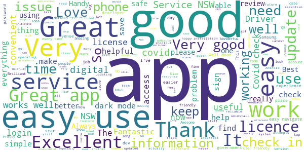

# Service NSW
App version ``6.11.0 (277204)``

Analyzed with [covid-apps-observer](http://github.com/covid-apps-observer) project, version ``0.1``

## App overview
| | |
|-------------------------|-------------------------| 
| **Name**&nbsp;&nbsp;&nbsp;&nbsp;&nbsp;&nbsp;&nbsp;&nbsp;&nbsp;&nbsp;&nbsp;&nbsp;&nbsp;&nbsp;&nbsp;&nbsp;&nbsp;&nbsp;&nbsp;&nbsp;&nbsp;&nbsp;&nbsp;&nbsp;&nbsp;&nbsp;&nbsp;&nbsp;&nbsp;&nbsp;&nbsp;&nbsp;&nbsp;&nbsp;&nbsp;&nbsp;&nbsp;&nbsp;&nbsp;&nbsp;  | Service NSW |
| **Unique identifier** | au.gov.nsw.service |
| **Link to Google Play** | [https://play.google.com/store/apps/details?id=au.gov.nsw.service](https://play.google.com/store/apps/details?id=au.gov.nsw.service) |
| **Summary**  | Digital licences, registrations, fines and more |
| **Privacy policy** | [http://www.service.nsw.gov.au/privacy](http://www.service.nsw.gov.au/privacy) |
| **Latest version** | 6.11.0 (277204) |
| **Last update** | 2021-05-28 08:33:20 |
| **Recent changes** | Thanks for using the Service NSW mobile app! We used your feedback to make these improvements: • You can now register your interest for the Covid Vaccination. Go to the COVID-19 Resources section. • Made it easier to remove your partner&#39;s licence from your account and add your own • Added a &#39;Refresh licence details&#39; feature to ensure you have the most up to date information • Automatically launch the keyboard when landing on the PIN screen • Enhanced the school check-in process |
| **Installs**  | 1,000,000+ |
| **Category** | Tools |
| **First release** | Dec 7, 2014 |
| **Size**  | 29M |
| **Supported Android version**  | 6.0 and up |

### Description
> The official Service NSW app, making it easier to access government services. 
 <b>Digital licences and credentials</b>
 Access the following digital licences and credentials, with more to come: 
 • Driver Licence 
 • RSA/RCG Competency Card 
 • Working with Children Check 
 • Recreational Fishing Licence 
 • Boat Driver Licence.
 <b>COVID Safe Check-in</b> 
 • Quick, contactless check in at COVID Safe venues 
 • Point your device camera at the COVID Safe QR Code to get started 
 • Save your details for a faster check in next time. 
 • Read our Privacy Collection Statement: https://www.service.nsw.gov.au/covid-safe-check-privacy-collection-statement
 <b>Useful tools and services</b>
 • Verify a Digital Driver Licence via our licence checker 
 • Check or renew a registration 
 • Sign into licensed venues.
 <b>Fines and demerits</b>
 • View and pay your fines 
 • View your demerits.
 <b>COVID-19 resources</b>
 • Access COVID-19 statistics by postcode 
 • Access our COVID-19 Assistance Finder with benefits, rebates and concessions. 
 <b>Tell us what you think</b>
 • Help us help you! We’re always working on a better, stronger, faster app. 
 • Share what you’d like to see in the app: we use your feedback to continuously improve the app experience.

### User interface
The developers of the app provide the following screenshots in the Google play store.
| | | |
|:-------------------------:|:-------------------------:|:-------------------------:|
 |   |   |   | 
 |   |  

## Development team
In the following we report the main information provided by the development team in the Google play store.

| | |
|-------------------------|-------------------------|
| **Developer**  | Service NSW |
| **Website**  | [https://www.service.nsw.gov.au/mobile-app      ](https://www.service.nsw.gov.au/mobile-app      ) |
| **Email** | mobileapp@service.nsw.gov.au |
| **Physical address**  | - |
| **Other developed apps**  | [https://play.google.com/store/apps/developer?id=Service+NSW](https://play.google.com/store/apps/developer?id=Service+NSW) |

## Android support

| | |
|-------------------------|-------------------------|
| **Declared target Android version**  | Android10, version 10 (API level 29) |
| **Effective target Android version**  | Android10, version 10 (API level 29) |
| **Minimum supported Android version**  | Marshmallow, version 6.0 (API level 23) |
| **Maximum target Android version**  | - |

The larger the difference between the minimum and maximum supported Android versions, the better. A larger difference means a wider audience. For example, old phones have a very low Android version, so a high minimum supported Android version means that the app cannot be used by users with old phones, thus leading to accessibility problems. 

## Requested permissions

In the following we report the complete list of the permissions requested by the app. 

| **Permission** | **Protection level** | **Description** | 
|-------------------------|-------------------------|-------------------------|
 **android.permission ACCESS_NETWORK_STATE** | Normal | Allows applications to access information about networks. 
 **android.permission ACCESS_WIFI_STATE** | Normal | Allows applications to access information about Wi-Fi networks. 
 **android.permission CAMERA** | :warning:**Dangerous** | Required to be able to access the camera device. 
 **android.permission INTERNET** | Normal | Allows applications to open network sockets. 
 **android.permission READ_APP_BADGE** | - | - 
 **android.permission USE_FINGERPRINT** | Normal | This constant was deprecated in API level 28. Applications should request USE_BIOMETRIC instead 
 **android.permission VIBRATE** | Normal | Allows access to the vibrator. 
 **android.permission WAKE_LOCK** | Normal | Allows using PowerManager WakeLocks to keep processor from sleeping or screen from dimming. 
 **com.anddoes.launcher.permission UPDATE_COUNT** | - | - 
 **com.android.vending CHECK_LICENSE** | - | - 
 **com.google.android.c2dm.permission RECEIVE** | - | - 
 **com.google.android.finsky.permission BIND_GET_INSTALL_REFERRER_SERVICE** | - | - 
 **com.htc.launcher.permission READ_SETTINGS** | - | - 
 **com.htc.launcher.permission UPDATE_SHORTCUT** | - | - 
 **com.huawei.android.launcher.permission CHANGE_BADGE** | - | - 
 **com.huawei.android.launcher.permission READ_SETTINGS** | - | - 
 **com.huawei.android.launcher.permission WRITE_SETTINGS** | - | - 
 **com.majeur.launcher.permission UPDATE_BADGE** | - | - 
 **com.oppo.launcher.permission READ_SETTINGS** | - | - 
 **com.oppo.launcher.permission WRITE_SETTINGS** | - | - 
 **com.sec.android.provider.badge.permission READ** | - | - 
 **com.sec.android.provider.badge.permission WRITE** | - | - 
 **com.sonyericsson.home.permission BROADCAST_BADGE** | - | - 
 **com.sonymobile.home.permission PROVIDER_INSERT_BADGE** | - | - 
 **me.everything.badger.permission BADGE_COUNT_READ** | - | - 
 **me.everything.badger.permission BADGE_COUNT_WRITE** | - | - 

## Mentioned servers

| **Server** | **Registrant** | **Registrant country** | **Creation date** | 
|-------------------------|-------------------------|-------------------------|-------------------------|
 | apache.org | The Apache Software Foundation | :us: US | 1995-04-11 04:00:00 |
 | xml.org | OASIS Open | :us: US | 1997-02-03 05:00:00 |
 | w3.org | W3C | :us: US | 1994-07-06 04:00:00 |
 | purl.org | Internet Archive | :us: US | 1996-01-01 05:00:00 |
 | adobe.com | Adobe Inc. | :us: US | 1986-11-17 05:00:00 |
 | android.com | Google LLC | :us: US | 1997-06-23 04:00:00 |
 | googlesyndication.com | Google LLC | :us: US | 2003-01-21 06:17:24 |
 | google.com | Google LLC | :us: US | 1997-09-15 04:00:00 |
 | app-measurement.com | Google LLC | :us: US | 2015-06-19 20:13:31 |
 | googleapis.com | Google LLC | :us: US | 2005-01-25 17:52:26 |
 | googleapis.com | Google LLC | :us: US | 2005-01-25 17:52:26 |
 | iptc.org | Whois Privacy Service | :us: US | 1995-12-27 05:00:00 |
 | useplus.org | PLUS COALITION | :us: US | 2003-11-18 19:31:25 |
 | npes.org | NPES | :us: US | 1996-01-30 05:00:00 |
 | aiim.org | Association for Information and Image Management International | :us: US | 1995-10-18 04:00:00 |
 | googleapis.com | Google LLC | :us: US | 2005-01-25 17:52:26 |
 | googleapis.com | Google LLC | :us: US | 2005-01-25 17:52:26 |
 | googleadservices.com | Google LLC | :us: US | 2003-06-19 16:34:53 |

## Security analysis 

Below we report the main security warnings raised by our execution of the [Androwarn](https://github.com/maaaaz/androwarn) security analysis tool.

**Telephony identifiers leakage**
> - This application reads the numeric name (MCC+MNC) of current registered operator 
> - This application reads the operator name 
> - This application reads the phone number string for line 1, for example, the MSISDN for a GSM phone 
> - This application reads the unique device ID, i.e the IMEI for GSM and the MEID or ESN for CDMA phones 

**Location lookup**
> - This application reads location information from all available providers (WiFi, GPS etc.) 

**Connection interfaces exfiltration**
> - This application reads details about the currently active data network 
> - This application tries to find out if the currently active data network is metered 

**Audio video eavesdropping**
> - This application records audio from the 'CAMCORDER' source  
> - This application records audio from the 'MIC' source  
> - This application captures video from the 'CAMERA' source 
> - This application captures video from the 'SURFACE' source 

**Suspicious connection establishment**
> - This application opens a Socket and connects it to the remote address '' on the 'N/A' port  
> - This application opens a Socket and connects it to the remote address 'Ljava/lang/StringBuilder;->toString()Ljava/lang/String;' on the ': connect, resolve' port  
> - This application opens a Socket and connects it to the remote address 'Ljava/lang/StringBuilder;->toString()Ljava/lang/String;' on the 'N/A' port  
> - This application opens a Socket and connects it to the remote address 'Ljava/net/Proxy;->type()Ljava/net/Proxy$Type;' on the 'N/A' port  
> - This application opens a Socket and connects it to the remote address 'Network subsystem is unavailable' on the 'N/A' port  
> - This application opens a Socket and connects it to the remote address 'timeout' on the 'N/A' port  

**Pim data leakage**
> - This application accesses data stored in the clipboard 

**Code execution**
> - This application loads a native library 
> - This application loads a native library: 'Ljava/util/Iterator;->next()Ljava/lang/Object;' 
> - This application loads a native library: 'log' 
> - This application loads a native library: 'sentry' 
> - This application loads a native library: 'sentry-android' 
> - This application loads a native library: 'tool-checker' 
> - This application executes a UNIX command 

## User ratings and reviews

Below we provide information about how end users are reacting to the app in terms of ratings and reviews in the Google Play store.

### Ratings

The Service NSW app has been installed by more than **1000000** times. At this time, **6977** rated the app and its average score is **3.8746438**. Below we show the distribution of the ratings across the usual star-based rating of Google Play

:star::star::star::star::star:: 3927

:star::star::star::star:: 1073

:star::star::star:: 437

:star::star:: 258

:star:: 1282

### Reviews 

#### 5-star reviews

> User friendly.  :date: __2021-06-06 11:29:59__

> Very easy to use  :date: __2021-06-06 00:19:28__

> Help your common person  :date: __2021-06-05 06:05:58__

> Makes everything a lot easier  :date: __2021-06-04 10:08:25__

> Very GAY  :date: __2021-06-04 06:26:45__

> Great  :date: __2021-06-04 03:54:47__

> Updating my review ... issue was with the device deregister ... old device was still registered... was fixed in less than a week  :date: __2021-06-03 02:39:37__

> Good service  :date: __2021-06-02 22:25:30__

> Good  :date: __2021-06-02 12:27:05__

> EASY & PEACE OF MIND!!!  :date: __2021-06-02 08:37:11__

#### 4-star reviews

> Its way better than Service Victoria App. Requires a bit of improvement though.  :date: __2021-06-05 04:47:40__

> Easy to use  :date: __2021-06-02 04:08:24__

> Excellent  :date: __2021-05-28 10:45:57__

> Effective and convenient app to keep us in this state safe.  :date: __2021-05-27 12:40:15__

> Simple to use  :date: __2021-05-27 10:39:45__

> Ok so I think I've figured out the add dependent for covid check-in but I'll have to wait til I need to use it again to see if it works. Fingers crossed.  :date: __2021-05-27 04:02:57__

> Easy to register  :date: __2021-05-26 21:44:39__

> Directions easy to follow  :date: __2021-05-26 03:15:41__

> Great app all over, very useful. However I don't get notifications to remind me to check out of a venue unless I go back into the app itself first, which defeats the purpose. Also, I've noticed many places have difficulty scanning the Dine & Discover vouchers when the app is set to dark mode. Easily fixed by switching back to light, but worth mentioning for possible fixes.  :date: __2021-05-23 12:50:50__

> It's a great app  :date: __2021-05-21 11:53:39__

#### 3-star reviews

> The app seems to have stopped working. The last 3 or 4 times I have tried to use, it said that it was unable to check in at that time. The QR code seemed to have as the venue name has appeared. Also, the vouchers do not always appear.  :date: __2021-06-05 02:07:55__

> Whenever i have to add my partner i have to type the whole thing is there a way it can remember him  :date: __2021-06-05 01:01:52__

> Is there a app to check tolls I looked and can only find the service nsw app and nothing in there is to help check my tolls  :date: __2021-05-31 00:40:57__

> Easy way to carry your licence credentials, however getting them can be a little difficult.  :date: __2021-05-25 22:08:17__

> The information on page is half covered over and hard to read top part can not be read  :date: __2021-05-24 05:06:35__

> Hi Service NSW Development Team, Will be great if you can add the login details inside the app, so we can view our email and mobile number that we use. Thanks!  :date: __2021-05-16 16:06:32__

> It works great then after a month it won't focus on code, I have uninstall the install to get it to work again??  :date: __2021-05-12 11:43:49__

> Functional improvements needed * login: takes a lot longer than it should because keypad doesn't immediately pop up. Makes people in lines impatient, and I bet some people don't checkin because of this hassle * Manual edits for check-in Covid Safe function: occasionally I need to update my checkin/out times but I can't seem to. This would give more accuracy to Health contact tracers.  :date: __2021-05-11 04:08:27__

> Generally ok, constant issues with covid-19 check-ins as well as inconvenient de-linking of my driver's license.  :date: __2021-05-08 06:14:23__

> Gr8 app for checkin when rego due ,demerits an vouchers available etc an digital license if u forget ya wallet  :date: __2021-05-07 03:35:16__

#### 2-star reviews

> The app keeps rejecting my login details when I'm adding my license. Frustrating! I know my details are correct and have reset my phone (samsung A52) and still no luck.  :date: __2021-06-05 03:25:33__

> Sign in through mobile? Why not posible?  :date: __2021-06-03 01:42:14__

> Annoyed, I CAN'T now find my 4 x $25 vouchers after travelling on QLD, WHY?  :date: __2021-06-01 06:40:27__

> Password reset, when trying to reset password, i change my password, save and log in button, It then says wrong password? What do i do?  :date: __2021-05-25 12:32:17__

> Can't the process take any longer!! Want to register my license and after 5 mints of waiting on a dead screen of loading gives me error 🤷‍♂️.  :date: __2021-05-24 10:29:34__

> Tried to log in and it keeps saying my code is wrong when it isn't. I have the latest version and still the same  :date: __2021-05-18 09:35:00__

> Won't recognize other cards like Medicare or photo I.d  :date: __2021-05-17 08:03:00__

> App is generally ok to use except the pin login is slow. Unfortunately it uses all my battery just for a few covid check ins so is unfunctional while on the move. I will have to delete amd revert to web browser  :date: __2021-05-15 18:36:44__

> The app has generally been good to use, however it is slow to recognise a fingerprint or pin & it also has an abnormally high battery usage, draining around 17% each day after just a check-in or two.  :date: __2021-05-12 13:47:35__

> never stays on my phone  :date: __2021-05-02 07:59:50__

#### 1-star reviews

> Won't save my password. Won't log in when I use the correct one.  :date: __2021-06-06 05:43:56__

> Doesn't work  :date: __2021-06-05 09:31:46__

> I can't get into it. I keep getting the message "your device is not using standard software" I have reinstalled it which worked for a couple of seconds then went again.  :date: __2021-06-05 06:52:08__

> Won't allow me to sign-in.  :date: __2021-06-04 10:19:27__

> It is always down and and off line, unresponsive and difficult to use  :date: __2021-06-04 02:18:57__

> Used to be good now can't check out that will help a lot with tracking when it shows you at the pub for 4 days and you can't check in anywhere else  :date: __2021-06-03 08:26:58__

> Unable to get licence on app, keeps going to a home screen. Have been into branch and they made sure phone number and email address were correct as that is sometimes the problem, but that wasn't it. Have uninstaller and re installed.  :date: __2021-06-02 22:16:33__

> The developers and project managers who worked on this app should feel embarrassed and consider a career change to something involving crayons.  :date: __2021-06-01 06:31:21__

> NSW health Croydon Oral clinic does not use this app but it's part of nsw government health. They using their own and you need iphone. Oral clinic which is part of nsw health wasting public money on new app?,unbelievable. This is crazy,every business uses service nsw app but government health doesnt. Nowhere to complain or talk to anyone,receptionist doesnt know why and check in manually.  :date: __2021-06-01 01:32:40__

> Trying to reset password, doesn't seem to work ! Sends you to a website then app doesn't recognise new one. Rubbish and slow 31 05 21 - it's noted the response doesn't relate to the issue !  :date: __2021-05-31 10:47:33__

