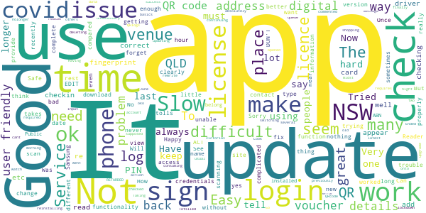

# Service NSW
App version ``6.12.0 (287628)``

Analyzed with [covid-apps-observer](http://github.com/covid-apps-observer) project, version ``0.1``

## App overview
| | |
|-------------------------|-------------------------| 
| **Name**&nbsp;&nbsp;&nbsp;&nbsp;&nbsp;&nbsp;&nbsp;&nbsp;&nbsp;&nbsp;&nbsp;&nbsp;&nbsp;&nbsp;&nbsp;&nbsp;&nbsp;&nbsp;&nbsp;&nbsp;&nbsp;&nbsp;&nbsp;&nbsp;&nbsp;&nbsp;&nbsp;&nbsp;&nbsp;&nbsp;&nbsp;&nbsp;&nbsp;&nbsp;&nbsp;&nbsp;&nbsp;&nbsp;&nbsp;&nbsp;  | Service NSW |
| **Unique identifier** | au.gov.nsw.service |
| **Link to Google Play** | [https://play.google.com/store/apps/details?id=au.gov.nsw.service](https://play.google.com/store/apps/details?id=au.gov.nsw.service) |
| **Summary**  | Digital licences, registrations, fines and more |
| **Privacy policy** | [http://www.service.nsw.gov.au/privacy](http://www.service.nsw.gov.au/privacy) |
| **Latest version** | 6.12.0 (287628) |
| **Last update** | 2021-06-11 08:46:25 |
| **Recent changes** | Thanks for using the Service NSW mobile app! We used your feedback to make these improvements: • Introducing COVID Safe Check-in history. You can now view your 28 day check-in history in COVID Safe Check-in. Log in to your MyServiceNSW account and tap on the new &#39;History&#39; tab • Made it easier to use COVID Safe Check-in if something goes wrong • Behind the scenes changes to improve our motor vehicle services |
| **Installs**  | 1,000,000+ |
| **Category** | Tools |
| **First release** | Dec 7, 2014 |
| **Size**  | 29M |
| **Supported Android version**  | 6.0 and up |

### Description
> The official Service NSW app, making it easier to access government services. 
 <b>Digital licences and credentials</b>
 Access the following digital licences and credentials, with more to come: 
 • Driver Licence 
 • RSA/RCG Competency Card 
 • Working with Children Check 
 • Recreational Fishing Licence 
 • Boat Driver Licence.
 <b>COVID Safe Check-in</b> 
 • Quick, contactless check in at COVID Safe venues 
 • Point your device camera at the COVID Safe QR Code to get started 
 • Save your details for a faster check in next time. 
 • Read our Privacy Collection Statement: https://www.service.nsw.gov.au/covid-safe-check-privacy-collection-statement
 <b>Useful tools and services</b>
 • Verify a Digital Driver Licence via our licence checker 
 • Check or renew a registration 
 • Sign into licensed venues.
 <b>Fines and demerits</b>
 • View and pay your fines 
 • View your demerits.
 <b>COVID-19 resources</b>
 • Access COVID-19 statistics by postcode 
 • Access our COVID-19 Assistance Finder with benefits, rebates and concessions. 
 <b>Tell us what you think</b>
 • Help us help you! We’re always working on a better, stronger, faster app. 
 • Share what you’d like to see in the app: we use your feedback to continuously improve the app experience.

### User interface
The developers of the app provide the following screenshots in the Google play store.
| | | |
|:-------------------------:|:-------------------------:|:-------------------------:|
 |   |   |   | 
 |   |  

## Development team
In the following we report the main information provided by the development team in the Google play store.

| | |
|-------------------------|-------------------------|
| **Developer**  | Service NSW |
| **Website**  | [https://www.service.nsw.gov.au/mobile-app      ](https://www.service.nsw.gov.au/mobile-app      ) |
| **Email** | mobileapp@service.nsw.gov.au |
| **Physical address**  | - |
| **Other developed apps**  | [https://play.google.com/store/apps/developer?id=Service+NSW](https://play.google.com/store/apps/developer?id=Service+NSW) |

## Android support

| | |
|-------------------------|-------------------------|
| **Declared target Android version**  | - |
| **Effective target Android version**  | - |
| **Minimum supported Android version**  | Marshmallow, version 6.0 (API level 23) |
| **Maximum target Android version**  | - |

The larger the difference between the minimum and maximum supported Android versions, the better. A larger difference means a wider audience. For example, old phones have a very low Android version, so a high minimum supported Android version means that the app cannot be used by users with old phones, thus leading to accessibility problems. 

## Requested permissions

In the following we report the complete list of the permissions requested by the app. 

| **Permission** | **Protection level** | **Description** | 
|-------------------------|-------------------------|-------------------------|
 **android.permission ACCESS_NETWORK_STATE** | Normal | Allows applications to access information about networks. 
 **android.permission ACCESS_WIFI_STATE** | Normal | Allows applications to access information about Wi-Fi networks. 
 **android.permission CAMERA** | :warning:**Dangerous** | Required to be able to access the camera device. 
 **android.permission INTERNET** | Normal | Allows applications to open network sockets. 
 **android.permission READ_APP_BADGE** | - | - 
 **android.permission USE_FINGERPRINT** | Normal | This constant was deprecated in API level 28. Applications should request USE_BIOMETRIC instead 
 **android.permission VIBRATE** | Normal | Allows access to the vibrator. 
 **android.permission WAKE_LOCK** | Normal | Allows using PowerManager WakeLocks to keep processor from sleeping or screen from dimming. 
 **com.anddoes.launcher.permission UPDATE_COUNT** | - | - 
 **com.android.vending CHECK_LICENSE** | - | - 
 **com.google.android.c2dm.permission RECEIVE** | - | - 
 **com.google.android.finsky.permission BIND_GET_INSTALL_REFERRER_SERVICE** | - | - 
 **com.htc.launcher.permission READ_SETTINGS** | - | - 
 **com.htc.launcher.permission UPDATE_SHORTCUT** | - | - 
 **com.huawei.android.launcher.permission CHANGE_BADGE** | - | - 
 **com.huawei.android.launcher.permission READ_SETTINGS** | - | - 
 **com.huawei.android.launcher.permission WRITE_SETTINGS** | - | - 
 **com.majeur.launcher.permission UPDATE_BADGE** | - | - 
 **com.oppo.launcher.permission READ_SETTINGS** | - | - 
 **com.oppo.launcher.permission WRITE_SETTINGS** | - | - 
 **com.sec.android.provider.badge.permission READ** | - | - 
 **com.sec.android.provider.badge.permission WRITE** | - | - 
 **com.sonyericsson.home.permission BROADCAST_BADGE** | - | - 
 **com.sonymobile.home.permission PROVIDER_INSERT_BADGE** | - | - 
 **me.everything.badger.permission BADGE_COUNT_READ** | - | - 
 **me.everything.badger.permission BADGE_COUNT_WRITE** | - | - 

## Mentioned servers

| **Server** | **Registrant** | **Registrant country** | **Creation date** | 
|-------------------------|-------------------------|-------------------------|-------------------------|
 | apache.org | The Apache Software Foundation | :us: US | 1995-04-11 04:00:00 |
 | xml.org | OASIS Open | :us: US | 1997-02-03 05:00:00 |
 | w3.org | W3C | :us: US | 1994-07-06 04:00:00 |
 | purl.org | Internet Archive | :us: US | 1996-01-01 05:00:00 |
 | adobe.com | Adobe Inc. | :us: US | 1986-11-17 05:00:00 |
 | android.com | Google LLC | :us: US | 1997-06-23 04:00:00 |
 | googlesyndication.com | Google LLC | :us: US | 2003-01-21 06:17:24 |
 | google.com | Google LLC | :us: US | 1997-09-15 04:00:00 |
 | app-measurement.com | Google LLC | :us: US | 2015-06-19 20:13:31 |
 | googleapis.com | Google LLC | :us: US | 2005-01-25 17:52:26 |
 | googleapis.com | Google LLC | :us: US | 2005-01-25 17:52:26 |
 | iptc.org | Whois Privacy Service | :us: US | 1995-12-27 05:00:00 |
 | useplus.org | PLUS COALITION | :us: US | 2003-11-18 19:31:25 |
 | npes.org | NPES | :us: US | 1996-01-30 05:00:00 |
 | aiim.org | Association for Information and Image Management International | :us: US | 1995-10-18 04:00:00 |
 | googleapis.com | Google LLC | :us: US | 2005-01-25 17:52:26 |
 | googleapis.com | Google LLC | :us: US | 2005-01-25 17:52:26 |
 | googleadservices.com | Google LLC | :us: US | 2003-06-19 16:34:53 |

## Security analysis 

Below we report the main security warnings raised by our execution of the [Androwarn](https://github.com/maaaaz/androwarn) security analysis tool.

**Telephony identifiers leakage**
> - This application reads the numeric name (MCC+MNC) of current registered operator 
> - This application reads the operator name 
> - This application reads the phone number string for line 1, for example, the MSISDN for a GSM phone 
> - This application reads the unique device ID, i.e the IMEI for GSM and the MEID or ESN for CDMA phones 

**Location lookup**
> - This application reads location information from all available providers (WiFi, GPS etc.) 

**Connection interfaces exfiltration**
> - This application reads details about the currently active data network 
> - This application tries to find out if the currently active data network is metered 

**Audio video eavesdropping**
> - This application records audio from the 'CAMCORDER' source  
> - This application records audio from the 'MIC' source  
> - This application captures video from the 'CAMERA' source 
> - This application captures video from the 'SURFACE' source 

**Suspicious connection establishment**
> - This application opens a Socket and connects it to the remote address ' returned no addresses for  ; port is out of range' on the 'N/A' port  
> - This application opens a Socket and connects it to the remote address '' on the 'N/A' port  
> - This application opens a Socket and connects it to the remote address 'Ljava/lang/StringBuilder;->toString()Ljava/lang/String;' on the 'N/A' port  
> - This application opens a Socket and connects it to the remote address 'Ljava/net/Proxy;->type()Ljava/net/Proxy$Type;' on the 'N/A' port  
> - This application opens a Socket and connects it to the remote address 'Network subsystem is unavailable' on the 'N/A' port  
> - This application opens a Socket and connects it to the remote address 'timeout' on the 'N/A' port  

**Pim data leakage**
> - This application accesses data stored in the clipboard 

**Code execution**
> - This application loads a native library 
> - This application loads a native library: 'Ljava/util/Iterator;->next()Ljava/lang/Object;' 
> - This application loads a native library: 'log' 
> - This application loads a native library: 'sentry' 
> - This application loads a native library: 'sentry-android' 
> - This application loads a native library: 'tool-checker' 
> - This application executes a UNIX command 

## User ratings and reviews

Below we provide information about how end users are reacting to the app in terms of ratings and reviews in the Google Play store.

### Ratings

The Service NSW app has been installed by more than **1000000** times. At this time, **7726** rated the app and its average score is **4.257772**. Below we show the distribution of the ratings across the usual star-based rating of Google Play

:star::star::star::star::star:: 4875

:star::star::star::star:: 1521

:star::star::star:: 460

:star::star:: 190

:star:: 680

### Reviews 

#### 5-star reviews

> Easy to use  :date: __2021-06-21 11:19:53__

> Good and easy  :date: __2021-06-21 06:26:38__

> Very good  :date: __2021-06-21 02:32:11__

> best design. simple use  :date: __2021-06-21 00:51:47__

> Teta1981  :date: __2021-06-20 23:32:10__

> Wonderful  :date: __2021-06-20 00:19:27__

> It works, what else do you need.  :date: __2021-06-19 18:31:38__

> I don't know how to apply for them I am.studying at Charles Sturt University in Wagga Wagga next week for Block Studies ..Do I meet the criteria to receive these vouchers? I am a resident of the A.C.T. and I am in Government Housing  :date: __2021-06-19 07:42:56__

> Great app. Easy to use and vary useful  :date: __2021-06-19 05:10:05__

> Have had issues logging into my App. at Westfield Miranda to register my being there. Very annoying!  :date: __2021-06-19 03:56:17__

#### 4-star reviews

> Would give 5 * but changed phone and it changed my whole experience  :date: __2021-06-20 02:09:46__

> Pretty good.  :date: __2021-06-18 19:10:01__

> I like the fact that all services are in one App. Thankyou  :date: __2021-06-18 14:09:41__

> Efficient now than it used to be. Helpful & pleasure to get what you need. Barbara Duley.  :date: __2021-06-18 09:14:07__

> Very good  :date: __2021-06-18 02:52:24__

> Nice app for anything related to service nsw. User friendly interface. Overall impressed.  :date: __2021-06-18 02:22:14__

> A good service, but like everything it can only improve  :date: __2021-06-18 01:09:25__

> Great, easy to use better than the Victorian app  :date: __2021-06-15 06:47:08__

> Good app with the best of intentions. 5 stars if an option to turn off the authentication screen could be added. Annoying that I have to unlock my phone, then unlock the app before I can Check In/Check Out. The double-authentication is quite redundant considering other "sensitive" apps like PayPal, MyTelstra etc simply retain your credentials between phone restarts.  :date: __2021-06-14 01:45:06__

> Cannot upload license like before.  :date: __2021-06-13 23:02:04__

#### 3-star reviews

> I keep having login issues with the app and I never have issues when I log in online.  :date: __2021-06-20 09:47:42__

> ok  :date: __2021-06-18 01:45:48__

> To complicated  :date: __2021-06-14 06:02:15__

> It's a good app but I keep running into issues where if I login with the fingerprint reader on my Samsung S21 Ultra, the fingerprint overlay doesn't disappear and blocks me using the rest of the app. The only way to fix it is to force close the app and re-open which is frustrating.  :date: __2021-06-13 05:44:05__

> No can do  :date: __2021-06-12 06:12:48__

> Update being annoying as it is not going to address straight away but back to app?? Have to scan more than once.  :date: __2021-06-12 05:32:08__

> User friendly  :date: __2021-06-12 02:49:31__

> Whilst the app has good intentions, I can not get the vouchers on my phone through the app, I also can not do the covid check in with it, it tells me to check the time on my phone.... the time is exactly the same as everybody else's. I think the app was intended for the more common type of phones such as Samsung, nokia and the such.  :date: __2021-06-12 01:57:17__

> Not very user friendly, takes too long to login etc.  :date: __2021-06-12 01:51:30__

> Fair  :date: __2021-06-12 01:35:43__

#### 2-star reviews

> OK  :date: __2021-06-20 04:11:14__

> More often than not, fails to work. "Unable to check in at this time". Very regular.  :date: __2021-06-20 00:33:01__

> Sometimes it feels like you are going around in circles and don't end up getting a answer for what you are looking for !  :date: __2021-06-17 15:21:38__

> Because I am waiting to update but it won't let me  :date: __2021-06-16 09:47:37__

> Every time I have too update app I use more data. So I lose more data . Then Telstra Optus, AGL,my bank all do the same thing. But still charge more for the privalige of using the apps.Thereby saving them sending paper accounts.  :date: __2021-06-12 01:14:54__

> Licence was on the app untill update now it just sits there trying to link my account which is linked because the vouchers are shown. Churned through 50%of my phones battery and made phone super hot trying to do this.  :date: __2021-06-08 01:25:56__

> The app keeps rejecting my login details when I'm adding my license. Frustrating! I know my details are correct and have reset my phone (samsung A52) and still no luck.  :date: __2021-06-05 03:25:33__

> Sign in through mobile? Why not posible?  :date: __2021-06-03 01:42:14__

> Annoyed, I CAN'T now find my 4 x $25 vouchers after travelling on QLD, WHY?  :date: __2021-06-01 06:40:27__

> Password reset, when trying to reset password, i change my password, save and log in button, It then says wrong password? What do i do?  :date: __2021-05-25 12:32:17__

#### 1-star reviews

> This app needs lots of work. Every update i need to re enter my license details.  :date: __2021-06-21 07:33:50__

> I don't need it  :date: __2021-06-20 12:17:27__

> great  :date: __2021-06-20 07:29:38__

> Absolutley pathetic.. Try to load my boat license and all it does is continue to load.. Typical gov app. Like waiting in line at centerstink  :date: __2021-06-20 03:22:01__

> Tells me my details don't match when using the pre-filled information about my drivers license that Service NSW Pre-fill with my license details. I am not the only one having this issue. Its why we cant access our vouchers as well.  :date: __2021-06-19 23:07:51__

> Broken won't let me login  :date: __2021-06-19 08:40:16__

> Had many issues with this app. Now after some sort of app update it says my phone is not secure and refuses to login. Have done everything the instructions have stated, play store has scanned and found no errors or faults on my phone. App is broken. Pushed by the government to be CoVid safe but they can't run a program to do it.  :date: __2021-06-19 03:06:09__

> Hard to log in.. Won't accept my email, or log in details!!  :date: __2021-06-18 13:45:06__

> If I could give it a 0, I would  :date: __2021-06-18 08:43:02__

> This app is stating my login and password is incorrect however I can login in on a computer with no issue.  :date: __2021-06-18 06:03:20__

