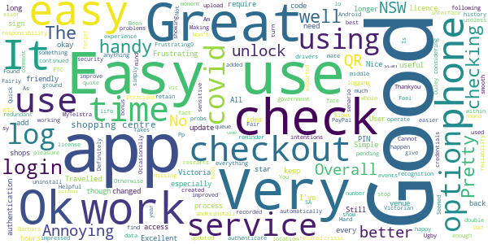

# Service NSW
App version ``6.13.0 (296669)``

Analyzed with [covid-apps-observer](http://github.com/covid-apps-observer) project, version ``0.1``

## App overview
| | |
|-------------------------|-------------------------| 
| **Name**&nbsp;&nbsp;&nbsp;&nbsp;&nbsp;&nbsp;&nbsp;&nbsp;&nbsp;&nbsp;&nbsp;&nbsp;&nbsp;&nbsp;&nbsp;&nbsp;&nbsp;&nbsp;&nbsp;&nbsp;&nbsp;&nbsp;&nbsp;&nbsp;&nbsp;&nbsp;&nbsp;&nbsp;&nbsp;&nbsp;&nbsp;&nbsp;&nbsp;&nbsp;&nbsp;&nbsp;&nbsp;&nbsp;&nbsp;&nbsp;  | Service NSW |
| **Unique identifier** | au.gov.nsw.service |
| **Link to Google Play** | [https://play.google.com/store/apps/details?id=au.gov.nsw.service](https://play.google.com/store/apps/details?id=au.gov.nsw.service) |
| **Summary**  | Digital licences, registrations, fines and more |
| **Privacy policy** | [http://www.service.nsw.gov.au/privacy](http://www.service.nsw.gov.au/privacy) |
| **Latest version** | 6.13.0 (296669) |
| **Last update** | 2021-06-25 09:31:50 |
| **Recent changes** | Thanks for using the Service NSW mobile app! We used your feedback to make these improvements: • We&#39;ve made it easier to check out of your COVID Safe Check-in by sending reminders. It&#39;s important to check out to help with contact tracing • You can now remember your details when using School Check-In • See where you have redeemed your Dine &amp; Discover vouchers • Better messaging for when something goes wrong |
| **Installs**  | 1,000,000+ |
| **Category** | Tools |
| **First release** | Dec 7, 2014 |
| **Size**  | 29M |
| **Supported Android version**  | 6.0 and up |

### Description
> The official Service NSW app, making it easier to access government services. 
 <b>Digital licences and credentials</b>
 Access the following digital licences and credentials, with more to come: 
 • Driver Licence 
 • RSA/RCG Competency Card 
 • Working with Children Check 
 • Recreational Fishing Licence 
 • Boat Driver Licence.
 <b>COVID Safe Check-in</b> 
 • Quick, contactless check in at COVID Safe venues 
 • Point your device camera at the COVID Safe QR Code to get started 
 • Save your details for a faster check in next time. 
 • Read our Privacy Collection Statement: https://www.service.nsw.gov.au/covid-safe-check-privacy-collection-statement
 <b>Useful tools and services</b>
 • Verify a Digital Driver Licence via our licence checker 
 • Check or renew a registration 
 • Sign into licensed venues.
 <b>Fines and demerits</b>
 • View and pay your fines 
 • View your demerits.
 <b>COVID-19 resources</b>
 • Access COVID-19 statistics by postcode 
 • Access our COVID-19 Assistance Finder with benefits, rebates and concessions. 
 <b>Tell us what you think</b>
 • Help us help you! We’re always working on a better, stronger, faster app. 
 • Share what you’d like to see in the app: we use your feedback to continuously improve the app experience.

### User interface
The developers of the app provide the following screenshots in the Google play store.
| | | |
|:-------------------------:|:-------------------------:|:-------------------------:|
 |   |   |   | 
 |   |  

## Development team
In the following we report the main information provided by the development team in the Google play store.

| | |
|-------------------------|-------------------------|
| **Developer**  | Service NSW |
| **Website**  | [https://www.service.nsw.gov.au/mobile-app      ](https://www.service.nsw.gov.au/mobile-app      ) |
| **Email** | mobileapp@service.nsw.gov.au |
| **Physical address**  | - |
| **Other developed apps**  | [https://play.google.com/store/apps/developer?id=Service+NSW](https://play.google.com/store/apps/developer?id=Service+NSW) |

## Android support

| | |
|-------------------------|-------------------------|
| **Declared target Android version**  | - |
| **Effective target Android version**  | - |
| **Minimum supported Android version**  | Marshmallow, version 6.0 (API level 23) |
| **Maximum target Android version**  | - |

The larger the difference between the minimum and maximum supported Android versions, the better. A larger difference means a wider audience. For example, old phones have a very low Android version, so a high minimum supported Android version means that the app cannot be used by users with old phones, thus leading to accessibility problems. 

## Requested permissions

In the following we report the complete list of the permissions requested by the app. 

| **Permission** | **Protection level** | **Description** | 
|-------------------------|-------------------------|-------------------------|
 **android.permission ACCESS_NETWORK_STATE** | Normal | Allows applications to access information about networks. 
 **android.permission ACCESS_WIFI_STATE** | Normal | Allows applications to access information about Wi-Fi networks. 
 **android.permission CAMERA** | :warning:**Dangerous** | Required to be able to access the camera device. 
 **android.permission INTERNET** | Normal | Allows applications to open network sockets. 
 **android.permission READ_APP_BADGE** | - | - 
 **android.permission USE_FINGERPRINT** | Normal | This constant was deprecated in API level 28. Applications should request USE_BIOMETRIC instead 
 **android.permission VIBRATE** | Normal | Allows access to the vibrator. 
 **android.permission WAKE_LOCK** | Normal | Allows using PowerManager WakeLocks to keep processor from sleeping or screen from dimming. 
 **com.anddoes.launcher.permission UPDATE_COUNT** | - | - 
 **com.android.vending CHECK_LICENSE** | - | - 
 **com.google.android.c2dm.permission RECEIVE** | - | - 
 **com.google.android.finsky.permission BIND_GET_INSTALL_REFERRER_SERVICE** | - | - 
 **com.htc.launcher.permission READ_SETTINGS** | - | - 
 **com.htc.launcher.permission UPDATE_SHORTCUT** | - | - 
 **com.huawei.android.launcher.permission CHANGE_BADGE** | - | - 
 **com.huawei.android.launcher.permission READ_SETTINGS** | - | - 
 **com.huawei.android.launcher.permission WRITE_SETTINGS** | - | - 
 **com.majeur.launcher.permission UPDATE_BADGE** | - | - 
 **com.oppo.launcher.permission READ_SETTINGS** | - | - 
 **com.oppo.launcher.permission WRITE_SETTINGS** | - | - 
 **com.sec.android.provider.badge.permission READ** | - | - 
 **com.sec.android.provider.badge.permission WRITE** | - | - 
 **com.sonyericsson.home.permission BROADCAST_BADGE** | - | - 
 **com.sonymobile.home.permission PROVIDER_INSERT_BADGE** | - | - 
 **me.everything.badger.permission BADGE_COUNT_READ** | - | - 
 **me.everything.badger.permission BADGE_COUNT_WRITE** | - | - 

## Mentioned servers

| **Server** | **Registrant** | **Registrant country** | **Creation date** | 
|-------------------------|-------------------------|-------------------------|-------------------------|
 | apache.org | The Apache Software Foundation | :us: US | 1995-04-11 04:00:00 |
 | xml.org | OASIS Open | :us: US | 1997-02-03 05:00:00 |
 | w3.org | W3C | :us: US | 1994-07-06 04:00:00 |
 | purl.org | Internet Archive | :us: US | 1996-01-01 05:00:00 |
 | adobe.com | Adobe Inc. | :us: US | 1986-11-17 05:00:00 |
 | android.com | Google LLC | :us: US | 1997-06-23 04:00:00 |
 | googlesyndication.com | Google LLC | :us: US | 2003-01-21 06:17:24 |
 | google.com | Google LLC | :us: US | 1997-09-15 04:00:00 |
 | app-measurement.com | Google LLC | :us: US | 2015-06-19 20:13:31 |
 | googleapis.com | Google LLC | :us: US | 2005-01-25 17:52:26 |
 | googleapis.com | Google LLC | :us: US | 2005-01-25 17:52:26 |
 | iptc.org | Whois Privacy Service | :us: US | 1995-12-27 05:00:00 |
 | useplus.org | PLUS COALITION | :us: US | 2003-11-18 19:31:25 |
 | npes.org | NPES | :us: US | 1996-01-30 05:00:00 |
 | aiim.org | Association for Information and Image Management International | :us: US | 1995-10-18 04:00:00 |
 | googleapis.com | Google LLC | :us: US | 2005-01-25 17:52:26 |
 | googleapis.com | Google LLC | :us: US | 2005-01-25 17:52:26 |
 | googleadservices.com | Google LLC | :us: US | 2003-06-19 16:34:53 |

## Security analysis 

Below we report the main security warnings raised by our execution of the [Androwarn](https://github.com/maaaaz/androwarn) security analysis tool.

**Telephony identifiers leakage**
> - This application reads the numeric name (MCC+MNC) of current registered operator 
> - This application reads the operator name 
> - This application reads the phone number string for line 1, for example, the MSISDN for a GSM phone 
> - This application reads the unique device ID, i.e the IMEI for GSM and the MEID or ESN for CDMA phones 

**Location lookup**
> - This application reads location information from all available providers (WiFi, GPS etc.) 

**Connection interfaces exfiltration**
> - This application reads details about the currently active data network 
> - This application tries to find out if the currently active data network is metered 

**Audio video eavesdropping**
> - This application records audio from the 'CAMCORDER' source  
> - This application records audio from the 'MIC' source  
> - This application captures video from the 'CAMERA' source 
> - This application captures video from the 'SURFACE' source 

**Suspicious connection establishment**
> - This application opens a Socket and connects it to the remote address ' returned no addresses for  ; port is out of range' on the 'N/A' port  
> - This application opens a Socket and connects it to the remote address '' on the 'N/A' port  
> - This application opens a Socket and connects it to the remote address 'Ljava/lang/StringBuilder;->toString()Ljava/lang/String;' on the 'N/A' port  
> - This application opens a Socket and connects it to the remote address 'Ljava/net/Proxy;->type()Ljava/net/Proxy$Type;' on the 'N/A' port  
> - This application opens a Socket and connects it to the remote address 'Network subsystem is unavailable' on the 'N/A' port  
> - This application opens a Socket and connects it to the remote address 'timeout' on the 'N/A' port  

**Pim data leakage**
> - This application accesses data stored in the clipboard 

**Code execution**
> - This application loads a native library 
> - This application loads a native library: 'Ljava/util/Iterator;->next()Ljava/lang/Object;' 
> - This application loads a native library: 'log' 
> - This application loads a native library: 'sentry' 
> - This application loads a native library: 'sentry-android' 
> - This application loads a native library: 'tool-checker' 
> - This application executes a UNIX command 

## User ratings and reviews

Below we provide information about how end users are reacting to the app in terms of ratings and reviews in the Google Play store.

### Ratings

The Service NSW app has been installed by more than **1000000** times. At this time, **8767** rated the app and its average score is **3.769144**. Below we show the distribution of the ratings across the usual star-based rating of Google Play

:star::star::star::star::star:: 4532

:star::star::star::star:: 1382

:star::star::star:: 849

:star::star:: 306

:star:: 1698

### Reviews 

#### 5-star reviews

> Good  :date: __2021-06-28 00:39:47__

> Great  :date: __2021-06-27 14:05:20__

> Madd app keeps us up to date where people are dying, great!!  :date: __2021-06-27 13:53:01__

> I have tried all day to download this app with no result. Any ideas as to how I can get on to comply with covid requirements?  :date: __2021-06-27 10:31:15__

> Very good.  :date: __2021-06-27 09:37:29__

> Wow  :date: __2021-06-27 08:55:15__

> Services nsw wouldn't work without update. I've tried to update, that didn't work so tried to reinstall. Now it is constantly pending - won't download.  :date: __2021-06-27 08:33:46__

> good  :date: __2021-06-27 08:29:00__

> Ok  :date: __2021-06-27 05:29:25__

> Once I had called my phone data provider and had them enable international roaming it has worked perfectly. Some of the data and verification codes are sent and recievsd from overseas. I hope this helps anyone running into issues. It has been easy to use and is clear once working.  :date: __2021-06-27 05:04:11__

#### 4-star reviews

> Won't update. Been pending for hours.  :date: __2021-06-28 03:24:36__

> Good  :date: __2021-06-28 01:22:43__

> Ok  :date: __2021-06-27 22:47:55__

> It works with me I don't mind using it...  :date: __2021-06-27 16:56:51__

> The covid continued longer then I expected  :date: __2021-06-27 09:41:34__

> No longer works  :date: __2021-06-27 06:34:36__

> easy to sign but at times forget to sign out  :date: __2021-06-26 13:37:16__

> Ok  :date: __2021-06-26 08:39:53__

> Fair  :date: __2021-06-26 06:24:13__

> Great. Easy to use.  :date: __2021-06-26 02:41:31__

#### 3-star reviews

> Well ther r a few apps thats Similar to these one but the more easy and more better of them all acharya  :date: __2021-06-28 00:08:40__

> Was requested to update still trying for last 2 days to no avail. Have no service app at the moment. ( uninstalled it thinking it might work quicker..I was wrong ) Don't understand my husband had the same request and he had no problem to update the New version  :date: __2021-06-27 07:22:43__

> Not always easy  :date: __2021-06-27 03:46:30__

> Great initiative with the digital drivers and NSW services in one spot. BUT the app has a major bug where it drains your battery in the background. What is it doing in the background?  :date: __2021-06-27 02:04:53__

> Taking hour's to update  :date: __2021-06-26 18:02:29__

> Ok  :date: __2021-06-26 10:46:00__

> Having trouble with updates  :date: __2021-06-26 06:14:23__

> Can not get this two old I am 79  :date: __2021-06-26 05:43:48__

> oko  :date: __2021-06-26 04:39:36__

> Not to bad  :date: __2021-06-26 03:57:44__

#### 2-star reviews

> Tried to use my logon at a dental surgery yesterday tried to update the app but it won't let me do it tried several times but it just keeps turning waited an hour but still no update very frustrating.  :date: __2021-06-27 00:06:54__

> I have been trying to update for the last hour and all it is doing is spinning and saying pending. I can't even use the app as it telling me it needs upgrading. Catch 22 situation.  :date: __2021-06-26 11:38:01__

> Often will not works  :date: __2021-06-26 08:35:55__

> It is taking a very long time for the upgrade to install. The process is arduous Have tried 5 times to install and still no luck. Not happy Gladys:( Still trying to download this app it's been 2 days of frustration, is the system overloaded?  :date: __2021-06-26 08:22:38__

> Crazy  :date: __2021-06-26 05:46:22__

> Need to constantly un install other apps to update  :date: __2021-06-26 04:47:02__

> So slow for the update to load. We had finished lunch and it was still going round and round. And all afternoon and the next day. Can't log in anywhere until it sorts itself out. Turned phone off, operating on Wi-Fi and cannot complete upgrade, cannot log on to any site. Facility previously operated perfectly. Now fiddling has ruined it.  :date: __2021-06-25 15:25:07__

> Difficult to use  :date: __2021-06-25 09:10:34__

> Slow and hard to use  :date: __2021-06-25 04:33:23__

> good  :date: __2021-06-24 14:28:21__

#### 1-star reviews

> Ditto with other comments, hopeless with trying to get so today, in update mode... For ever  :date: __2021-06-28 03:10:35__

> Having the same problem.. the app kept telling me to update but wouldn't let me do that. So I uninstalled to start again and now the app keeps telling me that it's still installed and won't let me put it back on again. I have tried restarting the phone but no good  :date: __2021-06-28 03:04:02__

> Having the same problem as many others. Told to update which I have done, tells me it is installed but still can't scan. What happens now?  :date: __2021-06-28 00:54:24__

> Unable to update  :date: __2021-06-28 00:40:53__

> I can't update the app. It just keeps saying "pending" very frustrating as many venues don't have manual forms any more.  :date: __2021-06-28 00:17:52__

> Bloody hopeless. Won't update  :date: __2021-06-27 23:51:31__

> My password not working at all even after reseting it , uninstalling and installing again many times.. no good!!  :date: __2021-06-27 23:01:09__

> I downloaded this app but it will not allow me to enable camera why?  :date: __2021-06-27 20:18:00__

> Doesn't work!  :date: __2021-06-27 18:17:26__

> This is a week later and I still cannot get it. This all came about from clicking on update the app. Now I am continually told pending. I have removed so many apps to make more space...tonight I had to enter google password etc..tells me it is installed...BUT NO...it is not installed What the ??  :date: __2021-06-27 11:55:37__

