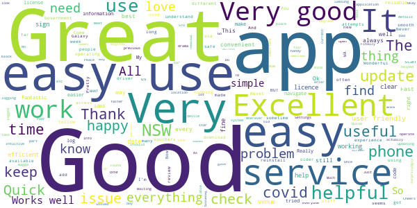
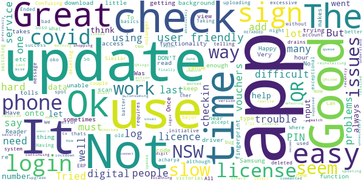

# Service NSW
App version ``6.13.0 (296669)``

Analyzed with [covid-apps-observer](http://github.com/covid-apps-observer) project, version ``0.1``

## App overview
| | |
|-------------------------|-------------------------| 
| **Name**&nbsp;&nbsp;&nbsp;&nbsp;&nbsp;&nbsp;&nbsp;&nbsp;&nbsp;&nbsp;&nbsp;&nbsp;&nbsp;&nbsp;&nbsp;&nbsp;&nbsp;&nbsp;&nbsp;&nbsp;&nbsp;&nbsp;&nbsp;&nbsp;&nbsp;&nbsp;&nbsp;&nbsp;&nbsp;&nbsp;&nbsp;&nbsp;&nbsp;&nbsp;&nbsp;&nbsp;&nbsp;&nbsp;&nbsp;&nbsp;  | Service NSW |
| **Unique identifier** | au.gov.nsw.service |
| **Link to Google Play** | [https://play.google.com/store/apps/details?id=au.gov.nsw.service](https://play.google.com/store/apps/details?id=au.gov.nsw.service) |
| **Summary**  | Digital licences, registrations, fines and more |
| **Privacy policy** | [http://www.service.nsw.gov.au/privacy](http://www.service.nsw.gov.au/privacy) |
| **Latest version** | 6.13.0 (296669) |
| **Last update** | 2021-06-25 09:31:50 |
| **Recent changes** | Thanks for using the Service NSW mobile app! We used your feedback to make these improvements: • We&#39;ve made it easier to check out of your COVID Safe Check-in by sending reminders. It&#39;s important to check out to help with contact tracing • You can now remember your details when using School Check-In • See where you have redeemed your Dine &amp; Discover vouchers • Better messaging for when something goes wrong |
| **Installs**  | 1,000,000+ |
| **Category** | Tools |
| **First release** | Dec 7, 2014 |
| **Size**  | 29M |
| **Supported Android version**  | 6.0 and up |

### Description
> The official Service NSW app, making it easier to access government services. 
 <b>Digital licences and credentials</b>
 Access the following digital licences and credentials, with more to come: 
 • Driver Licence 
 • RSA/RCG Competency Card 
 • Working with Children Check 
 • Recreational Fishing Licence 
 • Boat Driver Licence.
 <b>COVID Safe Check-in</b> 
 • Quick, contactless check in at COVID Safe venues 
 • Point your device camera at the COVID Safe QR Code to get started 
 • Save your details for a faster check in next time. 
 • Read our Privacy Collection Statement: https://www.service.nsw.gov.au/covid-safe-check-privacy-collection-statement
 <b>Useful tools and services</b>
 • Verify a Digital Driver Licence via our licence checker 
 • Check or renew a registration 
 • Sign into licensed venues.
 <b>Fines and demerits</b>
 • View and pay your fines 
 • View your demerits.
 <b>COVID-19 resources</b>
 • Access COVID-19 statistics by postcode 
 • Access our COVID-19 Assistance Finder with benefits, rebates and concessions. 
 <b>Tell us what you think</b>
 • Help us help you! We’re always working on a better, stronger, faster app. 
 • Share what you’d like to see in the app: we use your feedback to continuously improve the app experience.

### User interface
The developers of the app provide the following screenshots in the Google play store.
| | | |
|:-------------------------:|:-------------------------:|:-------------------------:|
 |   |   |   | 
 |   |  

## Development team
In the following we report the main information provided by the development team in the Google play store.

| | |
|-------------------------|-------------------------|
| **Developer**  | Service NSW |
| **Website**  | [https://www.service.nsw.gov.au/mobile-app      ](https://www.service.nsw.gov.au/mobile-app      ) |
| **Email** | mobileapp@service.nsw.gov.au |
| **Physical address**  | - |
| **Other developed apps**  | [https://play.google.com/store/apps/developer?id=Service+NSW](https://play.google.com/store/apps/developer?id=Service+NSW) |

## Android support

| | |
|-------------------------|-------------------------|
| **Declared target Android version**  | - |
| **Effective target Android version**  | - |
| **Minimum supported Android version**  | Marshmallow, version 6.0 (API level 23) |
| **Maximum target Android version**  | - |

The larger the difference between the minimum and maximum supported Android versions, the better. A larger difference means a wider audience. For example, old phones have a very low Android version, so a high minimum supported Android version means that the app cannot be used by users with old phones, thus leading to accessibility problems. 

## Requested permissions

In the following we report the complete list of the permissions requested by the app. 

| **Permission** | **Protection level** | **Description** | 
|-------------------------|-------------------------|-------------------------|
 **android.permission ACCESS_NETWORK_STATE** | Normal | Allows applications to access information about networks. 
 **android.permission ACCESS_WIFI_STATE** | Normal | Allows applications to access information about Wi-Fi networks. 
 **android.permission CAMERA** | :warning:**Dangerous** | Required to be able to access the camera device. 
 **android.permission INTERNET** | Normal | Allows applications to open network sockets. 
 **android.permission READ_APP_BADGE** | - | - 
 **android.permission USE_FINGERPRINT** | Normal | This constant was deprecated in API level 28. Applications should request USE_BIOMETRIC instead 
 **android.permission VIBRATE** | Normal | Allows access to the vibrator. 
 **android.permission WAKE_LOCK** | Normal | Allows using PowerManager WakeLocks to keep processor from sleeping or screen from dimming. 
 **com.anddoes.launcher.permission UPDATE_COUNT** | - | - 
 **com.android.vending CHECK_LICENSE** | - | - 
 **com.google.android.c2dm.permission RECEIVE** | - | - 
 **com.google.android.finsky.permission BIND_GET_INSTALL_REFERRER_SERVICE** | - | - 
 **com.htc.launcher.permission READ_SETTINGS** | - | - 
 **com.htc.launcher.permission UPDATE_SHORTCUT** | - | - 
 **com.huawei.android.launcher.permission CHANGE_BADGE** | - | - 
 **com.huawei.android.launcher.permission READ_SETTINGS** | - | - 
 **com.huawei.android.launcher.permission WRITE_SETTINGS** | - | - 
 **com.majeur.launcher.permission UPDATE_BADGE** | - | - 
 **com.oppo.launcher.permission READ_SETTINGS** | - | - 
 **com.oppo.launcher.permission WRITE_SETTINGS** | - | - 
 **com.sec.android.provider.badge.permission READ** | - | - 
 **com.sec.android.provider.badge.permission WRITE** | - | - 
 **com.sonyericsson.home.permission BROADCAST_BADGE** | - | - 
 **com.sonymobile.home.permission PROVIDER_INSERT_BADGE** | - | - 
 **me.everything.badger.permission BADGE_COUNT_READ** | - | - 
 **me.everything.badger.permission BADGE_COUNT_WRITE** | - | - 

## Mentioned servers

| **Server** | **Registrant** | **Registrant country** | **Creation date** | 
|-------------------------|-------------------------|-------------------------|-------------------------|
 | apache.org | The Apache Software Foundation | :us: US | 1995-04-11 04:00:00 |
 | xml.org | OASIS Open | :us: US | 1997-02-03 05:00:00 |
 | w3.org | W3C | :us: US | 1994-07-06 04:00:00 |
 | purl.org | Internet Archive | :us: US | 1996-01-01 05:00:00 |
 | adobe.com | Adobe Inc. | :us: US | 1986-11-17 05:00:00 |
 | android.com | Google LLC | :us: US | 1997-06-23 04:00:00 |
 | googlesyndication.com | Google LLC | :us: US | 2003-01-21 06:17:24 |
 | google.com | Google LLC | :us: US | 1997-09-15 04:00:00 |
 | app-measurement.com | Google LLC | :us: US | 2015-06-19 20:13:31 |
 | googleapis.com | Google LLC | :us: US | 2005-01-25 17:52:26 |
 | googleapis.com | Google LLC | :us: US | 2005-01-25 17:52:26 |
 | iptc.org | Whois Privacy Service | :us: US | 1995-12-27 05:00:00 |
 | useplus.org | PLUS COALITION | :us: US | 2003-11-18 19:31:25 |
 | npes.org | NPES | :us: US | 1996-01-30 05:00:00 |
 | aiim.org | Association for Information and Image Management International | :us: US | 1995-10-18 04:00:00 |
 | googleapis.com | Google LLC | :us: US | 2005-01-25 17:52:26 |
 | googleapis.com | Google LLC | :us: US | 2005-01-25 17:52:26 |
 | googleadservices.com | Google LLC | :us: US | 2003-06-19 16:34:53 |

## Security analysis 

Below we report the main security warnings raised by our execution of the [Androwarn](https://github.com/maaaaz/androwarn) security analysis tool.

**Telephony identifiers leakage**
> - This application reads the numeric name (MCC+MNC) of current registered operator 
> - This application reads the operator name 
> - This application reads the phone number string for line 1, for example, the MSISDN for a GSM phone 
> - This application reads the unique device ID, i.e the IMEI for GSM and the MEID or ESN for CDMA phones 

**Location lookup**
> - This application reads location information from all available providers (WiFi, GPS etc.) 

**Connection interfaces exfiltration**
> - This application reads details about the currently active data network 
> - This application tries to find out if the currently active data network is metered 

**Audio video eavesdropping**
> - This application records audio from the 'CAMCORDER' source  
> - This application records audio from the 'MIC' source  
> - This application captures video from the 'CAMERA' source 
> - This application captures video from the 'SURFACE' source 

**Suspicious connection establishment**
> - This application opens a Socket and connects it to the remote address ' returned no addresses for  ; port is out of range' on the 'N/A' port  
> - This application opens a Socket and connects it to the remote address '' on the 'N/A' port  
> - This application opens a Socket and connects it to the remote address 'Ljava/lang/StringBuilder;->toString()Ljava/lang/String;' on the 'N/A' port  
> - This application opens a Socket and connects it to the remote address 'Ljava/net/Proxy;->type()Ljava/net/Proxy$Type;' on the 'N/A' port  
> - This application opens a Socket and connects it to the remote address 'Network subsystem is unavailable' on the 'N/A' port  
> - This application opens a Socket and connects it to the remote address 'timeout' on the 'N/A' port  

**Pim data leakage**
> - This application accesses data stored in the clipboard 

**Code execution**
> - This application loads a native library 
> - This application loads a native library: 'Ljava/util/Iterator;->next()Ljava/lang/Object;' 
> - This application loads a native library: 'log' 
> - This application loads a native library: 'sentry' 
> - This application loads a native library: 'sentry-android' 
> - This application loads a native library: 'tool-checker' 
> - This application executes a UNIX command 

## User ratings and reviews

Below we provide information about how end users are reacting to the app in terms of ratings and reviews in the Google Play store.

### Ratings

The Service NSW app has been installed by more than **1000000** times. At this time, **8767** rated the app and its average score is **3.769144**. Below we show the distribution of the ratings across the usual star-based rating of Google Play

:star::star::star::star::star:: 4532

:star::star::star::star:: 1382

:star::star::star:: 849

:star::star:: 306

:star:: 1698

### Reviews 

#### 5-star reviews

> Outstanding  :date: __2021-07-04 08:39:45__

> Good easy for older people  :date: __2021-07-04 08:08:15__

> Very important, helpful and easy to follow up.  :date: __2021-07-04 05:46:49__

> Good  :date: __2021-07-04 04:22:21__

> 👍  :date: __2021-07-04 02:42:55__

> fair  :date: __2021-07-04 02:15:29__

> Upgrade issue, delete and redownload the app. Works fine after that.  :date: __2021-07-03 06:51:29__

> Found the summary of current restrictions under Covid Resources tab to be very succinct and far more helpful than attempts to google the same info.  :date: __2021-07-03 03:12:17__

> good. l trying to improve on phone.  :date: __2021-07-02 09:58:51__

> Excellent service Thank you  :date: __2021-07-02 07:34:57__

#### 4-star reviews

> FTC  :date: __2021-07-04 01:00:33__

> ok  :date: __2021-07-03 07:12:47__

> Handy for checking in.  :date: __2021-07-03 05:08:40__

> Excellent  :date: __2021-07-03 01:35:20__

> Not bad or good 2  :date: __2021-07-02 11:16:43__

> 4 star but doesn't show my boat licence  :date: __2021-07-02 11:06:46__

> Good  :date: __2021-07-02 04:02:58__

> As  :date: __2021-07-01 23:05:15__

> Making life easier at the moment 😂  :date: __2021-07-01 12:30:01__

> Great! !  :date: __2021-07-01 11:03:04__

#### 3-star reviews

> ERP We/by any by by  :date: __2021-07-04 12:05:50__

> Confusing  :date: __2021-07-04 09:15:12__

> Ok  :date: __2021-07-04 05:01:39__

> All in all an ok app just having excessive troubles uploading licenses onto the system  :date: __2021-07-03 05:34:07__

> Great  :date: __2021-07-02 06:40:04__

> The app deleted all my data and when I went to input it again would not accept my phone number. Where do I get help!  :date: __2021-07-01 07:28:17__

> It is telling me to update. But it won't let me.  :date: __2021-06-30 10:39:37__

> Soso  :date: __2021-06-30 06:37:22__

> Ok  :date: __2021-06-29 03:57:54__

> I think it is exceptional although have only used it a couple of times.  :date: __2021-06-28 09:30:36__

#### 2-star reviews

> This app won't let me login or sign,it tell me I am login before,I never use this app before ,because I don't need at.its so confusing app.So I got other app that works perfect.Fix your app please.Thanks.Cheers  :date: __2021-07-03 22:56:01__

> I can't check out of a shopping centre after I've checked in and out of businesses within that centre.  :date: __2021-07-03 06:44:13__

> Very bad.id'not get it at all.  :date: __2021-07-03 02:22:20__

> For visitors to NSW, this app is too complicated and frustrating to use. SA and QLD apps are a breeze to use in comparison. Additional info: Tks for reply. What I found is that, despite entering my details, every time I use the QR app it wants to sms me a varification code before accepting my scanned entry. This is frustrating and holds up others wanting to enter their QR. Also I have to shuffle between sms screen and QR screen to enter the validation code. In the end I just gave up.  :date: __2021-07-02 06:46:46__

> Doesn't work well  :date: __2021-07-01 07:36:02__

> Works once every week maybe  :date: __2021-07-01 06:36:39__

> Too many ads. Cant check out easily.  :date: __2021-06-30 11:08:50__

> It doesn't work easily  :date: __2021-06-30 08:38:10__

> Abysmal.  :date: __2021-06-29 05:34:28__

> Update?  :date: __2021-06-29 02:13:17__

#### 1-star reviews

> It still doesn't remember my details for COVID check in.  :date: __2021-07-04 09:37:33__

> It keeps saying pending and it does not open at all ,I've turned off and re stared my phone about 10 times, so I can not sign in to say Coles or any where and as of the the 12/07/21 we all have to sign in so I'm Stuffed ,what do I get my house mates to do for the rest of my life ??????  :date: __2021-07-04 09:37:07__

> The app for attendance at places out of resistance is not as it should be. This update information has stopped the app alltogether. Now it is not working at all. I am blaming you at the other end  :date: __2021-07-04 06:11:24__

> I've always found it useful but can no longer use it as I don't have Google and can't update it. Can you tell me how I can use the qr sign in now Update on 3 July. Can now not even sign in using the qr scanner in my phone. Doing well. It just tells me to update using Google play but won't update. July 4 iphones seem to work but androids have problems.  :date: __2021-07-04 03:29:17__

> Since the last update came out, I haven't been able to update this app, it has been 'pending' the whole time. Given the app won't work without the update, and we're currently in the middle of a lockdown, I would think this issue would have been fixed by now. I've read multiple other reviews from other users who also haven't been able to download the update.  :date: __2021-07-04 02:20:30__

> I have come to the point where the app request me to update but I can't get past this issue I have uninstalled the app and now can't get it back it's so fustrating .  :date: __2021-07-03 23:51:54__

> Wont update or reinstall been like it for a week now  :date: __2021-07-03 11:13:09__

> Hopeless. Does not update. I have done as you said. It still does not update.  :date: __2021-07-03 11:07:09__

> Couldn't update so uninstalled and can't download now.  :date: __2021-07-03 10:34:39__

> It was working fine until I had to update. What happened, why?  :date: __2021-07-03 08:37:29__

