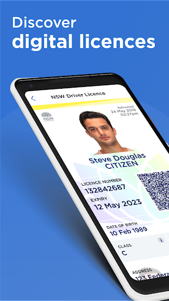
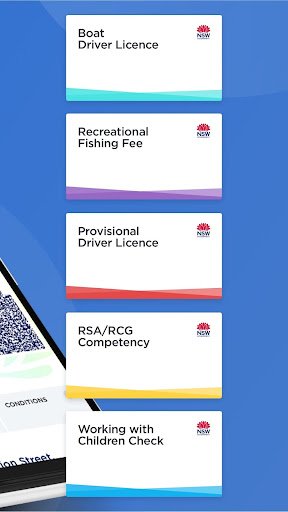
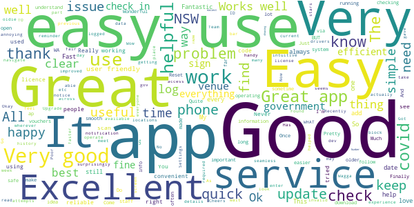
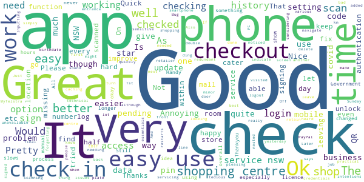
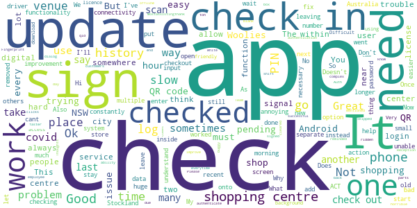
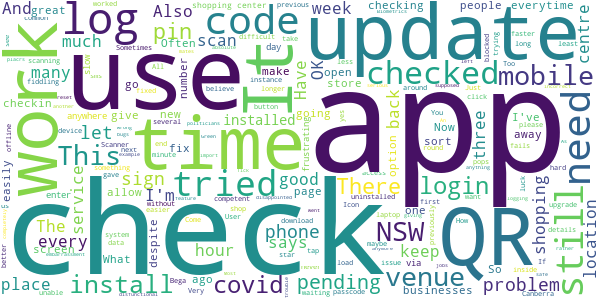
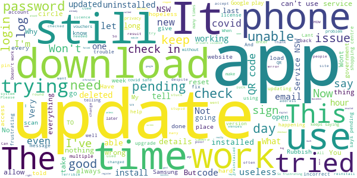

# Service NSW
App version ``6.14.0 (308678)``

Analyzed with [covid-apps-observer](http://github.com/covid-apps-observer) project, version ``0.1``

## App overview
| | |
|-------------------------|-------------------------| 
| **Name**&nbsp;&nbsp;&nbsp;&nbsp;&nbsp;&nbsp;&nbsp;&nbsp;&nbsp;&nbsp;&nbsp;&nbsp;&nbsp;&nbsp;&nbsp;&nbsp;&nbsp;&nbsp;&nbsp;&nbsp;&nbsp;&nbsp;&nbsp;&nbsp;&nbsp;&nbsp;&nbsp;&nbsp;&nbsp;&nbsp;&nbsp;&nbsp;&nbsp;&nbsp;&nbsp;&nbsp;&nbsp;&nbsp;&nbsp;&nbsp;  | Service NSW |
| **Unique identifier** | au.gov.nsw.service |
| **Link to Google Play** | [https://play.google.com/store/apps/details?id=au.gov.nsw.service](https://play.google.com/store/apps/details?id=au.gov.nsw.service) |
| **Summary**  | Digital licences, registrations, fines and more |
| **Privacy policy** | [http://www.service.nsw.gov.au/privacy](http://www.service.nsw.gov.au/privacy) |
| **Latest version** | 6.14.0 (308678) |
| **Last update** | 2021-07-07 08:25:22 |
| **Recent changes** | Thanks for using the Service NSW mobile app! We used your feedback to make these improvements: • We&#39;ve made accessibility improvements when resetting your PIN • Improvements to the COVID-19 latest statistics section • Changes to the way you can apply for Dine &amp; Discover voucher (if you haven&#39;t already!) • Made it easier to see your valid vouchers • Added a loader button to COVID Safe Check-in history |
| **Installs**  | 1,000,000+ |
| **Category** | Tools |
| **First release** | Dec 7, 2014 |
| **Size**  | 29M |
| **Supported Android version**  | 6.0 and up |

### Description
> The official Service NSW app, making it easier to access government services. 
 <b>Digital licences and credentials</b>
 Access the following digital licences and credentials, with more to come: 
 • Driver Licence 
 • RSA/RCG Competency Card 
 • Working with Children Check 
 • Recreational Fishing Licence 
 • Boat Driver Licence.
 <b>COVID Safe Check-in</b> 
 • Quick, contactless check in at COVID Safe venues 
 • Point your device camera at the COVID Safe QR Code to get started 
 • Save your details for a faster check in next time. 
 • Read our Privacy Collection Statement: https://www.service.nsw.gov.au/covid-safe-check-privacy-collection-statement
 <b>Useful tools and services</b>
 • Verify a Digital Driver Licence via our licence checker 
 • Check or renew a registration 
 • Sign into licensed venues.
 <b>Fines and demerits</b>
 • View and pay your fines 
 • View your demerits.
 <b>COVID-19 resources</b>
 • Access COVID-19 statistics by postcode 
 • Access our COVID-19 Assistance Finder with benefits, rebates and concessions. 
 <b>Tell us what you think</b>
 • Help us help you! We’re always working on a better, stronger, faster app. 
 • Share what you’d like to see in the app: we use your feedback to continuously improve the app experience.

### User interface
The developers of the app provide the following screenshots in the Google play store.
| | | |
|:-------------------------:|:-------------------------:|:-------------------------:|
 |   |   |   | 
 |   |  

## Development team
In the following we report the main information provided by the development team in the Google play store.

| | |
|-------------------------|-------------------------|
| **Developer**  | Service NSW |
| **Website**  | [https://www.service.nsw.gov.au/mobile-app      ](https://www.service.nsw.gov.au/mobile-app      ) |
| **Email** | mobileapp@service.nsw.gov.au |
| **Physical address**  | - |
| **Other developed apps**  | [https://play.google.com/store/apps/developer?id=Service+NSW](https://play.google.com/store/apps/developer?id=Service+NSW) |

## Android support

| | |
|-------------------------|-------------------------|
| **Declared target Android version**  | - |
| **Effective target Android version**  | - |
| **Minimum supported Android version**  | Marshmallow, version 6.0 (API level 23) |
| **Maximum target Android version**  | - |

The larger the difference between the minimum and maximum supported Android versions, the better. A larger difference means a wider audience. For example, old phones have a very low Android version, so a high minimum supported Android version means that the app cannot be used by users with old phones, thus leading to accessibility problems. 

## Requested permissions

In the following we report the complete list of the permissions requested by the app. 

| **Permission** | **Protection level** | **Description** | 
|-------------------------|-------------------------|-------------------------|
 **android.permission ACCESS_NETWORK_STATE** | Normal | Allows applications to access information about networks. 
 **android.permission ACCESS_WIFI_STATE** | Normal | Allows applications to access information about Wi-Fi networks. 
 **android.permission CAMERA** | :warning:**Dangerous** | Required to be able to access the camera device. 
 **android.permission INTERNET** | Normal | Allows applications to open network sockets. 
 **android.permission READ_APP_BADGE** | - | - 
 **android.permission USE_FINGERPRINT** | Normal | This constant was deprecated in API level 28. Applications should request USE_BIOMETRIC instead 
 **android.permission VIBRATE** | Normal | Allows access to the vibrator. 
 **android.permission WAKE_LOCK** | Normal | Allows using PowerManager WakeLocks to keep processor from sleeping or screen from dimming. 
 **com.anddoes.launcher.permission UPDATE_COUNT** | - | - 
 **com.android.vending CHECK_LICENSE** | - | - 
 **com.google.android.c2dm.permission RECEIVE** | - | - 
 **com.google.android.finsky.permission BIND_GET_INSTALL_REFERRER_SERVICE** | - | - 
 **com.htc.launcher.permission READ_SETTINGS** | - | - 
 **com.htc.launcher.permission UPDATE_SHORTCUT** | - | - 
 **com.huawei.android.launcher.permission CHANGE_BADGE** | - | - 
 **com.huawei.android.launcher.permission READ_SETTINGS** | - | - 
 **com.huawei.android.launcher.permission WRITE_SETTINGS** | - | - 
 **com.majeur.launcher.permission UPDATE_BADGE** | - | - 
 **com.oppo.launcher.permission READ_SETTINGS** | - | - 
 **com.oppo.launcher.permission WRITE_SETTINGS** | - | - 
 **com.sec.android.provider.badge.permission READ** | - | - 
 **com.sec.android.provider.badge.permission WRITE** | - | - 
 **com.sonyericsson.home.permission BROADCAST_BADGE** | - | - 
 **com.sonymobile.home.permission PROVIDER_INSERT_BADGE** | - | - 
 **me.everything.badger.permission BADGE_COUNT_READ** | - | - 
 **me.everything.badger.permission BADGE_COUNT_WRITE** | - | - 

## Mentioned servers

| **Server** | **Registrant** | **Registrant country** | **Creation date** | 
|-------------------------|-------------------------|-------------------------|-------------------------|
 | apache.org | The Apache Software Foundation | :us: US | 1995-04-11 04:00:00 |
 | xml.org | OASIS Open | :us: US | 1997-02-03 05:00:00 |
 | w3.org | W3C | :us: US | 1994-07-06 04:00:00 |
 | purl.org | Internet Archive | :us: US | 1996-01-01 05:00:00 |
 | adobe.com | Adobe Inc. | :us: US | 1986-11-17 05:00:00 |
 | android.com | Google LLC | :us: US | 1997-06-23 04:00:00 |
 | googlesyndication.com | Google LLC | :us: US | 2003-01-21 06:17:24 |
 | google.com | Google LLC | :us: US | 1997-09-15 04:00:00 |
 | app-measurement.com | Google LLC | :us: US | 2015-06-19 20:13:31 |
 | googleapis.com | Google LLC | :us: US | 2005-01-25 17:52:26 |
 | googleapis.com | Google LLC | :us: US | 2005-01-25 17:52:26 |
 | iptc.org | Whois Privacy Service | :us: US | 1995-12-27 05:00:00 |
 | useplus.org | PLUS COALITION | :us: US | 2003-11-18 19:31:25 |
 | npes.org | NPES | :us: US | 1996-01-30 05:00:00 |
 | aiim.org | Association for Information and Image Management International | :us: US | 1995-10-18 04:00:00 |
 | googleapis.com | Google LLC | :us: US | 2005-01-25 17:52:26 |
 | googleapis.com | Google LLC | :us: US | 2005-01-25 17:52:26 |
 | googleadservices.com | Google LLC | :us: US | 2003-06-19 16:34:53 |

## Security analysis 

Below we report the main security warnings raised by our execution of the [Androwarn](https://github.com/maaaaz/androwarn) security analysis tool.

**Telephony identifiers leakage**
> - This application reads the numeric name (MCC+MNC) of current registered operator 
> - This application reads the operator name 
> - This application reads the phone number string for line 1, for example, the MSISDN for a GSM phone 
> - This application reads the unique device ID, i.e the IMEI for GSM and the MEID or ESN for CDMA phones 

**Location lookup**
> - This application reads location information from all available providers (WiFi, GPS etc.) 

**Connection interfaces exfiltration**
> - This application reads details about the currently active data network 
> - This application tries to find out if the currently active data network is metered 

**Audio video eavesdropping**
> - This application records audio from the 'CAMCORDER' source  
> - This application records audio from the 'MIC' source  
> - This application captures video from the 'CAMERA' source 
> - This application captures video from the 'SURFACE' source 

**Suspicious connection establishment**
> - This application opens a Socket and connects it to the remote address ' returned no addresses for  ; port is out of range' on the 'N/A' port  
> - This application opens a Socket and connects it to the remote address '' on the 'N/A' port  
> - This application opens a Socket and connects it to the remote address 'Ljava/lang/StringBuilder;->toString()Ljava/lang/String;' on the 'N/A' port  
> - This application opens a Socket and connects it to the remote address 'Ljava/net/Proxy;->type()Ljava/net/Proxy$Type;' on the 'N/A' port  
> - This application opens a Socket and connects it to the remote address 'Network subsystem is unavailable' on the 'N/A' port  
> - This application opens a Socket and connects it to the remote address 'timeout' on the 'N/A' port  

**Pim data leakage**
> - This application accesses data stored in the clipboard 

**Code execution**
> - This application loads a native library 
> - This application loads a native library: 'Ljava/util/Iterator;->next()Ljava/lang/Object;' 
> - This application loads a native library: 'log' 
> - This application loads a native library: 'sentry' 
> - This application loads a native library: 'sentry-android' 
> - This application loads a native library: 'tool-checker' 
> - This application executes a UNIX command 

## User ratings and reviews

Below we provide information about how end users are reacting to the app in terms of ratings and reviews in the Google Play store.

### Ratings

The Service NSW app has been installed by more than **1000000** times. At this time, **9405** rated the app and its average score is **3.485973**. Below we show the distribution of the ratings across the usual star-based rating of Google Play

:star::star::star::star::star:: 4239

:star::star::star::star:: 1413

:star::star::star:: 851

:star::star:: 485

:star:: 2417

### Reviews 

#### 5-star reviews

> Easy to use means I use it always  :date: __2021-07-23 11:35:38__

> Cool app  :date: __2021-07-23 05:21:19__

> You have to go to recent,at the top of your screen to check out,press RECENT and the check out icon will appear.!  :date: __2021-07-23 04:31:26__

> I'm having trouble checking out at my place of employment ,is it an Android issue?as other work colleagues with iPhones are able. #edited* issue seems to have been fixed thanks developers👍  :date: __2021-07-23 03:17:16__

> Very simple and easy 👍  :date: __2021-07-23 00:09:45__

> Good.  :date: __2021-07-22 20:59:05__

> Can not do the nsw app.  :date: __2021-07-22 12:36:09__

> Very good and helpful 👍  :date: __2021-07-22 10:34:56__

> It finally works for on the Covid check in. Needs some work on the sign in sign out as I sign in to the shopping centre then sign in to a store I'm unable to sign out off shopping centre but am able to sign out off stores.  :date: __2021-07-22 08:06:45__

> Easy to use  :date: __2021-07-21 11:33:02__

#### 4-star reviews

> It's really good to have this app on your smartphone or PC but one thing to be improve is, scanning of number plate doesn't function well and can't get the job done. Please fix this as I need this function every day. Thanks for servicing NSW  :date: __2021-07-23 16:19:31__

> Good app with the best of intentions. 5 stars if an option to turn off the authentication screen could be added. Annoying that I have to unlock my phone, then unlock the app before I can Check In/Check Out. The double-authentication is quite redundant considering other "sensitive" apps like PayPal, MyTelstra etc simply retain your credentials between phone restarts. 22/07/21 EDIT: Bug with "nested" check-ins? I checked in at the entrance to a shopping mall, then checked in/out of the various shops I visited. When leaving the mall I couldn't do a final check-out. The Check-in history shows "(check out pending)" with no way to access it.  :date: __2021-07-22 05:41:39__

> Just a minor problem which might not be able to fix On Sunday I tried to check out of a business and it didn't work and needed to check in to the next shop Later that day I was checked into the 1st business again even though I had not scanned in for checking in and I was about 4 km from there and had checked into another shop for essentials I noticed yesterday that it tried to do this again to me but was able to quickly get out of the app Is there a way to delete this check in  :date: __2021-07-22 03:41:29__

> Good to navigate and find what your looking for  :date: __2021-07-21 10:58:47__

> Not bad or good 2  :date: __2021-07-20 07:17:21__

> Inputting birthdate should be made easier  :date: __2021-07-20 03:00:10__

> happy with the app QR great although I keep forgetting to logout  :date: __2021-07-19 07:38:09__

> As a retailer, we don't know if people are signing in or not, the app should have a ding sound that can be heard to indicate it's been signed in etc please  :date: __2021-07-19 05:16:43__

> Very easy to use  :date: __2021-07-18 14:40:31__

> If you go to a shopping centre and scan in at the front door, and then scan in when you go in a store it will let you scan out for the store, but will not let you scan out when you leave the shopping centre. As you can't get back to the first scanned in. And says scan out pending in history.  :date: __2021-07-17 08:32:11__

#### 3-star reviews

> Can't check out of 2 places, say u go into a shopping centre, check in and go to another shop inside that shopping centre check in u can check out of that shop u just came out but can't check out of the shopping centre when u leave and sometimes when I check in to another place it comes up the last place I checked in and I have to go back to the check in screen and do it again the qld check in app has a way faster check in system open, scan, check in now done no check out b.s  :date: __2021-07-23 14:13:52__

> Takes too many clicks to check in. I've signed out so that I don't need to authenticate every time I check in, but now I don't have check-in history. Can't the authentication be only for parts of the app that need it like the driver's license?  :date: __2021-07-23 06:47:23__

> Mostassistingthank ton Thoughts k  :date: __2021-07-21 09:00:21__

> Would be great if COVID check-in had offline functionality. Reception is horrible in some shopping centers and check-ins are being skipped when customers can't sign into the app. Fingerprint Auth dialog is very buggy. Sometimes leaving a blank white box after successful scan.  :date: __2021-07-21 00:29:14__

> Why do I have to enter a pin number everytime I open this app it just slows things down.  :date: __2021-07-20 11:00:44__

> Please add the ability for an employee to check-in at the start of their day/shift, and then check-out at the end, instead of constantly being reminded to check out when they know they'll still be there for hours and hours.  :date: __2021-07-20 05:32:16__

> Hi Team,I c other people with the same issue ,I'll wait for the fix, there is a problem with the Check in and out, I checked in to the shopping centre and then Woolies but when I checked out from Woolies it cleared the shopping centre and now in the history it says that I haven't checked out from the centre and no way to check out.  :date: __2021-07-20 03:48:34__

> Can't add my digital license?!!  :date: __2021-07-19 12:57:25__

> As others have mentioned, need to improve the check out function. So many pending check outs which can't be done due to being over ridden by another check in within the complex (i.e shopping centre then store within shopping centre). Being able to check out 2 most recent check ins would be a huge improvement.  :date: __2021-07-18 21:25:57__

> You cant check out of a venue if you jave alreay checked in somewhere else. You need to allow users to check out venues listed in the history  :date: __2021-07-18 15:18:53__

#### 2-star reviews

> It's not scanning at all it only worked three times since I installed it.  :date: __2021-07-23 21:21:04__

> There is something wrong with the app, it keeps checking me into a place I went to weeks ago every time I open the app to scan a new QR code.  :date: __2021-07-21 01:32:27__

> Have trouble logging into the app. Biometrics feature fails and pin says incorrect everytime. Pin needs to be reset everytime to log into the app  :date: __2021-07-21 01:11:18__

> An absolute embarrassment that this app is supposed to keep us safe. Just another example of politicians giving import jobs to mates rather than competent people.  :date: __2021-07-20 10:04:31__

> Most of the time it works OK but it has some serious bugs. 1, there has been many times I've checked in, then when I get back to the app to check out, it's not there. As if I never checked in! And yes I did get the Green Tick. 2, There is an instance I can't check out believe it or not! Checked into 2 placrs & can't check out of one of them! Still pending from 9+ hours ago that I left & I can't do anything. 3, There is an instance the app completely logs out after checking in. Great :-(  :date: __2021-07-20 02:27:15__

> Very disappointed for the disfunctional check out system. Check in to a shopping center, check in to a shop inside of the shopping center, check out from the shop,,,,and then you can't check out from the shopping center anymore. A very common sense issue, why haven't fixed  :date: __2021-07-20 01:54:29__

> I lost the QR Scanner from my mobile and can't find it now. Also this app says I checked in at Bega Nov 2020?? I haven't been to Bega for abt 15 years !!!  :date: __2021-07-18 16:54:24__

> Can't check out of venues apart from the current one. All those pending check outs... can't someone fix this?  :date: __2021-07-18 07:54:45__

> Consistently being checked in to places I have already been once scanning new check in codes  :date: __2021-07-16 23:29:15__

> Pain in the bum having to put pin in each time, A dedicated check in and out app where i can open and scan without typing pin and hitting a button would be faster  :date: __2021-07-16 10:08:00__

#### 1-star reviews

> I have been unable to check in to certain places as it does not recognize my mobile phone number when trying to input my information. I have checked all of the information/troubleshooting websites asking for my details to confirm if there is an error but unable to get anywhere. I contacted the help line number which stated available 24/7, went through the process of what my enquiry and was and told that they are only available 7am to 7pm Mon to Fri. How am I supposed to go and do essential grocery shopping if I can not check in. I just need to confirm what mobile phone number has been recorded. I have to login at a screening station at work which accepts my mobile but when using the qr code, again mobile phone does not match. What I am suposed to do.  :date: __2021-07-23 12:39:46__

> Won't let my log in  :date: __2021-07-23 08:18:56__

> Been to Service Nsw centre, back to shop where I purchased phone and local library techheads. No-one able to download NSW check in app onto my phone. Told to buy another phone! Very angry but not surprised...government botch up once again.  :date: __2021-07-23 07:56:51__

> My local service centre in Miranda, where you go for disability services, has no disability access. Shame on you Service NSW.  :date: __2021-07-23 03:54:26__

> It doesn't download  :date: __2021-07-22 12:49:28__

> You can't use discover voucher for food when you it says you can?. Can service NSW please fix the problem.  :date: __2021-07-22 07:47:09__

> Frustrating  :date: __2021-07-22 06:10:17__

> Don't work in commercial venues it's adhoc I've tried all I've been asked by the app and still not working.  :date: __2021-07-21 11:28:55__

> The app doesn't recognise my password, doesn't let me to change or reset my password. It wasn't like this until two weeks ago. All my efforts are now to no avail.  :date: __2021-07-21 02:51:17__

> Tells me my details don't match when using the pre-filled information about my drivers license that Service NSW Pre-fill with my license details. Keep getting g told to send a screen shot and nothing changes.. How about you get Serv NSW to re-enter my details in to the system instead?  :date: __2021-07-20 10:11:17__

