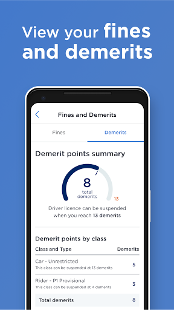
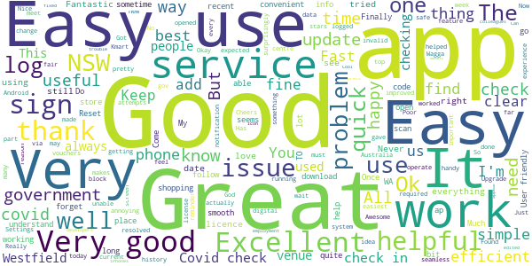
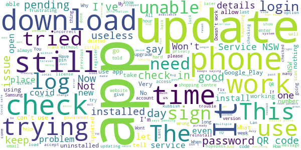

# Service NSW
App version ``6.14.0 (308678)``

Analyzed with [covid-apps-observer](http://github.com/covid-apps-observer) project, version ``0.1``

## App overview
| | |
|-------------------------|-------------------------| 
| **Name**&nbsp;&nbsp;&nbsp;&nbsp;&nbsp;&nbsp;&nbsp;&nbsp;&nbsp;&nbsp;&nbsp;&nbsp;&nbsp;&nbsp;&nbsp;&nbsp;&nbsp;&nbsp;&nbsp;&nbsp;&nbsp;&nbsp;&nbsp;&nbsp;&nbsp;&nbsp;&nbsp;&nbsp;&nbsp;&nbsp;&nbsp;&nbsp;&nbsp;&nbsp;&nbsp;&nbsp;&nbsp;&nbsp;&nbsp;&nbsp;  | Service NSW |
| **Unique identifier** | au.gov.nsw.service |
| **Link to Google Play** | [https://play.google.com/store/apps/details?id=au.gov.nsw.service](https://play.google.com/store/apps/details?id=au.gov.nsw.service) |
| **Summary**  | Digital licences, registrations, fines and more |
| **Privacy policy** | [http://www.service.nsw.gov.au/privacy](http://www.service.nsw.gov.au/privacy) |
| **Latest version** | 6.14.0 (308678) |
| **Last update** | 2021-07-07 08:25:22 |
| **Recent changes** | Thanks for using the Service NSW mobile app! We used your feedback to make these improvements: • We&#39;ve made accessibility improvements when resetting your PIN • Improvements to the COVID-19 latest statistics section • Changes to the way you can apply for Dine &amp; Discover voucher (if you haven&#39;t already!) • Made it easier to see your valid vouchers • Added a loader button to COVID Safe Check-in history |
| **Installs**  | 1,000,000+ |
| **Category** | Tools |
| **First release** | Dec 7, 2014 |
| **Size**  | 29M |
| **Supported Android version**  | 6.0 and up |

### Description
> The official Service NSW app, making it easier to access government services. 
 <b>Digital licences and credentials</b>
 Access the following digital licences and credentials, with more to come: 
 • Driver Licence 
 • RSA/RCG Competency Card 
 • Working with Children Check 
 • Recreational Fishing Licence 
 • Boat Driver Licence.
 <b>COVID Safe Check-in</b> 
 • Quick, contactless check in at COVID Safe venues 
 • Point your device camera at the COVID Safe QR Code to get started 
 • Save your details for a faster check in next time. 
 • Read our Privacy Collection Statement: https://www.service.nsw.gov.au/covid-safe-check-privacy-collection-statement
 <b>Useful tools and services</b>
 • Verify a Digital Driver Licence via our licence checker 
 • Check or renew a registration 
 • Sign into licensed venues.
 <b>Fines and demerits</b>
 • View and pay your fines 
 • View your demerits.
 <b>COVID-19 resources</b>
 • Access COVID-19 statistics by postcode 
 • Access our COVID-19 Assistance Finder with benefits, rebates and concessions. 
 <b>Tell us what you think</b>
 • Help us help you! We’re always working on a better, stronger, faster app. 
 • Share what you’d like to see in the app: we use your feedback to continuously improve the app experience.

### User interface
The developers of the app provide the following screenshots in the Google play store.
| | | |
|:-------------------------:|:-------------------------:|:-------------------------:|
 |   |   |   | 
 |   |  

## Development team
In the following we report the main information provided by the development team in the Google play store.

| | |
|-------------------------|-------------------------|
| **Developer**  | Service NSW |
| **Website**  | [https://www.service.nsw.gov.au/mobile-app      ](https://www.service.nsw.gov.au/mobile-app      ) |
| **Email** | mobileapp@service.nsw.gov.au |
| **Physical address**  | - |
| **Other developed apps**  | [https://play.google.com/store/apps/developer?id=Service+NSW](https://play.google.com/store/apps/developer?id=Service+NSW) |

## Android support

| | |
|-------------------------|-------------------------|
| **Declared target Android version**  | - |
| **Effective target Android version**  | - |
| **Minimum supported Android version**  | Marshmallow, version 6.0 (API level 23) |
| **Maximum target Android version**  | - |

The larger the difference between the minimum and maximum supported Android versions, the better. A larger difference means a wider audience. For example, old phones have a very low Android version, so a high minimum supported Android version means that the app cannot be used by users with old phones, thus leading to accessibility problems. 

## Requested permissions

In the following we report the complete list of the permissions requested by the app. 

| **Permission** | **Protection level** | **Description** | 
|-------------------------|-------------------------|-------------------------|
 **android.permission ACCESS_NETWORK_STATE** | Normal | Allows applications to access information about networks. 
 **android.permission ACCESS_WIFI_STATE** | Normal | Allows applications to access information about Wi-Fi networks. 
 **android.permission CAMERA** | :warning:**Dangerous** | Required to be able to access the camera device. 
 **android.permission INTERNET** | Normal | Allows applications to open network sockets. 
 **android.permission READ_APP_BADGE** | - | - 
 **android.permission USE_FINGERPRINT** | Normal | This constant was deprecated in API level 28. Applications should request USE_BIOMETRIC instead 
 **android.permission VIBRATE** | Normal | Allows access to the vibrator. 
 **android.permission WAKE_LOCK** | Normal | Allows using PowerManager WakeLocks to keep processor from sleeping or screen from dimming. 
 **com.anddoes.launcher.permission UPDATE_COUNT** | - | - 
 **com.android.vending CHECK_LICENSE** | - | - 
 **com.google.android.c2dm.permission RECEIVE** | - | - 
 **com.google.android.finsky.permission BIND_GET_INSTALL_REFERRER_SERVICE** | - | - 
 **com.htc.launcher.permission READ_SETTINGS** | - | - 
 **com.htc.launcher.permission UPDATE_SHORTCUT** | - | - 
 **com.huawei.android.launcher.permission CHANGE_BADGE** | - | - 
 **com.huawei.android.launcher.permission READ_SETTINGS** | - | - 
 **com.huawei.android.launcher.permission WRITE_SETTINGS** | - | - 
 **com.majeur.launcher.permission UPDATE_BADGE** | - | - 
 **com.oppo.launcher.permission READ_SETTINGS** | - | - 
 **com.oppo.launcher.permission WRITE_SETTINGS** | - | - 
 **com.sec.android.provider.badge.permission READ** | - | - 
 **com.sec.android.provider.badge.permission WRITE** | - | - 
 **com.sonyericsson.home.permission BROADCAST_BADGE** | - | - 
 **com.sonymobile.home.permission PROVIDER_INSERT_BADGE** | - | - 
 **me.everything.badger.permission BADGE_COUNT_READ** | - | - 
 **me.everything.badger.permission BADGE_COUNT_WRITE** | - | - 

## Mentioned servers

| **Server** | **Registrant** | **Registrant country** | **Creation date** | 
|-------------------------|-------------------------|-------------------------|-------------------------|
 | apache.org | The Apache Software Foundation | :us: US | 1995-04-11 04:00:00 |
 | xml.org | OASIS Open | :us: US | 1997-02-03 05:00:00 |
 | w3.org | W3C | :us: US | 1994-07-06 04:00:00 |
 | purl.org | Internet Archive | :us: US | 1996-01-01 05:00:00 |
 | adobe.com | Adobe Inc. | :us: US | 1986-11-17 05:00:00 |
 | android.com | Google LLC | :us: US | 1997-06-23 04:00:00 |
 | googlesyndication.com | Google LLC | :us: US | 2003-01-21 06:17:24 |
 | google.com | Google LLC | :us: US | 1997-09-15 04:00:00 |
 | app-measurement.com | Google LLC | :us: US | 2015-06-19 20:13:31 |
 | googleapis.com | Google LLC | :us: US | 2005-01-25 17:52:26 |
 | googleapis.com | Google LLC | :us: US | 2005-01-25 17:52:26 |
 | iptc.org | Whois Privacy Service | :us: US | 1995-12-27 05:00:00 |
 | useplus.org | PLUS COALITION | :us: US | 2003-11-18 19:31:25 |
 | npes.org | NPES | :us: US | 1996-01-30 05:00:00 |
 | aiim.org | Association for Information and Image Management International | :us: US | 1995-10-18 04:00:00 |
 | googleapis.com | Google LLC | :us: US | 2005-01-25 17:52:26 |
 | googleapis.com | Google LLC | :us: US | 2005-01-25 17:52:26 |
 | googleadservices.com | Google LLC | :us: US | 2003-06-19 16:34:53 |

## Security analysis 

Below we report the main security warnings raised by our execution of the [Androwarn](https://github.com/maaaaz/androwarn) security analysis tool.

**Telephony identifiers leakage**
> - This application reads the numeric name (MCC+MNC) of current registered operator 
> - This application reads the operator name 
> - This application reads the phone number string for line 1, for example, the MSISDN for a GSM phone 
> - This application reads the unique device ID, i.e the IMEI for GSM and the MEID or ESN for CDMA phones 

**Location lookup**
> - This application reads location information from all available providers (WiFi, GPS etc.) 

**Connection interfaces exfiltration**
> - This application reads details about the currently active data network 
> - This application tries to find out if the currently active data network is metered 

**Audio video eavesdropping**
> - This application records audio from the 'CAMCORDER' source  
> - This application records audio from the 'MIC' source  
> - This application captures video from the 'CAMERA' source 
> - This application captures video from the 'SURFACE' source 

**Suspicious connection establishment**
> - This application opens a Socket and connects it to the remote address ' returned no addresses for  ; port is out of range' on the 'N/A' port  
> - This application opens a Socket and connects it to the remote address '' on the 'N/A' port  
> - This application opens a Socket and connects it to the remote address 'Ljava/lang/StringBuilder;->toString()Ljava/lang/String;' on the 'N/A' port  
> - This application opens a Socket and connects it to the remote address 'Ljava/net/Proxy;->type()Ljava/net/Proxy$Type;' on the 'N/A' port  
> - This application opens a Socket and connects it to the remote address 'Network subsystem is unavailable' on the 'N/A' port  
> - This application opens a Socket and connects it to the remote address 'timeout' on the 'N/A' port  

**Pim data leakage**
> - This application accesses data stored in the clipboard 

**Code execution**
> - This application loads a native library 
> - This application loads a native library: 'Ljava/util/Iterator;->next()Ljava/lang/Object;' 
> - This application loads a native library: 'log' 
> - This application loads a native library: 'sentry' 
> - This application loads a native library: 'sentry-android' 
> - This application loads a native library: 'tool-checker' 
> - This application executes a UNIX command 

## User ratings and reviews

Below we provide information about how end users are reacting to the app in terms of ratings and reviews in the Google Play store.

### Ratings

The Service NSW app has been installed by more than **1000000** times. At this time, **9405** rated the app and its average score is **3.485973**. Below we show the distribution of the ratings across the usual star-based rating of Google Play

:star::star::star::star::star:: 4239

:star::star::star::star:: 1413

:star::star::star:: 851

:star::star:: 485

:star:: 2417

### Reviews 

#### 5-star reviews

> Number 1 showing on app but can't find what it is. I know it's one notification but can't find it to read it.  :date: __2021-07-11 09:46:17__

> Excellent App  :date: __2021-07-11 09:16:00__

> It finally works for on the Covid check in.  :date: __2021-07-11 09:09:28__

> Great  :date: __2021-07-10 22:15:21__

> The best government aps. It's help a lot . It's the easiest way for you to check in and check out every venue. Checking some news from government. Keep some important ID like all lisence. Just some lazy people that like to complain and didn't feel grateful for the existence of this aps.  :date: __2021-07-10 18:32:17__

> Excellent  :date: __2021-07-10 15:40:21__

> It does what it's required to do.  :date: __2021-07-10 15:20:19__

> It is great for my safety, like to know if any issues.  :date: __2021-07-10 09:04:20__

> Really helpful  :date: __2021-07-10 05:12:26__

> Good app  :date: __2021-07-10 04:28:15__

#### 4-star reviews

> App won't let me log in after last update. suggests there is an issue with my app or device, and refers me to service nsw gov au slash non-standard-software Decided is play certified, and there are no detected issued when scanning with the play protect in the play store. Can only check in as a guest. Kogan Agora xs, running android 8.1.0  :date: __2021-07-11 08:38:10__

> Good app with the best of intentions. 5 stars if an option to turn off the authentication screen could be added. Annoying that I have to unlock my phone, then unlock the app before I can Check In/Check Out. The double-authentication is quite redundant considering other "sensitive" apps like PayPal, MyTelstra etc simply retain your credentials between phone restarts. 11/07/21 EDIT: despite the developer's reply the app is *not* improved in the area described above.  :date: __2021-07-11 03:38:04__

> why cant i log an e tag on this or something  :date: __2021-07-10 04:01:10__

> Very good app never a problem.  :date: __2021-07-09 17:05:54__

> Nice had Government App. But all the updates, but my phone old  :date: __2021-07-09 08:07:09__

> Good how can I stay logged in Thankyou.  :date: __2021-07-09 08:05:35__

> Easy to set up  :date: __2021-07-09 06:05:04__

> As a business we cannot sign in our customer who do not have a mobile phone as the manual check in requires a mobile verification code.  :date: __2021-07-09 04:04:39__

> Pretty easy to use. Signing out of venues could be a bit easier  :date: __2021-07-08 22:06:37__

> Easy to use  :date: __2021-07-08 03:02:09__

#### 3-star reviews

> As pensioners my wife and I only have one phone. when we check in does this cover both us since there is no way to create separate qr codes on the same phone.  :date: __2021-07-11 07:46:59__

> With shopping centers now requiring checking it would be good to have multi check ins for some sites. Go to Westfield woolies, checking to Westfield then woolies, I can't check back into Westfield's on the way out??  :date: __2021-07-11 05:05:00__

> Now that we must sign into every single place we go, it really is essential that complications such as double sign in are removed, it just takes too much time and guaranteed this is reducing compliance. Separate the COVID app from other service NSW functions if necessary and have it start up straight to QR scanner. Must have an easier way of checking out of somewhere such as a persistent notification with instant checkout button.  :date: __2021-07-11 03:48:23__

> Today it wouldn't let me use the shortcut icon on my home screen, opening the app and displaying a security message about my phone not being trusted, and logging me out. Resolved that by clearing all data and restarting, logging back in. But the shortcut icon is gone, and there doesn't seem to be a way to get it back. Release notes?  :date: __2021-07-10 07:24:54__

> Annoying method of covid check-in. Why is it necessary to first having to sign it to app before you can scan covid? It should be a one tap action so you don't have to stand and fiddle to check in!  :date: __2021-07-10 04:44:37__

> Ok  :date: __2021-07-10 03:23:42__

> App is slow, login screen should display a numpad not the full keyboard because the password is only numeric. Such a small thing that's a huge hindrance when i have to sign in everywhere  :date: __2021-07-10 00:25:29__

> I've found it hard to scan the QR code when they are small. This didn't happen in South Australia.  :date: __2021-07-10 00:19:03__

> Mostly doesn't work..  :date: __2021-07-09 15:19:32__

> It's a pain especially living in rural NSW but set password to something like 1234 You've probably got a lock on your phone because you live in a city My God you city people are whingers And stay at home We will report you David  :date: __2021-07-09 13:13:17__

#### 2-star reviews

> Won't let me log in despite same login details on my laptop being confirmed. I can't believe your IT ppl get paid to work. Then despite me being logged ok on laptop, blocked me out with a 30 minute lockout warning and still won't let me log in on app!!! Arrrgghhhh!!!  :date: __2021-07-10 04:48:11__

> I have exactly same experience with you Terry. NSW should develop this how can be easier to use, In term of managing, changing or editting account infor consider about many of seniors among us use phone just for basis use.  :date: __2021-07-10 01:32:05__

> The problem is, the app keeps asking for pass word, that is annoying  :date: __2021-07-09 23:25:45__

> I had this app a month ago it was good I had all my licenses on tap then I was locked out . I can still check in to places for covid but every thing else is blocked. I rang the number that was supplied and was transferred three times, so I just gave up. Get you're act together .Robert.  :date: __2021-07-09 17:12:47__

> Why do i have to sign in everytime. A better option would be to tap the app and you go to qr code and checkin. If you want to do something else on the app then you sign in. Too much waiting for people in the long line to checkin. Come on make it quicker and more people will checkin. The latest update said it would be easier to checkout but not on my samsung s9.  :date: __2021-07-09 08:32:00__

> Often fails to allow me to log in which will be a huge problem when check in becomes compulsory next week. I've uninstalled and reinstalled to no avail.  :date: __2021-07-08 23:43:34__

> Sort of good. But can't use the covid check-in if I'm signed in for some reason. I don't have a driver's licence to store in it but would like to see my check-in history. I'm now having to take screenshots of my check-ins just incase it's not being stored anywhere  :date: __2021-07-07 00:34:11__

> On Covid SignIn - QR is great for first sign in at venue, but when I go to same work, cafe, supermarket regularly can we just have a favourites list that uses location services to sort to closest and sign in without fiddling with QR scanner? Also having inside secure section of service NSW app means I need to enter passcode in phone, open app, add passcode to app, click covid button. You are forcing me to hover around a common QR and spend longer in potential contact locations which is uncool.  :date: __2021-07-07 00:18:24__

> Good  :date: __2021-07-06 03:59:00__

> If I log into the shopping centre then into a store I can log out of the store but then can't log out of the shopping centre.  :date: __2021-07-06 02:56:19__

#### 1-star reviews

> Doesn't stay installed on y phone. No app shows 9n y screen.  :date: __2021-07-11 12:56:44__

> I've made 2 app requested feedbacks now to no response, about major bug issue with the Covid Safe QR code check in function of the app. The issue is that regardless of signing into a business, and also sign out. The next time you sign into another business, it more often then not brings up a previous business you've signed into, but it gets confused and thinks you're signing in again, even of its a different day, at a wildly different time frame parameter. And it's been happening a lot!  :date: __2021-07-11 12:39:09__

> The app cannot remember my details for the covid check-in and I have to re-enter them every single time I check-in to a new location, yet it has no trouble remembering my dependents details. This is extremely frustrating in a shopping centre where you are entering and exiting many places. The ACT app by comparison is really simple and easy to use, and much quicker at checking in.  :date: __2021-07-11 10:04:39__

> Not secure, major data breaches. No protection for my information. Rubbish.  :date: __2021-07-11 09:53:18__

> It sucks iv been trying to update the app for weeks  :date: __2021-07-11 09:51:51__

> does not work  :date: __2021-07-11 09:45:07__

> Difficult to use  :date: __2021-07-11 09:08:32__

> Won't update...  :date: __2021-07-11 08:22:06__

> Can't login to this app just has pending with circle and does nothing. Have tried everything.  :date: __2021-07-11 06:47:56__

> Waste of time, it won't work.  :date: __2021-07-11 06:23:02__

