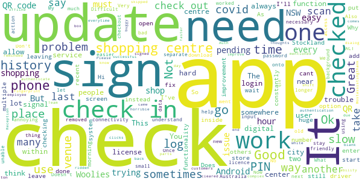
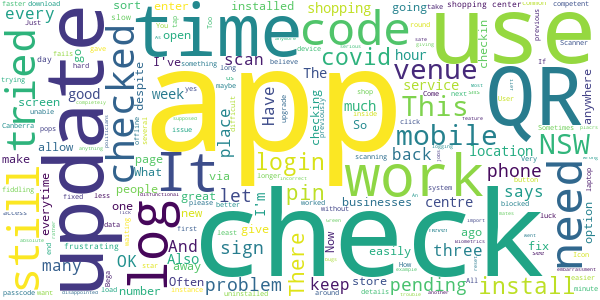

# Service NSW
App version ``6.14.0 (308678)``

Analyzed with [covid-apps-observer](http://github.com/covid-apps-observer) project, version ``0.1``

## App overview
| | |
|-------------------------|-------------------------| 
| **Name**&nbsp;&nbsp;&nbsp;&nbsp;&nbsp;&nbsp;&nbsp;&nbsp;&nbsp;&nbsp;&nbsp;&nbsp;&nbsp;&nbsp;&nbsp;&nbsp;&nbsp;&nbsp;&nbsp;&nbsp;&nbsp;&nbsp;&nbsp;&nbsp;&nbsp;&nbsp;&nbsp;&nbsp;&nbsp;&nbsp;&nbsp;&nbsp;&nbsp;&nbsp;&nbsp;&nbsp;&nbsp;&nbsp;&nbsp;&nbsp;  | Service NSW |
| **Unique identifier** | au.gov.nsw.service |
| **Link to Google Play** | [https://play.google.com/store/apps/details?id=au.gov.nsw.service](https://play.google.com/store/apps/details?id=au.gov.nsw.service) |
| **Summary**  | Digital licences, registrations, fines and more |
| **Privacy policy** | [http://www.service.nsw.gov.au/privacy](http://www.service.nsw.gov.au/privacy) |
| **Latest version** | 6.14.0 (308678) |
| **Last update** | 2021-07-07 08:25:22 |
| **Recent changes** | Thanks for using the Service NSW mobile app! We used your feedback to make these improvements: • We&#39;ve made accessibility improvements when resetting your PIN • Improvements to the COVID-19 latest statistics section • Changes to the way you can apply for Dine &amp; Discover voucher (if you haven&#39;t already!) • Made it easier to see your valid vouchers • Added a loader button to COVID Safe Check-in history |
| **Installs**  | 1,000,000+ |
| **Category** | Tools |
| **First release** | Dec 7, 2014 |
| **Size**  | 29M |
| **Supported Android version**  | 6.0 and up |

### Description
> The official Service NSW app, making it easier to access government services. 
 <b>Digital licences and credentials</b>
 Access the following digital licences and credentials, with more to come: 
 • Driver Licence 
 • RSA/RCG Competency Card 
 • Working with Children Check 
 • Recreational Fishing Licence 
 • Boat Driver Licence.
 <b>COVID Safe Check-in</b> 
 • Quick, contactless check in at COVID Safe venues 
 • Point your device camera at the COVID Safe QR Code to get started 
 • Save your details for a faster check in next time. 
 • Read our Privacy Collection Statement: https://www.service.nsw.gov.au/covid-safe-check-privacy-collection-statement
 <b>Useful tools and services</b>
 • Verify a Digital Driver Licence via our licence checker 
 • Check or renew a registration 
 • Sign into licensed venues.
 <b>Fines and demerits</b>
 • View and pay your fines 
 • View your demerits.
 <b>COVID-19 resources</b>
 • Access COVID-19 statistics by postcode 
 • Access our COVID-19 Assistance Finder with benefits, rebates and concessions. 
 <b>Tell us what you think</b>
 • Help us help you! We’re always working on a better, stronger, faster app. 
 • Share what you’d like to see in the app: we use your feedback to continuously improve the app experience.

### User interface
The developers of the app provide the following screenshots in the Google play store.
| | | |
|:-------------------------:|:-------------------------:|:-------------------------:|
 |   |   |   | 
 |   |  

## Development team
In the following we report the main information provided by the development team in the Google play store.

| | |
|-------------------------|-------------------------|
| **Developer**  | Service NSW |
| **Website**  | [https://www.service.nsw.gov.au/mobile-app      ](https://www.service.nsw.gov.au/mobile-app      ) |
| **Email** | mobileapp@service.nsw.gov.au |
| **Physical address**  | - |
| **Other developed apps**  | [https://play.google.com/store/apps/developer?id=Service+NSW](https://play.google.com/store/apps/developer?id=Service+NSW) |

## Android support

| | |
|-------------------------|-------------------------|
| **Declared target Android version**  | - |
| **Effective target Android version**  | - |
| **Minimum supported Android version**  | Marshmallow, version 6.0 (API level 23) |
| **Maximum target Android version**  | - |

The larger the difference between the minimum and maximum supported Android versions, the better. A larger difference means a wider audience. For example, old phones have a very low Android version, so a high minimum supported Android version means that the app cannot be used by users with old phones, thus leading to accessibility problems. 

## Requested permissions

In the following we report the complete list of the permissions requested by the app. 

| **Permission** | **Protection level** | **Description** | 
|-------------------------|-------------------------|-------------------------|
 **android.permission ACCESS_NETWORK_STATE** | Normal | Allows applications to access information about networks. 
 **android.permission ACCESS_WIFI_STATE** | Normal | Allows applications to access information about Wi-Fi networks. 
 **android.permission CAMERA** | :warning:**Dangerous** | Required to be able to access the camera device. 
 **android.permission INTERNET** | Normal | Allows applications to open network sockets. 
 **android.permission READ_APP_BADGE** | - | - 
 **android.permission USE_FINGERPRINT** | Normal | This constant was deprecated in API level 28. Applications should request USE_BIOMETRIC instead 
 **android.permission VIBRATE** | Normal | Allows access to the vibrator. 
 **android.permission WAKE_LOCK** | Normal | Allows using PowerManager WakeLocks to keep processor from sleeping or screen from dimming. 
 **com.anddoes.launcher.permission UPDATE_COUNT** | - | - 
 **com.android.vending CHECK_LICENSE** | - | - 
 **com.google.android.c2dm.permission RECEIVE** | - | - 
 **com.google.android.finsky.permission BIND_GET_INSTALL_REFERRER_SERVICE** | - | - 
 **com.htc.launcher.permission READ_SETTINGS** | - | - 
 **com.htc.launcher.permission UPDATE_SHORTCUT** | - | - 
 **com.huawei.android.launcher.permission CHANGE_BADGE** | - | - 
 **com.huawei.android.launcher.permission READ_SETTINGS** | - | - 
 **com.huawei.android.launcher.permission WRITE_SETTINGS** | - | - 
 **com.majeur.launcher.permission UPDATE_BADGE** | - | - 
 **com.oppo.launcher.permission READ_SETTINGS** | - | - 
 **com.oppo.launcher.permission WRITE_SETTINGS** | - | - 
 **com.sec.android.provider.badge.permission READ** | - | - 
 **com.sec.android.provider.badge.permission WRITE** | - | - 
 **com.sonyericsson.home.permission BROADCAST_BADGE** | - | - 
 **com.sonymobile.home.permission PROVIDER_INSERT_BADGE** | - | - 
 **me.everything.badger.permission BADGE_COUNT_READ** | - | - 
 **me.everything.badger.permission BADGE_COUNT_WRITE** | - | - 

## Mentioned servers

| **Server** | **Registrant** | **Registrant country** | **Creation date** | 
|-------------------------|-------------------------|-------------------------|-------------------------|
 | apache.org | The Apache Software Foundation | :us: US | 1995-04-11 04:00:00 |
 | xml.org | OASIS Open | :us: US | 1997-02-03 05:00:00 |
 | w3.org | W3C | :us: US | 1994-07-06 04:00:00 |
 | purl.org | Internet Archive | :us: US | 1996-01-01 05:00:00 |
 | adobe.com | Adobe Inc. | :us: US | 1986-11-17 05:00:00 |
 | android.com | Google LLC | :us: US | 1997-06-23 04:00:00 |
 | googlesyndication.com | Google LLC | :us: US | 2003-01-21 06:17:24 |
 | google.com | Google LLC | :us: US | 1997-09-15 04:00:00 |
 | app-measurement.com | Google LLC | :us: US | 2015-06-19 20:13:31 |
 | googleapis.com | Google LLC | :us: US | 2005-01-25 17:52:26 |
 | googleapis.com | Google LLC | :us: US | 2005-01-25 17:52:26 |
 | iptc.org | Whois Privacy Service | :us: US | 1995-12-27 05:00:00 |
 | useplus.org | PLUS COALITION | :us: US | 2003-11-18 19:31:25 |
 | npes.org | NPES | :us: US | 1996-01-30 05:00:00 |
 | aiim.org | Association for Information and Image Management International | :us: US | 1995-10-18 04:00:00 |
 | googleapis.com | Google LLC | :us: US | 2005-01-25 17:52:26 |
 | googleapis.com | Google LLC | :us: US | 2005-01-25 17:52:26 |
 | googleadservices.com | Google LLC | :us: US | 2003-06-19 16:34:53 |

## Security analysis 

Below we report the main security warnings raised by our execution of the [Androwarn](https://github.com/maaaaz/androwarn) security analysis tool.

**Telephony identifiers leakage**
> - This application reads the numeric name (MCC+MNC) of current registered operator 
> - This application reads the operator name 
> - This application reads the phone number string for line 1, for example, the MSISDN for a GSM phone 
> - This application reads the unique device ID, i.e the IMEI for GSM and the MEID or ESN for CDMA phones 

**Location lookup**
> - This application reads location information from all available providers (WiFi, GPS etc.) 

**Connection interfaces exfiltration**
> - This application reads details about the currently active data network 
> - This application tries to find out if the currently active data network is metered 

**Audio video eavesdropping**
> - This application records audio from the 'CAMCORDER' source  
> - This application records audio from the 'MIC' source  
> - This application captures video from the 'CAMERA' source 
> - This application captures video from the 'SURFACE' source 

**Suspicious connection establishment**
> - This application opens a Socket and connects it to the remote address ' returned no addresses for  ; port is out of range' on the 'N/A' port  
> - This application opens a Socket and connects it to the remote address '' on the 'N/A' port  
> - This application opens a Socket and connects it to the remote address 'Ljava/lang/StringBuilder;->toString()Ljava/lang/String;' on the 'N/A' port  
> - This application opens a Socket and connects it to the remote address 'Ljava/net/Proxy;->type()Ljava/net/Proxy$Type;' on the 'N/A' port  
> - This application opens a Socket and connects it to the remote address 'Network subsystem is unavailable' on the 'N/A' port  
> - This application opens a Socket and connects it to the remote address 'timeout' on the 'N/A' port  

**Pim data leakage**
> - This application accesses data stored in the clipboard 

**Code execution**
> - This application loads a native library 
> - This application loads a native library: 'Ljava/util/Iterator;->next()Ljava/lang/Object;' 
> - This application loads a native library: 'log' 
> - This application loads a native library: 'sentry' 
> - This application loads a native library: 'sentry-android' 
> - This application loads a native library: 'tool-checker' 
> - This application executes a UNIX command 

## User ratings and reviews

Below we provide information about how end users are reacting to the app in terms of ratings and reviews in the Google Play store.

### Ratings

The Service NSW app has been installed by more than **1000000** times. At this time, **9405** rated the app and its average score is **3.485973**. Below we show the distribution of the ratings across the usual star-based rating of Google Play

:star::star::star::star::star:: 4239

:star::star::star::star:: 1413

:star::star::star:: 851

:star::star:: 485

:star:: 2417

### Reviews 

#### 5-star reviews

> Yeah definitely  :date: __2021-07-19 09:50:31__

> Nice easy  :date: __2021-07-18 15:09:55__

> Best gov app ive eva used  :date: __2021-07-18 14:21:43__

> Easy to use.  :date: __2021-07-18 09:18:53__

> Awesome  :date: __2021-07-17 10:52:54__

> Fastest and easiest way to safe covid sign in, also combines all your services nsw needs in one convenient app. Roads and maritime, you can check your rego, licences etc. But this app is pretty much a necessity while these uncertain Covid 'check in' times are present and also ahead of us.  :date: __2021-07-16 17:45:04__

> Good  :date: __2021-07-16 04:16:42__

> Great service  :date: __2021-07-15 06:45:43__

> So easy to use  :date: __2021-07-15 06:20:09__

> The app actually surprised me -- a good thing for a change. I opened the Service NSW app for a different reason altogether. Then from one thing to something else, and here we are. But truly, I may have done a bit more research today than expected. But all round I'm happier than a pig in ... good app anyway.  :date: __2021-07-15 02:17:02__

#### 4-star reviews

> happy with the app QR great although I keep forgetting to logout  :date: __2021-07-19 07:38:09__

> As a retailer, we don't know if people are signing in or not, the app should have a ding sound that can be heard to indicate it's been signed in etc please  :date: __2021-07-19 05:16:43__

> Very easy to use  :date: __2021-07-18 14:40:31__

> If you go to a shopping centre and scan in at the front door, and then scan in when you go in a store it will let you scan out for the store, but will not let you scan out when you leave the shopping centre. As you can't get back to the first scanned in. And says scan out pending in history.  :date: __2021-07-17 08:32:11__

> Quick and easy to check in and out. 4 stars because it needs Off-line caching of check-in and check-out for times when mobile data is unavailable or service NSW have technical issues. Also needing to sign in to the app to check-in and out gets tedious too.  :date: __2021-07-17 03:21:23__

> Quite pleasing and very practical, there's a lot of room for growth.🙂🤔😎  :date: __2021-07-16 09:00:29__

> The QR scanner is not working properly. It appears to be only working sometimes and is better with larger images.  :date: __2021-07-16 04:03:43__

> I have installed this on a Tablet, half of the writing is missing, the top half makes it very hard to read  :date: __2021-07-15 13:22:37__

> Much better with the history button  :date: __2021-07-15 06:28:37__

> Very good ,convenient.  :date: __2021-07-15 01:00:21__

#### 3-star reviews

> Can't add my digital license?!!  :date: __2021-07-19 12:57:25__

> As others have mentioned, need to improve the check out function. So many pending check outs which can't be done due to being over ridden by another check in within the complex (i.e shopping centre then store within shopping centre). Being able to check out 2 most recent check ins would be a huge improvement.  :date: __2021-07-18 21:25:57__

> You cant check out of a venue if you jave alreay checked in somewhere else. You need to allow users to check out venues listed in the history  :date: __2021-07-18 15:18:53__

> Ever since, they forced me to update (think it was 2 updates ago). The camera now works poorly when trying to activate the QR code. It takes a lot of fiddling around and sometimes won't work. Before these updates, I only had to put it near the code and would be activated. Nokia 5.1 Android 10.  :date: __2021-07-17 09:47:09__

> It's all right but quite temperamental, doesn't always work and sometimes takes multiple attempts  :date: __2021-07-17 04:31:50__

> Does this app work on Android GO?  :date: __2021-07-16 03:22:43__

> I'm having trouble checking out at my place of employment ,is it an Android issue?as other work colleagues with iPhones are able  :date: __2021-07-16 02:05:52__

> Checked in at a Stockland shopping centre this morning then checked in via another QR code at Woolies. Even after checking out when leaving Woolies, there appears to be no option to check out of Stockland shopping centre. I can see it in the history as "check out pending" but no option to check out  :date: __2021-07-15 05:55:50__

> Because  :date: __2021-07-15 02:29:30__

> Hi the service nsw app is very good but the problem I have is when I go to other stores that are in one place or plazas to go from one to another and I cannot sign in to history on the app to same the places I have been can you fix it thanks.  :date: __2021-07-14 04:07:45__

#### 2-star reviews

> Most of the time it works OK but it has some serious bugs. 1, there has been many times I've checked in, then when I get back to the app to check out, it's not there. As if I never checked in! 2, There is an instance I can't check out believe it or not! Checked into 2 placrs & can't check out of one of them! Still pending from 9+ hours ago that I left & I can't do anything. 3, There is an instance the app completely logs out after checking in. Great :-(  :date: __2021-07-19 12:48:25__

> I lost the QR Scanner from my mobile and can't find it now. Also this app says I checked in at Bega Nov 2020?? I haven't been to Bega for abt 15 years !!!  :date: __2021-07-18 16:54:24__

> Can't check out of venues apart from the current one. All those pending check outs... can't someone fix this?  :date: __2021-07-18 07:54:45__

> Consistently being checked in to places I have already been once scanning new check in codes  :date: __2021-07-16 23:29:15__

> Needs to handle nested check-ins. If you check-in to a shopping centre, then check-in to a shop inside the centre, I can check-out of the shop, but there's no way to check-out of the shopping centre, so my history is littered with pending check-outs! I'm sure this would make life (more) difficult for the contact tracers!!  :date: __2021-07-16 23:15:10__

> Pain in the bum having to put pin in each time, A dedicated check in and out app where i can open and scan without typing pin and hitting a button would be faster  :date: __2021-07-16 10:08:00__

> Main problem is being unable to check out from more than one venue. Many users have reported this problem going back at least two weeks and it's still not fixed. How much longer? Also, don't see the need for a PIN and I'm rarely able to get the app to recognise the QR on the first try - it usually takes three tries.  :date: __2021-07-16 05:44:55__

> Working in a health field, I help a lot of the older population with QR Check in. There's an amount of this technologically less competent, neglected demographic that face a problem; they do not have mobile internet access. A solution would to allow the QR scan data to work offline. So when they get home and connect to their wifi, their QR check in and out data gets uploaded. I'm no app developer, but maybe work with all NSW businesses and collect an offline database of QR code for this app? ❤  :date: __2021-07-15 07:54:20__

> Sometimes it works. Other times it does not work. Service Vic is much better. How about using their technology.  :date: __2021-07-13 11:20:02__

> Check out function is rubbish. immediately after you check in at a venue the check out page pops up. By the time you do your shopping etc, the check out page has disappeared and unable to check out. Few hours later when you check in at nother venue 20km away, check out page from the previous venue pops up. Can not check in till you check out from the previous place which gives you a back you back check in/out kilometres away. Just go with check in and it'll give you a starting point/ location.  :date: __2021-07-13 03:51:35__

#### 1-star reviews

> Same problem as Andrew. Once you forget your password you can't get back to the check in screen.  :date: __2021-07-19 05:45:39__

> Dreadful  :date: __2021-07-19 04:37:33__

> How to even use this app to visit shops? Do I even need to log into my account yes or no? It's confusing! Especially for users who have a learning disability  :date: __2021-07-18 19:23:43__

> Have to use a free third party scanning app and then get directed to official Check In screen. Sometimes the QR codes are not readable; possibly from poorly lit venues or with strong lighting reflecting off the laminated posters. If you use a notepad sign in [eg libraries] instead you don't have a Check Out time option. This does not assist the tracer teams for accuracy. It seems a recent update has switched from using a convenient number pad to the alpha-numeric keyboard for typing the PIN. Not impressed.  :date: __2021-07-18 14:28:58__

> A check in within a check within a check in.. How the hell do you supposed to do that? Can't wait until we have to check in and out of shopping centre toilets. Isn't that the real hotspot anyway where everyone has their bits and spits out  :date: __2021-07-18 11:55:31__

> Even though it showed me the tick at my last sign in, it wasn't there to sign out.  :date: __2021-07-18 09:58:00__

> *Nothing changed, I still can't get into this app. Haven't heard from anyone. Have given all info I can. Very frustrating as it keeps saying my email is not valid when logging in and when I try to create an account, it says that email already in use. Can't get in at all. I've uninstalled and re installed, I've checked local time on clock. Don't know what else to do. Well here I am in July, over 2 months after initial complaint. I've heard nothing and still can't use it. Unbelievable!!  :date: __2021-07-17 13:15:14__

> 3 times now I have tried to log in and this garbage app has claimed it needed to update and 4 HOURS LATER each time I have got sick of the impotent spinning pinwheel of not-updated-yet and shut it off. This kind of public policy incompetence is so typical of clueless conservative governments. If you had a zero star rating I would give it that. This stupidity undermines the lockdown and frankly threatens lives on that basis you incompetant nincompoops - with the emphasis heavily on the poops!  :date: __2021-07-17 10:35:10__

> Having trouble resetting my password one minute account is there then nothing no digital licence etc  :date: __2021-07-17 08:37:02__

> App won't upgrade on huawei P40 as it does not support Google play.. Need to provide a third party download. Thanks for response. I am using my old phone tethered to my new Huawei p40 in order to upgrade, use and even comment on your app. Could you please provide a http version for scanning for those of us caught up in the Trump vs China Google disaster, cheers.  :date: __2021-07-17 06:37:19__

