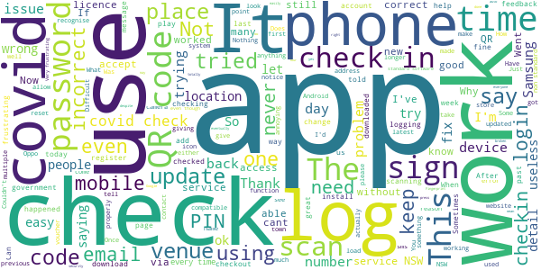
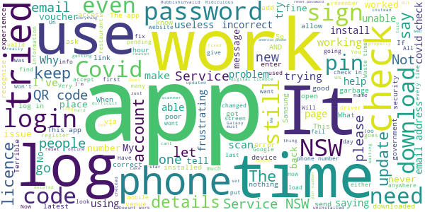

# Service NSW
App version ``6.2.2 (217709)``

Analyzed with [covid-apps-observer](http://github.com/covid-apps-observer) project, version ``0.1``

## App overview
| | |
|-------------------------|-------------------------| 
| **Name**&nbsp;&nbsp;&nbsp;&nbsp;&nbsp;&nbsp;&nbsp;&nbsp;&nbsp;&nbsp;&nbsp;&nbsp;&nbsp;&nbsp;&nbsp;&nbsp;&nbsp;&nbsp;&nbsp;&nbsp;&nbsp;&nbsp;&nbsp;&nbsp;&nbsp;&nbsp;&nbsp;&nbsp;&nbsp;&nbsp;&nbsp;&nbsp;&nbsp;&nbsp;&nbsp;&nbsp;&nbsp;&nbsp;&nbsp;&nbsp;  | Service NSW |
| **Unique identifier** | au.gov.nsw.service |
| **Link to Google Play** | [https://play.google.com/store/apps/details?id=au.gov.nsw.service](https://play.google.com/store/apps/details?id=au.gov.nsw.service) |
| **Summary**  | Digital licences, registrations, fines and more |
| **Privacy policy** | [http://www.service.nsw.gov.au/privacy](http://www.service.nsw.gov.au/privacy) |
| **Latest version** | 6.2.2 (217709) |
| **Last update** | 2021-03-10 08:02:03 |
| **Recent changes** | Thanks for using the Service NSW mobile app! Here&#39;s our latest updates: • Dine &amp; Discover vouchers are being rolled out across NSW, when your area is eligible you can now apply within the app. Log in and tap the Get Started link to see if you are eligible. • Fixed a bug where feedback was not being submitted |
| **Installs**  | 1,000,000+ |
| **Category** | Tools |
| **First release** | Dec 7, 2014 |
| **Size**  | 28M |
| **Supported Android version**  | 6.0 and up |

### Description
> The official Service NSW app, making it easier to access government services. 
 <b>Digital licences and credentials</b>
 Access the following digital licences and credentials, with more to come: 
 • Driver Licence 
 • RSA/RCG Competency Card 
 • Working with Children Check 
 • Recreational Fishing Licence 
 • Boat Driver Licence.
 <b>COVID Safe Check-in</b> 
 • Quick, contactless check in at COVID Safe venues 
 • Point your device camera at the COVID Safe QR Code to get started 
 • Save your details for a faster check in next time. 
 <b>Useful tools and services</b>
 • Verify a Digital Driver Licence via our licence checker 
 • Check or renew a registration 
 • Sign into licensed venues.
 <b>Fines and demerits</b>
 • View and pay your fines 
 • View your demerits.
 <b>COVID-19 resources</b>
 • Access COVID-19 statistics by postcode 
 • Access our COVID-19 Assistance Finder with benefits, rebates and concessions. 
 <b>Tell us what you think</b>
 • Help us help you! We’re always working on a better, stronger, faster app. 
 • Share what you’d like to see in the app: we use your feedback to continuously improve the app experience.

### User interface
The developers of the app provide the following screenshots in the Google play store.
| | | |
|:-------------------------:|:-------------------------:|:-------------------------:|
 |   |   |   | 
 |   |  

## Development team
In the following we report the main information provided by the development team in the Google play store.

| | |
|-------------------------|-------------------------|
| **Developer**  | Service NSW |
| **Website**  | [https://www.service.nsw.gov.au/mobile-app      ](https://www.service.nsw.gov.au/mobile-app      ) |
| **Email** | mobileapp@service.nsw.gov.au |
| **Physical address**  | - |
| **Other developed apps**  | [https://play.google.com/store/apps/developer?id=Service+NSW](https://play.google.com/store/apps/developer?id=Service+NSW) |

## Android support

| | |
|-------------------------|-------------------------|
| **Declared target Android version**  | Android10, version 10 (API level 29) |
| **Effective target Android version**  | Android10, version 10 (API level 29) |
| **Minimum supported Android version**  | Marshmallow, version 6.0 (API level 23) |
| **Maximum target Android version**  | - |

The larger the difference between the minimum and maximum supported Android versions, the better. A larger difference means a wider audience. For example, old phones have a very low Android version, so a high minimum supported Android version means that the app cannot be used by users with old phones, thus leading to accessibility problems. 

## Requested permissions

In the following we report the complete list of the permissions requested by the app. 

| **Permission** | **Protection level** | **Description** | 
|-------------------------|-------------------------|-------------------------|
 **android.permission ACCESS_NETWORK_STATE** | Normal | Allows applications to access information about networks. 
 **android.permission ACCESS_WIFI_STATE** | Normal | Allows applications to access information about Wi-Fi networks. 
 **android.permission CAMERA** | :warning:**Dangerous** | Required to be able to access the camera device. 
 **android.permission INTERNET** | Normal | Allows applications to open network sockets. 
 **android.permission READ_APP_BADGE** | - | - 
 **android.permission READ_EXTERNAL_STORAGE** | :warning:**Dangerous** | Allows an application to read from external storage. 
 **android.permission USE_FINGERPRINT** | Normal | This constant was deprecated in API level 28. Applications should request USE_BIOMETRIC instead 
 **android.permission VIBRATE** | Normal | Allows access to the vibrator. 
 **android.permission WAKE_LOCK** | Normal | Allows using PowerManager WakeLocks to keep processor from sleeping or screen from dimming. 
 **android.permission WRITE_EXTERNAL_STORAGE** | :warning:**Dangerous** | Allows an application to write to external storage. 
 **com.anddoes.launcher.permission UPDATE_COUNT** | - | - 
 **com.android.vending CHECK_LICENSE** | - | - 
 **com.google.android.c2dm.permission RECEIVE** | - | - 
 **com.google.android.finsky.permission BIND_GET_INSTALL_REFERRER_SERVICE** | - | - 
 **com.htc.launcher.permission READ_SETTINGS** | - | - 
 **com.htc.launcher.permission UPDATE_SHORTCUT** | - | - 
 **com.huawei.android.launcher.permission CHANGE_BADGE** | - | - 
 **com.huawei.android.launcher.permission READ_SETTINGS** | - | - 
 **com.huawei.android.launcher.permission WRITE_SETTINGS** | - | - 
 **com.majeur.launcher.permission UPDATE_BADGE** | - | - 
 **com.oppo.launcher.permission READ_SETTINGS** | - | - 
 **com.oppo.launcher.permission WRITE_SETTINGS** | - | - 
 **com.sec.android.provider.badge.permission READ** | - | - 
 **com.sec.android.provider.badge.permission WRITE** | - | - 
 **com.sonyericsson.home.permission BROADCAST_BADGE** | - | - 
 **com.sonymobile.home.permission PROVIDER_INSERT_BADGE** | - | - 
 **me.everything.badger.permission BADGE_COUNT_READ** | - | - 
 **me.everything.badger.permission BADGE_COUNT_WRITE** | - | - 

## Mentioned servers

| **Server** | **Registrant** | **Registrant country** | **Creation date** | 
|-------------------------|-------------------------|-------------------------|-------------------------|
 | apache.org | The Apache Software Foundation | :us: US | 1995-04-11 04:00:00 |
 | xml.org | OASIS Open | :us: US | 1997-02-03 05:00:00 |
 | w3.org | W3C | :us: US | 1994-07-06 04:00:00 |
 | purl.org | Internet Archive | :us: US | 1996-01-01 05:00:00 |
 | adobe.com | Adobe Inc. | :us: US | 1986-11-17 05:00:00 |
 | android.com | Google LLC | :us: US | 1997-06-23 04:00:00 |
 | googlesyndication.com | Google LLC | :us: US | 2003-01-21 06:17:24 |
 | google.com | Google LLC | :us: US | 1997-09-15 04:00:00 |
 | app-measurement.com | Google LLC | :us: US | 2015-06-19 20:13:31 |
 | googleapis.com | Google LLC | :us: US | 2005-01-25 17:52:26 |
 | googleapis.com | Google LLC | :us: US | 2005-01-25 17:52:26 |
 | iptc.org | Whois Privacy Service | :us: US | 1995-12-27 05:00:00 |
 | useplus.org | PLUS COALITION | :us: US | 2003-11-18 19:31:25 |
 | npes.org | NPES | :us: US | 1996-01-30 05:00:00 |
 | aiim.org | Association for Information and Image Management International | :us: US | 1995-10-18 04:00:00 |
 | googleapis.com | Google LLC | :us: US | 2005-01-25 17:52:26 |
 | googleapis.com | Google LLC | :us: US | 2005-01-25 17:52:26 |
 | googleadservices.com | Google LLC | :us: US | 2003-06-19 16:34:53 |

## Security analysis 

Below we report the main security warnings raised by our execution of the [Androwarn](https://github.com/maaaaz/androwarn) security analysis tool.

**Telephony identifiers leakage**
> - This application reads the numeric name (MCC+MNC) of current registered operator 
> - This application reads the operator name 
> - This application reads the phone number string for line 1, for example, the MSISDN for a GSM phone 
> - This application reads the unique device ID, i.e the IMEI for GSM and the MEID or ESN for CDMA phones 

**Location lookup**
> - This application reads location information from all available providers (WiFi, GPS etc.) 

**Connection interfaces exfiltration**
> - This application reads details about the currently active data network 
> - This application tries to find out if the currently active data network is metered 

**Audio video eavesdropping**
> - This application records audio from the 'CAMCORDER' source  
> - This application records audio from the 'MIC' source  
> - This application captures video from the 'CAMERA' source 
> - This application captures video from the 'SURFACE' source 

**Suspicious connection establishment**
> - This application opens a Socket and connects it to the remote address '' on the 'N/A' port  
> - This application opens a Socket and connects it to the remote address 'Ljava/lang/StringBuilder;->toString()Ljava/lang/String;' on the ': connect, resolve' port  
> - This application opens a Socket and connects it to the remote address 'Ljava/lang/StringBuilder;->toString()Ljava/lang/String;' on the 'N/A' port  
> - This application opens a Socket and connects it to the remote address 'Ljava/net/Proxy;->type()Ljava/net/Proxy$Type;' on the 'N/A' port  
> - This application opens a Socket and connects it to the remote address 'Network subsystem is unavailable' on the 'N/A' port  
> - This application opens a Socket and connects it to the remote address 'timeout' on the 'N/A' port  

**Pim data leakage**
> - This application accesses data stored in the clipboard 

**Code execution**
> - This application loads a native library 
> - This application loads a native library: 'Ljava/util/Iterator;->next()Ljava/lang/Object;' 
> - This application loads a native library: 'log' 
> - This application loads a native library: 'sentry' 
> - This application loads a native library: 'sentry-android' 
> - This application loads a native library: 'tool-checker' 
> - This application executes a UNIX command 

## User ratings and reviews

Below we provide information about how end users are reacting to the app in terms of ratings and reviews in the Google Play store.

### Ratings

The Service NSW app has been installed by more than **1000000** times. At this time, **5886** rated the app and its average score is **3.6355932**. Below we show the distribution of the ratings across the usual star-based rating of Google Play

:star::star::star::star::star:: 2913

:star::star::star::star:: 848

:star::star::star:: 439

:star::star:: 439

:star:: 1247

### Reviews 

#### 5-star reviews

> Goid app ,,Thank you Service NSW9  :date: __2021-03-13 01:00:00__

> Service the nation. In update and response to your accustomed reply, this an amazing ap for letting you verify yourself and sign in and I find having my driver licence on my phone is amazing.  :date: __2021-03-12 04:53:20__

> Excellent ease of use  :date: __2021-03-11 23:00:36__

> 😍♥️♥️♥️🧐  :date: __2021-03-11 05:06:36__

> Brilliant app!  :date: __2021-03-10 14:25:18__

> Good app  :date: __2021-03-10 10:08:28__

> Good  :date: __2021-03-10 09:36:27__

> Great  :date: __2021-03-10 02:32:54__

> Excellent  :date: __2021-03-10 02:12:37__

> Excellent. Easy use and I register all my cars and licence renewal.  :date: __2021-03-09 20:44:28__

#### 4-star reviews

> Works well  :date: __2021-03-12 07:53:22__

> Ok, after a few hiccups and glitches things seem to be back on track. One key note is to only scan QR code directly from app, not camera. Thanks very much to the developers for coming back quickly on my concerns.  :date: __2021-03-12 01:47:26__

> I don't mind using this app to sign in where I want to go. It's quick and easy.  :date: __2021-03-11 20:39:30__

> Been using this app for months and suddenly it will not accept my PIN, which I know is correct??  :date: __2021-03-11 05:15:18__

> Feeling safe  :date: __2021-03-09 22:45:39__

> Delivers a lot of good service, but also falls short in a lot of ways. Istill have intermittant issues with logging in which is annoying. The notification to sign out, while great in principle, simply reminds you to sign out regardless of whether you already have. As someone who has to go to multiple businesses in a row, results in completely useless notifications most of the time and results in less effective real use. Could also stand to have a temporily offline mode.  :date: __2021-03-09 13:25:18__

> Surely the Covid check out reminder should only remind you 2 hours after you check into a venue IF you haven't already checked out. What's the point of sending you a reminder to check out when you have already checked out. The net result is nuisance notifications which in turn get turned off leading to a missed opportunity to deliver meaningful advice.  :date: __2021-03-07 10:18:15__

> Checkout reminders are all well and good, but please don't remind me to check out when I've already done so - that's just annoying. So I've disabled the new feature until fixed.  :date: __2021-03-07 06:23:38__

> OK  :date: __2021-03-04 21:50:20__

> Like the app, up/down scrolling much more usable than left/right. Check-out notifications when I have already checked out are a little annoying, please modify so that it only notifies if not checked out.  :date: __2021-03-04 05:48:28__

#### 3-star reviews

> Works as intended  :date: __2021-03-12 02:45:05__

> Very complicated to set up password  :date: __2021-03-11 04:04:43__

> Stuck in 'one moment, please' when applying for the voucher.  :date: __2021-03-11 01:40:45__

> So all of a sudden my digital license has disappeared and can't add it on the app  :date: __2021-03-09 03:46:28__

> Reminders to check out are now bringing me back to 'check in' page for a location from previous day. It's confusing especially if I already think I've checked out.  :date: __2021-03-04 03:38:54__

> Great service  :date: __2021-03-01 04:39:27__

> Good app but the biometric login is broken.... So if your fingerprint scanner and home button are built into one (as is the case on most devices) I'll place my finger on the scanner and it'll go back home not actually log me in! Frustrating especially when you're trying to check-in for covid safe every 2mins.....  :date: __2021-02-19 21:48:36__

> Cannot access form  :date: __2021-02-19 00:52:11__

> Works ok on newer phones but plenty of older people have pre Android 6.0 devices and guess what? Not suitable for your device message is all you get. Surely you can make it work on older devices that can't be updated?  :date: __2021-02-17 05:01:46__

> Frustrating.... No issues checking in but for the last 2 days it won't let me check out. Comes up with "unable to check out please try again. Physically can not check out until I check in at another location. I have been checked into one place for 15hrs until I have needed to check in somewhere else. Covid tracing data hard to get right if I am not able to check out ☹  :date: __2021-02-16 00:32:07__

#### 2-star reviews

> Have tried to get vouchers, put address in, says I'm eligible, press the accept button the sits there and spins. Have been trying for 2 days now. Just great.  :date: __2021-03-13 11:49:39__

> After updating the app, I can't log in despite I tried lots of time yesterday or today. I can use my email and password to get in on the website, but not via app. 😥  :date: __2021-03-13 06:32:41__

> UPDATE: yes I worked that out eventually. Your error handling/messages could easily have prevented this, and made clear there was an outage. Look at all the other reviews where people were unnecessarily resetting their passwords. *Moreover* design thinking - login is totally unnecessary for interactions like covid sign in! Lol. Update has broken login. Fingerprint no longer unlocks and asks for PIN, which then says I've got the wrong PIN. Hahaha, nope. Your app is broken, well done. Now fix it!  :date: __2021-03-12 00:20:34__

> You know, the covid check-in option should be at the top of the page, front and centre! I shouldn't have to scroll down past fishing licence applications to get there. Academic right now because I keep being told that I can't check in right now. Thanks for the additonal feedback. Problem was internal to the app. Update: now am being told that my PIN is incorrect but I am using my fingerprint! No PIN involved.  :date: __2021-03-11 07:43:54__

> Easy way to check in. Much improved with the updates. UPDATE: What's happened to the app? Now it won't accept my PIN? I can't apply for the vouchers? Fix these please.  :date: __2021-03-11 07:01:17__

> Just updated the app on my Google pixel 2 because I couldn't sign into a venue. Once updated I was able to sign in once and now the app says I'm using the wrong pin. Very very frustrating since this is the only way to get In to any venues. It doesn't even recognise my email which I have been using for months. This needs to be rectified very quickly so everyone can get back to boosting the economy.  :date: __2021-03-11 06:25:34__

> Crashes alot  :date: __2021-03-11 06:09:12__

> Was good till updated then it says email and passwords incorrect same as ive been using for ages just unistalled and reinstalled to see if that helps  :date: __2021-03-11 05:35:42__

> Dark mode needed!  :date: __2021-03-11 00:54:47__

> NSW would have done well to mimic the VIC app which is much simpler, faster and easier to use.  :date: __2021-03-06 21:57:37__

#### 1-star reviews

> Horrible stupid app doesnt always work at venues. Saying wrong password to log today which its right. Logged me out of the app nd wont let me back in. Try forgot password nd still doesnt work on the app.  :date: __2021-03-14 09:56:43__

> Unable to install this app. Once i click install it just slins saying waiting to downliad and nothing further. Would really appreciate some assistance.  :date: __2021-03-14 05:01:23__

> Disfunctional App - Shocking Customer Service! Where do I start? On a good note when the app works it's fantastic. For the last approximately 6 months I have had to chase Service NSW up regarding a ticket I have lodged and they have still not been able to rectify why my app says my Digital Licence and RSA etc are linked but are not visible. Pointless using this as my pocket wallet!!!  :date: __2021-03-13 03:48:20__

> This app is useless half of the time and I seriously doubt their data security  :date: __2021-03-12 02:13:35__

> Disaster  :date: __2021-03-12 02:09:48__

> Worked fine but now refuses to recognise my login details even though works on home computer. Tried to set up a new account. Set-up worked fine but refuses to let me login. Pain in the arse when trying to register for Covid visits. App is useless. Got a reply. yahoo. still doesnt work. Useles C\*\*ts.  :date: __2021-03-11 10:35:31__

> I have downloaded this app 3 times everytime it tells me there is an error so frustrating  :date: __2021-03-11 08:13:35__

> It's such a rediculou app, why ask to check out everytime? We already check in with time stamp. And even if I had manually checked out, it still keeps prompting me to check out😡😡😡. And why not all venues are using the same gov approved QR code? Some places I cant use the app to check in coz it's NOT a NSW gov approved code n I can use a QR code scanner to scan, then it leads back to the organisations own website. There needs to be standardised QR code. Stop asking for check in experience!  :date: __2021-03-11 08:06:10__

> Never works when you actually need it to. Make it mandatory to sign in everywhere we go but with an app that never works. Tell us we can use a digital licence and we aren't able to bring it up when we need it the most!  :date: __2021-03-11 07:28:57__

> Hopeless app  :date: __2021-03-11 06:55:38__

