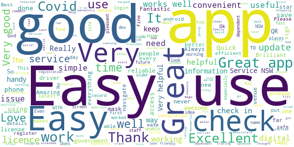

# Service NSW
App version ``6.2.2 (217709)``

Analyzed with [covid-apps-observer](http://github.com/covid-apps-observer) project, version ``0.1``

## App overview
| | |
|-------------------------|-------------------------| 
| **Name**                                          | Service NSW |
| **Unique identifier** | au.gov.nsw.service |
| **Link to Google Play** | [https://play.google.com/store/apps/details?id=au.gov.nsw.service](https://play.google.com/store/apps/details?id=au.gov.nsw.service) |
| **Summary**  | Digital licences, registrations, fines and more |
| **Privacy policy** | [http://www.service.nsw.gov.au/privacy](http://www.service.nsw.gov.au/privacy) |
| **Latest version** | 6.2.2 (217709) |
| **Last update** | 2021-03-10 08:02:03 |
| **Recent changes** | Thanks for using the Service NSW mobile app! Here&#39;s our latest updates: • Dine &amp; Discover vouchers are being rolled out across NSW, when your area is eligible you can now apply within the app. Log in and tap the Get Started link to see if you are eligible. • Fixed a bug where feedback was not being submitted |
| **Installs**  | 1,000,000+ |
| **Category** | Tools |
| **First release** | Dec 7, 2014 |
| **Size**  | 28M |
| **Supported Android version**  | 6.0 and up |

### Description
> The official Service NSW app, making it easier to access government services. 
 <b>Digital licences and credentials</b>
 Access the following digital licences and credentials, with more to come: 
 • Driver Licence 
 • RSA/RCG Competency Card 
 • Working with Children Check 
 • Recreational Fishing Licence 
 • Boat Driver Licence.
 <b>COVID Safe Check-in</b> 
 • Quick, contactless check in at COVID Safe venues 
 • Point your device camera at the COVID Safe QR Code to get started 
 • Save your details for a faster check in next time. 
 <b>Useful tools and services</b>
 • Verify a Digital Driver Licence via our licence checker 
 • Check or renew a registration 
 • Sign into licensed venues.
 <b>Fines and demerits</b>
 • View and pay your fines 
 • View your demerits.
 <b>COVID-19 resources</b>
 • Access COVID-19 statistics by postcode 
 • Access our COVID-19 Assistance Finder with benefits, rebates and concessions. 
 <b>Tell us what you think</b>
 • Help us help you! We’re always working on a better, stronger, faster app. 
 • Share what you’d like to see in the app: we use your feedback to continuously improve the app experience.

### User interface
The developers of the app provide the following screenshots in the Google play store.
| | | |
|:-------------------------:|:-------------------------:|:-------------------------:|
 |   |   |   | 
 |   |  

## Development team
In the following we report the main information provided by the development team in the Google play store.

| | |
|-------------------------|-------------------------|
| **Developer**  | Service NSW |
| **Website**  | [https://www.service.nsw.gov.au/mobile-app      ](https://www.service.nsw.gov.au/mobile-app      ) |
| **Email** | mobileapp@service.nsw.gov.au |
| **Physical address**  | - |
| **Other developed apps**  | [https://play.google.com/store/apps/developer?id=Service+NSW](https://play.google.com/store/apps/developer?id=Service+NSW) |

## Android support

| | |
|-------------------------|-------------------------|
| **Declared target Android version**  | Android10, version 10 (API level 29) |
| **Effective target Android version**  | Android10, version 10 (API level 29) |
| **Minimum supported Android version**  | Marshmallow, version 6.0 (API level 23) |
| **Maximum target Android version**  | - |

The larger the difference between the minimum and maximum supported Android versions, the better. A larger difference means a wider audience. For example, old phones have a very low Android version, so a high minimum supported Android version means that the app cannot be used by users with old phones, thus leading to accessibility problems. 

## Requested permissions

In the following we report the complete list of the permissions requested by the app. 

| **Permission** | **Protection level** | **Description** | 
|-------------------------|-------------------------|-------------------------|
 **android.permission ACCESS_NETWORK_STATE** | Normal | Allows applications to access information about networks. 
 **android.permission ACCESS_WIFI_STATE** | Normal | Allows applications to access information about Wi-Fi networks. 
 **android.permission CAMERA** | :warning:**Dangerous** | Required to be able to access the camera device. 
 **android.permission INTERNET** | Normal | Allows applications to open network sockets. 
 **android.permission READ_APP_BADGE** | - | - 
 **android.permission READ_EXTERNAL_STORAGE** | :warning:**Dangerous** | Allows an application to read from external storage. 
 **android.permission USE_FINGERPRINT** | Normal | This constant was deprecated in API level 28. Applications should request USE_BIOMETRIC instead 
 **android.permission VIBRATE** | Normal | Allows access to the vibrator. 
 **android.permission WAKE_LOCK** | Normal | Allows using PowerManager WakeLocks to keep processor from sleeping or screen from dimming. 
 **android.permission WRITE_EXTERNAL_STORAGE** | :warning:**Dangerous** | Allows an application to write to external storage. 
 **com.anddoes.launcher.permission UPDATE_COUNT** | - | - 
 **com.android.vending CHECK_LICENSE** | - | - 
 **com.google.android.c2dm.permission RECEIVE** | - | - 
 **com.google.android.finsky.permission BIND_GET_INSTALL_REFERRER_SERVICE** | - | - 
 **com.htc.launcher.permission READ_SETTINGS** | - | - 
 **com.htc.launcher.permission UPDATE_SHORTCUT** | - | - 
 **com.huawei.android.launcher.permission CHANGE_BADGE** | - | - 
 **com.huawei.android.launcher.permission READ_SETTINGS** | - | - 
 **com.huawei.android.launcher.permission WRITE_SETTINGS** | - | - 
 **com.majeur.launcher.permission UPDATE_BADGE** | - | - 
 **com.oppo.launcher.permission READ_SETTINGS** | - | - 
 **com.oppo.launcher.permission WRITE_SETTINGS** | - | - 
 **com.sec.android.provider.badge.permission READ** | - | - 
 **com.sec.android.provider.badge.permission WRITE** | - | - 
 **com.sonyericsson.home.permission BROADCAST_BADGE** | - | - 
 **com.sonymobile.home.permission PROVIDER_INSERT_BADGE** | - | - 
 **me.everything.badger.permission BADGE_COUNT_READ** | - | - 
 **me.everything.badger.permission BADGE_COUNT_WRITE** | - | - 

## Mentioned servers

| **Server** | **Registrant** | **Registrant country** | **Creation date** | 
|-------------------------|-------------------------|-------------------------|-------------------------|
 | apache.org | The Apache Software Foundation | :us: US | 1995-04-11 04:00:00 |
 | xml.org | OASIS Open | :us: US | 1997-02-03 05:00:00 |
 | w3.org | W3C | :us: US | 1994-07-06 04:00:00 |
 | purl.org | Internet Archive | :us: US | 1996-01-01 05:00:00 |
 | adobe.com | Adobe Inc. | :us: US | 1986-11-17 05:00:00 |
 | android.com | Google LLC | :us: US | 1997-06-23 04:00:00 |
 | googlesyndication.com | Google LLC | :us: US | 2003-01-21 06:17:24 |
 | google.com | Google LLC | :us: US | 1997-09-15 04:00:00 |
 | app-measurement.com | Google LLC | :us: US | 2015-06-19 20:13:31 |
 | googleapis.com | Google LLC | :us: US | 2005-01-25 17:52:26 |
 | googleapis.com | Google LLC | :us: US | 2005-01-25 17:52:26 |
 | iptc.org | Whois Privacy Service | :us: US | 1995-12-27 05:00:00 |
 | useplus.org | PLUS COALITION | :us: US | 2003-11-18 19:31:25 |
 | npes.org | NPES | :us: US | 1996-01-30 05:00:00 |
 | aiim.org | Association for Information and Image Management International | :us: US | 1995-10-18 04:00:00 |
 | googleapis.com | Google LLC | :us: US | 2005-01-25 17:52:26 |
 | googleapis.com | Google LLC | :us: US | 2005-01-25 17:52:26 |
 | googleadservices.com | Google LLC | :us: US | 2003-06-19 16:34:53 |

## Security analysis 

Below we report the main security warnings raised by our execution of the [Androwarn](https://github.com/maaaaz/androwarn) security analysis tool.

**Telephony identifiers leakage**
> - This application reads the numeric name (MCC+MNC) of current registered operator 
> - This application reads the operator name 
> - This application reads the phone number string for line 1, for example, the MSISDN for a GSM phone 
> - This application reads the unique device ID, i.e the IMEI for GSM and the MEID or ESN for CDMA phones 

**Location lookup**
> - This application reads location information from all available providers (WiFi, GPS etc.) 

**Connection interfaces exfiltration**
> - This application reads details about the currently active data network 
> - This application tries to find out if the currently active data network is metered 

**Audio video eavesdropping**
> - This application records audio from the 'CAMCORDER' source  
> - This application records audio from the 'MIC' source  
> - This application captures video from the 'CAMERA' source 
> - This application captures video from the 'SURFACE' source 

**Suspicious connection establishment**
> - This application opens a Socket and connects it to the remote address '' on the 'N/A' port  
> - This application opens a Socket and connects it to the remote address 'Ljava/lang/StringBuilder;->toString()Ljava/lang/String;' on the ': connect, resolve' port  
> - This application opens a Socket and connects it to the remote address 'Ljava/lang/StringBuilder;->toString()Ljava/lang/String;' on the 'N/A' port  
> - This application opens a Socket and connects it to the remote address 'Ljava/net/Proxy;->type()Ljava/net/Proxy$Type;' on the 'N/A' port  
> - This application opens a Socket and connects it to the remote address 'Network subsystem is unavailable' on the 'N/A' port  
> - This application opens a Socket and connects it to the remote address 'timeout' on the 'N/A' port  

**Pim data leakage**
> - This application accesses data stored in the clipboard 

**Code execution**
> - This application loads a native library 
> - This application loads a native library: 'Ljava/util/Iterator;->next()Ljava/lang/Object;' 
> - This application loads a native library: 'log' 
> - This application loads a native library: 'sentry' 
> - This application loads a native library: 'sentry-android' 
> - This application loads a native library: 'tool-checker' 
> - This application executes a UNIX command 

## User ratings and reviews

Below we provide information about how end users are reacting to the app in terms of ratings and reviews in the Google Play store.

### Ratings

The Service NSW app has been installed by more than **1000000** times. At this time, **5886** rated the app and its average score is **3.6355932**. Below we show the distribution of the ratings across the usual star-based rating of Google Play

:star::star::star::star::star:: 2913

:star::star::star::star:: 848

:star::star::star:: 439

:star::star:: 439

:star:: 1247

### Reviews 

#### 5-star reviews

> Works great, should probably quit buying bloat loaded chinese phones and samsung's. Sucks to suck!  :date: __2021-03-21 08:28:21__

> Very easy to use  :date: __2021-03-20 06:29:39__

> Excellent app!  :date: __2021-03-19 13:54:22__

> great App easy to use for visiting venues shopping centres  :date: __2021-03-18 11:19:17__

> Had to update service app. first to be able to use.  :date: __2021-03-18 01:30:16__

> Amazing  :date: __2021-03-17 09:19:38__

> Very good  :date: __2021-03-16 07:25:46__

> Great  :date: __2021-03-16 01:48:01__

> Great  :date: __2021-03-15 14:25:33__

> Easy to use this app  :date: __2021-03-15 05:33:58__

#### 4-star reviews

> Waiting for app regarding vouchers.  :date: __2021-03-21 05:17:38__

> Works well  :date: __2021-03-12 07:53:22__

> Ok, after a few hiccups and glitches things seem to be back on track. One key note is to only scan QR code directly from app, not camera. Thanks very much to the developers for coming back quickly on my concerns.  :date: __2021-03-12 01:47:26__

> I don't mind using this app to sign in where I want to go. It's quick and easy.  :date: __2021-03-11 20:39:30__

> Been using this app for months and suddenly it will not accept my PIN, which I know is correct??  :date: __2021-03-11 05:15:18__

> Feeling safe  :date: __2021-03-09 22:45:39__

> Delivers a lot of good service, but also falls short in a lot of ways. Istill have intermittant issues with logging in which is annoying. The notification to sign out, while great in principle, simply reminds you to sign out regardless of whether you already have. As someone who has to go to multiple businesses in a row, results in completely useless notifications most of the time and results in less effective real use. Could also stand to have a temporily offline mode.  :date: __2021-03-09 13:25:18__

> Surely the Covid check out reminder should only remind you 2 hours after you check into a venue IF you haven't already checked out. What's the point of sending you a reminder to check out when you have already checked out. The net result is nuisance notifications which in turn get turned off leading to a missed opportunity to deliver meaningful advice.  :date: __2021-03-07 10:18:15__

> Checkout reminders are all well and good, but please don't remind me to check out when I've already done so - that's just annoying. So I've disabled the new feature until fixed.  :date: __2021-03-07 06:23:38__

> OK  :date: __2021-03-04 21:50:20__

#### 3-star reviews

> having trouble scanning in at places over the last few days  :date: __2021-03-19 06:54:09__

> Had this app on previous phone have a later model phone operating system android 5.1 trying to download on new phone told that app can not be downloaded due to operating system not being 6+. Have enormous problem understanding why a later phone model is not compatible. I now have no app other QR apps I do not trust and don't work the same way so I am now not complying with Gov request??????????  :date: __2021-03-18 23:55:21__

> I have tried to use the Services App for 2 days.Every time I attempt tp use it, it says that I am locked out. Services NSW staff at Goulburn were unable to find the problem. I now say the app is USELESS.  :date: __2021-03-18 11:10:03__

> My app disappeared from my device, google day i have no devices. ???? I cant download or update  :date: __2021-03-17 00:00:26__

> Unable to update digital drivers licence after renewal (combined boat/car). Can you please allow users to deregister individual licences rather than deregister them all?  :date: __2021-03-15 09:17:17__

> When using covid check in my app does not save my details (ie name and phone number) and sends me a code to enter every check in, however my husbands app saves his details and let's him check in without waiting for a code. I can't locate any settings to change this.  :date: __2021-03-15 08:15:49__

> Good  :date: __2021-03-15 01:56:15__

> Works as intended  :date: __2021-03-12 02:45:05__

> Very complicated to set up password  :date: __2021-03-11 04:04:43__

> Stuck in 'one moment, please' when applying for the voucher.  :date: __2021-03-11 01:40:45__

#### 2-star reviews

> I'd l like to give this app five stars as it has functioned well in the past, but now it refuses log in on my mobile phone because my "device may be using non-standard software" and "for your security" I am not allowed to log in. Why is the NSW Government now dictating what I can or cannot do with my own personal device? Does this mean I need to spend hundreds of dollars on a new device simply to claim my $100 voucher? Or revert back to unsafe insecure out-dated official software?  :date: __2021-03-21 13:47:34__

> It resets it self when I use other apps and then get back to it, Android.  :date: __2021-03-19 03:04:06__

> Have tried to get vouchers, put address in, says I'm eligible, press the accept button the sits there and spins. Have been trying for 2 days now. Just great.  :date: __2021-03-13 11:49:39__

> After updating the app, I can't log in despite I tried lots of time yesterday or today. I can use my email and password to get in on the website, but not via app. 😥  :date: __2021-03-13 06:32:41__

> UPDATE: yes I worked that out eventually. Your error handling/messages could easily have prevented this, and made clear there was an outage. Look at all the other reviews where people were unnecessarily resetting their passwords. *Moreover* design thinking - login is totally unnecessary for interactions like covid sign in! Lol. Update has broken login. Fingerprint no longer unlocks and asks for PIN, which then says I've got the wrong PIN. Hahaha, nope. Your app is broken, well done. Now fix it!  :date: __2021-03-12 00:20:34__

> You know, the covid check-in option should be at the top of the page, front and centre! I shouldn't have to scroll down past fishing licence applications to get there. Academic right now because I keep being told that I can't check in right now. Thanks for the additonal feedback. Problem was internal to the app. Update: now am being told that my PIN is incorrect but I am using my fingerprint! No PIN involved.  :date: __2021-03-11 07:43:54__

> Easy way to check in. Much improved with the updates. UPDATE: What's happened to the app? Now it won't accept my PIN? I can't apply for the vouchers? Fix these please.  :date: __2021-03-11 07:01:17__

> Just updated the app on my Google pixel 2 because I couldn't sign into a venue. Once updated I was able to sign in once and now the app says I'm using the wrong pin. Very very frustrating since this is the only way to get In to any venues. It doesn't even recognise my email which I have been using for months. This needs to be rectified very quickly so everyone can get back to boosting the economy.  :date: __2021-03-11 06:25:34__

> Crashes alot  :date: __2021-03-11 06:09:12__

> Was good till updated then it says email and passwords incorrect same as ive been using for ages just unistalled and reinstalled to see if that helps  :date: __2021-03-11 05:35:42__

#### 1-star reviews

> I cant sign in on this app but have no trouble signing in on a computer ive contacted service nsw and they cant help either. Ive deleted the app and re installed it, turned phone off and on everything does not help. I use to use it alot but one day it signed me out for no reason and that was it. Cant even check in to a venue for covid but if i use my internet browser on my phone i can log in that way. I have a galaxy s10.  :date: __2021-03-21 12:27:44__

> Can't redeem my entertainment vouchers. The page hangs and then eventually times out. Unacceptable.  :date: __2021-03-21 08:32:01__

> Tried 3 photos (Android devices) and cannot redeem the covid vouchers  :date: __2021-03-21 06:24:19__

> Have to have the app to claim vouchers, everytime I try to claim a voucher I just get a continuous buffering screen with a grey circle that says "please wait a moment", I have been waiting over 24 hours now. I have also deleted and re-downloaded the app. It just seems broken. Ever notice how this government never goes for the good option, it's always the cheapest. It's the nbn all over again.  :date: __2021-03-20 20:55:00__

> I cannot claim the Dine & Discover vouchers via this dodgy app. I enter my address, it says I'm eligible, I click where I'm told, then the "circle" spins for eternity. Plenty of others say the same! I've tried on four separate days, and different times (in case it's overwhelmed, and our govt is poorly prepared again)... fails EVERY time.  :date: __2021-03-20 08:45:10__

> Won't let me download dine and discover vouchers. Very frustrating  :date: __2021-03-20 05:35:19__

> This app gets worse as time goes by, can you employ professional developers who know what they are doing rather than the clowns running it now. Would give it zero stars if that was an option  :date: __2021-03-20 00:45:18__

> How much money did the tax payer waste on this poor functioning app?.Tried for over 2 hours to obtain the dine/discover vouchers for my elderly mother.It wouldn't accept Medicare number 6 times.It rejected it every time even though it was correct! it reverted back to make me log in again,every time!.On the last occasion prior to giving up,the screen said,please wait! I gave up after waiting half an hour!.The poor businesses that were forced to lockdown can't receive our vouchers now #👎gov!!.  :date: __2021-03-19 13:00:05__

> Absolute rubbish, will not accept email address to create a account! typical garbage fed to the gullible public from a very greedy government. Don't waste your time, believe me it doesn't work, huge thumbs down 👇  :date: __2021-03-19 08:46:41__

> EVERY TIME. The app asks me to log in, even after clicking remember info. Now it logged me out completely & apparently my email address is invalid, so I can't send a change password email or even create a new log in. So that helps.  :date: __2021-03-19 07:21:27__

