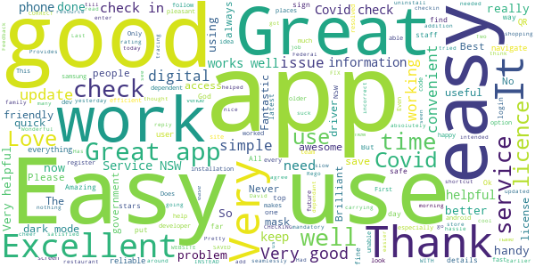
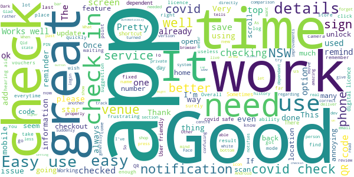
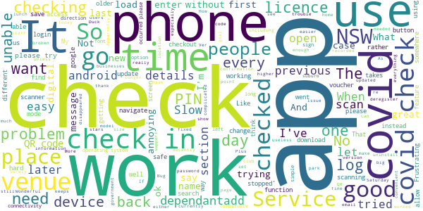
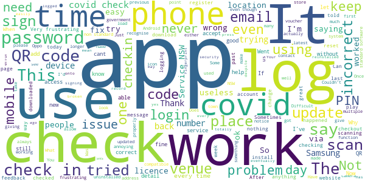
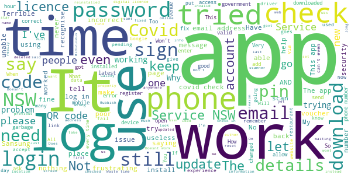

# Service NSW
App version ``6.4.1 (226211)``

Analyzed with [covid-apps-observer](http://github.com/covid-apps-observer) project, version ``0.1``

## App overview
| | |
|-------------------------|-------------------------| 
| **Name**&nbsp;&nbsp;&nbsp;&nbsp;&nbsp;&nbsp;&nbsp;&nbsp;&nbsp;&nbsp;&nbsp;&nbsp;&nbsp;&nbsp;&nbsp;&nbsp;&nbsp;&nbsp;&nbsp;&nbsp;&nbsp;&nbsp;&nbsp;&nbsp;&nbsp;&nbsp;&nbsp;&nbsp;&nbsp;&nbsp;&nbsp;&nbsp;&nbsp;&nbsp;&nbsp;&nbsp;&nbsp;&nbsp;&nbsp;&nbsp;  | Service NSW |
| **Unique identifier** | au.gov.nsw.service |
| **Link to Google Play** | [https://play.google.com/store/apps/details?id=au.gov.nsw.service](https://play.google.com/store/apps/details?id=au.gov.nsw.service) |
| **Summary**  | Digital licences, registrations, fines and more |
| **Privacy policy** | [http://www.service.nsw.gov.au/privacy](http://www.service.nsw.gov.au/privacy) |
| **Latest version** | 6.4.1 (226211) |
| **Last update** | 2021-03-22 07:54:28 |
| **Recent changes** | Thanks for using the Service NSW mobile app! We used your feedback to make these changes: • You can now get your Digital White Card. Thanks for your feedback on the public beta. • Choose the time to receive your check out reminder, from 10 minutes to 5 hours. Tap Settings &gt; Notifications to choose the time. |
| **Installs**  | 1,000,000+ |
| **Category** | Tools |
| **First release** | Dec 7, 2014 |
| **Size**  | 28M |
| **Supported Android version**  | 6.0 and up |

### Description
> The official Service NSW app, making it easier to access government services. 
 <b>Digital licences and credentials</b>
 Access the following digital licences and credentials, with more to come: 
 • Driver Licence 
 • RSA/RCG Competency Card 
 • Working with Children Check 
 • Recreational Fishing Licence 
 • Boat Driver Licence.
 <b>COVID Safe Check-in</b> 
 • Quick, contactless check in at COVID Safe venues 
 • Point your device camera at the COVID Safe QR Code to get started 
 • Save your details for a faster check in next time. 
 <b>Useful tools and services</b>
 • Verify a Digital Driver Licence via our licence checker 
 • Check or renew a registration 
 • Sign into licensed venues.
 <b>Fines and demerits</b>
 • View and pay your fines 
 • View your demerits.
 <b>COVID-19 resources</b>
 • Access COVID-19 statistics by postcode 
 • Access our COVID-19 Assistance Finder with benefits, rebates and concessions. 
 <b>Tell us what you think</b>
 • Help us help you! We’re always working on a better, stronger, faster app. 
 • Share what you’d like to see in the app: we use your feedback to continuously improve the app experience.

### User interface
The developers of the app provide the following screenshots in the Google play store.
| | | |
|:-------------------------:|:-------------------------:|:-------------------------:|
 |   |   |   | 
 |   |  

## Development team
In the following we report the main information provided by the development team in the Google play store.

| | |
|-------------------------|-------------------------|
| **Developer**  | Service NSW |
| **Website**  | [https://www.service.nsw.gov.au/mobile-app      ](https://www.service.nsw.gov.au/mobile-app      ) |
| **Email** | mobileapp@service.nsw.gov.au |
| **Physical address**  | - |
| **Other developed apps**  | [https://play.google.com/store/apps/developer?id=Service+NSW](https://play.google.com/store/apps/developer?id=Service+NSW) |

## Android support

| | |
|-------------------------|-------------------------|
| **Declared target Android version**  | Android10, version 10 (API level 29) |
| **Effective target Android version**  | Android10, version 10 (API level 29) |
| **Minimum supported Android version**  | Marshmallow, version 6.0 (API level 23) |
| **Maximum target Android version**  | - |

The larger the difference between the minimum and maximum supported Android versions, the better. A larger difference means a wider audience. For example, old phones have a very low Android version, so a high minimum supported Android version means that the app cannot be used by users with old phones, thus leading to accessibility problems. 

## Requested permissions

In the following we report the complete list of the permissions requested by the app. 

| **Permission** | **Protection level** | **Description** | 
|-------------------------|-------------------------|-------------------------|
 **android.permission ACCESS_NETWORK_STATE** | Normal | Allows applications to access information about networks. 
 **android.permission ACCESS_WIFI_STATE** | Normal | Allows applications to access information about Wi-Fi networks. 
 **android.permission CAMERA** | :warning:**Dangerous** | Required to be able to access the camera device. 
 **android.permission INTERNET** | Normal | Allows applications to open network sockets. 
 **android.permission READ_APP_BADGE** | - | - 
 **android.permission USE_FINGERPRINT** | Normal | This constant was deprecated in API level 28. Applications should request USE_BIOMETRIC instead 
 **android.permission VIBRATE** | Normal | Allows access to the vibrator. 
 **android.permission WAKE_LOCK** | Normal | Allows using PowerManager WakeLocks to keep processor from sleeping or screen from dimming. 
 **com.anddoes.launcher.permission UPDATE_COUNT** | - | - 
 **com.android.vending CHECK_LICENSE** | - | - 
 **com.google.android.c2dm.permission RECEIVE** | - | - 
 **com.google.android.finsky.permission BIND_GET_INSTALL_REFERRER_SERVICE** | - | - 
 **com.htc.launcher.permission READ_SETTINGS** | - | - 
 **com.htc.launcher.permission UPDATE_SHORTCUT** | - | - 
 **com.huawei.android.launcher.permission CHANGE_BADGE** | - | - 
 **com.huawei.android.launcher.permission READ_SETTINGS** | - | - 
 **com.huawei.android.launcher.permission WRITE_SETTINGS** | - | - 
 **com.majeur.launcher.permission UPDATE_BADGE** | - | - 
 **com.oppo.launcher.permission READ_SETTINGS** | - | - 
 **com.oppo.launcher.permission WRITE_SETTINGS** | - | - 
 **com.sec.android.provider.badge.permission READ** | - | - 
 **com.sec.android.provider.badge.permission WRITE** | - | - 
 **com.sonyericsson.home.permission BROADCAST_BADGE** | - | - 
 **com.sonymobile.home.permission PROVIDER_INSERT_BADGE** | - | - 
 **me.everything.badger.permission BADGE_COUNT_READ** | - | - 
 **me.everything.badger.permission BADGE_COUNT_WRITE** | - | - 

## Mentioned servers

| **Server** | **Registrant** | **Registrant country** | **Creation date** | 
|-------------------------|-------------------------|-------------------------|-------------------------|
 | apache.org | The Apache Software Foundation | :us: US | 1995-04-11 04:00:00 |
 | xml.org | OASIS Open | :us: US | 1997-02-03 05:00:00 |
 | w3.org | W3C | :us: US | 1994-07-06 04:00:00 |
 | purl.org | Internet Archive | :us: US | 1996-01-01 05:00:00 |
 | adobe.com | Adobe Inc. | :us: US | 1986-11-17 05:00:00 |
 | android.com | Google LLC | :us: US | 1997-06-23 04:00:00 |
 | googlesyndication.com | Google LLC | :us: US | 2003-01-21 06:17:24 |
 | google.com | Google LLC | :us: US | 1997-09-15 04:00:00 |
 | app-measurement.com | Google LLC | :us: US | 2015-06-19 20:13:31 |
 | googleapis.com | Google LLC | :us: US | 2005-01-25 17:52:26 |
 | googleapis.com | Google LLC | :us: US | 2005-01-25 17:52:26 |
 | iptc.org | Whois Privacy Service | :us: US | 1995-12-27 05:00:00 |
 | useplus.org | PLUS COALITION | :us: US | 2003-11-18 19:31:25 |
 | npes.org | NPES | :us: US | 1996-01-30 05:00:00 |
 | aiim.org | Association for Information and Image Management International | :us: US | 1995-10-18 04:00:00 |
 | googleapis.com | Google LLC | :us: US | 2005-01-25 17:52:26 |
 | googleapis.com | Google LLC | :us: US | 2005-01-25 17:52:26 |
 | googleadservices.com | Google LLC | :us: US | 2003-06-19 16:34:53 |

## Security analysis 

Below we report the main security warnings raised by our execution of the [Androwarn](https://github.com/maaaaz/androwarn) security analysis tool.

**Telephony identifiers leakage**
> - This application reads the numeric name (MCC+MNC) of current registered operator 
> - This application reads the operator name 
> - This application reads the phone number string for line 1, for example, the MSISDN for a GSM phone 
> - This application reads the unique device ID, i.e the IMEI for GSM and the MEID or ESN for CDMA phones 

**Location lookup**
> - This application reads location information from all available providers (WiFi, GPS etc.) 

**Connection interfaces exfiltration**
> - This application reads details about the currently active data network 
> - This application tries to find out if the currently active data network is metered 

**Audio video eavesdropping**
> - This application records audio from the 'CAMCORDER' source  
> - This application records audio from the 'MIC' source  
> - This application captures video from the 'CAMERA' source 
> - This application captures video from the 'SURFACE' source 

**Suspicious connection establishment**
> - This application opens a Socket and connects it to the remote address '' on the 'N/A' port  
> - This application opens a Socket and connects it to the remote address 'Ljava/lang/StringBuilder;->toString()Ljava/lang/String;' on the ': connect, resolve' port  
> - This application opens a Socket and connects it to the remote address 'Ljava/lang/StringBuilder;->toString()Ljava/lang/String;' on the 'N/A' port  
> - This application opens a Socket and connects it to the remote address 'Ljava/net/Proxy;->type()Ljava/net/Proxy$Type;' on the 'N/A' port  
> - This application opens a Socket and connects it to the remote address 'Network subsystem is unavailable' on the 'N/A' port  
> - This application opens a Socket and connects it to the remote address 'timeout' on the 'N/A' port  

**Pim data leakage**
> - This application accesses data stored in the clipboard 

**Code execution**
> - This application loads a native library 
> - This application loads a native library: 'Ljava/util/Iterator;->next()Ljava/lang/Object;' 
> - This application loads a native library: 'log' 
> - This application loads a native library: 'sentry' 
> - This application loads a native library: 'sentry-android' 
> - This application loads a native library: 'tool-checker' 
> - This application executes a UNIX command 

## User ratings and reviews

Below we provide information about how end users are reacting to the app in terms of ratings and reviews in the Google Play store.

### Ratings

The Service NSW app has been installed by more than **1000000** times. At this time, **6109** rated the app and its average score is **3.4798062**. Below we show the distribution of the ratings across the usual star-based rating of Google Play

:star::star::star::star::star:: 2813

:star::star::star::star:: 849

:star::star::star:: 454

:star::star:: 444

:star:: 1549

### Reviews 

#### 5-star reviews

> Does what it needs to. Well done  :date: __2021-03-28 08:55:56__

> Thanks to the NSW Services team for making covid check in easy, and enabling digital licences.  :date: __2021-03-28 07:29:50__

> Follow promps  :date: __2021-03-28 07:10:24__

> Helpfulness  :date: __2021-03-28 04:40:46__

> Good app.  :date: __2021-03-28 04:26:48__

> Great  :date: __2021-03-27 15:52:24__

> All good  :date: __2021-03-27 13:17:01__

> Best app  :date: __2021-03-27 08:21:08__

> Great app  :date: __2021-03-27 01:45:56__

> Fantastic service and staff, always friendly with a smile 😀.So much better than the R.M.S which was so slow and difficult.  :date: __2021-03-27 01:00:52__

#### 4-star reviews

> Very.good.i.wish.was. more.easy  :date: __2021-03-28 10:51:50__

> Good information  :date: __2021-03-28 03:02:12__

> I am cautious regarding personal information. Security of private details need to be of the utmost importance.  :date: __2021-03-26 02:46:33__

> Frustrating it won't let me use covid sign in at venues and for some reason and everytime I try to sign in it tells me my details are wrong. I have now got the covid app going ok which is good. I also need to use the Qld's version as I live next door to the gold coast in the Tweed Heads area and in comparison - the NSW one is a far better. - more reliable. I got my vouchers on my email address - am I supposed to print them out and one thing Qld are not offering anything like these vouchers - thank you NSW for doing this, great state to live in.  :date: __2021-03-25 21:11:03__

> Latest update on Dark mode cannot display the checkout time properly . Please the agile dev team to verify all possible dependences before the rollout mate 😂  :date: __2021-03-23 22:44:44__

> Works well where there is good network. Easy to use if you read instructions.  :date: __2021-03-23 02:18:16__

> Dark mode, except for the white bar at the bottom. That will be bright white.  :date: __2021-03-22 06:25:08__

> I know it's there if I need to use it as I haven't had to sp far  :date: __2021-03-22 05:09:34__

> Waiting for app regarding vouchers.  :date: __2021-03-21 05:17:38__

> Works well  :date: __2021-03-12 07:53:22__

#### 3-star reviews

> Check in not currently working. Well let you check in, but when you go to check out there is no record of check-in. Shows previous one instead.  :date: __2021-03-28 00:57:08__

> Dark mode is a joke. When I go to check out of the covid safe check in, I can't see the time at all. So if I forget to check out of a venue, and try to check out later, can't see the time. So I just reverted back to light mode.  :date: __2021-03-24 04:19:12__

> Recently updated to vers 6.2.2. Currently getting messages, 'email has stopped', 'messages has stopped', 'google has stopped'......any connection???  :date: __2021-03-24 03:14:04__

> Logging in is slow, it's very annoying when you want to quickly get into the app to do the covid check in and it takes a while to log in.  :date: __2021-03-23 08:56:35__

> Like all of No Service NSW, it does not work properly and gets worse with every iteration. Now it won't let me qr in unless I log into it first, before scanning. Plus I had to re-enter my details again. Why can't we go back to private ones that worked?  :date: __2021-03-22 23:12:46__

> I have applied for dine n discover vouchers and they display in the app. But unless you search a specific postcode or suburb it's useless, why can't the map show all businesses near ne not just a searched suburb? No point for businesses if you can't find them. Please fix it.  :date: __2021-03-22 08:44:42__

> It is disappointing with the vouchers, As it doesn't work, So l went online and Tried there and it worked 😁  :date: __2021-03-21 20:43:17__

> having trouble scanning in at places over the last few days  :date: __2021-03-19 06:54:09__

> Had this app on previous phone have a later model phone operating system android 5.1 trying to download on new phone told that app can not be downloaded due to operating system not being 6+. Have enormous problem understanding why a later phone model is not compatible. I now have no app other QR apps I do not trust and don't work the same way so I am now not complying with Gov request??????????  :date: __2021-03-18 23:55:21__

> I have tried to use the Services App for 2 days.Every time I attempt tp use it, it says that I am locked out. Services NSW staff at Goulburn were unable to find the problem. I now say the app is USELESS.  :date: __2021-03-18 11:10:03__

#### 2-star reviews

> Has worked fine until a few days ago, it has logged me out and says 'incorrect email or password'. I have reset my password, uninstalled and reinstalled the app numerous time but nothing fixes the issue. I can log onto the Service NSW website with no problems, so the password is not the problem, it is a glitch with the app  :date: __2021-03-27 02:31:31__

> Not letting me login  :date: __2021-03-26 02:57:05__

> this is the only email you have on record, but signing in says it is wrong???  :date: __2021-03-25 13:18:32__

> App always says password incorrect even though I can log in via the pc Very frustrating I have tried reinstalling no joy Any help appreciated  :date: __2021-03-24 02:35:21__

> It glitches out every time I try to add a digital licence or anything else to the app.  :date: __2021-03-23 14:08:03__

> I'd l like to give this app five stars as it has functioned well in the past, but now it refuses log in on my mobile phone because my "device may be using non-standard software" and "for your security" I am not allowed to log in. Why is the NSW Government now dictating what I can or cannot do with my own personal device? Does this mean I need to spend hundreds of dollars on a new device simply to claim my $100 voucher? Or revert back to unsafe insecure out-dated official software?  :date: __2021-03-21 13:47:34__

> It resets it self when I use other apps and then get back to it, Android.  :date: __2021-03-19 03:04:06__

> Have tried to get vouchers, put address in, says I'm eligible, press the accept button the sits there and spins. Have been trying for 2 days now. Just great.  :date: __2021-03-13 11:49:39__

> After updating the app, I can't log in despite I tried lots of time yesterday or today. I can use my email and password to get in on the website, but not via app. 😥  :date: __2021-03-13 06:32:41__

> UPDATE: yes I worked that out eventually. Your error handling/messages could easily have prevented this, and made clear there was an outage. Look at all the other reviews where people were unnecessarily resetting their passwords. *Moreover* design thinking - login is totally unnecessary for interactions like covid sign in! Lol. Update has broken login. Fingerprint no longer unlocks and asks for PIN, which then says I've got the wrong PIN. Hahaha, nope. Your app is broken, well done. Now fix it!  :date: __2021-03-12 00:20:34__

#### 1-star reviews

> Vouchers not available  :date: __2021-03-28 12:09:02__

> Can't log in on phones with aftermarket firmware. The app says this is for security reasons, but as a professional software developer, I assure you this is security theatre. There is nothing insecure about running apps on aftermarket firmware unless the app itself is insecure, which raises concerns about the security of the Service NSW app.  :date: __2021-03-28 10:02:44__

> Doesnt work in my new Mate 30 pro anymore  :date: __2021-03-28 06:56:34__

> Frustrating, took five goes to get acceptance for the vouchers Hi  :date: __2021-03-28 06:34:47__

> Won't accept my password 6 times the time  :date: __2021-03-27 21:00:39__

> Doesn't let me log in with my "non-standard software" i.e rooted phone.  :date: __2021-03-27 13:59:45__

> Won't download on my Samsung phone. Have tried several times.  :date: __2021-03-27 06:09:25__

> Since updating the app, I can no longer sign it, it says my details are incorrect even though it works on PC  :date: __2021-03-27 05:56:59__

> Email never comes, garbage  :date: __2021-03-27 04:58:18__

> Typical government app. Terrible to use from constant hassles logging in to poor navigation and design  :date: __2021-03-27 03:01:26__

