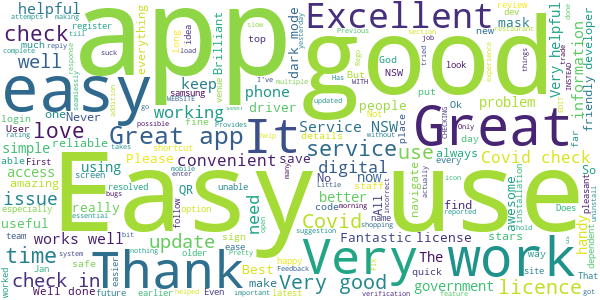
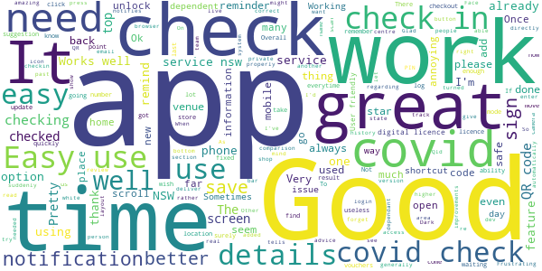
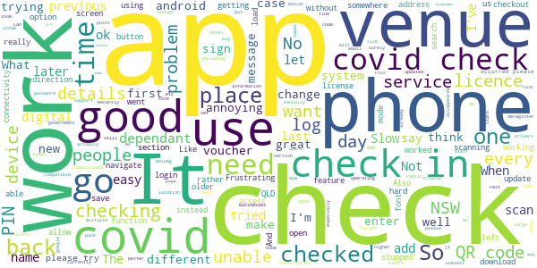
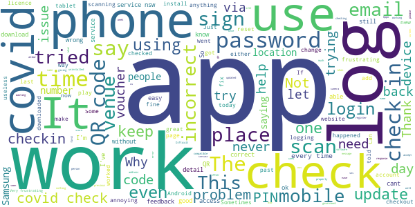
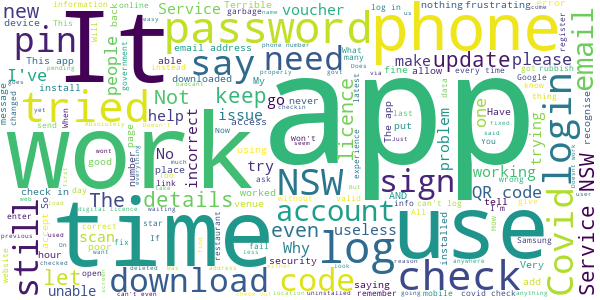

# Service NSW
App version ``6.5.0 (231417)``

Analyzed with [covid-apps-observer](http://github.com/covid-apps-observer) project, version ``0.1``

## App overview
| | |
|-------------------------|-------------------------| 
| **Name**&nbsp;&nbsp;&nbsp;&nbsp;&nbsp;&nbsp;&nbsp;&nbsp;&nbsp;&nbsp;&nbsp;&nbsp;&nbsp;&nbsp;&nbsp;&nbsp;&nbsp;&nbsp;&nbsp;&nbsp;&nbsp;&nbsp;&nbsp;&nbsp;&nbsp;&nbsp;&nbsp;&nbsp;&nbsp;&nbsp;&nbsp;&nbsp;&nbsp;&nbsp;&nbsp;&nbsp;&nbsp;&nbsp;&nbsp;&nbsp;  | Service NSW |
| **Unique identifier** | au.gov.nsw.service |
| **Link to Google Play** | [https://play.google.com/store/apps/details?id=au.gov.nsw.service](https://play.google.com/store/apps/details?id=au.gov.nsw.service) |
| **Summary**  | Digital licences, registrations, fines and more |
| **Privacy policy** | [http://www.service.nsw.gov.au/privacy](http://www.service.nsw.gov.au/privacy) |
| **Latest version** | 6.5.0 (231417) |
| **Last update** | 2021-03-30 01:48:23 |
| **Recent changes** | Thanks for using the Service NSW mobile app. We used your feedback to make these improvements: • Increased visibility that Dine &amp; Discover vouchers are single use only • NSW Photo Card holders in the Blacktown area can now get their Digital Photo Card • Fixed a bug where check out times didn&#39;t show correctly in dark mode • Fixed a bug where the bottom navigation bar didn&#39;t show correctly in dark mode |
| **Installs**  | 1,000,000+ |
| **Category** | Tools |
| **First release** | Dec 7, 2014 |
| **Size**  | 29M |
| **Supported Android version**  | 6.0 and up |

### Description
> The official Service NSW app, making it easier to access government services. 
 <b>Digital licences and credentials</b>
 Access the following digital licences and credentials, with more to come: 
 • Driver Licence 
 • RSA/RCG Competency Card 
 • Working with Children Check 
 • Recreational Fishing Licence 
 • Boat Driver Licence.
 <b>COVID Safe Check-in</b> 
 • Quick, contactless check in at COVID Safe venues 
 • Point your device camera at the COVID Safe QR Code to get started 
 • Save your details for a faster check in next time. 
 <b>Useful tools and services</b>
 • Verify a Digital Driver Licence via our licence checker 
 • Check or renew a registration 
 • Sign into licensed venues.
 <b>Fines and demerits</b>
 • View and pay your fines 
 • View your demerits.
 <b>COVID-19 resources</b>
 • Access COVID-19 statistics by postcode 
 • Access our COVID-19 Assistance Finder with benefits, rebates and concessions. 
 <b>Tell us what you think</b>
 • Help us help you! We’re always working on a better, stronger, faster app. 
 • Share what you’d like to see in the app: we use your feedback to continuously improve the app experience.

### User interface
The developers of the app provide the following screenshots in the Google play store.
| | | |
|:-------------------------:|:-------------------------:|:-------------------------:|
 |   |   |   | 
 |   |  

## Development team
In the following we report the main information provided by the development team in the Google play store.

| | |
|-------------------------|-------------------------|
| **Developer**  | Service NSW |
| **Website**  | [https://www.service.nsw.gov.au/mobile-app      ](https://www.service.nsw.gov.au/mobile-app      ) |
| **Email** | mobileapp@service.nsw.gov.au |
| **Physical address**  | - |
| **Other developed apps**  | [https://play.google.com/store/apps/developer?id=Service+NSW](https://play.google.com/store/apps/developer?id=Service+NSW) |

## Android support

| | |
|-------------------------|-------------------------|
| **Declared target Android version**  | Android10, version 10 (API level 29) |
| **Effective target Android version**  | Android10, version 10 (API level 29) |
| **Minimum supported Android version**  | Marshmallow, version 6.0 (API level 23) |
| **Maximum target Android version**  | - |

The larger the difference between the minimum and maximum supported Android versions, the better. A larger difference means a wider audience. For example, old phones have a very low Android version, so a high minimum supported Android version means that the app cannot be used by users with old phones, thus leading to accessibility problems. 

## Requested permissions

In the following we report the complete list of the permissions requested by the app. 

| **Permission** | **Protection level** | **Description** | 
|-------------------------|-------------------------|-------------------------|
 **android.permission ACCESS_NETWORK_STATE** | Normal | Allows applications to access information about networks. 
 **android.permission ACCESS_WIFI_STATE** | Normal | Allows applications to access information about Wi-Fi networks. 
 **android.permission CAMERA** | :warning:**Dangerous** | Required to be able to access the camera device. 
 **android.permission INTERNET** | Normal | Allows applications to open network sockets. 
 **android.permission READ_APP_BADGE** | - | - 
 **android.permission USE_FINGERPRINT** | Normal | This constant was deprecated in API level 28. Applications should request USE_BIOMETRIC instead 
 **android.permission VIBRATE** | Normal | Allows access to the vibrator. 
 **android.permission WAKE_LOCK** | Normal | Allows using PowerManager WakeLocks to keep processor from sleeping or screen from dimming. 
 **com.anddoes.launcher.permission UPDATE_COUNT** | - | - 
 **com.android.vending CHECK_LICENSE** | - | - 
 **com.google.android.c2dm.permission RECEIVE** | - | - 
 **com.google.android.finsky.permission BIND_GET_INSTALL_REFERRER_SERVICE** | - | - 
 **com.htc.launcher.permission READ_SETTINGS** | - | - 
 **com.htc.launcher.permission UPDATE_SHORTCUT** | - | - 
 **com.huawei.android.launcher.permission CHANGE_BADGE** | - | - 
 **com.huawei.android.launcher.permission READ_SETTINGS** | - | - 
 **com.huawei.android.launcher.permission WRITE_SETTINGS** | - | - 
 **com.majeur.launcher.permission UPDATE_BADGE** | - | - 
 **com.oppo.launcher.permission READ_SETTINGS** | - | - 
 **com.oppo.launcher.permission WRITE_SETTINGS** | - | - 
 **com.sec.android.provider.badge.permission READ** | - | - 
 **com.sec.android.provider.badge.permission WRITE** | - | - 
 **com.sonyericsson.home.permission BROADCAST_BADGE** | - | - 
 **com.sonymobile.home.permission PROVIDER_INSERT_BADGE** | - | - 
 **me.everything.badger.permission BADGE_COUNT_READ** | - | - 
 **me.everything.badger.permission BADGE_COUNT_WRITE** | - | - 

## Mentioned servers

| **Server** | **Registrant** | **Registrant country** | **Creation date** | 
|-------------------------|-------------------------|-------------------------|-------------------------|
 | apache.org | The Apache Software Foundation | :us: US | 1995-04-11 04:00:00 |
 | xml.org | OASIS Open | :us: US | 1997-02-03 05:00:00 |
 | w3.org | W3C | :us: US | 1994-07-06 04:00:00 |
 | purl.org | Internet Archive | :us: US | 1996-01-01 05:00:00 |
 | adobe.com | Adobe Inc. | :us: US | 1986-11-17 05:00:00 |
 | android.com | Google LLC | :us: US | 1997-06-23 04:00:00 |
 | googlesyndication.com | Google LLC | :us: US | 2003-01-21 06:17:24 |
 | google.com | Google LLC | :us: US | 1997-09-15 04:00:00 |
 | app-measurement.com | Google LLC | :us: US | 2015-06-19 20:13:31 |
 | googleapis.com | Google LLC | :us: US | 2005-01-25 17:52:26 |
 | googleapis.com | Google LLC | :us: US | 2005-01-25 17:52:26 |
 | iptc.org | Whois Privacy Service | :us: US | 1995-12-27 05:00:00 |
 | useplus.org | PLUS COALITION | :us: US | 2003-11-18 19:31:25 |
 | npes.org | NPES | :us: US | 1996-01-30 05:00:00 |
 | aiim.org | Association for Information and Image Management International | :us: US | 1995-10-18 04:00:00 |
 | googleapis.com | Google LLC | :us: US | 2005-01-25 17:52:26 |
 | googleapis.com | Google LLC | :us: US | 2005-01-25 17:52:26 |
 | googleadservices.com | Google LLC | :us: US | 2003-06-19 16:34:53 |

## Security analysis 

Below we report the main security warnings raised by our execution of the [Androwarn](https://github.com/maaaaz/androwarn) security analysis tool.

**Telephony identifiers leakage**
> - This application reads the numeric name (MCC+MNC) of current registered operator 
> - This application reads the operator name 
> - This application reads the phone number string for line 1, for example, the MSISDN for a GSM phone 
> - This application reads the unique device ID, i.e the IMEI for GSM and the MEID or ESN for CDMA phones 

**Location lookup**
> - This application reads location information from all available providers (WiFi, GPS etc.) 

**Connection interfaces exfiltration**
> - This application reads details about the currently active data network 
> - This application tries to find out if the currently active data network is metered 

**Audio video eavesdropping**
> - This application records audio from the 'CAMCORDER' source  
> - This application records audio from the 'MIC' source  
> - This application captures video from the 'CAMERA' source 
> - This application captures video from the 'SURFACE' source 

**Suspicious connection establishment**
> - This application opens a Socket and connects it to the remote address '' on the 'N/A' port  
> - This application opens a Socket and connects it to the remote address 'Ljava/lang/StringBuilder;->toString()Ljava/lang/String;' on the ': connect, resolve' port  
> - This application opens a Socket and connects it to the remote address 'Ljava/lang/StringBuilder;->toString()Ljava/lang/String;' on the 'N/A' port  
> - This application opens a Socket and connects it to the remote address 'Ljava/net/Proxy;->type()Ljava/net/Proxy$Type;' on the 'N/A' port  
> - This application opens a Socket and connects it to the remote address 'Network subsystem is unavailable' on the 'N/A' port  
> - This application opens a Socket and connects it to the remote address 'timeout' on the 'N/A' port  

**Pim data leakage**
> - This application accesses data stored in the clipboard 

**Code execution**
> - This application loads a native library 
> - This application loads a native library: 'Ljava/util/Iterator;->next()Ljava/lang/Object;' 
> - This application loads a native library: 'log' 
> - This application loads a native library: 'sentry' 
> - This application loads a native library: 'sentry-android' 
> - This application loads a native library: 'tool-checker' 
> - This application executes a UNIX command 

## User ratings and reviews

Below we provide information about how end users are reacting to the app in terms of ratings and reviews in the Google Play store.

### Ratings

The Service NSW app has been installed by more than **1000000** times. At this time, **6122** rated the app and its average score is **3.5227273**. Below we show the distribution of the ratings across the usual star-based rating of Google Play

:star::star::star::star::star:: 2893

:star::star::star::star:: 904

:star::star::star:: 397

:star::star:: 367

:star:: 1561

### Reviews 

#### 5-star reviews

> Update 4/4/21: Thanks for prompt & helpful developer response. I understand my earlier review in Jan was during a temp outage; Updates and check-ins since have gone well. [Jan review: Couldn't use CovidSafe check in on multiple attempts, as verification code/s to mobile took ~1 hour to arrive (after shop closed) - signal wasn't an issue. Not sure if this is an app problem or somewhere else in Service NSW's system, but its most important function needs to properly work.]  :date: __2021-04-04 11:45:30__

> Very happy with the app!  :date: __2021-04-04 02:24:43__

> A caring app  :date: __2021-04-04 00:09:12__

> EDIT: Thanks for implementing my suggestion - you get 5 stars now and you can leave the money on the fridge haha 🤑 (Previous review: It takes too long to open the app, wait for it to load, then eventually find the COVID check-in section, all while people are queueing behind you! Please include a long-tap shortcut that immediately opens the scanner section without all this rigmarole.)  :date: __2021-04-03 13:47:23__

> Easy to use app  :date: __2021-04-03 00:07:17__

> I like the service  :date: __2021-04-02 19:37:37__

> Not bad  :date: __2021-04-02 13:59:00__

> Very useful app making it easy to access some essential things. The developers address reported bugs very quickly which is great. Just a suggestion, althought knowing all the different departments in the government it might. It be possible. I'd love to be able to have my trade licence and even JP qualification showing in the app.  :date: __2021-04-01 23:06:40__

> Thorough and complete. Impressive.  :date: __2021-04-01 13:59:19__

> Great app amazing UI very intuative great work makes dealing with the Nsw government easy  :date: __2021-04-01 12:47:39__

#### 4-star reviews

> The COVID check out "am pm" options both being displayed as am  :date: __2021-04-04 12:35:37__

> It was easy to use great thanks Brian  :date: __2021-04-02 10:52:59__

> Good advice and fast service nsw.  :date: __2021-04-02 03:43:41__

> Good  :date: __2021-04-01 23:54:56__

> Easy to use so far  :date: __2021-04-01 00:41:59__

> Good  :date: __2021-03-31 02:19:19__

> Helpful an Conveinient.  :date: __2021-03-30 12:57:29__

> They have added new features and brought back features like notice of disposal. Seem like their app team doing good work, hopefully they can integrate more service nsw features to save people from having to go to the physical place.  :date: __2021-03-29 10:38:29__

> Not yet using the service of NSW service.  :date: __2021-03-29 04:03:51__

> Easy to use app.  :date: __2021-03-29 01:53:58__

#### 3-star reviews

> It was ok  :date: __2021-04-03 01:27:54__

> Not that smart. I already have my digital license on the apps for a while but when I select for NSW $100 voucher, still asked me to manually put back my Drivers license details & address. It makes me think for a while that my details are compromised. Also need to provide 1 more documents (e.g. passport, Medicare etc) to claim it. Hope this is a very secure apps.  :date: __2021-04-01 21:16:14__

> Congrats .gov.au Compared to the rest of the world, you did good. Pat yourself on the back... Public servants in aps levels that actually worked for the public did really well. Shame you will never get any credit... Your EL will,... Who wanted your head in the early stages. Now forgets all the work done by those who knew what they were doing'  :date: __2021-04-01 13:53:19__

> Good App. But QLD app for QR Code is better , QLD government sign in System enables you to create QR codes for different venues belong to one ABN & Address while only change the venue name/discreption which make sense if you own large site with multiple venues belong to the same address & ABN. sorry that's made me feel jealous of QLD 😊.  :date: __2021-03-31 14:27:51__

> Check in not currently working. Well let you check in, but when you go to check out there is no record of check-in. Shows previous one instead.  :date: __2021-03-28 00:57:08__

> Dark mode is a joke. When I go to check out of the covid safe check in, I can't see the time at all. So if I forget to check out of a venue, and try to check out later, can't see the time. So I just reverted back to light mode.  :date: __2021-03-24 04:19:12__

> Recently updated to vers 6.2.2. Currently getting messages, 'email has stopped', 'messages has stopped', 'google has stopped'......any connection???  :date: __2021-03-24 03:14:04__

> Logging in is slow, it's very annoying when you want to quickly get into the app to do the covid check in and it takes a while to log in.  :date: __2021-03-23 08:56:35__

> Like all of No Service NSW, it does not work properly and gets worse with every iteration. Now it won't let me qr in unless I log into it first, before scanning. Plus I had to re-enter my details again. Why can't we go back to private ones that worked?  :date: __2021-03-22 23:12:46__

> I have applied for dine n discover vouchers and they display in the app. But unless you search a specific postcode or suburb it's useless, why can't the map show all businesses near ne not just a searched suburb? No point for businesses if you can't find them. Please fix it.  :date: __2021-03-22 08:44:42__

#### 2-star reviews

> Only works at some shops  :date: __2021-04-02 08:34:01__

> Thank you for your response, but what I meant was all the categories are visible, only the bottom half of each category label is visible, they have no top. Why would the app only work properly on a mobile and not a tablet? Android and iOS both operate on mobile phones and tablets. Some tablets can make phone calls. The feedback section does not work on either phone or tablet. Also, it would be nice if the screen could be rotated.  :date: __2021-03-31 06:11:01__

> I felt the person I was talking to was not friendly and after waiting for 40 minutes the person hung up on me. Very poor service.  :date: __2021-03-31 02:03:00__

> Frustrating, took five goes to get acceptance for the vouchers. I finally got the go ahead & that I would receive a email with the vouchers. I did & was able to download them on the computer, but on the service app. the vouchers do not appear...just says let's get started. Annoying. Will try that site for help  :date: __2021-03-29 07:08:50__

> Has worked fine until a few days ago, it has logged me out and says 'incorrect email or password'. I have reset my password, uninstalled and reinstalled the app numerous time but nothing fixes the issue. I can log onto the Service NSW website with no problems, so the password is not the problem, it is a glitch with the app  :date: __2021-03-27 02:31:31__

> Not letting me login  :date: __2021-03-26 02:57:05__

> this is the only email you have on record, but signing in says it is wrong???  :date: __2021-03-25 13:18:32__

> App always says password incorrect even though I can log in via the pc Very frustrating I have tried reinstalling no joy Any help appreciated  :date: __2021-03-24 02:35:21__

> It glitches out every time I try to add a digital licence or anything else to the app.  :date: __2021-03-23 14:08:03__

> I'd l like to give this app five stars as it has functioned well in the past, but now it refuses log in on my mobile phone because my "device may be using non-standard software" and "for your security" I am not allowed to log in. Why is the NSW Government now dictating what I can or cannot do with my own personal device? Does this mean I need to spend hundreds of dollars on a new device simply to claim my $100 voucher? Or revert back to unsafe insecure out-dated official software?  :date: __2021-03-21 13:47:34__

#### 1-star reviews

> Unable to check out due to time period error, there is NO selection for "pm", instead the app has two "am" options. Either one will say you can't check-out before the check-in time, of course, BUT unfortunately there is NO "pm" to select.  :date: __2021-04-04 13:13:27__

> Wouldn't open camera I've uninstalled it  :date: __2021-04-04 11:51:12__

> This apps has some frustrating bugs, particularly when it comes to checking out of venues. For instance, I'm currently unable to check out of my last venue because 'PM' times are not available. Instead, the two options available are 'AM' and 'AM'. In a previous occasion, the number '5' from missing from the list of hours, so I had to use 4:59 to be able to check out. This seriously baffles me and I expect a far better standard, especially as we are required to use this app.  :date: __2021-04-03 22:38:12__

> Having a login problem for a while, everytime I tried to login via the app, I always said 'incorrect username or password, please try again.' but I can login via the Web without any problem.  :date: __2021-04-02 05:17:24__

> Trying to use the app on a htc phone is rubbish  :date: __2021-04-01 05:20:54__

> I have downloaded the app 3 times and I still can't log in. It kept telling me I can't log in at this time. I have tried to log in every day for 2 weeks. I am so annoyed with the app.  :date: __2021-04-01 03:12:28__

> No good can't even read finger print. Useless. Can't sign in as app only has 4 spaces for log in and no letters on keyboard. Fingerprint worked on Monday but now won't work. Needs fixing.  :date: __2021-04-01 01:34:39__

> Very poor  :date: __2021-04-01 00:38:08__

> Bad  :date: __2021-03-31 13:55:40__

> Very terrible and irritating every time i log in to my account it shows some thing wrong and if creat another account the site doesn't work its a waste of using this app  :date: __2021-03-31 11:11:46__

