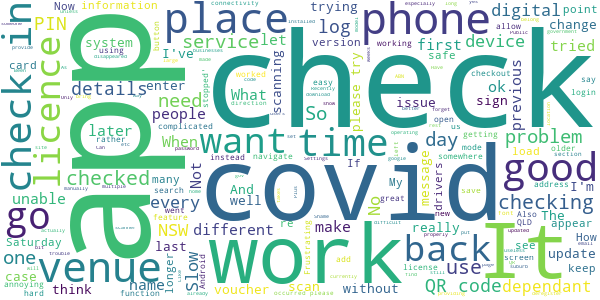
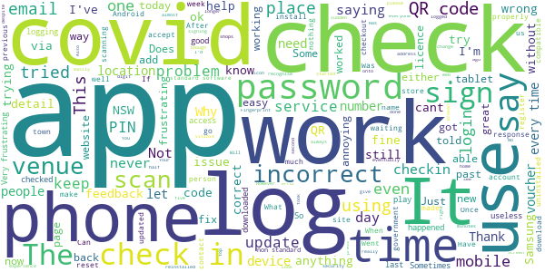
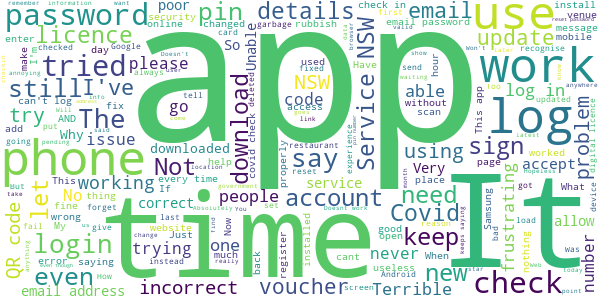

# Service NSW
App version ``6.6.0 (236399)``

Analyzed with [covid-apps-observer](http://github.com/covid-apps-observer) project, version ``0.1``

## App overview
| | |
|-------------------------|-------------------------| 
| **Name**                                          | Service NSW |
| **Unique identifier** | au.gov.nsw.service |
| **Link to Google Play** | [https://play.google.com/store/apps/details?id=au.gov.nsw.service](https://play.google.com/store/apps/details?id=au.gov.nsw.service) |
| **Summary**  | Digital licences, registrations, fines and more |
| **Privacy policy** | [http://www.service.nsw.gov.au/privacy](http://www.service.nsw.gov.au/privacy) |
| **Latest version** | 6.6.0 (236399) |
| **Last update** | 2021-04-09 09:35:38 |
| **Recent changes** | Thanks for using the Service NSW mobile app! We used your feedback to make these improvements: • You can now use your Digital Driver Licence to pre-fill your information when applying for Dine &amp; Discover vouchers  • We&#39;ve also improved the experience for when you are waiting for your vouchers to arrive in the app • Fixes and enhancements to Dark mode  • Added a Search button for when you are looking up Registrations or Fines |
| **Installs**  | 1,000,000+ |
| **Category** | Tools |
| **First release** | Dec 7, 2014 |
| **Size**  | 28M |
| **Supported Android version**  | 6.0 and up |

### Description
> The official Service NSW app, making it easier to access government services. 
 <b>Digital licences and credentials</b>
 Access the following digital licences and credentials, with more to come: 
 • Driver Licence 
 • RSA/RCG Competency Card 
 • Working with Children Check 
 • Recreational Fishing Licence 
 • Boat Driver Licence.
 <b>COVID Safe Check-in</b> 
 • Quick, contactless check in at COVID Safe venues 
 • Point your device camera at the COVID Safe QR Code to get started 
 • Save your details for a faster check in next time. 
 • Read our Privacy Collection Statement: https://www.service.nsw.gov.au/covid-safe-check-privacy-collection-statement
 <b>Useful tools and services</b>
 • Verify a Digital Driver Licence via our licence checker 
 • Check or renew a registration 
 • Sign into licensed venues.
 <b>Fines and demerits</b>
 • View and pay your fines 
 • View your demerits.
 <b>COVID-19 resources</b>
 • Access COVID-19 statistics by postcode 
 • Access our COVID-19 Assistance Finder with benefits, rebates and concessions. 
 <b>Tell us what you think</b>
 • Help us help you! We’re always working on a better, stronger, faster app. 
 • Share what you’d like to see in the app: we use your feedback to continuously improve the app experience.

### User interface
The developers of the app provide the following screenshots in the Google play store.
| | | |
|:-------------------------:|:-------------------------:|:-------------------------:|
 |   |   |   | 
 |   |  

## Development team
In the following we report the main information provided by the development team in the Google play store.

| | |
|-------------------------|-------------------------|
| **Developer**  | Service NSW |
| **Website**  | [https://www.service.nsw.gov.au/mobile-app      ](https://www.service.nsw.gov.au/mobile-app      ) |
| **Email** | mobileapp@service.nsw.gov.au |
| **Physical address**  | - |
| **Other developed apps**  | [https://play.google.com/store/apps/developer?id=Service+NSW](https://play.google.com/store/apps/developer?id=Service+NSW) |

## Android support

| | |
|-------------------------|-------------------------|
| **Declared target Android version**  | Android10, version 10 (API level 29) |
| **Effective target Android version**  | Android10, version 10 (API level 29) |
| **Minimum supported Android version**  | Marshmallow, version 6.0 (API level 23) |
| **Maximum target Android version**  | - |

The larger the difference between the minimum and maximum supported Android versions, the better. A larger difference means a wider audience. For example, old phones have a very low Android version, so a high minimum supported Android version means that the app cannot be used by users with old phones, thus leading to accessibility problems. 

## Requested permissions

In the following we report the complete list of the permissions requested by the app. 

| **Permission** | **Protection level** | **Description** | 
|-------------------------|-------------------------|-------------------------|
 **android.permission ACCESS_NETWORK_STATE** | Normal | Allows applications to access information about networks. 
 **android.permission ACCESS_WIFI_STATE** | Normal | Allows applications to access information about Wi-Fi networks. 
 **android.permission CAMERA** | :warning:**Dangerous** | Required to be able to access the camera device. 
 **android.permission INTERNET** | Normal | Allows applications to open network sockets. 
 **android.permission READ_APP_BADGE** | - | - 
 **android.permission USE_FINGERPRINT** | Normal | This constant was deprecated in API level 28. Applications should request USE_BIOMETRIC instead 
 **android.permission VIBRATE** | Normal | Allows access to the vibrator. 
 **android.permission WAKE_LOCK** | Normal | Allows using PowerManager WakeLocks to keep processor from sleeping or screen from dimming. 
 **com.anddoes.launcher.permission UPDATE_COUNT** | - | - 
 **com.android.vending CHECK_LICENSE** | - | - 
 **com.google.android.c2dm.permission RECEIVE** | - | - 
 **com.google.android.finsky.permission BIND_GET_INSTALL_REFERRER_SERVICE** | - | - 
 **com.htc.launcher.permission READ_SETTINGS** | - | - 
 **com.htc.launcher.permission UPDATE_SHORTCUT** | - | - 
 **com.huawei.android.launcher.permission CHANGE_BADGE** | - | - 
 **com.huawei.android.launcher.permission READ_SETTINGS** | - | - 
 **com.huawei.android.launcher.permission WRITE_SETTINGS** | - | - 
 **com.majeur.launcher.permission UPDATE_BADGE** | - | - 
 **com.oppo.launcher.permission READ_SETTINGS** | - | - 
 **com.oppo.launcher.permission WRITE_SETTINGS** | - | - 
 **com.sec.android.provider.badge.permission READ** | - | - 
 **com.sec.android.provider.badge.permission WRITE** | - | - 
 **com.sonyericsson.home.permission BROADCAST_BADGE** | - | - 
 **com.sonymobile.home.permission PROVIDER_INSERT_BADGE** | - | - 
 **me.everything.badger.permission BADGE_COUNT_READ** | - | - 
 **me.everything.badger.permission BADGE_COUNT_WRITE** | - | - 

## Mentioned servers

| **Server** | **Registrant** | **Registrant country** | **Creation date** | 
|-------------------------|-------------------------|-------------------------|-------------------------|
 | apache.org | The Apache Software Foundation | :us: US | 1995-04-11 04:00:00 |
 | xml.org | OASIS Open | :us: US | 1997-02-03 05:00:00 |
 | w3.org | W3C | :us: US | 1994-07-06 04:00:00 |
 | purl.org | Internet Archive | :us: US | 1996-01-01 05:00:00 |
 | adobe.com | Adobe Inc. | :us: US | 1986-11-17 05:00:00 |
 | android.com | Google LLC | :us: US | 1997-06-23 04:00:00 |
 | googlesyndication.com | Google LLC | :us: US | 2003-01-21 06:17:24 |
 | google.com | Google LLC | :us: US | 1997-09-15 04:00:00 |
 | app-measurement.com | Google LLC | :us: US | 2015-06-19 20:13:31 |
 | googleapis.com | Google LLC | :us: US | 2005-01-25 17:52:26 |
 | googleapis.com | Google LLC | :us: US | 2005-01-25 17:52:26 |
 | iptc.org | Whois Privacy Service | :us: US | 1995-12-27 05:00:00 |
 | useplus.org | PLUS COALITION | :us: US | 2003-11-18 19:31:25 |
 | npes.org | NPES | :us: US | 1996-01-30 05:00:00 |
 | aiim.org | Association for Information and Image Management International | :us: US | 1995-10-18 04:00:00 |
 | googleapis.com | Google LLC | :us: US | 2005-01-25 17:52:26 |
 | googleapis.com | Google LLC | :us: US | 2005-01-25 17:52:26 |
 | googleadservices.com | Google LLC | :us: US | 2003-06-19 16:34:53 |

## Security analysis 

Below we report the main security warnings raised by our execution of the [Androwarn](https://github.com/maaaaz/androwarn) security analysis tool.

**Telephony identifiers leakage**
> - This application reads the numeric name (MCC+MNC) of current registered operator 
> - This application reads the operator name 
> - This application reads the phone number string for line 1, for example, the MSISDN for a GSM phone 
> - This application reads the unique device ID, i.e the IMEI for GSM and the MEID or ESN for CDMA phones 

**Location lookup**
> - This application reads location information from all available providers (WiFi, GPS etc.) 

**Connection interfaces exfiltration**
> - This application reads details about the currently active data network 
> - This application tries to find out if the currently active data network is metered 

**Audio video eavesdropping**
> - This application records audio from the 'CAMCORDER' source  
> - This application records audio from the 'MIC' source  
> - This application captures video from the 'CAMERA' source 
> - This application captures video from the 'SURFACE' source 

**Suspicious connection establishment**
> - This application opens a Socket and connects it to the remote address '' on the 'N/A' port  
> - This application opens a Socket and connects it to the remote address 'Ljava/lang/StringBuilder;->toString()Ljava/lang/String;' on the ': connect, resolve' port  
> - This application opens a Socket and connects it to the remote address 'Ljava/lang/StringBuilder;->toString()Ljava/lang/String;' on the 'N/A' port  
> - This application opens a Socket and connects it to the remote address 'Ljava/net/Proxy;->type()Ljava/net/Proxy$Type;' on the 'N/A' port  
> - This application opens a Socket and connects it to the remote address 'Network subsystem is unavailable' on the 'N/A' port  
> - This application opens a Socket and connects it to the remote address 'timeout' on the 'N/A' port  

**Pim data leakage**
> - This application accesses data stored in the clipboard 

**Code execution**
> - This application loads a native library 
> - This application loads a native library: 'Ljava/util/Iterator;->next()Ljava/lang/Object;' 
> - This application loads a native library: 'log' 
> - This application loads a native library: 'sentry' 
> - This application loads a native library: 'sentry-android' 
> - This application loads a native library: 'tool-checker' 
> - This application executes a UNIX command 

## User ratings and reviews

Below we provide information about how end users are reacting to the app in terms of ratings and reviews in the Google Play store.

### Ratings

The Service NSW app has been installed by more than **1000000** times. At this time, **6389** rated the app and its average score is **3.5923078**. Below we show the distribution of the ratings across the usual star-based rating of Google Play

:star::star::star::star::star:: 3166

:star::star::star::star:: 894

:star::star::star:: 452

:star::star:: 314

:star:: 1563

### Reviews 

#### 5-star reviews

> Nice service thanks from sodber  :date: __2021-04-12 14:29:16__

> Good  :date: __2021-04-11 22:03:57__

> easy to use  :date: __2021-04-11 15:32:45__

> Never had any issues,Must be lucky  :date: __2021-04-11 02:41:01__

> Very useful app making it easy to access some essential things. The developers address reported bugs very quickly which is great. Just a suggestion, althought knowing all the different departments in the government it might be impossible. I'd love to be able to have my trade licence, NDIS worker check and even JP qualification showing in the app.  :date: __2021-04-11 02:07:56__

> Easy to use and age friendly  :date: __2021-04-10 07:44:49__

> Great  :date: __2021-04-10 06:56:20__

> Better  :date: __2021-04-10 05:32:42__

> Easy to use.  :date: __2021-04-10 04:53:25__

> Accessible and practical.  :date: __2021-04-10 04:07:40__

#### 4-star reviews

> Where do I add my dependants when checking in?  :date: __2021-04-12 04:08:20__

> I think this app is great. Fact that I no longer need to panic when cops pull me over cause I forgot my wallet and licence is great. I honestly don't know why anyone's got any negative issues. No trouble signing in or out of anywhere. Could be even better if I could add my Medicare.  :date: __2021-04-08 16:58:23__

> Its a good start and nice app/ GUI. Only issue is even though I have enabled covid check out reminder notifications, I am not getting any alerts if forget to checkout even after a week or so  :date: __2021-04-08 01:41:00__

> Quick and pretty straight forward to set up  :date: __2021-04-07 11:58:49__

> Makes COVID check in faster, otherwise it just redirects you to the website.  :date: __2021-04-07 03:05:59__

> No good can't even read finger print. Useless. Can't sign in as app only has 4 spaces for log in and no letters on keyboard. Fingerprint worked on Monday but now won't work. Needs fixing. Ok now the update last week changed the settings. Thanks  :date: __2021-04-06 10:15:40__

> The COVID check out "am pm" options both being displayed as am  :date: __2021-04-04 12:35:37__

> It was easy to use great thanks Brian  :date: __2021-04-02 10:52:59__

> Good advice and fast service nsw.  :date: __2021-04-02 03:43:41__

> Good  :date: __2021-04-01 23:54:56__

#### 3-star reviews

> If this is the Services NSW app, why can't I read the current value of my senior's travel card or see my Dine and Discover details? Where is my Opel card? It is good for my licence, but when I want to log in to a Covid Safe site it locks up. I don't want to be too critical of someone's effort it providing the information it does provide. Buy really! It does seem to have some serious limitations.  :date: __2021-04-10 06:49:43__

> I always get the woman who has a attitude problem. Its Saturday, so why am I here. Bad customer service from Grafton office.  :date: __2021-04-10 04:12:12__

> My digital drivers licence will no longer load (appear) in this app. Been an issue for weeks now. How can I rectify. Settings appear all correct.  :date: __2021-04-09 04:07:14__

> Issues with checking in to places. Wherever is the first place in the day that I check in for, it will continually keep checking me in to the same place despite me scanning a different QR Code. And before you ask, yes I have the most up-to-date version and yes I have un-installed and then re-installed many times. What's the point if you can't even develop the app to work properly.  :date: __2021-04-07 12:18:31__

> bit complicated to maneuver  :date: __2021-04-05 11:20:32__

> It was ok  :date: __2021-04-03 01:27:54__

> Not that smart. I already have my digital license on the apps for a while but when I select for NSW $100 voucher, still asked me to manually put back my Drivers license details & address. It makes me think for a while that my details are compromised. Also need to provide 1 more documents (e.g. passport, Medicare etc) to claim it. Hope this is a very secure apps.  :date: __2021-04-01 21:16:14__

> Congrats .gov.au Compared to the rest of the world, you did good. Pat yourself on the back... Public servants in aps levels that actually worked for the public did really well. Shame you will never get any credit... Your EL will,... Who wanted your head in the early stages. Now forgets all the work done by those who knew what they were doing'  :date: __2021-04-01 13:53:19__

> Good App. But QLD app for QR Code is better , QLD government sign in System enables you to create QR codes for different venues belong to one ABN & Address while only change the venue name/discreption which make sense if you own large site with multiple venues belong to the same address & ABN. sorry that's made me feel jealous of QLD 😊.  :date: __2021-03-31 14:27:51__

> Check in not currently working. Well let you check in, but when you go to check out there is no record of check-in. Shows previous one instead.  :date: __2021-03-28 00:57:08__

#### 2-star reviews

> This App is frustrating. I was able to access it until the covid check ins. Now I can't get into my account. I can log into my account through web access but not through this app. I've used the same credentials to log into the App but it says my password is incorrect. I've reset several times only to realise it's the app that's the issue. Because of this issue, I can't even (Covid) check into any places.  :date: __2021-04-12 00:06:27__

> Was working fine up until today. It's saying that my phone is using "non standard software". I haven't installed or changed anything and was using it just fine the other day.  :date: __2021-04-08 10:22:17__

> Does not work  :date: __2021-04-06 01:01:25__

> Only works at some shops  :date: __2021-04-02 08:34:01__

> Thank you for your response, but what I meant was all the categories are visible, only the bottom half of each category label is visible, they have no top. Why would the app only work properly on a mobile and not a tablet? Android and iOS both operate on mobile phones and tablets. Some tablets can make phone calls. The feedback section does not work on either phone or tablet. Also, it would be nice if the screen could be rotated.  :date: __2021-03-31 06:11:01__

> I felt the person I was talking to was not friendly and after waiting for 40 minutes the person hung up on me. Very poor service.  :date: __2021-03-31 02:03:00__

> Frustrating, took five goes to get acceptance for the vouchers. I finally got the go ahead & that I would receive a email with the vouchers. I did & was able to download them on the computer, but on the service app. the vouchers do not appear...just says let's get started. Annoying. Will try that site for help  :date: __2021-03-29 07:08:50__

> Has worked fine until a few days ago, it has logged me out and says 'incorrect email or password'. I have reset my password, uninstalled and reinstalled the app numerous time but nothing fixes the issue. I can log onto the Service NSW website with no problems, so the password is not the problem, it is a glitch with the app  :date: __2021-03-27 02:31:31__

> Not letting me login  :date: __2021-03-26 02:57:05__

> this is the only email you have on record, but signing in says it is wrong???  :date: __2021-03-25 13:18:32__

#### 1-star reviews

> Complicated and confusing 😂  :date: __2021-04-12 11:56:35__

> The Covid-safe check in requires a phone number. But I often have my SIM card out and it can't verify my number without it. THIS APP IS USELESS!  :date: __2021-04-12 09:15:49__

> Absolutely woeful, pathetic and disgusting! Its originators should be castrated to prevent their lunacy from spreading. Better still hang the mongrels!!  :date: __2021-04-11 04:38:52__

> 4 years later and several phones, this app stiĺl does not work for me  :date: __2021-04-10 15:53:13__

> I can login using a mobile browser but not the app. My email and password is correct and its not letting me log in. Any suggestions, its really frustrating  :date: __2021-04-10 12:03:08__

> I have not been able to successfully use this to check in to venues. I use to be able to when going through the webpage (using the mobile) however, now that I have the app on the phone it does not allow me to proceed. States to try again later, I do so many times and it still doesn't go ahead. Using Android phone.  :date: __2021-04-10 07:35:39__

> Cannot claim vouchers  :date: __2021-04-10 06:59:02__

> It shows me random peoples personal data when I use the app  :date: __2021-04-09 10:48:43__

> I can't even log into the app as it constantly says incorrect email or password, yet my information is very much correct (reset my password too).  :date: __2021-04-08 15:17:30__

> No use. Always cannot check in using this app. Waste of time  :date: __2021-04-08 09:11:02__

