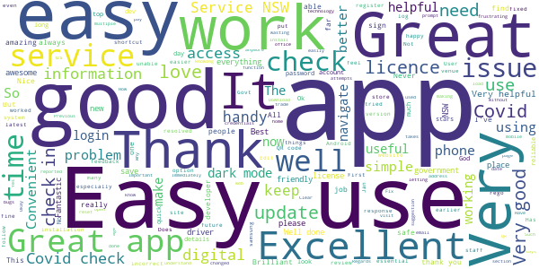
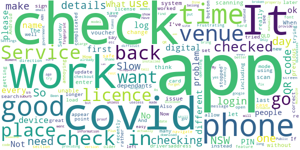

# Service NSW
App version ``6.7.0 (241526)``

Analyzed with [covid-apps-observer](http://github.com/covid-apps-observer) project, version ``0.1``

## App overview
| | |
|-------------------------|-------------------------| 
| **Name**   | Service NSW |
| **Unique identifier** | au.gov.nsw.service |
| **Link to Google Play** | [https://play.google.com/store/apps/details?id=au.gov.nsw.service](https://play.google.com/store/apps/details?id=au.gov.nsw.service) |
| **Summary**  | Digital licences, registrations, fines and more |
| **Privacy policy** | [http://www.service.nsw.gov.au/privacy](http://www.service.nsw.gov.au/privacy) |
| **Latest version** | 6.7.0 (241526) |
| **Last update** | 2021-04-21 02:15:31 |
| **Recent changes** | Thanks for using the Service NSW mobile app! We used your feedback to make these improvements: • Enhancements to the Digital White Card Linking process to make it as easy as possible 	 • Added extra information before accessing the Camera in COVID Safe Check-in  • Remove a fishing licence by tapping on the licence menu. |
| **Installs**  | 1,000,000+ |
| **Category** | Tools |
| **First release** | Dec 7, 2014 |
| **Size**  | 28M |
| **Supported Android version**  | 6.0 and up |

### Description
> The official Service NSW app, making it easier to access government services. 
 <b>Digital licences and credentials</b>
 Access the following digital licences and credentials, with more to come: 
 • Driver Licence 
 • RSA/RCG Competency Card 
 • Working with Children Check 
 • Recreational Fishing Licence 
 • Boat Driver Licence.
 <b>COVID Safe Check-in</b> 
 • Quick, contactless check in at COVID Safe venues 
 • Point your device camera at the COVID Safe QR Code to get started 
 • Save your details for a faster check in next time. 
 • Read our Privacy Collection Statement: https://www.service.nsw.gov.au/covid-safe-check-privacy-collection-statement
 <b>Useful tools and services</b>
 • Verify a Digital Driver Licence via our licence checker 
 • Check or renew a registration 
 • Sign into licensed venues.
 <b>Fines and demerits</b>
 • View and pay your fines 
 • View your demerits.
 <b>COVID-19 resources</b>
 • Access COVID-19 statistics by postcode 
 • Access our COVID-19 Assistance Finder with benefits, rebates and concessions. 
 <b>Tell us what you think</b>
 • Help us help you! We’re always working on a better, stronger, faster app. 
 • Share what you’d like to see in the app: we use your feedback to continuously improve the app experience.

### User interface
The developers of the app provide the following screenshots in the Google play store.
| | | |
|:-------------------------:|:-------------------------:|:-------------------------:|
 |   |   |   | 
 |   |  

## Development team
In the following we report the main information provided by the development team in the Google play store.

| | |
|-------------------------|-------------------------|
| **Developer**  | Service NSW |
| **Website**  | [https://www.service.nsw.gov.au/mobile-app      ](https://www.service.nsw.gov.au/mobile-app      ) |
| **Email** | mobileapp@service.nsw.gov.au |
| **Physical address**  | - |
| **Other developed apps**  | [https://play.google.com/store/apps/developer?id=Service+NSW](https://play.google.com/store/apps/developer?id=Service+NSW) |

## Android support

| | |
|-------------------------|-------------------------|
| **Declared target Android version**  | Android10, version 10 (API level 29) |
| **Effective target Android version**  | Android10, version 10 (API level 29) |
| **Minimum supported Android version**  | Marshmallow, version 6.0 (API level 23) |
| **Maximum target Android version**  | - |

The larger the difference between the minimum and maximum supported Android versions, the better. A larger difference means a wider audience. For example, old phones have a very low Android version, so a high minimum supported Android version means that the app cannot be used by users with old phones, thus leading to accessibility problems. 

## Requested permissions

In the following we report the complete list of the permissions requested by the app. 

| **Permission** | **Protection level** | **Description** | 
|-------------------------|-------------------------|-------------------------|
 **android.permission ACCESS_NETWORK_STATE** | Normal | Allows applications to access information about networks. 
 **android.permission ACCESS_WIFI_STATE** | Normal | Allows applications to access information about Wi-Fi networks. 
 **android.permission CAMERA** | :warning:**Dangerous** | Required to be able to access the camera device. 
 **android.permission INTERNET** | Normal | Allows applications to open network sockets. 
 **android.permission READ_APP_BADGE** | - | - 
 **android.permission USE_FINGERPRINT** | Normal | This constant was deprecated in API level 28. Applications should request USE_BIOMETRIC instead 
 **android.permission VIBRATE** | Normal | Allows access to the vibrator. 
 **android.permission WAKE_LOCK** | Normal | Allows using PowerManager WakeLocks to keep processor from sleeping or screen from dimming. 
 **com.anddoes.launcher.permission UPDATE_COUNT** | - | - 
 **com.android.vending CHECK_LICENSE** | - | - 
 **com.google.android.c2dm.permission RECEIVE** | - | - 
 **com.google.android.finsky.permission BIND_GET_INSTALL_REFERRER_SERVICE** | - | - 
 **com.htc.launcher.permission READ_SETTINGS** | - | - 
 **com.htc.launcher.permission UPDATE_SHORTCUT** | - | - 
 **com.huawei.android.launcher.permission CHANGE_BADGE** | - | - 
 **com.huawei.android.launcher.permission READ_SETTINGS** | - | - 
 **com.huawei.android.launcher.permission WRITE_SETTINGS** | - | - 
 **com.majeur.launcher.permission UPDATE_BADGE** | - | - 
 **com.oppo.launcher.permission READ_SETTINGS** | - | - 
 **com.oppo.launcher.permission WRITE_SETTINGS** | - | - 
 **com.sec.android.provider.badge.permission READ** | - | - 
 **com.sec.android.provider.badge.permission WRITE** | - | - 
 **com.sonyericsson.home.permission BROADCAST_BADGE** | - | - 
 **com.sonymobile.home.permission PROVIDER_INSERT_BADGE** | - | - 
 **me.everything.badger.permission BADGE_COUNT_READ** | - | - 
 **me.everything.badger.permission BADGE_COUNT_WRITE** | - | - 

## Mentioned servers

| **Server** | **Registrant** | **Registrant country** | **Creation date** | 
|-------------------------|-------------------------|-------------------------|-------------------------|
 | apache.org | The Apache Software Foundation | :us: US | 1995-04-11 04:00:00 |
 | xml.org | OASIS Open | :us: US | 1997-02-03 05:00:00 |
 | w3.org | W3C | :us: US | 1994-07-06 04:00:00 |
 | purl.org | Internet Archive | :us: US | 1996-01-01 05:00:00 |
 | adobe.com | Adobe Inc. | :us: US | 1986-11-17 05:00:00 |
 | android.com | Google LLC | :us: US | 1997-06-23 04:00:00 |
 | googlesyndication.com | Google LLC | :us: US | 2003-01-21 06:17:24 |
 | google.com | Google LLC | :us: US | 1997-09-15 04:00:00 |
 | app-measurement.com | Google LLC | :us: US | 2015-06-19 20:13:31 |
 | googleapis.com | Google LLC | :us: US | 2005-01-25 17:52:26 |
 | googleapis.com | Google LLC | :us: US | 2005-01-25 17:52:26 |
 | iptc.org | Whois Privacy Service | :us: US | 1995-12-27 05:00:00 |
 | useplus.org | PLUS COALITION | :us: US | 2003-11-18 19:31:25 |
 | npes.org | NPES | :us: US | 1996-01-30 05:00:00 |
 | aiim.org | Association for Information and Image Management International | :us: US | 1995-10-18 04:00:00 |
 | googleapis.com | Google LLC | :us: US | 2005-01-25 17:52:26 |
 | googleapis.com | Google LLC | :us: US | 2005-01-25 17:52:26 |
 | googleadservices.com | Google LLC | :us: US | 2003-06-19 16:34:53 |

## Security analysis 

Below we report the main security warnings raised by our execution of the [Androwarn](https://github.com/maaaaz/androwarn) security analysis tool.

**Telephony identifiers leakage**
> - This application reads the numeric name (MCC+MNC) of current registered operator 
> - This application reads the operator name 
> - This application reads the phone number string for line 1, for example, the MSISDN for a GSM phone 
> - This application reads the unique device ID, i.e the IMEI for GSM and the MEID or ESN for CDMA phones 

**Location lookup**
> - This application reads location information from all available providers (WiFi, GPS etc.) 

**Connection interfaces exfiltration**
> - This application reads details about the currently active data network 
> - This application tries to find out if the currently active data network is metered 

**Audio video eavesdropping**
> - This application records audio from the 'CAMCORDER' source  
> - This application records audio from the 'MIC' source  
> - This application captures video from the 'CAMERA' source 
> - This application captures video from the 'SURFACE' source 

**Suspicious connection establishment**
> - This application opens a Socket and connects it to the remote address '' on the 'N/A' port  
> - This application opens a Socket and connects it to the remote address 'Ljava/lang/StringBuilder;->toString()Ljava/lang/String;' on the ': connect, resolve' port  
> - This application opens a Socket and connects it to the remote address 'Ljava/lang/StringBuilder;->toString()Ljava/lang/String;' on the 'N/A' port  
> - This application opens a Socket and connects it to the remote address 'Ljava/net/Proxy;->type()Ljava/net/Proxy$Type;' on the 'N/A' port  
> - This application opens a Socket and connects it to the remote address 'Network subsystem is unavailable' on the 'N/A' port  
> - This application opens a Socket and connects it to the remote address 'timeout' on the 'N/A' port  

**Pim data leakage**
> - This application accesses data stored in the clipboard 

**Code execution**
> - This application loads a native library 
> - This application loads a native library: 'Ljava/util/Iterator;->next()Ljava/lang/Object;' 
> - This application loads a native library: 'log' 
> - This application loads a native library: 'sentry' 
> - This application loads a native library: 'sentry-android' 
> - This application loads a native library: 'tool-checker' 
> - This application executes a UNIX command 

## User ratings and reviews

Below we provide information about how end users are reacting to the app in terms of ratings and reviews in the Google Play store.

### Ratings

The Service NSW app has been installed by more than **1000000** times. At this time, **6605** rated the app and its average score is **3.8429003**. Below we show the distribution of the ratings across the usual star-based rating of Google Play

:star::star::star::star::star:: 3702

:star::star::star::star:: 978

:star::star::star:: 409

:star::star:: 219

:star:: 1297

### Reviews 

#### 5-star reviews

> Easy to use  :date: __2021-04-29 07:27:01__

> Good  :date: __2021-04-29 02:48:41__

> Easy to use essential for keeping the us safe and in good health easy to use and plenty of information to access  :date: __2021-04-28 13:37:07__

> Very easy to navigate this app, extrèamly helpfully & it is quicker the on the phone or to visit any store  :date: __2021-04-28 04:08:05__

> Youi er ho. Maollĺree  :date: __2021-04-27 16:13:59__

> Verry good  :date: __2021-04-27 05:19:42__

> Liked it  :date: __2021-04-27 02:23:03__

> Clear and simple to use  :date: __2021-04-27 00:32:23__

> Great for QR Code for OOVID  :date: __2021-04-26 22:26:21__

> Good app  :date: __2021-04-26 18:37:58__

#### 4-star reviews

> Reminded me up at busy RTA some 40 years ago. Howeverin all fairness it is a great idea to have all services for New South Wales Under One roof. Well done services New South.  :date: __2021-04-29 12:47:16__

> kimkinandandandandand  :date: __2021-04-29 01:42:35__

> Easy to use  :date: __2021-04-28 12:58:49__

> I am unable to add digital fishing licence to the app. When trying to add it, app gets stuck in the page Link To Account. Update: This is now working fine after the update. I had also removed the service from the website and added it back on the app and it was all good.  :date: __2021-04-28 12:49:10__

> Great information and accessibility to all NSW services in one combined app.  :date: __2021-04-27 11:55:18__

> Good job the Govt  :date: __2021-04-26 01:35:43__

> Everything is here you need.  :date: __2021-04-19 10:36:24__

> Good  :date: __2021-04-19 08:46:50__

> Half the time it wouldnt open  :date: __2021-04-15 05:20:56__

> Where do I add my dependants when checking in? Found it 😜  :date: __2021-04-13 03:30:50__

#### 3-star reviews

> Can't login with my correct credentials recently, including fingerprint. I can login to the Service NSW website though. Clearly the app is broken at the moment. Reinstall did not fix. EDIT: Make sure your time and date is set to automatic on your phone or the login won't work even if the time is correct.  :date: __2021-04-29 10:37:03__

> Nothing to tell  :date: __2021-04-27 22:18:21__

> To many loops that bring you back to the same place. Extremely difficult to make contact without interogation  :date: __2021-04-17 10:31:30__

> Slow to update  :date: __2021-04-15 01:25:49__

> Only giving it 3 because how long is the photo id for proof of age  :date: __2021-04-14 14:10:31__

> If this is the Services NSW app, why can't I read the current value of my senior's travel card or see my Dine and Discover details? Where is my Opel card? It is good for my licence, but when I want to log in to a Covid Safe site it locks up. I don't want to be too critical of someone's effort it providing the information it does provide. Buy really! It does seem to have some serious limitations.  :date: __2021-04-10 06:49:43__

> I always get the woman who has a attitude problem. Its Saturday, so why am I here. Bad customer service from Grafton office.  :date: __2021-04-10 04:12:12__

> My digital drivers licence will no longer load (appear) in this app. Been an issue for weeks now. How can I rectify. Settings appear all correct.  :date: __2021-04-09 04:07:14__

> Issues with checking in to places. Wherever is the first place in the day that I check in for, it will continually keep checking me in to the same place despite me scanning a different QR Code. And before you ask, yes I have the most up-to-date version and yes I have un-installed and then re-installed many times. What's the point if you can't even develop the app to work properly.  :date: __2021-04-07 12:18:31__

> bit complicated to maneuver  :date: __2021-04-05 11:20:32__

#### 2-star reviews

> Qcode reader for Covod 19 no working  :date: __2021-04-26 18:58:43__

> Red www  :date: __2021-04-26 04:26:26__

> DINE VOUCHERS i cant find it on the app.. i registered and the email said to go to the app to access the vouchers. I cant find them. Also tried to update the app and it just keeps sitting wth the spinning circle (common problem)  :date: __2021-04-25 01:54:08__

> This app is so glitchy and a pain to use.when it works its great, but if it decides not to work - wrong pin; something went wrong try again later ..... Shortcomings and glitching need to be fixed when this app is required to login before entering anywhere these days.  :date: __2021-04-18 10:43:45__

> Can't signin anymore  :date: __2021-04-18 07:50:59__

> Was working fine up until today. It's saying that my phone is using "non standard software". I haven't installed or changed anything and was using it just fine the other day.  :date: __2021-04-08 10:22:17__

> Does not work  :date: __2021-04-06 01:01:25__

> Only works at some shops  :date: __2021-04-02 08:34:01__

> Thank you for your response, but what I meant was all the categories are visible, only the bottom half of each category label is visible, they have no top. Why would the app only work properly on a mobile and not a tablet? Android and iOS both operate on mobile phones and tablets. Some tablets can make phone calls. The feedback section does not work on either phone or tablet. Also, it would be nice if the screen could be rotated.  :date: __2021-03-31 06:11:01__

> I felt the person I was talking to was not friendly and after waiting for 40 minutes the person hung up on me. Very poor service.  :date: __2021-03-31 02:03:00__

#### 1-star reviews

> Very frustrating as it keeps saying my email is not valid when logging in and when I try to create an account, it says that email already in use. Can't get in at all. I've uninstalled and re installed, I've checked local time on clock. Don't know what else to do  :date: __2021-04-29 08:14:40__

> Will not let me sign in or up keeps on telling me unvalid email dose not matter which one i use  :date: __2021-04-29 07:45:29__

> Will not load.  :date: __2021-04-28 07:34:18__

> Does not work again app will not scan again.  :date: __2021-04-27 07:19:26__

> Not all that great  :date: __2021-04-27 03:46:10__

> The app is not accepting my current Gmail that I'm using in the last 20 years.  :date: __2021-04-26 04:01:36__

> Only application on my phone where I get a warning that it is draining my battery while in the background  :date: __2021-04-26 02:15:27__

> App won't read QR code and yes I have given permission for camera access. QR code reader app works fine. Blade A3 android phone  :date: __2021-04-25 05:54:36__

> I can not load it to my samsung s9 just keeps saying pending..it is not an old phone  :date: __2021-04-25 03:07:32__

> Cannot sign in to venues  :date: __2021-04-24 23:11:32__

