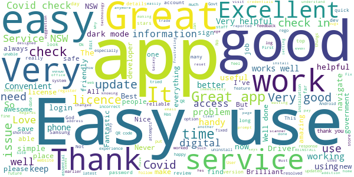
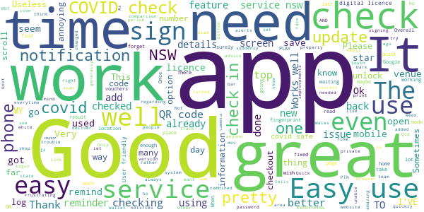

# Service NSW
App version ``6.8.0 (251481)``

Analyzed with [covid-apps-observer](http://github.com/covid-apps-observer) project, version ``0.1``

## App overview
| | |
|-------------------------|-------------------------| 
| **Name**&nbsp;&nbsp;&nbsp;&nbsp;&nbsp;&nbsp;&nbsp;&nbsp;&nbsp;&nbsp;&nbsp;&nbsp;&nbsp;&nbsp;&nbsp;&nbsp;&nbsp;&nbsp;&nbsp;&nbsp;&nbsp;&nbsp;&nbsp;&nbsp;&nbsp;&nbsp;&nbsp;&nbsp;&nbsp;&nbsp;&nbsp;&nbsp;&nbsp;&nbsp;&nbsp;&nbsp;&nbsp;&nbsp;&nbsp;&nbsp;  | Service NSW |
| **Unique identifier** | au.gov.nsw.service |
| **Link to Google Play** | [https://play.google.com/store/apps/details?id=au.gov.nsw.service](https://play.google.com/store/apps/details?id=au.gov.nsw.service) |
| **Summary**  | Digital licences, registrations, fines and more |
| **Privacy policy** | [http://www.service.nsw.gov.au/privacy](http://www.service.nsw.gov.au/privacy) |
| **Latest version** | 6.8.0 (251481) |
| **Last update** | 2021-04-28 07:44:45 |
| **Recent changes** | Thanks for using the Service NSW mobile app! We used your feedback to make these improvements: • Enhanced the dark mode experience • Better outage alerts for when something goes wrong • Fixed a bug where the app was crashing when scanning invalid QR codes |
| **Installs**  | 1,000,000+ |
| **Category** | Tools |
| **First release** | Dec 7, 2014 |
| **Size**  | 29M |
| **Supported Android version**  | 6.0 and up |

### Description
> The official Service NSW app, making it easier to access government services. 
 <b>Digital licences and credentials</b>
 Access the following digital licences and credentials, with more to come: 
 • Driver Licence 
 • RSA/RCG Competency Card 
 • Working with Children Check 
 • Recreational Fishing Licence 
 • Boat Driver Licence.
 <b>COVID Safe Check-in</b> 
 • Quick, contactless check in at COVID Safe venues 
 • Point your device camera at the COVID Safe QR Code to get started 
 • Save your details for a faster check in next time. 
 • Read our Privacy Collection Statement: https://www.service.nsw.gov.au/covid-safe-check-privacy-collection-statement
 <b>Useful tools and services</b>
 • Verify a Digital Driver Licence via our licence checker 
 • Check or renew a registration 
 • Sign into licensed venues.
 <b>Fines and demerits</b>
 • View and pay your fines 
 • View your demerits.
 <b>COVID-19 resources</b>
 • Access COVID-19 statistics by postcode 
 • Access our COVID-19 Assistance Finder with benefits, rebates and concessions. 
 <b>Tell us what you think</b>
 • Help us help you! We’re always working on a better, stronger, faster app. 
 • Share what you’d like to see in the app: we use your feedback to continuously improve the app experience.

### User interface
The developers of the app provide the following screenshots in the Google play store.
| | | |
|:-------------------------:|:-------------------------:|:-------------------------:|
 |   |   |   | 
 |   |  

## Development team
In the following we report the main information provided by the development team in the Google play store.

| | |
|-------------------------|-------------------------|
| **Developer**  | Service NSW |
| **Website**  | [https://www.service.nsw.gov.au/mobile-app      ](https://www.service.nsw.gov.au/mobile-app      ) |
| **Email** | mobileapp@service.nsw.gov.au |
| **Physical address**  | - |
| **Other developed apps**  | [https://play.google.com/store/apps/developer?id=Service+NSW](https://play.google.com/store/apps/developer?id=Service+NSW) |

## Android support

| | |
|-------------------------|-------------------------|
| **Declared target Android version**  | Android10, version 10 (API level 29) |
| **Effective target Android version**  | Android10, version 10 (API level 29) |
| **Minimum supported Android version**  | Marshmallow, version 6.0 (API level 23) |
| **Maximum target Android version**  | - |

The larger the difference between the minimum and maximum supported Android versions, the better. A larger difference means a wider audience. For example, old phones have a very low Android version, so a high minimum supported Android version means that the app cannot be used by users with old phones, thus leading to accessibility problems. 

## Requested permissions

In the following we report the complete list of the permissions requested by the app. 

| **Permission** | **Protection level** | **Description** | 
|-------------------------|-------------------------|-------------------------|
 **android.permission ACCESS_NETWORK_STATE** | Normal | Allows applications to access information about networks. 
 **android.permission ACCESS_WIFI_STATE** | Normal | Allows applications to access information about Wi-Fi networks. 
 **android.permission CAMERA** | :warning:**Dangerous** | Required to be able to access the camera device. 
 **android.permission INTERNET** | Normal | Allows applications to open network sockets. 
 **android.permission READ_APP_BADGE** | - | - 
 **android.permission USE_FINGERPRINT** | Normal | This constant was deprecated in API level 28. Applications should request USE_BIOMETRIC instead 
 **android.permission VIBRATE** | Normal | Allows access to the vibrator. 
 **android.permission WAKE_LOCK** | Normal | Allows using PowerManager WakeLocks to keep processor from sleeping or screen from dimming. 
 **com.anddoes.launcher.permission UPDATE_COUNT** | - | - 
 **com.android.vending CHECK_LICENSE** | - | - 
 **com.google.android.c2dm.permission RECEIVE** | - | - 
 **com.google.android.finsky.permission BIND_GET_INSTALL_REFERRER_SERVICE** | - | - 
 **com.htc.launcher.permission READ_SETTINGS** | - | - 
 **com.htc.launcher.permission UPDATE_SHORTCUT** | - | - 
 **com.huawei.android.launcher.permission CHANGE_BADGE** | - | - 
 **com.huawei.android.launcher.permission READ_SETTINGS** | - | - 
 **com.huawei.android.launcher.permission WRITE_SETTINGS** | - | - 
 **com.majeur.launcher.permission UPDATE_BADGE** | - | - 
 **com.oppo.launcher.permission READ_SETTINGS** | - | - 
 **com.oppo.launcher.permission WRITE_SETTINGS** | - | - 
 **com.sec.android.provider.badge.permission READ** | - | - 
 **com.sec.android.provider.badge.permission WRITE** | - | - 
 **com.sonyericsson.home.permission BROADCAST_BADGE** | - | - 
 **com.sonymobile.home.permission PROVIDER_INSERT_BADGE** | - | - 
 **me.everything.badger.permission BADGE_COUNT_READ** | - | - 
 **me.everything.badger.permission BADGE_COUNT_WRITE** | - | - 

## Mentioned servers

| **Server** | **Registrant** | **Registrant country** | **Creation date** | 
|-------------------------|-------------------------|-------------------------|-------------------------|
 | apache.org | The Apache Software Foundation | :us: US | 1995-04-11 04:00:00 |
 | xml.org | OASIS Open | :us: US | 1997-02-03 05:00:00 |
 | w3.org | W3C | :us: US | 1994-07-06 04:00:00 |
 | purl.org | Internet Archive | :us: US | 1996-01-01 05:00:00 |
 | adobe.com | Adobe Inc. | :us: US | 1986-11-17 05:00:00 |
 | android.com | Google LLC | :us: US | 1997-06-23 04:00:00 |
 | googlesyndication.com | Google LLC | :us: US | 2003-01-21 06:17:24 |
 | google.com | Google LLC | :us: US | 1997-09-15 04:00:00 |
 | app-measurement.com | Google LLC | :us: US | 2015-06-19 20:13:31 |
 | googleapis.com | Google LLC | :us: US | 2005-01-25 17:52:26 |
 | googleapis.com | Google LLC | :us: US | 2005-01-25 17:52:26 |
 | iptc.org | Whois Privacy Service | :us: US | 1995-12-27 05:00:00 |
 | useplus.org | PLUS COALITION | :us: US | 2003-11-18 19:31:25 |
 | npes.org | NPES | :us: US | 1996-01-30 05:00:00 |
 | aiim.org | Association for Information and Image Management International | :us: US | 1995-10-18 04:00:00 |
 | googleapis.com | Google LLC | :us: US | 2005-01-25 17:52:26 |
 | googleapis.com | Google LLC | :us: US | 2005-01-25 17:52:26 |
 | googleadservices.com | Google LLC | :us: US | 2003-06-19 16:34:53 |

## Security analysis 

Below we report the main security warnings raised by our execution of the [Androwarn](https://github.com/maaaaz/androwarn) security analysis tool.

**Telephony identifiers leakage**
> - This application reads the numeric name (MCC+MNC) of current registered operator 
> - This application reads the operator name 
> - This application reads the phone number string for line 1, for example, the MSISDN for a GSM phone 
> - This application reads the unique device ID, i.e the IMEI for GSM and the MEID or ESN for CDMA phones 

**Location lookup**
> - This application reads location information from all available providers (WiFi, GPS etc.) 

**Connection interfaces exfiltration**
> - This application reads details about the currently active data network 
> - This application tries to find out if the currently active data network is metered 

**Audio video eavesdropping**
> - This application records audio from the 'CAMCORDER' source  
> - This application records audio from the 'MIC' source  
> - This application captures video from the 'CAMERA' source 
> - This application captures video from the 'SURFACE' source 

**Suspicious connection establishment**
> - This application opens a Socket and connects it to the remote address '' on the 'N/A' port  
> - This application opens a Socket and connects it to the remote address 'Ljava/lang/StringBuilder;->toString()Ljava/lang/String;' on the ': connect, resolve' port  
> - This application opens a Socket and connects it to the remote address 'Ljava/lang/StringBuilder;->toString()Ljava/lang/String;' on the 'N/A' port  
> - This application opens a Socket and connects it to the remote address 'Ljava/net/Proxy;->type()Ljava/net/Proxy$Type;' on the 'N/A' port  
> - This application opens a Socket and connects it to the remote address 'Network subsystem is unavailable' on the 'N/A' port  
> - This application opens a Socket and connects it to the remote address 'timeout' on the 'N/A' port  

**Pim data leakage**
> - This application accesses data stored in the clipboard 

**Code execution**
> - This application loads a native library 
> - This application loads a native library: 'Ljava/util/Iterator;->next()Ljava/lang/Object;' 
> - This application loads a native library: 'log' 
> - This application loads a native library: 'sentry' 
> - This application loads a native library: 'sentry-android' 
> - This application loads a native library: 'tool-checker' 
> - This application executes a UNIX command 

## User ratings and reviews

Below we provide information about how end users are reacting to the app in terms of ratings and reviews in the Google Play store.

### Ratings

The Service NSW app has been installed by more than **1000000** times. At this time, **6698** rated the app and its average score is **3.8653846**. Below we show the distribution of the ratings across the usual star-based rating of Google Play

:star::star::star::star::star:: 3815

:star::star::star::star:: 981

:star::star::star:: 386

:star::star:: 218

:star:: 1298

### Reviews 

#### 5-star reviews

> Very helpful  :date: __2021-05-09 15:00:06__

> 💯Excellent for Driver's Licence! Great QR Check-in! 👍👌😊👌👍 NOT WORKING?! UNINSTALL & REINSTALL -OR- UPDATE DATE & TIME! 10/10 💯 Galaxy S10+ OS 11  :date: __2021-05-07 21:38:17__

> Great, easy and works well  :date: __2021-05-07 09:23:45__

> Great  :date: __2021-05-07 05:09:23__

> Great service  :date: __2021-05-06 10:46:33__

> On my Samsung galaxy j8 the Digital scanner not was working, despite reinstall and numerous logging-in attempts. However after this was brought to the attention of the developer an updated version was released which seems to have solved the problem!  :date: __2021-05-06 02:42:12__

> Suddenly I cannot connect to Service NSW app.  :date: __2021-05-06 02:31:12__

> Easy to use..  :date: __2021-05-06 02:04:44__

> Exsellent  :date: __2021-05-03 08:16:41__

> Very good  :date: __2021-05-02 23:46:39__

#### 4-star reviews

> Fails unexpected  :date: __2021-05-07 03:24:12__

> HI MY NAME IS EVELINE MACDONALD AND I'VE GOT THE SERVICE NSW APP ON MY PHONE, BUT I'VE HAD TO GO THROUGH THE GOOGLE PLAY APP TO UPDATE EVERYTHING..  :date: __2021-05-05 08:17:24__

> painful does not register gmail phone number password bloody disgrace 5/5/21 update appears to work as it should will maybe increase to 5 star wait and see.  :date: __2021-05-05 04:20:41__

> Reminded me up at busy RTA some 40 years ago. Howeverin all fairness it is a great idea to have all services for New South Wales Under One roof. Well done services New South.  :date: __2021-04-29 12:47:16__

> kimkinandandandandand  :date: __2021-04-29 01:42:35__

> Easy to use  :date: __2021-04-28 12:58:49__

> I am unable to add digital fishing licence to the app. When trying to add it, app gets stuck in the page Link To Account. Update: This is now working fine after the update. I had also removed the service from the website and added it back on the app and it was all good.  :date: __2021-04-28 12:49:10__

> Great information and accessibility to all NSW services in one combined app.  :date: __2021-04-27 11:55:18__

> Good job the Govt  :date: __2021-04-26 01:35:43__

> Everything is here you need.  :date: __2021-04-19 10:36:24__

#### 3-star reviews

> Generally ok, constant issues with covid-19 check-ins as well as inconvenient de-linking of my driver's license.  :date: __2021-05-08 06:14:23__

> Gr8 app for checkin when rego due ,demerits an vouchers available etc an digital license if u forget ya wallet  :date: __2021-05-07 03:35:16__

> Very difficult to complete  :date: __2021-05-03 06:36:20__

> Have had some difficulty particularly singing out.  :date: __2021-05-03 03:04:07__

> Can't login with my correct credentials recently, including fingerprint. I can login to the Service NSW website though. Clearly the app is broken at the moment. Reinstall did not fix. EDIT: Make sure your time and date is set to automatic on your phone or the login won't work even if the time is correct.  :date: __2021-04-29 10:37:03__

> Nothing to tell  :date: __2021-04-27 22:18:21__

> To many loops that bring you back to the same place. Extremely difficult to make contact without interogation  :date: __2021-04-17 10:31:30__

> Slow to update  :date: __2021-04-15 01:25:49__

> Only giving it 3 because how long is the photo id for proof of age  :date: __2021-04-14 14:10:31__

> If this is the Services NSW app, why can't I read the current value of my senior's travel card or see my Dine and Discover details? Where is my Opel card? It is good for my licence, but when I want to log in to a Covid Safe site it locks up. I don't want to be too critical of someone's effort it providing the information it does provide. Buy really! It does seem to have some serious limitations.  :date: __2021-04-10 06:49:43__

#### 2-star reviews

> Digital driving licence not appearing on Samsung's galaxy s21 ultra ... works fine on my pixel 3a ... plx fiz asap as I will have to carry my card for id  :date: __2021-05-07 04:53:37__

> never stays on my phone  :date: __2021-05-02 07:59:50__

> Unable to access to the app and apply the voucher  :date: __2021-04-30 07:00:55__

> Qcode reader for Covod 19 no working  :date: __2021-04-26 18:58:43__

> Red www  :date: __2021-04-26 04:26:26__

> DINE VOUCHERS i cant find it on the app.. i registered and the email said to go to the app to access the vouchers. I cant find them. Also tried to update the app and it just keeps sitting wth the spinning circle (common problem)  :date: __2021-04-25 01:54:08__

> This app is so glitchy and a pain to use.when it works its great, but if it decides not to work - wrong pin; something went wrong try again later ..... Shortcomings and glitching need to be fixed when this app is required to login before entering anywhere these days.  :date: __2021-04-18 10:43:45__

> Can't signin anymore  :date: __2021-04-18 07:50:59__

> Was working fine up until today. It's saying that my phone is using "non standard software". I haven't installed or changed anything and was using it just fine the other day.  :date: __2021-04-08 10:22:17__

> Does not work  :date: __2021-04-06 01:01:25__

#### 1-star reviews

> Tried to set up an account and after it not recognising my email address I was finally able to set a password Once i tried to log in it would recognised my password and now after changing my password a "problem occours" when i set my pin Works for most people but some of my friends I've spoken to have had the same issues with it being buggy to the point of not working  :date: __2021-05-09 13:52:06__

> What is wrong with this stupid app, try to get my licence in and said wrong pas about 10 times, when trying to reset pass says is the wrong pass again,. Deleted the app then can't download it again. arggggggggg f so frustrating.  :date: __2021-05-09 08:25:14__

> Edited: Yes, changing the time to automatic network settings worked. Odd but there you go. Cheers! ❓❓❓❓❓ Frustrating! Keeps saying password incorrect (I can login on the website with it, I even changed it just in case, no go), keeps glitching, does not update properly... Driving me batty! 🤯🤯🤯  :date: __2021-05-08 08:28:48__

> I linked my driver's license a while back and now it's disappeared.  :date: __2021-05-07 12:44:28__

> Recent update has broken everything. My license is no longer visible and I can't re-link it to my account. I enter me email and after a minute it says "Something went wrong". Whats the point of pushing people to use the app when it does not work? Makes me wonder if this is the quality of the programming being applied to protect our personal information. Disappointing.  :date: __2021-05-07 12:33:41__

> Was good before all the Covid stuff was introduced.  :date: __2021-05-07 09:45:48__

> Rubbish.. I've installed it several times now and it just keeps crashing  :date: __2021-05-06 10:38:13__

> Been trying to download this app for over a week with no success. If they want you to use it it has to be user friendly.  :date: __2021-05-06 05:36:44__

> Doesnt work on any phone i got for last three years now i have samsung S21 and not able to download my Driving license yet.  :date: __2021-05-05 19:54:31__

> Won't log in... can log into the website after several resets but won't recognise the new passwords... very annoying, especially as we are encouraged to use it all the time.  :date: __2021-05-05 10:16:56__

