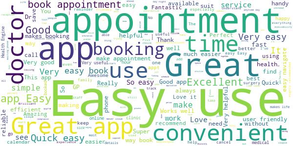
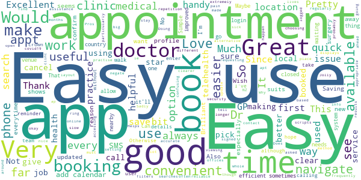
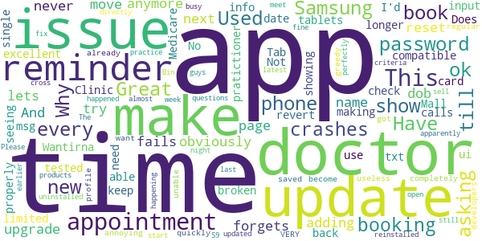
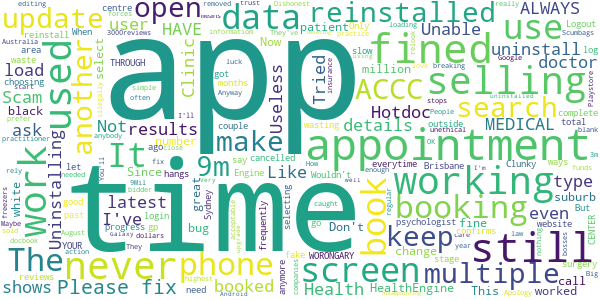

# HealthEngine
App version ``7.3.0``

Analyzed with [covid-apps-observer](http://github.com/covid-apps-observer) project, version ``0.1``

## App overview
| | |
|-------------------------|-------------------------| 
| **Name**&nbsp;&nbsp;&nbsp;&nbsp;&nbsp;&nbsp;&nbsp;&nbsp;&nbsp;&nbsp;&nbsp;&nbsp;&nbsp;&nbsp;&nbsp;&nbsp;&nbsp;&nbsp;&nbsp;&nbsp;&nbsp;&nbsp;&nbsp;&nbsp;&nbsp;&nbsp;&nbsp;&nbsp;&nbsp;&nbsp;&nbsp;&nbsp;&nbsp;&nbsp;&nbsp;&nbsp;&nbsp;&nbsp;&nbsp;&nbsp;  | HealthEngine |
| **Unique identifier** | com.healthengine.android |
| **Link to Google Play** | [https://play.google.com/store/apps/details?id=com.healthengine.android](https://play.google.com/store/apps/details?id=com.healthengine.android) |
| **Summary**  | Find, book &amp; manage GP, dentist, physio appointments and more online 24/7 |
| **Privacy policy** | [https://healthengine.com.au/privacy.php](https://healthengine.com.au/privacy.php) |
| **Latest version** | 7.3.0 |
| **Last update** | 2020-11-09 06:04:47 |
| **Recent changes** | We squashed minor bugs and made some improvements to help you book appointments 24/7, whenever is convenient for you. |
| **Installs**  | 500,000+ |
| **Category** | Health & Fitness |
| **First release** | Jun 4, 2014 |
| **Size**  | 37M |
| **Supported Android version**  | 5.0 and up |

### Description
> Welcome to HealthEngine, where convenience meets care.
 We’re here to make healthcare better by making it easier for you to find, book and manage all your healthcare online. All in one place. Anytime. 
 HealthEngine lets you take control of your health, allowing you to:
 • Find trusted GPs, dentists, physio and more across Australia
 • Book appointments 24/7, whenever is convenient for you
 • Save all your health providers in one place for faster booking next time
 • Find and book Telehealth appointments with online GPs and doctors
  
 We’ve made it easier for you to see your practitioner without leaving the home, safe for you and your family.
  
 What is Telehealth?
  
 Telehealth is an appointment on phone or video, you’ll speak to your practitioner over secure HealthEngine video, regular phone, or by using Facetime, WhatsApp or Skype (dependent on the practice set up).
  
 Many health issues can be solved through Telehealth and it’s a great pre-screener to touch base with your healthcare practitioner. Sometimes, the practitioner will need to see you in person and ask you to come in for a follow up appointment, or provide you with the next steps.

### User interface
The developers of the app provide the following screenshots in the Google play store.
| | | |
|:-------------------------:|:-------------------------:|:-------------------------:|
 |   |   |   | 
 |   |  

## Development team
In the following we report the main information provided by the development team in the Google play store.

| | |
|-------------------------|-------------------------|
| **Developer**  | HealthEngine Pty Ltd |
| **Website**  | [https://healthengine.com.au/](https://healthengine.com.au/) |
| **Email** | feedback@healthengine.com.au |
| **Physical address**  | - |
| **Other developed apps**  | [https://play.google.com/store/apps/developer?id=HealthEngine+Pty+Ltd](https://play.google.com/store/apps/developer?id=HealthEngine+Pty+Ltd) |

## Android support

| | |
|-------------------------|-------------------------|
| **Declared target Android version**  | Android10, version 10 (API level 29) |
| **Effective target Android version**  | Android10, version 10 (API level 29) |
| **Minimum supported Android version**  | Lollipop, version 5.0 (API level 21) |
| **Maximum target Android version**  | - |

The larger the difference between the minimum and maximum supported Android versions, the better. A larger difference means a wider audience. For example, old phones have a very low Android version, so a high minimum supported Android version means that the app cannot be used by users with old phones, thus leading to accessibility problems. 

## Requested permissions

In the following we report the complete list of the permissions requested by the app. 

| **Permission** | **Protection level** | **Description** | 
|-------------------------|-------------------------|-------------------------|
 **android.permission ACCESS_COARSE_LOCATION** | :warning:**Dangerous** | Allows an app to access approximate location. 
 **android.permission ACCESS_FINE_LOCATION** | :warning:**Dangerous** | Allows an app to access precise location. 
 **android.permission ACCESS_NETWORK_STATE** | Normal | Allows applications to access information about networks. 
 **android.permission ACCESS_WIFI_STATE** | Normal | Allows applications to access information about Wi-Fi networks. 
 **android.permission CAMERA** | :warning:**Dangerous** | Required to be able to access the camera device. 
 **android.permission INTERNET** | Normal | Allows applications to open network sockets. 
 **android.permission MODIFY_AUDIO_SETTINGS** | Normal | Allows an application to modify global audio settings. 
 **android.permission READ_CALENDAR** | :warning:**Dangerous** | Allows an application to read the user's calendar data. 
 **android.permission READ_EXTERNAL_STORAGE** | :warning:**Dangerous** | Allows an application to read from external storage. 
 **android.permission RECEIVE_BOOT_COMPLETED** | Normal | Allows an application to receive the Intent.ACTION_BOOT_COMPLETED that is broadcast after the system finishes booting. 
 **android.permission RECORD_AUDIO** | :warning:**Dangerous** | Allows an application to record audio. 
 **android.permission USE_BIOMETRIC** | Normal | Allows an app to use device supported biometric modalities. 
 **android.permission USE_FINGERPRINT** | Normal | This constant was deprecated in API level 28. Applications should request USE_BIOMETRIC instead 
 **android.permission WAKE_LOCK** | Normal | Allows using PowerManager WakeLocks to keep processor from sleeping or screen from dimming. 
 **android.permission WRITE_CALENDAR** | :warning:**Dangerous** | Allows an application to write the user's calendar data. 
 **com.google.android.c2dm.permission RECEIVE** | - | - 
 **com.google.android.finsky.permission BIND_GET_INSTALL_REFERRER_SERVICE** | - | - 
 **com.google.android.providers.gsf.permission READ_GSERVICES** | - | - 

## Mentioned servers

| **Server** | **Registrant** | **Registrant country** | **Creation date** | 
|-------------------------|-------------------------|-------------------------|-------------------------|
 | googlesyndication.com | Google LLC | :us: US | 2003-01-21 06:17:24 |
 | googleapis.com | Google LLC | :us: US | 2005-01-25 17:52:26 |
 | zendesk.com | Zendesk, Inc. | :us: US | 2005-05-16 18:05:12 |
 | he0.io | HealthEngine | :fr: FR | 2018-04-27 11:21:17 |
 | omniture.com | Adobe Inc. | :us: US | 2002-03-29 21:33:52 |
 | facebook.com | Facebook, Inc. | :us: US | 1997-03-29 05:00:00 |
 | google.com | Google LLC | :us: US | 1997-09-15 04:00:00 |
 | imgix.net | Zebrafish Labs | :us: US | 2011-06-23 01:52:27 |
 | googleadservices.com | Google LLC | :us: US | 2003-06-19 16:34:53 |
 | app-measurement.com | Google LLC | :us: US | 2015-06-19 20:13:31 |
 | imrworldwide.com | The Nielsen Company | :us: US | 1998-04-02 05:00:00 |
 | appboy.com | Braze, Inc. | :us: US | 2008-10-06 23:28:32 |
 | braze.com | Braze, Inc. | :us: US | 2000-01-19 02:18:28 |
 | googleapis.com | Google LLC | :us: US | 2005-01-25 17:52:26 |
 | crashlytics.com | Google LLC | :us: US | 2011-01-21 15:30:40 |
 | stripe.com | - | :us: US | 1995-09-12 04:00:00 |
 | branch.io | Branch | :us: US | 2011-11-10 13:52:13 |
 | bnc.lt | - | - | 2016-11-14 00:00:00 |

## Security analysis 

Below we report the main security warnings raised by our execution of the [Androwarn](https://github.com/maaaaz/androwarn) security analysis tool.

**Telephony identifiers leakage**
> - This application reads the device phone type value 
> - This application reads the numeric name (MCC+MNC) of current registered operator 
> - This application reads the operator name 

**Connection interfaces exfiltration**
> - This application reads details about the currently active data network 

**Telephony services abuse**
> - This application makes phone calls 

**Suspicious connection establishment**
> - This application opens a Socket and connects it to the remote address '; port is out of range' on the 'N/A' port  
> - This application opens a Socket and connects it to the remote address 'Ljava/net/Proxy;->type()Ljava/net/Proxy$Type;' on the 'N/A' port  
> - This application opens a Socket and connects it to the remote address 'Ll/e/b/a/a;->a0(Ljava/lang/String;)Ljava/lang/StringBuilder;' on the 'N/A' port  
> - This application opens a Socket and connects it to the remote address 'timeout' on the 'N/A' port  

**Code execution**
> - This application loads a native library 
> - This application executes a UNIX command containing this argument: '2' 

## User ratings and reviews

Below we provide information about how end users are reacting to the app in terms of ratings and reviews in the Google Play store.

### Ratings

The HealthEngine app has been installed by more than **500000** times. At this time, **18612** rated the app and its average score is **4.7218046**. Below we show the distribution of the ratings across the usual star-based rating of Google Play

:star::star::star::star::star:: 15056

:star::star::star::star:: 2779

:star::star::star:: 319

:star::star:: 79

:star:: 379

### Reviews 

#### 5-star reviews

> It's easy to use 😀  :date: __2020-11-23 09:00:20__

> No fuss - have made it simple to use - thank you  :date: __2020-11-23 07:13:41__

> Brilliant easy use app  :date: __2020-11-23 07:09:59__

> Don't have to talk on the phone, data feels secure, biometric and pin locks, sends you email reminders. If you're like me and don't like speaking on the phone, id use this.  :date: __2020-11-23 05:09:52__

> As my mental health has gotten worse this app is great with reminders and stability so thankyou great app!!  :date: __2020-11-23 05:00:32__

> Amazing service  :date: __2020-11-23 01:58:31__

> Excellent  :date: __2020-11-22 23:55:05__

> Easy to use.  :date: __2020-11-22 12:50:22__

> So easy to use very convenient to book doctors online  :date: __2020-11-22 11:32:25__

> Great app  :date: __2020-11-22 03:59:34__

#### 4-star reviews

> Wish you could book further ahead, but it's a great app. No contact, easy to navigate for me it was.  :date: __2020-11-22 16:19:09__

> Pretty good app, easy to use, and frequently updated.  :date: __2020-11-20 23:52:18__

> Easy to use  :date: __2020-11-20 00:36:29__

> Easy to book an appointment but can't cancel an appointment.  :date: __2020-11-15 22:36:24__

> good  :date: __2020-11-15 15:35:54__

> Love the new layout, for easy to find practices.  :date: __2020-11-12 02:13:27__

> A must have App...  :date: __2020-11-11 13:23:48__

> Very handy, especially when going to Doctors regularly.  :date: __2020-11-11 00:53:51__

> Easy to use ap  :date: __2020-11-06 02:42:25__

> Easy and convenient to navigate between different apt options. Easy filters for searches. Since covid19 it displays doctor offices that are way too far away  :date: __2020-11-02 05:41:17__

#### 3-star reviews

> Great app, convenient but I wish there was on option button for a phone appointment, I still have to call the surgery to change my appt to request a call  :date: __2020-11-02 02:43:42__

> Meh  :date: __2020-10-13 17:19:37__

> Unfortunately the add to calendar function doesn't work. It should add the appointment too my Google calendar. Don't know what it's doing.  :date: __2020-10-05 05:00:31__

> Excellent App, been using it for six months now, never had a problem at all... 👍😁  :date: __2020-09-16 08:36:36__

> My first time using this app. Not familiar with it. Cannot delete one of the profile on my list (even though I am able to delete another one) If I am able to choose GP from a drop down list that would be great. Then I don't have to go thru many GP with their available date and time shown.  :date: __2020-09-05 03:41:53__

> Good  :date: __2020-08-19 14:21:18__

> Sometimes unresponsive  :date: __2020-08-16 14:18:48__

> Was good wish more places would let me make appointments on it tho  :date: __2020-08-14 19:34:54__

> When you get to the questions about covid you can hardly read them as they seem to be 'ghosted' text. I had to turn up brightness to read it  :date: __2020-08-07 12:33:44__

> Easy to book appointments  :date: __2020-08-05 22:28:52__

#### 2-star reviews

> Why after each upgrade it forgets my password? And when you try to reset the password it fails.  :date: __2020-11-22 23:15:54__

> Great till new update never had an issue till now doesn't show appointments anymore for any doctor can't book  :date: __2020-11-18 11:58:09__

> Used to be ok now lets you get to adding your name / dob and won't move to next page - obviously not compatible with Samsung Tab 6/ 7 tablets, just broken or not tested properly.  :date: __2020-11-06 05:19:45__

> No longer can make appointments at Wantirna Mall Clinic. Have to revert back to making phone calls.  :date: __2020-10-25 08:23:57__

> Not all doctors are showing so limited use.  :date: __2020-09-22 03:36:42__

> App is ok but need to be able to check time, date and which pratictioner I am seeing. Does not show and txt msg just a reminder you have an appointment no time only a doctor. Time reminder would ui I'd be an excellent reminder.  :date: __2020-09-21 08:05:41__

> Why does it keep asking for Medicare card info to be input every single time I make a booking when it's already been saved in the profile? VERY annoying when I just want to make a booking quickly.  :date: __2020-09-06 22:41:19__

> This app used to be great, then the developers got greedy and it has become useless. I am completely unable to book my regular doctor through this app, I apparently don't meet the "criteria " so I now have to phone the practice directly. The app is to busy asking you questions so they can cross sell products. Bin it and start again guys.  :date: __2020-08-13 01:01:29__

> This app crashes almost every time when I open it. This happened after the new update. Please fix the issue  :date: __2020-08-08 03:46:13__

> App crashes since updated last night Have uninstalled it and reinstalled and the issue is still happening on my Samsung S9 it was perfectly fine earlier on this week before this latest update  :date: __2020-07-30 06:41:19__

#### 1-star reviews

> Cannot book appointments. Tried multiple times  :date: __2020-11-18 13:19:13__

> It's not working now I had to uninstall and reinstall and it still doesn't have my gp on the app I've all ways booked on there but it's not working ITS WORONGARY MEDICAL CENTER I HAVE ALWAYS BOOKED THROUGH YOUR APP  :date: __2020-11-13 06:24:35__

> Like Hotdoc not only does it gets you results for say psychologist outside your search area I ask for Brisbane got suburbs in Sydney. But even those you cancelled your appointment with the medical centre Health Engine and Hotdoc still shows your appointment.  :date: __2020-10-09 02:22:18__

> Unable to complete bookings after latest update cannot progress past the screen where it confirms my details after choosing appointment type.  :date: __2020-10-07 22:00:22__

> Logout everytime and you need to login again it's time wasting !!!  :date: __2020-10-07 02:01:19__

> Only have it because the doctor surgery use it  :date: __2020-10-01 07:40:32__

> Scam.... All fake reviews... Fined 2.9m by the ACCC for selling user data  :date: __2020-09-21 08:59:06__

> Clinic does not load to book. Clunky and slow to search. Uninstalling to use website only  :date: __2020-09-14 06:57:10__

> Wouldn't let me log in.  :date: __2020-09-14 05:25:00__

> Not good  :date: __2020-09-13 16:47:56__

