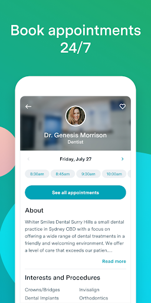
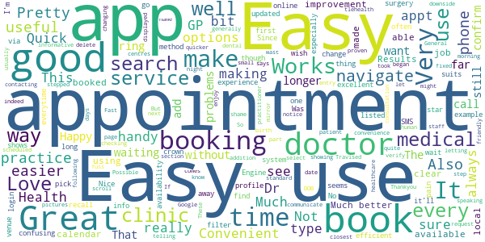
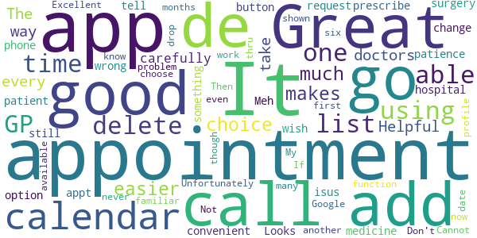
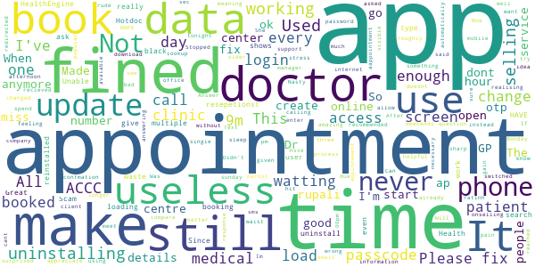

# HealthEngine
App version ``7.6.1``

Analyzed with [covid-apps-observer](http://github.com/covid-apps-observer) project, version ``0.1``

## App overview
| | |
|-------------------------|-------------------------| 
| **Name**&nbsp;&nbsp;&nbsp;&nbsp;&nbsp;&nbsp;&nbsp;&nbsp;&nbsp;&nbsp;&nbsp;&nbsp;&nbsp;&nbsp;&nbsp;&nbsp;&nbsp;&nbsp;&nbsp;&nbsp;&nbsp;&nbsp;&nbsp;&nbsp;&nbsp;&nbsp;&nbsp;&nbsp;&nbsp;&nbsp;&nbsp;&nbsp;&nbsp;&nbsp;&nbsp;&nbsp;&nbsp;&nbsp;&nbsp;&nbsp;  | HealthEngine |
| **Unique identifier** | com.healthengine.android |
| **Link to Google Play** | [https://play.google.com/store/apps/details?id=com.healthengine.android](https://play.google.com/store/apps/details?id=com.healthengine.android) |
| **Summary**  | Find, book &amp; manage GP, dentist, physio appointments and more online 24/7 |
| **Privacy policy** | [https://healthengine.com.au/privacy.php](https://healthengine.com.au/privacy.php) |
| **Latest version** | 7.6.1 |
| **Last update** | 2021-01-27 08:49:12 |
| **Recent changes** | Check in to your appointment right from your phone! For participating practices, check in to your appointment when you arrive and see your position in the queue. Thanks for using HealthEngine! |
| **Installs**  | 500,000+ |
| **Category** | Health & Fitness |
| **First release** | Jun 4, 2014 |
| **Size**  | 38M |
| **Supported Android version**  | 5.0 and up |

### Description
> Welcome to HealthEngine, where convenience meets care.
 We’re here to make healthcare better by making it easier for you to find, book and manage all your healthcare online. All in one place. Anytime. 
 HealthEngine lets you take control of your health, allowing you to:
 • Find trusted GPs, dentists, physio and more across Australia
 • Book appointments 24/7, whenever is convenient for you
 • Save all your health providers in one place for faster booking next time
 • Find and book Telehealth appointments with online GPs and doctors
  
 We’ve made it easier for you to see your practitioner without leaving the home, safe for you and your family.
  
 What is Telehealth?
  
 Telehealth is an appointment on phone or video, you’ll speak to your practitioner over secure HealthEngine video, regular phone, or by using Facetime, WhatsApp or Skype (dependent on the practice set up).
  
 Many health issues can be solved through Telehealth and it’s a great pre-screener to touch base with your healthcare practitioner. Sometimes, the practitioner will need to see you in person and ask you to come in for a follow up appointment, or provide you with the next steps.

### User interface
The developers of the app provide the following screenshots in the Google play store.
| | | |
|:-------------------------:|:-------------------------:|:-------------------------:|
 |   |   |   | 
 |   |  

## Development team
In the following we report the main information provided by the development team in the Google play store.

| | |
|-------------------------|-------------------------|
| **Developer**  | HealthEngine Pty Ltd |
| **Website**  | [https://healthengine.com.au/](https://healthengine.com.au/) |
| **Email** | feedback@healthengine.com.au |
| **Physical address**  | - |
| **Other developed apps**  | [https://play.google.com/store/apps/developer?id=HealthEngine+Pty+Ltd](https://play.google.com/store/apps/developer?id=HealthEngine+Pty+Ltd) |

## Android support

| | |
|-------------------------|-------------------------|
| **Declared target Android version**  | Android10, version 10 (API level 29) |
| **Effective target Android version**  | Android10, version 10 (API level 29) |
| **Minimum supported Android version**  | Lollipop, version 5.0 (API level 21) |
| **Maximum target Android version**  | - |

The larger the difference between the minimum and maximum supported Android versions, the better. A larger difference means a wider audience. For example, old phones have a very low Android version, so a high minimum supported Android version means that the app cannot be used by users with old phones, thus leading to accessibility problems. 

## Requested permissions

In the following we report the complete list of the permissions requested by the app. 

| **Permission** | **Protection level** | **Description** | 
|-------------------------|-------------------------|-------------------------|
 **android.permission ACCESS_COARSE_LOCATION** | :warning:**Dangerous** | Allows an app to access approximate location. 
 **android.permission ACCESS_FINE_LOCATION** | :warning:**Dangerous** | Allows an app to access precise location. 
 **android.permission ACCESS_NETWORK_STATE** | Normal | Allows applications to access information about networks. 
 **android.permission ACCESS_WIFI_STATE** | Normal | Allows applications to access information about Wi-Fi networks. 
 **android.permission CAMERA** | :warning:**Dangerous** | Required to be able to access the camera device. 
 **android.permission INTERNET** | Normal | Allows applications to open network sockets. 
 **android.permission MODIFY_AUDIO_SETTINGS** | Normal | Allows an application to modify global audio settings. 
 **android.permission READ_CALENDAR** | :warning:**Dangerous** | Allows an application to read the user's calendar data. 
 **android.permission READ_EXTERNAL_STORAGE** | :warning:**Dangerous** | Allows an application to read from external storage. 
 **android.permission RECEIVE_BOOT_COMPLETED** | Normal | Allows an application to receive the Intent.ACTION_BOOT_COMPLETED that is broadcast after the system finishes booting. 
 **android.permission RECORD_AUDIO** | :warning:**Dangerous** | Allows an application to record audio. 
 **android.permission USE_BIOMETRIC** | Normal | Allows an app to use device supported biometric modalities. 
 **android.permission USE_FINGERPRINT** | Normal | This constant was deprecated in API level 28. Applications should request USE_BIOMETRIC instead 
 **android.permission WAKE_LOCK** | Normal | Allows using PowerManager WakeLocks to keep processor from sleeping or screen from dimming. 
 **android.permission WRITE_CALENDAR** | :warning:**Dangerous** | Allows an application to write the user's calendar data. 
 **com.google.android.c2dm.permission RECEIVE** | - | - 
 **com.google.android.finsky.permission BIND_GET_INSTALL_REFERRER_SERVICE** | - | - 

## Mentioned servers

| **Server** | **Registrant** | **Registrant country** | **Creation date** | 
|-------------------------|-------------------------|-------------------------|-------------------------|
 | googlesyndication.com | Google LLC | :us: US | 2003-01-21 06:17:24 |
 | googleapis.com | Google LLC | :us: US | 2005-01-25 17:52:26 |
 | imgix.net | Zebrafish Labs | :us: US | 2011-06-23 01:52:27 |
 | zendesk.com | Zendesk, Inc. | :us: US | 2005-05-16 18:05:12 |
 | he0.io | HealthEngine | :fr: FR | 2018-04-27 11:21:17 |
 | omniture.com | Adobe Inc. | :us: US | 2002-03-29 21:33:52 |
 | facebook.com | Facebook, Inc. | :us: US | 1997-03-29 05:00:00 |
 | google.com | Google LLC | :us: US | 1997-09-15 04:00:00 |
 | googleadservices.com | Google LLC | :us: US | 2003-06-19 16:34:53 |
 | app-measurement.com | Google LLC | :us: US | 2015-06-19 20:13:31 |
 | imrworldwide.com | The Nielsen Company | :us: US | 1998-04-02 05:00:00 |
 | appboy.com | Braze, Inc. | :us: US | 2008-10-06 23:28:32 |
 | braze.com | Braze, Inc. | :us: US | 2000-01-19 02:18:28 |
 | googleapis.com | Google LLC | :us: US | 2005-01-25 17:52:26 |
 | crashlytics.com | Google LLC | :us: US | 2011-01-21 15:30:40 |
 | stripe.com | - | :us: US | 1995-09-12 04:00:00 |
 | branch.io | Branch | :us: US | 2011-11-10 13:52:13 |

## Security analysis 

Below we report the main security warnings raised by our execution of the [Androwarn](https://github.com/maaaaz/androwarn) security analysis tool.

**Telephony identifiers leakage**
> - This application reads the MCC+MNC of the provider of the SIM 
> - This application reads the device phone type value 
> - This application reads the numeric name (MCC+MNC) of current registered operator 
> - This application reads the operator name 

**Connection interfaces exfiltration**
> - This application reads details about the currently active data network 

**Telephony services abuse**
> - This application makes phone calls 

**Suspicious connection establishment**
> - This application opens a Socket and connects it to the remote address '; port is out of range' on the 'N/A' port  
> - This application opens a Socket and connects it to the remote address 'Li/e/b/a/a;->i0(Ljava/lang/String;)Ljava/lang/StringBuilder;' on the 'N/A' port  
> - This application opens a Socket and connects it to the remote address 'Ljava/net/Proxy;->type()Ljava/net/Proxy$Type;' on the 'N/A' port  
> - This application opens a Socket and connects it to the remote address 'timeout' on the 'N/A' port  

**Pim data leakage**
> - This application accesses data stored in the clipboard 

**Code execution**
> - This application loads a native library 
> - This application executes a UNIX command containing this argument: '2' 

## User ratings and reviews

Below we provide information about how end users are reacting to the app in terms of ratings and reviews in the Google Play store.

### Ratings

The HealthEngine app has been installed by more than **500000** times. At this time, **19450** rated the app and its average score is **4.757684**. Below we show the distribution of the ratings across the usual star-based rating of Google Play

:star::star::star::star::star:: 16074

:star::star::star::star:: 2740

:star::star::star:: 249

:star::star:: 79

:star:: 308

### Reviews 

#### 5-star reviews

> Quick & easy  :date: __2021-03-14 07:16:19__

> Quick, easy and precise! A+++  :date: __2021-03-14 04:42:33__

> perfect  :date: __2021-03-14 03:32:30__

> Works a treat  :date: __2021-03-14 03:19:38__

> Very easy to use and understand  :date: __2021-03-13 16:21:40__

> Very satisfied patient😀  :date: __2021-03-13 13:31:35__

> Simple to use.  :date: __2021-03-13 01:41:15__

> Easy to use  :date: __2021-03-13 01:04:37__

> Great app thanks  :date: __2021-03-12 09:06:57__

> Easy, clear and straight to the point.  :date: __2021-03-12 07:57:38__

#### 4-star reviews

> Pretty good. It's a shame that the Dr surgery can delete appointment when they want to without telling you. But it still comes up as you still have an appointment That part I don't like.  :date: __2021-03-13 05:30:03__

> Great for booking, wish could change appointments through the app as well.  :date: __2021-03-10 13:04:57__

> Easy to use  :date: __2021-03-10 01:41:15__

> Great  :date: __2021-03-09 13:49:42__

> Good app, However the login page is a pain.  :date: __2021-03-03 01:36:03__

> Fast and easy to use and I no longer have to wait on the phone waiting for am appointment  :date: __2021-02-25 23:08:08__

> Great app. Easy to use  :date: __2021-02-24 01:54:54__

> Works well, some mirror problems. These are other patient problems. Booking and not showing. Doctor now rings to confirm. This in itself makes the system a wast of time, I might as well just ring.  :date: __2021-02-23 00:34:58__

> I took 1 star off because I can't add my dental clinic into it, other than that, it's great, Thankyou  :date: __2021-02-21 15:25:45__

> It was quite good letting me know where closest GP is or small healthcare clinic is. Also let's me see the pictures and name of f all the doctors at the GP clinics or medical centres  :date: __2021-02-18 10:01:22__

#### 3-star reviews

> It makes it much easier to get the Appointment of the my choice  :date: __2020-12-28 00:43:46__

> Helpful in every way  :date: __2020-12-15 02:34:12__

> The doctors it not take carefully and prescribe medicine at patience to tell de patient go de hospital for something wrong isus  :date: __2020-12-15 01:53:33__

> Looks good.  :date: __2020-11-25 22:17:39__

> Great app, convenient but I wish there was on option button for a phone appointment, I still have to call the surgery to change my appt to request a call  :date: __2020-11-02 02:43:42__

> Meh  :date: __2020-10-13 17:19:37__

> Unfortunately the add to calendar function doesn't work. It should add the appointment too my Google calendar. Don't know what it's doing.  :date: __2020-10-05 05:00:31__

> Excellent App, been using it for six months now, never had a problem at all... 👍😁  :date: __2020-09-16 08:36:36__

> My first time using this app. Not familiar with it. Cannot delete one of the profile on my list (even though I am able to delete another one) If I am able to choose GP from a drop down list that would be great. Then I don't have to go thru many GP with their available date and time shown.  :date: __2020-09-05 03:41:53__

> Good  :date: __2020-08-19 14:21:18__

#### 2-star reviews

> Was starting to enjoy this app however the most recent update has ruined it. I now open the app and receive a blank page with a logo - that's it - no functionality whatsoever.  :date: __2021-03-10 03:41:09__

> Why after each upgrade it forgets my password? And when you try to reset the password it fails.  :date: __2020-11-22 23:15:54__

> Great till new update never had an issue till now doesn't show appointments anymore for any doctor can't book  :date: __2020-11-18 11:58:09__

> Used to be ok now lets you get to adding your name / dob and won't move to next page - obviously not compatible with Samsung Tab 6/ 7 tablets, just broken or not tested properly.  :date: __2020-11-06 05:19:45__

> No longer can make appointments at Wantirna Mall Clinic. Have to revert back to making phone calls.  :date: __2020-10-25 08:23:57__

> Not all doctors are showing so limited use.  :date: __2020-09-22 03:36:42__

> App is ok but need to be able to check time, date and which pratictioner I am seeing. Does not show and txt msg just a reminder you have an appointment no time only a doctor. Time reminder would ui I'd be an excellent reminder.  :date: __2020-09-21 08:05:41__

> Why does it keep asking for Medicare card info to be input every single time I make a booking when it's already been saved in the profile? VERY annoying when I just want to make a booking quickly.  :date: __2020-09-06 22:41:19__

#### 1-star reviews

> Was an amazing and helpful app.Now it is the most useless app on the internet. Im not feeling well and its a sunday, i know my GP is popular but its ok. I have this app and can make an appointment so i dont miss out. NOPE!!!! The app doesnt allow me to make appointments on weekends anymore. So instead i cant sleep tonight out of stress. I will hsve roughly 60 sec when they start answering calls to try and gain one of 5 appointments i can see visible. If i miss out i spend days in pain.  :date: __2021-03-14 15:20:29__

> Stopped using this app, my mobile number changed and I cannot change it online or through the app. Can no longer access to app due to access to sms otp. I cannot access app without otp and don't use app enough to waist time calling support to update my phone number.  :date: __2021-03-11 07:31:34__

> Didn't appreciate my details being given to a compare the market call centre.  :date: __2021-03-10 13:46:16__

> Text automatically redirected me to this app, meaning while already only just in time for an appointment I had to download this on data, login to my password manager, login to this, create a passcode, and then lookup my appointment before realising the app booked me to the wrong medical center...I'm sure its a good app but why is it necessary to go through this process every time I want to do something these days? Answer: It shouldn't be, fix your $hit.  :date: __2021-03-10 03:07:29__

> This company was fined for onselling client information.  :date: __2021-03-05 09:38:30__

> Made appointments with ap that never made to doctors office my doctor has had enough of this ap and switched to a service  :date: __2021-03-02 23:06:57__

> Doctor very rude and Nasty. Not recommended for older people!!!!  :date: __2021-02-13 06:44:28__

> Will change to a better ratinh when I dont have to enter a passcode every single time I open the app.  :date: __2021-01-16 23:48:19__

> I book my aappointment online and recieved confmation email and phone with Dr rupali sharp 12:pm afternoon on Monday 04/01/2121 . When I reached i am watting for one hour . After one hour I asked the question resepetionst how much I am watting for she said no idea still three more patient watting meet to Dr rupali before you .. I am surprised and ask resepetionst what you give me time 12.00pm if appionement not avaiable. She give me no any response. really very bad services. I never goi again  :date: __2021-01-04 04:30:05__

> 1 hr notice for an appointment is silly. Make it the day before do there is a chance to cancel in a timely manner.  :date: __2020-12-09 23:38:27__

