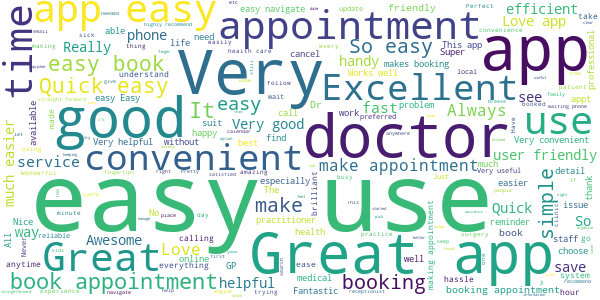
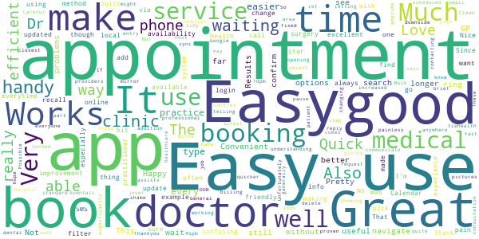
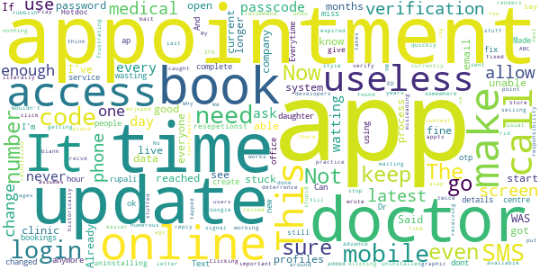

# HealthEngine
App version ``7.8.2``

Analyzed with [covid-apps-observer](http://github.com/covid-apps-observer) project, version ``0.1``

## App overview
| | |
|-------------------------|-------------------------| 
| **Name**                                          | HealthEngine |
| **Unique identifier** | com.healthengine.android |
| **Link to Google Play** | [https://play.google.com/store/apps/details?id=com.healthengine.android](https://play.google.com/store/apps/details?id=com.healthengine.android) |
| **Summary**  | Find, book & manage GP, dentist, physio appointments and more online 24/7 |
| **Privacy policy** | [https://healthengine.com.au/privacy.php](https://healthengine.com.au/privacy.php) |
| **Latest version** | 7.8.2 |
| **Last update** | 2021-04-06 02:56:23 |
| **Recent changes** | We squashed some minor bugs to help you book appointments 24/7, whenever is convenient for you. Thanks for using HealthEngine. |
| **Installs**  | 500,000+ |
| **Category** | Health & Fitness |
| **First release** | Jun 4, 2014 |
| **Size**  | 38M |
| **Supported Android version**  | 5.0 and up |

### Description
> Welcome to HealthEngine, where convenience meets care.
 We’re here to make healthcare better by making it easier for you to find, book and manage all your healthcare online. All in one place. Anytime. 
 HealthEngine lets you take control of your health, allowing you to:
 • Find trusted GPs, dentists, physio and more across Australia
 • Book appointments 24/7, whenever is convenient for you
 • Save all your health providers in one place for faster booking next time
 • Find and book Telehealth appointments with online GPs and doctors
  
 We’ve made it easier for you to see your practitioner without leaving the home, safe for you and your family.
  
 What is Telehealth?
  
 Telehealth is an appointment on phone or video, you’ll speak to your practitioner over secure HealthEngine video, regular phone, or by using Facetime, WhatsApp or Skype (dependent on the practice set up).
  
 Many health issues can be solved through Telehealth and it’s a great pre-screener to touch base with your healthcare practitioner. Sometimes, the practitioner will need to see you in person and ask you to come in for a follow up appointment, or provide you with the next steps.

### User interface
The developers of the app provide the following screenshots in the Google play store.
| | | |
|:-------------------------:|:-------------------------:|:-------------------------:|
 |   |   |   | 
 |   |  

## Development team
In the following we report the main information provided by the development team in the Google play store.

| | |
|-------------------------|-------------------------|
| **Developer**  | HealthEngine Pty Ltd |
| **Website**  | [https://healthengine.com.au/](https://healthengine.com.au/) |
| **Email** | feedback@healthengine.com.au |
| **Physical address**  | - |
| **Other developed apps**  | [https://play.google.com/store/apps/developer?id=HealthEngine+Pty+Ltd](https://play.google.com/store/apps/developer?id=HealthEngine+Pty+Ltd) |

## Android support

| | |
|-------------------------|-------------------------|
| **Declared target Android version**  | Android10, version 10 (API level 29) |
| **Effective target Android version**  | Android10, version 10 (API level 29) |
| **Minimum supported Android version**  | Lollipop, version 5.0 (API level 21) |
| **Maximum target Android version**  | - |

The larger the difference between the minimum and maximum supported Android versions, the better. A larger difference means a wider audience. For example, old phones have a very low Android version, so a high minimum supported Android version means that the app cannot be used by users with old phones, thus leading to accessibility problems. 

## Requested permissions

In the following we report the complete list of the permissions requested by the app. 

| **Permission** | **Protection level** | **Description** | 
|-------------------------|-------------------------|-------------------------|
 **android.permission ACCESS_COARSE_LOCATION** | :warning:**Dangerous** | Allows an app to access approximate location. 
 **android.permission ACCESS_FINE_LOCATION** | :warning:**Dangerous** | Allows an app to access precise location. 
 **android.permission ACCESS_NETWORK_STATE** | Normal | Allows applications to access information about networks. 
 **android.permission ACCESS_WIFI_STATE** | Normal | Allows applications to access information about Wi-Fi networks. 
 **android.permission CAMERA** | :warning:**Dangerous** | Required to be able to access the camera device. 
 **android.permission INTERNET** | Normal | Allows applications to open network sockets. 
 **android.permission MODIFY_AUDIO_SETTINGS** | Normal | Allows an application to modify global audio settings. 
 **android.permission READ_CALENDAR** | :warning:**Dangerous** | Allows an application to read the user's calendar data. 
 **android.permission READ_EXTERNAL_STORAGE** | :warning:**Dangerous** | Allows an application to read from external storage. 
 **android.permission RECEIVE_BOOT_COMPLETED** | Normal | Allows an application to receive the Intent.ACTION_BOOT_COMPLETED that is broadcast after the system finishes booting. 
 **android.permission RECORD_AUDIO** | :warning:**Dangerous** | Allows an application to record audio. 
 **android.permission USE_BIOMETRIC** | Normal | Allows an app to use device supported biometric modalities. 
 **android.permission USE_FINGERPRINT** | Normal | This constant was deprecated in API level 28. Applications should request USE_BIOMETRIC instead 
 **android.permission WAKE_LOCK** | Normal | Allows using PowerManager WakeLocks to keep processor from sleeping or screen from dimming. 
 **android.permission WRITE_CALENDAR** | :warning:**Dangerous** | Allows an application to write the user's calendar data. 
 **com.google.android.c2dm.permission RECEIVE** | - | - 
 **com.google.android.finsky.permission BIND_GET_INSTALL_REFERRER_SERVICE** | - | - 

## Mentioned servers

| **Server** | **Registrant** | **Registrant country** | **Creation date** | 
|-------------------------|-------------------------|-------------------------|-------------------------|
 | googlesyndication.com | Google LLC | :us: US | 2003-01-21 06:17:24 |
 | googleapis.com | Google LLC | :us: US | 2005-01-25 17:52:26 |
 | imgix.net | Zebrafish Labs | :us: US | 2011-06-23 01:52:27 |
 | zendesk.com | Zendesk, Inc. | :us: US | 2005-05-16 18:05:12 |
 | he0.io | HealthEngine | :fr: FR | 2018-04-27 11:21:17 |
 | omniture.com | Adobe Inc. | :us: US | 2002-03-29 21:33:52 |
 | facebook.com | Facebook, Inc. | :us: US | 1997-03-29 05:00:00 |
 | google.com | Google LLC | :us: US | 1997-09-15 04:00:00 |
 | googleadservices.com | Google LLC | :us: US | 2003-06-19 16:34:53 |
 | app-measurement.com | Google LLC | :us: US | 2015-06-19 20:13:31 |
 | imrworldwide.com | The Nielsen Company | :us: US | 1998-04-02 05:00:00 |
 | appboy.com | Braze, Inc. | :us: US | 2008-10-06 23:28:32 |
 | braze.com | Braze, Inc. | :us: US | 2000-01-19 02:18:28 |
 | googleapis.com | Google LLC | :us: US | 2005-01-25 17:52:26 |
 | crashlytics.com | Google LLC | :us: US | 2011-01-21 15:30:40 |
 | stripe.com | - | :us: US | 1995-09-12 04:00:00 |
 | branch.io | Branch | :us: US | 2011-11-10 13:52:13 |

## Security analysis 

Below we report the main security warnings raised by our execution of the [Androwarn](https://github.com/maaaaz/androwarn) security analysis tool.

**Telephony identifiers leakage**
> - This application reads the MCC+MNC of the provider of the SIM 
> - This application reads the device phone type value 
> - This application reads the numeric name (MCC+MNC) of current registered operator 
> - This application reads the operator name 

**Connection interfaces exfiltration**
> - This application reads details about the currently active data network 

**Telephony services abuse**
> - This application makes phone calls 

**Suspicious connection establishment**
> - This application opens a Socket and connects it to the remote address '; port is out of range' on the 'N/A' port  
> - This application opens a Socket and connects it to the remote address 'Lh/e/b/a/a;->o0(Ljava/lang/String;)Ljava/lang/StringBuilder;' on the 'N/A' port  
> - This application opens a Socket and connects it to the remote address 'Ljava/net/Proxy;->type()Ljava/net/Proxy$Type;' on the 'N/A' port  
> - This application opens a Socket and connects it to the remote address 'timeout' on the 'N/A' port  

**Pim data leakage**
> - This application accesses data stored in the clipboard 

**Code execution**
> - This application loads a native library 
> - This application executes a UNIX command containing this argument: '2' 

## User ratings and reviews

Below we provide information about how end users are reacting to the app in terms of ratings and reviews in the Google Play store.

### Ratings

The HealthEngine app has been installed by more than **500000** times. At this time, **20307** rated the app and its average score is **4.7655716**. Below we show the distribution of the ratings across the usual star-based rating of Google Play

:star::star::star::star::star:: 17111

:star::star::star::star:: 2500

:star::star::star:: 229

:star::star:: 69

:star:: 398

### Reviews 

#### 5-star reviews

> Easy to use  :date: __2021-04-18 09:05:32__

> It's so handy to be able to make your own appointments anytime of the day or night with your preferred doctors and add it straight to calendar. Love this app!  :date: __2021-04-18 03:16:23__

> Good  :date: __2021-04-17 08:27:30__

> Easy setup and convenient  :date: __2021-04-17 01:31:11__

> Life made easy  :date: __2021-04-17 01:05:11__

> Easy to use  :date: __2021-04-17 00:31:43__

> If I can use this anyone can  :date: __2021-04-15 07:15:04__

> Great App and very easy to use... Very satisfied with the features..  :date: __2021-04-15 07:09:07__

> Always friendly and my needs are met  :date: __2021-04-15 04:32:13__

> Great app  :date: __2021-04-15 03:39:29__

#### 4-star reviews

> very handy app  :date: __2021-04-15 19:32:43__

> Makes it easy and efficient  :date: __2021-04-14 02:37:54__

> Good app does it's job  :date: __2021-04-13 06:30:38__

> Dr Mirna jover is understanding. helpful. Careful and hope giving  :date: __2021-04-09 20:59:25__

> Quick and painless just like all medical things should be  :date: __2021-04-07 11:51:04__

> App works great but practitioners aren't in sync with website  :date: __2021-04-06 06:00:17__

> Great app, easy to make an appointment anytime and anywhere.  :date: __2021-04-03 18:28:13__

> Doctors are friendly and professional. Bulk billing assists everyone. Clean and tidy waiting area. Unfortunately, the wait time for your appointment has increased significantly. 1:10pm turned into 1:45pm waiting.  :date: __2021-03-28 05:29:48__

> Great  :date: __2021-03-26 12:45:31__

> Easy to use app to book doctors appointments  :date: __2021-03-19 06:26:24__

#### 3-star reviews

> Easy bo booking  :date: __2021-04-18 04:36:00__

> It keeps telling me to update the app which is very annoying.  :date: __2021-04-13 09:05:05__

> UPDATE ON REVIEW: After a bumpy March '21update caused appointment fail for my doc booking, I reported the problem and developer was attentive and gave advice. I will need to await my next booking before I can report it as fixed. Hope. Updated & failed.. what a shame the March '21 update caused the booking appointment service to become inactive. Texts with codes keep rolling in but setting an appointment time cannot be achieved. It used to work really well.  :date: __2021-03-25 09:39:59__

> It makes it much easier to get the Appointment of the my choice  :date: __2020-12-28 00:43:46__

> Helpful in every way  :date: __2020-12-15 02:34:12__

> The doctors it not take carefully and prescribe medicine at patience to tell de patient go de hospital for something wrong isus  :date: __2020-12-15 01:53:33__

> Looks good.  :date: __2020-11-25 22:17:39__

> Great app, convenient but I wish there was on option button for a phone appointment, I still have to call the surgery to change my appt to request a call  :date: __2020-11-02 02:43:42__

> Meh  :date: __2020-10-13 17:19:37__

> Unfortunately the add to calendar function doesn't work. It should add the appointment too my Google calendar. Don't know what it's doing.  :date: __2020-10-05 05:00:31__

#### 2-star reviews

> Constant sms verification is insane, got a response to update to 7.8.1 but only 7.8 shows for me.  :date: __2021-04-01 07:53:18__

> This app used to be great. Now I can't even book on it and I get sms's for absolutely no reason.  :date: __2021-03-31 02:03:36__

> Why after each upgrade it forgets my password? And when you try to reset the password it fails.  :date: __2020-11-22 23:15:54__

> Great till new update never had an issue till now doesn't show appointments anymore for any doctor can't book  :date: __2020-11-18 11:58:09__

> Used to be ok now lets you get to adding your name / dob and won't move to next page - obviously not compatible with Samsung Tab 6/ 7 tablets, just broken or not tested properly.  :date: __2020-11-06 05:19:45__

> No longer can make appointments at Wantirna Mall Clinic. Have to revert back to making phone calls.  :date: __2020-10-25 08:23:57__

#### 1-star reviews

> This WAS good app for years. Now I can't book, keep getting 2FA codes with place to put it, uninstalled and reinstalled twice and added our profiles over and over again. Not sure what you've done in the last few months but have now got rid of it as it's easier to call the clinic.  :date: __2021-04-17 02:40:02__

> Useless. Said appointments weren't available on this app  :date: __2021-04-15 09:46:25__

> Can't login as app is stuck at verify mobile number. Clicking next does nothing  :date: __2021-04-08 05:33:14__

> stupid 10 letter password  :date: __2021-04-07 08:07:31__

> The app is currently not working at all.  :date: __2021-04-07 02:25:06__

> Allows appts when offices aren't even open....texts for confirmation s not recvd....rubbish system  :date: __2021-04-06 05:46:24__

> I cannot find any practice or doctor on the app. My usual doctor can't be found on the app but when I go online it's fine.  :date: __2021-04-02 10:51:39__

> Why do I need to get an SMS for verification? We get no mobile signal where I live and by the time I get somewhere to access the SMS, the code has expired. I've just about reached the point of ditching the app. It's s o frustrating that everyone just assumes that everyone else has mobile phone access!!  :date: __2021-03-29 00:04:41__

> Need to see my doctor but can't get in till ages when I call up, I get in quickly if I use the app but the update stuffed up the log in process and now I am stuck waiting. Already wrote a review and sent an email to developers but had no reply 🤨 I think if you start an important app like this you have the responsibility to make sure it works and not literally stuff peoples lives around like your doing to me.  :date: __2021-03-27 16:29:39__

> You should know that this company had historically been caught selling your medical data. Google it with ABC News.  :date: __2021-03-25 02:53:51__

