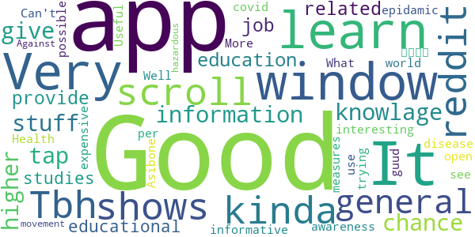
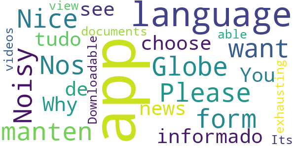
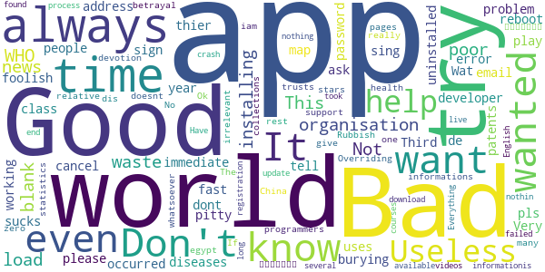

# OpenWHO: Knowledge for Health Emergencies
App version ``3.3``

Analyzed with [covid-apps-observer](http://github.com/covid-apps-observer) project, version ``0.1``

## App overview
| | |
|-------------------------|-------------------------| 
| **Name**&nbsp;&nbsp;&nbsp;&nbsp;&nbsp;&nbsp;&nbsp;&nbsp;&nbsp;&nbsp;&nbsp;&nbsp;&nbsp;&nbsp;&nbsp;&nbsp;&nbsp;&nbsp;&nbsp;&nbsp;&nbsp;&nbsp;&nbsp;&nbsp;&nbsp;&nbsp;&nbsp;&nbsp;&nbsp;&nbsp;&nbsp;&nbsp;&nbsp;&nbsp;&nbsp;&nbsp;&nbsp;&nbsp;&nbsp;&nbsp;  | OpenWHO: Knowledge for Health Emergencies |
| **Unique identifier** | de.xikolo.openwho |
| **Link to Google Play** | [https://play.google.com/store/apps/details?id=de.xikolo.openwho](https://play.google.com/store/apps/details?id=de.xikolo.openwho) |
| **Summary**  | Life-saving knowledge for frontline responders in health emergencies. |
| **Privacy policy** | [https://openwho.org/pages/privacy](https://openwho.org/pages/privacy) |
| **Latest version** | 3.3 |
| **Last update** | 2020-05-05 16:17:12 |
| **Recent changes** | - Redesign of some UI elements - Bug fixes and performance improvements |
| **Installs**  | 1,000,000+ |
| **Category** | Education |
| **First release** | May 17, 2017 |
| **Size**  | 36M |
| **Supported Android version**  | 5.0 and up |

### Description
> OpenWHO is the World Health Organization's (WHO) interactive knowledge-transfer platform offering online courses to improve the response to health emergencies. OpenWHO enables the Organization and its key partners to transfer life-saving knowledge to large numbers of frontline responders.
 With OpenWHO, you have the flexibility to learn at your convenience. Watch the short video lectures and test your knowledge with self-tests when and where you like. The course forum and the collaboration space allow you to get in touch with other participants and experts around the world.
  
 Designed primarily for health care workers, frontline responders, and decision-makers, the app is also a source of information for those affected by disease outbreaks and health emergencies, or for those with a general interest in WHO's work in health emergencies.
  
 It features 6 channels:
 - The <b>Outbreak</b> channel addresses the management of infectious diseases and provides life-saving, scientific information.
 - The <b>Ready for Response</b> channel helps prepare personnel who are training for deployment to work in disease outbreaks and health emergencies.
 - The <b>Get Social</b> channel focuses on social science-based interventions and helps to communicate with affected communities.
 - The <b>Preparing for Pandemics</b> channel brings together courses on various aspects of preparedness, including surveillance, public health measures and risk communication during a pandemic.
 - The <b>COVID-19</b> channel provides learning resources in WHO's 6 official languages (Arabic, Chinese, English, French, Russian and Spanish) for health professionals, decision-makers and the public for the outbreak of coronavirus disease (COVID-19).
 - The <b>COVID-19 National Languages</b> channel provides the same learning resources as the COVID-19 channel but in national languages, such as Indonesian, Japanese and Portuguese. 
  
 OpenWHO courses are available in many languages, including WHO's 6 official languages. 
  
 Download the app now, and join the OpenWHO community.
 This app is developed in cooperation between the Hasso Plattner Institute and the WHO. The learning content is provided exclusively by the WHO.

### User interface
The developers of the app provide the following screenshots in the Google play store.
| | | |
|:-------------------------:|:-------------------------:|:-------------------------:|
 |   |   |   | 
 |   |   |   | 

## Development team
In the following we report the main information provided by the development team in the Google play store.

| | |
|-------------------------|-------------------------|
| **Developer**  | HPI Knowledge Engineering Team |
| **Website**  | [https://openwho.org/](https://openwho.org/) |
| **Email** | openwho-support@hpi.de |
| **Physical address**  | [Prof.-Dr.-Helmert-Str.2-3 14482 Potsdam](https://www.google.com/maps/search/Prof.-Dr.-Helmert-Str.2-3%2014482%20Potsdam) (Google Maps) |
| **Other developed apps**  | [https://play.google.com/store/apps/developer?id=7185448023325736337](https://play.google.com/store/apps/developer?id=7185448023325736337) |

## Android support

| | |
|-------------------------|-------------------------|
| **Declared target Android version**  | Android10, version 10 (API level 29) |
| **Effective target Android version**  | Android10, version 10 (API level 29) |
| **Minimum supported Android version**  | Lollipop, version 5.0 (API level 21) |
| **Maximum target Android version**  | - |

The larger the difference between the minimum and maximum supported Android versions, the better. A larger difference means a wider audience. For example, old phones have a very low Android version, so a high minimum supported Android version means that the app cannot be used by users with old phones, thus leading to accessibility problems. 

## Requested permissions

In the following we report the complete list of the permissions requested by the app. 

| **Permission** | **Protection level** | **Description** | 
|-------------------------|-------------------------|-------------------------|
 **android.permission ACCESS_NETWORK_STATE** | Normal | Allows applications to access information about networks. 
 **android.permission ACCESS_WIFI_STATE** | Normal | Allows applications to access information about Wi-Fi networks. 
 **android.permission FOREGROUND_SERVICE** | Normal | Allows a regular application to use Service.startForeground. 
 **android.permission INTERNET** | Normal | Allows applications to open network sockets. 
 **android.permission READ_EXTERNAL_STORAGE** | :warning:**Dangerous** | Allows an application to read from external storage. 
 **android.permission RECEIVE_BOOT_COMPLETED** | Normal | Allows an application to receive the Intent.ACTION_BOOT_COMPLETED that is broadcast after the system finishes booting. 
 **android.permission WAKE_LOCK** | Normal | Allows using PowerManager WakeLocks to keep processor from sleeping or screen from dimming. 
 **android.permission WRITE_EXTERNAL_STORAGE** | :warning:**Dangerous** | Allows an application to write to external storage. 
 **com.google.android.c2dm.permission RECEIVE** | - | - 
 **com.google.android.finsky.permission BIND_GET_INSTALL_REFERRER_SERVICE** | - | - 

## Mentioned servers

| **Server** | **Registrant** | **Registrant country** | **Creation date** | 
|-------------------------|-------------------------|-------------------------|-------------------------|
 | googlesyndication.com | Google LLC | :us: US | 2003-01-21 06:17:24 |
 | google.com | Google LLC | :us: US | 1997-09-15 04:00:00 |
 | app-measurement.com | Google LLC | :us: US | 2015-06-19 20:13:31 |
 | apple.com | Apple Inc. | :us: US | 1987-02-19 05:00:00 |
 | aomedia.org | Contact Privacy Inc. Customer 1243324949 | :canada: CA | 2015-08-24 14:07:31 |
 | dashif.org | VTM Group | :us: US | 2012-04-27 13:02:46 |
 | w3.org | W3C | :us: US | 1994-07-06 04:00:00 |
 | googleapis.com | Google LLC | :us: US | 2005-01-25 17:52:26 |
 | googleadservices.com | Google LLC | :us: US | 2003-06-19 16:34:53 |
 | psdev.de | - | - | - |
 | xmlpull.org | WhoisGuard, Inc. | PA | 2001-11-26 20:33:08 |
 | someurl.com | WhoisGuard, Inc. | PA | 2000-02-08 15:50:35 |
 | crashlytics.com | Google LLC | :us: US | 2011-01-21 15:30:40 |
 | apache.org | The Apache Software Foundation | :us: US | 1995-04-11 04:00:00 |
 | opensource.org | Open Source Initiative | :us: US | 1998-02-11 05:00:00 |
 | creativecommons.org | Creative Commons Corporation | :canada: CA | 2001-01-15 16:51:44 |
 | eclipse.org | Eclipse.org Foundation, Inc. | :canada: CA | 1997-04-14 04:00:00 |
 | gnu.org | Free Software Foundation | :us: US | 1995-11-24 05:00:00 |
 | mozilla.org | Mozilla Corporation | :us: US | 1998-01-24 05:00:00 |

## Security analysis 

Below we report the main security warnings raised by our execution of the [Androwarn](https://github.com/maaaaz/androwarn) security analysis tool.

**Telephony identifiers leakage**
> - This application reads the ISO country code equivalent of the current registered operator's MCC (Mobile Country Code) 

**Connection interfaces exfiltration**
> - This application reads details about the currently active data network 
> - This application tries to find out if the currently active data network is metered 

**Suspicious connection establishment**
> - This application opens a Socket and connects it to the remote address ' returned no addresses for  ; port is out of range' on the 'N/A' port  
> - This application opens a Socket and connects it to the remote address '' on the 'N/A' port  
> - This application opens a Socket and connects it to the remote address 'Ljava/lang/StringBuilder;->toString()Ljava/lang/String;' on the 'N/A' port  
> - This application opens a Socket and connects it to the remote address 'Ljava/net/Proxy;->type()Ljava/net/Proxy$Type;' on the 'N/A' port  
> - This application opens a Socket and connects it to the remote address 'timeout' on the 'N/A' port  

**Code execution**
> - This application loads a native library 
> - This application loads a native library: 'bypass' 
> - This application loads a native library: 'jniPdfium' 
> - This application loads a native library: 'modft2' 
> - This application loads a native library: 'modpdfium' 
> - This application loads a native library: 'modpng' 

## User ratings and reviews

Below we provide information about how end users are reacting to the app in terms of ratings and reviews in the Google Play store.

### Ratings

The OpenWHO: Knowledge for Health Emergencies app has been installed by more than **1000000** times. At this time, **2396** rated the app and its average score is **4.3122363**. Below we show the distribution of the ratings across the usual star-based rating of Google Play

:star::star::star::star::star:: 1627

:star::star::star::star:: 323

:star::star::star:: 202

:star::star:: 50

:star:: 192

### Reviews 

#### 5-star reviews

> It's a very simplified version.👍👍👍  :date: __2020-05-10 10:43:35__

> Good  :date: __2020-05-09 16:24:30__

> Excellent and more informative  :date: __2020-05-08 14:29:14__

> I salute to the efforts of WHO for the eradication of diseases which is spread in the whole world  :date: __2020-05-08 04:26:43__

> Nice... Really help full  :date: __2020-05-07 16:39:29__

> This is so amazing and exciting for me. I will surely use it with care and respect for the good it brings to WHO communities worldwide. Thank you!  :date: __2020-05-06 20:18:32__

> W.h.o  :date: __2020-05-05 22:15:28__

> Gud  :date: __2020-05-05 09:27:43__

> Good  :date: __2020-05-03 20:03:19__

> Performance perfectly performed  :date: __2020-05-03 18:27:24__

#### 4-star reviews

> Good ap  :date: __2020-05-10 07:41:36__

> Eccellent  :date: __2020-05-09 06:04:21__

> Good 👍  :date: __2020-05-08 13:54:07__

> Facing Error while check tool bar progress.  :date: __2020-05-07 11:56:39__

> It is educative very helpful to me and my impact in my community  :date: __2020-05-05 12:29:56__

> "శుభోదయం 🌅 సూర్యోదయం. "ఓం మహాగణాధిపతయే నమః. ఓంగణానాంత్వాగణపతిగ్ంహవామహే కవింకవీనాముపమశ్రవస్తమమ్ జ్యేష్టరాజం బ్రహ్మణాంబ్రహ్మణస్పత ఆనశ్శృణ్వనూతి భిస్సీద సాదనమ్. "శ్రీ ఓం మహాగణపతయేనమః . "వాగర్ధావివ సంపృక్తౌ వాగర్ధ ప్రతిపత్తయే వందే జగతఃపితరౌ పార్వతీ పరమేశ్వరౌ . "సంఘం శక్తి చ దేహిమే జగదంభికే నమాయః మహాదేవి దంపతీ సుఖహేతవే "ఓం హ్రీం శివశివాయై నమః స్వాహాః. "సంకల్పానికి గణాధిపతి అధిపతి అయితే శుభసంకల్పానికి సౌభాగ్య సంపద ఇచ్చేవారు ఆదిదంపతులు పార్వతీ పరమేశ్వరులు. "ఓంహ్రీశివశివాయైనమఃస్వాహః.  :date: __2020-05-03 08:12:34__

> Good  :date: __2020-05-01 06:32:41__

> Nice app l hope that improve and add alot of unique courses !!!  :date: __2020-04-29 14:56:21__

> Knowledge as well as certificates  :date: __2020-04-27 14:49:46__

> Seen your video add before I downloaded the app and you say join an app with "millions" of users, number of downloads are 500k+ less that 1 million. Thoughtbud point it out  :date: __2020-04-26 19:37:53__

#### 3-star reviews

> Tbh this app is kinda like reddit, you can scroll through windows that shows general knowlage, then you can tap into that window for more information. It's a good app to learn about stuff  :date: __2020-05-09 13:39:53__

> Very good app ..give chance to learn higher education...its very good if this app will provide job related educational studies  :date: __2020-05-02 15:54:16__

> Good  :date: __2020-04-29 17:15:00__

> Very interesting.  :date: __2020-04-29 08:44:44__

> Good  :date: __2020-04-23 19:00:10__

> Can't open  :date: __2020-04-16 00:11:34__

> What i do use this apps  :date: __2020-04-15 20:44:05__

> Good app  :date: __2020-04-14 15:20:06__

> Useful app  :date: __2020-04-12 13:33:49__

> Health awareness  :date: __2020-04-12 00:26:04__

#### 2-star reviews

> Noisy app.  :date: __2020-04-21 21:34:45__

> Nice  :date: __2020-04-09 16:25:41__

> Please , i want the App in the form of the Globe.  :date: __2020-04-05 14:35:33__

> Nos manten informado de tudo  :date: __2020-03-22 08:51:43__

> Why can't you choose a language???? You have to see the same news or documents in all languages. Its exhausting.  :date: __2020-03-15 19:30:37__

> not able to view videos. not Downloadable too  :date: __2019-06-07 20:15:22__

#### 1-star reviews

> Bad  :date: __2020-05-09 07:44:18__

> Don't even know how to play  :date: __2020-05-06 17:54:16__

> I dont want it please cancel immediate  :date: __2020-04-28 06:51:19__

> U want my email address  :date: __2020-04-27 09:15:16__

> I wanted the developer to tell me the uses of this app  :date: __2020-04-24 22:13:46__

> It sucks i wanted map of world and diseases  :date: __2020-04-23 21:50:10__

> I can't sing in.. don't know where the problem .I uninstalled and again try.. pls help fast .. it's always ask for password  :date: __2020-04-23 20:52:34__

> Useless app by a useless organisation, people will be burying thier patents this year and all this does is waste your time.  :date: __2020-04-18 09:28:59__

> Third class... Not working after installing  :date: __2020-04-17 17:18:57__

> Time for a reboot.  :date: __2020-04-15 21:01:00__

