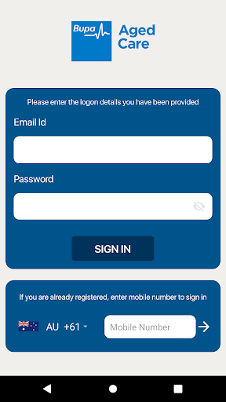
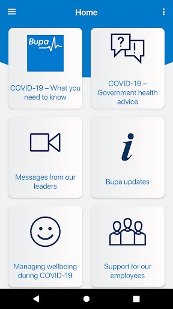
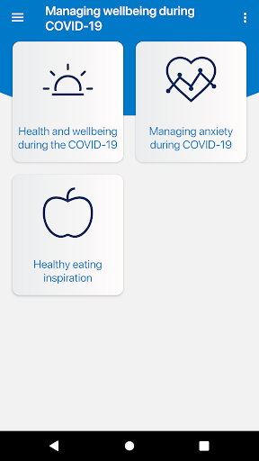

# Bupa Aged Care Connect
App version ``1.1``

Analyzed with [covid-apps-observer](http://github.com/covid-apps-observer) project, version ``0.1``

## App overview
| | |
|-------------------------|-------------------------| 
| **Name**&nbsp;&nbsp;&nbsp;&nbsp;&nbsp;&nbsp;&nbsp;&nbsp;&nbsp;&nbsp;&nbsp;&nbsp;&nbsp;&nbsp;&nbsp;&nbsp;&nbsp;&nbsp;&nbsp;&nbsp;&nbsp;&nbsp;&nbsp;&nbsp;&nbsp;&nbsp;&nbsp;&nbsp;&nbsp;&nbsp;&nbsp;&nbsp;&nbsp;&nbsp;&nbsp;&nbsp;&nbsp;&nbsp;&nbsp;&nbsp;  | Bupa Aged Care Connect |
| **Unique identifier** | mycc.cic.bupaconnect |
| **Link to Google Play** | [https://play.google.com/store/apps/details?id=mycc.cic.bupaconnect](https://play.google.com/store/apps/details?id=mycc.cic.bupaconnect) |
| **Summary**  | Bupa Aged Care Connect helps your families and employees during COVID-19. |
| **Privacy policy** | [https://www.checkedincare.com.au/privacypolicy.html](https://www.checkedincare.com.au/privacypolicy.html) |
| **Latest version** | 1.1 |
| **Last update** | 2020-04-22 08:12:08 |
| **Recent changes** | - |
| **Installs**  | 1,000+ |
| **Category** | Health & Fitness |
| **First release** | Apr 3, 2020 |
| **Size**  | 13M |
| **Supported Android version**  | 5.0 and up |

### Description
> Features:
 * up-to-date Bupa Aged Care communications on COVID-19
 * direct messages from Bupa Aged Care homes to families and employees
 * resources and support including COVID-19 government health advice, dementia care and 
    wellbeing tips
 * details of Bupa’s COVID-19 information line and our care home contact details
 * updates and information about life in our homes during COVID-19.
  
 NOTE: This app is not suitable for seeking medical attention in an emergency.

### User interface
The developers of the app provide the following screenshots in the Google play store.
| | | |
|:-------------------------:|:-------------------------:|:-------------------------:|
 |   |   |   | 

## Development team
In the following we report the main information provided by the development team in the Google play store.

| | |
|-------------------------|-------------------------|
| **Developer**  | CheckedIn Care |
| **Website**  | [https://www.checkedincare.com.au](https://www.checkedincare.com.au) |
| **Email** | cc@checkedincare.com.au |
| **Physical address**  | - |
| **Other developed apps**  | [https://play.google.com/store/apps/developer?id=CheckedIn+Care](https://play.google.com/store/apps/developer?id=CheckedIn+Care) |

## Android support

| | |
|-------------------------|-------------------------|
| **Declared target Android version**  | Pie, version 9 (API level 28) |
| **Effective target Android version**  | Pie, version 9 (API level 28) |
| **Minimum supported Android version**  | Lollipop, version 5.0 (API level 21) |
| **Maximum target Android version**  | - |

The larger the difference between the minimum and maximum supported Android versions, the better. A larger difference means a wider audience. For example, old phones have a very low Android version, so a high minimum supported Android version means that the app cannot be used by users with old phones, thus leading to accessibility problems. 

## Requested permissions

In the following we report the complete list of the permissions requested by the app. 

| **Permission** | **Protection level** | **Description** | 
|-------------------------|-------------------------|-------------------------|
 **android.permission ACCESS_FINE_LOCATION** | :warning:**Dangerous** | Allows an app to access precise location. 
 **android.permission ACCESS_NETWORK_STATE** | Normal | Allows applications to access information about networks. 
 **android.permission ACCESS_NOTIFICATION_POLICY** | Normal | Marker permission for applications that wish to access notification policy. 
 **android.permission ACCESS_WIFI_STATE** | Normal | Allows applications to access information about Wi-Fi networks. 
 **android.permission BLUETOOTH** | Normal | Allows applications to connect to paired bluetooth devices. 
 **android.permission BROADCAST_STICKY** | Normal | Allows an application to broadcast sticky intents. 
 **android.permission CAMERA** | :warning:**Dangerous** | Required to be able to access the camera device. 
 **android.permission CAPTURE_VIDEO_OUTPUT** | - | - 
 **android.permission DISABLE_KEYGUARD** | Normal | Allows applications to disable the keyguard if it is not secure. 
 **android.permission GET_TASKS** | Deprecated | This constant was deprecated in API level 21. No longer enforced. 
 **android.permission INTERNET** | Normal | Allows applications to open network sockets. 
 **android.permission MODIFY_AUDIO_SETTINGS** | Normal | Allows an application to modify global audio settings. 
 **android.permission READ_CONTACTS** | :warning:**Dangerous** | Allows an application to read the user's contacts data. 
 **android.permission READ_EXTERNAL_STORAGE** | :warning:**Dangerous** | Allows an application to read from external storage. 
 **android.permission READ_PHONE_STATE** | :warning:**Dangerous** | Allows read only access to phone state, including the phone number of the device, current cellular network information, the status of any ongoing calls, and a list of any PhoneAccounts registered on the device. 
 **android.permission RECEIVE_BOOT_COMPLETED** | Normal | Allows an application to receive the Intent.ACTION_BOOT_COMPLETED that is broadcast after the system finishes booting. 
 **android.permission RECORD_AUDIO** | :warning:**Dangerous** | Allows an application to record audio. 
 **android.permission VIBRATE** | Normal | Allows access to the vibrator. 
 **android.permission WAKE_LOCK** | Normal | Allows using PowerManager WakeLocks to keep processor from sleeping or screen from dimming. 
 **android.permission WRITE_CONTACTS** | :warning:**Dangerous** | Allows an application to write the user's contacts data. 
 **android.permission WRITE_EXTERNAL_STORAGE** | :warning:**Dangerous** | Allows an application to write to external storage. 
 **com.google.android.c2dm.permission RECEIVE** | - | - 
 **mycc.cic.bupaconnect.permission C2D_MESSAGE** | - | - 

## Mentioned servers

| **Server** | **Registrant** | **Registrant country** | **Creation date** | 
|-------------------------|-------------------------|-------------------------|-------------------------|
 | googlesyndication.com | Google LLC | :us: US | 2003-01-21 06:17:24 |
 | google.com | Google LLC | :us: US | 1997-09-15 04:00:00 |
 | app-measurement.com | Google LLC | :us: US | 2015-06-19 20:13:31 |
 | youtube.com | Google LLC | :us: US | 2005-02-15 05:13:12 |
 | opentok.com | Domains By Proxy, LLC | :us: US | 2010-09-24 17:14:13 |
 | stripe.com | - | :us: US | 1995-09-12 04:00:00 |
 | crashlytics.com | Google LLC | :us: US | 2011-01-21 15:30:40 |
 | azurewebsites.net | Microsoft Corporation | :us: US | 2012-01-24 18:43:51 |
 | ihealthlabs.com | REDACTED FOR PRIVACY | cn | 2011-10-13 07:43:43 |
 | ibb.co | WhoisGuard, Inc. | PA | 2010-07-20 18:05:44 |
 | azurewebsites.net | Microsoft Corporation | :us: US | 2012-01-24 18:43:51 |
 | cloudinary.com | Cloudinary Ltd. | :israel: IL | 2011-05-24 12:52:37 |

## Security analysis 

Below we report the main security warnings raised by our execution of the [Androwarn](https://github.com/maaaaz/androwarn) security analysis tool.

**Telephony identifiers leakage**
> - This application reads the ISO country code equivalent for the SIM provider's country code 

**Connection interfaces exfiltration**
> - This application reads details about the currently active data network 
> - This application tries to find out if the currently active data network is metered 

**Telephony services abuse**
> - This application makes phone calls 

**Suspicious connection establishment**
> - This application opens a Socket and connects it to the remote address '' on the 'N/A' port  
> - This application opens a Socket and connects it to the remote address 'Ljava/lang/StringBuilder;->toString()Ljava/lang/String;' on the 'N/A' port  
> - This application opens a Socket and connects it to the remote address 'Ljava/net/Proxy;->type()Ljava/net/Proxy$Type;' on the 'N/A' port  
> - This application opens a Socket and connects it to the remote address 'timeout' on the 'N/A' port  

**Code execution**
> - This application loads a native library: 'jingle_peerconnection_so' 
> - This application loads a native library: 'jniPdfium' 
> - This application loads a native library: 'modft2' 
> - This application loads a native library: 'modpdfium' 
> - This application loads a native library: 'modpng' 
> - This application loads a native library: 'opentok' 

## User ratings and reviews

Below we provide information about how end users are reacting to the app in terms of ratings and reviews in the Google Play store.

### Ratings

The Bupa Aged Care Connect app has been installed by more than **1000** times. At this time, **-** rated the app and its average score is **0.0**. Below we show the distribution of the ratings across the usual star-based rating of Google Play

:star::star::star::star::star:: 0

:star::star::star::star:: 0

:star::star::star:: 0

:star::star:: 0

:star:: 0

### Reviews 

#### 5-star reviews

No recent reviews available with 5 stars.

#### 4-star reviews

> Very good. James.  :date: __2020-04-16 22:18:04__

#### 3-star reviews

No recent reviews available with 3 stars.

#### 2-star reviews

No recent reviews available with 2 stars.

#### 1-star reviews

No recent reviews available with 1 stars.
