# COVID-related Android apps in Canada

Author: `Ivano Malavolta` (ivanomalavolta@gmail.com)

Created at: `2020/11/8`

Report generated by the [covid-apps-observer](http://github.com/covid-apps-observer) project, version 0.1

# Table of contents 

- [Background](#background)
    * [Data sources and analyses](#data-sources-and-analyses)
        * [App metadata](#app-metadata)
        * [Requested permissions](#requested-permissions)
        * [Mentioned servers](#mentioned_servers)
        * [Security analysis](#security_analysis)
        * [User ratings and reviews](#user-ratings-and-reviews)
    * [Disclaimer](#disclaimer)
- [BC COVID-19 Support](#bc-covid-19-support)
- [ABTraceTogether](#abtracetogether)
- [Canada COVID-19](#canada-covid-19)
- [WHO Info](#who-info)
- [OpenWHO: Knowledge for Health Emergencies](#openwho-knowledge-for-health-emergencies)

- [Credits](#credits)

# How to read this report

This report has been generated by the [covid-apps-observer](http://github.com/covid-apps-observer) project. The project automatically analyzes the apps by extracting information which is already publicly available either on the web or in the apps binary files. 

Our analysis covers the following apps:
| | |
|-------------------------|-------------------------| 
|  | BC COVID-19 Support
|  | ABTraceTogether
|  | Canada COVID-19
|  | WHO Info
|  | OpenWHO: Knowledge for Health Emergencies

The details of our analysis are presented in the remainder of this report.

For independent verification, the raw data and the source code of the project is publicly available in its GitHub repository [http://github.com/covid-apps-observer](http://github.com/covid-apps-observer) and its source code has been thoroughly commented in order to provide all the details about how the information provided in this report has been extracted. 

Any feedback, questions, and improvements about the project are very welcome, feel free to create an issue or pull request directly in its GitHub repository: [http://github.com/covid-apps-observer](http://github.com/covid-apps-observer).

## Data sources and analyses

The analysis of each app is structured around five main dimensions: 
* App metadata  
* Requested permissions
* Mentioned servers
* Androwarn analysis
* User ratings and reviews

In the following we describe the data sources and analysis performed for each dimension.

### App metadata

App metadata includes an overview of the main information about the app (for example, its name, releases, privacy policy, etc.), contact information of the development team, and the various Android versions supported by the app. This information is extracted from two main data sources:
* _Google Play store_: we automatically mined the web page of the Google Play store showing the basic information about the app and we parsed it in order to extract information about the app and development team 
* _Android Manifest file_: in our analysis we decompiled the binary file of the app (it is similar to a Zip archive but it contains the code of the app instead of normal files) and we extracted information about the supported Android versions, as it has been listed by its development team.

The extracted app metadata feeds the _App overview_, _Development team_, and _Android support_ sections of this report.
We make use of the [google-play-scraper](https://github.com/JoMingyu/google-play-scraper) tool for extracting the raw data related to this dimension of the project.

### Requested permissions

The Android operating system has a permission model which allows users to grant access to potentially privacy-related information. Every Android app has to explictly declare the permissions it needs to properly function in the Android Manifest file.  

In this report we also show the protection level of each permission, which is a key information for understanding how the requested permissions related to the user's privacy. We carefully analyzed the [official Android documentation (v. 29)](https://developer.android.com/reference/android/Manifest.permission), and it resulted that a permission requested by an Android app can belong to the following protection levels:
* **Dangerous**: higher-risk permissions that would give a requesting app access to private user data or control over the device that can negatively impact the user. Because this type of permission introduces potential risk, the system usually does not automatically grant it to the requesting app. For example, any dangerous permissions requested by an app may be displayed to the user and require confirmation before proceeding.
* **Normal**: this is the default and most common level in Android; normal permissions are lower-risk and give access to isolated app-level features, with minimal risk to other apps, the system, or the user. 
* **Signature**: permissions granted only if the requesting app is signed with the same certificate as the app that declared the permission
* **Appop**: old permission level, a reminiscence of the App Ops tool that Google introduced in Android 4.3.
* **Development**: optional permissions which can be granted to development-oriented apps.
* **Privileged**: permissions who give higher power to mobile apps w.r.t. other apps, such as binding to incoming calls, interacting via bluetooth with other devices without user interaction, etc.
* **Preinstalled**: reserved only for preinstalled apps
* **Installer**: allow the holder to start the permission usage screen for an app
* **RetailDemo**: permissions related to devices used in demonstrations in shops.
* **Pre23**: permissions automatically granted to apps targeting devices running pre-6.0 Android.
* **Upcoming**: permissions which will be released in the next version of the Android platform. 
* **Deprecated**: permissions belonging to old releases of the Android platform, they should not be used by developers since they will not be supported in the near future.
* **Not for use by third-party applications**: permissions which can be requested only by apps developed by Google.
* **Undefined**: this protection level is not documented by Google.

The permissions dimension of this project is based on the [Androguard](https://github.com/androguard/androguard) static analysis tool.

### Mentioned servers

We decompiled each app in order to look for all possible mentions of remote URLs. The mentioned URLs can refer to remote servers the the app is using for either sending or receiving information, web addresses for directing the user to an information website, and so on. 

:warning: It is important to note that this analysis is not meant to be complete and it is very prone to obfuscation. The servers reported here are simply _mentioned_ somewhere in the code of the app and are meant to just give an indication about the "hooks" of the app towards external resources. For example, for an Android app it is normal to contact Google services in order to send/receive push notifications, or to contact the servers of analytics services for having real-time diagnostics about crashes of the app or bugs.

This part of the analysis is based on the [Androguard](https://github.com/androguard/androguard) static analysis tool for identfying the raw URLs mentioned in the app; then, the information about each mentioned server is collected by performing a _whois_ lookup on the first-level domain present in the URL.

### Security analysis

This dimension is based on the [Androwarn](https://github.com/maaaaz/androwarn) structural and data flow analysis of Android bytecode. Androwarn is developed by the University of Lyon/INSA (France) and it has been used in several academic studies. According to its documentation, Androwarn targets the following categories of potential security issues:
* **Telephony identifiers exfiltration**: IMEI, IMSI, MCC, MNC, LAC, CID, operator's name, etc.
* **Device settings exfiltration**: software version, usage statistics, system settings, logs, etc.
* **Geolocation information leakage**: GPS/WiFi geolocation, etc.
* **Connection interfaces information exfiltration**: WiFi credentials, Bluetooth MAC adress, etc.
* **Telephony services abuse**: premium SMS sending, phone call composition, etc.
* **Audio/video flow interception**: call recording, video capture, etc.
* **Remote connection establishment**: socket open call, Bluetooth pairing, APN settings edit, etc.
* **PIM data leakage**: contacts, calendar, SMS, mails, clipboard, etc.
* **External memory operations**: file access on SD card, etc.
* **PIM data modification**: add/delete contacts, calendar events, etc.
* **Arbitrary code execution**: native code using JNI, UNIX command, privilege escalation, etc.
* **Denial of Service**: event notification deactivation, file deletion, process killing, virtual keyboard disable, terminal shutdown/reboot, etc.

Note: We do not consider this data point in the current version of our analyzers since it is too verbose for our purposes.

:warning: It is important to note that Androwarn is a static analysis tool, and as such it performs a variety of heuristics and approximations in its analyses. Said that, the results shown in this report are meant to provide an indication of _potential_ security issues and should be by no means treated as complete and correct.   

### User ratings and reviews

For this dimension we turn again to the web interface of the Google Play store. Firstly, we automatically mine summary statistics about user ratings from the web page of the app under analysis; then, we automatically download the newest 1000 reviews of the app under analysis. For each level of rating (5 stars, 4 stars, , etc., 1 star) we show:
- a word cloud presenting the main terms used by end users in their reviews in the Google Play store
- the last 10 reviews provided by app users in the Google Play store. 

This purposefully simple analysis is meant to help both future users and the development team of the app in understanding what are the main positive and negative points of the app under analysis.

We make use of the [google-play-scraper](https://github.com/JoMingyu/google-play-scraper) tool for extracting the raw data related to this dimension of the project.

## Disclaimer 

This report has been produced independently of any parties and its only objective is to help anybody in better understanding how COVID-related apps work in practice (and compare to each other). The results of this report are limited to the specific version of the software used for running the analyses and on the various heuristics implemented in there. In other words, the results of the analyzers may differ depending on the time and modalities in which they are executed. We do not guarantee that the results of the analyses and the corresponding contents of this report are fully complete or correct. The analysis software is licensed under the [MIT License](https://github.com/iivanoo/covid-apps-observer/blob/master/LICENSE).

# BC COVID-19 Support
App version ``1.28.0``

Analyzed with [covid-apps-observer](http://github.com/covid-apps-observer) project, version ``0.1``

## App overview
| | |
|-------------------------|-------------------------| 
| **Name**&nbsp;&nbsp;&nbsp;&nbsp;&nbsp;&nbsp;&nbsp;&nbsp;&nbsp;&nbsp;&nbsp;&nbsp;&nbsp;&nbsp;&nbsp;&nbsp;&nbsp;&nbsp;&nbsp;&nbsp;&nbsp;&nbsp;&nbsp;&nbsp;&nbsp;&nbsp;&nbsp;&nbsp;&nbsp;&nbsp;&nbsp;&nbsp;&nbsp;&nbsp;&nbsp;&nbsp;&nbsp;&nbsp;&nbsp;&nbsp;  | BC COVID-19 Support |
| **Unique identifier** | ca.bc.gov.health.hlbc.COVID19 |
| **Link to Google Play** | [https://play.google.com/store/apps/details?id=ca.bc.gov.health.hlbc.COVID19](https://play.google.com/store/apps/details?id=ca.bc.gov.health.hlbc.COVID19) |
| **Summary**  | Stay informed about COVID-19 in BC and determine what actions you should take. |
| **Privacy policy** | [https://www.thrive.health/foippa](https://www.thrive.health/foippa) |
| **Latest version** | 1.28.0 |
| **Last update** | 2020-10-24 00:59:05 |
| **Recent changes** | We are constantly optimizing our app and adding new features to help support you through COVID-19.  This version includes a number of UI/UX improvements as well as stability enhancements. |
| **Installs**  | 50,000+ |
| **Category** | Medical |
| **First release** | Mar 21, 2020 |
| **Size**  | 10M |
| **Supported Android version**  | 5.0 and up |

### Description
> If you are a resident of British Columbia, Canada, BC COVID-19 Support is designed for you to stay informed about COVID-19 in BC and determine what actions and next steps you should take.  Recommendations are personalized and based on your personal risk factors.  You will receive timely updates with important news and alerts from BC’s Ministry of Health.  Recommendations and content are automatically updated based on the latest BC guidelines related to COVID-19.
 This application has been developed in collaboration with Thrive Health, a Vancouver-based healthcare technology company.  
 SAFETY & SECURITY:
 You will only be asked to provide your age, postal code, and device location.  The data you provide will be combined with all user data and used to inform the provincial COVID-19 response, and to allow you to receive location-based alerts.
 Your data will not be sold. Your data will not be used for any purpose other than health care.
 We follow industry best practices for data security and privacy.  The data you provide is always encrypted and is stored in Canada.

### User interface
The developers of the app provide the following screenshots in the Google play store.
| | | |
|:-------------------------:|:-------------------------:|:-------------------------:|
 |   |  

## Development team
In the following we report the main information provided by the development team in the Google play store.

| | |
|-------------------------|-------------------------|
| **Developer**  | Province of British Columbia, Canada |
| **Website**  | - |
| **Email** | support@thrive.health |
| **Physical address**  | - |
| **Other developed apps**  | [https://play.google.com/store/apps/developer?id=Province+of+British+Columbia,+Canada](https://play.google.com/store/apps/developer?id=Province+of+British+Columbia,+Canada) |

## Android support

| | |
|-------------------------|-------------------------|
| **Declared target Android version**  | Pie, version 9 (API level 28) |
| **Effective target Android version**  | Pie, version 9 (API level 28) |
| **Minimum supported Android version**  | Lollipop, version 5.0 (API level 21) |
| **Maximum target Android version**  | - |

The larger the difference between the minimum and maximum supported Android versions, the better. A larger difference means a wider audience. For example, old phones have a very low Android version, so a high minimum supported Android version means that the app cannot be used by users with old phones, thus leading to accessibility problems. 

## Requested permissions

In the following we report the complete list of the permissions requested by the app. 

| **Permission** | **Protection level** | **Description** | 
|-------------------------|-------------------------|-------------------------|
 **android.permission ACCESS_COARSE_LOCATION** | :warning:**Dangerous** | Allows an app to access approximate location. 
 **android.permission ACCESS_FINE_LOCATION** | :warning:**Dangerous** | Allows an app to access precise location. 
 **android.permission ACCESS_NETWORK_STATE** | Normal | Allows applications to access information about networks. 
 **android.permission CAMERA** | :warning:**Dangerous** | Required to be able to access the camera device. 
 **android.permission INTERNET** | Normal | Allows applications to open network sockets. 
 **android.permission READ_EXTERNAL_STORAGE** | :warning:**Dangerous** | Allows an application to read from external storage. 
 **android.permission REQUEST_INSTALL_PACKAGES** | Signature | Allows an application to request installing packages. 
 **com.google.android.c2dm.permission RECEIVE** | - | - 
 **com.google.android.finsky.permission BIND_GET_INSTALL_REFERRER_SERVICE** | - | - 

## Mentioned servers

| **Server** | **Registrant** | **Registrant country** | **Creation date** | 
|-------------------------|-------------------------|-------------------------|-------------------------|
 | googlesyndication.com | Google LLC | :us: US | 2003-01-21 06:17:24 |
 | google.com | Google LLC | :us: US | 1997-09-15 04:00:00 |
 | app-measurement.com | Google LLC | :us: US | 2015-06-19 20:13:31 |
 | branch.io | Branch | :us: US | 2011-11-10 13:52:13 |
 | crashlytics.com | Google LLC | :us: US | 2011-01-21 15:30:40 |
 | gstatic.com | Google LLC | :us: US | 2008-02-11 15:31:25 |
 | bnc.lt | - | - | 2016-11-14 00:00:00 |
 | googleapis.com | Google LLC | :us: US | 2005-01-25 17:52:26 |
 | googleadservices.com | Google LLC | :us: US | 2003-06-19 16:34:53 |

## Security analysis 

Below we report the main security warnings raised by our execution of the [Androwarn](https://github.com/maaaaz/androwarn) security analysis tool.

**Location lookup**
> - This application reads location information from all available providers (WiFi, GPS etc.) 

**Connection interfaces exfiltration**
> - This application reads details about the currently active data network 
> - This application tries to find out if the currently active data network is metered 

**Pim data leakage**
> - This application accesses the downloads folder 
> - This application accesses data stored in the clipboard 

## User ratings and reviews

Below we provide information about how end users are reacting to the app in terms of ratings and reviews in the Google Play store.

### Ratings

The BC COVID-19 Support app has been installed by more than **50000** times. At this time, **170** rated the app and its average score is **4.118812**. Below we show the distribution of the ratings across the usual star-based rating of Google Play

:star::star::star::star::star:: 102

:star::star::star::star:: 30

:star::star::star:: 15

:star::star:: 5

:star:: 18

### Reviews 

#### 5-star reviews

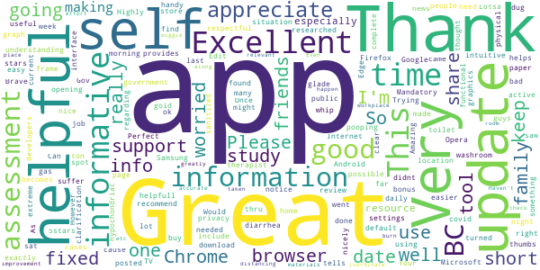

> Excellent useful informative thank you  :date: __2020-06-07 16:54:54__

> Very helpfull  :date: __2020-05-25 02:52:46__

> Very helpful and informative!  :date: __2020-05-20 15:13:25__

> Your app keeps opening Google Chrome for news updates. However, I don't use this browser. Can you update the app to support any browser? Android has Firefox, Samsung Internet, Microsoft Edge, Opera, Brave, and many more - you need to support more than just Chrome. Once this is fixed, the app will get 5 stars! Edit: you guys fixed it!! Thank you! 5stars to you!  :date: __2020-05-16 08:10:54__

> Perfect  :date: __2020-04-28 11:09:46__

> Informative!  :date: __2020-04-25 04:26:38__

> This app helps with understanding what to do, what is going on, and what the government is doing.  :date: __2020-04-25 02:28:31__

> Would be nice if date/time of public TV updates posted on home page.  :date: __2020-04-24 23:34:19__

> Great  :date: __2020-04-24 03:48:09__

> Very well made, intuitive, and provides exactly the information needed during this time. As a bonus, the app is very respectful of privacy settings, and has location turned off by default. Highly recommend using this app to keep up to date with the current situation in BC.  :date: __2020-04-16 12:46:31__

#### 4-star reviews

> I note that no mention is made as to where and how to obtain masks. Pharmacies are out of stock. Where can masks be obtained?  :date: __2020-04-27 00:16:56__

> Very helpful and informative.  :date: __2020-04-25 00:50:33__

> The updates are now fixed and the app works well, thank you for updating, this helps track a lot of issues in the Hospice home I would also like to see a better breakdown of the daily check up a quick check up and a thorough check up option would be very sufficient but very well done app specially for proper information  :date: __2020-04-13 20:17:45__

> This important part of life right now, I like to hear of many changes that I come in to hearing for better or worse Thanks sandy davies  :date: __2020-04-08 23:01:32__

> It's pretty easy and basic didn't keep it for long I just keep the news on tv  :date: __2020-04-07 02:48:49__

> Very helpful and informative particularly for British Columbians. Presented in a way that is clear and easy to digest. A "survival guide" that doesn't come across as all doom and gloom. Daily stats could be updated more frequently but overall very helpful.  :date: __2020-04-07 00:36:59__

> Clear and easy to use  :date: __2020-03-24 05:10:56__

#### 3-star reviews

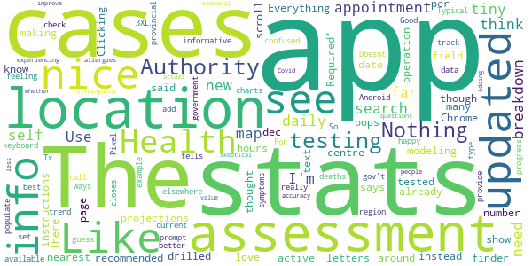

> I love the app and the up to date info it would be nice though if we could see not just how many cases there are in each Health Authority but instead the number of active cases per health authority  :date: __2020-10-30 05:35:56__

> The app recommended I get tested. I already know where the nearest testing centre is so I thought that was it, just show up. Nothing in the testing instructions was said about making an appointment until I drilled down to search the location for hours of operation. There in tiny tiny letters it says 'Appointment Required'. The finder app uses Chrome. Clicking on the text field pops up the keyboard and then closes it. So you can't type in your location to search. Pixel 3XL, Android 10  :date: __2020-06-14 02:55:44__

> I think you need to add a prompt to set up the location. I'm happy to have this app. Tx  :date: __2020-05-13 09:24:24__

> Stats are nice but the self assessment tells me to call 911 if I'm feeling confused.  :date: __2020-05-05 06:05:32__

> Nothing really new or informative that is not available elsewhere.  :date: __2020-04-24 18:19:05__

> Doesnt provide the best charts to track trend/progress....new cases and deaths daily  :date: __2020-04-10 07:06:36__

> Good info so far, but the app is not updated daily with current stats. Typical gov't I guess.  :date: __2020-04-04 17:07:08__

> I like it so far. I think we should see a provincial breakdown map by region. Use the self-check and government data to populate the map.  :date: __2020-03-27 06:58:15__

> The assessment needs a better breakdown of symptoms. For example there are ways to distinguish between whether you are just experiencing seasonal allergies or actual Covid 19. Adding a few more questions would improve the value of the assessment and people will be less skeptical of its accuracy.  :date: __2020-03-24 21:21:54__

#### 2-star reviews

> The stats page is not updating. It's still show stats from September 30.  :date: __2020-10-04 16:38:05__

> When I first installed it it worked fine. Now it has terrible glitches and freezes at the end of the self-assessment section. I've uninstalled and reinstalled it and it still dosn't work. I uninstalled it again.  :date: __2020-09-09 23:17:44__

> Never any updates, no clarification of who should stay off work, and an online test that only says stay at home for 10 days if you're sick. As useless as the BC government's reaction to the whole mess. People should be fired.  :date: __2020-03-24 20:35:26__

#### 1-star reviews

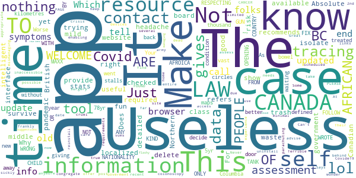

> Why? This is nothing more than an interface to information. It's time for BC to get on board with the Canadian Covid-19 contact tracing app  :date: __2020-09-24 07:26:37__

> Does not show the right detailed information. Northern British Columbia is vast and a new case a thousand kilometres away is treated like it is on my back door. The maps could be better defined.  :date: __2020-08-28 06:11:40__

> Your app stalls at "what did you decide to do". FIX IT!  :date: __2020-08-13 17:43:30__

> WRONG NATIONALITY TO FOLLOW WITH RESPECTING THE LAW OF CANADA. OPENING A RESOURCE FROM CANADA: AFRICAN PEOPLE OR KIND ARE N0T WELCOME TO LAW OF CANADA . AFRICAN WELCOME TO AFROICA ONLY. TANK CHILD LAW COUNTRY'. WROTE BY: MAXX GUN  :date: __2020-06-01 06:54:22__

> Worse than useless. This self-assessment app went in circles without giving me ANY symptoms info. As 78yr old with a 5yr bowel condition waiting now for over a year in a congregate care home for a scheduled post-surgery 2nd colonoscopy behind a parachuting army of folks with possible CANCER and now Covide19, I find the several dead-end links you offer to old or sickly folks to self-assess, frankly, cruel. Their end sums up my entire site experience: "PAGE NOT FOUND. PLEASE take it down.  :date: __2020-04-25 14:04:20__

> Great resource until recent update...now inaccessible on our devices. At a time when you we should be enabling access to appropriate info the app is now limited to due to browser requirements.  :date: __2020-04-07 21:44:05__

> Terrible app. Never gets updated and gives out of date advise. Makes you wonder what else the BC Goverment is mismanaging during the COVID crisis.  :date: __2020-04-03 04:30:17__

> Can't use it anymore. Says browser needs to be updated (not true as far as I can tell)  :date: __2020-04-01 01:43:55__

> Useless!  :date: __2020-03-29 17:02:48__

> Keep having to uninstall and reinstall  :date: __2020-03-29 07:38:58__

# ABTraceTogether
App version ``1.4.0``

Analyzed with [covid-apps-observer](http://github.com/covid-apps-observer) project, version ``0.1``

## App overview
| | |
|-------------------------|-------------------------| 
| **Name**&nbsp;&nbsp;&nbsp;&nbsp;&nbsp;&nbsp;&nbsp;&nbsp;&nbsp;&nbsp;&nbsp;&nbsp;&nbsp;&nbsp;&nbsp;&nbsp;&nbsp;&nbsp;&nbsp;&nbsp;&nbsp;&nbsp;&nbsp;&nbsp;&nbsp;&nbsp;&nbsp;&nbsp;&nbsp;&nbsp;&nbsp;&nbsp;&nbsp;&nbsp;&nbsp;&nbsp;&nbsp;&nbsp;&nbsp;&nbsp;  | ABTraceTogether |
| **Unique identifier** | ca.albertahealthservices.contacttracing |
| **Link to Google Play** | [https://play.google.com/store/apps/details?id=ca.albertahealthservices.contacttracing](https://play.google.com/store/apps/details?id=ca.albertahealthservices.contacttracing) |
| **Summary**  | This app is from the Government of Alberta to augment manual contact tracing. |
| **Privacy policy** | [https://alberta.ca/ABTraceTogetherPrivacy](https://alberta.ca/ABTraceTogetherPrivacy) |
| **Latest version** | 1.4.0 |
| **Last update** | 2020-09-28 23:34:37 |
| **Recent changes** | - added capability to do contact tracing with Apple applications that are running in the background - updated privacy policy - minor bug fixes |
| **Installs**  | 50,000+ |
| **Category** | Health & Fitness |
| **First release** | Apr 30, 2020 |
| **Size**  | 9.6M |
| **Supported Android version**  | 8.0 and up |

### Description
> This app is being brought to you by the Government of Alberta.
 This app is intended for ages 14+.
 Some of the key benefits of this app are to:
 • Augment our current contact tracing efforts to provide guidance and care to those who are or may be infected
 • Help keep Albertans safe by limiting the spread of COVID-19 through more individuals self-isolating earlier
 The app is most effective if it reaches a strong penetration of usage among Albertans, which means the more people that use the app, the better the app works.
 Once a user registers their phone number with the app, the app uses bluetooth to log contact with other individuals who have the app when that contact is within approximately 2 meters. If a user tests positive for COVID-19, they will be contacted by an Alberta Health Service Contact Tracer, and asked to voluntarily upload their data to Alberta Health Services so that anyone the user came into close contact with over the previous 14 days can be notified.
 Geolocation data is not collected by the app or by Alberta Health Services. The Bluetooth exchange ID log data collected is stored locally in your phone in an encrypted form. This data will not be accessed by Alberta Health Services unless and until you choose to upload it as a result of being diagnosed with COVID-19. Mobile numbers or any other personal information are not revealed to other app users.
 Personal Information collected:
 - Phone number
 Permissions required:
 - Bluetooth enabled
 - Location 
 - Push notifications
 Copyright 2020 Government of Alberta

### User interface
The developers of the app provide the following screenshots in the Google play store.
| | | |
|:-------------------------:|:-------------------------:|:-------------------------:|
 |   |   |   | 

## Development team
In the following we report the main information provided by the development team in the Google play store.

| | |
|-------------------------|-------------------------|
| **Developer**  | Government of the Province of Alberta |
| **Website**  | [http://alberta.ca/ABTraceTogether](http://alberta.ca/ABTraceTogether) |
| **Email** | ABTraceTogetherSupport@gov.ab.ca |
| **Physical address**  | [3720 - 76 Avenue Edmonton, AB T6B 2N9](https://www.google.com/maps/search/3720%20-%2076%20Avenue%20Edmonton,%20AB%20T6B%202N9) (Google Maps) |
| **Other developed apps**  | [https://play.google.com/store/apps/developer?id=Government+of+the+Province+of+Alberta](https://play.google.com/store/apps/developer?id=Government+of+the+Province+of+Alberta) |

## Android support

| | |
|-------------------------|-------------------------|
| **Declared target Android version**  | Android10, version 10 (API level 29) |
| **Effective target Android version**  | Android10, version 10 (API level 29) |
| **Minimum supported Android version**  | Oreo, version 8.0.0 (API level 26) |
| **Maximum target Android version**  | - |

The larger the difference between the minimum and maximum supported Android versions, the better. A larger difference means a wider audience. For example, old phones have a very low Android version, so a high minimum supported Android version means that the app cannot be used by users with old phones, thus leading to accessibility problems. 

## Requested permissions

In the following we report the complete list of the permissions requested by the app. 

| **Permission** | **Protection level** | **Description** | 
|-------------------------|-------------------------|-------------------------|
 **android.permission ACCESS_BACKGROUND_LOCATION** | :warning:**Dangerous** | Allows an app to access location in the background. 
 **android.permission ACCESS_FINE_LOCATION** | :warning:**Dangerous** | Allows an app to access precise location. 
 **android.permission ACCESS_WIFI_STATE** | Normal | Allows applications to access information about Wi-Fi networks. 
 **android.permission BLUETOOTH** | Normal | Allows applications to connect to paired bluetooth devices. 
 **android.permission BLUETOOTH_ADMIN** | Normal | Allows applications to discover and pair bluetooth devices. 
 **android.permission FOREGROUND_SERVICE** | Normal | Allows a regular application to use Service.startForeground. 
 **android.permission INTERNET** | Normal | Allows applications to open network sockets. 
 **android.permission RECEIVE_BOOT_COMPLETED** | Normal | Allows an application to receive the Intent.ACTION_BOOT_COMPLETED that is broadcast after the system finishes booting. 
 **android.permission REQUEST_IGNORE_BATTERY_OPTIMIZATIONS** | Normal | Permission an application must hold in order to use Settings.ACTION_REQUEST_IGNORE_BATTERY_OPTIMIZATIONS. 

## Mentioned servers

| **Server** | **Registrant** | **Registrant country** | **Creation date** | 
|-------------------------|-------------------------|-------------------------|-------------------------|
 | stackoverflow.com | Stack Exchange, Inc. | :us: US | 2003-12-26 19:18:07 |
 | google.com | Google LLC | :us: US | 1997-09-15 04:00:00 |

## Security analysis 

Below we report the main security warnings raised by our execution of the [Androwarn](https://github.com/maaaaz/androwarn) security analysis tool.

**Telephony identifiers leakage**
> - This application reads the unique device ID, i.e the IMEI for GSM and the MEID or ESN for CDMA phones 

**Connection interfaces exfiltration**
> - This application reads details about the currently active data network 
> - This application tries to find out if the currently active data network is metered 

**Suspicious connection establishment**
> - This application opens a Socket and connects it to the remote address '' on the 'N/A' port  
> - This application opens a Socket and connects it to the remote address 'Ljava/lang/StringBuilder;->toString()Ljava/lang/String;' on the ': connect, resolve' port  
> - This application opens a Socket and connects it to the remote address 'Ljava/lang/StringBuilder;->toString()Ljava/lang/String;' on the 'N/A' port  
> - This application opens a Socket and connects it to the remote address 'Ljava/net/Proxy;->type()Ljava/net/Proxy$Type;' on the 'N/A' port  
> - This application opens a Socket and connects it to the remote address 'timeout' on the 'N/A' port  

**Code execution**
> - This application loads a native library: 'authjni' 
> - This application loads a native library: 'crypto' 
> - This application loads a native library: 'uvpn' 

## User ratings and reviews

Below we provide information about how end users are reacting to the app in terms of ratings and reviews in the Google Play store.

### Ratings

The ABTraceTogether app has been installed by more than **50000** times. At this time, **556** rated the app and its average score is **2.54**. Below we show the distribution of the ratings across the usual star-based rating of Google Play

:star::star::star::star::star:: 139

:star::star::star::star:: 50

:star::star::star:: 50

:star::star:: 50

:star:: 267

### Reviews 

#### 5-star reviews

> It works. This app works and does not crash. If you're worried about battery life, you can do more by turning down your screen brightness than by not using this app.  :date: __2020-11-07 05:36:10__

> Good app, does not drain my battery and provide me with some sort of security that If I am close to someone infected i will know. We all that live in Alberta should use it thanks  :date: __2020-10-16 06:19:47__

> Best  :date: __2020-10-16 03:49:40__

> I just feel safer in having this app. Thank you...  :date: __2020-10-08 05:34:20__

> Track if you come into contact with individuals that have COVID19. This app will notify you if youve been exposed or near someone that has registered that location and time with the government of alberta  :date: __2020-10-07 18:48:59__

> great  :date: __2020-10-07 08:48:06__

> Yeet  :date: __2020-10-07 06:06:08__

> 24/7, monitoring 👍  :date: __2020-10-07 03:08:49__

> I'm relying on it greatly  :date: __2020-10-07 01:21:54__

> This app gives me comfort that if I become infected, all of those with the app that have been around me will get notified. Nothing leaves my phone unless I get sick and then voluntarily download it. (Watch the video on the website) You are more protected and helping to protect others if you have the app.  :date: __2020-10-03 02:25:50__

#### 4-star reviews

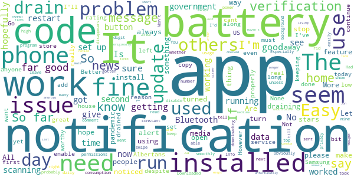

> So far so good  :date: __2020-10-08 14:48:14__

> Helps me as I don't have short term memory.  :date: __2020-10-07 17:08:45__

> None yet. Better to have it and not need it than need it and not have it.  :date: __2020-10-07 04:22:25__

> Good  :date: __2020-10-07 04:06:08__

> Seems to work fine. Unfortunately it is set to "Canada only" so my sister cant install it on her US phone despite living here.  :date: __2020-09-25 03:29:29__

> Battery drainer. The only way to reasonably use the app is to turn it on around others. Otherwise, not a "set it, forget it" solution. The overall function of the app is clearly explained, and is fine to use when needed. No crashes, flawless app persistence.  :date: __2020-09-21 02:23:44__

> It doesn't drain my battery like others say. Not sure why others are having issues...?  :date: __2020-08-17 21:50:04__

> No issues with the app (Samsung Note 9).  :date: __2020-08-10 04:24:28__

> needs an off button holy moly I believed all the battery drain hype, especially since I'm a server at a restaurant I just leave my phone plugged in at the front desk and it's not a problem (heats up a bit tho). when I get home however it's worse because it was charging all day consuming power-at-will. the choice for me is to turn off background activity on the app in the settings when I get home. there's no sense in exchanging keys with my fam 24hrs a day. but I could easily forget it off :/  :date: __2020-07-19 23:06:46__

> I noticed the last 2 days this app has been draining my battery. Use to have 45% left at bedtime, now only 10% at 1 pm. Just did the update, which I didn't know about. So hopefully it fixes this battery issue. (03-Jun-20). UPDATE: After the update the app no longer drained my battery. I noticed a drain on my battery again today (06-Jul-20) and checked for an update, which there was. If you notice your battery being drained, just update the app.  :date: __2020-07-06 16:07:00__

#### 3-star reviews

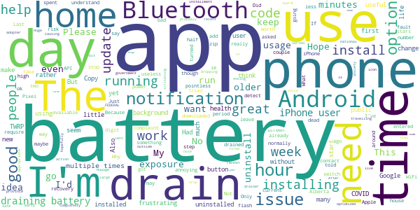

> I have uninstalled this app. I was the early adopter of this app but now that the national app is available, I want to switch over to that one. I have uninstalled it to voice my option and hopefully my Alberta government will see the drop-off installment of this app to take appropriate action.  :date: __2020-11-02 16:52:14__

> Huge drain on battery esp after first installing and after installing a recent update update. After first install it sorted itself out after about a week. Hope it does the same after this update (it is draining my battery completely after a few hours and normally I can go all day without dropping below 40 per cent). Great idea just needs to be optimized a bit more.  :date: __2020-10-08 06:33:13__

> Huuuge battery drainer.  :date: __2020-10-07 15:41:00__

> I'm tired of being asked if I'm ok. Why am I asked multiple times a day? Is it because I'm around or could have contact exposure? Asking me multiple times a day is causing me anxiety.  :date: __2020-10-07 15:17:15__

> App is useless when I am travelling outside of province. Alberta, SWITCH TO THE FEDERAL COVID APP!!!  :date: __2020-10-07 13:28:19__

> It is probably not the apps fault but I live in b.x. now and could never understand it .. stay safe  :date: __2020-10-07 13:11:04__

> It has been a good app for now.  :date: __2020-10-07 05:20:33__

> It's irritating that it has a large notification on my screen all the time to note that it's running, rather than an icon, or the option to just run in the background without that. Worse, it drains my battery, using as much power as almost everything else I run combined. I'd like to use it, but this isn't feasible.  :date: __2020-08-27 01:11:47__

> Extreme battery usage on a Pixel 2. Want to keep it don't know what to do  :date: __2020-08-20 06:30:42__

> Please listen to everyone and make an on/off option. This only needs to be on when we go out in public and will just be an added step such as bringing a mask.  :date: __2020-08-11 05:33:38__

#### 2-star reviews

> Alberta needs to stop fighting with the Federal Government and merge this app with the national app. Which is why this won't run in the background...feds are blocking the ability with Google.  :date: __2020-11-07 04:24:05__

> I appreciate the effort Alberta made to get this out so quickly, but it's time to switch the Federal system which is more reliable, comprehensive, and easier on my battery. Uninstalling as there not enough people using this anyway.  :date: __2020-10-08 04:03:34__

> There hasnt been any action on here  :date: __2020-10-07 17:02:38__

> Horrible app drains battery. Also ineffective. Please create a National app uses Google / Apple API  :date: __2020-10-05 23:15:57__

> How are supposed to trace the virus if the app is not compatible with older Android version .you need to have at least Android version 8 . That's very not smart.  :date: __2020-09-22 20:00:04__

> It's an absolute battery drainer! The intentions are good and the existence of it is important but it's just killing my battery and my phone is brand new.  :date: __2020-08-25 04:21:04__

> The idea behind this is great. But the implementation eats battery like candy. And there's no way to temporarily turn it off. I'd love to be able to turn it off while I'm driving or when I'm backpacking in PLUZ areas no where near another human. So because my phone having battery is more important when I'm in the middle of no where I'm uninstalling.  :date: __2020-08-19 17:33:47__

> This things drains battery real quick  :date: __2020-07-26 18:48:34__

> Takes way too much battery life. 39% over 4 hours....  :date: __2020-07-08 22:16:47__

> Can't connect to car without uninstalling. Ridiculous as it intereferes with other bluetooth so how can I even use it. Can't use it if I need bluetooth.  :date: __2020-07-08 03:36:51__

#### 1-star reviews

> Requires gps access. Unlike the covid alert app that uses the Apple Google framework and enables ble scanning witgout location access this requires full location access. The privacy policy is pages of legalease and its requires a cell phone number and code thus allowing more tracking of you. Frankly a joke written by junior devs and Kenny's "we downloaded a solution" just shows how out of tech touch he is on this problem. Covid alert is tracing... Without government seeing it.  :date: __2020-11-08 06:30:09__

> Jason Kenney, could you please just stop being difficult and implement the Federal app already? This is a complete waste of our taxpayer dollars! Uninstalling...  :date: __2020-11-08 03:15:52__

> Drains battery. I uninstalled in anticipation of federal app being activated in alberta  :date: __2020-11-08 02:45:20__

> If you hate your battery life and privacy, this app is a must have.  :date: __2020-11-07 23:45:41__

> Prepare for your battery to die twice as fast. I had had the federal app installed for quite a while, but after hearing the questionable decision not to integrate with it I chose to install this one. It is currently 3PM and my battery is at 50% despite my phone barely being touched. I believe in contact tracing but I can't be charging my 0home multiple times a day. Also causing issues where other Bluetooth devices can't connect or maintain their connections when they do.  :date: __2020-11-07 23:11:13__

> The fact Kenney is forcing us to keep using this despite the data being useless after two weeks is frustrating and tonedeaf. I'm not changing my review on this, and hope this incompetent colostomy bag of a premier learns a bit of humility and to accept the usage of the federal app. Uninstalled, and I'm not going to follow his lame advice either.  :date: __2020-11-07 22:01:01__

> Terrible app compared to the scope of the federal one. Uninstalled and waiting for AB to adopt the right solution. I want to know if I am exposed to covid from out of province visitors just as much as if exposed by locals.  :date: __2020-11-07 19:50:14__

> Use the federal one, it acctually uses the technology built in the phones!  :date: __2020-11-07 17:57:11__

> This app kills my battery poorly programmed, time to switch to federal, uninstall and wait until brain trusts of this province figure it out and approve the federal app.  :date: __2020-11-07 17:33:18__

> 99.9% identical to the federal app, but less effective because less people use it. You can and should install both apps if you want to be alerted about potential contaminated contact with any travelers who only use the federal app. Devs, pls merge databases already and make this thing useful for everyone. I swear Kenney doesn't have to know; and wouldn't understand anyway.  :date: __2020-11-07 16:21:26__

# Canada COVID-19
App version ``4.12.0``

Analyzed with [covid-apps-observer](http://github.com/covid-apps-observer) project, version ``0.1``

## App overview
| | |
|-------------------------|-------------------------| 
| **Name**&nbsp;&nbsp;&nbsp;&nbsp;&nbsp;&nbsp;&nbsp;&nbsp;&nbsp;&nbsp;&nbsp;&nbsp;&nbsp;&nbsp;&nbsp;&nbsp;&nbsp;&nbsp;&nbsp;&nbsp;&nbsp;&nbsp;&nbsp;&nbsp;&nbsp;&nbsp;&nbsp;&nbsp;&nbsp;&nbsp;&nbsp;&nbsp;&nbsp;&nbsp;&nbsp;&nbsp;&nbsp;&nbsp;&nbsp;&nbsp;  | Canada COVID-19 |
| **Unique identifier** | ca.gc.hcsc.canada.covid19 |
| **Link to Google Play** | [https://play.google.com/store/apps/details?id=ca.gc.hcsc.canada.covid19](https://play.google.com/store/apps/details?id=ca.gc.hcsc.canada.covid19) |
| **Summary**  | Stay informed about COVID-19. Developed in collaboration with Thrive Health. |
| **Privacy policy** | [https://www.thrive.health/covid19-collection-notice](https://www.thrive.health/covid19-collection-notice) |
| **Latest version** | 4.12.0 |
| **Last update** | 2020-10-27 22:51:11 |
| **Recent changes** | We are constantly optimizing our app and adding new features to help support you through COVID-19.  This version includes a number of UI/UX improvements, new content, as well as stability enhancements. |
| **Installs**  | 100,000+ |
| **Category** | Medical |
| **First release** | Mar 30, 2020 |
| **Size**  | 9.1M |
| **Supported Android version**  | 5.0 and up |

### Description
> Canada COVID-19 is designed for you to stay informed about COVID-19 in Canada and determine what actions and next steps you should take.  Recommendations are personalized and based on your personal risk factors.  You will receive timely updates with important news and alerts from Canada’s Ministry of Health.  Recommendations and content are automatically updated based on the latest guidelines related to COVID-19.
 This application has been developed in collaboration with Thrive Health, a Vancouver-based healthcare technology company.  
 SAFETY & SECURITY:
 You will only be asked to provide your age, postal code, and device location.  The data you provide will be combined with all user data and used to inform the provincial COVID-19 response, and to allow you to receive location-based alerts.
 Your data will not be sold. Your data will not be used for any purpose other than health care.
 We follow industry best practices for data security and privacy.  The data you provide is always encrypted and is stored in Canada.

### User interface
The developers of the app provide the following screenshots in the Google play store.
| | | |
|:-------------------------:|:-------------------------:|:-------------------------:|
 |   |  

## Development team
In the following we report the main information provided by the development team in the Google play store.

| | |
|-------------------------|-------------------------|
| **Developer**  | Health Canada | Santé Canada |
| **Website**  | - |
| **Email** | support@thrive.health |
| **Physical address**  | - |
| **Other developed apps**  | [https://play.google.com/store/apps/developer?id=Health+Canada+%7C+Sant%C3%A9+Canada](https://play.google.com/store/apps/developer?id=Health+Canada+%7C+Sant%C3%A9+Canada) |

## Android support

| | |
|-------------------------|-------------------------|
| **Declared target Android version**  | Pie, version 9 (API level 28) |
| **Effective target Android version**  | Pie, version 9 (API level 28) |
| **Minimum supported Android version**  | Lollipop, version 5.0 (API level 21) |
| **Maximum target Android version**  | - |

The larger the difference between the minimum and maximum supported Android versions, the better. A larger difference means a wider audience. For example, old phones have a very low Android version, so a high minimum supported Android version means that the app cannot be used by users with old phones, thus leading to accessibility problems. 

## Requested permissions

In the following we report the complete list of the permissions requested by the app. 

| **Permission** | **Protection level** | **Description** | 
|-------------------------|-------------------------|-------------------------|
 **android.permission ACCESS_COARSE_LOCATION** | :warning:**Dangerous** | Allows an app to access approximate location. 
 **android.permission ACCESS_FINE_LOCATION** | :warning:**Dangerous** | Allows an app to access precise location. 
 **android.permission ACCESS_NETWORK_STATE** | Normal | Allows applications to access information about networks. 
 **android.permission CAMERA** | :warning:**Dangerous** | Required to be able to access the camera device. 
 **android.permission INTERNET** | Normal | Allows applications to open network sockets. 
 **android.permission READ_EXTERNAL_STORAGE** | :warning:**Dangerous** | Allows an application to read from external storage. 
 **android.permission REQUEST_INSTALL_PACKAGES** | Signature | Allows an application to request installing packages. 
 **com.google.android.c2dm.permission RECEIVE** | - | - 
 **com.google.android.finsky.permission BIND_GET_INSTALL_REFERRER_SERVICE** | - | - 

## Mentioned servers

| **Server** | **Registrant** | **Registrant country** | **Creation date** | 
|-------------------------|-------------------------|-------------------------|-------------------------|
 | googlesyndication.com | Google LLC | :us: US | 2003-01-21 06:17:24 |
 | google.com | Google LLC | :us: US | 1997-09-15 04:00:00 |
 | app-measurement.com | Google LLC | :us: US | 2015-06-19 20:13:31 |
 | branch.io | Branch | :us: US | 2011-11-10 13:52:13 |
 | crashlytics.com | Google LLC | :us: US | 2011-01-21 15:30:40 |
 | gstatic.com | Google LLC | :us: US | 2008-02-11 15:31:25 |
 | bnc.lt | - | - | 2016-11-14 00:00:00 |
 | googleapis.com | Google LLC | :us: US | 2005-01-25 17:52:26 |
 | googleadservices.com | Google LLC | :us: US | 2003-06-19 16:34:53 |

## Security analysis 

Below we report the main security warnings raised by our execution of the [Androwarn](https://github.com/maaaaz/androwarn) security analysis tool.

**Location lookup**
> - This application reads location information from all available providers (WiFi, GPS etc.) 

**Connection interfaces exfiltration**
> - This application reads details about the currently active data network 
> - This application tries to find out if the currently active data network is metered 

**Pim data leakage**
> - This application accesses the downloads folder 
> - This application accesses data stored in the clipboard 

## User ratings and reviews

Below we provide information about how end users are reacting to the app in terms of ratings and reviews in the Google Play store.

### Ratings

The Canada COVID-19 app has been installed by more than **100000** times. At this time, **748** rated the app and its average score is **3.82**. Below we show the distribution of the ratings across the usual star-based rating of Google Play

:star::star::star::star::star:: 412

:star::star::star::star:: 97

:star::star::star:: 67

:star::star:: 37

:star:: 135

### Reviews 

#### 5-star reviews

> Very useful and helpful, thanks for introducing this app through out the pandemic  :date: __2020-11-07 00:02:13__

> Get the app. Stay safe.  :date: __2020-10-29 03:27:31__

> Seamless  :date: __2020-10-16 02:54:07__

> Good  :date: __2020-10-13 14:58:43__

> Easy to use and so easy to contribute to public safety. Super!  :date: __2020-10-12 14:09:30__

> It's easy to use .  :date: __2020-10-09 15:43:20__

> I recommend and encourage all Canadians to install this.  :date: __2020-10-02 19:26:48__

> Simple and contributing to success  :date: __2020-09-25 17:09:02__

> The more people who use this the better it gets. I like the app.  :date: __2020-09-24 20:41:02__

> Great app lots of useful information.  :date: __2020-09-19 21:33:55__

#### 4-star reviews

> I think the app is very important and I use it daily to check in. However 14 day isolation for a headache?  :date: __2020-10-30 00:26:24__

> Needs a dark mode.  :date: __2020-09-25 07:43:49__

> In French there are some words misspelled toteaux should be totaux  :date: __2020-09-04 05:41:23__

> Good  :date: __2020-08-30 14:21:55__

> The app doesn't let you know if you come in contact with someone who has C0VID19. This needs improvement. Otherwise it's a good app.  :date: __2020-08-16 08:19:12__

> Its pretty cool but i kinda wish it had it so you can see what are other peoples symptoms are in your area for people using the app.. kinda how snapchat has snap spots in your area. Other then that pretty cool.  :date: __2020-08-02 18:40:50__

> It takes a long time to find link I want but generally a great source.  :date: __2020-07-31 18:10:34__

> This great for your peace of mind  :date: __2020-07-29 21:26:39__

> Very good support and optimal information-sharing through this crisis.  :date: __2020-07-28 22:22:10__

> Good but tracing would make it better  :date: __2020-07-25 19:27:34__

#### 3-star reviews

> Good idea. I've been using it for a while now. On the other hand it tells me I should self-isolate for fourteen days LITERALLY EVERY TIME I self-report - even after a month of "no symptoms". The worst I've ever reported is a mild headache. I don't get it.  :date: __2020-11-05 17:55:23__

> Stupid app wont let me send the daily check in results  :date: __2020-10-08 08:32:50__

> This is not a be all end all app. It has good information. After you submit your symptoms, you lose the bottom menu (Home, Stats, etc). You have to back out to get to this menu. Not easy to exit the app.  :date: __2020-10-05 21:44:01__

> For such a simple app, it sure is slow. You tap an option (such as the check-in option) and you wait 5 seconds before anything happens with no indication that your tap actually registered. And it's not like the next screen has anything complicated that it needs to be "loading" either. It's just text. So what's up?  :date: __2020-10-05 20:06:20__

> It doesn't ask every day to check in like it used to. And it seems to be easily triggered to suggest isolating at almost any symptom. Also, when it asked if I had been tested, or said to isolate even though I was asymptomatic. A few days later the test came back negative. If I had followed the recommendations it gave I'd be home most of the time and constantly being tested. Good idea, poorly executed. I like the media releases though. That's it's saving grace.  :date: __2020-09-29 14:38:34__

> This app tells me every single day with that day's date to self-isolate for 14 days, even though I'm entering NO SYMPTOMS.  :date: __2020-09-26 21:18:16__

> Meh. Not great, maybe of some use to somebody. I had expected more functionality with integrations.  :date: __2020-08-01 04:55:14__

> Pretty dissapointed to find out it didn't include any sort of contact tracing information system, but it's a convenient way to stay informed of COVID-19 nonetheless.  :date: __2020-07-31 18:11:40__

> Well there is no DOT. to put in your temperature. Like 96.9 F do we write 97 F? Or 97.4 F we round it off to 97. This has to be fix. Something as simple as this should not be in the Beta testing phase.  :date: __2020-07-24 20:42:30__

> Basic app. I wish they hooked it to googles contact tracing by bluetooth, that would make it 5 stars for me. And i would be much happier. Its nice to have the numbers that easy to see but i don't think it gets updated often enough  :date: __2020-07-21 05:16:26__

#### 2-star reviews

> [Original Rel review] Unreliable notifications. No app exit stratagy, that's very poor design. Otherwise fine app but becoming very slow to load or change tabs. [2020-10-21 Rel] Still no proper way to exit app. Extremely slow response throughout, even on fiber internet. [2020-10-27 Rel] Workflow error. After submitting daily check-in returning to home tab app thinks daily check-in not done. Exit and reload app check-in noted correctly. Other faults remain.  :date: __2020-11-01 15:11:04__

> I thought this was the tracker app. It isn't and it really isn't useful  :date: __2020-10-07 04:46:06__

> Good  :date: __2020-08-11 04:03:41__

> Pretty useless for the user The app is nothing but a questionnaire that might help Health Canada from volunteer self evaluators, but shows no live data of infection risk around me like the Arogya Setu App from India. Privacy superceded public health.  :date: __2020-08-06 05:42:16__

> Why does it need access to photos?  :date: __2020-08-01 11:55:35__

> Relies on self report instead of anonymized health unit data - very limited usefulness.  :date: __2020-07-31 20:33:48__

> A good start, decent app. Could benefit from adding contact tracing, scientific information, better stats and province-specific information... Make it truly a NATIONAL app to organize the response!  :date: __2020-07-30 02:06:55__

> Very disappointed. No Bluetooth integration. Kind of a fail, not completely but close.  :date: __2020-07-24 18:07:44__

> On the surface the app appears to do what it claims. I will update my review once I've had a chance to inspect the code for myself and do some testing of my own.  :date: __2020-07-05 23:34:48__

> Dont like it  :date: __2020-07-04 07:09:53__

#### 1-star reviews

> terrible  :date: __2020-11-03 01:18:47__

> Absolut joke of an app. Today is Oct 22nd and I wanted to see details under the Stats tab for a more detailed look at local cases. Latest data shown is from September 25th!?!? Really!?! Useless app...uninstalled!  :date: __2020-10-22 22:05:52__

> This is not the app you want. It notified me to post a positive interaction on a wall. I don't want to be notified of any thing that is not a covid exposure by a covid app  :date: __2020-10-10 18:21:58__

> Nothing to rave about I expected at the minimum covid results in my area code is this the app that quebec took months to decide if they would offer it ! Wow if so I am really worried now !!!!!  :date: __2020-10-07 02:03:05__

> There should only be one Health Canada covid app: covid alert I wanted to install the Canadian covid alert app, but installed this one by accident. Covid alert is a useful secure app, this thing seems pretty useless. Maybe health canada should focus on a single covid app, or better: provide covid alert functionality through the covid 19 app.  :date: __2020-10-06 13:05:03__

> Application fails to launch on Galaxy S10 models.  :date: __2020-09-30 20:31:40__

> Drain battery - not worth having  :date: __2020-09-27 02:49:46__

> What if the point of this app? It gives generic information on a wide basis. How can I determine if my specific area is affected. I know the province numbers may be up but that does not address our regional breakdown. I found this app to be completely useless and unnecessary. It would be more useful had it been merged with the covid alert app. Disappointed. As useless as another statue in Ottawa.  :date: __2020-09-23 15:05:58__

> This comes up if you search for Canada Covid app. But it is NOT the alert app - you must add the word Alert to your search. Dumb!!  :date: __2020-09-10 18:26:00__

> A Company called Thrive health is impersonating Health Canada and Google thinks: "yeah, apps impersonating goverment agencies should be totally allowed."  :date: __2020-09-03 17:10:22__

# WHO Info
App version ``3.1.1``

Analyzed with [covid-apps-observer](http://github.com/covid-apps-observer) project, version ``0.1``

## App overview
| | |
|-------------------------|-------------------------| 
| **Name**&nbsp;&nbsp;&nbsp;&nbsp;&nbsp;&nbsp;&nbsp;&nbsp;&nbsp;&nbsp;&nbsp;&nbsp;&nbsp;&nbsp;&nbsp;&nbsp;&nbsp;&nbsp;&nbsp;&nbsp;&nbsp;&nbsp;&nbsp;&nbsp;&nbsp;&nbsp;&nbsp;&nbsp;&nbsp;&nbsp;&nbsp;&nbsp;&nbsp;&nbsp;&nbsp;&nbsp;&nbsp;&nbsp;&nbsp;&nbsp;  | WHO Info |
| **Unique identifier** | org.who.infoapp |
| **Link to Google Play** | [https://play.google.com/store/apps/details?id=org.who.infoapp](https://play.google.com/store/apps/details?id=org.who.infoapp) |
| **Summary**  | The official World Health Organization Information App. |
| **Privacy policy** | [https://www.who.int/about/who-we-are/privacy-policy](https://www.who.int/about/who-we-are/privacy-policy) |
| **Latest version** | 3.1.1 |
| **Last update** | 2020-10-30 13:25:32 |
| **Recent changes** | This release addresses an issue related to Covid-19 case numbers reported to WHO. |
| **Installs**  | 100,000+ |
| **Category** | News & Magazines |
| **First release** | Apr 13, 2020 |
| **Size**  | 11M |
| **Supported Android version**  | 4.2 and up |

### Description
> Have the latest health information at your fingertips with the official World Health Organization Information App. This app displays the latest news, events, features and breaking updates on outbreaks. 
  
 WHO works worldwide to promote health, keep the world safe, and serve the vulnerable. 
 Our goal is to ensure that a billion more people have universal health coverage, to protect a billion more people from health emergencies, and provide a further billion people with better health and well-being.

### User interface
The developers of the app provide the following screenshots in the Google play store.
| | | |
|:-------------------------:|:-------------------------:|:-------------------------:|
 |   |   |   | 
 |   |   |   | 
 |   |   |   | 
 |   |   |   | 
 |   |   |   | 
 |   |   |   | 
 |   |   |   | 
 |   |   |   | 

## Development team
In the following we report the main information provided by the development team in the Google play store.

| | |
|-------------------------|-------------------------|
| **Developer**  | World Health Organization |
| **Website**  | [https://www.who.int/](https://www.who.int/) |
| **Email** | dcx@who.int |
| **Physical address**  | [Avenu Appia 20 1211 Geneva Switzerland](https://www.google.com/maps/search/Avenu%20Appia%2020%201211%20Geneva%20Switzerland) (Google Maps) |
| **Other developed apps**  | [https://play.google.com/store/apps/developer?id=World+Health+Organization](https://play.google.com/store/apps/developer?id=World+Health+Organization) |

## Android support

| | |
|-------------------------|-------------------------|
| **Declared target Android version**  | - |
| **Effective target Android version**  | - |
| **Minimum supported Android version**  | Jelly Bean, version 4.2.x (API level 17) |
| **Maximum target Android version**  | - |

The larger the difference between the minimum and maximum supported Android versions, the better. A larger difference means a wider audience. For example, old phones have a very low Android version, so a high minimum supported Android version means that the app cannot be used by users with old phones, thus leading to accessibility problems. 

## Requested permissions

In the following we report the complete list of the permissions requested by the app. 

| **Permission** | **Protection level** | **Description** | 
|-------------------------|-------------------------|-------------------------|
 **android.permission ACCESS_NETWORK_STATE** | Normal | Allows applications to access information about networks. 
 **android.permission INTERNET** | Normal | Allows applications to open network sockets. 
 **android.permission READ_CALENDAR** | :warning:**Dangerous** | Allows an application to read the user's calendar data. 
 **android.permission READ_EXTERNAL_STORAGE** | :warning:**Dangerous** | Allows an application to read from external storage. 
 **android.permission WAKE_LOCK** | Normal | Allows using PowerManager WakeLocks to keep processor from sleeping or screen from dimming. 
 **android.permission WRITE_CALENDAR** | :warning:**Dangerous** | Allows an application to write the user's calendar data. 
 **android.permission WRITE_EXTERNAL_STORAGE** | :warning:**Dangerous** | Allows an application to write to external storage. 
 **com.google.android.c2dm.permission RECEIVE** | - | - 
 **com.google.android.finsky.permission BIND_GET_INSTALL_REFERRER_SERVICE** | - | - 

## Mentioned servers

| **Server** | **Registrant** | **Registrant country** | **Creation date** | 
|-------------------------|-------------------------|-------------------------|-------------------------|
 | adobe.com | Adobe Inc. | :us: US | 1986-11-17 05:00:00 |
 | googlesyndication.com | Google LLC | :us: US | 2003-01-21 06:17:24 |
 | google.com | Google LLC | :us: US | 1997-09-15 04:00:00 |
 | app-measurement.com | Google LLC | :us: US | 2015-06-19 20:13:31 |
 | googleapis.com | Google LLC | :us: US | 2005-01-25 17:52:26 |
 | googleadservices.com | Google LLC | :us: US | 2003-06-19 16:34:53 |

## Security analysis 

Below we report the main security warnings raised by our execution of the [Androwarn](https://github.com/maaaaz/androwarn) security analysis tool.

**Connection interfaces exfiltration**
> - This application reads details about the currently active data network 
> - This application tries to find out if the currently active data network is metered 

**Suspicious connection establishment**
> - This application opens a Socket and connects it to the remote address 'Lfi/iki/elonen/NanoHTTPD$ResponseException;' on the 'N/A' port  
> - This application opens a Socket and connects it to the remote address 'NanoHttpd Shutdown' on the 'N/A' port  

**Code execution**
> - This application loads a native library: 'NativeScript' 
> - This application executes a UNIX command containing this argument: '2' 

## User ratings and reviews

Below we provide information about how end users are reacting to the app in terms of ratings and reviews in the Google Play store.

### Ratings

The WHO Info app has been installed by more than **100000** times. At this time, **1023** rated the app and its average score is **3.6470587**. Below we show the distribution of the ratings across the usual star-based rating of Google Play

:star::star::star::star::star:: 562

:star::star::star::star:: 90

:star::star::star:: 70

:star::star:: 50

:star:: 251

### Reviews 

#### 5-star reviews

> Always the best one!  :date: __2020-11-04 22:22:46__

> Great app  :date: __2020-11-03 15:50:52__

> Good  :date: __2020-10-31 20:49:42__

> 😊😊😊  :date: __2020-10-21 18:17:56__

> I. AM. BELIVE. W. H. O  :date: __2020-10-04 06:51:53__

> I like to see a update on what's going on please  :date: __2020-09-23 12:20:19__

> First time user, but the app looks helpful.  :date: __2020-09-16 19:17:57__

> I request WHO info App. to send Update on Everything Necessary for Healthier Caring to Evade the light of the Endemic Diesease COVID 19 Exposure. G-Suite Admin.  :date: __2020-09-06 03:01:26__

> Perfect  :date: __2020-08-29 03:21:09__

> More experience  :date: __2020-08-28 20:01:16__

#### 4-star reviews

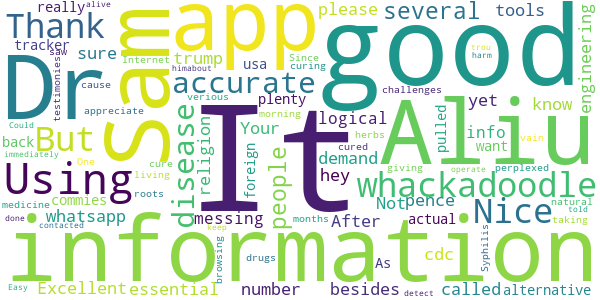

> Not sure yet  :date: __2020-09-27 08:50:53__

> Excellent engineering tools. Your whatsapp number please.  :date: __2020-08-05 11:01:52__

> all the demand who it is hey  :date: __2020-07-20 15:10:48__

> Using this more and more. After the cdc called religion an essential. I don't know what whackadoodle besides trump/pence is messing with the info. Thank you for being a more logical alternative. As usa is being pulled back by whackadoodles and foreign commies.  :date: __2020-07-17 03:09:14__

> Nice  :date: __2020-07-08 17:19:26__

> good  :date: __2020-06-03 00:37:10__

> It's just information, not the actual tracker. But has plenty of information that's 100% accurate.  :date: __2020-05-31 02:37:20__

> I really want to appreciate Dr. Aliu Sam for using his natural roots and herbs medicine to cure me of Syphilis Since 11 months now I have been living with this disease and it has been giving me challenges, I was so perplexed cause I have been taking several drugs to be cured but all have been in vain. One morning I was browsing through the Internet then i saw several testimonies about Dr. Aliu Sam curing people off verious diseases and immediately I contacted Dr. Aliu Sam I told himabout my trou  :date: __2020-05-08 05:33:57__

> It did not detect  :date: __2020-04-29 18:37:26__

> Could do with more accurate information to keep people alive. But no harm done.  :date: __2020-04-29 13:41:12__

#### 3-star reviews

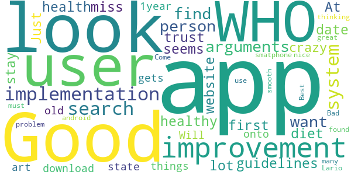

> A good improvement could be the implementation of a search system for arguments that a person want to find ( like the guidelines about health and healthy diet). At first look seems it miss a lot from the website.  :date: __2020-09-27 10:09:16__

> Good App but I don't trust the WHO. Just have the app to stay up to date with the crazy things the WHO gets up to  :date: __2020-07-29 10:34:08__

> Will not download onto my 1year old state of the art smatphone. Bad, as a user of many android apps what are you thinking. I have found more than 3700 other users that can not use this app. Come on you must no you have problem.  :date: __2020-05-26 02:04:59__

> Good  :date: __2020-05-14 21:22:11__

> Best.  :date: __2020-04-20 13:14:33__

> Looks nice great look smooth Lario  :date: __2020-04-18 09:44:30__

#### 2-star reviews

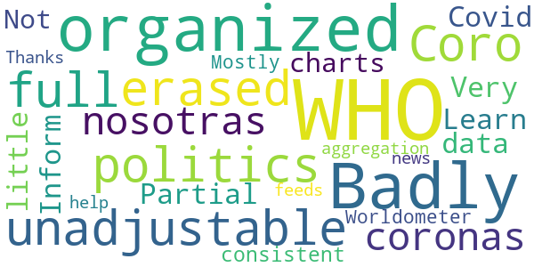

> Coro nosotras coronas  :date: __2020-07-02 06:41:55__

> Partial  :date: __2020-06-22 12:24:23__

> Learn more  :date: __2020-06-15 23:35:50__

> WHO Inform Covid 19  :date: __2020-05-24 17:14:56__

> Very little data or charts. Not consistent with Worldometer. Mostly an aggregation of news feeds about WHO  :date: __2020-05-15 15:38:10__

> Thanks for your help.  :date: __2020-04-22 18:52:40__

#### 1-star reviews

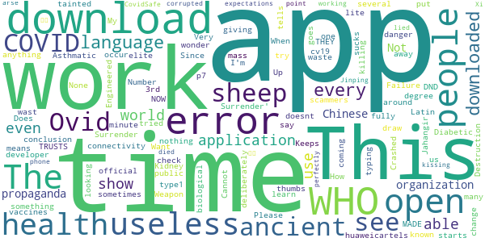

> A wast of time  :date: __2020-11-04 13:04:20__

> “‘Ovid’ is Latin for a sheep. COVID starts with a C, which also means ‘see’ in ancient language. 19 was known as the “Number of Surrender” in ancient times.”  It goes on to draw the conclusion, “C-OVID 19 = ‘See a Sheep Surrender'”.  :date: __2020-11-02 08:06:17__

> Very scammers  :date: __2020-10-19 19:45:47__

> I just downloaded it, but every time I open it just say "an error occur check your connectivity" or something like that... didn't work...  :date: __2020-10-10 17:24:54__

> Does not work  :date: __2020-10-09 00:12:33__

> This is your official application? and sometimes it doesn't work  :date: __2020-10-07 18:26:16__

> I am not able to download it fully its no use to me as i am a type1 Diabetic and Asthmatic i am also in 3rd degree Kidney Failure.  :date: __2020-09-29 02:20:05__

> WHO TRUSTS WHO NOW ¿¿?!?????  :date: __2020-09-25 02:07:50__

> This app sucks  :date: __2020-09-14 21:01:10__

> Every time i open the app,doesnt work just tells us error on my huawei lite p7. Please developer work on it.  :date: __2020-08-18 11:59:51__

# OpenWHO: Knowledge for Health Emergencies
App version ``3.6``

Analyzed with [covid-apps-observer](http://github.com/covid-apps-observer) project, version ``0.1``

## App overview
| | |
|-------------------------|-------------------------| 
| **Name**&nbsp;&nbsp;&nbsp;&nbsp;&nbsp;&nbsp;&nbsp;&nbsp;&nbsp;&nbsp;&nbsp;&nbsp;&nbsp;&nbsp;&nbsp;&nbsp;&nbsp;&nbsp;&nbsp;&nbsp;&nbsp;&nbsp;&nbsp;&nbsp;&nbsp;&nbsp;&nbsp;&nbsp;&nbsp;&nbsp;&nbsp;&nbsp;&nbsp;&nbsp;&nbsp;&nbsp;&nbsp;&nbsp;&nbsp;&nbsp;  | OpenWHO: Knowledge for Health Emergencies |
| **Unique identifier** | de.xikolo.openwho |
| **Link to Google Play** | [https://play.google.com/store/apps/details?id=de.xikolo.openwho](https://play.google.com/store/apps/details?id=de.xikolo.openwho) |
| **Summary**  | Life-saving knowledge for frontline responders in health emergencies. |
| **Privacy policy** | [https://openwho.org/pages/privacy](https://openwho.org/pages/privacy) |
| **Latest version** | 3.6 |
| **Last update** | 2020-10-08 13:10:39 |
| **Recent changes** | - Bug fixes and performance improvements |
| **Installs**  | 1,000,000+ |
| **Category** | Education |
| **First release** | May 17, 2017 |
| **Size**  | 18M |
| **Supported Android version**  | 5.0 and up |

### Description
> OpenWHO is the World Health Organization's (WHO) interactive knowledge-transfer platform offering online courses to improve the response to health emergencies. OpenWHO enables the Organization and its key partners to transfer life-saving knowledge to large numbers of frontline responders.
 With OpenWHO, you have the flexibility to learn at your convenience. Watch the short video lectures and test your knowledge with self-tests when and where you like. The course forum and the collaboration space allow you to get in touch with other participants and experts around the world.
  
 Designed primarily for health care workers, frontline responders, and decision-makers, the app is also a source of information for those affected by disease outbreaks and health emergencies, or for those with a general interest in WHO's work in health emergencies.
  
 It features 6 channels:
 - The <b>Outbreak</b> channel addresses the management of infectious diseases and provides life-saving, scientific information.
 - The <b>Ready for Response</b> channel helps prepare personnel who are training for deployment to work in disease outbreaks and health emergencies.
 - The <b>Get Social</b> channel focuses on social science-based interventions and helps to communicate with affected communities.
 - The <b>Preparing for Pandemics</b> channel brings together courses on various aspects of preparedness, including surveillance, public health measures and risk communication during a pandemic.
 - The <b>COVID-19</b> channel provides learning resources in WHO's 6 official languages (Arabic, Chinese, English, French, Russian and Spanish) for health professionals, decision-makers and the public for the outbreak of coronavirus disease (COVID-19).
 - The <b>COVID-19 National Languages</b> channel provides the same learning resources as the COVID-19 channel but in national languages, such as Indonesian, Japanese and Portuguese. 
  
 OpenWHO courses are available in many languages, including WHO's 6 official languages. 
  
 Download the app now, and join the OpenWHO community.
 This app is developed in cooperation between the Hasso Plattner Institute and the WHO. The learning content is provided exclusively by the WHO.

### User interface
The developers of the app provide the following screenshots in the Google play store.
| | | |
|:-------------------------:|:-------------------------:|:-------------------------:|
 |   |   |   | 
 |   |   |   | 

## Development team
In the following we report the main information provided by the development team in the Google play store.

| | |
|-------------------------|-------------------------|
| **Developer**  | HPI Knowledge Engineering Team |
| **Website**  | [https://openwho.org/](https://openwho.org/) |
| **Email** | openwho-support@hpi.de |
| **Physical address**  | [Prof.-Dr.-Helmert-Str.2-3 14482 Potsdam](https://www.google.com/maps/search/Prof.-Dr.-Helmert-Str.2-3%2014482%20Potsdam) (Google Maps) |
| **Other developed apps**  | [https://play.google.com/store/apps/developer?id=7185448023325736337](https://play.google.com/store/apps/developer?id=7185448023325736337) |

## Android support

| | |
|-------------------------|-------------------------|
| **Declared target Android version**  | - |
| **Effective target Android version**  | - |
| **Minimum supported Android version**  | Lollipop, version 5.0 (API level 21) |
| **Maximum target Android version**  | - |

The larger the difference between the minimum and maximum supported Android versions, the better. A larger difference means a wider audience. For example, old phones have a very low Android version, so a high minimum supported Android version means that the app cannot be used by users with old phones, thus leading to accessibility problems. 

## Requested permissions

In the following we report the complete list of the permissions requested by the app. 

| **Permission** | **Protection level** | **Description** | 
|-------------------------|-------------------------|-------------------------|
 **android.permission ACCESS_NETWORK_STATE** | Normal | Allows applications to access information about networks. 
 **android.permission ACCESS_WIFI_STATE** | Normal | Allows applications to access information about Wi-Fi networks. 
 **android.permission DOWNLOAD_WITHOUT_NOTIFICATION** | - | - 
 **android.permission FOREGROUND_SERVICE** | Normal | Allows a regular application to use Service.startForeground. 
 **android.permission INTERNET** | Normal | Allows applications to open network sockets. 
 **android.permission RECEIVE_BOOT_COMPLETED** | Normal | Allows an application to receive the Intent.ACTION_BOOT_COMPLETED that is broadcast after the system finishes booting. 
 **android.permission WAKE_LOCK** | Normal | Allows using PowerManager WakeLocks to keep processor from sleeping or screen from dimming. 
 **android.permission WRITE_EXTERNAL_STORAGE** | :warning:**Dangerous** | Allows an application to write to external storage. 
 **com.google.android.c2dm.permission RECEIVE** | - | - 
 **com.google.android.finsky.permission BIND_GET_INSTALL_REFERRER_SERVICE** | - | - 

## Mentioned servers

| **Server** | **Registrant** | **Registrant country** | **Creation date** | 
|-------------------------|-------------------------|-------------------------|-------------------------|
 | googlesyndication.com | Google LLC | :us: US | 2003-01-21 06:17:24 |
 | google.com | Google LLC | :us: US | 1997-09-15 04:00:00 |
 | apple.com | Apple Inc. | :us: US | 1987-02-19 05:00:00 |
 | aomedia.org | Contact Privacy Inc. Customer 1243324949 | :canada: CA | 2015-08-24 14:07:31 |
 | dashif.org | VTM Group | :us: US | 2012-04-27 13:02:46 |
 | app-measurement.com | Google LLC | :us: US | 2015-06-19 20:13:31 |
 | w3.org | W3C | :us: US | 1994-07-06 04:00:00 |
 | googleapis.com | Google LLC | :us: US | 2005-01-25 17:52:26 |
 | psdev.de | - | - | - |
 | xmlpull.org | WhoisGuard, Inc. | PA | 2001-11-26 20:33:08 |
 | someurl.com | WhoisGuard, Inc. | PA | 2000-02-08 15:50:35 |
 | crashlytics.com | Google LLC | :us: US | 2011-01-21 15:30:40 |
 | apache.org | The Apache Software Foundation | :us: US | 1995-04-11 04:00:00 |
 | opensource.org | Open Source Initiative | :us: US | 1998-02-11 05:00:00 |
 | creativecommons.org | Creative Commons Corporation | :canada: CA | 2001-01-15 16:51:44 |
 | eclipse.org | Eclipse.org Foundation, Inc. | :canada: CA | 1997-04-14 04:00:00 |
 | gnu.org | Free Software Foundation | :us: US | 1995-11-24 05:00:00 |
 | mozilla.org | Mozilla Corporation | :us: US | 1998-01-24 05:00:00 |
 | googleadservices.com | Google LLC | :us: US | 2003-06-19 16:34:53 |

## Security analysis 

Below we report the main security warnings raised by our execution of the [Androwarn](https://github.com/maaaaz/androwarn) security analysis tool.

**Telephony identifiers leakage**
> - This application reads the ISO country code equivalent of the current registered operator's MCC (Mobile Country Code) 

**Connection interfaces exfiltration**
> - This application reads details about the currently active data network 
> - This application tries to find out if the currently active data network is metered 

**Suspicious connection establishment**
> - This application opens a Socket and connects it to the remote address ' returned no addresses for  ; port is out of range' on the 'N/A' port  
> - This application opens a Socket and connects it to the remote address '' on the 'N/A' port  
> - This application opens a Socket and connects it to the remote address 'Ljava/lang/StringBuilder;->toString()Ljava/lang/String;' on the 'N/A' port  
> - This application opens a Socket and connects it to the remote address 'Ljava/net/Proxy;->type()Ljava/net/Proxy$Type;' on the 'N/A' port  
> - This application opens a Socket and connects it to the remote address 'timeout' on the 'N/A' port  

**Code execution**
> - This application loads a native library 

## User ratings and reviews

Below we provide information about how end users are reacting to the app in terms of ratings and reviews in the Google Play store.

### Ratings

The OpenWHO: Knowledge for Health Emergencies app has been installed by more than **1000000** times. At this time, **3293** rated the app and its average score is **4.2636366**. Below we show the distribution of the ratings across the usual star-based rating of Google Play

:star::star::star::star::star:: 2297

:star::star::star::star:: 359

:star::star::star:: 169

:star::star:: 149

:star:: 319

### Reviews 

#### 5-star reviews

> Good  :date: __2020-11-06 18:32:20__

> Knowledgebase  :date: __2020-11-03 14:05:53__

> thank you so much for app developer  :date: __2020-10-26 06:14:47__

> WHO is really helping the future workers  :date: __2020-10-17 05:46:26__

> Great  :date: __2020-10-16 21:35:14__

> This is really nice and helpful. I really ful to WHO to give us such opportunities to learn many of about health care. And to give us opportunities to learn free and get record of achievement which encourage us to learn more and more.  :date: __2020-10-09 18:45:37__

> It's an incredible app  :date: __2020-10-08 18:52:11__

> I. AM. BELIVE W.H.O  :date: __2020-10-07 07:29:41__

> It's educative  :date: __2020-10-01 11:38:30__

> This app won't open.  :date: __2020-10-01 04:43:02__

#### 4-star reviews

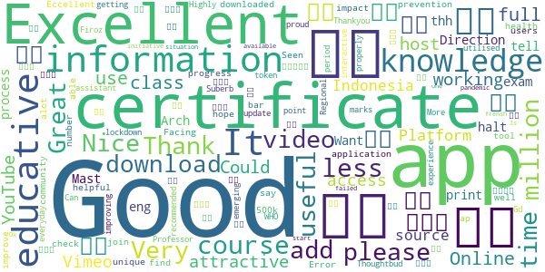

> Online course class is use full  :date: __2020-07-17 11:52:09__

> Excellent information but less attractive for the most  :date: __2020-07-02 17:54:08__

> Good working  :date: __2020-06-28 08:53:05__

> Could you please host the videos also on YouTube, since we cannot access the Vimeo Platform here in Indonesia. Thank you.  :date: __2020-06-24 07:38:57__

> Good source of information  :date: __2020-06-20 09:36:05__

> Excellent Direction~  :date: __2020-06-19 14:08:55__

> Mast  :date: __2020-06-13 09:10:54__

> Good app of thh halt.  :date: __2020-05-31 05:25:43__

> Arch. eng.  :date: __2020-05-22 01:54:14__

> Good  :date: __2020-05-17 08:09:21__

#### 3-star reviews

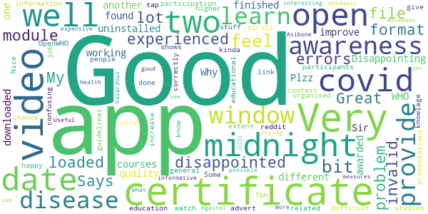

> I feel a bit disappointed, experienced a lot of errors. My module and videos can't be loaded.  :date: __2020-07-26 17:32:06__

> Great app, but my only problem is that I can't open my certificate file. Says invalid format. Disappointing 😭  :date: __2020-07-23 02:09:56__

> Videos were not working only, so I uninstalled it.  :date: __2020-07-18 08:42:28__

> I have finished two courses on two different date(one before midnight, another after midnight) but found same date on both while I downloaded Certificates. Why is this?  :date: __2020-06-11 19:18:50__

> covid  :date: __2020-06-11 18:37:22__

> Sir, Plzz improve the quality of the certificate awarded by the WHO to the participants to increase more & more participation as well as awareness of the people in this contest organised by OpenWHO.  :date: __2020-05-24 16:44:50__

> Some extent it's very good and its provide guidelines to advert disease.  :date: __2020-05-23 18:33:55__

> Nice app however difficult to watch video presentations  :date: __2020-05-14 19:35:42__

> Very confusing. not happy with the link. I don't know if I have done it correctly.  :date: __2020-05-12 22:12:31__

> Tbh this app is kinda like reddit, you can scroll through windows that shows general knowlage, then you can tap into that window for more information. It's a good app to learn about stuff  :date: __2020-05-09 13:39:53__

#### 2-star reviews

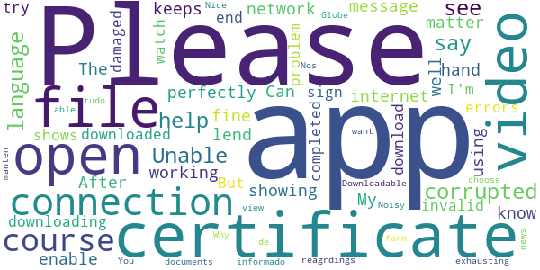

> The app keeps showing me this message (please enable network connection) when I open it, don't know why ?? My internet connection is working fine and I am using all the other apps perfectly well. Can you lend me a hand in this matter.  :date: __2020-11-08 08:31:34__

> After downloading the certificate at the end of the course when u try to open it. It says the file is corrupted or damaged  :date: __2020-09-23 14:26:48__

> Unable to watch the video or download the video.  :date: __2020-08-08 15:29:04__

> I can't open the certificate. Please help me out of this problem  :date: __2020-07-31 05:25:00__

> It shows errors again and again,Can't sign in  :date: __2020-06-26 16:11:53__

> I completed a course and then downloaded certificate it ... But I'm unable too see my certificate as it say corrupted file or invalid file. Please help with reagrdings to it.  :date: __2020-05-27 13:14:22__

> Noisy app.  :date: __2020-04-21 21:34:45__

> Nice  :date: __2020-04-09 16:25:41__

> Please , i want the App in the form of the Globe.  :date: __2020-04-05 14:35:33__

> Nos manten informado de tudo  :date: __2020-03-22 08:51:43__

#### 1-star reviews

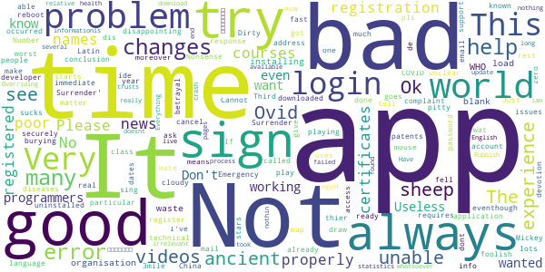

> The videos are not playing eventhough I've downloaded them  :date: __2020-11-03 10:43:38__

> “‘Ovid’ is Latin for a sheep. COVID starts with a C, which also means ‘see’ in ancient language. 19 was known as the “Number of Surrender” in ancient times.”  It goes on to draw the conclusion, “C-OVID 19 = ‘See a Sheep Surrender'”.  :date: __2020-11-02 08:04:58__

> Very bad experience i got unable to login very bad i fell worst experience  :date: __2020-09-26 10:55:02__

> Ok  :date: __2020-08-10 23:31:14__

> This is called an "Emergency" app but requires registration? Very disappointing.  :date: __2020-08-06 20:55:46__

> unable to make account and register, also not able to login.  :date: __2020-08-04 11:59:45__

> I can't Login no matter how much I try.  :date: __2020-07-04 14:19:09__

> This app is having technical issues  :date: __2020-07-03 17:13:33__

> Not a good application....It always changes names in certificates and it changes dates also moreover i have done courses and it changes there names also in certificates...so many problems...now what to do  :date: __2020-07-02 03:49:39__

> Not sign in properly many time errors.. Please help me out of this problem. I already registered a complaint that particular problem through mail.  :date: __2020-06-16 05:10:29__

# Credits

This project makes use of the following main third-party projects:
* Androguard: [https://github.com/androguard/androguard](https://github.com/androguard/androguard)
* Androwarn: [https://github.com/maaaaz/androwarn](https://github.com/maaaaz/androwarn)
* google_play_scraper: [https://github.com/JoMingyu/google-play-scraper](https://github.com/JoMingyu/google-play-scraper)
* whois: [https://github.com/DannyCork/python-whois](https://github.com/DannyCork/python-whois)
* BeautifulSoup: [https://www.crummy.com/software/BeautifulSoup](https://www.crummy.com/software/BeautifulSoup)

Other open-source projects used in this project include: 

- androguard==3.3.5
- appnope==0.1.0
- asn1crypto==1.3.0
- backcall==0.1.0
- beautifulsoup4==4.9.0
- bs4==0.0.1
- certifi==2020.4.5.1
- cffi==1.14.0
- chardet==3.0.4
- click==7.1.2
- colorama==0.4.3
- cryptography==2.9.2
- cycler==0.10.0
- decorator==4.4.2
- future==0.18.2
- google-play-scraper==0.1.1
- idna==2.9
- ipython==7.13.0
- ipython-genutils==0.2.0
- jedi==0.17.0
- Jinja2==2.11.2
- joblib==0.14.1
- kiwisolver==1.2.0
- lxml==4.5.0
- MarkupSafe==1.1.1
- matplotlib==3.2.1
- networkx==2.4
- nltk==3.5
- numpy==1.18.3
- parso==0.7.0
- pexpect==4.8.0
- pickleshare==0.7.5
- Pillow==7.1.2
- play-scraper==0.6.0
- prompt-toolkit==3.0.5
- ptyprocess==0.6.0
- pycountry==19.8.18
- pycparser==2.20
- pydot==1.4.1
- Pygments==2.6.1
- pyOpenSSL==19.1.0
- pyparsing==2.4.7
- python-dateutil==2.8.1
- regex==2020.4.4
- requests==2.23.0
- requests-futures==1.0.0
- six==1.14.0
- soupsieve==2.0
- tld==0.12.1
- tqdm==4.45.0
- traitlets==4.3.3
- urllib3==1.25.9
- wcwidth==0.1.9
- wordcloud==1.7.0

