# COVID-related Android apps in Canada

Author: `Ivano Malavolta` (ivanomalavolta@gmail.com)

Created at: `2020/5/10`

Report generated by the [covid-apps-observer](http://github.com/covid-apps-observer) project, version 0.1

# Table of contents 

- [Background](#background)
    * [Data sources and analyses](#data-sources-and-analyses)
        * [App metadata](#app-metadata)
        * [Requested permissions](#requested-permissions)
        * [Mentioned servers](#mentioned_servers)
        * [Security analysis](#security_analysis)
        * [User ratings and reviews](#user-ratings-and-reviews)
    * [Disclaimer](#disclaimer)
- [BC COVID-19 Support](#bc-covid-19-support)
- [ABTraceTogether](#abtracetogether)
- [Canada COVID-19](#canada-covid-19)
- [WHO Info](#who-info)
- [OpenWHO: Knowledge for Health Emergencies](#openwho-knowledge-for-health-emergencies)

- [Credits](#credits)

# How to read this report

This report has been generated by the [covid-apps-observer](http://github.com/covid-apps-observer) project. The project automatically analyzes the apps by extracting information which is already publicly available either on the web or in the apps binary files. 

Our analysis covers the following apps:
| | |
|-------------------------|-------------------------| 
|  | BC COVID-19 Support
|  | ABTraceTogether
|  | Canada COVID-19
|  | WHO Info
|  | OpenWHO: Knowledge for Health Emergencies

The details of our analysis are presented in the remainder of this report.

For independent verification, the raw data and the source code of the project is publicly available in its GitHub repository [http://github.com/covid-apps-observer](http://github.com/covid-apps-observer) and its source code has been thoroughly commented in order to provide all the details about how the information provided in this report has been extracted. 

Any feedback, questions, and improvements about the project are very welcome, feel free to create an issue or pull request directly in its GitHub repository: [http://github.com/covid-apps-observer](http://github.com/covid-apps-observer).

## Data sources and analyses

The analysis of each app is structured around five main dimensions: 
* App metadata  
* Requested permissions
* Mentioned servers
* Androwarn analysis
* User ratings and reviews

In the following we describe the data sources and analysis performed for each dimension.

### App metadata

App metadata includes an overview of the main information about the app (for example, its name, releases, privacy policy, etc.), contact information of the development team, and the various Android versions supported by the app. This information is extracted from two main data sources:
* _Google Play store_: we automatically mined the web page of the Google Play store showing the basic information about the app and we parsed it in order to extract information about the app and development team 
* _Android Manifest file_: in our analysis we decompiled the binary file of the app (it is similar to a Zip archive but it contains the code of the app instead of normal files) and we extracted information about the supported Android versions, as it has been listed by its development team.

The extracted app metadata feeds the _App overview_, _Development team_, and _Android support_ sections of this report.
We make use of the [google-play-scraper](https://github.com/JoMingyu/google-play-scraper) tool for extracting the raw data related to this dimension of the project.

### Requested permissions

The Android operating system has a permission model which allows users to grant access to potentially privacy-related information. Every Android app has to explictly declare the permissions it needs to properly function in the Android Manifest file.  

In this report we also show the protection level of each permission, which is a key information for understanding how the requested permissions related to the user's privacy. We carefully analyzed the [official Android documentation (v. 29)](https://developer.android.com/reference/android/Manifest.permission), and it resulted that a permission requested by an Android app can belong to the following protection levels:
* **Dangerous**: higher-risk permissions that would give a requesting app access to private user data or control over the device that can negatively impact the user. Because this type of permission introduces potential risk, the system usually does not automatically grant it to the requesting app. For example, any dangerous permissions requested by an app may be displayed to the user and require confirmation before proceeding.
* **Normal**: this is the default and most common level in Android; normal permissions are lower-risk and give access to isolated app-level features, with minimal risk to other apps, the system, or the user. 
* **Signature**: permissions granted only if the requesting app is signed with the same certificate as the app that declared the permission
* **Appop**: old permission level, a reminiscence of the App Ops tool that Google introduced in Android 4.3.
* **Development**: optional permissions which can be granted to development-oriented apps.
* **Privileged**: permissions who give higher power to mobile apps w.r.t. other apps, such as binding to incoming calls, interacting via bluetooth with other devices without user interaction, etc.
* **Preinstalled**: reserved only for preinstalled apps
* **Installer**: allow the holder to start the permission usage screen for an app
* **RetailDemo**: permissions related to devices used in demonstrations in shops.
* **Pre23**: permissions automatically granted to apps targeting devices running pre-6.0 Android.
* **Upcoming**: permissions which will be released in the next version of the Android platform. 
* **Deprecated**: permissions belonging to old releases of the Android platform, they should not be used by developers since they will not be supported in the near future.
* **Not for use by third-party applications**: permissions which can be requested only by apps developed by Google.
* **Undefined**: this protection level is not documented by Google.

The permissions dimension of this project is based on the [Androguard](https://github.com/androguard/androguard) static analysis tool.

### Mentioned servers

We decompiled each app in order to look for all possible mentions of remote URLs. The mentioned URLs can refer to remote servers the the app is using for either sending or receiving information, web addresses for directing the user to an information website, and so on. 

:warning: It is important to note that this analysis is not meant to be complete and it is very prone to obfuscation. The servers reported here are simply _mentioned_ somewhere in the code of the app and are meant to just give an indication about the "hooks" of the app towards external resources. For example, for an Android app it is normal to contact Google services in order to send/receive push notifications, or to contact the servers of analytics services for having real-time diagnostics about crashes of the app or bugs.

This part of the analysis is based on the [Androguard](https://github.com/androguard/androguard) static analysis tool for identfying the raw URLs mentioned in the app; then, the information about each mentioned server is collected by performing a _whois_ lookup on the first-level domain present in the URL.

### Security analysis

This dimension is based on the [Androwarn](https://github.com/maaaaz/androwarn) structural and data flow analysis of Android bytecode. Androwarn is developed by the University of Lyon/INSA (France) and it has been used in several academic studies. According to its documentation, Androwarn targets the following categories of potential security issues:
* **Telephony identifiers exfiltration**: IMEI, IMSI, MCC, MNC, LAC, CID, operator's name, etc.
* **Device settings exfiltration**: software version, usage statistics, system settings, logs, etc.
* **Geolocation information leakage**: GPS/WiFi geolocation, etc.
* **Connection interfaces information exfiltration**: WiFi credentials, Bluetooth MAC adress, etc.
* **Telephony services abuse**: premium SMS sending, phone call composition, etc.
* **Audio/video flow interception**: call recording, video capture, etc.
* **Remote connection establishment**: socket open call, Bluetooth pairing, APN settings edit, etc.
* **PIM data leakage**: contacts, calendar, SMS, mails, clipboard, etc.
* **External memory operations**: file access on SD card, etc.
* **PIM data modification**: add/delete contacts, calendar events, etc.
* **Arbitrary code execution**: native code using JNI, UNIX command, privilege escalation, etc.
* **Denial of Service**: event notification deactivation, file deletion, process killing, virtual keyboard disable, terminal shutdown/reboot, etc.

Note: We do not consider this data point in the current version of our analyzers since it is too verbose for our purposes.

:warning: It is important to note that Androwarn is a static analysis tool, and as such it performs a variety of heuristics and approximations in its analyses. Said that, the results shown in this report are meant to provide an indication of _potential_ security issues and should be by no means treated as complete and correct.   

### User ratings and reviews

For this dimension we turn again to the web interface of the Google Play store. Firstly, we automatically mine summary statistics about user ratings from the web page of the app under analysis; then, we automatically download the newest 1000 reviews of the app under analysis. For each level of rating (5 stars, 4 stars, , etc., 1 star) we show:
- a word cloud presenting the main terms used by end users in their reviews in the Google Play store
- the last 10 reviews provided by app users in the Google Play store. 

This purposefully simple analysis is meant to help both future users and the development team of the app in understanding what are the main positive and negative points of the app under analysis.

We make use of the [google-play-scraper](https://github.com/JoMingyu/google-play-scraper) tool for extracting the raw data related to this dimension of the project.

## Disclaimer 

This report has been produced independently of any parties and its only objective is to help anybody in better understanding how COVID-related apps work in practice (and compare to each other). The results of this report are limited to the specific version of the software used for running the analyses and on the various heuristics implemented in there. In other words, the results of the analyzers may differ depending on the time and modalities in which they are executed. We do not guarantee that the results of the analyses and the corresponding contents of this report are fully complete or correct. The analysis software is licensed under the [MIT License](https://github.com/iivanoo/covid-apps-observer/blob/master/LICENSE).

# BC COVID-19 Support
App version ``1.16.0``

Analyzed with [covid-apps-observer](http://github.com/covid-apps-observer) project, version ``0.1``

## App overview
| | |
|-------------------------|-------------------------| 
| **Name**&nbsp;&nbsp;&nbsp;&nbsp;&nbsp;&nbsp;&nbsp;&nbsp;&nbsp;&nbsp;&nbsp;&nbsp;&nbsp;&nbsp;&nbsp;&nbsp;&nbsp;&nbsp;&nbsp;&nbsp;&nbsp;&nbsp;&nbsp;&nbsp;&nbsp;&nbsp;&nbsp;&nbsp;&nbsp;&nbsp;&nbsp;&nbsp;&nbsp;&nbsp;&nbsp;&nbsp;&nbsp;&nbsp;&nbsp;&nbsp;  | BC COVID-19 Support |
| **Unique identifier** | ca.bc.gov.health.hlbc.COVID19 |
| **Link to Google Play** | [https://play.google.com/store/apps/details?id=ca.bc.gov.health.hlbc.COVID19](https://play.google.com/store/apps/details?id=ca.bc.gov.health.hlbc.COVID19) |
| **Summary**  | Stay informed about COVID-19 in BC and determine what actions you should take. |
| **Privacy policy** | [https://www.thrive.health/foippa](https://www.thrive.health/foippa) |
| **Latest version** | 1.16.0 |
| **Last update** | 2020-05-09 07:12:31 |
| **Recent changes** | We are constantly optimizing our app and adding new features to help support you through COVID-19.  This version includes a number of UI/UX improvements, new content, as well as stability enhancements. |
| **Installs**  | 10,000+ |
| **Category** | Medical |
| **First release** | Mar 21, 2020 |
| **Size**  | 8.1M |
| **Supported Android version**  | 5.0 and up |

### Description
> If you are a resident of British Columbia, Canada, BC COVID-19 Support is designed for you to stay informed about COVID-19 in BC and determine what actions and next steps you should take.  Recommendations are personalized and based on your personal risk factors.  You will receive timely updates with important news and alerts from BC’s Ministry of Health.  Recommendations and content are automatically updated based on the latest BC guidelines related to COVID-19.
 This application has been developed in collaboration with Thrive Health, a Vancouver-based healthcare technology company.  
 SAFETY & SECURITY:
 You will only be asked to provide your age, postal code, and device location.  The data you provide will be combined with all user data and used to inform the provincial COVID-19 response, and to allow you to receive location-based alerts.
 Your data will not be sold. Your data will not be used for any purpose other than health care.
 We follow industry best practices for data security and privacy.  The data you provide is always encrypted and is stored in Canada.

### User interface
The developers of the app provide the following screenshots in the Google play store.
| | | |
|:-------------------------:|:-------------------------:|:-------------------------:|
 |   |  

## Development team
In the following we report the main information provided by the development team in the Google play store.

| | |
|-------------------------|-------------------------|
| **Developer**  | Province of British Columbia, Canada |
| **Website**  | - |
| **Email** | support@thrive.health |
| **Physical address**  | - |
| **Other developed apps**  | [https://play.google.com/store/apps/developer?id=Province+of+British+Columbia,+Canada](https://play.google.com/store/apps/developer?id=Province+of+British+Columbia,+Canada) |

## Android support

| | |
|-------------------------|-------------------------|
| **Declared target Android version**  | Pie, version 9 (API level 28) |
| **Effective target Android version**  | Pie, version 9 (API level 28) |
| **Minimum supported Android version**  | Lollipop, version 5.0 (API level 21) |
| **Maximum target Android version**  | - |

The larger the difference between the minimum and maximum supported Android versions, the better. A larger difference means a wider audience. For example, old phones have a very low Android version, so a high minimum supported Android version means that the app cannot be used by users with old phones, thus leading to accessibility problems. 

## Requested permissions

In the following we report the complete list of the permissions requested by the app. 

| **Permission** | **Protection level** | **Description** | 
|-------------------------|-------------------------|-------------------------|
 **android.permission ACCESS_COARSE_LOCATION** | :warning:**Dangerous** | Allows an app to access approximate location. 
 **android.permission ACCESS_FINE_LOCATION** | :warning:**Dangerous** | Allows an app to access precise location. 
 **android.permission ACCESS_NETWORK_STATE** | Normal | Allows applications to access information about networks. 
 **android.permission INTERNET** | Normal | Allows applications to open network sockets. 
 **com.google.android.c2dm.permission RECEIVE** | - | - 
 **com.google.android.finsky.permission BIND_GET_INSTALL_REFERRER_SERVICE** | - | - 

## Mentioned servers

| **Server** | **Registrant** | **Registrant country** | **Creation date** | 
|-------------------------|-------------------------|-------------------------|-------------------------|
 | googlesyndication.com | Google LLC | :us: US | 2003-01-21 06:17:24 |
 | google.com | Google LLC | :us: US | 1997-09-15 04:00:00 |
 | app-measurement.com | Google LLC | :us: US | 2015-06-19 20:13:31 |
 | branch.io | Branch | :us: US | 2011-11-10 13:52:13 |
 | crashlytics.com | Google LLC | :us: US | 2011-01-21 15:30:40 |
 | gstatic.com | Google LLC | :us: US | 2008-02-11 15:31:25 |
 | bnc.lt | - | - | 2016-11-14 00:00:00 |
 | googleapis.com | Google LLC | :us: US | 2005-01-25 17:52:26 |
 | googleadservices.com | Google LLC | :us: US | 2003-06-19 16:34:53 |

## Security analysis 

Below we report the main security warnings raised by our execution of the [Androwarn](https://github.com/maaaaz/androwarn) security analysis tool.

**Location lookup**
> - This application reads location information from all available providers (WiFi, GPS etc.) 

**Connection interfaces exfiltration**
> - This application reads details about the currently active data network 
> - This application tries to find out if the currently active data network is metered 

**Pim data leakage**
> - This application accesses the downloads folder 
> - This application accesses data stored in the clipboard 

## User ratings and reviews

Below we provide information about how end users are reacting to the app in terms of ratings and reviews in the Google Play store.

### Ratings

The BC COVID-19 Support app has been installed by more than **10000** times. At this time, **127** rated the app and its average score is **4.26**. Below we show the distribution of the ratings across the usual star-based rating of Google Play

:star::star::star::star::star:: 80

:star::star::star::star:: 25

:star::star::star:: 8

:star::star:: 0

:star:: 12

### Reviews 

#### 5-star reviews

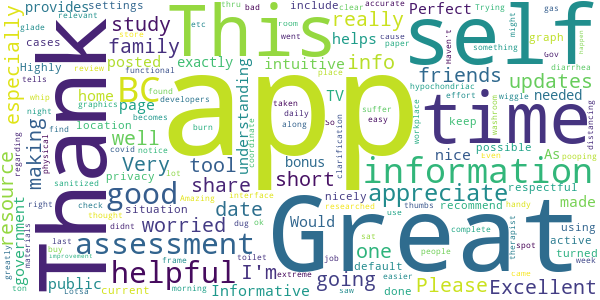

> Perfect  :date: __2020-04-28 11:09:46__

> Informative!  :date: __2020-04-25 04:26:38__

> This app helps with understanding what to do, what is going on, and what the government is doing.  :date: __2020-04-25 02:28:31__

> Would be nice if date/time of public TV updates posted on home page.  :date: __2020-04-24 23:34:19__

> Great  :date: __2020-04-24 03:48:09__

> Very well made, intuitive, and provides exactly the information needed during this time. As a bonus, the app is very respectful of privacy settings, and has location turned off by default. Highly recommend using this app to keep up to date with the current situation in BC.  :date: __2020-04-16 12:46:31__

> This app is very nicely done  :date: __2020-04-07 17:37:19__

> Thank you for this app. Please include a graph of active cases in BC, if possible. Thanks.  :date: __2020-04-05 16:21:41__

> I'm a hypochondriac, or so my therapist tells me. This app is great for me, I just had some bad gas last night and thought it might be covid-19, i researched and saw that some people get diarrhea which really worried me cause i didnt buy a ton of toilet paper. So i sat in my study until 3 am worried I was going to suffer from extreme pooping I was just glade I had my study washroom sanitized in the morning. I found this app dug right into it, went thru the self assessment and I'm ok. Thanks.  :date: __2020-04-05 01:06:59__

> Good information  :date: __2020-04-03 15:12:53__

#### 4-star reviews

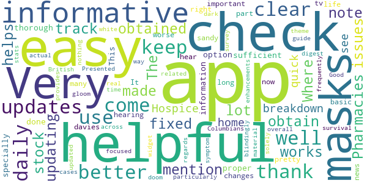

> I note that no mention is made as to where and how to obtain masks. Pharmacies are out of stock. Where can masks be obtained?  :date: __2020-04-27 00:16:56__

> Very helpful and informative.  :date: __2020-04-25 00:50:33__

> The updates are now fixed and the app works well, thank you for updating, this helps track a lot of issues in the Hospice home I would also like to see a better breakdown of the daily check up a quick check up and a thorough check up option would be very sufficient but very well done app specially for proper information  :date: __2020-04-13 20:17:45__

> This important part of life right now, I like to hear of many changes that I come in to hearing for better or worse Thanks sandy davies  :date: __2020-04-08 23:01:32__

> It's pretty easy and basic didn't keep it for long I just keep the news on tv  :date: __2020-04-07 02:48:49__

> Very helpful and informative particularly for British Columbians. Presented in a way that is clear and easy to digest. A "survival guide" that doesn't come across as all doom and gloom. Daily stats could be updated more frequently but overall very helpful.  :date: __2020-04-07 00:36:59__

> Good app, but could use some enhancements such as a dark theme (app is blindingly white) and a widget that provides updates on cases in real time. Also, app survey is focused solely on symptom related material and nothing in regards to the actual app...  :date: __2020-04-05 23:00:40__

> Clear and easy to use  :date: __2020-03-24 05:10:56__

#### 3-star reviews

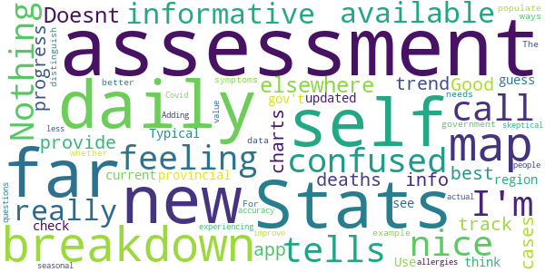

> Stats are nice but the self assessment tells me to call 911 if I'm feeling confused.  :date: __2020-05-05 06:05:32__

> Nothing really new or informative that is not available elsewhere.  :date: __2020-04-24 18:19:05__

> Doesnt provide the best charts to track trend/progress....new cases and deaths daily  :date: __2020-04-10 07:06:36__

> Good info so far, but the app is not updated daily with current stats. Typical gov't I guess.  :date: __2020-04-04 17:07:08__

> I like it so far. I think we should see a provincial breakdown map by region. Use the self-check and government data to populate the map.  :date: __2020-03-27 06:58:15__

> The assessment needs a better breakdown of symptoms. For example there are ways to distinguish between whether you are just experiencing seasonal allergies or actual Covid 19. Adding a few more questions would improve the value of the assessment and people will be less skeptical of its accuracy.  :date: __2020-03-24 21:21:54__

#### 2-star reviews

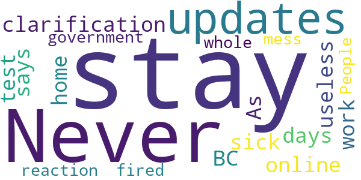

> Never any updates, no clarification of who should stay off work, and an online test that only says stay at home for 10 days if you're sick. As useless as the BC government's reaction to the whole mess. People should be fired.  :date: __2020-03-24 20:35:26__

#### 1-star reviews

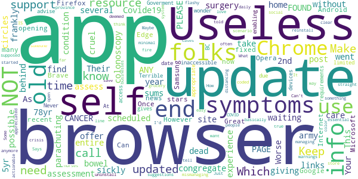

> Worse than useless. This self-assessment app went in circles without giving me ANY symptoms info. As 78yr old with a 5yr bowel condition waiting now for over a year in a congregate care home for a scheduled post-surgery 2nd colonoscopy behind a parachuting army of folks with possible CANCER and now Covide19, I find the several dead-end links you offer to old or sickly folks to self-assess, frankly, cruel. Their end sums up my entire site experience: "PAGE NOT FOUND. PLEASE take it down.  :date: __2020-04-25 14:04:20__

> Your app keeps opening Google Chrome for news updates. However, I don't use this browser. Can you update the app to support any browser? Android has Firefox, Samsung Internet, Microsoft Edge, Opera, Brave, and many more - you need to support more than just Chrome. Once this is fixed, the app will get 5 stars!  :date: __2020-04-14 03:36:27__

> Great resource until recent update...now inaccessible on our devices. At a time when you we should be enabling access to appropriate info the app is now limited to due to browser requirements.  :date: __2020-04-07 21:44:05__

> Terrible app. Never gets updated and gives out of date advise. Makes you wonder what else the BC Goverment is mismanaging during the COVID crisis.  :date: __2020-04-03 04:30:17__

> Can't use it anymore. Says browser needs to be updated (not true as far as I can tell)  :date: __2020-04-01 01:43:55__

> Useless!  :date: __2020-03-29 17:02:48__

> Keep having to uninstall and reinstall  :date: __2020-03-29 07:38:58__

> Useless  :date: __2020-03-28 22:47:40__

> Some very minimal resources and suggestions for managing symptoms. A flashy way to be told to call the nurses line, for basically any scenario. Just call 811 and save your time.  :date: __2020-03-28 05:25:51__

> I'd love something that started with a daily update straight from the province. Maybe a color coded system like fire warnings that is clear and actionable. What IS social distancing? Which businesses are supposed to be open? Which are deemed essential? How often should someone be at a grocery store? Make this easy.  :date: __2020-03-25 07:31:11__

# ABTraceTogether
App version ``1.0.1``

Analyzed with [covid-apps-observer](http://github.com/covid-apps-observer) project, version ``0.1``

## App overview
| | |
|-------------------------|-------------------------| 
| **Name**&nbsp;&nbsp;&nbsp;&nbsp;&nbsp;&nbsp;&nbsp;&nbsp;&nbsp;&nbsp;&nbsp;&nbsp;&nbsp;&nbsp;&nbsp;&nbsp;&nbsp;&nbsp;&nbsp;&nbsp;&nbsp;&nbsp;&nbsp;&nbsp;&nbsp;&nbsp;&nbsp;&nbsp;&nbsp;&nbsp;&nbsp;&nbsp;&nbsp;&nbsp;&nbsp;&nbsp;&nbsp;&nbsp;&nbsp;&nbsp;  | ABTraceTogether |
| **Unique identifier** | ca.albertahealthservices.contacttracing |
| **Link to Google Play** | [https://play.google.com/store/apps/details?id=ca.albertahealthservices.contacttracing](https://play.google.com/store/apps/details?id=ca.albertahealthservices.contacttracing) |
| **Summary**  | This app is from the Government of Alberta to augment manual contact tracing. |
| **Privacy policy** | [https://alberta.ca/ABTraceTogetherPrivacy](https://alberta.ca/ABTraceTogetherPrivacy) |
| **Latest version** | 1.0.1 |
| **Last update** | 2020-05-08 00:24:36 |
| **Recent changes** | We’re always updating the ABTraceTogether App to be the best tracing tool.  We love customer feedback! If you have any thoughts, ideas or feedback to share, please contact us at ABTraceTogetherSupport@gov.ab.ca  This version includes: - Enhanced upload data flow to help ensure data logs are only uploaded when a user is contacted by a contact tracer - Minor UI enhancements - Updates to avoid users experiencing crashes during registration |
| **Installs**  | 10,000+ |
| **Category** | Health & Fitness |
| **First release** | Apr 30, 2020 |
| **Size**  | 9.7M |
| **Supported Android version**  | 8.0 and up |

### Description
> This app is being brought to you by the Government of Alberta.
 This app is intended for ages 14+.
 Some of the key benefits of this app are to:
 • Augment our current contact tracing efforts to provide guidance and care to those who are or may be infected
 • Help keep Albertans safe by limiting the spread of COVID-19 through more individuals self-isolating earlier
 The app is most effective if it reaches a strong penetration of usage among Albertans, which means the more people that use the app, the better the app works.
 Once a user registers their phone number with the app, the app uses bluetooth to log contact with other individuals who have the app when that contact is within approximately 2 meters. If a user tests positive for COVID-19, they will be contacted by an Alberta Health Service Contact Tracer, and asked to voluntarily upload their data to Alberta Health Services so that anyone the user came into close contact with over the previous 14 days can be notified.
 Geolocation data is not collected by the app or by Alberta Health Services. The Bluetooth exchange ID log data collected is stored locally in your phone in an encrypted form. This data will not be accessed by Alberta Health Services unless and until you choose to upload it as a result of being diagnosed with COVID-19. Mobile numbers or any other personal information are not revealed to other app users.
 Personal Information collected:
 - Phone number
 Permissions required:
 - Bluetooth enabled
 - Location 
 - Push notifications
 Copyright 2020 Government of Alberta

### User interface
The developers of the app provide the following screenshots in the Google play store.
| | | |
|:-------------------------:|:-------------------------:|:-------------------------:|
 |   |   |   | 

## Development team
In the following we report the main information provided by the development team in the Google play store.

| | |
|-------------------------|-------------------------|
| **Developer**  | Government of the Province of Alberta |
| **Website**  | [http://alberta.ca/ABTraceTogether](http://alberta.ca/ABTraceTogether) |
| **Email** | ABTraceTogetherSupport@gov.ab.ca |
| **Physical address**  | [3720 - 76 Avenue Edmonton, AB T6B 2N9](https://www.google.com/maps/search/3720%20-%2076%20Avenue%20Edmonton,%20AB%20T6B%202N9) (Google Maps) |
| **Other developed apps**  | [https://play.google.com/store/apps/developer?id=Government+of+the+Province+of+Alberta](https://play.google.com/store/apps/developer?id=Government+of+the+Province+of+Alberta) |

## Android support

| | |
|-------------------------|-------------------------|
| **Declared target Android version**  | Android10, version 10 (API level 29) |
| **Effective target Android version**  | Android10, version 10 (API level 29) |
| **Minimum supported Android version**  | Oreo, version 8.0.0 (API level 26) |
| **Maximum target Android version**  | - |

The larger the difference between the minimum and maximum supported Android versions, the better. A larger difference means a wider audience. For example, old phones have a very low Android version, so a high minimum supported Android version means that the app cannot be used by users with old phones, thus leading to accessibility problems. 

## Requested permissions

In the following we report the complete list of the permissions requested by the app. 

| **Permission** | **Protection level** | **Description** | 
|-------------------------|-------------------------|-------------------------|
 **android.permission ACCESS_BACKGROUND_LOCATION** | :warning:**Dangerous** | Allows an app to access location in the background. 
 **android.permission ACCESS_FINE_LOCATION** | :warning:**Dangerous** | Allows an app to access precise location. 
 **android.permission ACCESS_WIFI_STATE** | Normal | Allows applications to access information about Wi-Fi networks. 
 **android.permission BLUETOOTH** | Normal | Allows applications to connect to paired bluetooth devices. 
 **android.permission BLUETOOTH_ADMIN** | Normal | Allows applications to discover and pair bluetooth devices. 
 **android.permission FOREGROUND_SERVICE** | Normal | Allows a regular application to use Service.startForeground. 
 **android.permission INTERNET** | Normal | Allows applications to open network sockets. 
 **android.permission RECEIVE_BOOT_COMPLETED** | Normal | Allows an application to receive the Intent.ACTION_BOOT_COMPLETED that is broadcast after the system finishes booting. 
 **android.permission REQUEST_IGNORE_BATTERY_OPTIMIZATIONS** | Normal | Permission an application must hold in order to use Settings.ACTION_REQUEST_IGNORE_BATTERY_OPTIMIZATIONS. 

## Mentioned servers

| **Server** | **Registrant** | **Registrant country** | **Creation date** | 
|-------------------------|-------------------------|-------------------------|-------------------------|
 | stackoverflow.com | Stack Exchange, Inc. | :us: US | 2003-12-26 19:18:07 |
 | google.com | Google LLC | :us: US | 1997-09-15 04:00:00 |

## Security analysis 

Below we report the main security warnings raised by our execution of the [Androwarn](https://github.com/maaaaz/androwarn) security analysis tool.

**Telephony identifiers leakage**
> - This application reads the unique device ID, i.e the IMEI for GSM and the MEID or ESN for CDMA phones 

**Connection interfaces exfiltration**
> - This application reads details about the currently active data network 
> - This application tries to find out if the currently active data network is metered 

**Suspicious connection establishment**
> - This application opens a Socket and connects it to the remote address '' on the 'N/A' port  
> - This application opens a Socket and connects it to the remote address 'Ljava/lang/StringBuilder;->toString()Ljava/lang/String;' on the ': connect, resolve' port  
> - This application opens a Socket and connects it to the remote address 'Ljava/lang/StringBuilder;->toString()Ljava/lang/String;' on the 'N/A' port  
> - This application opens a Socket and connects it to the remote address 'Ljava/net/Proxy;->type()Ljava/net/Proxy$Type;' on the 'N/A' port  
> - This application opens a Socket and connects it to the remote address 'timeout' on the 'N/A' port  

**Code execution**
> - This application loads a native library: 'authjni' 
> - This application loads a native library: 'crypto' 
> - This application loads a native library: 'uvpn' 

## User ratings and reviews

Below we provide information about how end users are reacting to the app in terms of ratings and reviews in the Google Play store.

### Ratings

The ABTraceTogether app has been installed by more than **10000** times. At this time, **320** rated the app and its average score is **3.3**. Below we show the distribution of the ratings across the usual star-based rating of Google Play

:star::star::star::star::star:: 134

:star::star::star::star:: 32

:star::star::star:: 28

:star::star:: 44

:star:: 80

### Reviews 

#### 5-star reviews

> Contact tracing using technology is an obvious and effective way to fight the covid-19 crisis. Well done!  :date: __2020-05-09 07:37:24__

> Thank you all for your service!!!  :date: __2020-05-09 00:57:11__

> I havent experienced any problems or crashings, during registration. So far, it is a good app! My only question is, how reliable is this app?  :date: __2020-05-08 06:02:30__

> The app runs in the background. For those worried about battery drainage, turn off Bluetooth when in your home. I hope this will help AHS deal with COVID19  :date: __2020-05-08 00:04:13__

> Easy to install and no noticeable battery drain ... thanks Alberta  :date: __2020-05-07 20:11:05__

> Great work getting it created quickly!  :date: __2020-05-07 05:20:38__

> Doesn't send the code,now works  :date: __2020-05-06 01:18:23__

> Good app. Doing my part to help feels good. Also the more people download this the better the app will work.  :date: __2020-05-04 21:36:13__

> Works as advertised.  :date: __2020-05-04 20:30:59__

> Works great, but why location? The whole point of the contact tracing API developed by Apple & Google was to facilitate contact tracing without the need for location access. Even from the app description: "The app uses Bluetooth to log contact with other individuals[...]" and "Geolocation data is not collected by the app or by [AHS]". SO WHY DO YOU NEED LOCATION? Please update explanation. Edit: Per AHS website & Android docs, location required for Bluetooth. Please update this in description.  :date: __2020-05-04 16:53:18__

#### 4-star reviews

> Overall, same as other reviews. Installs and runs smooth. The issue is the constant "on" state, with you needing to disable Bluetooth to effectively disable the battery draining searching for other Bluetooth devices. It would be nice to just have a button to click to enable when I leave the house. No need for it to be on when at home, but I'd like to use my headphones please. Thanks!!  :date: __2020-05-09 04:44:38__

> The daily power consumption is high. It never runs in the background. Hopefully the next release will reduce per consumption.  :date: __2020-05-08 21:57:57__

> Works as expected. Have not experienced issues with high battery usage. The app has used about 1% over the entire day while the phone is off the charger. Using a Samsung Galaxy S10. Data usage - it has used just under 1 MB in the 4 days installed. 4 stars because the app gives a constant notification that it is in use, but you can't swipe it away. I turned notifications off and will to turn them on when I am out. The app should have a badge system based on consecutive days stayed home!  :date: __2020-05-08 00:58:51__

> Easy to install. Would be better if it had a way to pause scanning when just at home.  :date: __2020-05-05 01:00:27__

> Obviously I haven't had to use the upload feature and haven't been contacted, so no comment on those features, but installation and verification went smoothly. It has been running issue free over a weekend.  :date: __2020-05-04 15:41:13__

> Had troubles getting the code at first, had to delay getting this set up by a day, but got it installed now so maybe they worked out some bugs. Won't really know if it's working unless I get an alert or something. More for their use than mine but I hope it works.  :date: __2020-05-04 14:14:38__

> It runs just fine in the background and doesn't seem to have any affect on battery  :date: __2020-05-04 04:14:09__

> So far, so good very little power drain on the cell. I like the privacy options. Especially the deletion of all my data at my request when this pandemic is over.  :date: __2020-05-03 20:03:18__

> Seems to be working fine. Was easy to set up. The only thing I dislike is that it keeps a notification open 24/7 when usually I make sure I've dealt with and gotten rid of all notifications. I'll get used to it, I'm sure.  :date: __2020-05-03 16:31:41__

> Downloaded fine / easy to set up. I'd like to see how many downloads have happened.  :date: __2020-05-03 15:57:03__

#### 3-star reviews

> No experience. Just hope it works, it will kill me if I get it with my health issues  :date: __2020-05-09 06:18:52__

> Used 50% if the battery on my S9 in half a day and I never left the house. Good idea but bad implementation. Uninstalled.  :date: __2020-05-08 23:50:50__

> Keeps resizing my phone wallpaper. Never had this issue till I downloaded this app.  :date: __2020-05-08 18:32:34__

> OK. But it should record any time you're within 2m of another. Not just waiting for 15 minutes. Only takes a second to catch the virus.  :date: __2020-05-08 00:15:20__

> Finally got it loaded. The app requires Android 8+ to run so I had to go to my play phone, Copy an image of TWRP to it, Copy an open source zip of Android 10 to it, copy a zip of Opengapps to it, flash the recovery with TWRP, use TWRP recovery to wipe the phone and flash Android 10 and the basic Google apps, then configure the phone and install the app. I took two days to plan it rather than risk bricking the phone. Could they simply have ported to more revisions of Android?  :date: __2020-05-07 03:51:29__

> Constantly trying to pair with my laptop even when it's already paired and connected via Bluetooth.  :date: __2020-05-06 16:46:32__

> What is the point if IPhone users can't run their version of the app in the background. No IPhone user is going to have the app running in the foreground with their screen on. Because of the sheer volume of iPhone users this makes the android app pointless.  :date: __2020-05-06 13:09:07__

> I don't like the notification that has to be present at all times but oh well. My main complaint is that this app needs to be compatible with older model smartphones. My mother is older and has an older phone as I'm sure many older people do. She now can't use this app even though seniors are the most at risk.  :date: __2020-05-05 23:04:32__

> Had to get code four times because, even though I entered the correct number, it told me either the number was wrong or did nothing at all. Had to press other keys multiple times to get it to advance. Annoying. Hope it works better than the set up.  :date: __2020-05-05 03:06:42__

> Just downloaded it last night, so no valid remarks yet. I'll update when I have something useful to say.  :date: __2020-05-04 22:26:36__

#### 2-star reviews

> Good intentions, but battery hog! This thing is a background app, so why does it use the most battery of any app? It sucks up 150% of the battery compared to apps I do actively use a lot! Dead phones don't trace -- they'll need to address this in order to get people on board.  :date: __2020-05-09 22:03:36__

> Worked for a few days now won't let me upload. No one sends a text either.  :date: __2020-05-09 00:22:08__

> Couldn't install in my Android 6.0 phone.  :date: __2020-05-08 23:38:53__

> Great idea but the app eats battery life to the point where I need to charge in the middle of the day. I got a message regarding my phone needing to shut down software that vanished once I deleted the app. I want to use the app but it just requires to many resources.  :date: __2020-05-08 01:48:17__

> Easy to install. However drained my battery in a very short time. Fully charged in the morning down to 15% just before noon. Not practical.  :date: __2020-05-08 01:43:14__

> I wanted to continue using this app, but unfortunately it eats up too much of my battery- the first day that I had it installed, my phone died after only a few hours with hardly using my phone and settings showed it was majorly consuming power. Had to uninstall!  :date: __2020-05-07 14:02:19__

> Not everyone here has a N.A. area code...  :date: __2020-05-06 10:40:58__

> No off switch for when you are staying home. High battery usage.  :date: __2020-05-06 01:50:10__

> Having an issue where it seems to constantly trigger my laptop to try and pair with it. My phone beeps every couple of minutes and no way to prevent it short of killing the app (or switching off bluetooth). If the devs want to contact me to find out what's happening feel free.  :date: __2020-05-06 00:17:53__

> Yes it probably tracks you to see if you have come into contact with someone sick. But drains your phone battery.  :date: __2020-05-05 23:50:23__

#### 1-star reviews

> Read other reviews, including comments re battery drain. Installed app at about 11.00 am with about 90% battery. By 11.00 pm, down to 15%. About to uninstall.  :date: __2020-05-10 08:18:29__

> Drained my battery! Downloaded the app yesterday, woke up & my phone was dead. For functionality of Covid-19 tracing, don't we need an app that won't kill off our battery so we can be reached?  :date: __2020-05-09 14:08:50__

> Despite claiming that it doesn't recited your location it requires your location to work.  :date: __2020-05-09 10:15:14__

> Eats your battery and interferes with other apps on my phone that worked perfectly fine before I installed. I have no problem with the info being shared. Just wish it wasn't such a phone killer  :date: __2020-05-09 04:50:08__

> Installed the app on two different S8 phones but had to remove because of excessive battery use. Would kill the battery overnight. Battery usage showed between 40% and 70%. This has to be fixed before I will reinstall.  :date: __2020-05-09 00:17:55__

> Battery hog! While the app has good intentions it is a major battery hog. Uninstalling it.  :date: __2020-05-08 23:15:09__

> Public health is important so an app like this could really help, but having it use Bluetooth drains peoples batteries quickly and the constant notification is very annoying. There are also privacy concerns of course  :date: __2020-05-08 20:19:40__

> Keeps saying "something went wrong try again"  :date: __2020-05-08 10:31:31__

> Cant even put my cell number in. It's a 403 number, so I cant even get in to the app  :date: __2020-05-08 07:01:07__

> Won't accept valid phone number  :date: __2020-05-08 06:50:52__

# Canada COVID-19
App version ``3.0.0``

Analyzed with [covid-apps-observer](http://github.com/covid-apps-observer) project, version ``0.1``

## App overview
| | |
|-------------------------|-------------------------| 
| **Name**&nbsp;&nbsp;&nbsp;&nbsp;&nbsp;&nbsp;&nbsp;&nbsp;&nbsp;&nbsp;&nbsp;&nbsp;&nbsp;&nbsp;&nbsp;&nbsp;&nbsp;&nbsp;&nbsp;&nbsp;&nbsp;&nbsp;&nbsp;&nbsp;&nbsp;&nbsp;&nbsp;&nbsp;&nbsp;&nbsp;&nbsp;&nbsp;&nbsp;&nbsp;&nbsp;&nbsp;&nbsp;&nbsp;&nbsp;&nbsp;  | Canada COVID-19 |
| **Unique identifier** | ca.gc.hcsc.canada.covid19 |
| **Link to Google Play** | [https://play.google.com/store/apps/details?id=ca.gc.hcsc.canada.covid19](https://play.google.com/store/apps/details?id=ca.gc.hcsc.canada.covid19) |
| **Summary**  | Stay informed about COVID-19. Developed in collaboration with Thrive Health. |
| **Privacy policy** | [https://www.thrive.health/covid19-collection-notice](https://www.thrive.health/covid19-collection-notice) |
| **Latest version** | 3.0.0 |
| **Last update** | 2020-05-09 05:00:28 |
| **Recent changes** | We are constantly optimizing our app and adding new features to help support you through COVID-19.  This version includes a number of UI/UX improvements, new content, as well as stability enhancements. |
| **Installs**  | 100,000+ |
| **Category** | Medical |
| **First release** | Mar 30, 2020 |
| **Size**  | 6.7M |
| **Supported Android version**  | 5.0 and up |

### Description
> Canada COVID-19 is designed for you to stay informed about COVID-19 in Canada and determine what actions and next steps you should take.  Recommendations are personalized and based on your personal risk factors.  You will receive timely updates with important news and alerts from Canada’s Ministry of Health.  Recommendations and content are automatically updated based on the latest guidelines related to COVID-19.
 This application has been developed in collaboration with Thrive Health, a Vancouver-based healthcare technology company.  
 SAFETY & SECURITY:
 You will only be asked to provide your age, postal code, and device location.  The data you provide will be combined with all user data and used to inform the provincial COVID-19 response, and to allow you to receive location-based alerts.
 Your data will not be sold. Your data will not be used for any purpose other than health care.
 We follow industry best practices for data security and privacy.  The data you provide is always encrypted and is stored in Canada.

### User interface
The developers of the app provide the following screenshots in the Google play store.
| | | |
|:-------------------------:|:-------------------------:|:-------------------------:|
 |   |  

## Development team
In the following we report the main information provided by the development team in the Google play store.

| | |
|-------------------------|-------------------------|
| **Developer**  | Health Canada | Santé Canada |
| **Website**  | - |
| **Email** | support@thrive.health |
| **Physical address**  | - |
| **Other developed apps**  | [https://play.google.com/store/apps/developer?id=Health+Canada+%7C+Sant%C3%A9+Canada](https://play.google.com/store/apps/developer?id=Health+Canada+%7C+Sant%C3%A9+Canada) |

## Android support

| | |
|-------------------------|-------------------------|
| **Declared target Android version**  | Pie, version 9 (API level 28) |
| **Effective target Android version**  | Pie, version 9 (API level 28) |
| **Minimum supported Android version**  | Lollipop, version 5.0 (API level 21) |
| **Maximum target Android version**  | - |

The larger the difference between the minimum and maximum supported Android versions, the better. A larger difference means a wider audience. For example, old phones have a very low Android version, so a high minimum supported Android version means that the app cannot be used by users with old phones, thus leading to accessibility problems. 

## Requested permissions

In the following we report the complete list of the permissions requested by the app. 

| **Permission** | **Protection level** | **Description** | 
|-------------------------|-------------------------|-------------------------|
 **android.permission ACCESS_COARSE_LOCATION** | :warning:**Dangerous** | Allows an app to access approximate location. 
 **android.permission ACCESS_FINE_LOCATION** | :warning:**Dangerous** | Allows an app to access precise location. 
 **android.permission ACCESS_NETWORK_STATE** | Normal | Allows applications to access information about networks. 
 **android.permission INTERNET** | Normal | Allows applications to open network sockets. 
 **com.google.android.c2dm.permission RECEIVE** | - | - 
 **com.google.android.finsky.permission BIND_GET_INSTALL_REFERRER_SERVICE** | - | - 

## Mentioned servers

| **Server** | **Registrant** | **Registrant country** | **Creation date** | 
|-------------------------|-------------------------|-------------------------|-------------------------|
 | googlesyndication.com | Google LLC | :us: US | 2003-01-21 06:17:24 |
 | google.com | Google LLC | :us: US | 1997-09-15 04:00:00 |
 | app-measurement.com | Google LLC | :us: US | 2015-06-19 20:13:31 |
 | branch.io | Branch | :us: US | 2011-11-10 13:52:13 |
 | crashlytics.com | Google LLC | :us: US | 2011-01-21 15:30:40 |
 | gstatic.com | Google LLC | :us: US | 2008-02-11 15:31:25 |
 | bnc.lt | - | - | 2016-11-14 00:00:00 |
 | googleapis.com | Google LLC | :us: US | 2005-01-25 17:52:26 |
 | googleadservices.com | Google LLC | :us: US | 2003-06-19 16:34:53 |

## Security analysis 

Below we report the main security warnings raised by our execution of the [Androwarn](https://github.com/maaaaz/androwarn) security analysis tool.

**Location lookup**
> - This application reads location information from all available providers (WiFi, GPS etc.) 

**Connection interfaces exfiltration**
> - This application reads details about the currently active data network 
> - This application tries to find out if the currently active data network is metered 

**Pim data leakage**
> - This application accesses the downloads folder 
> - This application accesses data stored in the clipboard 

## User ratings and reviews

Below we provide information about how end users are reacting to the app in terms of ratings and reviews in the Google Play store.

### Ratings

The Canada COVID-19 app has been installed by more than **100000** times. At this time, **459** rated the app and its average score is **4.34**. Below we show the distribution of the ratings across the usual star-based rating of Google Play

:star::star::star::star::star:: 316

:star::star::star::star:: 59

:star::star::star:: 41

:star::star:: 4

:star:: 36

### Reviews 

#### 5-star reviews

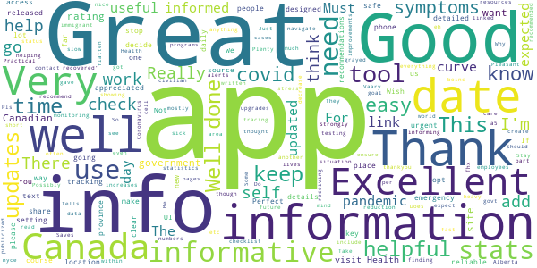

> Stay safe  :date: __2020-05-08 04:42:33__

> Excellent app for civilian use  :date: __2020-05-05 10:52:22__

> A great information tool for all canadians  :date: __2020-05-04 16:30:11__

> Great  :date: __2020-05-03 06:46:35__

> Should include contact tracing like the Alberta app just released  :date: __2020-05-03 04:32:36__

> a5  :date: __2020-05-02 10:18:29__

> Thanks for more than you think I know....  :date: __2020-05-02 08:27:20__

> Saves lives  :date: __2020-04-28 23:48:40__

> Vaary nyce. I'm new immigrant. Helpful info. Thx  :date: __2020-04-28 07:21:34__

> I use it often and don't mind helping even though I'm not doing anything. Wish you were on boinc  :date: __2020-04-27 20:39:25__

#### 4-star reviews

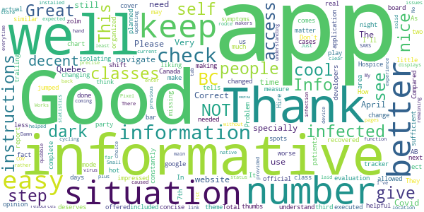

> I like the fact that you've jumped on board with making an app for this situation I give you two thumbs up it is informative but needs to have a little more  :date: __2020-05-05 03:39:19__

> Good app! I am NOT impressed with how the classes keep changing to keep BC and AB in the same class! They are NOT having similar numbers, no matter how the classes are changed!  :date: __2020-05-04 21:13:09__

> Good  :date: __2020-04-26 17:59:30__

> A needed app for us  :date: __2020-04-24 16:14:45__

> Great  :date: __2020-04-24 06:04:29__

> cool app. would be cool to zolm in on an area to see where the hot spots are. infected people.  :date: __2020-04-24 04:37:01__

> In my opinion this app should also cover measure and step by step instructions for self isolating and infected people.  :date: __2020-04-21 05:35:23__

> Informative  :date: __2020-04-20 14:08:12__

> It would be nice to have instructions on what to do after 14 days if symptoms do not change for better or worse.  :date: __2020-04-18 17:46:48__

> Good app. Info is easy to access and understand.  :date: __2020-04-18 00:30:27__

#### 3-star reviews

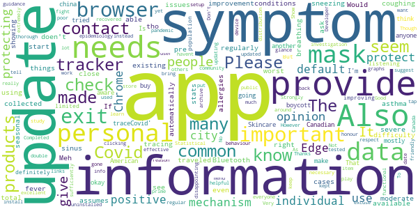

> The symptom tracker needs some improvement. I have moderate to severe asthma so I regularly have symptoms like difficulty breathing & coughing. I also have seasonal allergies so sneezing & sinus issues are common for me right now too. If I check these things off on the symptom tracker, it automatically assumes the worst even tho I don't have any other common symptoms like fever, haven't traveled, or been in close contact with know Covid cases. The app doen't ask about pre existing conditions.  :date: __2020-05-06 16:13:33__

> Meh  :date: __2020-04-29 21:35:56__

> Would like to be able to see what the stats collected by the app in total are showing but does not seem to be available? 🤔  :date: __2020-04-28 18:52:32__

> Please start using Bluetooth for contact tracing Check out the 'traceCovid' app  :date: __2020-04-27 22:27:20__

> App is okay but why so many updates? I tried it and now another update! Also I'm going to boycott mostly products made in china. Personal Skincare! I think the app should make people aware to buy Canadian & American made products! That should be an app! Is anyone listening?  :date: __2020-04-24 19:02:31__

> It is definitely improving! But with limited population to update the data, the investigation won't give effective guidance. To fight pandemic, more thorough epidemiology study is necessary for Canada. Also, about mask, from personal opinion, protecting the community is just as important as protecting personal. Though regular masks can't sufficiently protect individual, but they can protect others around positive individual. Strongly suggest everyone to put on mask in the public during COVID.  :date: __2020-04-24 06:29:54__

> I havent really used this app much to give an opinion  :date: __2020-04-22 03:00:51__

> Show how many have recovered please I want to know  :date: __2020-04-20 17:37:02__

> Completed update and my archive data is gone. Very disappointing.  :date: __2020-04-18 06:41:40__

> Statistical information is not kept up to date, uninstalled as this was my prime reason to install.  :date: __2020-04-10 15:41:01__

#### 2-star reviews

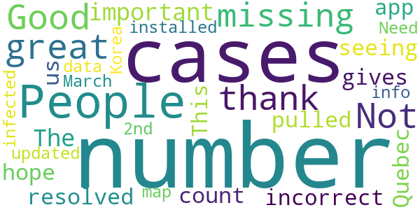

> Good Not great but thank you!  :date: __2020-04-18 01:02:10__

> You are missing the most important number The number of resolved cases People seeing the number of cases where people have pulled through gives us hope  :date: __2020-04-14 12:41:43__

> Quebec count is incorrect  :date: __2020-04-08 01:31:08__

> This app hasn't updated any data since I installed it on March 2nd  :date: __2020-04-05 02:18:04__

> Need info on all infected on the map, like in Korea  :date: __2020-04-02 18:15:02__

#### 1-star reviews

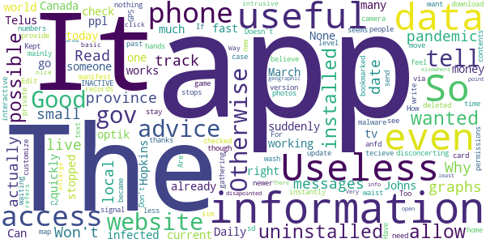

> Daily check in suddenly stopped working  :date: __2020-04-29 23:12:54__

> Can someone tell me how this app was already to go as fast as March 30? Telus can't even get my optik tv app right and they have all the money in the world. So how can the gov have one that works so quickly ?  :date: __2020-04-28 06:08:24__

> None  :date: __2020-04-27 01:28:16__

> Useless.... it does not even tell me how many ppl infected today....  :date: __2020-04-26 22:18:52__

> The Johns Hopkins website has much more current data about Canada, which is disconcerting. Otherwise it's nothing but advice to stay home and wash your hands. Good advice, but no data = not useful. Edit: Kept it on my phone in case it became more useful. It didn't. Have now deleted it.  :date: __2020-04-24 02:25:48__

> Didn't like it so I uninstalled it  :date: __2020-04-21 22:18:08__

> possible malware....installed itself on my phone and instantly wanted me to update to newer version. checked the manifest anfd permissions allow it to camera. and send and tecieve messages via c2. mainly though installed on its own on an INACTIVE phone (no sim)  :date: __2020-04-19 00:55:33__

> Useless  :date: __2020-04-17 01:43:45__

> Too small, can't see, can't customize... Don't waist your time  :date: __2020-04-15 21:23:41__

> Are they gathering data with this app? If so, I believe it is only a numbers game and not a pandemic!  :date: __2020-04-15 18:32:47__

# WHO Info
App version ``2.1.0``

Analyzed with [covid-apps-observer](http://github.com/covid-apps-observer) project, version ``0.1``

## App overview
| | |
|-------------------------|-------------------------| 
| **Name**&nbsp;&nbsp;&nbsp;&nbsp;&nbsp;&nbsp;&nbsp;&nbsp;&nbsp;&nbsp;&nbsp;&nbsp;&nbsp;&nbsp;&nbsp;&nbsp;&nbsp;&nbsp;&nbsp;&nbsp;&nbsp;&nbsp;&nbsp;&nbsp;&nbsp;&nbsp;&nbsp;&nbsp;&nbsp;&nbsp;&nbsp;&nbsp;&nbsp;&nbsp;&nbsp;&nbsp;&nbsp;&nbsp;&nbsp;&nbsp;  | WHO Info |
| **Unique identifier** | org.who.infoapp |
| **Link to Google Play** | [https://play.google.com/store/apps/details?id=org.who.infoapp](https://play.google.com/store/apps/details?id=org.who.infoapp) |
| **Summary**  | The official World Health Organization Information App. |
| **Privacy policy** | [https://www.who.int/about/who-we-are/privacy-policy](https://www.who.int/about/who-we-are/privacy-policy) |
| **Latest version** | 2.1.0 |
| **Last update** | 2020-05-08 13:17:43 |
| **Recent changes** | This release resolves some minor fixes and introduces the latest case numbers reported to WHO. |
| **Installs**  | 100,000+ |
| **Category** | News & Magazines |
| **First release** | Apr 13, 2020 |
| **Size**  | 8.2M |
| **Supported Android version**  | 4.2 and up |

### Description
> Have the latest health information at your fingertips with the official World Health Organization Information App. This app displays the latest news, events, features and breaking updates on outbreaks. 
  
 WHO works worldwide to promote health, keep the world safe, and serve the vulnerable. 
 Our goal is to ensure that a billion more people have universal health coverage, to protect a billion more people from health emergencies, and provide a further billion people with better health and well-being.

### User interface
The developers of the app provide the following screenshots in the Google play store.
| | | |
|:-------------------------:|:-------------------------:|:-------------------------:|
 |   |   |   | 
 |   |   |   | 
 |   |   |   | 
 |   |   |   | 
 |   |   |   | 
 |   |   |   | 

## Development team
In the following we report the main information provided by the development team in the Google play store.

| | |
|-------------------------|-------------------------|
| **Developer**  | World Health Organization |
| **Website**  | [https://www.who.int/](https://www.who.int/) |
| **Email** | dcx@who.int |
| **Physical address**  | [Avenu Appia 20 1211 Geneva Switzerland](https://www.google.com/maps/search/Avenu%20Appia%2020%201211%20Geneva%20Switzerland) (Google Maps) |
| **Other developed apps**  | [https://play.google.com/store/apps/developer?id=World+Health+Organization](https://play.google.com/store/apps/developer?id=World+Health+Organization) |

## Android support

| | |
|-------------------------|-------------------------|
| **Declared target Android version**  | Android10, version 10 (API level 29) |
| **Effective target Android version**  | Android10, version 10 (API level 29) |
| **Minimum supported Android version**  | Jelly Bean, version 4.2.x (API level 17) |
| **Maximum target Android version**  | - |

The larger the difference between the minimum and maximum supported Android versions, the better. A larger difference means a wider audience. For example, old phones have a very low Android version, so a high minimum supported Android version means that the app cannot be used by users with old phones, thus leading to accessibility problems. 

## Requested permissions

In the following we report the complete list of the permissions requested by the app. 

| **Permission** | **Protection level** | **Description** | 
|-------------------------|-------------------------|-------------------------|
 **android.permission INTERNET** | Normal | Allows applications to open network sockets. 
 **android.permission READ_EXTERNAL_STORAGE** | :warning:**Dangerous** | Allows an application to read from external storage. 
 **android.permission WRITE_EXTERNAL_STORAGE** | :warning:**Dangerous** | Allows an application to write to external storage. 

## Mentioned servers

| **Server** | **Registrant** | **Registrant country** | **Creation date** | 
|-------------------------|-------------------------|-------------------------|-------------------------|
-

## Security analysis 

Below we report the main security warnings raised by our execution of the [Androwarn](https://github.com/maaaaz/androwarn) security analysis tool.

**Connection interfaces exfiltration**
> - This application reads details about the currently active data network 
> - This application tries to find out if the currently active data network is metered 

**Suspicious connection establishment**
> - This application opens a Socket and connects it to the remote address 'Lfi/iki/elonen/NanoHTTPD$ResponseException;' on the 'N/A' port  
> - This application opens a Socket and connects it to the remote address 'NanoHttpd Shutdown' on the 'N/A' port  

**Code execution**
> - This application loads a native library: 'NativeScript' 
> - This application executes a UNIX command containing this argument: '2' 

## User ratings and reviews

Below we provide information about how end users are reacting to the app in terms of ratings and reviews in the Google Play store.

### Ratings

The WHO Info app has been installed by more than **100000** times. At this time, **309** rated the app and its average score is **3.66**. Below we show the distribution of the ratings across the usual star-based rating of Google Play

:star::star::star::star::star:: 173

:star::star::star::star:: 30

:star::star::star:: 9

:star::star:: 18

:star:: 77

### Reviews 

#### 5-star reviews

> Covit 19  :date: __2020-05-10 10:57:13__

> Good  :date: __2020-05-09 14:49:27__

> I neeed Medicine!  :date: __2020-05-07 18:12:09__

> So useful must have app!  :date: __2020-05-07 11:42:33__

> To protect myself I follow this application  :date: __2020-05-06 16:44:22__

> مقاله ی بیماری کوبید19  :date: __2020-05-06 15:09:54__

> Hhhh  :date: __2020-05-06 13:10:10__

> I would like to down load coronavirus tracking app  :date: __2020-05-05 11:31:22__

> করোনা ভাইরাজ  :date: __2020-05-04 20:15:49__

> Very good thanks bye  :date: __2020-05-04 19:17:17__

#### 4-star reviews

> I really want to appreciate Dr. Aliu Sam for using his natural roots and herbs medicine to cure me of Syphilis Since 11 months now I have been living with this disease and it has been giving me challenges, I was so perplexed cause I have been taking several drugs to be cured but all have been in vain. One morning I was browsing through the Internet then i saw several testimonies about Dr. Aliu Sam curing people off verious diseases and immediately I contacted Dr. Aliu Sam I told himabout my trou  :date: __2020-05-08 05:33:57__

> It did not detect  :date: __2020-04-29 18:37:26__

> Could do with more accurate information to keep people alive. But no harm done.  :date: __2020-04-29 13:41:12__

> Its good app. Easy to operate  :date: __2020-04-27 14:08:23__

> It's so nice app  :date: __2020-04-25 14:50:48__

> Thank you, good app.  :date: __2020-04-25 03:11:24__

#### 3-star reviews

> Best.  :date: __2020-04-20 13:14:33__

> Looks nice great look smooth Lario  :date: __2020-04-18 09:44:30__

#### 2-star reviews

> Thanks for your help.  :date: __2020-04-22 18:52:40__

#### 1-star reviews

> None  :date: __2020-05-10 11:40:37__

> Application is a waste of time, just like the organization.  :date: __2020-05-08 14:00:29__

> Chinese propaganda  :date: __2020-05-06 11:43:52__

> Keeps coming Up with typing error  :date: __2020-05-06 02:07:37__

> Errors  :date: __2020-05-03 17:24:33__

> This app will not download. I have tried several times. The app is useless.  :date: __2020-05-02 13:44:43__

> DND  :date: __2020-05-01 23:59:44__

> Not what I'm looking for  :date: __2020-04-29 09:57:51__

> Useless  :date: __2020-04-28 17:56:42__

> My expectations for this app is to work perfectly  :date: __2020-04-28 09:11:44__

# OpenWHO: Knowledge for Health Emergencies
App version ``3.3``

Analyzed with [covid-apps-observer](http://github.com/covid-apps-observer) project, version ``0.1``

## App overview
| | |
|-------------------------|-------------------------| 
| **Name**&nbsp;&nbsp;&nbsp;&nbsp;&nbsp;&nbsp;&nbsp;&nbsp;&nbsp;&nbsp;&nbsp;&nbsp;&nbsp;&nbsp;&nbsp;&nbsp;&nbsp;&nbsp;&nbsp;&nbsp;&nbsp;&nbsp;&nbsp;&nbsp;&nbsp;&nbsp;&nbsp;&nbsp;&nbsp;&nbsp;&nbsp;&nbsp;&nbsp;&nbsp;&nbsp;&nbsp;&nbsp;&nbsp;&nbsp;&nbsp;  | OpenWHO: Knowledge for Health Emergencies |
| **Unique identifier** | de.xikolo.openwho |
| **Link to Google Play** | [https://play.google.com/store/apps/details?id=de.xikolo.openwho](https://play.google.com/store/apps/details?id=de.xikolo.openwho) |
| **Summary**  | Life-saving knowledge for frontline responders in health emergencies. |
| **Privacy policy** | [https://openwho.org/pages/privacy](https://openwho.org/pages/privacy) |
| **Latest version** | 3.3 |
| **Last update** | 2020-05-05 16:17:12 |
| **Recent changes** | - Redesign of some UI elements - Bug fixes and performance improvements |
| **Installs**  | 1,000,000+ |
| **Category** | Education |
| **First release** | May 17, 2017 |
| **Size**  | 36M |
| **Supported Android version**  | 5.0 and up |

### Description
> OpenWHO is the World Health Organization's (WHO) interactive knowledge-transfer platform offering online courses to improve the response to health emergencies. OpenWHO enables the Organization and its key partners to transfer life-saving knowledge to large numbers of frontline responders.
 With OpenWHO, you have the flexibility to learn at your convenience. Watch the short video lectures and test your knowledge with self-tests when and where you like. The course forum and the collaboration space allow you to get in touch with other participants and experts around the world.
  
 Designed primarily for health care workers, frontline responders, and decision-makers, the app is also a source of information for those affected by disease outbreaks and health emergencies, or for those with a general interest in WHO's work in health emergencies.
  
 It features 6 channels:
 - The <b>Outbreak</b> channel addresses the management of infectious diseases and provides life-saving, scientific information.
 - The <b>Ready for Response</b> channel helps prepare personnel who are training for deployment to work in disease outbreaks and health emergencies.
 - The <b>Get Social</b> channel focuses on social science-based interventions and helps to communicate with affected communities.
 - The <b>Preparing for Pandemics</b> channel brings together courses on various aspects of preparedness, including surveillance, public health measures and risk communication during a pandemic.
 - The <b>COVID-19</b> channel provides learning resources in WHO's 6 official languages (Arabic, Chinese, English, French, Russian and Spanish) for health professionals, decision-makers and the public for the outbreak of coronavirus disease (COVID-19).
 - The <b>COVID-19 National Languages</b> channel provides the same learning resources as the COVID-19 channel but in national languages, such as Indonesian, Japanese and Portuguese. 
  
 OpenWHO courses are available in many languages, including WHO's 6 official languages. 
  
 Download the app now, and join the OpenWHO community.
 This app is developed in cooperation between the Hasso Plattner Institute and the WHO. The learning content is provided exclusively by the WHO.

### User interface
The developers of the app provide the following screenshots in the Google play store.
| | | |
|:-------------------------:|:-------------------------:|:-------------------------:|
 |   |   |   | 
 |   |   |   | 

## Development team
In the following we report the main information provided by the development team in the Google play store.

| | |
|-------------------------|-------------------------|
| **Developer**  | HPI Knowledge Engineering Team |
| **Website**  | [https://openwho.org/](https://openwho.org/) |
| **Email** | openwho-support@hpi.de |
| **Physical address**  | [Prof.-Dr.-Helmert-Str.2-3 14482 Potsdam](https://www.google.com/maps/search/Prof.-Dr.-Helmert-Str.2-3%2014482%20Potsdam) (Google Maps) |
| **Other developed apps**  | [https://play.google.com/store/apps/developer?id=7185448023325736337](https://play.google.com/store/apps/developer?id=7185448023325736337) |

## Android support

| | |
|-------------------------|-------------------------|
| **Declared target Android version**  | Android10, version 10 (API level 29) |
| **Effective target Android version**  | Android10, version 10 (API level 29) |
| **Minimum supported Android version**  | Lollipop, version 5.0 (API level 21) |
| **Maximum target Android version**  | - |

The larger the difference between the minimum and maximum supported Android versions, the better. A larger difference means a wider audience. For example, old phones have a very low Android version, so a high minimum supported Android version means that the app cannot be used by users with old phones, thus leading to accessibility problems. 

## Requested permissions

In the following we report the complete list of the permissions requested by the app. 

| **Permission** | **Protection level** | **Description** | 
|-------------------------|-------------------------|-------------------------|
 **android.permission ACCESS_NETWORK_STATE** | Normal | Allows applications to access information about networks. 
 **android.permission ACCESS_WIFI_STATE** | Normal | Allows applications to access information about Wi-Fi networks. 
 **android.permission FOREGROUND_SERVICE** | Normal | Allows a regular application to use Service.startForeground. 
 **android.permission INTERNET** | Normal | Allows applications to open network sockets. 
 **android.permission READ_EXTERNAL_STORAGE** | :warning:**Dangerous** | Allows an application to read from external storage. 
 **android.permission RECEIVE_BOOT_COMPLETED** | Normal | Allows an application to receive the Intent.ACTION_BOOT_COMPLETED that is broadcast after the system finishes booting. 
 **android.permission WAKE_LOCK** | Normal | Allows using PowerManager WakeLocks to keep processor from sleeping or screen from dimming. 
 **android.permission WRITE_EXTERNAL_STORAGE** | :warning:**Dangerous** | Allows an application to write to external storage. 
 **com.google.android.c2dm.permission RECEIVE** | - | - 
 **com.google.android.finsky.permission BIND_GET_INSTALL_REFERRER_SERVICE** | - | - 

## Mentioned servers

| **Server** | **Registrant** | **Registrant country** | **Creation date** | 
|-------------------------|-------------------------|-------------------------|-------------------------|
 | googlesyndication.com | Google LLC | :us: US | 2003-01-21 06:17:24 |
 | google.com | Google LLC | :us: US | 1997-09-15 04:00:00 |
 | app-measurement.com | Google LLC | :us: US | 2015-06-19 20:13:31 |
 | apple.com | Apple Inc. | :us: US | 1987-02-19 05:00:00 |
 | aomedia.org | Contact Privacy Inc. Customer 1243324949 | :canada: CA | 2015-08-24 14:07:31 |
 | dashif.org | VTM Group | :us: US | 2012-04-27 13:02:46 |
 | w3.org | W3C | :us: US | 1994-07-06 04:00:00 |
 | googleapis.com | Google LLC | :us: US | 2005-01-25 17:52:26 |
 | googleadservices.com | Google LLC | :us: US | 2003-06-19 16:34:53 |
 | psdev.de | - | - | - |
 | xmlpull.org | WhoisGuard, Inc. | PA | 2001-11-26 20:33:08 |
 | someurl.com | WhoisGuard, Inc. | PA | 2000-02-08 15:50:35 |
 | crashlytics.com | Google LLC | :us: US | 2011-01-21 15:30:40 |
 | apache.org | The Apache Software Foundation | :us: US | 1995-04-11 04:00:00 |
 | opensource.org | Open Source Initiative | :us: US | 1998-02-11 05:00:00 |
 | creativecommons.org | Creative Commons Corporation | :canada: CA | 2001-01-15 16:51:44 |
 | eclipse.org | Eclipse.org Foundation, Inc. | :canada: CA | 1997-04-14 04:00:00 |
 | gnu.org | Free Software Foundation | :us: US | 1995-11-24 05:00:00 |
 | mozilla.org | Mozilla Corporation | :us: US | 1998-01-24 05:00:00 |

## Security analysis 

Below we report the main security warnings raised by our execution of the [Androwarn](https://github.com/maaaaz/androwarn) security analysis tool.

**Telephony identifiers leakage**
> - This application reads the ISO country code equivalent of the current registered operator's MCC (Mobile Country Code) 

**Connection interfaces exfiltration**
> - This application reads details about the currently active data network 
> - This application tries to find out if the currently active data network is metered 

**Suspicious connection establishment**
> - This application opens a Socket and connects it to the remote address ' returned no addresses for  ; port is out of range' on the 'N/A' port  
> - This application opens a Socket and connects it to the remote address '' on the 'N/A' port  
> - This application opens a Socket and connects it to the remote address 'Ljava/lang/StringBuilder;->toString()Ljava/lang/String;' on the 'N/A' port  
> - This application opens a Socket and connects it to the remote address 'Ljava/net/Proxy;->type()Ljava/net/Proxy$Type;' on the 'N/A' port  
> - This application opens a Socket and connects it to the remote address 'timeout' on the 'N/A' port  

**Code execution**
> - This application loads a native library 
> - This application loads a native library: 'bypass' 
> - This application loads a native library: 'jniPdfium' 
> - This application loads a native library: 'modft2' 
> - This application loads a native library: 'modpdfium' 
> - This application loads a native library: 'modpng' 

## User ratings and reviews

Below we provide information about how end users are reacting to the app in terms of ratings and reviews in the Google Play store.

### Ratings

The OpenWHO: Knowledge for Health Emergencies app has been installed by more than **1000000** times. At this time, **2395** rated the app and its average score is **4.3122363**. Below we show the distribution of the ratings across the usual star-based rating of Google Play

:star::star::star::star::star:: 1626

:star::star::star::star:: 323

:star::star::star:: 202

:star::star:: 50

:star:: 192

### Reviews 

#### 5-star reviews

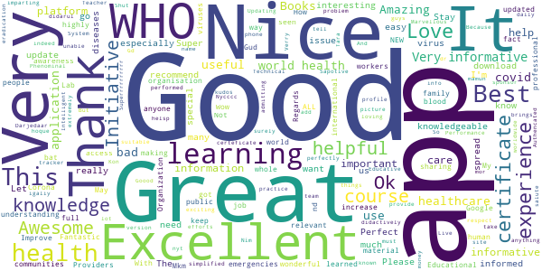

> It's a very simplified version.👍👍👍  :date: __2020-05-10 10:43:35__

> Good  :date: __2020-05-09 16:24:30__

> Excellent and more informative  :date: __2020-05-08 14:29:14__

> I salute to the efforts of WHO for the eradication of diseases which is spread in the whole world  :date: __2020-05-08 04:26:43__

> Nice... Really help full  :date: __2020-05-07 16:39:29__

> This is so amazing and exciting for me. I will surely use it with care and respect for the good it brings to WHO communities worldwide. Thank you!  :date: __2020-05-06 20:18:32__

> W.h.o  :date: __2020-05-05 22:15:28__

> Gud  :date: __2020-05-05 09:27:43__

> Good  :date: __2020-05-03 20:03:19__

> Performance perfectly performed  :date: __2020-05-03 18:27:24__

#### 4-star reviews

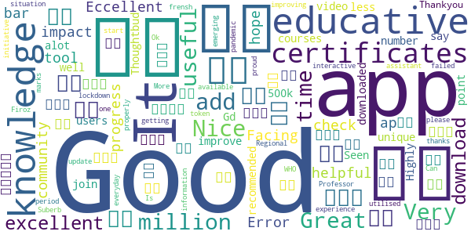

> Good ap  :date: __2020-05-10 07:41:36__

> Eccellent  :date: __2020-05-09 06:04:21__

> Good 👍  :date: __2020-05-08 13:54:07__

> Facing Error while check tool bar progress.  :date: __2020-05-07 11:56:39__

> It is educative very helpful to me and my impact in my community  :date: __2020-05-05 12:29:56__

> "శుభోదయం 🌅 సూర్యోదయం. "ఓం మహాగణాధిపతయే నమః. ఓంగణానాంత్వాగణపతిగ్ంహవామహే కవింకవీనాముపమశ్రవస్తమమ్ జ్యేష్టరాజం బ్రహ్మణాంబ్రహ్మణస్పత ఆనశ్శృణ్వనూతి భిస్సీద సాదనమ్. "శ్రీ ఓం మహాగణపతయేనమః . "వాగర్ధావివ సంపృక్తౌ వాగర్ధ ప్రతిపత్తయే వందే జగతఃపితరౌ పార్వతీ పరమేశ్వరౌ . "సంఘం శక్తి చ దేహిమే జగదంభికే నమాయః మహాదేవి దంపతీ సుఖహేతవే "ఓం హ్రీం శివశివాయై నమః స్వాహాః. "సంకల్పానికి గణాధిపతి అధిపతి అయితే శుభసంకల్పానికి సౌభాగ్య సంపద ఇచ్చేవారు ఆదిదంపతులు పార్వతీ పరమేశ్వరులు. "ఓంహ్రీశివశివాయైనమఃస్వాహః.  :date: __2020-05-03 08:12:34__

> Good  :date: __2020-05-01 06:32:41__

> Nice app l hope that improve and add alot of unique courses !!!  :date: __2020-04-29 14:56:21__

> Knowledge as well as certificates  :date: __2020-04-27 14:49:46__

> Seen your video add before I downloaded the app and you say join an app with "millions" of users, number of downloads are 500k+ less that 1 million. Thoughtbud point it out  :date: __2020-04-26 19:37:53__

#### 3-star reviews

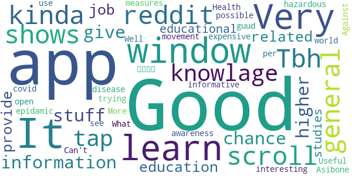

> Tbh this app is kinda like reddit, you can scroll through windows that shows general knowlage, then you can tap into that window for more information. It's a good app to learn about stuff  :date: __2020-05-09 13:39:53__

> Very good app ..give chance to learn higher education...its very good if this app will provide job related educational studies  :date: __2020-05-02 15:54:16__

> Good  :date: __2020-04-29 17:15:00__

> Very interesting.  :date: __2020-04-29 08:44:44__

> Good  :date: __2020-04-23 19:00:10__

> Can't open  :date: __2020-04-16 00:11:34__

> What i do use this apps  :date: __2020-04-15 20:44:05__

> Good app  :date: __2020-04-14 15:20:06__

> Useful app  :date: __2020-04-12 13:33:49__

> Health awareness  :date: __2020-04-12 00:26:04__

#### 2-star reviews

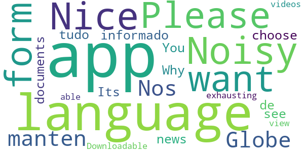

> Noisy app.  :date: __2020-04-21 21:34:45__

> Nice  :date: __2020-04-09 16:25:41__

> Please , i want the App in the form of the Globe.  :date: __2020-04-05 14:35:33__

> Nos manten informado de tudo  :date: __2020-03-22 08:51:43__

> Why can't you choose a language???? You have to see the same news or documents in all languages. Its exhausting.  :date: __2020-03-15 19:30:37__

> not able to view videos. not Downloadable too  :date: __2019-06-07 20:15:22__

#### 1-star reviews

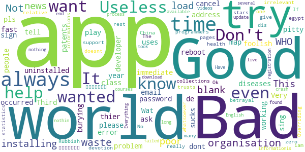

> Bad  :date: __2020-05-09 07:44:18__

> Don't even know how to play  :date: __2020-05-06 17:54:16__

> I dont want it please cancel immediate  :date: __2020-04-28 06:51:19__

> U want my email address  :date: __2020-04-27 09:15:16__

> I wanted the developer to tell me the uses of this app  :date: __2020-04-24 22:13:46__

> It sucks i wanted map of world and diseases  :date: __2020-04-23 21:50:10__

> I can't sing in.. don't know where the problem .I uninstalled and again try.. pls help fast .. it's always ask for password  :date: __2020-04-23 20:52:34__

> Useless app by a useless organisation, people will be burying thier patents this year and all this does is waste your time.  :date: __2020-04-18 09:28:59__

> Third class... Not working after installing  :date: __2020-04-17 17:18:57__

> Time for a reboot.  :date: __2020-04-15 21:01:00__

# Credits

This project makes use of the following main third-party projects:
* Androguard: [https://github.com/androguard/androguard](https://github.com/androguard/androguard)
* Androwarn: [https://github.com/maaaaz/androwarn](https://github.com/maaaaz/androwarn)
* google_play_scraper: [https://github.com/JoMingyu/google-play-scraper](https://github.com/JoMingyu/google-play-scraper)
* whois: [https://github.com/DannyCork/python-whois](https://github.com/DannyCork/python-whois)
* BeautifulSoup: [https://www.crummy.com/software/BeautifulSoup](https://www.crummy.com/software/BeautifulSoup)

Other open-source projects used in this project include: 

- androguard==3.3.5
- appnope==0.1.0
- asn1crypto==1.3.0
- backcall==0.1.0
- beautifulsoup4==4.9.0
- bs4==0.0.1
- certifi==2020.4.5.1
- cffi==1.14.0
- chardet==3.0.4
- click==7.1.2
- colorama==0.4.3
- cryptography==2.9.2
- cycler==0.10.0
- decorator==4.4.2
- future==0.18.2
- google-play-scraper==0.0.2.3
- idna==2.9
- ipython==7.13.0
- ipython-genutils==0.2.0
- jedi==0.17.0
- Jinja2==2.11.2
- joblib==0.14.1
- kiwisolver==1.2.0
- lxml==4.5.0
- MarkupSafe==1.1.1
- matplotlib==3.2.1
- networkx==2.4
- nltk==3.5
- numpy==1.18.3
- parso==0.7.0
- pexpect==4.8.0
- pickleshare==0.7.5
- Pillow==7.1.2
- play-scraper==0.6.0
- prompt-toolkit==3.0.5
- ptyprocess==0.6.0
- pycountry==19.8.18
- pycparser==2.20
- pydot==1.4.1
- Pygments==2.6.1
- pyOpenSSL==19.1.0
- pyparsing==2.4.7
- python-dateutil==2.8.1
- regex==2020.4.4
- requests==2.23.0
- requests-futures==1.0.0
- six==1.14.0
- soupsieve==2.0
- tld==0.12.1
- tqdm==4.45.0
- traitlets==4.3.3
- urllib3==1.25.9
- wcwidth==0.1.9
- wordcloud==1.7.0

