# COVID-related Android apps in Canada

Author: `Ivano Malavolta` (ivanomalavolta@gmail.com)

Created at: `2021/5/13`

Report generated by the [covid-apps-observer](http://github.com/covid-apps-observer) project, version 0.1

# Table of contents 

- [Background](#background)
    * [Data sources and analyses](#data-sources-and-analyses)
        * [App metadata](#app-metadata)
        * [Requested permissions](#requested-permissions)
        * [Mentioned servers](#mentioned_servers)
        * [Security analysis](#security_analysis)
        * [User ratings and reviews](#user-ratings-and-reviews)
    * [Disclaimer](#disclaimer)
- [BC COVID-19 Support](#bc-covid-19-support)
- [ABTraceTogether](#abtracetogether)
- [Canada COVID-19](#canada-covid-19)
- [WHO Info](#who-info)
- [OpenWHO: Knowledge for Health Emergencies](#openwho-knowledge-for-health-emergencies)
- [COVID Alert - Let’s protect each other](#covid-alert---let’s-protect-each-other)
- [Niagara Health Navigator](#niagara-health-navigator)
- [Kenya Covid-19 Tracker](#kenya-covid-19-tracker)
- [coVIDApp](#covidapp)
- [Bugs & Drugs 2.0](#bugs--drugs-2.0)
- [Lumeca - See a doctor now - Free in Saskatchewan](#lumeca---see-a-doctor-now---free-in-saskatchewan)
- [Managing your stress & anxiety](#managing-your-stress--anxiety)
- [E-pedia SJD](#e-pedia-sjd)

- [Credits](#credits)

# How to read this report

This report has been generated by the [covid-apps-observer](http://github.com/covid-apps-observer) project. The project automatically analyzes the apps by extracting information which is already publicly available either on the web or in the apps binary files. 

Our analysis covers the following apps:
| | |
|-------------------------|-------------------------| 
|  | BC COVID-19 Support
|  | ABTraceTogether
|  | Canada COVID-19
|  | WHO Info
|  | OpenWHO: Knowledge for Health Emergencies
|  | COVID Alert - Let’s protect each other
|  | Niagara Health Navigator
|  | Kenya Covid-19 Tracker
|  | coVIDApp
| 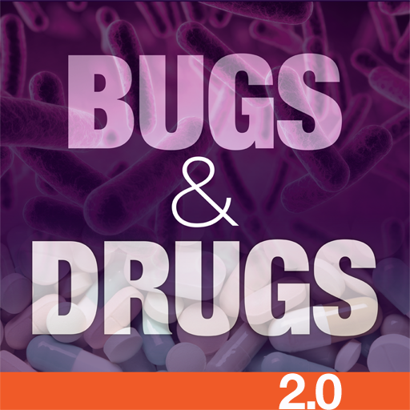 | Bugs & Drugs 2.0
|  | Lumeca - See a doctor now - Free in Saskatchewan
|  | Managing your stress & anxiety
|  | E-pedia SJD

The details of our analysis are presented in the remainder of this report.

For independent verification, the raw data and the source code of the project is publicly available in its GitHub repository [http://github.com/covid-apps-observer](http://github.com/covid-apps-observer) and its source code has been thoroughly commented in order to provide all the details about how the information provided in this report has been extracted. 

Any feedback, questions, and improvements about the project are very welcome, feel free to create an issue or pull request directly in its GitHub repository: [http://github.com/covid-apps-observer](http://github.com/covid-apps-observer).

## Data sources and analyses

The analysis of each app is structured around five main dimensions: 
* App metadata  
* Requested permissions
* Mentioned servers
* Androwarn analysis
* User ratings and reviews

In the following we describe the data sources and analysis performed for each dimension.

### App metadata

App metadata includes an overview of the main information about the app (for example, its name, releases, privacy policy, etc.), contact information of the development team, and the various Android versions supported by the app. This information is extracted from two main data sources:
* _Google Play store_: we automatically mined the web page of the Google Play store showing the basic information about the app and we parsed it in order to extract information about the app and development team 
* _Android Manifest file_: in our analysis we decompiled the binary file of the app (it is similar to a Zip archive but it contains the code of the app instead of normal files) and we extracted information about the supported Android versions, as it has been listed by its development team.

The extracted app metadata feeds the _App overview_, _Development team_, and _Android support_ sections of this report.
We make use of the [google-play-scraper](https://github.com/JoMingyu/google-play-scraper) tool for extracting the raw data related to this dimension of the project.

### Requested permissions

The Android operating system has a permission model which allows users to grant access to potentially privacy-related information. Every Android app has to explictly declare the permissions it needs to properly function in the Android Manifest file.  

In this report we also show the protection level of each permission, which is a key information for understanding how the requested permissions related to the user's privacy. We carefully analyzed the [official Android documentation (v. 29)](https://developer.android.com/reference/android/Manifest.permission), and it resulted that a permission requested by an Android app can belong to the following protection levels:
* **Dangerous**: higher-risk permissions that would give a requesting app access to private user data or control over the device that can negatively impact the user. Because this type of permission introduces potential risk, the system usually does not automatically grant it to the requesting app. For example, any dangerous permissions requested by an app may be displayed to the user and require confirmation before proceeding.
* **Normal**: this is the default and most common level in Android; normal permissions are lower-risk and give access to isolated app-level features, with minimal risk to other apps, the system, or the user. 
* **Signature**: permissions granted only if the requesting app is signed with the same certificate as the app that declared the permission
* **Appop**: old permission level, a reminiscence of the App Ops tool that Google introduced in Android 4.3.
* **Development**: optional permissions which can be granted to development-oriented apps.
* **Privileged**: permissions who give higher power to mobile apps w.r.t. other apps, such as binding to incoming calls, interacting via bluetooth with other devices without user interaction, etc.
* **Preinstalled**: reserved only for preinstalled apps
* **Installer**: allow the holder to start the permission usage screen for an app
* **RetailDemo**: permissions related to devices used in demonstrations in shops.
* **Pre23**: permissions automatically granted to apps targeting devices running pre-6.0 Android.
* **Upcoming**: permissions which will be released in the next version of the Android platform. 
* **Deprecated**: permissions belonging to old releases of the Android platform, they should not be used by developers since they will not be supported in the near future.
* **Not for use by third-party applications**: permissions which can be requested only by apps developed by Google.
* **Undefined**: this protection level is not documented by Google.

The permissions dimension of this project is based on the [Androguard](https://github.com/androguard/androguard) static analysis tool.

### Mentioned servers

We decompiled each app in order to look for all possible mentions of remote URLs. The mentioned URLs can refer to remote servers the the app is using for either sending or receiving information, web addresses for directing the user to an information website, and so on. 

:warning: It is important to note that this analysis is not meant to be complete and it is very prone to obfuscation. The servers reported here are simply _mentioned_ somewhere in the code of the app and are meant to just give an indication about the "hooks" of the app towards external resources. For example, for an Android app it is normal to contact Google services in order to send/receive push notifications, or to contact the servers of analytics services for having real-time diagnostics about crashes of the app or bugs.

This part of the analysis is based on the [Androguard](https://github.com/androguard/androguard) static analysis tool for identfying the raw URLs mentioned in the app; then, the information about each mentioned server is collected by performing a _whois_ lookup on the first-level domain present in the URL.

### Security analysis

This dimension is based on the [Androwarn](https://github.com/maaaaz/androwarn) structural and data flow analysis of Android bytecode. Androwarn is developed by the University of Lyon/INSA (France) and it has been used in several academic studies. According to its documentation, Androwarn targets the following categories of potential security issues:
* **Telephony identifiers exfiltration**: IMEI, IMSI, MCC, MNC, LAC, CID, operator's name, etc.
* **Device settings exfiltration**: software version, usage statistics, system settings, logs, etc.
* **Geolocation information leakage**: GPS/WiFi geolocation, etc.
* **Connection interfaces information exfiltration**: WiFi credentials, Bluetooth MAC adress, etc.
* **Telephony services abuse**: premium SMS sending, phone call composition, etc.
* **Audio/video flow interception**: call recording, video capture, etc.
* **Remote connection establishment**: socket open call, Bluetooth pairing, APN settings edit, etc.
* **PIM data leakage**: contacts, calendar, SMS, mails, clipboard, etc.
* **External memory operations**: file access on SD card, etc.
* **PIM data modification**: add/delete contacts, calendar events, etc.
* **Arbitrary code execution**: native code using JNI, UNIX command, privilege escalation, etc.
* **Denial of Service**: event notification deactivation, file deletion, process killing, virtual keyboard disable, terminal shutdown/reboot, etc.

Note: We do not consider this data point in the current version of our analyzers since it is too verbose for our purposes.

:warning: It is important to note that Androwarn is a static analysis tool, and as such it performs a variety of heuristics and approximations in its analyses. Said that, the results shown in this report are meant to provide an indication of _potential_ security issues and should be by no means treated as complete and correct.   

### User ratings and reviews

For this dimension we turn again to the web interface of the Google Play store. Firstly, we automatically mine summary statistics about user ratings from the web page of the app under analysis; then, we automatically download the newest 1000 reviews of the app under analysis. For each level of rating (5 stars, 4 stars, , etc., 1 star) we show:
- a word cloud presenting the main terms used by end users in their reviews in the Google Play store
- the last 10 reviews provided by app users in the Google Play store. 

This purposefully simple analysis is meant to help both future users and the development team of the app in understanding what are the main positive and negative points of the app under analysis.

We make use of the [google-play-scraper](https://github.com/JoMingyu/google-play-scraper) tool for extracting the raw data related to this dimension of the project.

## Disclaimer 

This report has been produced independently of any parties and its only objective is to help anybody in better understanding how COVID-related apps work in practice (and compare to each other). The results of this report are limited to the specific version of the software used for running the analyses and on the various heuristics implemented in there. In other words, the results of the analyzers may differ depending on the time and modalities in which they are executed. We do not guarantee that the results of the analyses and the corresponding contents of this report are fully complete or correct. The analysis software is licensed under the [MIT License](https://github.com/iivanoo/covid-apps-observer/blob/master/LICENSE).

# BC COVID-19 Support
App version ``1.35.0``

Analyzed with [covid-apps-observer](http://github.com/covid-apps-observer) project, version ``0.1``

## App overview
| | |
|-------------------------|-------------------------| 
| **Name**                                          | BC COVID-19 Support |
| **Unique identifier** | ca.bc.gov.health.hlbc.COVID19 |
| **Link to Google Play** | [https://play.google.com/store/apps/details?id=ca.bc.gov.health.hlbc.COVID19](https://play.google.com/store/apps/details?id=ca.bc.gov.health.hlbc.COVID19) |
| **Summary**  | Stay informed about COVID-19 in BC and determine what actions you should take. |
| **Privacy policy** | [https://www.thrive.health/foippa](https://www.thrive.health/foippa) |
| **Latest version** | 1.35.0 |
| **Last update** | 2021-03-19 16:14:46 |
| **Recent changes** | We are constantly optimizing our app and adding new features to help support you through COVID-19.  This version includes a number of UI/UX improvements as well as stability enhancements. |
| **Installs**  | 50,000+ |
| **Category** | Medical |
| **First release** | Mar 21, 2020 |
| **Size**  | 11M |
| **Supported Android version**  | 5.0 and up |

### Description
> If you are a resident of British Columbia, Canada, BC COVID-19 Support is designed for you to stay informed about COVID-19 in BC and determine what actions and next steps you should take.  Recommendations are personalized and based on your personal risk factors.  You will receive timely updates with important news and alerts from BC’s Ministry of Health.  Recommendations and content are automatically updated based on the latest BC guidelines related to COVID-19.
 This application has been developed in collaboration with Thrive Health, a Vancouver-based healthcare technology company.  
 SAFETY & SECURITY:
 You will only be asked to provide your age, postal code, and device location.  The data you provide will be combined with all user data and used to inform the provincial COVID-19 response, and to allow you to receive location-based alerts.
 Your data will not be sold. Your data will not be used for any purpose other than health care.
 We follow industry best practices for data security and privacy.  The data you provide is always encrypted and is stored in Canada.

### User interface
The developers of the app provide the following screenshots in the Google play store.
| | | |
|:-------------------------:|:-------------------------:|:-------------------------:|
 |   |  

## Development team
In the following we report the main information provided by the development team in the Google play store.

| | |
|-------------------------|-------------------------|
| **Developer**  | Province of British Columbia, Canada |
| **Website**  | - |
| **Email** | support@thrive.health |
| **Physical address**  | - |
| **Other developed apps**  | [https://play.google.com/store/apps/developer?id=Province+of+British+Columbia,+Canada](https://play.google.com/store/apps/developer?id=Province+of+British+Columbia,+Canada) |

## Android support

| | |
|-------------------------|-------------------------|
| **Declared target Android version**  | Android10, version 10 (API level 29) |
| **Effective target Android version**  | Android10, version 10 (API level 29) |
| **Minimum supported Android version**  | Lollipop, version 5.0 (API level 21) |
| **Maximum target Android version**  | - |

The larger the difference between the minimum and maximum supported Android versions, the better. A larger difference means a wider audience. For example, old phones have a very low Android version, so a high minimum supported Android version means that the app cannot be used by users with old phones, thus leading to accessibility problems. 

## Requested permissions

In the following we report the complete list of the permissions requested by the app. 

| **Permission** | **Protection level** | **Description** | 
|-------------------------|-------------------------|-------------------------|
 **android.permission ACCESS_COARSE_LOCATION** | :warning:**Dangerous** | Allows an app to access approximate location. 
 **android.permission ACCESS_FINE_LOCATION** | :warning:**Dangerous** | Allows an app to access precise location. 
 **android.permission ACCESS_NETWORK_STATE** | Normal | Allows applications to access information about networks. 
 **android.permission INTERNET** | Normal | Allows applications to open network sockets. 
 **android.permission READ_EXTERNAL_STORAGE** | :warning:**Dangerous** | Allows an application to read from external storage. 
 **android.permission RECEIVE_BOOT_COMPLETED** | Normal | Allows an application to receive the Intent.ACTION_BOOT_COMPLETED that is broadcast after the system finishes booting. 
 **android.permission REQUEST_INSTALL_PACKAGES** | Signature | Allows an application to request installing packages. 
 **com.google.android.c2dm.permission RECEIVE** | - | - 
 **com.google.android.finsky.permission BIND_GET_INSTALL_REFERRER_SERVICE** | - | - 

## Mentioned servers

| **Server** | **Registrant** | **Registrant country** | **Creation date** | 
|-------------------------|-------------------------|-------------------------|-------------------------|
 | adobe.com | Adobe Inc. | :us: US | 1986-11-17 05:00:00 |
 | googlesyndication.com | Google LLC | :us: US | 2003-01-21 06:17:24 |
 | google.com | Google LLC | :us: US | 1997-09-15 04:00:00 |
 | app-measurement.com | Google LLC | :us: US | 2015-06-19 20:13:31 |
 | branch.io | Branch | :us: US | 2011-11-10 13:52:13 |
 | gstatic.com | Google LLC | :us: US | 2008-02-11 15:31:25 |
 | crashlytics.com | Google LLC | :us: US | 2011-01-21 15:30:40 |
 | bnc.lt | - | - | 2016-11-14 00:00:00 |
 | googleapis.com | Google LLC | :us: US | 2005-01-25 17:52:26 |
 | googleadservices.com | Google LLC | :us: US | 2003-06-19 16:34:53 |

## Security analysis 

Below we report the main security warnings raised by our execution of the [Androwarn](https://github.com/maaaaz/androwarn) security analysis tool.

**Telephony identifiers leakage**
> - This application reads the MCC+MNC of the provider of the SIM 

**Connection interfaces exfiltration**
> - This application reads details about the currently active data network 
> - This application tries to find out if the currently active data network is metered 

**Suspicious connection establishment**
> - This application opens a Socket and connects it to the remote address '' on the 'N/A' port  
> - This application opens a Socket and connects it to the remote address 'Ljava/lang/StringBuilder;->toString()Ljava/lang/String;' on the 'N/A' port  
> - This application opens a Socket and connects it to the remote address 'Ljava/net/Proxy;->type()Ljava/net/Proxy$Type;' on the 'N/A' port  
> - This application opens a Socket and connects it to the remote address 'timeout' on the 'N/A' port  

**Pim data leakage**
> - This application accesses the downloads folder 
> - This application accesses data stored in the clipboard 

## User ratings and reviews

Below we provide information about how end users are reacting to the app in terms of ratings and reviews in the Google Play store.

### Ratings

The BC COVID-19 Support app has been installed by more than **50000** times. At this time, **206** rated the app and its average score is **3.8446603**. Below we show the distribution of the ratings across the usual star-based rating of Google Play

:star::star::star::star::star:: 112

:star::star::star::star:: 32

:star::star::star:: 16

:star::star:: 10

:star:: 36

### Reviews 

#### 5-star reviews

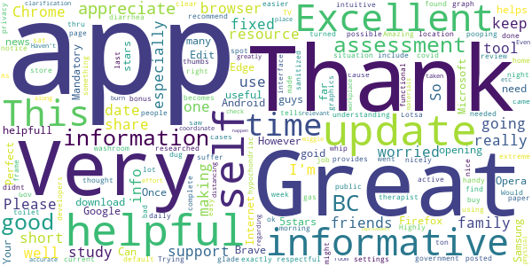

> Mandatory download  :date: __2021-01-20 08:04:33__

> So far this app is goid.  :date: __2021-01-18 22:59:54__

> Great!  :date: __2020-11-30 17:23:32__

> Excellent useful informative thank you  :date: __2020-06-07 16:54:54__

> Very helpfull  :date: __2020-05-25 02:52:46__

> Very helpful and informative!  :date: __2020-05-20 15:13:25__

> Your app keeps opening Google Chrome for news updates. However, I don't use this browser. Can you update the app to support any browser? Android has Firefox, Samsung Internet, Microsoft Edge, Opera, Brave, and many more - you need to support more than just Chrome. Once this is fixed, the app will get 5 stars! Edit: you guys fixed it!! Thank you! 5stars to you!  :date: __2020-05-16 08:10:54__

> Perfect  :date: __2020-04-28 11:09:46__

> Informative!  :date: __2020-04-25 04:26:38__

> This app helps with understanding what to do, what is going on, and what the government is doing.  :date: __2020-04-25 02:28:31__

#### 4-star reviews

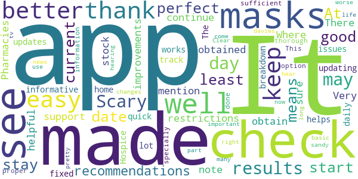

> Scary to see results each day  :date: __2021-01-07 15:03:36__

> It may not be a perfect app, but it is a good start. At least now we have a means to stay up to date with current recommendations and restrictions. There are improvements to be made, and I am sure they will be made as we continue to support it.  :date: __2020-11-14 03:19:33__

> I note that no mention is made as to where and how to obtain masks. Pharmacies are out of stock. Where can masks be obtained?  :date: __2020-04-27 00:16:56__

> Very helpful and informative.  :date: __2020-04-25 00:50:33__

> The updates are now fixed and the app works well, thank you for updating, this helps track a lot of issues in the Hospice home I would also like to see a better breakdown of the daily check up a quick check up and a thorough check up option would be very sufficient but very well done app specially for proper information  :date: __2020-04-13 20:17:45__

> This important part of life right now, I like to hear of many changes that I come in to hearing for better or worse Thanks sandy davies  :date: __2020-04-08 23:01:32__

> It's pretty easy and basic didn't keep it for long I just keep the news on tv  :date: __2020-04-07 02:48:49__

> Clear and easy to use  :date: __2020-03-24 05:10:56__

#### 3-star reviews

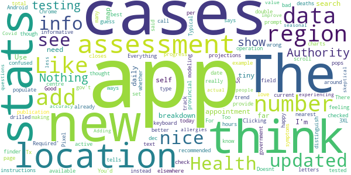

> Too bad the data is wrong. The app shows 407 new cases today but if you add up the cases in each region, they total to 507 new cases. You'd think that number would be double-checked before publication.  :date: __2021-01-27 01:23:12__

> Like it but the stats page with modeling and projections has not updated since dec 23. Everything else does in the app when you scroll around.  :date: __2021-01-18 00:53:34__

> I love the app and the up to date info it would be nice though if we could see not just how many cases there are in each Health Authority but instead the number of active cases per health authority  :date: __2020-10-30 05:35:56__

> The app recommended I get tested. I already know where the nearest testing centre is so I thought that was it, just show up. Nothing in the testing instructions was said about making an appointment until I drilled down to search the location for hours of operation. There in tiny tiny letters it says 'Appointment Required'. The finder app uses Chrome. Clicking on the text field pops up the keyboard and then closes it. So you can't type in your location to search. Pixel 3XL, Android 10  :date: __2020-06-14 02:55:44__

> I think you need to add a prompt to set up the location. I'm happy to have this app. Tx  :date: __2020-05-13 09:24:24__

> Stats are nice but the self assessment tells me to call 911 if I'm feeling confused.  :date: __2020-05-05 06:05:32__

> Nothing really new or informative that is not available elsewhere.  :date: __2020-04-24 18:19:05__

> Doesnt provide the best charts to track trend/progress....new cases and deaths daily  :date: __2020-04-10 07:06:36__

> Good info so far, but the app is not updated daily with current stats. Typical gov't I guess.  :date: __2020-04-04 17:07:08__

> I like it so far. I think we should see a provincial breakdown map by region. Use the self-check and government data to populate the map.  :date: __2020-03-27 06:58:15__

#### 2-star reviews

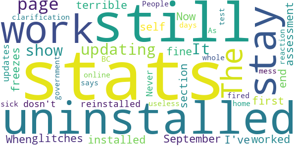

> The stats page is not updating. It's still show stats from September 30.  :date: __2020-10-04 16:38:05__

> When I first installed it it worked fine. Now it has terrible glitches and freezes at the end of the self-assessment section. I've uninstalled and reinstalled it and it still dosn't work. I uninstalled it again.  :date: __2020-09-09 23:17:44__

> Never any updates, no clarification of who should stay off work, and an online test that only says stay at home for 10 days if you're sick. As useless as the BC government's reaction to the whole mess. People should be fired.  :date: __2020-03-24 20:35:26__

#### 1-star reviews

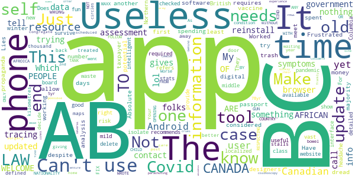

> Just another propaganda tool.  :date: __2021-03-27 23:27:10__

> I am spending the winter in BC. My phone is from AB. I Can't use the Canadian App because BC has one. I can't use the BC one because I have an AB phone number. I can't use the AB app in BC or the BC app in AB and AB requires a phone with Android 8 or above. My phone is a 2016 one and has Android 5 on it yet that is considered too old by the software designers - why? I dread having to get a Covid vaccine digital passport if they don't do an end user needs analysis first. They should not allow taxpayer money to be spent on a government app that can't meet the needs of at least the majority of potential users.  :date: __2021-03-13 21:09:08__

> Worked for 3 days not working now despite trying to update and reinstall Have to try something else  :date: __2021-03-09 17:37:55__

> Frustrated  :date: __2021-03-08 03:48:06__

> Lies  :date: __2021-03-03 21:49:21__

> Useless. Absolute trash. The app recommends contact tracing, yet doesn't provide it lol 😆. The app gives no localized case data, you know, the data required to make intelligent risk assessments, lol 😆. This app does nothing, and is the only tool available to the middle and under class. It's fun trying to survive a pandemic with no tools and no information from our government. Just delete this useless waste of time.  :date: __2020-12-12 20:34:44__

> Not good. Tells you to get checked and self isolate if you have a mild headache. For useful stats it just refers you to the website.  :date: __2020-11-21 03:52:14__

> Why? This is nothing more than an interface to information. It's time for BC to get on board with the Canadian Covid-19 contact tracing app  :date: __2020-09-24 07:26:37__

> Does not show the right detailed information. Northern British Columbia is vast and a new case a thousand kilometres away is treated like it is on my back door. The maps could be better defined.  :date: __2020-08-28 06:11:40__

> Your app stalls at "what did you decide to do". FIX IT!  :date: __2020-08-13 17:43:30__

# ABTraceTogether
App version ``2.2.0``

Analyzed with [covid-apps-observer](http://github.com/covid-apps-observer) project, version ``0.1``

## App overview
| | |
|-------------------------|-------------------------| 
| **Name**&nbsp;&nbsp;&nbsp;&nbsp;&nbsp;&nbsp;&nbsp;&nbsp;&nbsp;&nbsp;&nbsp;&nbsp;&nbsp;&nbsp;&nbsp;&nbsp;&nbsp;&nbsp;&nbsp;&nbsp;&nbsp;&nbsp;&nbsp;&nbsp;&nbsp;&nbsp;&nbsp;&nbsp;&nbsp;&nbsp;&nbsp;&nbsp;&nbsp;&nbsp;&nbsp;&nbsp;&nbsp;&nbsp;&nbsp;&nbsp;  | ABTraceTogether |
| **Unique identifier** | ca.albertahealthservices.contacttracing |
| **Link to Google Play** | [https://play.google.com/store/apps/details?id=ca.albertahealthservices.contacttracing](https://play.google.com/store/apps/details?id=ca.albertahealthservices.contacttracing) |
| **Summary**  | This app is from the Government of Alberta to augment manual contact tracing. |
| **Privacy policy** | [https://alberta.ca/ABTraceTogetherPrivacy](https://alberta.ca/ABTraceTogetherPrivacy) |
| **Latest version** | 2.2.0 |
| **Last update** | 2021-04-21 17:41:32 |
| **Recent changes** | - New home screen look and feel - Permissions prompts in Home screen - Added Learn More section - Streamlined Stats section - Contact tracing data can include Covid test date and symptomatic date, if applicable - Automated SMS from Alberta Health services to contacts potentially exposed to Covid - New prominent disclosure screens during initial setup for user app data usage to meet Google requirements - Support for Android 6 &amp; 7 devices - User experience enhancements - Bug fixes |
| **Installs**  | 100,000+ |
| **Category** | Health & Fitness |
| **First release** | Apr 30, 2020 |
| **Size**  | 14M |
| **Supported Android version**  | 6.0 and up |

### Description
> This app is being brought to you by the Government of Alberta.
 This app is intended for ages 14+.
 Some of the key benefits of this app are to:
 • Augment our current contact tracing efforts to provide guidance and care to those who are or may be infected
 • Help keep Albertans safe by limiting the spread of COVID-19 through more individuals self-isolating earlier
 The app is most effective if it reaches a strong penetration of usage among Albertans, which means the more people that use the app, the better the app works.
 Once a user registers their phone number with the app, the app uses bluetooth to log contact with other individuals who have the app when that contact is within approximately 2 meters. If a user tests positive for COVID-19, they will be contacted by an Alberta Health Service Contact Tracer, and asked to voluntarily upload their data to Alberta Health Services so that anyone the user came into close contact with over the previous 14 days can be notified.
 Location permissions are required by the application because Android/Google requires apps requesting access to Bluetooth to also obtain location permission. The app does not capture or use information about your location. In addition, location data is not collected by Alberta Health or Alberta Health Services and is never sent from your phone to another organization for any purpose. The Bluetooth exchange ID log data collected is stored locally in your phone in an encrypted form. This data will not be accessed by Alberta Health Services unless and until you choose to upload it as a result of being diagnosed with COVID-19. Mobile numbers or any other personal information are not revealed to other app users.
 Personal Information collected:
 - Phone number
 Permissions required:
 - Bluetooth enabled
 - Location 
 - Push notifications
 Additionally, ABTraceTogether uses the smartphone MAC address solely for the one-time generation of a device ID to allow required communication between ABTraceTogether and the server. The MAC address is not transmitted, shared, stored, or used for any kind of personal data or user tracking.
 Copyright 2021 Government of Alberta

### User interface
The developers of the app provide the following screenshots in the Google play store.
| | | |
|:-------------------------:|:-------------------------:|:-------------------------:|
 |   |   |   | 
 |  

## Development team
In the following we report the main information provided by the development team in the Google play store.

| | |
|-------------------------|-------------------------|
| **Developer**  | Government of the Province of Alberta |
| **Website**  | [http://alberta.ca/ABTraceTogether](http://alberta.ca/ABTraceTogether) |
| **Email** | ABTraceTogetherSupport@gov.ab.ca |
| **Physical address**  | [3720 - 76 Avenue Edmonton, AB T6B 2N9](https://www.google.com/maps/search/3720%20-%2076%20Avenue%20Edmonton,%20AB%20T6B%202N9) (Google Maps) |
| **Other developed apps**  | [https://play.google.com/store/apps/developer?id=Government+of+the+Province+of+Alberta](https://play.google.com/store/apps/developer?id=Government+of+the+Province+of+Alberta) |

## Android support

| | |
|-------------------------|-------------------------|
| **Declared target Android version**  | Android10, version 10 (API level 29) |
| **Effective target Android version**  | Android10, version 10 (API level 29) |
| **Minimum supported Android version**  | Oreo, version 8.0.0 (API level 26) |
| **Maximum target Android version**  | - |

The larger the difference between the minimum and maximum supported Android versions, the better. A larger difference means a wider audience. For example, old phones have a very low Android version, so a high minimum supported Android version means that the app cannot be used by users with old phones, thus leading to accessibility problems. 

## Requested permissions

In the following we report the complete list of the permissions requested by the app. 

| **Permission** | **Protection level** | **Description** | 
|-------------------------|-------------------------|-------------------------|
 **android.permission ACCESS_BACKGROUND_LOCATION** | :warning:**Dangerous** | Allows an app to access location in the background. 
 **android.permission ACCESS_FINE_LOCATION** | :warning:**Dangerous** | Allows an app to access precise location. 
 **android.permission ACCESS_WIFI_STATE** | Normal | Allows applications to access information about Wi-Fi networks. 
 **android.permission BLUETOOTH** | Normal | Allows applications to connect to paired bluetooth devices. 
 **android.permission BLUETOOTH_ADMIN** | Normal | Allows applications to discover and pair bluetooth devices. 
 **android.permission FOREGROUND_SERVICE** | Normal | Allows a regular application to use Service.startForeground. 
 **android.permission INTERNET** | Normal | Allows applications to open network sockets. 
 **android.permission RECEIVE_BOOT_COMPLETED** | Normal | Allows an application to receive the Intent.ACTION_BOOT_COMPLETED that is broadcast after the system finishes booting. 
 **android.permission REQUEST_IGNORE_BATTERY_OPTIMIZATIONS** | Normal | Permission an application must hold in order to use Settings.ACTION_REQUEST_IGNORE_BATTERY_OPTIMIZATIONS. 

## Mentioned servers

| **Server** | **Registrant** | **Registrant country** | **Creation date** | 
|-------------------------|-------------------------|-------------------------|-------------------------|
 | stackoverflow.com | Stack Exchange, Inc. | :us: US | 2003-12-26 19:18:07 |
 | google.com | Google LLC | :us: US | 1997-09-15 04:00:00 |

## Security analysis 

Below we report the main security warnings raised by our execution of the [Androwarn](https://github.com/maaaaz/androwarn) security analysis tool.

**Telephony identifiers leakage**
> - This application reads the unique device ID, i.e the IMEI for GSM and the MEID or ESN for CDMA phones 

**Connection interfaces exfiltration**
> - This application reads details about the currently active data network 
> - This application tries to find out if the currently active data network is metered 

**Suspicious connection establishment**
> - This application opens a Socket and connects it to the remote address '' on the 'N/A' port  
> - This application opens a Socket and connects it to the remote address 'Ljava/lang/StringBuilder;->toString()Ljava/lang/String;' on the ': connect, resolve' port  
> - This application opens a Socket and connects it to the remote address 'Ljava/lang/StringBuilder;->toString()Ljava/lang/String;' on the 'N/A' port  
> - This application opens a Socket and connects it to the remote address 'Ljava/net/Proxy;->type()Ljava/net/Proxy$Type;' on the 'N/A' port  
> - This application opens a Socket and connects it to the remote address 'timeout' on the 'N/A' port  

**Code execution**
> - This application loads a native library: 'authjni' 
> - This application loads a native library: 'crypto' 
> - This application loads a native library: 'uvpn' 

## User ratings and reviews

Below we provide information about how end users are reacting to the app in terms of ratings and reviews in the Google Play store.

### Ratings

The ABTraceTogether app has been installed by more than **100000** times. At this time, **1101** rated the app and its average score is **2.5363636**. Below we show the distribution of the ratings across the usual star-based rating of Google Play

:star::star::star::star::star:: 290

:star::star::star::star:: 110

:star::star::star:: 60

:star::star:: 80

:star:: 561

### Reviews 

#### 5-star reviews

> I feel safer knowing I have this app.  :date: __2021-05-13 07:50:59__

> Will only work if everybody installs the app.  :date: __2021-05-11 20:12:30__

> Exellent how great I was treated  :date: __2021-05-05 12:46:13__

> Saved my life.  :date: __2021-04-18 19:11:05__

> No issues with app  :date: __2021-04-17 04:08:16__

> Great reduced rates  :date: __2021-04-16 23:16:33__

> Fantastic improvements on the battery life. Great application to track everything and one source for updates. Thank You Government of Alberta.  :date: __2021-04-16 15:46:13__

> I didn't catch covid.  :date: __2021-03-25 06:41:38__

> I believe in anything created by our saviour Jason "the king" Kenny. May this app save Alberta from economic ruin.  :date: __2021-01-01 07:29:58__

> It tells you where the cases are  :date: __2020-12-22 18:04:21__

#### 4-star reviews

> I don't have any problems with the app, I've had it since it became available and it works fine and I don't have the battery issues that others are experiencing.  :date: __2021-05-08 04:40:00__

> Works fine, not noticing battery drain.  :date: __2021-01-29 04:53:57__

> Easy to use. Haven't noticed any battery drain on my android phone.  :date: __2020-11-28 18:04:19__

> So far so good  :date: __2020-10-08 14:48:14__

> Helps me as I don't have short term memory.  :date: __2020-10-07 17:08:45__

> None yet. Better to have it and not need it than need it and not have it.  :date: __2020-10-07 04:22:25__

> Good  :date: __2020-10-07 04:06:08__

> Seems to work fine. Unfortunately it is set to "Canada only" so my sister cant install it on her US phone despite living here.  :date: __2020-09-25 03:29:29__

> It doesn't drain my battery like others say. Not sure why others are having issues...?  :date: __2020-08-17 21:50:04__

> No issues with the app (Samsung Note 9).  :date: __2020-08-10 04:24:28__

#### 3-star reviews

> No concerns seems to work  :date: __2021-05-11 17:05:27__

> Cannot tell if it is working or not. There are updates but very passive notifications.  :date: __2021-05-11 01:40:57__

> Not now  :date: __2021-04-17 05:07:29__

> A good safeguard. But too bad underutilized  :date: __2021-04-16 21:38:23__

> On January 29, 2021, developers advised that app can now download from US PlayStore. Previous comments related to now fixed issue.  :date: __2021-01-29 23:05:02__

> The app (on android) started using a lot of battery capacity, so I force-stopped it and restarted my phone. Now it is fine. The only reason the app does not receive more stars is that it is not in use by enough people.  :date: __2021-01-15 21:51:13__

> Good  :date: __2020-12-03 11:14:09__

> I have uninstalled this app. I was the early adopter of this app but now that the national app is available, I want to switch over to that one. I have uninstalled it to voice my option and hopefully my Alberta government will see the drop-off installment of this app to take appropriate action.  :date: __2020-11-02 16:52:14__

> Huge drain on battery esp after first installing and after installing a recent update update. After first install it sorted itself out after about a week. Hope it does the same after this update (it is draining my battery completely after a few hours and normally I can go all day without dropping below 40 per cent). Great idea just needs to be optimized a bit more.  :date: __2020-10-08 06:33:13__

> I'm tired of being asked if I'm ok. Why am I asked multiple times a day? Is it because I'm around or could have contact exposure? Asking me multiple times a day is causing me anxiety.  :date: __2020-10-07 15:17:15__

#### 2-star reviews

> This app should be linked with the Canada wide Covid app.  :date: __2021-05-13 16:29:03__

> Battery usage went from less than 5% to 35% with the new update. Unacceptable, had to delete app.  :date: __2021-05-01 05:11:38__

> With this software installed, my phone will be dead by morning, every night. This has been my experience- nearly every morning this past month I have missed my alarms from my phone because even on a full charge at the time i go to sleep, it will have expired by the time i want to get up. I never was exposed to covid in the duration that I had this software installed, so i can't attest to its functionality, other than that it consumed a lot of resources on my phone such that i had to remove it.  :date: __2021-04-27 18:20:46__

> New update uses about 48% of my battery, prompting a premature battery drain warning. I wish AB and BC would set asside the NIH syndrome, and just enable the federal contact tracing app (which I have installed, but is usless to me unless I encounter somebody from outside AB and BC. Edit: Reinstalling the app approximately doubled the run-time, but it still uses more power than any other app on my phone: including the federal contact tracing app.  :date: __2021-04-24 09:05:43__

> Recent changes made my battery life worst. Background battery usage jumped dramatically where it would drain battery overnight while I sleep. This was not happening in past. In my opinion I think the new additions from last update are causing drain. Maybe it is constantly hitting servers to grab statistics.  :date: __2021-04-18 18:34:09__

> The AB Government should have been in with the federal Covid App  :date: __2021-01-21 22:49:14__

> Idea is great, but for many weeks I used this app whenever I went out, and nothing was happening. Wasn't sure what was going on, maybe I was just safe. Then I found out, that in fact, there was actually nothing going on, this app wasn't working, and did nothing for a long time after its release. For an app that some people trust with their lives, literally, it sure sucks.  :date: __2021-01-03 15:22:50__

> The app keeps asking me to restart my phone. I have done so at least five times now. That notification is very annoying.  :date: __2020-12-28 21:48:46__

> Ok not great  :date: __2020-11-19 22:23:04__

> As others have said, it's like the federal government app but worse. They should just make both available to Albertans and let us decide. My choice would be easy.  :date: __2020-11-11 23:44:19__

#### 1-star reviews

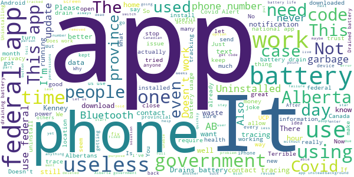

> This app requires more updating than any other app I've ever downloaded, and when it requires an update it stops everything on my phone. Not worth it. Figure out what your doing with the app.  :date: __2021-05-13 12:16:35__

> Kept it on only because it was self sufficient. It's a useless piece of garbage. Given that the Alberta government was never really interested in actually tracing, I'm not surprised. Garbage app from a garbage government.  :date: __2021-05-13 06:34:02__

> Constantly turning off which defeats the point of the app  :date: __2021-05-09 18:02:58__

> Hey why not use what the rest of Canada is using?! Tell your MP their stubbornness is killing Albertans! This waste of taxpayer $$ can't be salvaged but they should still authorize the federal app! Meantime you can download that one anyways - it works if you sign in as a different province like SK.  :date: __2021-05-08 23:48:28__

> FIX THIS NOW! App just told me I needed to UPDATE BUT Only because I accidentally clicked the icon. (strike 1) It has gone from using maybe 2-3% battery in a day to that in an hour! (strike 2 & 3) My phone went from 100% to 80% in 2 hours of just sitting there and looking at the battery usage this app was nearly 6%! Compare that to the play store app and the same time frame was 1%.  :date: __2021-05-05 17:51:26__

> Unusable after the most recent update. Crashes if Bluetooth is enabled. Can't even tell if it's running, or just killing my battery with constant app crashes and restarts. I've tried everything. After it's set up with my phone number, I can never open the app again, it just sits forever on a blank screen. I'd love to do my part and help the contract tracers, but this app is not the solution it should have been. Uninstalling again. I'll try again after the next update.  :date: __2021-05-04 23:48:31__

> Never ever have i had an alert. Is this thing on?  :date: __2021-05-03 17:40:01__

> this app is garbage  :date: __2021-05-01 22:43:20__

> I don't understand how this app is supposed to stop the spread of covid?? what exactly is the app supposed to do?  :date: __2021-05-01 07:54:08__

> Excessive battery drain.  :date: __2021-04-30 16:43:09__

# Canada COVID-19
App version ``5.4.0``

Analyzed with [covid-apps-observer](http://github.com/covid-apps-observer) project, version ``0.1``

## App overview
| | |
|-------------------------|-------------------------| 
| **Name**&nbsp;&nbsp;&nbsp;&nbsp;&nbsp;&nbsp;&nbsp;&nbsp;&nbsp;&nbsp;&nbsp;&nbsp;&nbsp;&nbsp;&nbsp;&nbsp;&nbsp;&nbsp;&nbsp;&nbsp;&nbsp;&nbsp;&nbsp;&nbsp;&nbsp;&nbsp;&nbsp;&nbsp;&nbsp;&nbsp;&nbsp;&nbsp;&nbsp;&nbsp;&nbsp;&nbsp;&nbsp;&nbsp;&nbsp;&nbsp;  | Canada COVID-19 |
| **Unique identifier** | ca.gc.hcsc.canada.covid19 |
| **Link to Google Play** | [https://play.google.com/store/apps/details?id=ca.gc.hcsc.canada.covid19](https://play.google.com/store/apps/details?id=ca.gc.hcsc.canada.covid19) |
| **Summary**  | Stay informed about COVID-19. Developed in collaboration with Thrive Health. |
| **Privacy policy** | [https://www.thrive.health/covid19-collection-notice](https://www.thrive.health/covid19-collection-notice) |
| **Latest version** | 5.4.0 |
| **Last update** | 2021-01-11 17:55:19 |
| **Recent changes** | We are constantly optimizing our app and adding new features to help support you through COVID-19.  This version includes a number of UI/UX improvements, new content, as well as stability enhancements. |
| **Installs**  | 100,000+ |
| **Category** | Medical |
| **First release** | Mar 30, 2020 |
| **Size**  | 9.3M |
| **Supported Android version**  | 5.0 and up |

### Description
> Canada COVID-19 is designed for you to stay informed about COVID-19 in Canada and determine what actions and next steps you should take.  Recommendations are personalized and based on your personal risk factors.  You will receive timely updates with important news and alerts from Canada’s Ministry of Health.  Recommendations and content are automatically updated based on the latest guidelines related to COVID-19.
 This application has been developed in collaboration with Thrive Health, a Vancouver-based healthcare technology company.  
 SAFETY & SECURITY:
 You will only be asked to provide your age, postal code, and device location.  The data you provide will be combined with all user data and used to inform the provincial COVID-19 response, and to allow you to receive location-based alerts.
 Your data will not be sold. Your data will not be used for any purpose other than health care.
 We follow industry best practices for data security and privacy.  The data you provide is always encrypted and is stored in Canada.

### User interface
The developers of the app provide the following screenshots in the Google play store.
| | | |
|:-------------------------:|:-------------------------:|:-------------------------:|
 |   |  

## Development team
In the following we report the main information provided by the development team in the Google play store.

| | |
|-------------------------|-------------------------|
| **Developer**  | Health Canada | Santé Canada |
| **Website**  | - |
| **Email** | support@thrive.health |
| **Physical address**  | - |
| **Other developed apps**  | [https://play.google.com/store/apps/developer?id=Health+Canada+%7C+Sant%C3%A9+Canada](https://play.google.com/store/apps/developer?id=Health+Canada+%7C+Sant%C3%A9+Canada) |

## Android support

| | |
|-------------------------|-------------------------|
| **Declared target Android version**  | Android10, version 10 (API level 29) |
| **Effective target Android version**  | Android10, version 10 (API level 29) |
| **Minimum supported Android version**  | Lollipop, version 5.0 (API level 21) |
| **Maximum target Android version**  | - |

The larger the difference between the minimum and maximum supported Android versions, the better. A larger difference means a wider audience. For example, old phones have a very low Android version, so a high minimum supported Android version means that the app cannot be used by users with old phones, thus leading to accessibility problems. 

## Requested permissions

In the following we report the complete list of the permissions requested by the app. 

| **Permission** | **Protection level** | **Description** | 
|-------------------------|-------------------------|-------------------------|
 **android.permission ACCESS_COARSE_LOCATION** | :warning:**Dangerous** | Allows an app to access approximate location. 
 **android.permission ACCESS_FINE_LOCATION** | :warning:**Dangerous** | Allows an app to access precise location. 
 **android.permission ACCESS_NETWORK_STATE** | Normal | Allows applications to access information about networks. 
 **android.permission CAMERA** | :warning:**Dangerous** | Required to be able to access the camera device. 
 **android.permission INTERNET** | Normal | Allows applications to open network sockets. 
 **android.permission READ_EXTERNAL_STORAGE** | :warning:**Dangerous** | Allows an application to read from external storage. 
 **android.permission REQUEST_INSTALL_PACKAGES** | Signature | Allows an application to request installing packages. 
 **com.google.android.c2dm.permission RECEIVE** | - | - 
 **com.google.android.finsky.permission BIND_GET_INSTALL_REFERRER_SERVICE** | - | - 

## Mentioned servers

| **Server** | **Registrant** | **Registrant country** | **Creation date** | 
|-------------------------|-------------------------|-------------------------|-------------------------|
 | googlesyndication.com | Google LLC | :us: US | 2003-01-21 06:17:24 |
 | google.com | Google LLC | :us: US | 1997-09-15 04:00:00 |
 | app-measurement.com | Google LLC | :us: US | 2015-06-19 20:13:31 |
 | branch.io | Branch | :us: US | 2011-11-10 13:52:13 |
 | crashlytics.com | Google LLC | :us: US | 2011-01-21 15:30:40 |
 | gstatic.com | Google LLC | :us: US | 2008-02-11 15:31:25 |
 | bnc.lt | - | - | 2016-11-14 00:00:00 |
 | googleapis.com | Google LLC | :us: US | 2005-01-25 17:52:26 |
 | googleadservices.com | Google LLC | :us: US | 2003-06-19 16:34:53 |

## Security analysis 

Below we report the main security warnings raised by our execution of the [Androwarn](https://github.com/maaaaz/androwarn) security analysis tool.

**Location lookup**
> - This application reads location information from all available providers (WiFi, GPS etc.) 

**Connection interfaces exfiltration**
> - This application reads details about the currently active data network 
> - This application tries to find out if the currently active data network is metered 

**Pim data leakage**
> - This application accesses the downloads folder 
> - This application accesses data stored in the clipboard 

## User ratings and reviews

Below we provide information about how end users are reacting to the app in terms of ratings and reviews in the Google Play store.

### Ratings

The Canada COVID-19 app has been installed by more than **100000** times. At this time, **837** rated the app and its average score is **3.63**. Below we show the distribution of the ratings across the usual star-based rating of Google Play

:star::star::star::star::star:: 419

:star::star::star::star:: 109

:star::star::star:: 75

:star::star:: 50

:star:: 184

### Reviews 

#### 5-star reviews

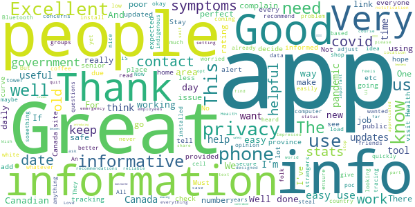

> Information is great  :date: __2021-02-11 21:49:48__

> Thank you, Canada 🇨🇦! شكراً كندا..  :date: __2021-01-16 15:53:54__

> I use it some times it's okay  :date: __2020-12-20 20:47:51__

> Great to be monitored.  :date: __2020-12-08 09:26:26__

> Easy to use... The more people that use it, the more useful it becomes as a tracking tool!!!  :date: __2020-11-27 22:41:53__

> It's amazing  :date: __2020-11-23 07:53:48__

> Good way to get information on the viruses  :date: __2020-11-15 13:01:53__

> Very useful and helpful, thanks for introducing this app through out the pandemic  :date: __2020-11-07 00:02:13__

> Get the app. Stay safe.  :date: __2020-10-29 03:27:31__

> Seamless  :date: __2020-10-16 02:54:07__

#### 4-star reviews

> Works great. One beef is that if you ever get a recommendation it never goes away, nor does it say what date you got that recommendation.  :date: __2021-02-07 20:10:31__

> Great tech on a fantastic mission.  :date: __2021-01-05 02:10:47__

> I think the app is very important and I use it daily to check in. However 14 day isolation for a headache?  :date: __2020-10-30 00:26:24__

> Needs a dark mode.  :date: __2020-09-25 07:43:49__

> In French there are some words misspelled toteaux should be totaux  :date: __2020-09-04 05:41:23__

> Good  :date: __2020-08-30 14:21:55__

> The app doesn't let you know if you come in contact with someone who has C0VID19. This needs improvement. Otherwise it's a good app.  :date: __2020-08-16 08:19:12__

> Its pretty cool but i kinda wish it had it so you can see what are other peoples symptoms are in your area for people using the app.. kinda how snapchat has snap spots in your area. Other then that pretty cool.  :date: __2020-08-02 18:40:50__

> It takes a long time to find link I want but generally a great source.  :date: __2020-07-31 18:10:34__

> This great for your peace of mind  :date: __2020-07-29 21:26:39__

#### 3-star reviews

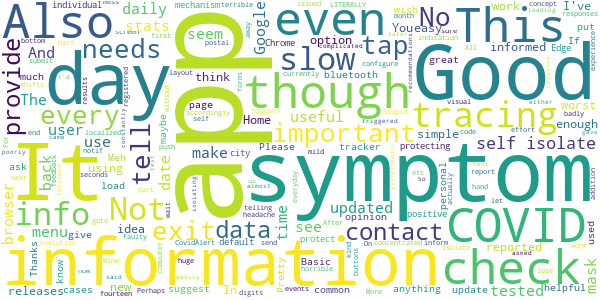

> Not enough down loads to make it a useful All.  :date: __2021-02-10 15:00:13__

> Good  :date: __2021-02-09 19:55:38__

> Faulty app  :date: __2021-02-07 03:34:53__

> Slow, goto do our part though!  :date: __2021-01-31 15:25:06__

> More localized COVID-19 info would be useful. Perhaps user should configure first 3 digits of postal code and informed accordingly. In addition, could this app inform us when new releases of the #CovidAlert app are issued (since the notif app does not currently push that kind of useful info)?  :date: __2021-01-11 16:42:18__

> I think the app is important, however, everyday it's telling me I have to self isolate every. I haven't reported or have any symptoms, why does it tell me to self isolate?  :date: __2021-01-10 19:54:18__

> Good concept, terrible execution: huge layout shifts and slow responses with no visual feedback on tap events make for a horrible user experience. It's hard to mess up buttons and forms this badly without some concentrated effort.  :date: __2020-11-21 15:10:55__

> Mine won't work away from computer  :date: __2020-11-10 17:19:45__

> Good idea. I've been using it for a while now. On the other hand it tells me I should self-isolate for fourteen days LITERALLY EVERY TIME I self-report - even after a month of "no symptoms". The worst I've ever reported is a mild headache. I don't get it.  :date: __2020-11-05 17:55:23__

> Stupid app wont let me send the daily check in results  :date: __2020-10-08 08:32:50__

#### 2-star reviews

> Monotonus doesnt give any relevant info.  :date: __2021-01-16 05:40:33__

> Original complaints I have remain since first release: 1) Extremely slow. 2) No proper way to exit app Android 6.0.1.  :date: __2021-01-12 23:17:02__

> Super slow, lots of lag and very delayed user input! Not sure what all this app does and is doing, but it seems that 1 minute for tapping 6 times to enter daily checkup info is excessively long and a waste of time. This review took less time than 1 daily checkup.  :date: __2021-01-12 17:24:08__

> Crashes  :date: __2021-01-11 12:15:36__

> Keeps asking for codes that I don't have, or can't put in as it's a 1 time code.  :date: __2020-12-19 18:53:15__

> Good to have app but it is quite slow to load the self check page. Please make it faster  :date: __2020-12-02 14:31:08__

> I thought this was the tracker app. It isn't and it really isn't useful  :date: __2020-10-07 04:46:06__

> Good  :date: __2020-08-11 04:03:41__

> Pretty useless for the user The app is nothing but a questionnaire that might help Health Canada from volunteer self evaluators, but shows no live data of infection risk around me like the Arogya Setu App from India. Privacy superceded public health.  :date: __2020-08-06 05:42:16__

> Why does it need access to photos?  :date: __2020-08-01 11:55:35__

#### 1-star reviews

> Not compatible with my device. I keep waiting for it to be compatible but it never is. The original version of the app was compatible. I got notices when I came into contact with others who had the app. I installed an update and now nothing. The app is junk if it is compatable with only a limited number of devices. Make it so! I have a Galaxy Tab A.  :date: __2021-02-12 18:12:05__

> So buggy and laggy, this needs to be fixed.  :date: __2021-02-05 05:51:01__

> Useless  :date: __2021-01-29 01:13:28__

> The Johns Hopkins website has much more current data about Canada, which is disconcerting. Otherwise it's nothing but advice to stay home and wash your hands. Good advice, but no data = not useful. Edit: Kept it on my phone in case it became more useful. It didn't. Have now deleted it.  :date: __2021-01-17 15:10:02__

> 0 The app shuts down before being completed.  :date: __2021-01-14 21:24:38__

> Error problems  :date: __2021-01-14 18:40:00__

> Big brother Spyware. Biggest joke over a 99.99% survival flu. Huge power trip and over reach by authoritarian government allowed by weak people who do not value freedoms and have never experienced hardship in their lives. Creeping normality of tyrannical control. End the lockdown. No more masks. No more tyrannical control.  :date: __2021-01-10 08:39:13__

> App does not work!  :date: __2021-01-08 17:25:00__

> Tests my patience! If I didn't think it was important to report COVID-19 symptoms, I would never use this app! It is so slow, and I mean slow that you don't know if it has sensed my touch selection or not so you tap again and again! Keeps showing that the app encountered an error when I load this app. Why did you move the Daily Check-In from being the first item on the page when it starts?!  :date: __2021-01-01 16:44:30__

> Since last update Stats don't update at all like is use to do for every day the stats for the day don't display  :date: __2020-12-28 01:23:01__

# WHO Info
App version ``4.1.0``

Analyzed with [covid-apps-observer](http://github.com/covid-apps-observer) project, version ``0.1``

## App overview
| | |
|-------------------------|-------------------------| 
| **Name**&nbsp;&nbsp;&nbsp;&nbsp;&nbsp;&nbsp;&nbsp;&nbsp;&nbsp;&nbsp;&nbsp;&nbsp;&nbsp;&nbsp;&nbsp;&nbsp;&nbsp;&nbsp;&nbsp;&nbsp;&nbsp;&nbsp;&nbsp;&nbsp;&nbsp;&nbsp;&nbsp;&nbsp;&nbsp;&nbsp;&nbsp;&nbsp;&nbsp;&nbsp;&nbsp;&nbsp;&nbsp;&nbsp;&nbsp;&nbsp;  | WHO Info |
| **Unique identifier** | org.who.infoapp |
| **Link to Google Play** | [https://play.google.com/store/apps/details?id=org.who.infoapp](https://play.google.com/store/apps/details?id=org.who.infoapp) |
| **Summary**  | The official World Health Organization Information App. |
| **Privacy policy** | [https://www.who.int/about/who-we-are/privacy-policy](https://www.who.int/about/who-we-are/privacy-policy) |
| **Latest version** | 4.1.0 |
| **Last update** | 2021-01-14 10:10:28 |
| **Recent changes** | This release introduces &quot;Health Topics&quot;. &quot;Health Topics&quot; provide additional information about favourite health topics. |
| **Installs**  | 500,000+ |
| **Category** | News & Magazines |
| **First release** | Apr 13, 2020 |
| **Size**  | 12M |
| **Supported Android version**  | 4.2 and up |

### Description
> Have the latest health information at your fingertips with the official World Health Organization Information App. This app displays the latest news, events, features and breaking updates on outbreaks. 
  
 WHO works worldwide to promote health, keep the world safe, and serve the vulnerable. 
 Our goal is to ensure that a billion more people have universal health coverage, to protect a billion more people from health emergencies, and provide a further billion people with better health and well-being.

### User interface
The developers of the app provide the following screenshots in the Google play store.
| | | |
|:-------------------------:|:-------------------------:|:-------------------------:|
 |   |   |   | 
 |   |   |   | 
 |   |   |   | 
 |   |   |   | 
 |   |   |   | 
 |   |   |   | 
 |   |   |   | 
 |   |   |   | 

## Development team
In the following we report the main information provided by the development team in the Google play store.

| | |
|-------------------------|-------------------------|
| **Developer**  | World Health Organization |
| **Website**  | [https://www.who.int/](https://www.who.int/) |
| **Email** | dcx@who.int |
| **Physical address**  | [Avenu Appia 20 1211 Geneva Switzerland](https://www.google.com/maps/search/Avenu%20Appia%2020%201211%20Geneva%20Switzerland) (Google Maps) |
| **Other developed apps**  | [https://play.google.com/store/apps/developer?id=World+Health+Organization](https://play.google.com/store/apps/developer?id=World+Health+Organization) |

## Android support

| | |
|-------------------------|-------------------------|
| **Declared target Android version**  | - |
| **Effective target Android version**  | - |
| **Minimum supported Android version**  | Jelly Bean, version 4.2.x (API level 17) |
| **Maximum target Android version**  | - |

The larger the difference between the minimum and maximum supported Android versions, the better. A larger difference means a wider audience. For example, old phones have a very low Android version, so a high minimum supported Android version means that the app cannot be used by users with old phones, thus leading to accessibility problems. 

## Requested permissions

In the following we report the complete list of the permissions requested by the app. 

| **Permission** | **Protection level** | **Description** | 
|-------------------------|-------------------------|-------------------------|
 **android.permission ACCESS_NETWORK_STATE** | Normal | Allows applications to access information about networks. 
 **android.permission INTERNET** | Normal | Allows applications to open network sockets. 
 **android.permission READ_CALENDAR** | :warning:**Dangerous** | Allows an application to read the user's calendar data. 
 **android.permission READ_EXTERNAL_STORAGE** | :warning:**Dangerous** | Allows an application to read from external storage. 
 **android.permission WAKE_LOCK** | Normal | Allows using PowerManager WakeLocks to keep processor from sleeping or screen from dimming. 
 **android.permission WRITE_CALENDAR** | :warning:**Dangerous** | Allows an application to write the user's calendar data. 
 **android.permission WRITE_EXTERNAL_STORAGE** | :warning:**Dangerous** | Allows an application to write to external storage. 
 **com.google.android.c2dm.permission RECEIVE** | - | - 
 **com.google.android.finsky.permission BIND_GET_INSTALL_REFERRER_SERVICE** | - | - 

## Mentioned servers

| **Server** | **Registrant** | **Registrant country** | **Creation date** | 
|-------------------------|-------------------------|-------------------------|-------------------------|
 | adobe.com | Adobe Inc. | :us: US | 1986-11-17 05:00:00 |
 | googlesyndication.com | Google LLC | :us: US | 2003-01-21 06:17:24 |
 | google.com | Google LLC | :us: US | 1997-09-15 04:00:00 |
 | app-measurement.com | Google LLC | :us: US | 2015-06-19 20:13:31 |
 | googleapis.com | Google LLC | :us: US | 2005-01-25 17:52:26 |
 | googleadservices.com | Google LLC | :us: US | 2003-06-19 16:34:53 |

## Security analysis 

Below we report the main security warnings raised by our execution of the [Androwarn](https://github.com/maaaaz/androwarn) security analysis tool.

**Connection interfaces exfiltration**
> - This application reads details about the currently active data network 
> - This application tries to find out if the currently active data network is metered 

**Suspicious connection establishment**
> - This application opens a Socket and connects it to the remote address 'Lfi/iki/elonen/NanoHTTPD$ResponseException;' on the 'N/A' port  
> - This application opens a Socket and connects it to the remote address 'NanoHttpd Shutdown' on the 'N/A' port  

**Code execution**
> - This application loads a native library: 'NativeScript' 
> - This application executes a UNIX command containing this argument: '2' 

## User ratings and reviews

Below we provide information about how end users are reacting to the app in terms of ratings and reviews in the Google Play store.

### Ratings

The WHO Info app has been installed by more than **500000** times. At this time, **1114** rated the app and its average score is **4.108108**. Below we show the distribution of the ratings across the usual star-based rating of Google Play

:star::star::star::star::star:: 754

:star::star::star::star:: 90

:star::star::star:: 60

:star::star:: 60

:star:: 150

### Reviews 

#### 5-star reviews

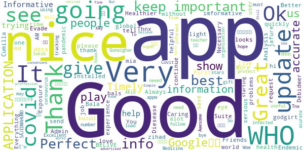

> Friends is godgirt  :date: __2021-04-27 06:51:26__

> Like it  :date: __2021-04-08 13:28:53__

> I love this app its very important for me to see what's going on in the world of Who as very imformative app  :date: __2021-03-30 14:48:27__

> Good  :date: __2021-03-24 19:33:39__

> Very good  :date: __2021-03-23 07:14:57__

> 9/12/2020  :date: __2021-03-12 11:25:34__

> Good  :date: __2021-01-17 13:53:04__

> Gives global data on covid 19 updates.  :date: __2021-01-07 08:43:58__

> Very nice app for health.  :date: __2020-12-12 06:15:46__

> Great. Installed quickly without problems. :-)  :date: __2020-11-15 16:31:45__

#### 4-star reviews

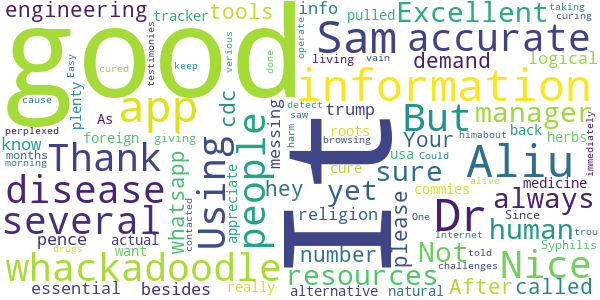

> It's always good in human resources manager  :date: __2021-03-18 00:21:01__

> Not sure yet  :date: __2020-09-27 08:50:53__

> Excellent engineering tools. Your whatsapp number please.  :date: __2020-08-05 11:01:52__

> all the demand who it is hey  :date: __2020-07-20 15:10:48__

> Using this more and more. After the cdc called religion an essential. I don't know what whackadoodle besides trump/pence is messing with the info. Thank you for being a more logical alternative. As usa is being pulled back by whackadoodles and foreign commies.  :date: __2020-07-17 03:09:14__

> Nice  :date: __2020-07-08 17:19:26__

> good  :date: __2020-06-03 00:37:10__

> It's just information, not the actual tracker. But has plenty of information that's 100% accurate.  :date: __2020-05-31 02:37:20__

> I really want to appreciate Dr. Aliu Sam for using his natural roots and herbs medicine to cure me of Syphilis Since 11 months now I have been living with this disease and it has been giving me challenges, I was so perplexed cause I have been taking several drugs to be cured but all have been in vain. One morning I was browsing through the Internet then i saw several testimonies about Dr. Aliu Sam curing people off verious diseases and immediately I contacted Dr. Aliu Sam I told himabout my trou  :date: __2020-05-08 05:33:57__

> It did not detect  :date: __2020-04-29 18:37:26__

#### 3-star reviews

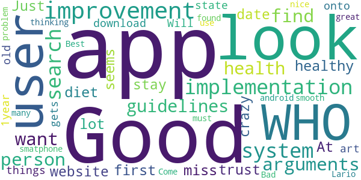

> A good improvement could be the implementation of a search system for arguments that a person want to find ( like the guidelines about health and healthy diet). At first look seems it miss a lot from the website.  :date: __2020-09-27 10:09:16__

> Good App but I don't trust the WHO. Just have the app to stay up to date with the crazy things the WHO gets up to  :date: __2020-07-29 10:34:08__

> Will not download onto my 1year old state of the art smatphone. Bad, as a user of many android apps what are you thinking. I have found more than 3700 other users that can not use this app. Come on you must no you have problem.  :date: __2020-05-26 02:04:59__

> Good  :date: __2020-05-14 21:22:11__

> Best.  :date: __2020-04-20 13:14:33__

> Looks nice great look smooth Lario  :date: __2020-04-18 09:44:30__

#### 2-star reviews

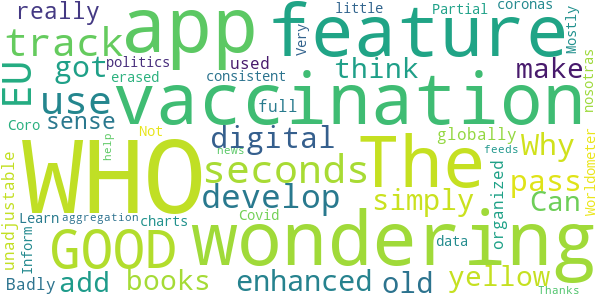

> GOOD  :date: __2021-04-28 06:11:46__

> I had the app only a few seconds. I was wondering if we can use it to track vaccination. I am wondering. The EU develop a digital vaccination pass. Why does this app got not simply enhanced. The old yellow books were also from the WHO. Can you add such a feature? I think it would make really sense if the WHO had this feature in it and it can be globally used.  :date: __2021-04-04 23:04:57__

> Badly organized, unadjustable, and full of politics,i erased it  :date: __2020-11-13 07:29:53__

> Coro nosotras coronas  :date: __2020-07-02 06:41:55__

> Partial  :date: __2020-06-22 12:24:23__

> Learn more  :date: __2020-06-15 23:35:50__

> WHO Inform Covid 19  :date: __2020-05-24 17:14:56__

> Very little data or charts. Not consistent with Worldometer. Mostly an aggregation of news feeds about WHO  :date: __2020-05-15 15:38:10__

> Thanks for your help.  :date: __2020-04-22 18:52:40__

#### 1-star reviews

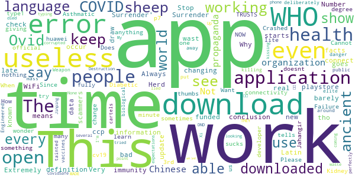

> This app is as is the definition of w.h.o. it barely works, it ccp funded, and is late with useless information.  :date: __2021-03-31 11:03:41__

> Herd immunity is real. Stop changing facts  :date: __2021-03-14 16:25:09__

> I do not like the new update.  :date: __2021-01-19 23:39:15__

> Says I can't connect even tho I have WiFi and data on  :date: __2021-01-04 02:35:04__

> Extremely bad application. Always not working at all. Why do you keep it in the playstore?!  :date: __2020-12-15 16:13:48__

> A wast of time  :date: __2020-11-04 13:04:20__

> “‘Ovid’ is Latin for a sheep. COVID starts with a C, which also means ‘see’ in ancient language. 19 was known as the “Number of Surrender†in ancient times.† It goes on to draw the conclusion, “C-OVID 19 = ‘See a Sheep Surrender'â€.  :date: __2020-11-02 08:06:17__

> Very scammers  :date: __2020-10-19 19:45:47__

> I just downloaded it, but every time I open it just say "an error occur check your connectivity" or something like that... didn't work...  :date: __2020-10-10 17:24:54__

> Does not work  :date: __2020-10-09 00:12:33__

# OpenWHO: Knowledge for Health Emergencies
App version ``3.7``

Analyzed with [covid-apps-observer](http://github.com/covid-apps-observer) project, version ``0.1``

## App overview
| | |
|-------------------------|-------------------------| 
| **Name**&nbsp;&nbsp;&nbsp;&nbsp;&nbsp;&nbsp;&nbsp;&nbsp;&nbsp;&nbsp;&nbsp;&nbsp;&nbsp;&nbsp;&nbsp;&nbsp;&nbsp;&nbsp;&nbsp;&nbsp;&nbsp;&nbsp;&nbsp;&nbsp;&nbsp;&nbsp;&nbsp;&nbsp;&nbsp;&nbsp;&nbsp;&nbsp;&nbsp;&nbsp;&nbsp;&nbsp;&nbsp;&nbsp;&nbsp;&nbsp;  | OpenWHO: Knowledge for Health Emergencies |
| **Unique identifier** | de.xikolo.openwho |
| **Link to Google Play** | [https://play.google.com/store/apps/details?id=de.xikolo.openwho](https://play.google.com/store/apps/details?id=de.xikolo.openwho) |
| **Summary**  | Life-saving knowledge for frontline responders in health emergencies. |
| **Privacy policy** | [https://openwho.org/pages/privacy](https://openwho.org/pages/privacy) |
| **Latest version** | 3.7 |
| **Last update** | 2020-11-23 13:57:15 |
| **Recent changes** | - Bug fixes and performance improvements |
| **Installs**  | 1,000,000+ |
| **Category** | Education |
| **First release** | May 17, 2017 |
| **Size**  | 18M |
| **Supported Android version**  | 5.0 and up |

### Description
> OpenWHO is the World Health Organization's (WHO) interactive knowledge-transfer platform offering online courses to improve the response to health emergencies. OpenWHO enables the Organization and its key partners to transfer life-saving knowledge to large numbers of frontline responders.
 With OpenWHO, you have the flexibility to learn at your convenience. Watch the short video lectures and test your knowledge with self-tests when and where you like. The course forum and the collaboration space allow you to get in touch with other participants and experts around the world.
  
 Designed primarily for health care workers, frontline responders, and decision-makers, the app is also a source of information for those affected by disease outbreaks and health emergencies, or for those with a general interest in WHO's work in health emergencies.
  
 It features 6 channels:
 - The <b>Outbreak</b> channel addresses the management of infectious diseases and provides life-saving, scientific information.
 - The <b>Ready for Response</b> channel helps prepare personnel who are training for deployment to work in disease outbreaks and health emergencies.
 - The <b>Get Social</b> channel focuses on social science-based interventions and helps to communicate with affected communities.
 - The <b>Preparing for Pandemics</b> channel brings together courses on various aspects of preparedness, including surveillance, public health measures and risk communication during a pandemic.
 - The <b>COVID-19</b> channel provides learning resources in WHO's 6 official languages (Arabic, Chinese, English, French, Russian and Spanish) for health professionals, decision-makers and the public for the outbreak of coronavirus disease (COVID-19).
 - The <b>COVID-19 National Languages</b> channel provides the same learning resources as the COVID-19 channel but in national languages, such as Indonesian, Japanese and Portuguese. 
  
 OpenWHO courses are available in many languages, including WHO's 6 official languages. 
  
 Download the app now, and join the OpenWHO community.
 This app is developed in cooperation between the Hasso Plattner Institute and the WHO. The learning content is provided exclusively by the WHO.

### User interface
The developers of the app provide the following screenshots in the Google play store.
| | | |
|:-------------------------:|:-------------------------:|:-------------------------:|
 |   |   |   | 
 |   |   |   | 

## Development team
In the following we report the main information provided by the development team in the Google play store.

| | |
|-------------------------|-------------------------|
| **Developer**  | HPI Knowledge Engineering Team |
| **Website**  | [https://openwho.org/](https://openwho.org/) |
| **Email** | openwho-support@hpi.de |
| **Physical address**  | [Prof.-Dr.-Helmert-Str.2-3 14482 Potsdam](https://www.google.com/maps/search/Prof.-Dr.-Helmert-Str.2-3%2014482%20Potsdam) (Google Maps) |
| **Other developed apps**  | [https://play.google.com/store/apps/developer?id=7185448023325736337](https://play.google.com/store/apps/developer?id=7185448023325736337) |

## Android support

| | |
|-------------------------|-------------------------|
| **Declared target Android version**  | - |
| **Effective target Android version**  | - |
| **Minimum supported Android version**  | Lollipop, version 5.0 (API level 21) |
| **Maximum target Android version**  | - |

The larger the difference between the minimum and maximum supported Android versions, the better. A larger difference means a wider audience. For example, old phones have a very low Android version, so a high minimum supported Android version means that the app cannot be used by users with old phones, thus leading to accessibility problems. 

## Requested permissions

In the following we report the complete list of the permissions requested by the app. 

| **Permission** | **Protection level** | **Description** | 
|-------------------------|-------------------------|-------------------------|
 **android.permission ACCESS_NETWORK_STATE** | Normal | Allows applications to access information about networks. 
 **android.permission ACCESS_WIFI_STATE** | Normal | Allows applications to access information about Wi-Fi networks. 
 **android.permission DOWNLOAD_WITHOUT_NOTIFICATION** | - | - 
 **android.permission FOREGROUND_SERVICE** | Normal | Allows a regular application to use Service.startForeground. 
 **android.permission INTERNET** | Normal | Allows applications to open network sockets. 
 **android.permission RECEIVE_BOOT_COMPLETED** | Normal | Allows an application to receive the Intent.ACTION_BOOT_COMPLETED that is broadcast after the system finishes booting. 
 **android.permission WAKE_LOCK** | Normal | Allows using PowerManager WakeLocks to keep processor from sleeping or screen from dimming. 
 **android.permission WRITE_EXTERNAL_STORAGE** | :warning:**Dangerous** | Allows an application to write to external storage. 
 **com.google.android.c2dm.permission RECEIVE** | - | - 
 **com.google.android.finsky.permission BIND_GET_INSTALL_REFERRER_SERVICE** | - | - 

## Mentioned servers

| **Server** | **Registrant** | **Registrant country** | **Creation date** | 
|-------------------------|-------------------------|-------------------------|-------------------------|
 | googlesyndication.com | Google LLC | :us: US | 2003-01-21 06:17:24 |
 | google.com | Google LLC | :us: US | 1997-09-15 04:00:00 |
 | apple.com | Apple Inc. | :us: US | 1987-02-19 05:00:00 |
 | aomedia.org | Contact Privacy Inc. Customer 1243324949 | :canada: CA | 2015-08-24 14:07:31 |
 | dashif.org | VTM Group | :us: US | 2012-04-27 13:02:46 |
 | app-measurement.com | Google LLC | :us: US | 2015-06-19 20:13:31 |
 | w3.org | W3C | :us: US | 1994-07-06 04:00:00 |
 | googleapis.com | Google LLC | :us: US | 2005-01-25 17:52:26 |
 | psdev.de | - | - | - |
 | xmlpull.org | WhoisGuard, Inc. | PA | 2001-11-26 20:33:08 |
 | crashlytics.com | Google LLC | :us: US | 2011-01-21 15:30:40 |
 | apache.org | The Apache Software Foundation | :us: US | 1995-04-11 04:00:00 |
 | opensource.org | Open Source Initiative | :us: US | 1998-02-11 05:00:00 |
 | creativecommons.org | Creative Commons Corporation | :canada: CA | 2001-01-15 16:51:44 |
 | eclipse.org | Eclipse.org Foundation, Inc. | :canada: CA | 1997-04-14 04:00:00 |
 | gnu.org | Free Software Foundation | :us: US | 1995-11-24 05:00:00 |
 | mozilla.org | Mozilla Corporation | :us: US | 1998-01-24 05:00:00 |
 | googleadservices.com | Google LLC | :us: US | 2003-06-19 16:34:53 |

## Security analysis 

Below we report the main security warnings raised by our execution of the [Androwarn](https://github.com/maaaaz/androwarn) security analysis tool.

**Telephony identifiers leakage**
> - This application reads the ISO country code equivalent of the current registered operator's MCC (Mobile Country Code) 
> - This application reads the MCC+MNC of the provider of the SIM 

**Connection interfaces exfiltration**
> - This application reads details about the currently active data network 
> - This application tries to find out if the currently active data network is metered 

**Suspicious connection establishment**
> - This application opens a Socket and connects it to the remote address ' returned no addresses for  ; port is out of range' on the 'N/A' port  
> - This application opens a Socket and connects it to the remote address '' on the 'N/A' port  
> - This application opens a Socket and connects it to the remote address 'Ljava/lang/StringBuilder;->toString()Ljava/lang/String;' on the 'N/A' port  
> - This application opens a Socket and connects it to the remote address 'Ljava/net/Proxy;->type()Ljava/net/Proxy$Type;' on the 'N/A' port  
> - This application opens a Socket and connects it to the remote address 'timeout' on the 'N/A' port  

**Code execution**
> - This application loads a native library 

## User ratings and reviews

Below we provide information about how end users are reacting to the app in terms of ratings and reviews in the Google Play store.

### Ratings

The OpenWHO: Knowledge for Health Emergencies app has been installed by more than **1000000** times. At this time, **3403** rated the app and its average score is **4.2647057**. Below we show the distribution of the ratings across the usual star-based rating of Google Play

:star::star::star::star::star:: 2403

:star::star::star::star:: 370

:star::star::star:: 130

:star::star:: 130

:star:: 370

### Reviews 

#### 5-star reviews

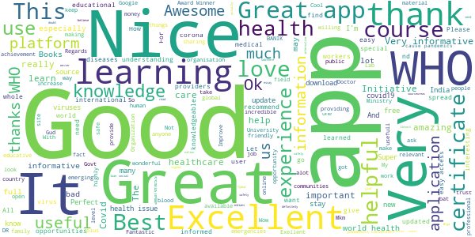

> Great courses available, glad I signed up!  :date: __2021-05-08 06:00:42__

> nice  :date: __2021-04-26 00:57:17__

> Love social work with love of nation.  :date: __2021-04-22 17:30:04__

> It's very usefull app  :date: __2021-04-18 18:42:21__

> I actually love this app. It's useful! I can read and internalize the whole things there. Thanks a lot!  :date: __2021-04-09 09:11:56__

> I am from India and I trust WHO. All indians love WHO, sobthere isn't much doubt to not believe this app.  :date: __2021-03-31 06:34:06__

> Covid 19 loan  :date: __2021-03-19 17:57:06__

> Good platform for learning  :date: __2021-03-15 18:21:49__

> Better Application health safety  :date: __2021-03-13 19:19:47__

> Yydud  :date: __2021-03-11 11:20:39__

#### 4-star reviews

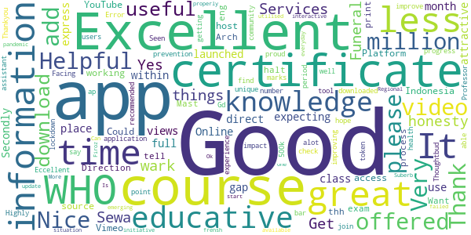

> Funeral Sewa Services  :date: __2021-04-21 07:58:33__

> Helpful  :date: __2021-03-17 21:04:11__

> Excellent  :date: __2021-03-15 02:41:11__

> Get the things that wark in all honesty s Yes it does  :date: __2021-01-11 02:38:09__

> WHO has offered great courses but we're expecting more courses within less time gap as it's been month's since WHO has launched any course.Secondly,there is no direct place offered in the WHO app to express our views.  :date: __2020-12-11 07:27:50__

> Online course class is use full  :date: __2020-07-17 11:52:09__

> Excellent information but less attractive for the most  :date: __2020-07-02 17:54:08__

> Good working  :date: __2020-06-28 08:53:05__

> Could you please host the videos also on YouTube, since we cannot access the Vimeo Platform here in Indonesia. Thank you.  :date: __2020-06-24 07:38:57__

> Good source of information  :date: __2020-06-20 09:36:05__

#### 3-star reviews

> Good info  :date: __2020-12-24 16:44:57__

> I feel a bit disappointed, experienced a lot of errors. My module and videos can't be loaded.  :date: __2020-07-26 17:32:06__

> Great app, but my only problem is that I can't open my certificate file. Says invalid format. Disappointing 😭  :date: __2020-07-23 02:09:56__

> Videos were not working only, so I uninstalled it.  :date: __2020-07-18 08:42:28__

> I have finished two courses on two different date(one before midnight, another after midnight) but found same date on both while I downloaded Certificates. Why is this?  :date: __2020-06-11 19:18:50__

> covid  :date: __2020-06-11 18:37:22__

> Sir, Plzz improve the quality of the certificate awarded by the WHO to the participants to increase more & more participation as well as awareness of the people in this contest organised by OpenWHO.  :date: __2020-05-24 16:44:50__

> Some extent it's very good and its provide guidelines to advert disease.  :date: __2020-05-23 18:33:55__

> Nice app however difficult to watch video presentations  :date: __2020-05-14 19:35:42__

> Very confusing. not happy with the link. I don't know if I have done it correctly.  :date: __2020-05-12 22:12:31__

#### 2-star reviews

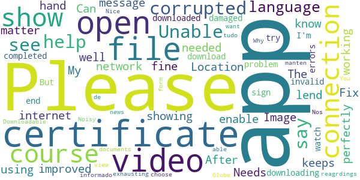

> Location  :date: __2021-05-13 11:57:32__

> Needs to be improved. Image don't show up . Fix needed  :date: __2020-12-23 15:51:31__

> The app keeps showing me this message (please enable network connection) when I open it, don't know why ?? My internet connection is working fine and I am using all the other apps perfectly well. Can you lend me a hand in this matter.  :date: __2020-11-08 08:31:34__

> After downloading the certificate at the end of the course when u try to open it. It says the file is corrupted or damaged  :date: __2020-09-23 14:26:48__

> Unable to watch the video or download the video.  :date: __2020-08-08 15:29:04__

> I can't open the certificate. Please help me out of this problem  :date: __2020-07-31 05:25:00__

> It shows errors again and again,Can't sign in  :date: __2020-06-26 16:11:53__

> I completed a course and then downloaded certificate it ... But I'm unable too see my certificate as it say corrupted file or invalid file. Please help with reagrdings to it.  :date: __2020-05-27 13:14:22__

> Noisy app.  :date: __2020-04-21 21:34:45__

> Nice  :date: __2020-04-09 16:25:41__

#### 1-star reviews

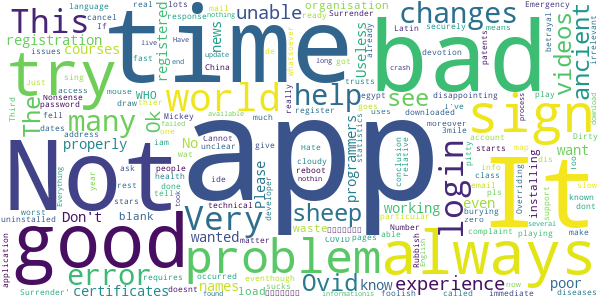

> #انقذوا_حي_الشيخ_جراح  :date: __2021-05-08 11:57:26__

> Too slow  :date: __2021-04-24 23:22:18__

> The videos are not playing eventhough I've downloaded them  :date: __2020-11-03 10:43:38__

> “‘Ovid’ is Latin for a sheep. COVID starts with a C, which also means ‘see’ in ancient language. 19 was known as the “Number of Surrender†in ancient times.† It goes on to draw the conclusion, “C-OVID 19 = ‘See a Sheep Surrender'â€.  :date: __2020-11-02 08:04:58__

> Very bad experience i got unable to login very bad i fell worst experience  :date: __2020-09-26 10:55:02__

> Ok  :date: __2020-08-10 23:31:14__

> This is called an "Emergency" app but requires registration? Very disappointing.  :date: __2020-08-06 20:55:46__

> unable to make account and register, also not able to login.  :date: __2020-08-04 11:59:45__

> I can't Login no matter how much I try.  :date: __2020-07-04 14:19:09__

> This app is having technical issues  :date: __2020-07-03 17:13:33__

# COVID Alert - Let’s protect each other
App version ``1.2.4``

Analyzed with [covid-apps-observer](http://github.com/covid-apps-observer) project, version ``0.1``

## App overview
| | |
|-------------------------|-------------------------| 
| **Name**&nbsp;&nbsp;&nbsp;&nbsp;&nbsp;&nbsp;&nbsp;&nbsp;&nbsp;&nbsp;&nbsp;&nbsp;&nbsp;&nbsp;&nbsp;&nbsp;&nbsp;&nbsp;&nbsp;&nbsp;&nbsp;&nbsp;&nbsp;&nbsp;&nbsp;&nbsp;&nbsp;&nbsp;&nbsp;&nbsp;&nbsp;&nbsp;&nbsp;&nbsp;&nbsp;&nbsp;&nbsp;&nbsp;&nbsp;&nbsp;  | COVID Alert - Let’s protect each other |
| **Unique identifier** | ca.gc.hcsc.canada.stopcovid |
| **Link to Google Play** | [https://play.google.com/store/apps/details?id=ca.gc.hcsc.canada.stopcovid](https://play.google.com/store/apps/details?id=ca.gc.hcsc.canada.stopcovid) |
| **Summary**  | Health Canada Exposure Notification |
| **Privacy policy** | [https://www.canada.ca/en/public-health/services/diseases/coronavirus-disease-covid-19/covid-alert/privacy-policy.html](https://www.canada.ca/en/public-health/services/diseases/coronavirus-disease-covid-19/covid-alert/privacy-policy.html) |
| **Latest version** | 1.2.4 |
| **Last update** | 2021-03-25 21:30:59 |
| **Recent changes** | - Improved accessibility of the Menu button when using zoom features. - Maintenance updates. |
| **Installs**  | 1,000,000+ |
| **Category** | Health & Fitness |
| **First release** | Jul 29, 2020 |
| **Size**  | 52M |
| **Supported Android version**  | 6.0 and up |

### Description
> Together, let’s slow the spread of COVID-19. Canada's COVID Alert app notifies you if someone you were near in the past 14 days tells the app they tested positive.
 COVID Alert uses Bluetooth to exchange random codes with nearby phones. It does not use or access any location data. COVID Alert works by determining how far away other phones are by the strength of their Bluetooth signal. 
 Several times a day, COVID Alert checks a list of codes from people who tell the app they tested positive. You’ll get a notification if a code you received matches one of the positive codes.
 If you test positive for COVID-19 you’ll receive a one-time key with your diagnosis to enter into COVID Alert. The app asks permission to share your random codes from the last 14 days with a central server.
 Other phones using COVID Alert check the central server periodically throughout the day. If they recorded any codes that match the codes in the central server, their user will be notified that they were exposed.
 COVID Alert has no way of knowing:
 -your location - COVID Alert does not use GPS or location services
 -your name or address
 -the place or time you were near someone
 -if you're currently near someone who was previously diagnosed
 Provincial and territorial governments are working to support COVID Alert across Canada. In some places, people cannot yet report a COVID-19 diagnosis through this app.
 It’s still helpful to keep COVID Alert on, no matter where you are.  That way, when people are able to report a diagnosis, you’ll find out if you were near them.
 COVID Alert was built by Health Canada with the Canadian Digital Service on the private exposure notification framework by Apple and Google.

### User interface
The developers of the app provide the following screenshots in the Google play store.
| | | |
|:-------------------------:|:-------------------------:|:-------------------------:|
 |   |   |   | 
 |  

## Development team
In the following we report the main information provided by the development team in the Google play store.

| | |
|-------------------------|-------------------------|
| **Developer**  | Health Canada | Santé Canada |
| **Website**  | [https://www.canada.ca/en/public-health/services/diseases/coronavirus-disease-covid-19/covid-alert/help.html](https://www.canada.ca/en/public-health/services/diseases/coronavirus-disease-covid-19/covid-alert/help.html) |
| **Email** | hc.AlerteCOVIDAlert.sc@canada.ca |
| **Physical address**  | - |
| **Other developed apps**  | [https://play.google.com/store/apps/developer?id=Health+Canada+%7C+Sant%C3%A9+Canada](https://play.google.com/store/apps/developer?id=Health+Canada+%7C+Sant%C3%A9+Canada) |

## Android support

| | |
|-------------------------|-------------------------|
| **Declared target Android version**  | Pie, version 9 (API level 28) |
| **Effective target Android version**  | Pie, version 9 (API level 28) |
| **Minimum supported Android version**  | Marshmallow, version 6.0 (API level 23) |
| **Maximum target Android version**  | - |

The larger the difference between the minimum and maximum supported Android versions, the better. A larger difference means a wider audience. For example, old phones have a very low Android version, so a high minimum supported Android version means that the app cannot be used by users with old phones, thus leading to accessibility problems. 

## Requested permissions

In the following we report the complete list of the permissions requested by the app. 

| **Permission** | **Protection level** | **Description** | 
|-------------------------|-------------------------|-------------------------|
 **android.permission ACCESS_NETWORK_STATE** | Normal | Allows applications to access information about networks. 
 **android.permission ACCESS_WIFI_STATE** | Normal | Allows applications to access information about Wi-Fi networks. 
 **android.permission BLUETOOTH** | Normal | Allows applications to connect to paired bluetooth devices. 
 **android.permission FOREGROUND_SERVICE** | Normal | Allows a regular application to use Service.startForeground. 
 **android.permission GET_TASKS** | Deprecated | This constant was deprecated in API level 21. No longer enforced. 
 **android.permission INTERNET** | Normal | Allows applications to open network sockets. 
 **android.permission RECEIVE_BOOT_COMPLETED** | Normal | Allows an application to receive the Intent.ACTION_BOOT_COMPLETED that is broadcast after the system finishes booting. 
 **android.permission WAKE_LOCK** | Normal | Allows using PowerManager WakeLocks to keep processor from sleeping or screen from dimming. 

## Mentioned servers

| **Server** | **Registrant** | **Registrant country** | **Creation date** | 
|-------------------------|-------------------------|-------------------------|-------------------------|
 | android.com | Google LLC | :us: US | 1997-06-23 04:00:00 |
 | google.com | Google LLC | :us: US | 1997-09-15 04:00:00 |
 | googleapis.com | Google LLC | :us: US | 2005-01-25 17:52:26 |

## Security analysis 

Below we report the main security warnings raised by our execution of the [Androwarn](https://github.com/maaaaz/androwarn) security analysis tool.

**Telephony identifiers leakage**
> - This application reads the numeric name (MCC+MNC) of current registered operator 
> - This application reads the operator name 

**Connection interfaces exfiltration**
> - This application reads details about the currently active data network 
> - This application tries to find out if the currently active data network is metered 

**Suspicious connection establishment**
> - This application opens a Socket and connects it to the remote address '' on the 'N/A' port  
> - This application opens a Socket and connects it to the remote address 'Ljava/lang/StringBuilder;->toString()Ljava/lang/String;' on the ': connect, resolve' port  
> - This application opens a Socket and connects it to the remote address 'Ljava/lang/StringBuilder;->toString()Ljava/lang/String;' on the 'N/A' port  
> - This application opens a Socket and connects it to the remote address 'Ljava/net/Proxy;->type()Ljava/net/Proxy$Type;' on the 'N/A' port  
> - This application opens a Socket and connects it to the remote address 'timeout' on the 'N/A' port  

**Pim data leakage**
> - This application accesses data stored in the clipboard 

**Code execution**
> - This application loads a native library 
> - This application executes a UNIX command 

## User ratings and reviews

Below we provide information about how end users are reacting to the app in terms of ratings and reviews in the Google Play store.

### Ratings

The COVID Alert - Let’s protect each other app has been installed by more than **1000000** times. At this time, **7946** rated the app and its average score is **3.5705445**. Below we show the distribution of the ratings across the usual star-based rating of Google Play

:star::star::star::star::star:: 3964

:star::star::star::star:: 895

:star::star::star:: 698

:star::star:: 491

:star:: 1898

### Reviews 

#### 5-star reviews

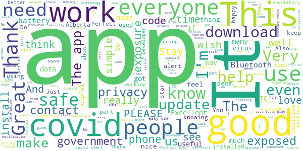

> A simple app does what it says it does  :date: __2021-04-02 07:46:53__

> As human beings we have to work TOGETHER, to get thing under control. And STOP ALL THIS HATE CRIMES. Can't WE JUST ALL GET ALONG.  :date: __2021-04-02 07:37:58__

> App works well and takes your privacy seriously. I wish that more people used it.  :date: __2021-04-02 03:25:27__

> Awesome app makes me feel more safe when I'm out shopping  :date: __2021-04-01 22:20:18__

> If I won't those gamers do you want it to be careful about your grace uncle's Love you now that sokay me know how much Rhonda Brisebois for sure I can not talk about it to the real thing is yours uncle Duc Tong Ottawa Ont you now so very true to me any time now and you're beautiful grill friend happy birthday to you 🎂🎈🎈🎈 hello everybody I don't need some you don't have it all right happy dog anyway I'm happy and even and I promise I  :date: __2021-04-01 00:12:15__

> Good  :date: __2021-03-31 10:47:18__

> This app worked and reported an exposure. Update your app to dismiss an alert of an exposure and confirm that you got tested.  :date: __2021-03-26 21:34:17__

> I love it and encourage everyone to get it! (the latest update was annoying but it was solved)  :date: __2021-03-25 02:53:11__

> The Application itself is fine, it works in the background and does what it needs to do without you ever knowing that it was on. The downside to this whole thing is that the roll out and the execution of making this app an essential part of daily life for people during the pandemic was a flop so you don't really need it. Also at some point the app stopped "updating" you on the week that just happened.  :date: __2021-03-25 01:59:34__

> Great  :date: __2021-03-20 22:48:20__

#### 4-star reviews

> Seems like a great idea, if only it worked for people from provinces that have not yet agreed to support it. It doesn't make sense that because my Provincial Government thinks it's not a good idea, that I can't use it anyways, and possibly be warned if others like myself have the app running and get sick.  :date: __2021-03-31 06:10:19__

> Learning but not good at this  :date: __2021-03-30 19:50:19__

> Still hasn't trickled down to notifications within my city  :date: __2021-03-29 15:21:55__

> It does exactly what it says on the tin (it's literally a random number generator). Only docking a star for the nags to turn Bluetooth back on, since my conventional wisdom would be to turn it on when I'm actually in public. Though I've seen a lot of reviews mention this already so that's fair.  :date: __2021-03-29 07:43:21__

> I assume it's working properly, but it would be reassuring to have a visible counter that shows how many contact codes have been exchanged. I don't care where or when, but a running count would at least let me know that I'm not the only person in town that has this installed. Edit: it will tell me how many times it's checked for exposures, but how effective will that be if none of the people I've been in contact with have this app installed?  :date: __2021-03-23 21:18:14__

> Not complicated;informative, has updates on the virus (s)  :date: __2021-03-08 17:11:05__

> cool  :date: __2021-03-01 12:09:51__

> No problems to report  :date: __2021-03-01 10:58:30__

> Stay home and be safe  :date: __2021-02-28 04:26:50__

> It's a good option to have  :date: __2021-02-21 03:52:48__

#### 3-star reviews

> It seems fantastic but it would be nice to know that it ONLY works in Ontario or around infected people from Ontario who have logged their exposure and left the province, for whatever extremely unlikely reason, before you install and finish the tutorial.  :date: __2021-04-02 22:06:41__

> Waste of Time, This app is a good concept but you have 2 major problems that you will be unable to overcome. First you are relying on the average person to download the app(which they aren't) and second you are again relying on them to input a code(which they aren't).  :date: __2021-03-29 17:13:31__

> As someone working in the healthcare field, I strongly recommend this app for everyone to use. There is however an issue with the app recently where it always sends a reminder notification that "bluetooth is off, unable to check for exposure" multiple times a day. It ends up being very annoying since I only turn off bluetooth at home, with no one else going out.  :date: __2021-03-20 18:17:29__

> Why does this app slow my phone down so much? It drains the battery twice as fast, and my phone is about half as fast. Everything lags while this app is running. I love the idea for the app, but this needs to be improved so as to discourage people from uninstalling it.  :date: __2021-03-20 01:25:15__

> decent  :date: __2021-03-16 04:50:19__

> Does this app give me updates on Tableau for my area. I have it on my computer but can't get it on my phone.  :date: __2021-03-14 16:26:52__

> Keeps asking to switch on the phone Bluetooth even though it is always on. Uninstalling as not working but just annoying.  :date: __2021-03-14 08:08:52__

> It is 100% voluntary COVID reporting which means that infected people will have to notify the app of their infection. What if they don't?  :date: __2021-03-13 21:01:17__

> Does this app work in alberta yet? Specifically jasper ab?  :date: __2021-03-11 16:33:37__

> Still not available for Alberta, it's been half a year  :date: __2021-03-07 20:07:25__

#### 2-star reviews

> I think we should be treating covid-19 as if it were a serial killer. I don't want to be told that I've been shot after the fact. If someone receives a positive diagnosis along with the one-time key it should be mandatory to put that key into the app. If that person does not stay at home and I am near them in public places I should receive an immediate buzz on my phone so that I can increase my distance from that person. The Play store screen shows only 1 million plus downloads.  :date: __2021-04-01 00:17:41__

> Wakes up my phone every hour and shows a heart attack inducing notification saying it's checking for exposures. Can't disable that without disabling all notifications. Makes no sense. This app makes you live in constant fear. Good idea but poor usability.  :date: __2021-03-31 19:52:05__

> Often didn't update or work even when Bluetooth was on  :date: __2021-03-26 06:09:51__

> It says that a one time key is not available for my area? But I live in one of the most populated places in BC?  :date: __2021-03-23 22:58:23__

> Great idea but poor execution. It's not useful if persons with Covid are not given the codes to report it.  :date: __2021-03-19 12:17:13__

> Needs A Lot of Work. The concept is fine but a lot of flaws. I tested positive for Covid and about 3 times every day it tells me to get a new code to share my new exposures. I'm in quarantine for at least 10 days and not going anywhere. I had to turn it off because it was so annoying.  :date: __2021-03-18 19:47:09__

> Just hope no one forgets their phone!  :date: __2021-03-06 11:38:26__

> I have had this App on my phone since 08/20. Do to the nature of my job I frequent Toronto and Ottawa, both hot spots. Here we are in March, 6 months of using this app, yet not one single notification. I highly doubt it's effectiveness.  :date: __2021-03-01 16:19:06__

> Great idea, but only 5 people in Canada are using it. Canada doesn't know how to reach out to its masses and connect with them on a personal level  :date: __2021-02-23 01:23:19__

> Not sure how useful this app is... This app is like the notorious pet rock - either does nothing or appears to do nothing. It would give a better sense of reliability if it reported to me how many other unique devices my phone came in the vicinity of and how many devices are reporting in the preceeding 24h period in my province / city. This app is worse than useless if I am the only one using it in all of Ontario. I'd rather free up space & release the processing power that this app is wasting.  :date: __2021-02-18 18:06:07__

#### 1-star reviews

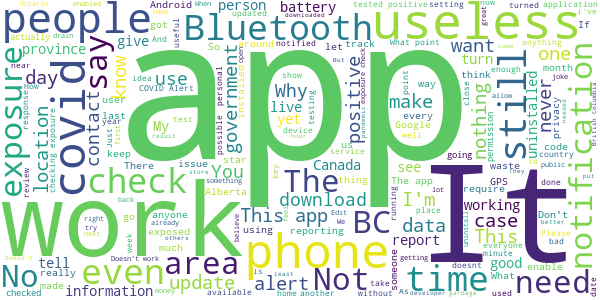

> It doesn't work in my province. So definitely useless to me right now. I guess I'll try again whenever it expands  :date: __2021-04-04 04:56:42__

> What is the point of this app if it doesn't do what it's designed to do?? I was sitting right next to someone who was covid positive and got no alert. Now I'm covid positive, and still no alert. What a joke. Deleting this garbage  :date: __2021-04-02 21:48:12__

> Useless requires location, data to track... Concept is there not intetesting enough or enough users to make affective  :date: __2021-04-02 05:07:25__

> Doesn't even work!!! I've been in contact. And got covid. The person even put in the app code!!! It still shows I haven't been exposed. Realllllyyyyy?!?!? I'M COVID POSTIVE LOL I also know they did it because I made them get the app and enter their code....  :date: __2021-04-02 04:59:17__

> I don't know of anyone who has gotten an alert on this yet. and some should have.  :date: __2021-04-02 01:45:35__

> COVID has been a thing for over a year and this still doesn't work in my area? So it's health some parts of Canada?  :date: __2021-03-31 10:27:17__

> Useless  :date: __2021-03-30 00:20:51__

> Non functional for B.C. .Good idea though.  :date: __2021-03-26 16:53:41__

> My roommate got covid and he lives in the next room. But the app says "no exposure"!!  :date: __2021-03-25 23:09:09__

> What's the point of this app if it's not being used correctly ..... BTW it only takes a second to get COVID ...  :date: __2021-03-25 16:44:15__

# Niagara Health Navigator
App version ``2.0.4``

Analyzed with [covid-apps-observer](http://github.com/covid-apps-observer) project, version ``0.1``

## App overview
| | |
|-------------------------|-------------------------| 
| **Name**&nbsp;&nbsp;&nbsp;&nbsp;&nbsp;&nbsp;&nbsp;&nbsp;&nbsp;&nbsp;&nbsp;&nbsp;&nbsp;&nbsp;&nbsp;&nbsp;&nbsp;&nbsp;&nbsp;&nbsp;&nbsp;&nbsp;&nbsp;&nbsp;&nbsp;&nbsp;&nbsp;&nbsp;&nbsp;&nbsp;&nbsp;&nbsp;&nbsp;&nbsp;&nbsp;&nbsp;&nbsp;&nbsp;&nbsp;&nbsp;  | Niagara Health Navigator |
| **Unique identifier** | com.identos.nav.niagara |
| **Link to Google Play** | [https://play.google.com/store/apps/details?id=com.identos.nav.niagara](https://play.google.com/store/apps/details?id=com.identos.nav.niagara) |
| **Summary**  | Niagara Health Navigator empowers you to connect to local health information. |
| **Privacy policy** | [https://sagrscacnhsdatastg001.blob.core.windows.net/nhn/privacy-policy.html](https://sagrscacnhsdatastg001.blob.core.windows.net/nhn/privacy-policy.html) |
| **Latest version** | 2.0.4 |
| **Last update** | 2021-03-16 14:23:32 |
| **Recent changes** | The Niagara Health Navigator helps patients, families &amp; community members stay on top of important hospital-related pandemic information. New to the Navigator is PocketHealth, a service that provides instant, diagnostic-quality access to imaging records. You can also gain access to the early release of the Ontario trusted account and an appointment management tool. This release is limited to a small subset within our Niagara Falls Ultrasound Imaging. |
| **Installs**  | 10,000+ |
| **Category** | Medical |
| **First release** | Oct 7, 2019 |
| **Size**  | 31M |
| **Supported Android version**  | 6.0 and up |

### Description
> The Niagara Health Navigator is a made-in-Niagara digital solution that will put patients at the centre of their care by empowering users to manage their own health information from the convenience of a mobile device.
 Through the Niagara Health Navigator, users can access healthcare content to help support their well-being. This includes a number of COVID-19 apps to provide patients and community members with the most recent information related to Niagara Health’s COVID-19 response and directives of public health officials.
 In addition to COVID-related information, users can find:
 -NEW PocketHealth, a service that provides instant, diagnostic-quality access to your imaging records right on your device
 -NEW Information on how to create an Ontario Trusted Account, a digital identity service providing a secure method to prove your identity online
 - Current wait times in NH Emergency Departments and Urgent Care Centres
 · Information on the process to book appointments and procedures
 · Important reminders for anyone coming to the hospital
 · Mental health and addictions resources
 · NH news
 We encourage users to engage with the content and provide feedback to improve future releases of the Navigator.

### User interface
The developers of the app provide the following screenshots in the Google play store.
| | | |
|:-------------------------:|:-------------------------:|:-------------------------:|
 |   |   | 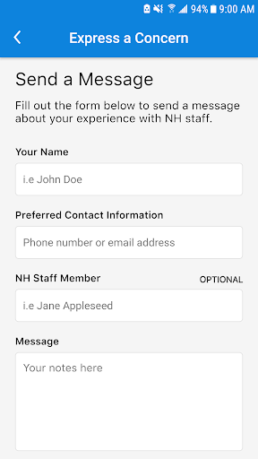  | 
 |   |   |   | 
 |   |  

## Development team
In the following we report the main information provided by the development team in the Google play store.

| | |
|-------------------------|-------------------------|
| **Developer**  | Niagara Health |
| **Website**  | [https://niagarahealth.on.ca](https://niagarahealth.on.ca) |
| **Email** | help@niagarahealthnavigator.ca |
| **Physical address**  | - |
| **Other developed apps**  | [https://play.google.com/store/apps/developer?id=Niagara+Health](https://play.google.com/store/apps/developer?id=Niagara+Health) |

## Android support

| | |
|-------------------------|-------------------------|
| **Declared target Android version**  | Android10, version 10 (API level 29) |
| **Effective target Android version**  | Android10, version 10 (API level 29) |
| **Minimum supported Android version**  | Marshmallow, version 6.0 (API level 23) |
| **Maximum target Android version**  | - |

The larger the difference between the minimum and maximum supported Android versions, the better. A larger difference means a wider audience. For example, old phones have a very low Android version, so a high minimum supported Android version means that the app cannot be used by users with old phones, thus leading to accessibility problems. 

## Requested permissions

In the following we report the complete list of the permissions requested by the app. 

| **Permission** | **Protection level** | **Description** | 
|-------------------------|-------------------------|-------------------------|
 **android.permission ACCESS_NETWORK_STATE** | Normal | Allows applications to access information about networks. 
 **android.permission INTERNET** | Normal | Allows applications to open network sockets. 
 **android.permission USE_BIOMETRIC** | Normal | Allows an app to use device supported biometric modalities. 
 **android.permission VIBRATE** | Normal | Allows access to the vibrator. 

## Mentioned servers

| **Server** | **Registrant** | **Registrant country** | **Creation date** | 
|-------------------------|-------------------------|-------------------------|-------------------------|
 | googlesyndication.com | Google LLC | :us: US | 2003-01-21 06:17:24 |
 | google.com | Google LLC | :us: US | 1997-09-15 04:00:00 |
 | app-measurement.com | Google LLC | :us: US | 2015-06-19 20:13:31 |
 | googleapis.com | Google LLC | :us: US | 2005-01-25 17:52:26 |
 | stackoverflow.com | Stack Exchange, Inc. | :us: US | 2003-12-26 19:18:07 |
 | segment.com | Domains By Proxy, LLC | :us: US | 1998-07-06 04:00:00 |
 | segment.io | Segment.io, Inc. | :us: US | 2011-10-01 04:10:05 |
 | crashlytics.com | Google LLC | :us: US | 2011-01-21 15:30:40 |
 | microsoft.com | Microsoft Corporation | :us: US | 1991-05-02 04:00:00 |
 | schildbach.de | - | - | - |
 | lightning-wallet.com | lightning-wallet.com | :ukraine: UA | 2016-08-27 16:25:19 |

## Security analysis 

Below we report the main security warnings raised by our execution of the [Androwarn](https://github.com/maaaaz/androwarn) security analysis tool.

**Telephony identifiers leakage**
> - This application reads the ISO country code equivalent of the current registered operator's MCC (Mobile Country Code) 
> - This application reads the MCC+MNC of the provider of the SIM 
> - This application reads the numeric name (MCC+MNC) of current registered operator 
> - This application reads the operator name 
> - This application reads the unique device ID, i.e the IMEI for GSM and the MEID or ESN for CDMA phones 

**Connection interfaces exfiltration**
> - This application reads details about the currently active data network 
> - This application tries to find out if the currently active data network is metered 

**Telephony services abuse**
> - This application makes phone calls 

**Suspicious connection establishment**
> - This application opens a Socket and connects it to the remote address '' on the 'N/A' port  
> - This application opens a Socket and connects it to the remote address 'Ljava/lang/StringBuilder;->toString()Ljava/lang/String;' on the 'N/A' port  
> - This application opens a Socket and connects it to the remote address 'Ljava/net/Proxy;->type()Ljava/net/Proxy$Type;' on the 'N/A' port  
> - This application opens a Socket and connects it to the remote address 'timeout' on the 'N/A' port  

**Code execution**
> - This application loads a native library 
> - This application loads a native library: 'secp256k1' 
> - This application loads a native library: 'tool-checker' 
> - This application executes a UNIX command 
> - This application executes a UNIX command containing this argument: 'getprop' 
> - This application executes a UNIX command containing this argument: 'mount' 

## User ratings and reviews

Below we provide information about how end users are reacting to the app in terms of ratings and reviews in the Google Play store.

### Ratings

The Niagara Health Navigator app has been installed by more than **10000** times. At this time, **27** rated the app and its average score is **3.6666667**. Below we show the distribution of the ratings across the usual star-based rating of Google Play

:star::star::star::star::star:: 16

:star::star::star::star:: 2

:star::star::star:: 1

:star::star:: 0

:star:: 8

### Reviews 

#### 5-star reviews

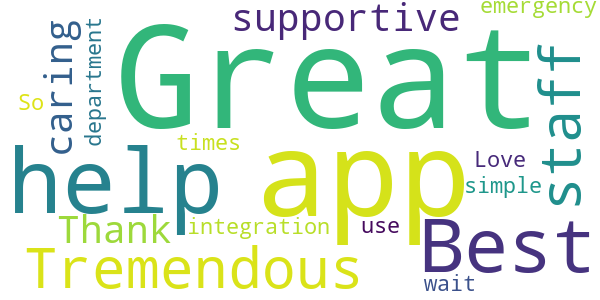

> Great help  :date: __2021-01-05 15:29:49__

> Best app ever.  :date: __2020-10-23 03:48:45__

> Tremendous staff so supportive and caring  :date: __2020-07-11 20:57:36__

> Thank you!!  :date: __2020-02-27 01:28:51__

> Great app!  :date: __2019-12-10 20:19:20__

> Great integration for emergency department wait times!  :date: __2019-10-28 21:44:37__

> So simple to use. Love it  :date: __2019-10-25 14:55:59__

#### 4-star reviews

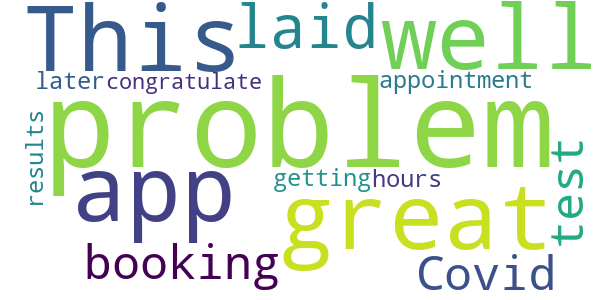

> This is a great app well laid out I had no problem booking a Covid test appointment and I had no problem getting the results 24 hours later I congratulate them  :date: __2020-12-13 23:52:35__

#### 3-star reviews

> Could use many more options.  :date: __2019-10-22 07:26:24__

#### 2-star reviews

No recent reviews available with 2 stars.

#### 1-star reviews

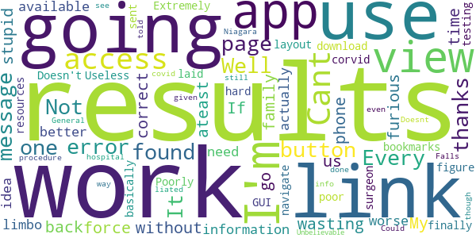

> Cant access my results  :date: __2021-02-04 16:33:42__

> Every page is a error message. Not one link or button works. It's all cannot be found. Well thanks for wasting my time I can't go back to work without these results. My family is furious with me. If you're going to force us to use these stupid phone app ateast have the links be correct and the information we need actually available. I'm in limbo and I have no idea if I'm going to get better or worse.  :date: __2021-01-27 18:31:54__

> Extremely hard to navigate once you finally figure out how to download...very poor layout  :date: __2020-11-27 15:00:41__

> Doesn't work.  :date: __2020-11-01 18:33:30__

> Poorly laid out GUI for what's basically just bookmarks to other resources. Useless.  :date: __2020-10-09 01:15:23__

> was sent by my surgeon for corvid testing on 9/15/20 for a procedure to be done on 9/17/20 at the Niagara Falls General... as of 10/01/20 still can't see for myself what the results were...?????? was given info and told to use this app.  :date: __2020-10-01 06:08:18__

> Doesnt work  :date: __2020-08-15 19:26:54__

> Could not view covid-19 results even though the hospital liated this as the #1 way to view results. Unbelievable.  :date: __2020-08-02 20:53:13__

# Kenya Covid-19 Tracker
App version ``Varies with device``

Analyzed with [covid-apps-observer](http://github.com/covid-apps-observer) project, version ``0.1``

## App overview
| | |
|-------------------------|-------------------------| 
| **Name**&nbsp;&nbsp;&nbsp;&nbsp;&nbsp;&nbsp;&nbsp;&nbsp;&nbsp;&nbsp;&nbsp;&nbsp;&nbsp;&nbsp;&nbsp;&nbsp;&nbsp;&nbsp;&nbsp;&nbsp;&nbsp;&nbsp;&nbsp;&nbsp;&nbsp;&nbsp;&nbsp;&nbsp;&nbsp;&nbsp;&nbsp;&nbsp;&nbsp;&nbsp;&nbsp;&nbsp;&nbsp;&nbsp;&nbsp;&nbsp;  | Kenya Covid-19 Tracker |
| **Unique identifier** | org.medicmobile.webapp.mobile.surveillance_covid19_kenya |
| **Link to Google Play** | [https://play.google.com/store/apps/details?id=org.medicmobile.webapp.mobile.surveillance_covid19_kenya](https://play.google.com/store/apps/details?id=org.medicmobile.webapp.mobile.surveillance_covid19_kenya) |
| **Summary**  | Kenya Covid-19 app for case surveillance, contact tracing &amp; follow-up in Kenya |
| **Privacy policy** | [https://docs.google.com/document/d/e/2PACX-1vS1YCuJjwXX3lqddh0f2pSeRSBN98JW3zcp7HAu0idmju3BWdw67umiG_ck4sq0XzuNOyEeeEiOWx9C/pub](https://docs.google.com/document/d/e/2PACX-1vS1YCuJjwXX3lqddh0f2pSeRSBN98JW3zcp7HAu0idmju3BWdw67umiG_ck4sq0XzuNOyEeeEiOWx9C/pub) |
| **Latest version** | Varies with device |
| **Last update** | 2021-01-13 14:07:01 |
| **Recent changes** | Play Store compliance  |
| **Installs**  | 1,000+ |
| **Category** | Medical |
| **First release** | Apr 20, 2020 |
| **Size**  | Varies with device |
| **Supported Android version**  | Varies with device |

### Description
> The Kenya Covid-19 tracking application is an android application developed for Kenya’s COVID-19 surveillance & response team. The app is designed for use together with the KenyaEMR Covid-19 tracking system and is for use by field disease surveillance teams to report suspected Covid19 cases to the national surveillance system, conduct case investigations by submitting laboratory requests to the national testing laboratories through the Kenya EMR Covid-19 tracking system. The Kenya Covid-19 tracking app can also be used by Covid-19 contact tracing teams to conduct tracing and follow-up of contacts of patients confirmed to be Covid-19 infected and for monitoring these contacts during the quarantine period.

### User interface
The developers of the app provide the following screenshots in the Google play store.
| | | |
|:-------------------------:|:-------------------------:|:-------------------------:|
 |   |   |   | 
 |  

## Development team
In the following we report the main information provided by the development team in the Google play store.

| | |
|-------------------------|-------------------------|
| **Developer**  | Medic Mobile, Inc. |
| **Website**  | [http://medicmobile.org](http://medicmobile.org) |
| **Email** | support@medicmobile.org |
| **Physical address**  | [3254 19th Street, Floor Two San Francisco, CA 94110 USA](https://www.google.com/maps/search/3254%2019th%20Street,%20Floor%20Two%20San%20Francisco,%20CA%2094110%20USA) (Google Maps) |
| **Other developed apps**  | [https://play.google.com/store/apps/developer?id=Medic+Mobile,+Inc.](https://play.google.com/store/apps/developer?id=Medic+Mobile,+Inc.) |

## Android support

| | |
|-------------------------|-------------------------|
| **Declared target Android version**  | Pie, version 9 (API level 28) |
| **Effective target Android version**  | Pie, version 9 (API level 28) |
| **Minimum supported Android version**  | KitKat, version 4.4 - 4.4.4 (API level 19) |
| **Maximum target Android version**  | - |

The larger the difference between the minimum and maximum supported Android versions, the better. A larger difference means a wider audience. For example, old phones have a very low Android version, so a high minimum supported Android version means that the app cannot be used by users with old phones, thus leading to accessibility problems. 

## Requested permissions

In the following we report the complete list of the permissions requested by the app. 

| **Permission** | **Protection level** | **Description** | 
|-------------------------|-------------------------|-------------------------|
 **android.permission ACCESS_COARSE_LOCATION** | :warning:**Dangerous** | Allows an app to access approximate location. 
 **android.permission ACCESS_FINE_LOCATION** | :warning:**Dangerous** | Allows an app to access precise location. 
 **android.permission ACCESS_NETWORK_STATE** | Normal | Allows applications to access information about networks. 
 **android.permission INTERNET** | Normal | Allows applications to open network sockets. 
 **android.permission VIBRATE** | Normal | Allows access to the vibrator. 
 **android.permission WRITE_EXTERNAL_STORAGE** | :warning:**Dangerous** | Allows an application to write to external storage. 
 **com.android.launcher.permission INSTALL_SHORTCUT** | Normal | Allows an application to install a shortcut in Launcher. 
 **com.android.launcher.permission UNINSTALL_SHORTCUT** | Deprecated | Don't use this permission in your app. 

## Mentioned servers

| **Server** | **Registrant** | **Registrant country** | **Creation date** | 
|-------------------------|-------------------------|-------------------------|-------------------------|
 | medicmobile.org | Medic Mobile | :us: US | 2010-11-09 17:13:03 |
 | github.io | GitHub, Inc. | :us: US | 2013-03-08 19:12:48 |

## Security analysis 

Below we report the main security warnings raised by our execution of the [Androwarn](https://github.com/maaaaz/androwarn) security analysis tool.

**Telephony identifiers leakage**
> - This application reads the ISO country code equivalent of the current registered operator's MCC (Mobile Country Code) 
> - This application reads the MCC+MNC of the provider of the SIM 
> - This application reads the numeric name (MCC+MNC) of current registered operator 

**Location lookup**
> - This application reads location information from all available providers (WiFi, GPS etc.) 

**Connection interfaces exfiltration**
> - This application reads details about the currently active data network 

**Telephony services abuse**
> - This application makes phone calls 

**Pim data leakage**
> - This application accesses data stored in the clipboard 

**Code execution**
> - This application loads a native library 
> - This application loads a native library: '0' 
> - This application loads a native library: 'chromium_android_linker' 
> - This application loads a native library: 'chromium_android_linker.cr' 
> - This application executes a UNIX command containing this argument: 'getprop ro.product.cpu.abi' 

## User ratings and reviews

Below we provide information about how end users are reacting to the app in terms of ratings and reviews in the Google Play store.

### Ratings

The Kenya Covid-19 Tracker app has been installed by more than **1000** times. At this time, **22** rated the app and its average score is **2.1818182**. Below we show the distribution of the ratings across the usual star-based rating of Google Play

:star::star::star::star::star:: 6

:star::star::star::star:: 0

:star::star::star:: 1

:star::star:: 0

:star:: 15

### Reviews 

#### 5-star reviews

> Ok  :date: __2020-08-27 00:02:29__

> Best  :date: __2020-07-06 10:08:17__

> Good  :date: __2020-06-27 10:04:47__

#### 4-star reviews

No recent reviews available with 4 stars.

#### 3-star reviews

> I am yet to practically prove its accuracy and confidentiality! Otherwise, it is a modern app for our modern ailments, worth testing.  :date: __2020-07-08 05:57:19__

#### 2-star reviews

No recent reviews available with 2 stars.

#### 1-star reviews

> There is no way to create an account to log in  :date: __2021-01-03 09:55:41__

> The app does not work. Some pre registration has been assumed apparently. There's no option to register for a first time use meaning it's useless unless you have some way to get login details as the app has no such provision  :date: __2020-12-19 18:34:33__

> No sighn up option bure kabisi  :date: __2020-08-06 08:08:34__

> This app has only one option [login] so I need to know how to log in  :date: __2020-07-19 23:37:15__

> Which log in details do I use and there is no registration button?  :date: __2020-07-19 18:22:15__

> Help in getting user name and password  :date: __2020-07-13 21:21:26__

> Fake  :date: __2020-07-13 13:49:05__

> Can't long in There's place for registering to enable log Alternatively which credetials should one use to log in?  :date: __2020-07-08 23:30:14__

> Poor how can I login if i don't even have an account  :date: __2020-07-08 18:45:29__

> What are the login credentials I can't get them?  :date: __2020-07-08 05:27:55__

# coVIDApp
App version ``2.0.32``

Analyzed with [covid-apps-observer](http://github.com/covid-apps-observer) project, version ``0.1``

## App overview
| | |
|-------------------------|-------------------------| 
| **Name**&nbsp;&nbsp;&nbsp;&nbsp;&nbsp;&nbsp;&nbsp;&nbsp;&nbsp;&nbsp;&nbsp;&nbsp;&nbsp;&nbsp;&nbsp;&nbsp;&nbsp;&nbsp;&nbsp;&nbsp;&nbsp;&nbsp;&nbsp;&nbsp;&nbsp;&nbsp;&nbsp;&nbsp;&nbsp;&nbsp;&nbsp;&nbsp;&nbsp;&nbsp;&nbsp;&nbsp;&nbsp;&nbsp;&nbsp;&nbsp;  | coVIDApp |
| **Unique identifier** | com.flsida.covidapp |
| **Link to Google Play** | [https://play.google.com/store/apps/details?id=com.flsida.covidapp](https://play.google.com/store/apps/details?id=com.flsida.covidapp) |
| **Summary**  | App to fight coronavirus |
| **Privacy policy** | [http://www.flsida.org/](http://www.flsida.org/) |
| **Latest version** | 2.0.32 |
| **Last update** | 2020-07-21 11:10:06 |
| **Recent changes** | Correcció d&#39;errors |
| **Installs**  | 1,000+ |
| **Category** | Medical |
| **First release** | Mar 24, 2020 |
| **Size**  | 20M |
| **Supported Android version**  | 4.4 and up |

### Description
> coVIDApp és una App creada per ajudar en la gestió assistencial de les persones que es troben ingressades o en atenció domiciliària i la seva relació amb els seus familiars.
 coVIDApp és un canal de comunicació directe, segur i veraç entre el teu Equip Sanitari i tu.
 Podràs rebre consells, enviar informació sobre el teu estat, gestionar la teva medicació, rebre els resultats de les teves proves, xatejar amb l'equip sanitari, programar vídeo consulta, entre d'altres.

### User interface
The developers of the app provide the following screenshots in the Google play store.
| | | |
|:-------------------------:|:-------------------------:|:-------------------------:|
 |   |  

## Development team
In the following we report the main information provided by the development team in the Google play store.

| | |
|-------------------------|-------------------------|
| **Developer**  | FLSida |
| **Website**  | [https://www.flsida.org](https://www.flsida.org) |
| **Email** | info@flsida.org |
| **Physical address**  | [Carretera de Canyet s/n Hospital Germans Trias i Pujol 08916 Badalona](https://www.google.com/maps/search/Carretera%20de%20Canyet%20s/n%20Hospital%20Germans%20Trias%20i%20Pujol%2008916%20Badalona) (Google Maps) |
| **Other developed apps**  | [https://play.google.com/store/apps/developer?id=FLSida](https://play.google.com/store/apps/developer?id=FLSida) |

## Android support

| | |
|-------------------------|-------------------------|
| **Declared target Android version**  | Pie, version 9 (API level 28) |
| **Effective target Android version**  | Pie, version 9 (API level 28) |
| **Minimum supported Android version**  | KitKat, version 4.4 - 4.4.4 (API level 19) |
| **Maximum target Android version**  | - |

The larger the difference between the minimum and maximum supported Android versions, the better. A larger difference means a wider audience. For example, old phones have a very low Android version, so a high minimum supported Android version means that the app cannot be used by users with old phones, thus leading to accessibility problems. 

## Requested permissions

In the following we report the complete list of the permissions requested by the app. 

| **Permission** | **Protection level** | **Description** | 
|-------------------------|-------------------------|-------------------------|
 **android.permission ACCESS_COARSE_LOCATION** | :warning:**Dangerous** | Allows an app to access approximate location. 
 **android.permission ACCESS_FINE_LOCATION** | :warning:**Dangerous** | Allows an app to access precise location. 
 **android.permission ACCESS_NETWORK_STATE** | Normal | Allows applications to access information about networks. 
 **android.permission BLUETOOTH** | Normal | Allows applications to connect to paired bluetooth devices. 
 **android.permission BODY_SENSORS** | :warning:**Dangerous** | Allows an application to access data from sensors that the user uses to measure what is happening inside his/her body, such as heart rate. 
 **android.permission BROADCAST_STICKY** | Normal | Allows an application to broadcast sticky intents. 
 **android.permission CAMERA** | :warning:**Dangerous** | Required to be able to access the camera device. 
 **android.permission INTERNET** | Normal | Allows applications to open network sockets. 
 **android.permission MODIFY_AUDIO_SETTINGS** | Normal | Allows an application to modify global audio settings. 
 **android.permission READ_APP_BADGE** | - | - 
 **android.permission READ_CALENDAR** | :warning:**Dangerous** | Allows an application to read the user's calendar data. 
 **android.permission READ_EXTERNAL_STORAGE** | :warning:**Dangerous** | Allows an application to read from external storage. 
 **android.permission READ_PHONE_STATE** | :warning:**Dangerous** | Allows read only access to phone state, including the phone number of the device, current cellular network information, the status of any ongoing calls, and a list of any PhoneAccounts registered on the device. 
 **android.permission RECORD_AUDIO** | :warning:**Dangerous** | Allows an application to record audio. 
 **android.permission USE_FINGERPRINT** | Normal | This constant was deprecated in API level 28. Applications should request USE_BIOMETRIC instead 
 **android.permission VIBRATE** | Normal | Allows access to the vibrator. 
 **android.permission WAKE_LOCK** | Normal | Allows using PowerManager WakeLocks to keep processor from sleeping or screen from dimming. 
 **android.permission WRITE_CALENDAR** | :warning:**Dangerous** | Allows an application to write the user's calendar data. 
 **android.permission WRITE_EXTERNAL_STORAGE** | :warning:**Dangerous** | Allows an application to write to external storage. 
 **com.anddoes.launcher.permission UPDATE_COUNT** | - | - 
 **com.google.android.c2dm.permission RECEIVE** | - | - 
 **com.htc.launcher.permission READ_SETTINGS** | - | - 
 **com.htc.launcher.permission UPDATE_SHORTCUT** | - | - 
 **com.huawei.android.launcher.permission CHANGE_BADGE** | - | - 
 **com.huawei.android.launcher.permission READ_SETTINGS** | - | - 
 **com.huawei.android.launcher.permission WRITE_SETTINGS** | - | - 
 **com.majeur.launcher.permission UPDATE_BADGE** | - | - 
 **com.oppo.launcher.permission READ_SETTINGS** | - | - 
 **com.oppo.launcher.permission WRITE_SETTINGS** | - | - 
 **com.sec.android.provider.badge.permission READ** | - | - 
 **com.sec.android.provider.badge.permission WRITE** | - | - 
 **com.sonyericsson.home.permission BROADCAST_BADGE** | - | - 
 **com.sonymobile.home.permission PROVIDER_INSERT_BADGE** | - | - 
 **me.everything.badger.permission BADGE_COUNT_READ** | - | - 
 **me.everything.badger.permission BADGE_COUNT_WRITE** | - | - 

## Mentioned servers

| **Server** | **Registrant** | **Registrant country** | **Creation date** | 
|-------------------------|-------------------------|-------------------------|-------------------------|
 | google.com | Google LLC | :us: US | 1997-09-15 04:00:00 |
 | googleapis.com | Google LLC | :us: US | 2005-01-25 17:52:26 |
 | opentok.com | Domains By Proxy, LLC | :us: US | 2010-09-24 17:14:13 |
 | gstatic.com | Google LLC | :us: US | 2008-02-11 15:31:25 |
 | tokbox.com | Domains By Proxy, LLC | :us: US | 2002-04-26 08:13:23 |
 | whatsapp.com | Whatsapp Inc. | :us: US | 2008-09-04 12:39:12 |
 | github.com | GitHub, Inc. | :us: US | 2007-10-09 18:20:50 |

## Security analysis 

Below we report the main security warnings raised by our execution of the [Androwarn](https://github.com/maaaaz/androwarn) security analysis tool.

**Telephony identifiers leakage**
> - This application reads the device phone type value 

**Connection interfaces exfiltration**
> - This application reads details about the currently active data network 
> - This application tries to find out if the currently active data network is metered 

**Telephony services abuse**
> - This application makes phone calls 

**Pim data leakage**
> - This application accesses the calendar 
> - This application accesses the downloads folder 

**Code execution**
> - This application loads a native library: 'jingle_peerconnection_so' 
> - This application loads a native library: 'opentok' 
> - This application loads a native library: 'tbxml' 

## User ratings and reviews

Below we provide information about how end users are reacting to the app in terms of ratings and reviews in the Google Play store.

### Ratings

The coVIDApp app has been installed by more than **1000** times. At this time, **-** rated the app and its average score is **0.0**. Below we show the distribution of the ratings across the usual star-based rating of Google Play

:star::star::star::star::star:: 0

:star::star::star::star:: 0

:star::star::star:: 0

:star::star:: 0

:star:: 0

### Reviews 

#### 5-star reviews

No recent reviews available with 5 stars.

#### 4-star reviews

No recent reviews available with 4 stars.

#### 3-star reviews

No recent reviews available with 3 stars.

#### 2-star reviews

No recent reviews available with 2 stars.

#### 1-star reviews

No recent reviews available with 1 stars.

# Bugs & Drugs 2.0
App version ``2.5.104``

Analyzed with [covid-apps-observer](http://github.com/covid-apps-observer) project, version ``0.1``

## App overview
| | |
|-------------------------|-------------------------| 
| **Name**&nbsp;&nbsp;&nbsp;&nbsp;&nbsp;&nbsp;&nbsp;&nbsp;&nbsp;&nbsp;&nbsp;&nbsp;&nbsp;&nbsp;&nbsp;&nbsp;&nbsp;&nbsp;&nbsp;&nbsp;&nbsp;&nbsp;&nbsp;&nbsp;&nbsp;&nbsp;&nbsp;&nbsp;&nbsp;&nbsp;&nbsp;&nbsp;&nbsp;&nbsp;&nbsp;&nbsp;&nbsp;&nbsp;&nbsp;&nbsp;  | Bugs & Drugs 2.0 |
| **Unique identifier** | ca.albertahealthservices.bugsanddrugs2 |
| **Link to Google Play** | [https://play.google.com/store/apps/details?id=ca.albertahealthservices.bugsanddrugs2](https://play.google.com/store/apps/details?id=ca.albertahealthservices.bugsanddrugs2) |
| **Summary**  | Bugs &amp; Drugs is an antimicrobial reference for health care practitioners. |
| **Privacy policy** | [http://bugsanddrugs.ca](http://bugsanddrugs.ca) |
| **Latest version** | 2.5.104 |
| **Last update** | 2020-12-04 18:46:13 |
| **Recent changes** | Updated and repaired search handling on Android |
| **Installs**  | 1,000+ |
| **Category** | Medical |
| **First release** | Mar 27, 2020 |
| **Size**  | 9.4M |
| **Supported Android version**  | 4.4 and up |

### Description
> We are very pleased to release this new version of Bugs & Drugs.  The content and delivery method have been updated. We provide you the latest content which will be dynamically updated for you in this new app. 
 Our intention had been to follow industry standards and move to a yearly subscription model for this new release, but we have decided to delay that change and instead make this app free to everyone for the next 3 months. We hope this will be of some small help during these difficult and unprecedented times.
 Bugs & Drugs is a comprehensive, evidence-based reference for physicians, dentists, pharmacists, nurse practitioners and other health care practitioners.
 Bugs & Drugs provides clinicians with the latest recommendations for the appropriate use of antimicrobials and the optimal treatment and prevention of infectious diseases. It is also a key component of antimicrobial stewardship efforts. This reference can optimize patient outcomes and minimize the unintended consequences of antimicrobial use, including toxicity, superinfections, resistance, and unnecessary treatment costs.
  
 Bugs & Drugs is divided into six sections:
  
 1. Antibiotics
 2. Treatment recommendations for infections in children and adults (including selected ophthalmic, fungal, and parasitic infections), 
 3. Recommendations for the prevention of infections,
 4. Treatment and prophylaxis of dental infections, 
 5. Infections in Pregnancy and 
 6. Microbiology
  
 The Bugs & Drugs app is well suited for healthcare practitioners looking for an evidence-based mobile reference and provides therapeutic options in a clear, concise manner.
  
 Once installed, you do not need internet access to use the content. Internet access is only required for initial installation of the app and to receive updates.
  
 The content is prepared by Dr. Edith Blondel-Hill (Medical Microbiologist/Infectious Diseases Specialist, Kelowna General Hospital) and Ms. Susan Fryters (Antimicrobial Stewardship/Infectious Diseases Pharmacist, Alberta Health Services) with the help of over 40 reviewers with expertise in infectious diseases, infection prevention & control, microbiology, pharmacy, and Public Health.

### User interface
The developers of the app provide the following screenshots in the Google play store.
| | | |
|:-------------------------:|:-------------------------:|:-------------------------:|
 |   | 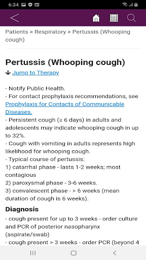  |   | 
 |  

## Development team
In the following we report the main information provided by the development team in the Google play store.

| | |
|-------------------------|-------------------------|
| **Developer**  | Alberta Health Services |
| **Website**  | [http://bugsanddrugs.ca](http://bugsanddrugs.ca) |
| **Email** | bugsanddrugs@albertahealthservices.ca |
| **Physical address**  | [10101 Southport Rd SW Calgary Alberta T3A 5H4](https://www.google.com/maps/search/10101%20Southport%20Rd%20SW%20Calgary%20Alberta%20T3A%205H4) (Google Maps) |
| **Other developed apps**  | [https://play.google.com/store/apps/developer?id=Alberta+Health+Services](https://play.google.com/store/apps/developer?id=Alberta+Health+Services) |

## Android support

| | |
|-------------------------|-------------------------|
| **Declared target Android version**  | Pie, version 9 (API level 28) |
| **Effective target Android version**  | Pie, version 9 (API level 28) |
| **Minimum supported Android version**  | KitKat, version 4.4 - 4.4.4 (API level 19) |
| **Maximum target Android version**  | - |

The larger the difference between the minimum and maximum supported Android versions, the better. A larger difference means a wider audience. For example, old phones have a very low Android version, so a high minimum supported Android version means that the app cannot be used by users with old phones, thus leading to accessibility problems. 

## Requested permissions

In the following we report the complete list of the permissions requested by the app. 

| **Permission** | **Protection level** | **Description** | 
|-------------------------|-------------------------|-------------------------|
 **android.permission ACCESS_NETWORK_STATE** | Normal | Allows applications to access information about networks. 
 **android.permission INTERNET** | Normal | Allows applications to open network sockets. 
 **android.permission WRITE_EXTERNAL_STORAGE** | :warning:**Dangerous** | Allows an application to write to external storage. 
 **com.android.vending BILLING** | - | - 

## Mentioned servers

| **Server** | **Registrant** | **Registrant country** | **Creation date** | 
|-------------------------|-------------------------|-------------------------|-------------------------|
 | gstatic.com | Google LLC | :us: US | 2008-02-11 15:31:25 |

## Security analysis 

Below we report the main security warnings raised by our execution of the [Androwarn](https://github.com/maaaaz/androwarn) security analysis tool.

**Connection interfaces exfiltration**
> - This application reads details about the currently active data network 

**Code execution**
> - This application loads a native library: 'sqlc-native-driver' 

## User ratings and reviews

Below we provide information about how end users are reacting to the app in terms of ratings and reviews in the Google Play store.

### Ratings

The Bugs & Drugs 2.0 app has been installed by more than **1000** times. At this time, **-** rated the app and its average score is **0.0**. Below we show the distribution of the ratings across the usual star-based rating of Google Play

:star::star::star::star::star:: 0

:star::star::star::star:: 0

:star::star::star:: 0

:star::star:: 0

:star:: 0

### Reviews 

#### 5-star reviews

No recent reviews available with 5 stars.

#### 4-star reviews

No recent reviews available with 4 stars.

#### 3-star reviews

No recent reviews available with 3 stars.

#### 2-star reviews

No recent reviews available with 2 stars.

#### 1-star reviews

> Content is great but the UI had suffered since 2.0 upgrade (user interface downgrade in my opinion). The app freezes every time I try to search content. I suggest find go back to the old app which was awesome!  :date: __2021-03-16 21:48:04__

# Lumeca - See a doctor now - Free in Saskatchewan
App version ``2.1 (110)``

Analyzed with [covid-apps-observer](http://github.com/covid-apps-observer) project, version ``0.1``

## App overview
| | |
|-------------------------|-------------------------| 
| **Name**&nbsp;&nbsp;&nbsp;&nbsp;&nbsp;&nbsp;&nbsp;&nbsp;&nbsp;&nbsp;&nbsp;&nbsp;&nbsp;&nbsp;&nbsp;&nbsp;&nbsp;&nbsp;&nbsp;&nbsp;&nbsp;&nbsp;&nbsp;&nbsp;&nbsp;&nbsp;&nbsp;&nbsp;&nbsp;&nbsp;&nbsp;&nbsp;&nbsp;&nbsp;&nbsp;&nbsp;&nbsp;&nbsp;&nbsp;&nbsp;  | Lumeca - See a doctor now - Free in Saskatchewan |
| **Unique identifier** | rs.nosolutions.lumeca |
| **Link to Google Play** | [https://play.google.com/store/apps/details?id=rs.nosolutions.lumeca](https://play.google.com/store/apps/details?id=rs.nosolutions.lumeca) |
| **Summary**  | Speak to a doctor now. Free app for residents of Saskatchewan valid health cards |
| **Privacy policy** | [https://lumeca.com/privacy-policy/](https://lumeca.com/privacy-policy/) |
| **Latest version** | 2.1 (110) |
| **Last update** | 2021-04-10 00:31:23 |
| **Recent changes** | Lumeca offers easy, accessible, secure healthcare. From prescription renewals to mental health consults, our health practitioners are ready to connect with you. <b>In this update:</b> Under the hood fixes and updates. |
| **Installs**  | 5,000+ |
| **Category** | Medical |
| **First release** | May 31, 2019 |
| **Size**  | 75M |
| **Supported Android version**  | 6.0 and up |

### Description
> Lumeca Walk-In is a virtual health consultation tool that allows Saskatchewan Health Card holders the ability to connect with licensed Saskatchewan physicians for free. From prescription renewals to labs and referrals, Lumeca connects you to a physician within minutes. No commuting. No waiting rooms.  
 Safe. Secure. Confidential.
 With the guidance of our privacy officer, the entire team at Lumeca takes every measure to protect the information you provide to us through the platform. It is our duty to comply with the Personal Information Protection of Electronic Documents Act, along with the province’s Health Information Protection Act. Our team safeguards all data so that it is safe, secure, and encrypted.
 For more info, see our Terms of Use and Privacy Policies on our website.

### User interface
The developers of the app provide the following screenshots in the Google play store.
| | | |
|:-------------------------:|:-------------------------:|:-------------------------:|
 |   |   |   | 
 |  

## Development team
In the following we report the main information provided by the development team in the Google play store.

| | |
|-------------------------|-------------------------|
| **Developer**  | Lumeca Health Inc |
| **Website**  | [http://www.lumeca.com](http://www.lumeca.com) |
| **Email** | support@lumeca.com |
| **Physical address**  | - |
| **Other developed apps**  | [https://play.google.com/store/apps/developer?id=Lumeca+Health+Inc](https://play.google.com/store/apps/developer?id=Lumeca+Health+Inc) |

## Android support

| | |
|-------------------------|-------------------------|
| **Declared target Android version**  | Android10, version 10 (API level 29) |
| **Effective target Android version**  | Android10, version 10 (API level 29) |
| **Minimum supported Android version**  | Marshmallow, version 6.0 (API level 23) |
| **Maximum target Android version**  | - |

The larger the difference between the minimum and maximum supported Android versions, the better. A larger difference means a wider audience. For example, old phones have a very low Android version, so a high minimum supported Android version means that the app cannot be used by users with old phones, thus leading to accessibility problems. 

## Requested permissions

In the following we report the complete list of the permissions requested by the app. 

| **Permission** | **Protection level** | **Description** | 
|-------------------------|-------------------------|-------------------------|
 **android.permission ACCESS_NETWORK_STATE** | Normal | Allows applications to access information about networks. 
 **android.permission ACCESS_WIFI_STATE** | Normal | Allows applications to access information about Wi-Fi networks. 
 **android.permission CAMERA** | :warning:**Dangerous** | Required to be able to access the camera device. 
 **android.permission INTERNET** | Normal | Allows applications to open network sockets. 
 **android.permission MODIFY_AUDIO_SETTINGS** | Normal | Allows an application to modify global audio settings. 
 **android.permission READ_EXTERNAL_STORAGE** | :warning:**Dangerous** | Allows an application to read from external storage. 
 **android.permission RECORD_AUDIO** | :warning:**Dangerous** | Allows an application to record audio. 
 **android.permission WAKE_LOCK** | Normal | Allows using PowerManager WakeLocks to keep processor from sleeping or screen from dimming. 
 **android.permission WRITE_EXTERNAL_STORAGE** | :warning:**Dangerous** | Allows an application to write to external storage. 
 **com.google.android.c2dm.permission RECEIVE** | - | - 
 **com.google.android.finsky.permission BIND_GET_INSTALL_REFERRER_SERVICE** | - | - 

## Mentioned servers

| **Server** | **Registrant** | **Registrant country** | **Creation date** | 
|-------------------------|-------------------------|-------------------------|-------------------------|
 | googlesyndication.com | Google LLC | :us: US | 2003-01-21 06:17:24 |
 | google.com | Google LLC | :us: US | 1997-09-15 04:00:00 |
 | app-measurement.com | Google LLC | :us: US | 2015-06-19 20:13:31 |
 | googleapis.com | Google LLC | :us: US | 2005-01-25 17:52:26 |
 | crashlytics.com | Google LLC | :us: US | 2011-01-21 15:30:40 |
 | googleapis.com | Google LLC | :us: US | 2005-01-25 17:52:26 |
 | googleadservices.com | Google LLC | :us: US | 2003-06-19 16:34:53 |
 | lumecaapp.com | Whois Privacy Service | :us: US | 2018-01-29 14:38:08 |
 | lumeca.com | Whois Privacy Service | :us: US | 2005-07-18 21:42:19 |

## Security analysis 

Below we report the main security warnings raised by our execution of the [Androwarn](https://github.com/maaaaz/androwarn) security analysis tool.

**Connection interfaces exfiltration**
> - This application reads details about the currently active data network 
> - This application tries to find out if the currently active data network is metered 

**Suspicious connection establishment**
> - This application opens a Socket and connects it to the remote address ' returned no addresses for  ; port is out of range' on the 'N/A' port  
> - This application opens a Socket and connects it to the remote address '' on the 'N/A' port  
> - This application opens a Socket and connects it to the remote address 'Ljava/lang/StringBuilder;->toString()Ljava/lang/String;' on the 'N/A' port  
> - This application opens a Socket and connects it to the remote address 'Ljava/net/Proxy;->type()Ljava/net/Proxy$Type;' on the 'N/A' port  
> - This application opens a Socket and connects it to the remote address 'timeout' on the 'N/A' port  

**Code execution**
> - This application loads a native library 
> - This application loads a native library: 'tool-checker' 
> - This application executes a UNIX command 
> - This application executes a UNIX command containing this argument: 'getprop' 
> - This application executes a UNIX command containing this argument: 'mount' 

## User ratings and reviews

Below we provide information about how end users are reacting to the app in terms of ratings and reviews in the Google Play store.

### Ratings

The Lumeca - See a doctor now - Free in Saskatchewan app has been installed by more than **5000** times. At this time, **133** rated the app and its average score is **4.68**. Below we show the distribution of the ratings across the usual star-based rating of Google Play

:star::star::star::star::star:: 119

:star::star::star::star:: 5

:star::star::star:: 0

:star::star:: 0

:star:: 9

### Reviews 

#### 5-star reviews

> Easy to use. Great friendly professionals  :date: __2021-04-16 20:10:12__

> Had a great experience used it immediately to talk to a doctor about prescription. I downloaded the app and within 2 hours I was talking to a doctor. I highly recommend this app.  :date: __2021-04-16 04:13:45__

> Have only used once for prescriptions.. It's hard to see a doctor here... Will use it again...  :date: __2021-04-13 14:47:34__

> I was very pleased. I received the information to help me make my decision  :date: __2021-03-31 21:56:44__

> I got what I needed, I didn't get covid, I was already at home! Happy bday!  :date: __2021-03-31 21:40:39__

> Really appreciate this app and it's convenient setup, especially in these current times. 🙌  :date: __2021-03-30 02:11:22__

> Great app! Awesome people!  :date: __2021-03-27 14:59:09__

> Very quick response and follow up .  :date: __2021-03-26 17:46:37__

> Was very easy to sign up and add other family members. Got a response quickly and discreetly in the privacy of my own home.  :date: __2021-03-13 20:18:54__

> Very helpful and caring Coordinators and very easy to use. I had a very good experience with a Doctor who did not mind explaining things to me. If needed, I will not hesitate to use this again.  :date: __2021-03-10 14:45:14__

#### 4-star reviews

> This was amazing. It was a little laggy but my internet is quite slow. So great to have access to medical care within 2 hours of me asking for an appointment! Thanks Lumeca!  :date: __2020-05-18 22:31:02__

> The app sucks but the doctors are great  :date: __2020-04-19 05:14:57__

#### 3-star reviews

> My wait time was an hour and a half, more than what I usually wait at a clinic so I don't see the wait time as a selling point. This is definitely convenient if you live in a rural area and during covid but if you can see a doctor in person conveniently you'll probably be more satisfied. The app layout is a little confusing, and when signing up they said that _ . , Count as special characters for your passwords, but I got errors trying to use those. The nurse was nice and the doctor was nice.  :date: __2020-04-13 20:27:50__

#### 2-star reviews

> The app is not letting me create a account  :date: __2020-04-07 00:31:12__

#### 1-star reviews

> This app just keeps closing every time I go to the consultation  :date: __2021-03-11 20:20:14__

> They will not help you the slightest bit if you don't have a camera.  :date: __2021-03-10 17:30:11__

> Honestly just not very useful. Docrtos and their support dont communicate enough and I constantly have to follow up but the application doesn't allow you to follow up with the doctor and you have to constantly start new consultations.  :date: __2020-12-23 23:57:33__

> The app won't even complete my account set up. I enter my passwords and hit the next button and nothing.  :date: __2020-11-09 19:55:00__

> Just keeps spinning...I have no idea if I'm in queue or what is happening, if anything.  :date: __2020-09-26 05:49:43__

> I am sure the app itself is fine, but my first time using it, no apnts were available that day (@11am) but the nurse made an appnt for me first thing the next day 7:30am. She said that they would contact me just before my appointment with the doctor. I was logged in 10mins prior to appnt but nobody contacted me. I replied to the open/active chat/consult, but nobody replied. I assume because i had an active consult i could not request another. I ended up at a walk in clinic at 9am instead.  :date: __2020-07-31 17:04:30__

> Won't allow me to start a (non-covid related) conusltation. It says "an error occurred while starting your consultation" and boots me back to the home page.  :date: __2020-05-14 19:09:18__

> Does this not run on Android 10? It won't run as it says it's only supported on "unmodified" versions. I haven't modified it. I only ever update it per the regular updates.  :date: __2020-04-23 19:19:35__

> Thia app will not let you get past the account creation.  :date: __2020-04-10 20:39:13__

> I'm trying to connect with a nurse and my messages keep saying error. I can see is asking me questions but I'm unable to respond. I tried logging out and deleting the app then downloading it. Still has fixed the problem.  :date: __2020-04-04 16:21:47__

# Managing your stress & anxiety
App version ``1.1.3``

Analyzed with [covid-apps-observer](http://github.com/covid-apps-observer) project, version ``0.1``

## App overview
| | |
|-------------------------|-------------------------| 
| **Name**&nbsp;&nbsp;&nbsp;&nbsp;&nbsp;&nbsp;&nbsp;&nbsp;&nbsp;&nbsp;&nbsp;&nbsp;&nbsp;&nbsp;&nbsp;&nbsp;&nbsp;&nbsp;&nbsp;&nbsp;&nbsp;&nbsp;&nbsp;&nbsp;&nbsp;&nbsp;&nbsp;&nbsp;&nbsp;&nbsp;&nbsp;&nbsp;&nbsp;&nbsp;&nbsp;&nbsp;&nbsp;&nbsp;&nbsp;&nbsp;  | Managing your stress & anxiety |
| **Unique identifier** | com.camh.covid19_managing_stress |
| **Link to Google Play** | [https://play.google.com/store/apps/details?id=com.camh.covid19_managing_stress](https://play.google.com/store/apps/details?id=com.camh.covid19_managing_stress) |
| **Summary**  | Expert guidance to help manage worry, anxiety and stress due to COVID-19. |
| **Privacy policy** | [-](-) |
| **Latest version** | 1.1.3 |
| **Last update** | 2021-02-25 02:38:12 |
| **Recent changes** | Updated content with additional resources. |
| **Installs**  | 500+ |
| **Category** | Health & Fitness |
| **First release** | Apr 21, 2020 |
| **Size**  | 23M |
| **Supported Android version**  | 5.0 and up |

### Description
> This app provides information and evidence-based coping strategies to help you manage stress and anxiety during the COVID-19 pandemic. It is not intended to be a resource for people who require screening for COVID-19 or are experiencing a mental health crisis. If you are experiencing a mental health crisis, please contact 911 immediately or present to your nearest emergency department.
 The Centre for Addiction and Mental Health (CAMH) is Canada's largest mental health teaching hospital and one of the world's leading research centres in its field. CAMH is fully affiliated with the University of Toronto and is a Pan American Health Organization/World Health Organization Collaborating Centre.

### User interface
The developers of the app provide the following screenshots in the Google play store.
| | | |
|:-------------------------:|:-------------------------:|:-------------------------:|
 |   |   |   | 
 |   |   |   | 
 | 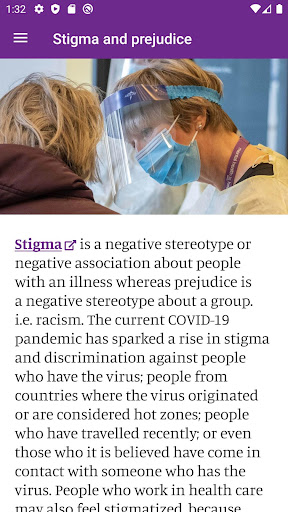  |   |   | 
 |   |   |   | 
 | 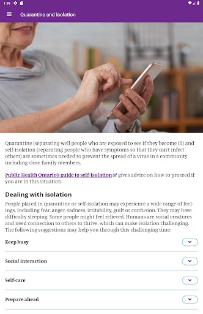  |   |   | 
 |   |   |   | 
 |   |   |   | 
 | 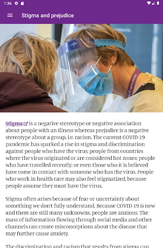  |  

## Development team
In the following we report the main information provided by the development team in the Google play store.

| | |
|-------------------------|-------------------------|
| **Developer**  | Centre for Addiction and Mental Health  (CAMH) |
| **Website**  | - |
| **Email** | scotty@camh.ca |
| **Physical address**  | - |
| **Other developed apps**  | [https://play.google.com/store/apps/developer?id=Centre+for+Addiction+and+Mental+Health++(CAMH)](https://play.google.com/store/apps/developer?id=Centre+for+Addiction+and+Mental+Health++(CAMH)) |

## Android support

| | |
|-------------------------|-------------------------|
| **Declared target Android version**  | Pie, version 9 (API level 28) |
| **Effective target Android version**  | Pie, version 9 (API level 28) |
| **Minimum supported Android version**  | Lollipop, version 5.0 (API level 21) |
| **Maximum target Android version**  | - |

The larger the difference between the minimum and maximum supported Android versions, the better. A larger difference means a wider audience. For example, old phones have a very low Android version, so a high minimum supported Android version means that the app cannot be used by users with old phones, thus leading to accessibility problems. 

## Requested permissions

In the following we report the complete list of the permissions requested by the app. 

| **Permission** | **Protection level** | **Description** | 
|-------------------------|-------------------------|-------------------------|
 **android.permission ACCESS_NETWORK_STATE** | Normal | Allows applications to access information about networks. 
 **android.permission INTERNET** | Normal | Allows applications to open network sockets. 
 **android.permission WRITE_EXTERNAL_STORAGE** | :warning:**Dangerous** | Allows an application to write to external storage. 

## Mentioned servers

| **Server** | **Registrant** | **Registrant country** | **Creation date** | 
|-------------------------|-------------------------|-------------------------|-------------------------|
-

## Security analysis 

Below we report the main security warnings raised by our execution of the [Androwarn](https://github.com/maaaaz/androwarn) security analysis tool.

**Connection interfaces exfiltration**
> - This application reads details about the currently active data network 
> - This application tries to find out if the currently active data network is metered 

**Code execution**
> - This application loads a native library: 'monodroid' 
> - This application loads a native library: 'monosgen-2.0' 
> - This application loads a native library: 'xamarin-app' 
> - This application loads a native library: 'xamarin-debug-app-helper' 

## User ratings and reviews

Below we provide information about how end users are reacting to the app in terms of ratings and reviews in the Google Play store.

### Ratings

The Managing your stress & anxiety app has been installed by more than **500** times. At this time, **-** rated the app and its average score is **0.0**. Below we show the distribution of the ratings across the usual star-based rating of Google Play

:star::star::star::star::star:: 0

:star::star::star::star:: 0

:star::star::star:: 0

:star::star:: 0

:star:: 0

### Reviews 

#### 5-star reviews

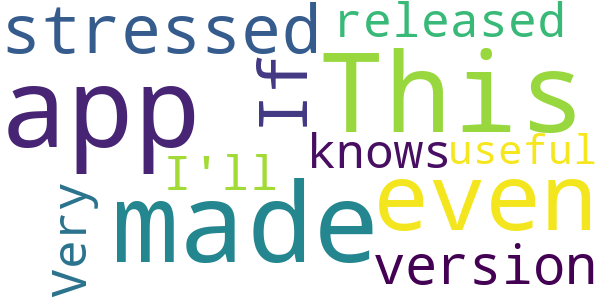

> This app made me even more stressed out. If version 2.0 is released; who knows what I'll do...  :date: __2021-04-01 17:58:22__

> Very useful  :date: __2020-08-11 19:37:06__

#### 4-star reviews

No recent reviews available with 4 stars.

#### 3-star reviews

No recent reviews available with 3 stars.

#### 2-star reviews

No recent reviews available with 2 stars.

#### 1-star reviews

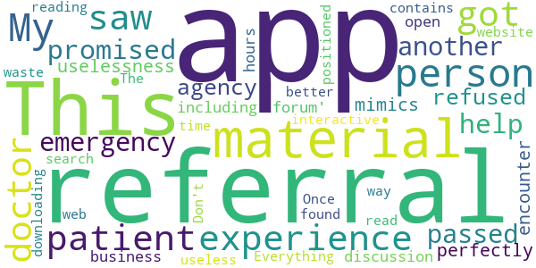

> My only in-person experience as a patient: got a referral, then saw a doctor who promised to help and then, when I had an emergency, he passed me over to another agency that refused his referral. This app perfectly mimics the uselessness of that encounter, including having a 'discussion forum' that's only open during business hours. Everything on the app can be found with a web search. Don't waste your time downloading it.  :date: __2021-01-25 13:48:58__

> The app contains reading material only and is not interactive in any way. Once you read the material, the app is useless. This would be better positioned on a website.  :date: __2021-01-23 15:36:29__

# E-pedia SJD
App version ``1.0.0-34``

Analyzed with [covid-apps-observer](http://github.com/covid-apps-observer) project, version ``0.1``

## App overview
| | |
|-------------------------|-------------------------| 
| **Name**&nbsp;&nbsp;&nbsp;&nbsp;&nbsp;&nbsp;&nbsp;&nbsp;&nbsp;&nbsp;&nbsp;&nbsp;&nbsp;&nbsp;&nbsp;&nbsp;&nbsp;&nbsp;&nbsp;&nbsp;&nbsp;&nbsp;&nbsp;&nbsp;&nbsp;&nbsp;&nbsp;&nbsp;&nbsp;&nbsp;&nbsp;&nbsp;&nbsp;&nbsp;&nbsp;&nbsp;&nbsp;&nbsp;&nbsp;&nbsp;  | E-pedia SJD |
| **Unique identifier** | com.mostrarium.sjd |
| **Link to Google Play** | [https://play.google.com/store/apps/details?id=com.mostrarium.sjd](https://play.google.com/store/apps/details?id=com.mostrarium.sjd) |
| **Summary**  | E-pedia SJD is an App aimed at nurses and nurses. |
| **Privacy policy** | [https://www.sjdhospitalbarcelona.org/ca/politica-privacitat](https://www.sjdhospitalbarcelona.org/ca/politica-privacitat) |
| **Latest version** | 1.0.0-34 |
| **Last update** | 2020-03-23 10:36:43 |
| **Recent changes** | Primera versió |
| **Installs**  | 1,000+ |
| **Category** | Medical |
| **First release** | Mar 23, 2020 |
| **Size**  | 31M |
| **Supported Android version**  | 4.1 and up |

### Description
> Atenció: Aquesta és una versió especial COVID19 de la App E-Pedia, creada per a facilitar la formació i l'actualizació de protocols i circuits a tots els profesionals de l'Hospital Sant Joan de Déu a través de l'apartado COVID-19.
 L'aplicació E-pedia HSJD està dirigida a infermeres i infermers que prestin assistència al pacient pediàtric de forma habitual o esporàdica. Una App professional pionera que els ofereix tota la informació necessària per a la pràctica diària, integrant recursos àgils, actualitzats i basats en evidència científica. El contingut està classificat en:
 Procediments: Documents elaborats per infermeres expertes de l'Hospital Sant Joan de Déu on es descriu la metodologia a seguir per desenvolupar diferents tècniques i activitats infermeres.
 Escales: Eines validades de valoració de gravetat davant diverses situacions clíniques, amb un recompte automatitzat dels valors de l'escala i una avaluació final del resultat.
 Algorismes: Seqüències d'actuació multidisciplinària davant diferents processos de malaltia, que li permetran anticipar-se, millorant la qualitat de l'atenció.
 Taules: Agrupació de contingut d'interès sobre diferents patologies, processos o actuacions.
 Calculadores: Eines validades pel càlcul ràpid de medicació en situacions de reanimació (RCP) i intubació, ritmes d'infusió, pèrdues insensibles, etc. 
 Medicació: Accés directe a la plataforma "Via Parenteral" de l'HSJD, on podrà consultar tot el que necessiti per administrar fàrmacs parenterals (dilució, vies d'administració, incompatibilitats...).
 Vídeos: Accés a contingut audiovisual d'alta qualitat. Vídeos dinàmics, curts i pràctics que donen suport a diferents procediments.
 Favorits: Recull els recursos que més s'adaptin a les teves necessitats per tenir-los a mà fàcilment sempre que necessitis.
 Propietat, autoria i desenvolupament
 L'App E-Pedia SJD ha estat finançada íntegrament per l'Hospital Sant Joan de Déu de Barcelona, propietari de la mateixa.
 La creació de l'App, així com la classificació, selecció i elaboració de part dels continguts correspon als autors:
 - José Manuel Blanco González, Màster en Lideratge i Gestió de Serveis d'Infermeria i Infermer Especialista en Pediatria. Responsable d'Infermeria d'Urgències Pediàtriques de l'Hospital Sant Joan de Déu Barcelona.
 - Ana Gil Carrasco, Màster en Infermeria Escolar i Investigació Infermera. Infermera assistencial d'Urgències Pediàtriques de l'Hospital Sant Joan de Déu Barcelona.
 - Maria del Pilar Hornillos Sánchez, Infermera Especialista en Pediatria i Biòloga. Infermera assistencial d'Urgències Pediàtriques de l'Hospital Sant Joan de Déu Barcelona.
 - Arnau Valls Esteve, Enginyer Superior de Telecomunicacions. Enginyer de R+D a l'Hospital Sant Joan de Déu de Barcelona en les àrees de Salut Digital, 3D i AI.
 Amb la col·laboració de les infermeres de l'HSJD autores dels procediments, tal com figura en cada un d'ells, l'assessorament de companyes i companys infermeres i pediatres i, el suport de la Direcció d'Infermeria, el Departament d'Innovació, el Servei de suport Metodològic Infermer, el Servei de Farmàcia i el Departament d'Audiovisuals de l'HSJD. El disseny i desenvolupament ha estat dut a terme per Mostrarium.

### User interface
The developers of the app provide the following screenshots in the Google play store.
| | | |
|:-------------------------:|:-------------------------:|:-------------------------:|
 |   |   |   | 
 |  

## Development team
In the following we report the main information provided by the development team in the Google play store.

| | |
|-------------------------|-------------------------|
| **Developer**  | Hospital Sant Joan de Déu Barcelona |
| **Website**  | [https://www.sjdhospitalbarcelona.org/](https://www.sjdhospitalbarcelona.org/) |
| **Email** | apps@sjdhospitalbarcelona.org |
| **Physical address**  | - |
| **Other developed apps**  | [https://play.google.com/store/apps/developer?id=Hospital+Sant+Joan+de+D%C3%A9u+Barcelona](https://play.google.com/store/apps/developer?id=Hospital+Sant+Joan+de+D%C3%A9u+Barcelona) |

## Android support

| | |
|-------------------------|-------------------------|
| **Declared target Android version**  | Pie, version 9 (API level 28) |
| **Effective target Android version**  | Pie, version 9 (API level 28) |
| **Minimum supported Android version**  | Jelly Bean, version 4.1.x (API level 16) |
| **Maximum target Android version**  | - |

The larger the difference between the minimum and maximum supported Android versions, the better. A larger difference means a wider audience. For example, old phones have a very low Android version, so a high minimum supported Android version means that the app cannot be used by users with old phones, thus leading to accessibility problems. 

## Requested permissions

In the following we report the complete list of the permissions requested by the app. 

| **Permission** | **Protection level** | **Description** | 
|-------------------------|-------------------------|-------------------------|
 **android.permission ACCESS_COARSE_LOCATION** | :warning:**Dangerous** | Allows an app to access approximate location. 
 **android.permission ACCESS_FINE_LOCATION** | :warning:**Dangerous** | Allows an app to access precise location. 
 **android.permission ACCESS_NETWORK_STATE** | Normal | Allows applications to access information about networks. 
 **android.permission CAMERA** | :warning:**Dangerous** | Required to be able to access the camera device. 
 **android.permission FLASHLIGHT** | - | - 
 **android.permission INTERNET** | Normal | Allows applications to open network sockets. 
 **android.permission READ_EXTERNAL_STORAGE** | :warning:**Dangerous** | Allows an application to read from external storage. 
 **android.permission VIBRATE** | Normal | Allows access to the vibrator. 
 **android.permission WAKE_LOCK** | Normal | Allows using PowerManager WakeLocks to keep processor from sleeping or screen from dimming. 
 **android.permission WRITE_EXTERNAL_STORAGE** | :warning:**Dangerous** | Allows an application to write to external storage. 
 **com.google.android.c2dm.permission RECEIVE** | - | - 
 **com.google.android.finsky.permission BIND_GET_INSTALL_REFERRER_SERVICE** | - | - 
 **com.google.android.providers.gsf.permission READ_GSERVICES** | - | - 

## Mentioned servers

| **Server** | **Registrant** | **Registrant country** | **Creation date** | 
|-------------------------|-------------------------|-------------------------|-------------------------|
 | googlesyndication.com | Google LLC | :us: US | 2003-01-21 06:17:24 |
 | google.com | Google LLC | :us: US | 1997-09-15 04:00:00 |
 | app-measurement.com | Google LLC | :us: US | 2015-06-19 20:13:31 |
 | linkedin.com | LinkedIn Corporation | :us: US | 2002-11-02 15:38:11 |
 | twitter.com | Twitter, Inc. | :us: US | 2000-01-21 16:28:17 |
 | facebook.com | Facebook, Inc. | :us: US | 1997-03-29 05:00:00 |
 | foursquare.com | Foursquare Labs, Inc. | :us: US | 2002-03-26 01:18:55 |
 | youtube.com | Google LLC | :us: US | 2005-02-15 05:13:12 |
 | vimeo.com | Vimeo, Inc. | :us: US | 2004-12-15 08:38:55 |
 | googleadservices.com | Google LLC | :us: US | 2003-06-19 16:34:53 |

## Security analysis 

Below we report the main security warnings raised by our execution of the [Androwarn](https://github.com/maaaaz/androwarn) security analysis tool.

**Connection interfaces exfiltration**
> - This application reads details about the currently active data network 

**Telephony services abuse**
> - This application makes phone calls 

**Pim data leakage**
> - This application accesses the contacts list 

**Code execution**
> - This application loads a native library: 'iconv' 
> - This application loads a native library: 'jniPdfium' 
> - This application loads a native library: 'modft2' 
> - This application loads a native library: 'modpdfium' 
> - This application loads a native library: 'modpng' 
> - This application loads a native library: 'zbarjni' 

## User ratings and reviews

Below we provide information about how end users are reacting to the app in terms of ratings and reviews in the Google Play store.

### Ratings

The E-pedia SJD app has been installed by more than **1000** times. At this time, **21** rated the app and its average score is **4.6666665**. Below we show the distribution of the ratings across the usual star-based rating of Google Play

:star::star::star::star::star:: 16

:star::star::star::star:: 3

:star::star::star:: 2

:star::star:: 0

:star:: 0

### Reviews 

#### 5-star reviews

No recent reviews available with 5 stars.

#### 4-star reviews

No recent reviews available with 4 stars.

#### 3-star reviews

No recent reviews available with 3 stars.

#### 2-star reviews

No recent reviews available with 2 stars.

#### 1-star reviews

No recent reviews available with 1 stars.

# Credits

This project makes use of the following main third-party projects:
* Androguard: [https://github.com/androguard/androguard](https://github.com/androguard/androguard)
* Androwarn: [https://github.com/maaaaz/androwarn](https://github.com/maaaaz/androwarn)
* google_play_scraper: [https://github.com/JoMingyu/google-play-scraper](https://github.com/JoMingyu/google-play-scraper)
* whois: [https://github.com/DannyCork/python-whois](https://github.com/DannyCork/python-whois)
* BeautifulSoup: [https://www.crummy.com/software/BeautifulSoup](https://www.crummy.com/software/BeautifulSoup)

Other open-source projects used in this project include: 

- androguard==3.3.5
- appnope==0.1.0
- asn1crypto==1.3.0
- backcall==0.1.0
- beautifulsoup4==4.9.0
- bs4==0.0.1
- certifi==2020.4.5.1
- cffi==1.14.0
- chardet==3.0.4
- click==7.1.2
- colorama==0.4.3
- cryptography==2.9.2
- cycler==0.10.0
- decorator==4.4.2
- future==0.18.2
- google-play-scraper==0.1.1
- idna==2.9
- ipython==7.13.0
- ipython-genutils==0.2.0
- jedi==0.17.0
- Jinja2==2.11.2
- joblib==0.14.1
- kiwisolver==1.2.0
- lxml==4.5.0
- MarkupSafe==1.1.1
- matplotlib==3.2.1
- networkx==2.4
- nltk==3.5
- numpy==1.18.3
- parso==0.7.0
- pexpect==4.8.0
- pickleshare==0.7.5
- Pillow==7.1.2
- play-scraper==0.6.0
- prompt-toolkit==3.0.5
- ptyprocess==0.6.0
- pycountry==19.8.18
- pycparser==2.20
- pydot==1.4.1
- Pygments==2.6.1
- pyOpenSSL==19.1.0
- pyparsing==2.4.7
- python-dateutil==2.8.1
- regex==2020.4.4
- requests==2.23.0
- requests-futures==1.0.0
- six==1.14.0
- soupsieve==2.0
- tld==0.12.1
- tqdm==4.45.0
- traitlets==4.3.3
- urllib3==1.25.9
- wcwidth==0.1.9
- wordcloud==1.7.0

